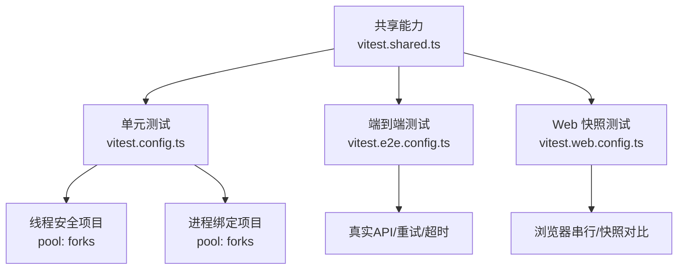
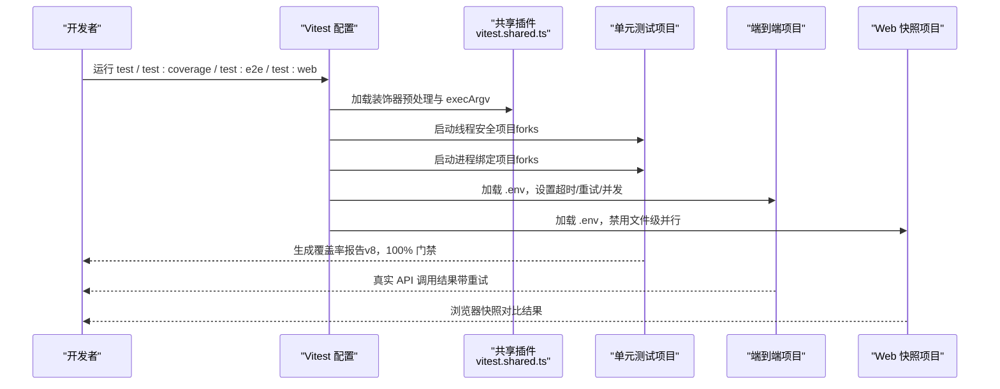
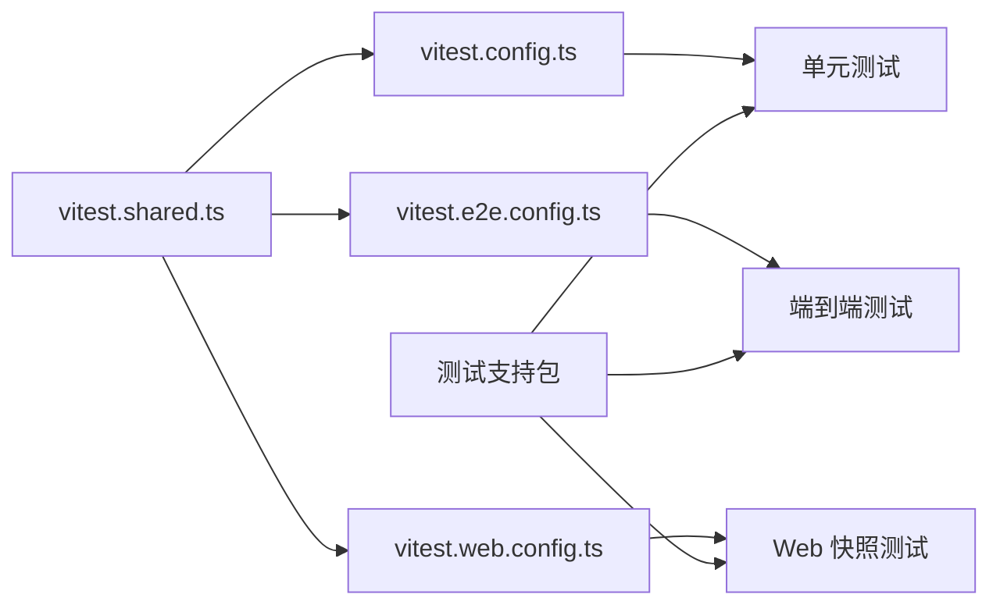

# 单元测试方法

<cite>
**本文引用的文件**
- [vitest.config.ts](file://vitest.config.ts)
- [vitest.shared.ts](file://vitest.shared.ts)
- [vitest.e2e.config.ts](file://vitest.e2e.config.ts)
- [vitest.web.config.ts](file://vitest.web.config.ts)
- [testing.md](file://docs/testing.md)
- [args.spec.ts](file://apps/cli/tests/args.spec.ts)
- [index.ts（ACP 快照套件）](file://packages/test-support/acp-snapshot/src/index.ts)
- [index.ts（Agent Loop 测试依赖）](file://packages/test-support/agent-loop-testkit/src/index.ts)
- [fixtures.ts（客户端运行时夹具）](file://packages/test-support/client-runtime/src/fixtures.ts)
</cite>

## 目录
1. [简介](#简介)
2. [项目结构](#项目结构)
3. [核心组件](#核心组件)
4. [架构总览](#架构总览)
5. [详细组件分析](#详细组件分析)
6. [依赖关系分析](#依赖关系分析)
7. [性能与稳定性考虑](#性能与稳定性考虑)
8. [故障排查指南](#故障排查指南)
9. [结论](#结论)
10. [附录：快速上手清单](#附录快速上手清单)

## 简介
本文件面向“工具”的单元测试实践，聚焦于如何在当前仓库中高效编写、运行与维护测试。内容涵盖：
- 使用 Vitest 进行单元、端到端与浏览器快照测试的配置与执行
- Mock 依赖、测试夹具与固定数据的使用策略
- 测试用例设计原则：覆盖不同输入场景与边界条件
- 异步测试处理：Promise 与回调函数的断言方式
- 覆盖率要求与最佳实践（严格的每文件 100% 阈值）
- 利用项目提供的测试支持包（ACP 快照、Agent Loop 测试依赖、客户端运行时夹具等）提升开发效率

## 项目结构
仓库采用多配置分层的测试体系：
- 单元测试：基于根 vitest.config.ts，按线程安全与进程绑定两类项目并行执行，严格覆盖率门禁
- 端到端测试：独立 vitest.e2e.config.ts，针对真实 API 调用，具备重试与超时控制
- Web 浏览器快照：vitest.web.config.ts，串行运行以共享浏览器实例，配合快照对比
- 共享能力：vitest.shared.ts 提供装饰器预处理与 Node 环境标志统一

图表来源
- [vitest.config.ts:117-159](file://vitest.config.ts#L117-L159)
- [vitest.e2e.config.ts:31-57](file://vitest.e2e.config.ts#L31-L57)
- [vitest.web.config.ts:16-34](file://vitest.web.config.ts#L16-L34)
- [vitest.shared.ts:1-43](file://vitest.shared.ts#L1-L43)

章节来源
- [vitest.config.ts:85-159](file://vitest.config.ts#L85-L159)
- [vitest.e2e.config.ts:1-59](file://vitest.e2e.config.ts#L1-L59)
- [vitest.web.config.ts:1-36](file://vitest.web.config.ts#L1-L36)
- [vitest.shared.ts:1-43](file://vitest.shared.ts#L1-L43)

## 核心组件
- 测试入口与包含规则：通过 include 指定 tests/**/*.spec.{ts,tsx} 与 scripts/**/*.spec.ts，确保测试与源码就近放置
- 双项目隔离：将易受进程全局状态影响的测试分离到 process-bound 项目，避免并发干扰
- 覆盖率门禁：v8 提供者，perFile 开启，语句/分支/函数/行均要求 100%，未覆盖路径会输出精确位置报告
- 装饰器预处理：在 Vite 解析前对 TypeScript 装饰器进行转译，保证测试可正确加载含装饰器的模块
- 环境变量与环境文件：E2E/Web 配置自动加载 .env（若存在），便于本地注入密钥或开关

章节来源
- [vitest.config.ts:85-159](file://vitest.config.ts#L85-L159)
- [vitest.config.ts:160-283](file://vitest.config.ts#L160-L283)
- [vitest.shared.ts:15-42](file://vitest.shared.ts#L15-L42)
- [vitest.e2e.config.ts:1-14](file://vitest.e2e.config.ts#L1-L14)
- [vitest.web.config.ts:1-14](file://vitest.web.config.ts#L1-L14)

## 架构总览
下图展示了从测试配置到具体测试执行的流程，以及关键支撑能力的位置与作用。

图表来源
- [vitest.config.ts:117-159](file://vitest.config.ts#L117-L159)
- [vitest.e2e.config.ts:31-57](file://vitest.e2e.config.ts#L31-L57)
- [vitest.web.config.ts:16-34](file://vitest.web.config.ts#L16-L34)
- [vitest.shared.ts:1-43](file://vitest.shared.ts#L1-L43)

## 详细组件分析

### 单元测试配置与执行（vitest.config.ts）
- 测试包含范围：packages/*/tests、apps/*/tests、examples/*/tests、scripts/**/*.spec.ts
- 双项目隔离：thread-safe 与 process-bound，分别控制 include/exclude，避免进程全局状态污染
- 覆盖率：v8 提供者，perFile 开启，100% 阈值；CI 下输出精确未覆盖位置报告
- Windows 适配：排除不支持的包与测试，避免跨平台误报
- 装饰器与路径解析：通过 vite-tsconfig-paths 指向 tsconfig.base.json，确保源码平面解析

章节来源
- [vitest.config.ts:85-159](file://vitest.config.ts#L85-L159)
- [vitest.config.ts:160-283](file://vitest.config.ts#L160-L283)

### 共享能力（vitest.shared.ts）
- 标准装饰器预处理：在 Vite 默认解析前转译装饰器，兼容 TS 装饰语法
- execArgv 统一：为 Worker 添加 --no-webstorage，避免 Node Web Storage 与 jsdom 冲突

章节来源
- [vitest.shared.ts:1-43](file://vitest.shared.ts#L1-L43)

### 端到端测试（vitest.e2e.config.ts）
- 目标：真实 API 调用，适合冒烟与契约验证
- 特性：自动加载 .env、较长超时、重试机制、可控并发（DSH_E2E_MAX_WORKERS）
- 包含范围：packages/*/tests/*.e2e.ts、apps/cli/tests/*.e2e.ts、examples/*/tests/*.e2e.ts

章节来源
- [vitest.e2e.config.ts:1-59](file://vitest.e2e.config.ts#L1-L59)

### Web 快照测试（vitest.web.config.ts）
- 目标：浏览器交互与渲染快照对比
- 特性：串行执行（fileParallelism: false）、较长超时、自动加载 .env
- 包含范围：apps/web/tests/*.e2e.ts、*.snapshot.ts

章节来源
- [vitest.web.config.ts:1-36](file://vitest.web.config.ts#L1-L36)

### 测试策略与规范（docs/testing.md）
- 分层测试：单元、覆盖率门禁、真实 API e2e、快照、Web 浏览器快照
- 优先真实实现：仅对昂贵或非确定性边界做 mock（LLM 适配器、网络、时钟）
- 验证世界而非自报告：外部断言、字节级一致性检查
- 测试真实入口：以构建产物为准，避免 tsx 掩盖问题
- 子进程启动模式：CI 与构建通道统一通过双模式启动器，避免手工 --import tsx
- 快照必要性：非平凡变更需补充键无关场景，维护 JSONL 与预期输出

章节来源
- [testing.md:7-49](file://docs/testing.md#L7-L49)

### 示例：CLI 参数解析测试（apps/cli/tests/args.spec.ts）
- 使用 vi.spyOn 拦截 process.exit 与 stdout/stderr.write，捕获退出码并抑制输出
- 覆盖路由、转发、错误拒绝、帮助版本等多类场景
- 体现“最小化副作用 + 明确断言”的测试风格

章节来源
- [args.spec.ts:1-107](file://apps/cli/tests/args.spec.ts#L1-L107)

### 测试支持包
- ACP 快照套件（packages/test-support/acp-snapshot/src/index.ts）
  - 提供 launchAcpTestAgent、runScenario、defineAcpSnapshotSuite 等能力
  - 用于键无关的端到端快照回归，标准化输出与会话日志
- Agent Loop 测试依赖（packages/test-support/agent-loop-testkit/src/index.ts）
  - 挂载 LLM、Session、SystemPrompt、ToolRuntime、AgentRegistry 等前置服务
  - 保持测试对加载顺序与拓扑的控制权，便于隔离被测对象
- 客户端运行时夹具（packages/test-support/client-runtime/src/fixtures.ts）
  - 提供会话与工作区默认快照、行为覆盖类型与稳定化封装
  - 便于 UI/状态相关测试快速构造稳定上下文

章节来源
- [index.ts（ACP 快照套件）:1-54](file://packages/test-support/acp-snapshot/src/index.ts#L1-L54)
- [index.ts（Agent Loop 测试依赖）:1-47](file://packages/test-support/agent-loop-testkit/src/index.ts#L1-L47)
- [fixtures.ts（客户端运行时夹具）:1-90](file://packages/test-support/client-runtime/src/fixtures.ts#L1-L90)

## 依赖关系分析
- 配置层依赖：所有测试配置共享 vitest.shared.ts 的装饰器与 execArgv 能力
- 测试层依赖：单元测试、E2E、Web 快照各自定义 include/exclude 与并发策略
- 支持层依赖：测试支持包被各层按需引入，提供通用夹具与编排能力
- 外部依赖：E2E/Web 可能加载 .env 注入密钥；Windows 平台有特定排除项

图表来源
- [vitest.shared.ts:1-43](file://vitest.shared.ts#L1-L43)
- [vitest.config.ts:117-159](file://vitest.config.ts#L117-L159)
- [vitest.e2e.config.ts:31-57](file://vitest.e2e.config.ts#L31-L57)
- [vitest.web.config.ts:16-34](file://vitest.web.config.ts#L16-L34)

## 性能与稳定性考虑
- 并发与隔离：线程安全项目使用 fork 池，进程绑定测试单独隔离，降低竞争与全局状态影响
- 超时与重试：E2E 配置提高超时并启用重试，缓解瞬时失败
- 覆盖率门禁：100% 阈值促使补齐边缘路径，但需结合业务判断是否为死代码
- 平台差异：Windows 排除不兼容包与测试，避免误报；CI 与本地保持一致性

章节来源
- [vitest.config.ts:103-159](file://vitest.config.ts#L103-L159)
- [vitest.e2e.config.ts:46-57](file://vitest.e2e.config.ts#L46-L57)
- [vitest.config.ts:160-283](file://vitest.config.ts#L160-L283)

## 故障排查指南
- 覆盖率不达标：查看 v8 报告中的精确未覆盖位置；确认是否属于已豁免范围（如类型文件、入口脚本、客户端 UI 债务区）
- 进程相关测试不稳定：检查是否落入 process-bound 项目；必要时拆分以避免并发干扰
- Windows 平台跳过：确认是否在排除列表中；如需运行，需在原生 pwsh 环境下
- E2E 失败：检查 .env 是否加载成功；调整 DSH_E2E_MAX_WORKERS 降低并发；关注重试次数与超时
- Web 快照不一致：确认浏览器环境一致；仅在本地记录/刷新快照，CI 强制只读回放

章节来源
- [vitest.config.ts:160-283](file://vitest.config.ts#L160-L283)
- [vitest.e2e.config.ts:1-14](file://vitest.e2e.config.ts#L1-L14)
- [vitest.web.config.ts:1-14](file://vitest.web.config.ts#L1-L14)

## 结论
本项目以 Vitest 为核心，构建了分层清晰、覆盖严格、跨平台稳定的测试体系。通过双项目隔离、覆盖率门禁、真实 API 与快照回归，以及丰富的测试支持包，能够高效保障工具与系统的正确性与可维护性。遵循“优先真实实现、最小化 mock、严格断言世界状态”的原则，可在复杂系统中持续交付高质量代码。

## 附录：快速上手清单
- 编写单元测试
  - 将 spec 放在对应包的 tests 目录下，命名 *.spec.ts
  - 使用 describe/it/expect 组织用例；对副作用使用 vi.spyOn/vi.mock
  - 参考 CLI 参数解析测试的退出码捕获与输出抑制技巧
- 编写端到端测试
  - 使用 *.e2e.ts 命名；通过 vitest.e2e.config.ts 运行
  - 准备 .env 或环境变量；合理设置超时与重试
- 编写 Web 快照测试
  - 使用 apps/web/tests 下的 *.e2e.ts 与 *.snapshot.ts
  - 本地记录/刷新快照，CI 只回放对比
- 使用测试支持包
  - ACP 快照：launchAcpTestAgent/runScenario/defineAcpSnapshotSuite
  - Agent Loop：mountAgentLoopTestDependencies 挂载前置服务
  - 客户端夹具：conversationSnapshot/workspaceListState 快速构造状态
- 覆盖率与门禁
  - 运行 coverage 任务；确保 perFile 100%
  - 对确属死代码或暂不可测区域，需给出理由并纳入豁免

章节来源
- [args.spec.ts:1-107](file://apps/cli/tests/args.spec.ts#L1-L107)
- [index.ts（ACP 快照套件）:1-54](file://packages/test-support/acp-snapshot/src/index.ts#L1-L54)
- [index.ts（Agent Loop 测试依赖）:1-47](file://packages/test-support/agent-loop-testkit/src/index.ts#L1-L47)
- [fixtures.ts（客户端运行时夹具）:1-90](file://packages/test-support/client-runtime/src/fixtures.ts#L1-L90)
- [vitest.config.ts:160-283](file://vitest.config.ts#L160-L283)