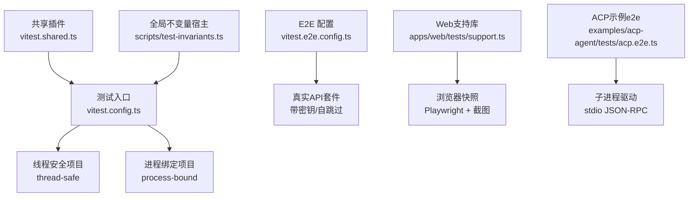
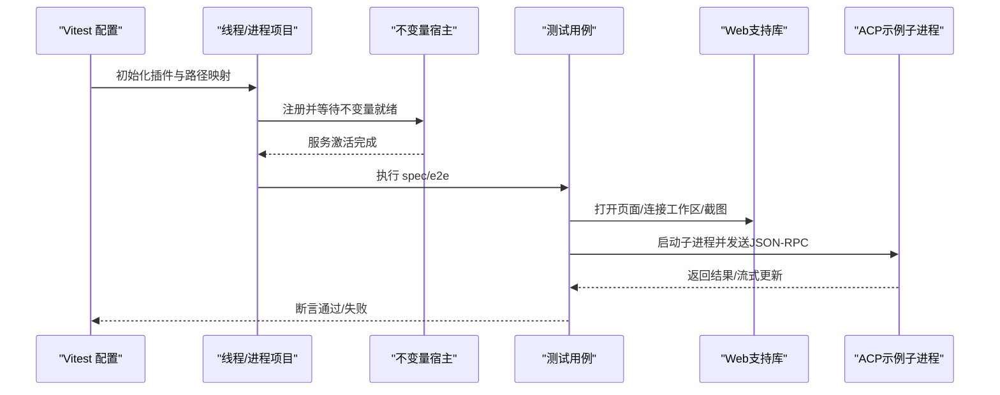
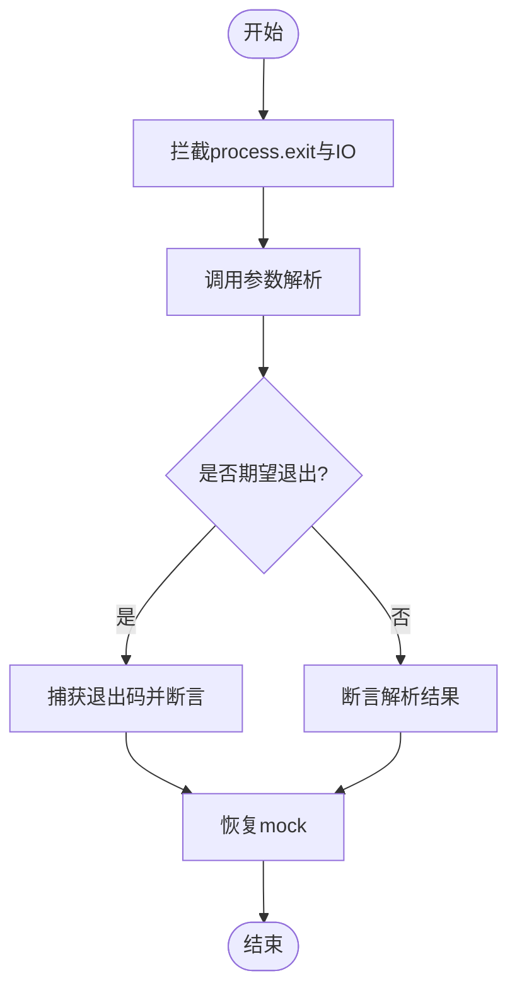
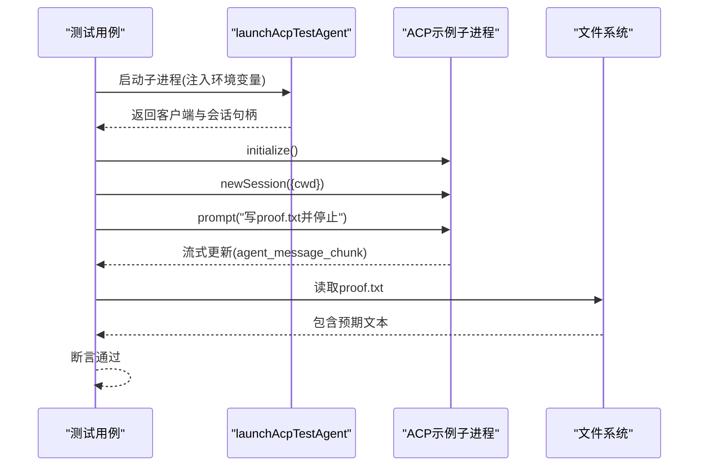
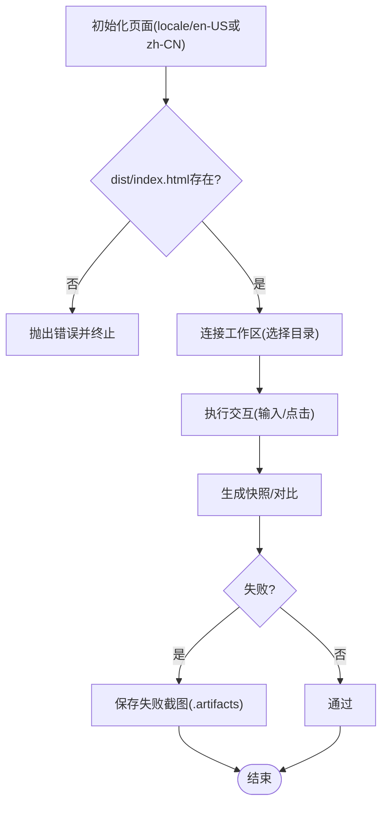
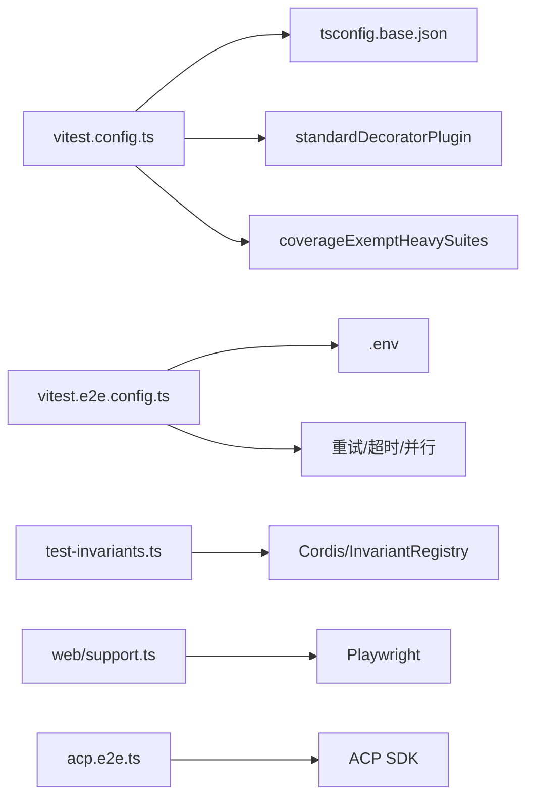

# 工具测试与调试

<cite>
**本文引用的文件**
- [docs/testing.md](file://docs/testing.md)
- [vitest.config.ts](file://vitest.config.ts)
- [vitest.e2e.config.ts](file://vitest.e2e.config.ts)
- [vitest.shared.ts](file://vitest.shared.ts)
- [scripts/test-invariants.ts](file://scripts/test-invariants.ts)
- [apps/cli/tests/args.spec.ts](file://apps/cli/tests/args.spec.ts)
- [apps/web/tests/support.ts](file://apps/web/tests/support.ts)
- [examples/acp-agent/tests/acp.e2e.ts](file://examples/acp-agent/tests/acp.e2e.ts)
- [packages/test-support/README.md](file://packages/test-support/README.md)
- [packages/test-support/llm-mock-server/README.md](file://packages/test-support/llm-mock-server/README.md)
</cite>

## 目录
1. [简介](#简介)
2. [项目结构](#项目结构)
3. [核心组件](#核心组件)
4. [架构总览](#架构总览)
5. [详细组件分析](#详细组件分析)
6. [依赖分析](#依赖分析)
7. [性能考虑](#性能考虑)
8. [故障排查指南](#故障排查指南)
9. [结论](#结论)
10. [附录](#附录)

## 简介
本文件面向开发者，系统化说明该仓库的测试与调试方法：单元测试、集成测试、端到端测试、快照测试、覆盖率门禁、浏览器自动化测试、模拟依赖、断言策略、错误追踪与性能分析。内容基于仓库现有配置与测试实现，提供可操作的实践指引与图示化流程。

## 项目结构
仓库采用分层测试策略：
- 单元测试：Vitest 在 packages/*/tests 与 scripts/*.spec.ts 运行，强调边缘路径、并发竞态、事件顺序与契约回归。
- 覆盖率门禁：按文件 100% 行/分支/函数/语句覆盖，排除类型或无需覆盖的路径。
- 真实 API 端到端：带密钥的 e2e，自跳过无密钥环境，保障 CI 绿色。
- 快照测试：无密钥场景覆盖外部行为（协议、呈现、持久化日志）。
- Web 浏览器快照：Chromium 回放对比，CI 只读模式，本地录制更新。

**图表来源**
- [vitest.config.ts:117-159](file://vitest.config.ts#L117-L159)
- [vitest.e2e.config.ts:31-57](file://vitest.e2e.config.ts#L31-L57)
- [vitest.shared.ts:11-42](file://vitest.shared.ts#L11-L42)
- [scripts/test-invariants.ts:158-209](file://scripts/test-invariants.ts#L158-L209)
- [apps/web/tests/support.ts:34-88](file://apps/web/tests/support.ts#L34-L88)
- [examples/acp-agent/tests/acp.e2e.ts:14-28](file://examples/acp-agent/tests/acp.e2e.ts#L14-L28)

**章节来源**
- [docs/testing.md:7-15](file://docs/testing.md#L7-L15)
- [vitest.config.ts:117-159](file://vitest.config.ts#L117-L159)
- [vitest.e2e.config.ts:31-57](file://vitest.e2e.config.ts#L31-L57)

## 核心组件
- 测试框架与解析
  - Vitest 多项目：线程安全与进程绑定两类执行池，避免进程级状态污染。
  - tsconfig 路径映射：确保源码解析优先于构建产物，避免单例重复加载。
  - 装饰器预转换：统一 TypeScript 装饰器转译，保证 v8 覆盖率准确。
- 覆盖率门禁
  - 按文件 100% 阈值，严格报告未覆盖位置；针对平台差异与特殊入口做豁免。
- 全局不变量宿主
  - 自动挂载各包 invariant 伴随插件，确保服务启动顺序与契约校验。
- E2E 配置
  - 独立配置文件，加载 .env，设置超时、重试、并行度，仅包含 e2e 用例。
- Web 测试支持
  - 提供构建产物检测、端口探测、工作区连接、失败截图等能力。
- ACP 端到端
  - 通过子进程启动示例 Agent，使用 stdio JSON-RPC 驱动，验证世界状态（文件系统）而非自我报告。

**章节来源**
- [vitest.config.ts:15-19](file://vitest.config.ts#L15-L19)
- [vitest.config.ts:160-283](file://vitest.config.ts#L160-L283)
- [vitest.shared.ts:11-42](file://vitest.shared.ts#L11-L42)
- [scripts/test-invariants.ts:158-209](file://scripts/test-invariants.ts#L158-L209)
- [vitest.e2e.config.ts:5-14](file://vitest.e2e.config.ts#L5-L14)
- [apps/web/tests/support.ts:34-88](file://apps/web/tests/support.ts#L34-L88)
- [examples/acp-agent/tests/acp.e2e.ts:14-28](file://examples/acp-agent/tests/acp.e2e.ts#L14-L28)

## 架构总览
下图展示从测试入口到具体执行层的关键交互：Vitest 配置定义项目与插件，全局不变量宿主拦截并编排插件生命周期，E2E 配置负责真实 API 套件，Web 支持库驱动浏览器，ACP 示例通过子进程与 JSON-RPC 通信。

**图表来源**
- [vitest.config.ts:117-159](file://vitest.config.ts#L117-L159)
- [scripts/test-invariants.ts:158-209](file://scripts/test-invariants.ts#L158-L209)
- [apps/web/tests/support.ts:34-88](file://apps/web/tests/support.ts#L34-L88)
- [examples/acp-agent/tests/acp.e2e.ts:42-97](file://examples/acp-agent/tests/acp.e2e.ts#L42-L97)

## 详细组件分析

### 单元测试：CLI 参数解析
- 目标：验证命令行参数路由、帮助/版本输出、非法输入拒绝。
- 方法：
  - 使用 vi.spyOn 拦截 process.exit/stdout/stderr，捕获退出码与输出。
  - 构造多种 argv 组合，断言解析结果与边界行为。
  - afterEach 恢复所有 mock，避免跨用例污染。
- 设计要点：
  - 覆盖正常流程、边界情况（空参数、冲突标志）、错误场景（未知标志、缺失必需项）。
  - 保持测试与实现同域，便于维护。

**图表来源**
- [apps/cli/tests/args.spec.ts:6-21](file://apps/cli/tests/args.spec.ts#L6-L21)
- [apps/cli/tests/args.spec.ts:23-105](file://apps/cli/tests/args.spec.ts#L23-L105)

**章节来源**
- [apps/cli/tests/args.spec.ts:1-107](file://apps/cli/tests/args.spec.ts#L1-L107)

### 集成测试：ACP 端到端（真实子进程）
- 目标：以真实子进程运行示例 Agent，通过 stdio JSON-RPC 驱动会话，验证世界状态（如写入文件）。
- 方法：
  - 使用 launchAcpTestAgent 启动子进程，注入必要环境变量（含最小可用密钥占位）。
  - initialize/newSession/prompt 调用，断言停止原因与流式更新。
  - 读取工作区文件，确认副作用存在。
- 设计要点：
  - 自跳过机制：无密钥时跳过真实模型调用，保留无密钥通道测试。
  - 资源清理：afterEach 中销毁子进程与工作目录，避免泄漏。

**图表来源**
- [examples/acp-agent/tests/acp.e2e.ts:14-28](file://examples/acp-agent/tests/acp.e2e.ts#L14-L28)
- [examples/acp-agent/tests/acp.e2e.ts:42-97](file://examples/acp-agent/tests/acp.e2e.ts#L42-L97)
- [examples/acp-agent/tests/acp.e2e.ts:100-126](file://examples/acp-agent/tests/acp.e2e.ts#L100-L126)

**章节来源**
- [examples/acp-agent/tests/acp.e2e.ts:1-127](file://examples/acp-agent/tests/acp.e2e.ts#L1-L127)

### Web 浏览器快照测试
- 目标：回放浏览器行为并与快照对比，确保 UI 呈现稳定。
- 方法：
  - 使用 support 模块创建页面、探测空闲端口、连接工作区、保存失败截图。
  - 强制英文/中文 locale，保证定位器与黄金值一致。
  - CI 只读模式，禁止写入期望输出；本地录制需人工审查差异。
- 设计要点：
  - 构建产物检查：若 dist 不存在则快速失败，避免用旧包测试。
  - 失败证据：自动保存完整页面截图至 .artifacts，便于定位问题。

**图表来源**
- [apps/web/tests/support.ts:34-88](file://apps/web/tests/support.ts#L34-L88)
- [apps/web/tests/support.ts:112-121](file://apps/web/tests/support.ts#L112-L121)

**章节来源**
- [apps/web/tests/support.ts:1-136](file://apps/web/tests/support.ts#L1-L136)

### 模拟依赖与确定性测试
- LLM 模拟服务器：
  - 提供 OpenAI 兼容 HTTP/SSE 接口，支持多种故障序列（断开、部分数据、速率限制、认证错误等）。
  - 用于测试适配器、代理循环与恢复策略，无需真实密钥。
  - CLI 与库均暴露行为脚本、随机权重、时序控制选项。
- 使用建议：
  - 将 DEEPSEEK_BASE_URL 指向模拟服务，DEEPSEEK_API_KEY 设为任意值。
  - 通过 --sequence 或 random 模式注入压力与异常路径，验证健壮性。

**章节来源**
- [packages/test-support/llm-mock-server/README.md:1-87](file://packages/test-support/llm-mock-server/README.md#L1-L87)

### 全局不变量与契约校验
- 作用：
  - 自动发现并挂载各包的 invariant 伴随插件，确保服务启动顺序与契约生效。
  - 拦截 RegistryService.plugin，将插件启动与“不变量就绪”屏障串联，避免竞态。
- 适用场景：
  - 普通测试根自动挂载所属包 companion；拓扑测试挂载全部 companion 以覆盖全量注册。
  - 对附件存储等关键服务提供测试替身，限制媒体大小与类型，防止误用。

**章节来源**
- [scripts/test-invariants.ts:158-209](file://scripts/test-invariants.ts#L158-L209)
- [scripts/test-invariants.ts:227-273](file://scripts/test-invariants.ts#L227-L273)

## 依赖分析
- 测试配置依赖
  - vitest.config.ts 依赖 tsconfigPaths、标准装饰器插件、覆盖率豁免脚本。
  - vitest.e2e.config.ts 依赖 .env 加载、并行度控制、超时与重试策略。
- 运行时依赖
  - 不变量宿主依赖 Cordis 服务与 InvariantRegistry。
  - Web 测试依赖 Playwright 与 Node 文件系统。
  - ACP 测试依赖 @deepseek-ai/dsh-acp-snapshot 与 ACP SDK。
- 外部依赖
  - 覆盖率报告使用 v8 与自定义 reporter。
  - 浏览器测试使用 Chromium（CI 固定只读模式）。

**图表来源**
- [vitest.config.ts:1-8](file://vitest.config.ts#L1-L8)
- [vitest.e2e.config.ts:1-14](file://vitest.e2e.config.ts#L1-L14)
- [scripts/test-invariants.ts:8-18](file://scripts/test-invariants.ts#L8-L18)
- [apps/web/tests/support.ts:1-10](file://apps/web/tests/support.ts#L1-L10)
- [examples/acp-agent/tests/acp.e2e.ts:6-12](file://examples/acp-agent/tests/acp.e2e.ts#L6-L12)

**章节来源**
- [vitest.config.ts:1-286](file://vitest.config.ts#L1-L286)
- [vitest.e2e.config.ts:1-59](file://vitest.e2e.config.ts#L1-L59)
- [scripts/test-invariants.ts:1-274](file://scripts/test-invariants.ts#L1-L274)

## 性能考虑
- 并行与隔离
  - 线程安全项目使用 forks 池，避免 Node 24 在 worker 线程的已知崩溃。
  - 进程绑定测试单独项目，减少进程级状态干扰。
- 覆盖率开销
  - 覆盖率门禁按文件 100%，对重型套件在特定环境下豁免，平衡速度与质量。
- 网络与 I/O
  - E2E 增加超时与重试，降低瞬态失败影响；合理设置 maxWorkers 控制并发。
- 浏览器测试
  - 固定视口与语言，减少渲染抖动；失败截图提升定位效率。

[本节为通用指导，不直接分析具体文件]

## 故障排查指南
- 常见失败与定位
  - 构建产物缺失：Web 测试会快速失败并提示先构建；检查 dist/index.html。
  - 端口占用：使用 probeFreePort 获取空闲端口，避免冲突。
  - 快照差异：CI 只读模式，本地录制后需人工审查 diff；关注时间戳与动态字段。
  - 子进程泄漏：确保 afterEach 清理 spawned 与工作目录。
- 日志与追踪
  - 覆盖率未达标：查看自定义 reporter 输出的精确位置记录。
  - 协议污染：ACP 测试断言 stdout 仅包含 JSON-RPC 帧，非 JSON 行表示日志泄露。
- 恢复与重试
  - E2E 配置启用重试与较长超时，适合不稳定网络或配额限制场景。

**章节来源**
- [apps/web/tests/support.ts:34-55](file://apps/web/tests/support.ts#L34-L55)
- [examples/acp-agent/tests/acp.e2e.ts:42-66](file://examples/acp-agent/tests/acp.e2e.ts#L42-L66)
- [vitest.config.ts:273-283](file://vitest.config.ts#L273-L283)
- [vitest.e2e.config.ts:46-56](file://vitest.e2e.config.ts#L46-L56)

## 结论
该仓库建立了完整的测试金字塔：单元、集成、端到端与快照测试协同，配合覆盖率门禁与浏览器自动化，确保代码质量与用户体验。通过模拟依赖与全局不变量，测试既高效又可靠。遵循本文实践，可有效编写与维护高质量测试用例，快速定位与修复问题。

## 附录
- 测试命令参考
  - 单元测试：pnpm run test
  - 覆盖率门禁：pnpm run test:coverage
  - 真实 API e2e：pnpm run test:e2e
  - 快照测试：pnpm run test:snapshot / :record / :refresh
  - Web 浏览器测试：pnpm run test:web
- 环境与密钥
  - E2E 支持 .env 与环境变量；无密钥时套件自跳过。
  - 模拟 LLM 服务可通过 DEEPSEEK_BASE_URL 与任意 API Key 接入。

**章节来源**
- [docs/testing.md:7-15](file://docs/testing.md#L7-L15)
- [vitest.e2e.config.ts:5-14](file://vitest.e2e.config.ts#L5-L14)
- [packages/test-support/llm-mock-server/README.md:9-29](file://packages/test-support/llm-mock-server/README.md#L9-L29)