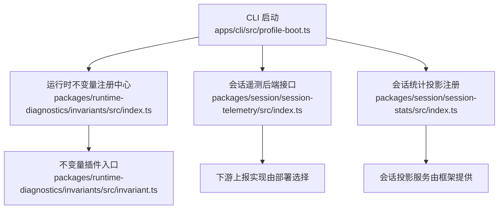
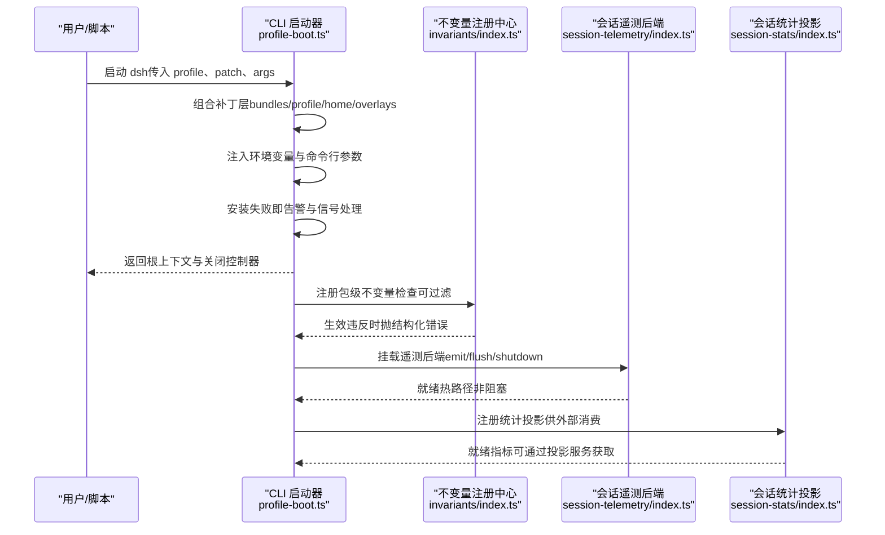
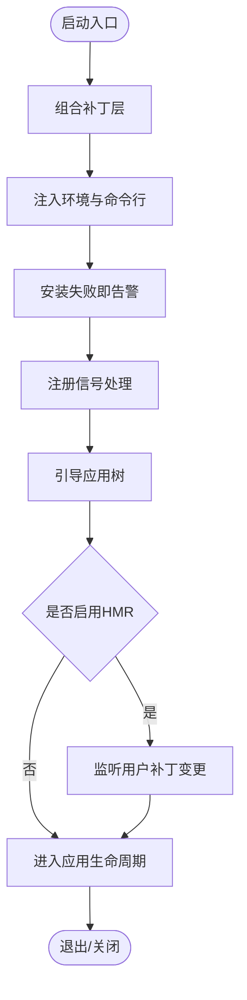
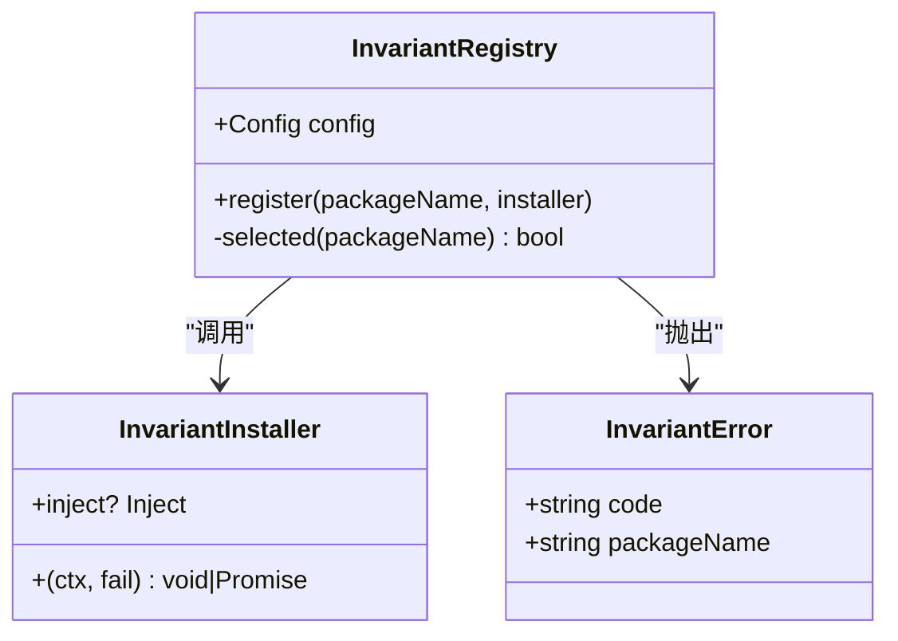
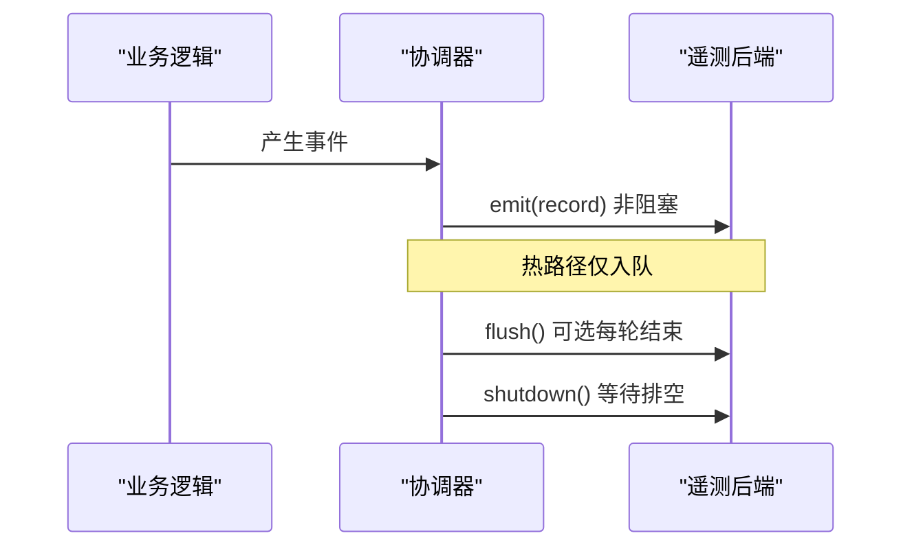
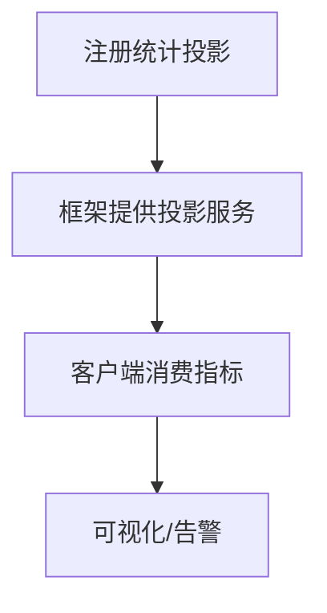
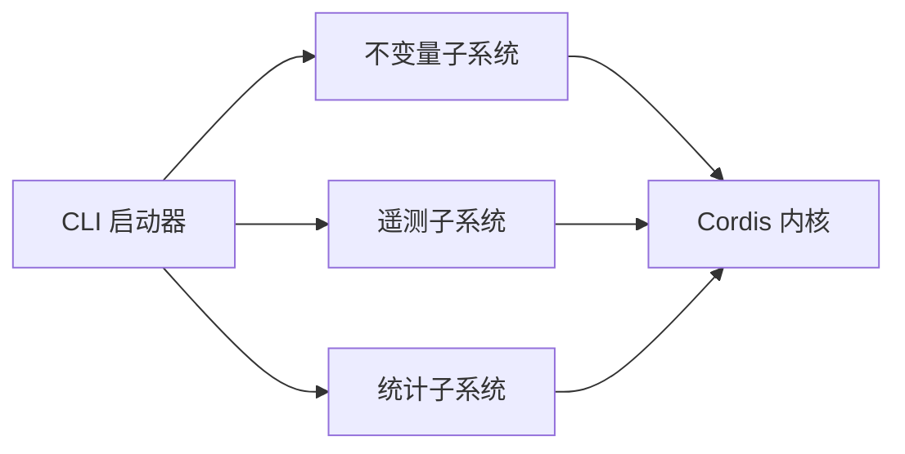

# 调试与性能分析

<cite>
**本文引用的文件**
- [profile-boot.ts](file://apps/cli/src/profile-boot.ts)
- [index.ts（运行时不变量注册中心）](file://packages/runtime-diagnostics/invariants/src/index.ts)
- [invariant.ts（运行时不变量插件入口）](file://packages/runtime-diagnostics/invariants/src/invariant.ts)
- [index.ts（会话遥测后端接口）](file://packages/session/session-telemetry/src/index.ts)
- [index.ts（会话统计投影注册）](file://packages/session/session-stats/src/index.ts)
</cite>

## 目录
1. [简介](#简介)
2. [项目结构](#项目结构)
3. [核心组件](#核心组件)
4. [架构总览](#架构总览)
5. [详细组件分析](#详细组件分析)
6. [依赖关系分析](#依赖关系分析)
7. [性能注意事项](#性能注意事项)
8. [故障排查指南](#故障排查指南)
9. [结论](#结论)
10. [附录](#附录)

## 简介
本章节面向开发者与运维人员，系统化说明 deepseek-harness 的调试与性能分析方法。内容覆盖：
- 调试工具使用：日志记录、断点调试、错误堆栈分析
- 性能分析技巧：识别性能瓶颈、内存泄漏等
- 监控指标设置与收集：如何观测工具运行状态
- 常见调试场景与解决方案
- 运行时诊断工具的使用：如何收集与分析性能数据

## 项目结构
本项目采用多包（monorepo）组织，调试与性能相关能力分布在 CLI 启动层、运行时不变量子系统、会话遥测与统计子系统：
- CLI 启动层负责加载配置、组合补丁层、注入命令行与环境快照，并安装“失败即告警”机制与进程级优雅关闭，便于在启动期快速定位问题。
- 运行时不变量子系统提供可配置的包级运行时契约检查，便于在开发/测试阶段尽早发现不合规行为。
- 会话遥测子系统定义统一的捕获与上报接口，支持对关键事件进行采集、过滤与导出，用于线上观测与排障。
- 会话统计子系统通过投影机制暴露全量会话维度的耗时与计数指标，便于前端或监控系统消费。

图表来源
- [profile-boot.ts:1-301](file://apps/cli/src/profile-boot.ts#L1-L301)
- [index.ts（运行时不变量注册中心）:1-201](file://packages/runtime-diagnostics/invariants/src/index.ts#L1-L201)
- [invariant.ts:1-31](file://packages/runtime-diagnostics/invariants/src/invariant.ts#L1-L31)
- [index.ts（会话遥测后端接口）:1-179](file://packages/session/session-telemetry/src/index.ts#L1-L179)
- [index.ts（会话统计投影注册）:1-30](file://packages/session/session-stats/src/index.ts#L1-L30)

章节来源
- [profile-boot.ts:1-301](file://apps/cli/src/profile-boot.ts#L1-L301)
- [index.ts（运行时不变量注册中心）:1-201](file://packages/runtime-diagnostics/invariants/src/index.ts#L1-L201)
- [invariant.ts:1-31](file://packages/runtime-diagnostics/invariants/src/invariant.ts#L1-L31)
- [index.ts（会话遥测后端接口）:1-179](file://packages/session/session-telemetry/src/index.ts#L1-L179)
- [index.ts（会话统计投影注册）:1-30](file://packages/session/session-stats/src/index.ts#L1-L30)

## 核心组件
- CLI 启动器（profile-boot）
  - 负责解析并组合多层配置补丁（包内 bundles、profile 自身、用户 home 层、命令行覆盖层），并在启动前注入环境快照与命令行参数；安装“失败即告警”以在异常时快速失败；监听信号实现有界关闭；可选挂载 HMR 以热重载用户补丁。
- 运行时不变量（invariants）
  - 提供可开关的包级运行时契约检查，支持按包名白名单/黑名单过滤；违反契约时抛出结构化错误，便于定位到具体包与消息。
- 会话遥测（session-telemetry）
  - 定义统一的后端抽象与记录模型，包含通道、时间戳、严重级别、属性与主体；提供 emit/flush/shutdown 语义，确保热路径非阻塞与优雅关闭。
- 会话统计（session-stats）
  - 通过投影注册向外部暴露全量会话维度的统计指标（如轮次/步骤计数、LLM/工具耗时、首 token 耗时、解码耗时等）。

章节来源
- [profile-boot.ts:1-301](file://apps/cli/src/profile-boot.ts#L1-L301)
- [index.ts（运行时不变量注册中心）:1-201](file://packages/runtime-diagnostics/invariants/src/index.ts#L1-L201)
- [index.ts（会话遥测后端接口）:1-179](file://packages/session/session-telemetry/src/index.ts#L1-L179)
- [index.ts（会话统计投影注册）:1-30](file://packages/session/session-stats/src/index.ts#L1-L30)

## 架构总览
下图展示了从 CLI 启动到运行时诊断与遥测的关键交互：

图表来源
- [profile-boot.ts:1-301](file://apps/cli/src/profile-boot.ts#L1-L301)
- [index.ts（运行时不变量注册中心）:1-201](file://packages/runtime-diagnostics/invariants/src/index.ts#L1-L201)
- [index.ts（会话遥测后端接口）:1-179](file://packages/session/session-telemetry/src/index.ts#L1-L179)
- [index.ts（会话统计投影注册）:1-30](file://packages/session/session-stats/src/index.ts#L1-L30)

## 详细组件分析

### CLI 启动器（profile-boot）
- 功能要点
  - 组合多层补丁：包 bundles → profile 自身 → home 用户层 → 命令行覆盖层 → 遥测开关覆盖。
  - 注入启动期不可变的环境快照与命令行参数，供后续插件读取。
  - 安装“失败即告警”，使未捕获异常快速失败，便于定位。
  - 监听 SIGTERM/SIGINT，统一走有界关闭流程，避免悬挂资源。
  - 可选挂载 HMR，监听用户补丁变更并热重载（不影响已挂载的应用模块）。
- 调试建议
  - 在启动早期启用“失败即告警”，配合断点与日志，快速定位初始化失败。
  - 通过命令行覆盖层临时禁用遥测或调整补丁，隔离问题。
  - 利用进程信号与关闭钩子，观察资源释放顺序。

图表来源
- [profile-boot.ts:1-301](file://apps/cli/src/profile-boot.ts#L1-L301)

章节来源
- [profile-boot.ts:1-301](file://apps/cli/src/profile-boot.ts#L1-L301)

### 运行时不变量（invariants）
- 功能要点
  - 提供全局开关与包名正则过滤（白名单/黑名单），控制哪些包的不变量检查生效。
  - 每个包通过 companion 插件注册检查；违反契约时抛出带包名的结构化错误。
  - 注册过程在独立 fiber 中执行，失败会清理该 fiber 并释放占位。
- 调试建议
  - 在开发与测试环境开启全部检查，生产环境可按包名精细控制。
  - 遇到 InvariantError 时，根据包名与消息快速定位违规代码。
  - 结合 CLI 的失败即告警，使问题在最早时机暴露。

图表来源
- [index.ts（运行时不变量注册中心）:1-201](file://packages/runtime-diagnostics/invariants/src/index.ts#L1-L201)
- [invariant.ts:1-31](file://packages/runtime-diagnostics/invariants/src/invariant.ts#L1-L31)

章节来源
- [index.ts（运行时不变量注册中心）:1-201](file://packages/runtime-diagnostics/invariants/src/index.ts#L1-L201)
- [invariant.ts:1-31](file://packages/runtime-diagnostics/invariants/src/invariant.ts#L1-L31)

### 会话遥测（session-telemetry）
- 功能要点
  - 定义统一的后端抽象 SessionTelemetryBackend 与记录模型 SessionTelemetryRecord（channel/time/severity/attributes/body）。
  - emit 必须非阻塞，flush 为可选提示，shutdown 保证队列排空与优雅退出。
  - 提供 record 转换事件作为脱敏扩展点，允许在捕获后、导出前对记录做变换。
- 调试建议
  - 在热路径仅做 enqueue，避免阻塞主循环；将重活（序列化、网络）下沉到后台。
  - 通过 flush/shutdown 保障关键记录在退出前落地。
  - 使用 record 转换策略对敏感字段脱敏，同时保留足够诊断信息。

图表来源
- [index.ts（会话遥测后端接口）:1-179](file://packages/session/session-telemetry/src/index.ts#L1-L179)

章节来源
- [index.ts（会话遥测后端接口）:1-179](file://packages/session/session-telemetry/src/index.ts#L1-L179)

### 会话统计（session-stats）
- 功能要点
  - 通过 sessionProjections 注册统计投影，暴露全量会话维度的指标（轮次/步骤计数、LLM/工具耗时、首 token 耗时、解码耗时等）。
  - 指标由框架的投影服务承载，客户端可订阅快照或变更流。
- 调试建议
  - 关注投影键的生命周期，卸载时应移除键以避免脏读。
  - 结合 UI 或监控系统消费这些指标，辅助定位慢调用与热点路径。

图表来源
- [index.ts（会话统计投影注册）:1-30](file://packages/session/session-stats/src/index.ts#L1-L30)

章节来源
- [index.ts（会话统计投影注册）:1-30](file://packages/session/session-stats/src/index.ts#L1-L30)

## 依赖关系分析
- CLI 启动器依赖 Cordis 上下文与服务管理，负责装配各子系统。
- 不变量子系统依赖 Cordis 的 Context/Service/Fiber 模型，提供包级契约检查。
- 遥测子系统定义后端抽象，实际实现由部署选择（例如 OTel 后端）。
- 统计子系统依赖框架提供的 sessionProjections 服务，注册投影单元。

图表来源
- [profile-boot.ts:1-301](file://apps/cli/src/profile-boot.ts#L1-L301)
- [index.ts（运行时不变量注册中心）:1-201](file://packages/runtime-diagnostics/invariants/src/index.ts#L1-L201)
- [index.ts（会话遥测后端接口）:1-179](file://packages/session/session-telemetry/src/index.ts#L1-L179)
- [index.ts（会话统计投影注册）:1-30](file://packages/session/session-stats/src/index.ts#L1-L30)

章节来源
- [profile-boot.ts:1-301](file://apps/cli/src/profile-boot.ts#L1-L301)
- [index.ts（运行时不变量注册中心）:1-201](file://packages/runtime-diagnostics/invariants/src/index.ts#L1-L201)
- [index.ts（会话遥测后端接口）:1-179](file://packages/session/session-telemetry/src/index.ts#L1-L179)
- [index.ts（会话统计投影注册）:1-30](file://packages/session/session-stats/src/index.ts#L1-L30)

## 性能注意事项
- 热路径最小化
  - 遥测 emit 必须非阻塞，仅做入队；将序列化、网络 I/O 下沉至后台线程或队列消费者。
- 批处理与刷新策略
  - 合理设置 flush 频率，平衡延迟与吞吐；在 turn 结束时触发 flush，减少尾部延迟。
- 指标粒度与开销
  - 统计投影应聚焦关键指标，避免过度采样导致 CPU/内存压力。
- 启动期优化
  - 使用 CLI 的补丁组合与按需挂载能力，减少不必要的模块加载；必要时通过覆盖层禁用非关键行。
- 内存与资源
  - 关注长生命周期对象（如连接池、缓存）的释放；利用进程级关闭钩子确保资源回收。
- 可观测性
  - 结合遥测与统计指标，建立基线；对回归进行自动化检测与告警。

[本节为通用指导，无需特定文件引用]

## 故障排查指南
- 启动失败
  - 启用“失败即告警”，结合断点与日志，定位初始化阶段抛出的异常。
  - 使用命令行覆盖层逐步禁用补丁层，缩小问题范围。
- 运行时契约违规
  - 出现 InvariantError 时，依据包名与消息定位到具体包；在开发/测试环境保持开启，生产环境按包名精细化控制。
- 遥测丢失或延迟
  - 检查 emit 是否被阻塞；确认 flush/shutdown 是否正确调用；验证记录转换策略是否误删关键字段。
- 指标不准确
  - 核对统计投影注册与卸载时机；确认消费端订阅了正确的键与版本。
- 资源泄露
  - 利用进程级关闭钩子与 fiber 生命周期，追踪未释放的连接、定时器与句柄。

章节来源
- [profile-boot.ts:1-301](file://apps/cli/src/profile-boot.ts#L1-L301)
- [index.ts（运行时不变量注册中心）:1-201](file://packages/runtime-diagnostics/invariants/src/index.ts#L1-L201)
- [index.ts（会话遥测后端接口）:1-179](file://packages/session/session-telemetry/src/index.ts#L1-L179)
- [index.ts（会话统计投影注册）:1-30](file://packages/session/session-stats/src/index.ts#L1-L30)

## 结论
deepseek-harness 提供了从启动期到运行期的完整调试与性能分析能力：
- CLI 启动器提供强韧的装配与关闭机制，便于快速定位启动期问题。
- 运行时不变量在开发/测试阶段尽早暴露契约违规，降低线上风险。
- 会话遥测与统计提供统一的可观测性接口，支撑线上诊断与性能优化。
建议在生产环境中按需启用遥测与统计，并结合告警与可视化形成闭环，持续优化系统稳定性与性能。

[本节为总结性内容，无需特定文件引用]

## 附录
- 常用命令与配置
  - 通过命令行覆盖层临时禁用遥测或调整补丁，便于隔离问题。
  - 在 CI 中开启不变量检查，防止契约退化。
- 最佳实践
  - 热路径只做轻量操作，重活异步化。
  - 指标设计遵循“少而精”，聚焦关键路径。
  - 对敏感数据进行脱敏，保留诊断价值。

[本节为补充信息，无需特定文件引用]