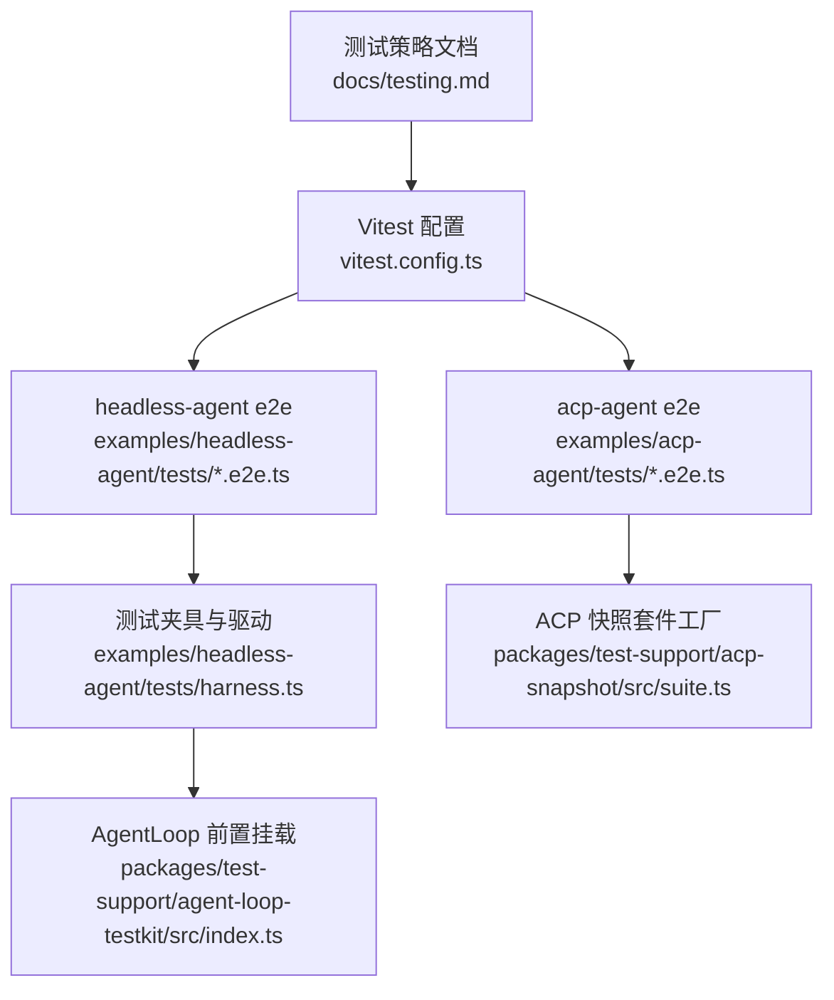
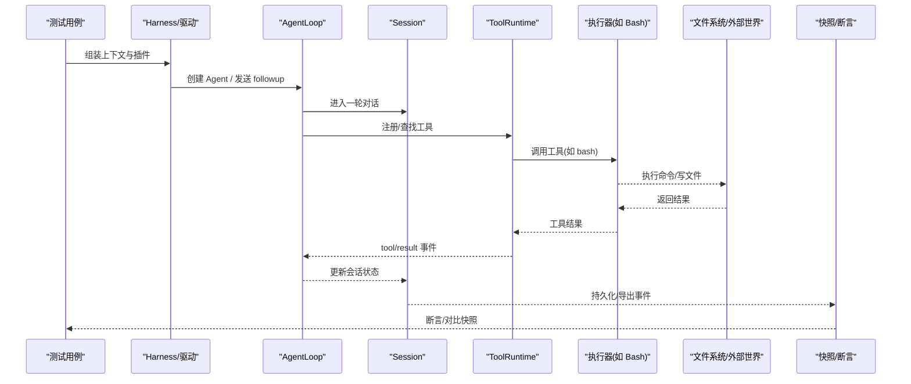
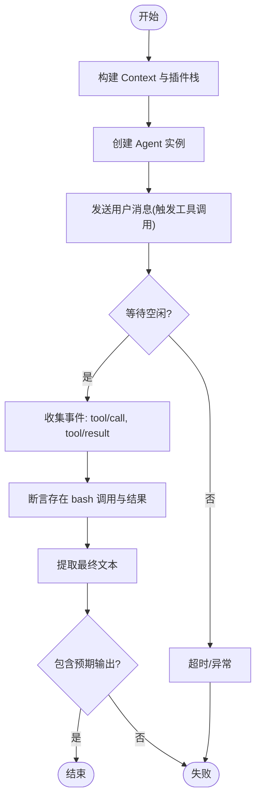
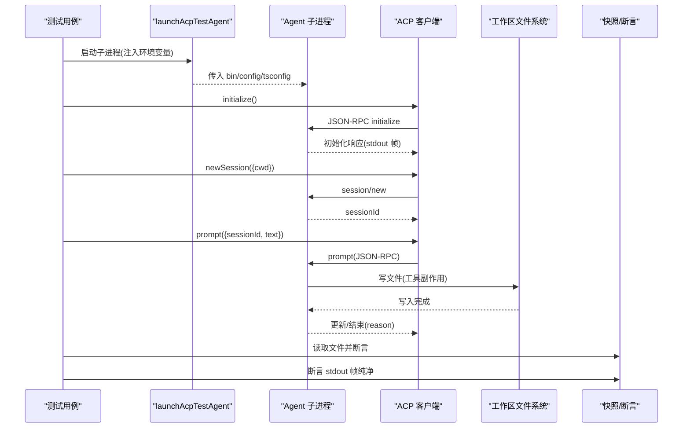
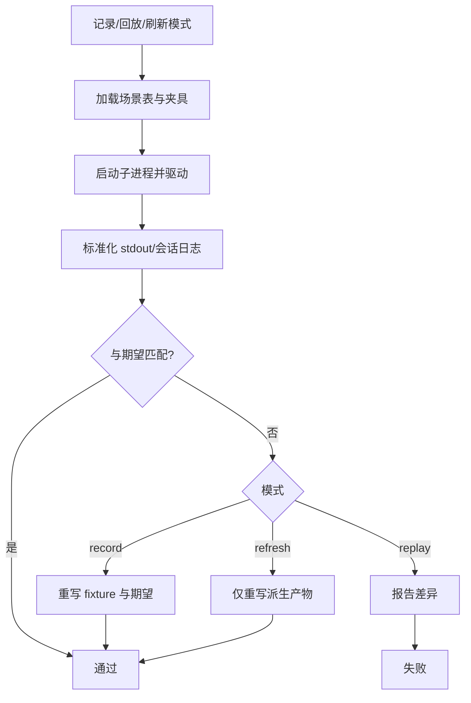
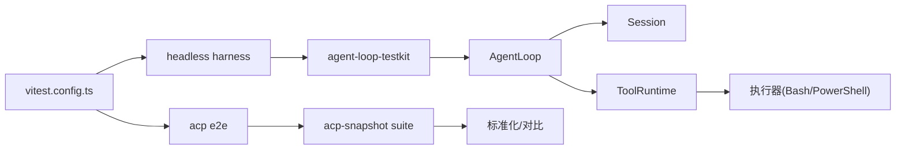

# 集成测试

<cite>
**本文引用的文件**
- [testing.md](file://docs/testing.md)
- [vitest.config.ts](file://vitest.config.ts)
- [harness.ts](file://examples/headless-agent/tests/harness.ts)
- [full-loop.e2e.ts](file://examples/headless-agent/tests/full-loop.e2e.ts)
- [acp.e2e.ts](file://examples/acp-agent/tests/acp.e2e.ts)
- [cleanup.e2e.ts](file://examples/acp-agent/tests/cleanup.e2e.ts)
- [suite.ts](file://packages/test-support/acp-snapshot/src/suite.ts)
- [index.ts](file://packages/test-support/agent-loop-testkit/src/index.ts)
</cite>

## 目录
1. [简介](#简介)
2. [项目结构](#项目结构)
3. [核心组件](#核心组件)
4. [架构总览](#架构总览)
5. [详细组件分析](#详细组件分析)
6. [依赖关系分析](#依赖关系分析)
7. [性能考量](#性能考量)
8. [故障排查指南](#故障排查指南)
9. [结论](#结论)
10. [附录](#附录)

## 简介
本文件聚焦于“工具”的集成测试实现，围绕 Agent、Session、Tool 三者协作与端到端验证展开。仓库采用分层测试策略：单元测试保证契约与边界；带密钥的真实 API e2e 验证真实模型与工具链路的可用性；快照测试以无密钥方式稳定校验外部行为（协议传输、持久化日志、用户可见输出）；Web 浏览器快照用于 GUI 回放比对。通过统一的测试驱动与可复用的测试套件工厂，既能启动完整 Agent 流程，又能对关键交互进行细粒度断言。

## 项目结构
- 测试策略与规则集中在文档中，明确各层级职责与命令入口。
- 根级 Vitest 配置统一了路径解析、覆盖率阈值、进程隔离与平台差异处理。
- 示例工程提供两类典型集成测试：
  - headless-agent：基于真实 LLM 与真实 bash 工具的端到端循环测试。
  - acp-agent：通过 ACP 协议在子进程中运行 Agent，并验证 stdout 纯净性与磁盘结果。
- 测试支撑包提供：
  - agent-loop-testkit：挂载 AgentLoop 前置服务（LLM、Session、SystemPrompt、Tools、AgentRegistry）。
  - acp-snapshot：场景驱动的快照测试框架，支持 replay/record/refresh 三种模式，标准化会话日志与 stdout 输出。

**图表来源**
- [testing.md:1-50](file://docs/testing.md#L1-L50)
- [vitest.config.ts:1-286](file://vitest.config.ts#L1-L286)
- [harness.ts:1-105](file://examples/headless-agent/tests/harness.ts#L1-L105)
- [acp.e2e.ts:1-127](file://examples/acp-agent/tests/acp.e2e.ts#L1-L127)
- [suite.ts:1-800](file://packages/test-support/acp-snapshot/src/suite.ts#L1-L800)
- [index.ts:1-47](file://packages/test-support/agent-loop-testkit/src/index.ts#L1-L47)

**章节来源**
- [testing.md:1-50](file://docs/testing.md#L1-L50)
- [vitest.config.ts:1-286](file://vitest.config.ts#L1-L286)

## 核心组件
- 测试策略与分层
  - 单元、覆盖率门控、真实 API e2e、快照、Web 浏览器快照五层清晰分工，命令入口与跳过策略明确。
- 测试驱动与夹具
  - headless-agent 的 harness 提供完整的插件栈装配（AgentLoop、LLM、Bash 执行器、Todo 工具、持久化与压缩等），并提供等待空闲与最终文本提取能力。
  - agent-loop-testkit 负责挂载 AgentLoop 所需的前置服务，确保测试拓扑可控。
- ACP 快照套件
  - suite 提供场景表驱动、标准化日志与 stdout、头信息（系统提示词与工具 schema）固定、多模式录制/回放/刷新、共享快照一致性校验等能力。
- 端到端用例
  - acp-agent e2e 启动真实子进程，验证 stdout 仅包含 JSON-RPC 帧，创建 session，并在有密钥时发送真实 prompt，断言文件系统效果。
  - headless full-loop e2e 直接调用 AgentLoop，触发 bash 工具并验证事件流与最终输出。

**章节来源**
- [testing.md:1-50](file://docs/testing.md#L1-L50)
- [harness.ts:1-105](file://examples/headless-agent/tests/harness.ts#L1-L105)
- [index.ts:1-47](file://packages/test-support/agent-loop-testkit/src/index.ts#L1-L47)
- [suite.ts:1-800](file://packages/test-support/acp-snapshot/src/suite.ts#L1-L800)
- [acp.e2e.ts:1-127](file://examples/acp-agent/tests/acp.e2e.ts#L1-L127)
- [full-loop.e2e.ts:1-50](file://examples/headless-agent/tests/full-loop.e2e.ts#L1-L50)

## 架构总览
下图展示了“工具”集成测试的整体架构：测试驱动通过 harness 或 ACP 客户端启动 Agent，Agent 在 Session 内调度 Tool 执行，产生的事件与副作用被持久化或对外暴露，最后由快照或断言进行验证。

**图表来源**
- [harness.ts:1-105](file://examples/headless-agent/tests/harness.ts#L1-L105)
- [index.ts:1-47](file://packages/test-support/agent-loop-testkit/src/index.ts#L1-L47)
- [suite.ts:1-800](file://packages/test-support/acp-snapshot/src/suite.ts#L1-L800)
- [acp.e2e.ts:1-127](file://examples/acp-agent/tests/acp.e2e.ts#L1-L127)
- [full-loop.e2e.ts:1-50](file://examples/headless-agent/tests/full-loop.e2e.ts#L1-L50)

## 详细组件分析

### 组件A：headless-agent 端到端驱动（真实模型+真实工具）
- 目标
  - 验证 Agent 能正确发起工具调用（bash），并将结果回传至 Session，最终体现在助手消息中。
- 关键点
  - 使用 harness 装配完整插件栈（AgentLoop、LLM、LocalBashExecutor、ToolBash、ToolTodo、可选持久化与压缩）。
  - 通过 waitForIdle 等待空闲，再检查事件流中的 tool/call 与 tool/result。
  - 从事件中提取最终文本，断言包含预期输出。
- 复杂度与性能
  - 涉及真实模型与 shell 执行，耗时较长；测试超时与资源清理需严格管理。
- 错误处理
  - afterEach 中确保 fiber 释放与工作目录清理，避免进程泄漏。

**图表来源**
- [harness.ts:1-105](file://examples/headless-agent/tests/harness.ts#L1-L105)
- [full-loop.e2e.ts:1-50](file://examples/headless-agent/tests/full-loop.e2e.ts#L1-L50)

**章节来源**
- [harness.ts:1-105](file://examples/headless-agent/tests/harness.ts#L1-L105)
- [full-loop.e2e.ts:1-50](file://examples/headless-agent/tests/full-loop.e2e.ts#L1-L50)

### 组件B：ACP 端到端（子进程 + 协议 + 快照）
- 目标
  - 启动真实 Agent 子进程，通过 ACP 协议驱动，验证 stdout 纯净性、session/new 成功、以及真实 prompt 下的工作区写入。
- 关键点
  - 使用 launchAcpTestAgent 启动子进程，initialize 后 newSession，必要时发送 prompt。
  - 断言 stdout 每行均为合法 JSON-RPC 帧；断言 session id 非空；断言磁盘文件内容。
  - 通过 cleanup 函数聚合关闭失败与工作区清理失败，确保资源回收。
- 快照集成
  - 配合 acp-snapshot suite 进行标准化比较（stdout、会话日志、系统提示词与工具 schema）。

**图表来源**
- [acp.e2e.ts:1-127](file://examples/acp-agent/tests/acp.e2e.ts#L1-L127)
- [cleanup.e2e.ts:1-39](file://examples/acp-agent/tests/cleanup.e2e.ts#L1-L39)
- [suite.ts:1-800](file://packages/test-support/acp-snapshot/src/suite.ts#L1-L800)

**章节来源**
- [acp.e2e.ts:1-127](file://examples/acp-agent/tests/acp.e2e.ts#L1-L127)
- [cleanup.e2e.ts:1-39](file://examples/acp-agent/tests/cleanup.e2e.ts#L1-L39)
- [suite.ts:1-800](file://packages/test-support/acp-snapshot/src/suite.ts#L1-L800)

### 组件C：快照测试框架（ACP 场景驱动）
- 目标
  - 以场景表驱动真实子进程，标准化并对比 stdout 与会话日志；支持 record/refresh/replay；固定系统提示词与工具 schema。
- 关键点
  - 场景描述含是否调用模型、是否比较日志、是否记录、是否覆盖重放脚本、是否固定头部、平台限制等。
  - 标准化过程清洗可变值（ID、cwd、时间戳、spill 路径），保留语义一致。
  - 共享快照声明与唯一性校验，防止不同场景生成冲突。
  - 支持 Windows 原生 stdout 侧车与 POSIX-only 场景。
- 最佳实践
  - 每个场景只对应一个 header 类；变更集中到 pin 场景；新增能力先扩展 harness 再实现。

**图表来源**
- [suite.ts:1-800](file://packages/test-support/acp-snapshot/src/suite.ts#L1-L800)

**章节来源**
- [suite.ts:1-800](file://packages/test-support/acp-snapshot/src/suite.ts#L1-L800)

### 组件D：AgentLoop 前置服务挂载
- 目标
  - 为测试提供稳定的前置服务（LLM、Session、SystemPrompt、Tools、AgentRegistry），使测试可聚焦 AgentLoop 与具体工具链路。
- 关键点
  - 不挂载 AgentLoop，保持测试拓扑可控；插件加载失败会拒绝 Promise，但已激活的服务随 Context 释放。
- 适用场景
  - headless-agent 的 harness 在其之上继续挂载具体插件（Bash、Todo、持久化、压缩等）。

**章节来源**
- [index.ts:1-47](file://packages/test-support/agent-loop-testkit/src/index.ts#L1-L47)
- [harness.ts:1-105](file://examples/headless-agent/tests/harness.ts#L1-L105)

## 依赖关系分析
- 测试策略与配置
  - testing.md 定义分层与命令；vitest.config.ts 统一路径解析、覆盖率阈值、进程池与平台排除。
- 端到端与快照
  - headless-agent e2e 依赖 harness 与 agent-loop-testkit；acp-agent e2e 依赖 ACP 快照套件。
- 子系统耦合
  - AgentLoop 与 Session、ToolRuntime、LLM Runtime 强耦合；测试通过挂载顺序控制拓扑。
  - 快照套件与 Session 表面类型、JSONL 格式紧密相关，标准化逻辑决定可比性。

**图表来源**
- [vitest.config.ts:1-286](file://vitest.config.ts#L1-L286)
- [harness.ts:1-105](file://examples/headless-agent/tests/harness.ts#L1-L105)
- [acp.e2e.ts:1-127](file://examples/acp-agent/tests/acp.e2e.ts#L1-L127)
- [suite.ts:1-800](file://packages/test-support/acp-snapshot/src/suite.ts#L1-L800)
- [index.ts:1-47](file://packages/test-support/agent-loop-testkit/src/index.ts#L1-L47)

**章节来源**
- [vitest.config.ts:1-286](file://vitest.config.ts#L1-L286)
- [harness.ts:1-105](file://examples/headless-agent/tests/harness.ts#L1-L105)
- [acp.e2e.ts:1-127](file://examples/acp-agent/tests/acp.e2e.ts#L1-L127)
- [suite.ts:1-800](file://packages/test-support/acp-snapshot/src/suite.ts#L1-L800)
- [index.ts:1-47](file://packages/test-support/agent-loop-testkit/src/index.ts#L1-L47)

## 性能考量
- 真实 API 与子进程测试耗时较长，应合理设置超时与并行度；进程绑定测试单独分组以避免干扰。
- 快照测试在 replay 模式下并发运行，每个子进程拥有独立临时目录与持久化根，互不干扰。
- 覆盖率门控要求 per-file 100%，有助于发现未覆盖分支，但需结合真实场景判断是否为死代码。

[本节为通用指导，无需特定文件引用]

## 故障排查指南
- 子进程清理失败
  - 使用 cleanup 聚合关闭失败与工作区删除失败，便于定位资源泄漏。
- stdout 污染
  - 若 stdout 出现非 JSON-RPC 行，说明日志/打印泄漏到协议通道；检查 logger 与调试输出。
- 工具未知
  - 快照刷新时会检测 UNKNOWN_TOOL 的工具调用 ID，确保工具注册正确。
- 会话头不一致
  - 若系统提示词或工具 schema 变化，需在 pin 场景中显式声明并审查差异。

**章节来源**
- [cleanup.e2e.ts:1-39](file://examples/acp-agent/tests/cleanup.e2e.ts#L1-L39)
- [suite.ts:1-800](file://packages/test-support/acp-snapshot/src/suite.ts#L1-L800)

## 结论
该仓库的集成测试体系以分层策略为基础，通过可复用的测试夹具与场景驱动的快照框架，既能在真实环境中验证 Agent、Session、Tool 的协作，也能在无密钥条件下稳定回归外部行为。编写端到端测试时，建议优先使用真实实现而非 mock，仅在昂贵或不确定边界进行替换；同时重视资源清理与外部世界断言，确保测试真正反映产品行为。

[本节为总结，无需特定文件引用]

## 附录
- 常用命令与策略参考
  - 单元测试、覆盖率门控、真实 API e2e、快照、Web 浏览器快照的命令与规则详见测试策略文档。
- 推荐实践
  - 使用 harness 装配最小必要插件集；将环境敏感项放入环境变量；在 afterEach 中确保所有资源释放；对不可变输出使用快照，对动态输出使用规范化后再对比。

**章节来源**
- [testing.md:1-50](file://docs/testing.md#L1-L50)