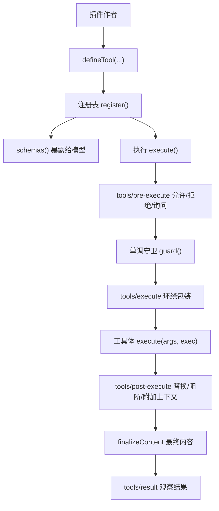
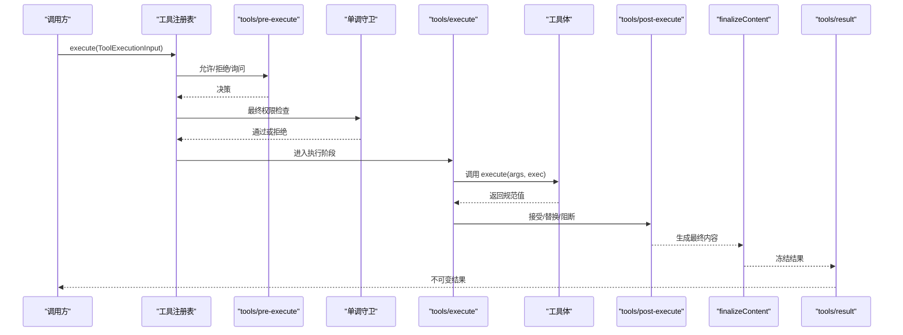
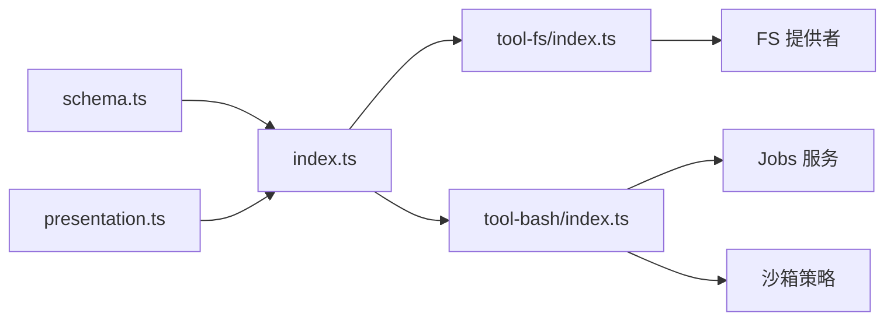

# 自定义工具开发

<cite>
**本文引用的文件**
- [packages/core/tools/src/index.ts](file://packages/core/tools/src/index.ts)
- [packages/core/tools/src/schema.ts](file://packages/core/tools/src/schema.ts)
- [packages/core/tools/src/presentation.ts](file://packages/core/tools/src/presentation.ts)
- [docs/subsystems/tools.md](file://docs/subsystems/tools.md)
- [docs/cookbook/adding-a-tool.md](file://docs/cookbook/adding-a-tool.md)
- [packages/fs/tool-fs/src/index.ts](file://packages/fs/tool-fs/src/index.ts)
- [packages/shell/tool-bash/src/index.ts](file://packages/shell/tool-bash/src/index.ts)
- [docs/testing.md](file://docs/testing.md)
</cite>

## 目录
1. [简介](#简介)
2. [项目结构](#项目结构)
3. [核心组件](#核心组件)
4. [架构总览](#架构总览)
5. [详细组件分析](#详细组件分析)
6. [依赖关系分析](#依赖关系分析)
7. [性能与并发](#性能与并发)
8. [错误处理与安全](#错误处理与安全)
9. [测试、调试与部署](#测试调试与部署)
10. [异步、流式与长任务](#异步流式与长任务)
11. [最佳实践清单](#最佳实践清单)
12. [结论](#结论)

## 简介
本指南面向希望为系统扩展“自定义工具”的开发者，围绕工具接口规范、注册机制、执行流水线、UI呈现约定、错误处理、日志观测、性能优化、安全策略、测试与部署流程展开。文档同时覆盖简单工具到复杂业务封装的完整路径，并给出异步、流式响应和长时间运行任务的实现建议。

## 项目结构
- 工具核心能力位于 packages/core/tools，提供工具定义 DSL、注册表、执行流水线、事件钩子、类型推导与 UI 呈现词汇。
- 示例工具：
  - 文件系统工具套件 packages/fs/tool-fs：演示 read/write/edit/read_image 等工具的注册与配置。
  - Shell 工具包 packages/shell/tool-bash：演示前台命令、后台任务、终端卡片、退出码解析等。
- 文档与教程：
  - docs/subsystems/tools.*：工具子系统权威说明（含类型契约、执行流水线和事件）。
  - docs/cookbook/adding-a-tool.*：从零开始编写工具的参考。
  - docs/testing.md：仓库级测试策略与分层。

图表来源
- [packages/core/tools/src/index.ts:142-200](file://packages/core/tools/src/index.ts#L142-L200)
- [docs/subsystems/tools.md:170-405](file://docs/subsystems/tools.md#L170-L405)

章节来源
- [docs/subsystems/tools.md:1-152](file://docs/subsystems/tools.md#L1-L152)
- [docs/cookbook/adding-a-tool.md:1-95](file://docs/cookbook/adding-a-tool.md#L1-L95)

## 核心组件
- ToolDefinition：一个已注册的工具，包含面向模型的 schema、输出声明、执行函数、可选的最终内容回调、超时与并发标识、以及 UI 呈现方法。
- 统一 JSON 值 Schema DSL：用于参数与输出的类型化描述，支持标量、数组、对象、json、oneOf 等，并提供 InferArgs/InferValue 类型推导。
- 执行流水线：pre-execute → guard → execute → post-execute → finalizeContent → result。
- UI 呈现词汇：presentCall/presentResult 返回 card-tagged 渲染意图，供宿主映射到具体视图。

章节来源
- [docs/subsystems/tools.md:9-152](file://docs/subsystems/tools.md#L9-L152)
- [packages/core/tools/src/index.ts:65-135](file://packages/core/tools/src/index.ts#L65-L135)

## 架构总览
下图展示了从调用方到工具执行的端到端流程，包括可插拔的水位线（waterfall）与观察者。

图表来源
- [packages/core/tools/src/index.ts:142-200](file://packages/core/tools/src/index.ts#L142-L200)
- [docs/subsystems/tools.md:170-405](file://docs/subsystems/tools.md#L170-L405)

## 详细组件分析

### 工具接口与注册
- defineTool：将 name/description/parameters/output/execute 等绑定到类型推导与运行时校验；output.schema 约束返回值，render 负责模型可见内容，presentationMeta 提供可回放 UI 元数据。
- ctx.tools.register：注册全局或作用域内工具；重复名称或保留名会失败。
- ctx.tools.schemas：仅暴露面向模型的字段（白名单），不泄露执行与展示回调。
- ctx.tools.restrict：按 allow/deny 过滤继承的全局工具集合，不影响当前作用域自身注册。

章节来源
- [docs/cookbook/adding-a-tool.md:7-39](file://docs/cookbook/adding-a-tool.md#L7-L39)
- [docs/subsystems/tools.md:478-570](file://docs/subsystems/tools.md#L478-L570)

### 参数与返回值约定
- 参数：ParameterSchemaSpec 描述每个属性类型与 required；由 defineTool 在调用前校验，非法参数抛出结构化错误。
- 返回值：output.schema 约束规范值；execute 必须返回该值，不得直接返回内容块；render 将规范值投影为模型可见内容。
- 类型推导：InferArgs/InferValue 保证编译期类型与运行时 schema 一致。

章节来源
- [docs/subsystems/tools.md:98-152](file://docs/subsystems/tools.md#L98-L152)
- [docs/cookbook/adding-a-tool.md:40-66](file://docs/cookbook/adding-a-tool.md#L40-L66)

### 执行上下文与生命周期
- ToolRunContext：提供 deferContext（附加后续请求可见的上下文）、concludeTurn（标记本轮结束）。
- ToolExecution/ToolDispatchExecution：身份保护、只读字段、signal 可被环绕包装替换但不可移除。
- 事件钩子：
  - tools/pre-execute：允许/拒绝/询问。
  - tools/execute：超时、重试、指标收集等。
  - tools/post-execute：替换内容或值、阻断、附加上下文。
  - tools/result：观察冻结后的最终结果。

章节来源
- [docs/subsystems/tools.md:170-405](file://docs/subsystems/tools.md#L170-L405)
- [packages/core/tools/src/index.ts:142-200](file://packages/core/tools/src/index.ts#L142-L200)

### UI 呈现约定
- presentCall：PENDING 状态卡片（generic/terminal/diff 等）。
- presentResult：COMPLETED 状态卡片（generic/terminal/diff/search/read/web 等）。
- 纯函数要求：必须在直播与回放中稳定工作，不读取会话状态或时钟。

章节来源
- [docs/subsystems/tools.md:459-468](file://docs/subsystems/tools.md#L459-L468)
- [docs/cookbook/adding-a-tool.md:67-90](file://docs/cookbook/adding-a-tool.md#L67-L90)

### 示例：文件系统工具套件
- 注册方式：通过 apply(ctx, config) 组合多个工具（read/write/edit/read_image）。
- 配置项：行限制、最大字节、流式阈值等，均受正整数断言保护。
- 沙箱控制：写/改操作通过 FsSandboxController 进行策略判定与告警。

章节来源
- [packages/fs/tool-fs/src/index.ts:1-80](file://packages/fs/tool-fs/src/index.ts#L1-L80)

### 示例：Shell 工具（bash）
- 前台/后台：前台以 terminal 卡片呈现；后台返回 job id，使用 jobs 服务管理生命周期。
- 参数校验：命令非空、描述非空、timeoutMs 合法、沙箱升级参数配对校验。
- 结果渲染：解析退出码、信号、是否超时/中止；后台确认消息使用 generic 卡片。

章节来源
- [packages/shell/tool-bash/src/index.ts:30-93](file://packages/shell/tool-bash/src/index.ts#L30-L93)
- [packages/shell/tool-bash/src/index.ts:100-136](file://packages/shell/tool-bash/src/index.ts#L100-L136)
- [packages/shell/tool-bash/src/index.ts:158-188](file://packages/shell/tool-bash/src/index.ts#L158-L188)

## 依赖关系分析
- 工具定义与注册依赖：
  - 类型与 DSL：schema.ts 提供 ValueSchemaSpec、InferArgs/InferValue、validateArgs 等。
  - 执行与事件：index.ts 暴露 defineTool、注册表、事件钩子与类型导出。
  - UI 呈现：presentation.ts 定义 card-tagged 视图类型。
- 示例工具依赖：
  - tool-fs 依赖 fs、systemPrompt、attachments（条件挂载）。
  - tool-bash 依赖 shell、jobs、sandbox-policy、shell-env。

图表来源
- [packages/core/tools/src/index.ts:65-135](file://packages/core/tools/src/index.ts#L65-L135)
- [packages/fs/tool-fs/src/index.ts:1-80](file://packages/fs/tool-fs/src/index.ts#L1-L80)
- [packages/shell/tool-bash/src/index.ts:30-32](file://packages/shell/tool-bash/src/index.ts#L30-L32)

章节来源
- [packages/core/tools/src/index.ts:65-135](file://packages/core/tools/src/index.ts#L65-L135)
- [packages/fs/tool-fs/src/index.ts:1-80](file://packages/fs/tool-fs/src/index.ts#L1-L80)
- [packages/shell/tool-bash/src/index.ts:30-32](file://packages/shell/tool-bash/src/index.ts#L30-L32)

## 性能与并发
- 并发模式：isConcurrencySafe 可将工具标记为可并行；否则默认独占执行。
- 超时预算：timeoutMs 由执行包装器强制，工具需协作取消（遵循 exec.signal）。
- 资源边界：大输出应流式处理（如 tool-fs 的 readStreamMinSize），避免内存膨胀。
- 结果裁剪：后端对 run_code 等跨边界输出有上限，生产者需控制中间值大小。

章节来源
- [docs/subsystems/tools.md:53-74](file://docs/subsystems/tools.md#L53-L74)
- [packages/fs/tool-fs/src/index.ts:24-41](file://packages/fs/tool-fs/src/index.ts#L24-L41)
- [docs/cookbook/adding-a-tool.md:61-66](file://docs/cookbook/adding-a-tool.md#L61-L66)

## 错误处理与安全
- 输入校验：defineTool 自动校验参数；超出 DSL 的约束需在 execute 内显式检查。
- 输出校验：execute 返回值必须符合 output.schema；否则转为结构化错误。
- 异常隔离：工具抛错、渲染失败、元数据投影失败会被捕获并转为 isError 结果。
- 权限与沙箱：
  - tools/pre-execute 实现可扩展的允许/拒绝/询问策略。
  - ctx.tools.guard 提供单调最终拒绝，后续监听无法撤销。
  - tool-bash 集成沙箱策略与升级流程，确保最小权限。
- 机密性：post-execute 可替换或阻断值，防止敏感信息外泄。

章节来源
- [docs/cookbook/adding-a-tool.md:40-66](file://docs/cookbook/adding-a-tool.md#L40-L66)
- [docs/subsystems/tools.md:315-405](file://docs/subsystems/tools.md#L315-L405)
- [packages/shell/tool-bash/src/index.ts:55-93](file://packages/shell/tool-bash/src/index.ts#L55-L93)

## 测试、调试与部署
- 测试分层：
  - 单元测试：验证行为、事件顺序、并发竞态、HMR 安全。
  - 覆盖率门控：src 层逐文件 100% 覆盖。
  - 真实 API e2e：带密钥场景，自跳过保障无密钥 CI。
  - 快照测试：关键协议与呈现行为，记录/刷新预期输出。
- 推荐做法：
  - 优先使用真实实现而非 mock，仅在昂贵/非确定性边界使用模拟。
  - 通过脚本化 mock 模型 + 真实工具执行桥接测试。
  - 验证构建产物入口路径，避免 tsx 掩盖的问题。
- 调试技巧：
  - 利用 tools/result 观察冻结结果。
  - 使用 tools/code-dispatch-log 调整持久化日志副本中的内容。
  - 结合 presentCall/presentResult 快速定位 UI 呈现问题。

章节来源
- [docs/testing.md:1-50](file://docs/testing.md#L1-L50)
- [docs/subsystems/tools.md:576-720](file://docs/subsystems/tools.md#L576-L720)

## 异步、流式与长任务
- 前台任务：直接 await 外部 IO，遵循 exec.signal 取消。
- 后台任务：
  - 通过 jobs.start({ kind, label, owner, run }) 启动，返回 jobId。
  - 提供 cancel、done、readOutput 等控制接口；任务级取消信号独立于外层调用取消。
- 流式响应：
  - 大输出采用流式读取与窗口化（如 tool-fs 的 read 流式阈值）。
  - 结果渲染时注意 truncated/spillPath 等元数据，便于 UI 提示截断与落盘位置。
- 长时间运行：
  - 明确超时与取消语义，确保资源清理与进程回收。
  - 后台任务完成后通过 jobs 提供的控制工具查询输出与终止。

章节来源
- [docs/cookbook/adding-a-tool.md:51-56](file://docs/cookbook/adding-a-tool.md#L51-L56)
- [packages/shell/tool-bash/src/index.ts:158-188](file://packages/shell/tool-bash/src/index.ts#L158-L188)
- [packages/fs/tool-fs/src/index.ts:24-41](file://packages/fs/tool-fs/src/index.ts#L24-L41)

## 最佳实践清单
- 接口设计
  - 使用 defineTool 声明参数与输出 schema，充分利用类型推导。
  - 将人类可读解释放在 render，程序化字段留在 value。
- 执行契约
  - 只返回规范值；不要返回内容块。
  - 始终检查并尊重 exec.signal。
  - 对 DSL 未覆盖的约束进行显式校验。
- 错误处理
  - 基础设施失败抛错；领域成功用 value 表达。
  - 使用 post-execute 做机密性策略（阻断/替换值）。
- 日志与观测
  - 使用 tools/result 观察最终结果。
  - 使用 tools/code-dispatch-log 调整持久化日志副本。
- 性能
  - 合理设置 timeoutMs 与 isConcurrencySafe。
  - 大输出流式处理，控制中间值大小。
- 安全
  - 通过 pre-execute/guard 实施权限策略。
  - 沙箱模式下遵循最小权限与升级流程。
- 测试与部署
  - 单元+覆盖率+e2e+快照四层覆盖。
  - 优先真实实现，mock 仅用于昂贵/非确定性边界。
  - 验证构建产物入口路径与 HMR 安全。

章节来源
- [docs/cookbook/adding-a-tool.md:40-90](file://docs/cookbook/adding-a-tool.md#L40-L90)
- [docs/subsystems/tools.md:170-405](file://docs/subsystems/tools.md#L170-L405)
- [docs/testing.md:1-50](file://docs/testing.md#L1-L50)

## 结论
通过统一的 schema DSL、严格的执行流水线与可扩展的事件钩子，系统提供了健壮且可演进的自定义工具生态。遵循本文的接口规范、注册机制、错误处理、性能与安全策略，并结合测试与部署流程，可以高效地实现从简单到复杂的工具，并可靠地集成到系统中。