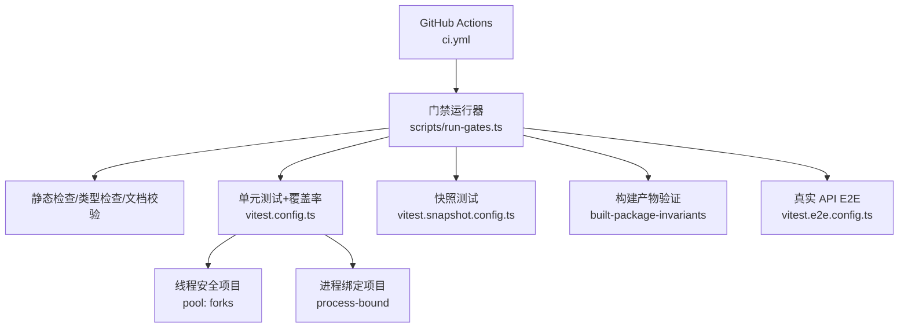
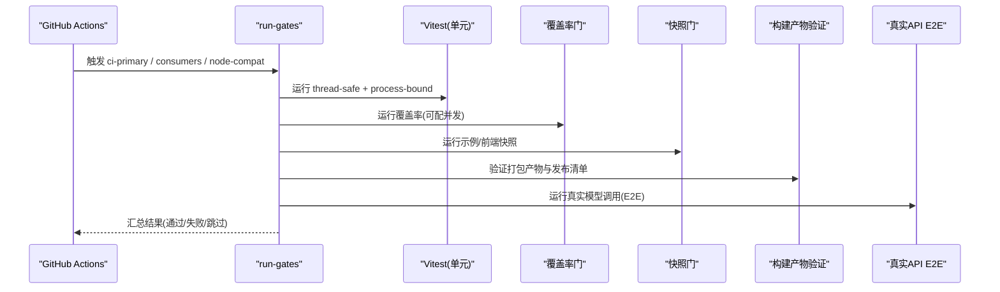
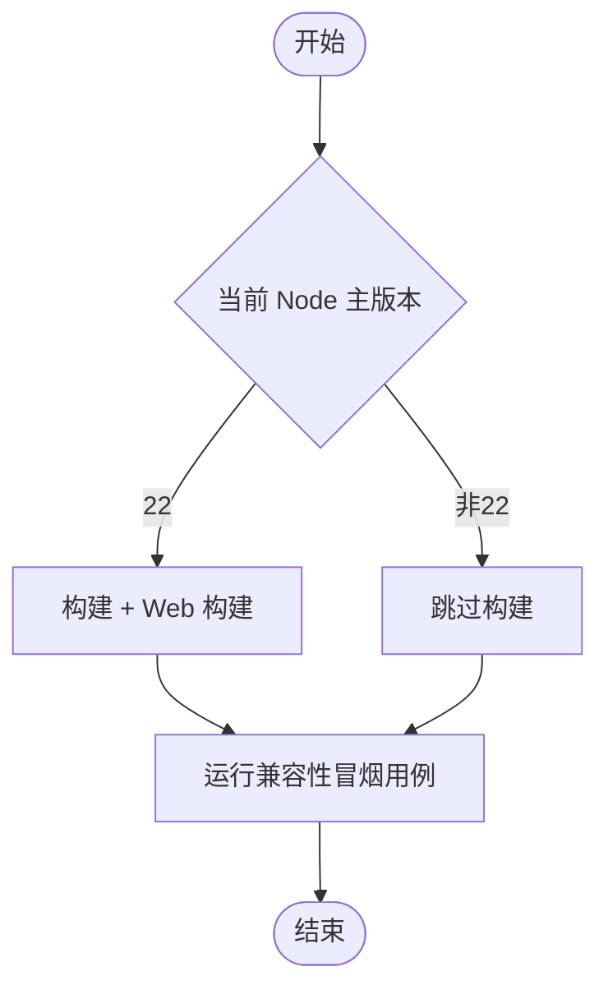
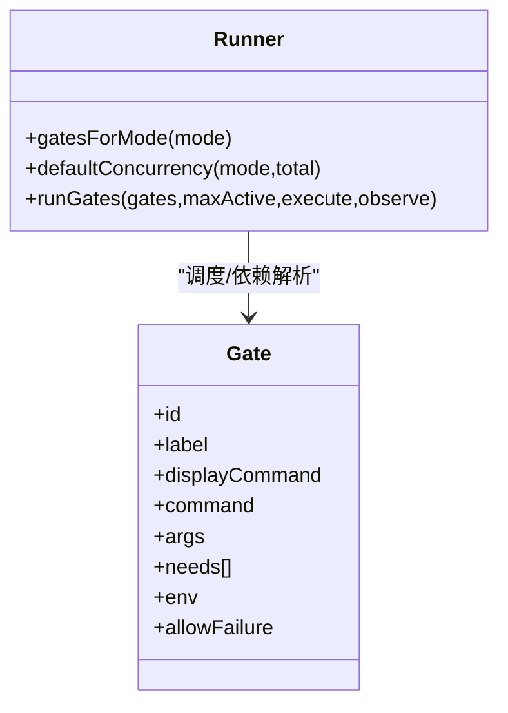
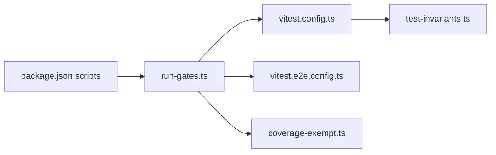

# CI 门禁与测试

<cite>
**本文引用的文件**
- [ci.yml](file://.github/workflows/ci.yml)
- [run-gates.ts](file://scripts/run-gates.ts)
- [vitest.config.ts](file://vitest.config.ts)
- [vitest.e2e.config.ts](file://vitest.e2e.config.ts)
- [vitest.shared.ts](file://vitest.shared.ts)
- [coverage-exempt.ts](file://scripts/coverage-exempt.ts)
- [package.json](file://package.json)
- [test-invariants.ts](file://scripts/test-invariants.ts)
</cite>

## 目录
1. [简介](#简介)
2. [项目结构](#项目结构)
3. [核心组件](#核心组件)
4. [架构总览](#架构总览)
5. [详细组件分析](#详细组件分析)
6. [依赖关系分析](#依赖关系分析)
7. [性能考量](#性能考量)
8. [故障排查指南](#故障排查指南)
9. [结论](#结论)
10. [附录](#附录)

## 简介
本文件系统性说明该仓库的 CI 门禁系统与测试体系，覆盖关键路径工作流、Node 兼容性矩阵（22.19、24、26）、独立门禁分组与并行执行机制、真实 API 工作流的配置与执行方式、测试套件组织与策略、本地模拟 CI 检查的方法（含性能分析与内存泄漏检测），以及构建产物验证与兼容性测试的重要性。

## 项目结构
CI 门禁由 GitHub Actions 编排，通过统一的“门禁运行器”脚本将多个质量门禁组合为有向无环图（DAG）并并发执行；测试由 Vitest 统一配置驱动，按项目、平台、覆盖率、快照、E2E 等维度拆分。

图表来源
- [ci.yml:63-257](file://.github/workflows/ci.yml#L63-L257)
- [run-gates.ts:192-284](file://scripts/run-gates.ts#L192-L284)
- [vitest.config.ts:117-159](file://vitest.config.ts#L117-L159)
- [vitest.e2e.config.ts:31-57](file://vitest.e2e.config.ts#L31-L57)

章节来源
- [ci.yml:1-120](file://.github/workflows/ci.yml#L1-L120)
- [run-gates.ts:1-120](file://scripts/run-gates.ts#L1-L120)
- [vitest.config.ts:1-120](file://vitest.config.ts#L1-L120)

## 核心组件
- 门禁运行器：集中定义各模式下的门禁 DAG、并发度、环境变量与命令，负责调度与结果汇总。
- Vitest 配置：统一解析、项目划分、覆盖率阈值、平台排除、进程隔离策略。
- 真实 API E2E 配置：加载 .env、控制并发、超时与重试，避免污染主覆盖率门。
- 覆盖率豁免：重型套件在独立门中不插桩运行，保证覆盖率门稳定且快速。
- 测试不变量宿主：自动挂载包级 invariant 插件，确保服务启动顺序与契约一致性。

章节来源
- [run-gates.ts:14-120](file://scripts/run-gates.ts#L14-L120)
- [vitest.config.ts:117-286](file://vitest.config.ts#L117-L286)
- [vitest.e2e.config.ts:1-59](file://vitest.e2e.config.ts#L1-L59)
- [coverage-exempt.ts:1-42](file://scripts/coverage-exempt.ts#L1-L42)
- [test-invariants.ts:1-120](file://scripts/test-invariants.ts#L1-L120)

## 架构总览
CI 门禁采用“分层 + 分片”的架构：
- 分层：静态检查 → 类型检查 → 覆盖率 → 快照 → 构建产物验证 → 消费者/兼容性与 E2E。
- 分片：Linux/Windows/Node 版本矩阵各自独立 Job，互不阻塞，最终汇总到 PR 状态。

图表来源
- [ci.yml:63-257](file://.github/workflows/ci.yml#L63-L257)
- [run-gates.ts:192-284](file://scripts/run-gates.ts#L192-L284)
- [vitest.config.ts:117-159](file://vitest.config.ts#L117-L159)
- [vitest.e2e.config.ts:31-57](file://vitest.e2e.config.ts#L31-L57)

## 详细组件分析

### 关键路径 CI 工作流（Primary/Consumers/Static）
- Primary（node-24/static, coverage, consumers）：
  - 静态门禁：运行时闭包、约束、许可证、包不变量、Cordis 配置、Issue 管理策略、Typert 合约、类型检查、Lint、重复度、覆盖率、Node 兼容冒烟、快照、文档同步、模块图、Knip、构建、发布校验、Node Next Types、构建产物不变量、已构建二进制冒烟。
  - Consumers：构建、Node 兼容、publint、构建产物不变量、Lint/重复度、快照、Web 快照、文档类型检查、Node Next Types、已构建二进制冒烟。
- 并发控制：通过 DSH_GATE_CONCURRENCY 控制门禁并行度；覆盖率门内部再拆分为“插桩门”和“免插桩重型门”，共享 DSH_COVERAGE_MAX_WORKERS。

章节来源
- [ci.yml:63-257](file://.github/workflows/ci.yml#L63-L257)
- [run-gates.ts:192-284](file://scripts/run-gates.ts#L192-L284)
- [run-gates.ts:497-518](file://scripts/run-gates.ts#L497-L518)

### 兼容性测试矩阵（Node 22.19、24、26）
- Node 24 为主力环境（PRIMARY_NODE_VERSION=24）。
- 兼容性矩阵 job 使用 matrix 分别以 Node 22.19 与 26 运行，仅执行兼容性冒烟（跳过类型检查），确保跨版本行为一致。
- 当运行环境为 Node 22 时，额外包含构建与 Web 前端构建步骤，以覆盖 CLI 懒搜索启动等场景。

图表来源
- [ci.yml:260-297](file://.github/workflows/ci.yml#L260-L297)
- [run-gates.ts:286-343](file://scripts/run-gates.ts#L286-L343)

章节来源
- [ci.yml:260-297](file://.github/workflows/ci.yml#L260-L297)
- [run-gates.ts:286-343](file://scripts/run-gates.ts#L286-L343)

### 独立门禁的分组策略与并行执行机制
- 分组策略：
  - ci-primary：完整链路（静态→类型→覆盖率→快照→构建→产物验证→E2E 冒烟）。
  - ci-linux-primary：primary + Web 快照。
  - ci-static：仅静态与文档相关门禁。
  - ci-coverage：覆盖率双门（插桩/免插桩重型）。
  - ci-snapshot：构建后快照。
  - ci-artifacts：构建后发布与类型校验。
  - ci-consumers：构建后的消费者视角全量门禁。
  - Windows 三组：blocking/complete/observational，分别承担阻断性、完整性与观测性任务。
- 并行机制：
  - run-gates 内置 DAG 调度器，根据 needs 依赖关系与 maxActive 并发上限推进任务。
  - 支持通过 DSH_GATE_CONCURRENCY 覆盖默认并发；覆盖率门内部分摊 DSH_COVERAGE_MAX_WORKERS。
  - 对进程绑定/全局状态敏感的用例单独放入 process-bound 项目，避免 worker 干扰。

图表来源
- [run-gates.ts:14-44](file://scripts/run-gates.ts#L14-L44)
- [run-gates.ts:192-284](file://scripts/run-gates.ts#L192-L284)
- [run-gates.ts:709-777](file://scripts/run-gates.ts#L709-L777)

章节来源
- [run-gates.ts:192-284](file://scripts/run-gates.ts#L192-L284)
- [run-gates.ts:709-777](file://scripts/run-gates.ts#L709-L777)

### 真实 API 工作流的配置与执行方式
- 独立配置文件 vitest.e2e.config.ts：
  - 自动加载根目录 .env（若存在），支持 provider 端点与环境变量覆盖。
  - 设置较长超时与重试，降低外部 API 抖动影响。
  - 通过 DSH_E2E_MAX_WORKERS 控制文件级并行度，默认 4，可降至 1 串行。
  - 明确 include 范围：packages/*/tests/*.e2e.ts、apps/cli/tests/*.e2e.ts、examples/*/tests/*.e2e.ts。
- CI 中由 consumers 或特定 workflow 触发，结合密钥预检与配额限制，避免浪费 token。

章节来源
- [vitest.e2e.config.ts:1-59](file://vitest.e2e.config.ts#L1-L59)
- [ci.yml:178-257](file://.github/workflows/ci.yml#L178-L257)

### 测试套件组织结构与执行策略
- 单元测试：
  - 双项目划分：thread-safe（大多数用例，fork 池）与 process-bound（进程/时序敏感用例，隔离运行）。
  - 覆盖率阈值：每文件 100%（语句/分支/函数/行），严格合并。
  - 平台差异：Windows 下排除不支持 Bash/PowerShell 的套件；非 Windows 下排除 Windows-only 源码。
  - 重型套件豁免：通过 coverage-exempt.ts 将编译器/子进程重型套件从插桩门移除，在独立门中运行，不影响覆盖率阈值。
- 端到端测试：
  - 真实 API E2E：使用 vitest.e2e.config.ts，带超时/重试/并发控制。
  - Web 快照：通过 test:web:built 与 DSH_SNAPSHOT=replay 回放 UI 快照。
- 集成测试：
  - 通过 examples/headless-agent 与 apps/cli 的 built-bin.e2e.ts 等验证构建产物入口可达性与组合正确性。

章节来源
- [vitest.config.ts:85-159](file://vitest.config.ts#L85-L159)
- [vitest.config.ts:160-286](file://vitest.config.ts#L160-L286)
- [coverage-exempt.ts:1-42](file://scripts/coverage-exempt.ts#L1-L42)
- [vitest.e2e.config.ts:31-57](file://vitest.e2e.config.ts#L31-L57)
- [run-gates.ts:618-643](file://scripts/run-gates.ts#L618-L643)

### 本地模拟 CI 检查的方法
- 一键门禁：pnpm run check-all 或 pnpm run check:ci 等，复用 run-gates 的 DAG 与并发控制。
- 选择性门禁：check:ci:static、check:ci:coverage、check:ci:snapshot、check:ci:artifacts、check:ci:consumers、check:node-compat。
- 覆盖率：pnpm run test:coverage；可通过 DSH_COVERAGE_MAX_WORKERS 调整并发；重型套件在独立门中运行。
- 快照：pnpm run test:snapshot; 记录/刷新：DSH_SNAPSHOT=record/refresh。
- 真实 API E2E：设置必要密钥后，pnpm run test:e2e；可通过 DSH_E2E_MAX_WORKERS 控制并发。
- 性能分析与内存泄漏检测：
  - 性能：利用 Vitest 自带的 --coverage 与 V8 覆盖率报告定位热点；对 E2E 可使用 DSH_E2E_MAX_WORKERS=1 串行复现瓶颈。
  - 内存泄漏：在本地启用 Node 堆快照（如 node --inspect 配合 heapdump）或在 CI 中通过容器/沙箱（bubblewrap）隔离资源；对子进程/Worker 密集的用例优先在 process-bound 项目中定位。

章节来源
- [package.json:19-63](file://package.json#L19-L63)
- [run-gates.ts:497-518](file://scripts/run-gates.ts#L497-L518)
- [vitest.e2e.config.ts:16-57](file://vitest.e2e.config.ts#L16-L57)

### 构建产物验证与兼容性测试的重要性
- 构建产物验证：
  - 验证发布清单、包不变量、Node Next Types、已构建二进制入口可达性，确保 npm 发布与下游消费不受破坏。
- 兼容性测试：
  - 在 Node 22.19/24/26 上执行冒烟用例，提前发现引擎差异导致的崩溃或行为漂移。
  - 对 Node 22 额外执行构建流程，覆盖 CLI 懒搜索启动等路径。

章节来源
- [run-gates.ts:374-384](file://scripts/run-gates.ts#L374-L384)
- [run-gates.ts:286-343](file://scripts/run-gates.ts#L286-L343)
- [run-gates.ts:618-643](file://scripts/run-gates.ts#L618-L643)

## 依赖关系分析
- 门禁运行器依赖：
  - package.json scripts：提供统一入口（build、typecheck、lint、test、snapshot、docs 等）。
  - Vitest 配置：决定测试范围、覆盖率阈值、项目划分与平台适配。
  - 覆盖率豁免清单：重型套件从插桩门剥离，保持覆盖率门稳定。
- 测试不变量宿主：
  - 自动发现并挂载每个包的 invariant.ts，确保服务生命周期与契约在测试中生效。

图表来源
- [package.json:19-63](file://package.json#L19-L63)
- [run-gates.ts:192-284](file://scripts/run-gates.ts#L192-L284)
- [vitest.config.ts:117-159](file://vitest.config.ts#L117-L159)
- [vitest.e2e.config.ts:31-57](file://vitest.e2e.config.ts#L31-L57)
- [coverage-exempt.ts:1-42](file://scripts/coverage-exempt.ts#L1-L42)
- [test-invariants.ts:1-120](file://scripts/test-invariants.ts#L1-L120)

章节来源
- [package.json:19-63](file://package.json#L19-L63)
- [run-gates.ts:192-284](file://scripts/run-gates.ts#L192-L284)
- [vitest.config.ts:117-159](file://vitest.config.ts#L117-L159)
- [vitest.e2e.config.ts:31-57](file://vitest.e2e.config.ts#L31-L57)
- [coverage-exempt.ts:1-42](file://scripts/coverage-exempt.ts#L1-L42)
- [test-invariants.ts:1-120](file://scripts/test-invariants.ts#L1-L120)

## 性能考量
- 并发控制：
  - DSH_GATE_CONCURRENCY：控制门禁并行度，默认按模式与 CPU 核数计算。
  - DSH_COVERAGE_MAX_WORKERS：覆盖率门内部分摊插桩与免插桩两路并发。
  - DSH_E2E_MAX_WORKERS：真实 API E2E 文件级并行度，可按配额调低至 1。
- 稳定性：
  - 进程绑定用例隔离运行，避免全局状态竞争。
  - 覆盖率阈值 100% 且按文件粒度，防止大文件掩盖小文件缺陷。
  - 重型套件豁免，减少 v8 插桩开销，缩短 CI 尾延迟。
- 缓存与加速：
  - pnpm store 与 Playwright 浏览器缓存复用，减少冷启动时间。
  - Wine apt 缓存用于 Windows 门禁加速。

[本节为通用指导，无需具体文件引用]

## 故障排查指南
- 覆盖率门失败：
  - 查看未覆盖位置报告（自定义 reporter），定位缺失分支/语句。
  - 确认是否命中 coverage-exempt 列表；必要时补充测试或调整豁免。
- 真实 API E2E 不稳定：
  - 降低 DSH_E2E_MAX_WORKERS 至 1 串行复现；检查 .env 与 Provider 配额。
  - 关注超时与重试配置，适当提升 testTimeout/hookTimeout。
- 平台相关问题：
  - Windows 下 Bash/PowerShell 相关套件被排除；如需验证，请在原生 Windows 或 Wine 门禁中运行。
  - 非 Windows 环境会跳过 Windows-only 源码覆盖。
- 依赖/构建问题：
  - 使用 check:ci:artifacts 与 check:ci:consumers 聚焦产物与消费侧验证。
  - 通过 built-bin smoke 验证 lib 入口可达性。

章节来源
- [vitest.config.ts:160-286](file://vitest.config.ts#L160-L286)
- [coverage-exempt.ts:1-42](file://scripts/coverage-exempt.ts#L1-L42)
- [vitest.e2e.config.ts:31-57](file://vitest.e2e.config.ts#L31-L57)
- [run-gates.ts:618-643](file://scripts/run-gates.ts#L618-L643)

## 结论
该仓库通过“门禁运行器 + Vitest 多配置 + GitHub Actions 矩阵”的组合，实现了高可靠、可扩展、可观测的 CI 门禁与测试体系。其特点包括：
- 明确的门禁分层与依赖图，便于并行化与故障隔离。
- 严格的覆盖率门槛与重型套件豁免，兼顾质量与速度。
- 跨 Node 版本的兼容性矩阵，提前暴露引擎差异风险。
- 独立的真实 API E2E 配置，可控并发与容错，避免污染主覆盖率门。
- 完善的构建产物验证，保障发布质量与下游消费体验。

[本节为总结性内容，无需具体文件引用]

## 附录
- 常用命令速查：
  - 全量门禁：pnpm run check-all
  - 主要门禁：pnpm run check:ci
  - 静态门禁：pnpm run check:ci:static
  - 覆盖率：pnpm run test:coverage
  - 快照：pnpm run test:snapshot
  - 构建产物：pnpm run check:ci:artifacts
  - 消费者门禁：pnpm run check:ci:consumers
  - 兼容性：pnpm run check:node-compat
  - 真实 API E2E：pnpm run test:e2e

章节来源
- [package.json:19-63](file://package.json#L19-L63)