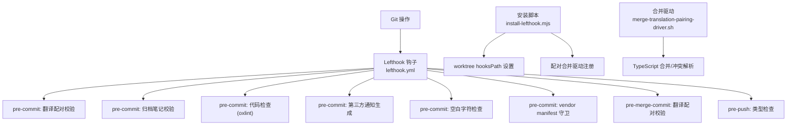
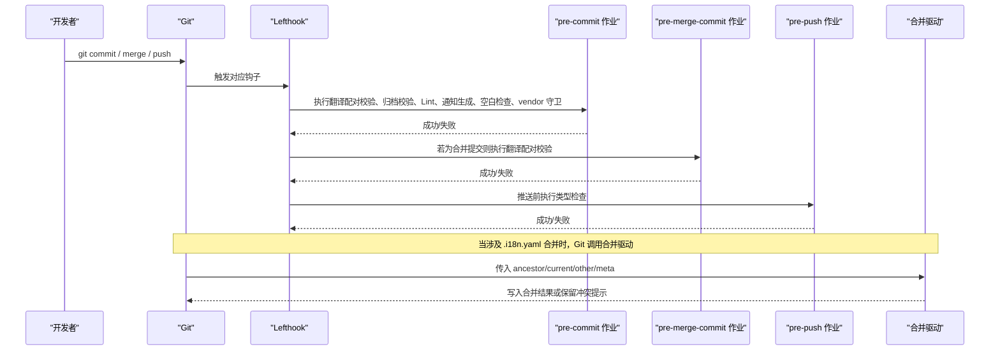
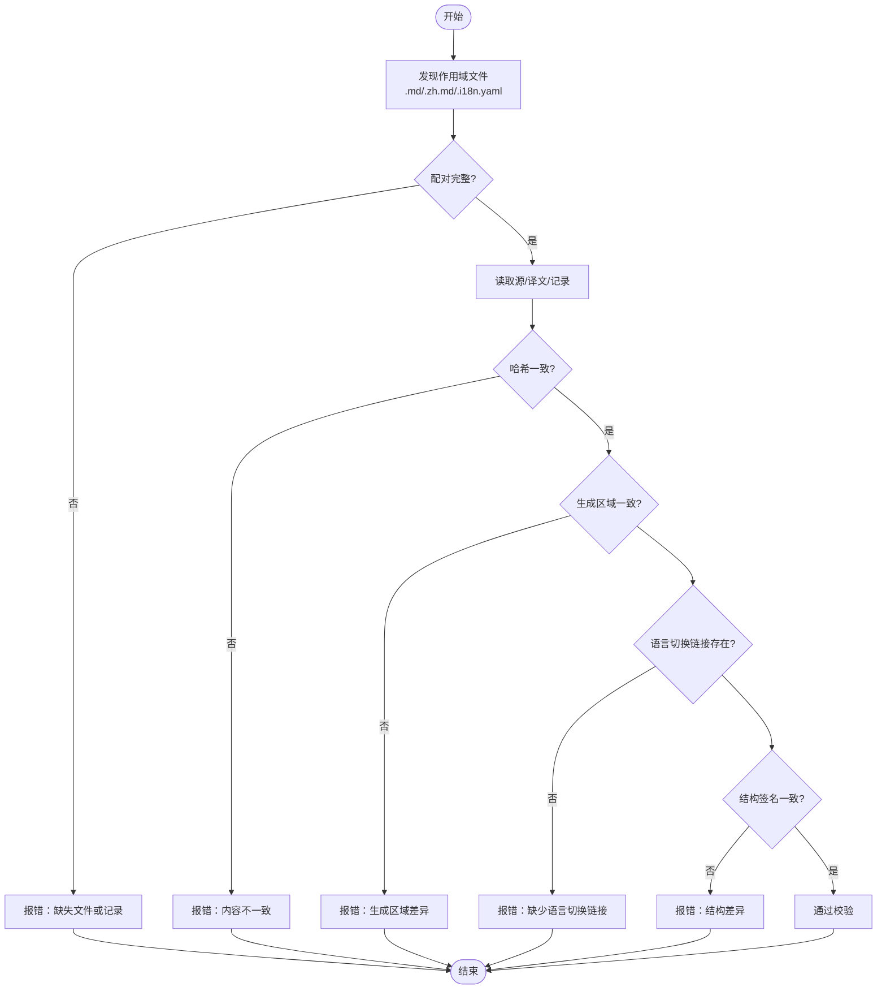
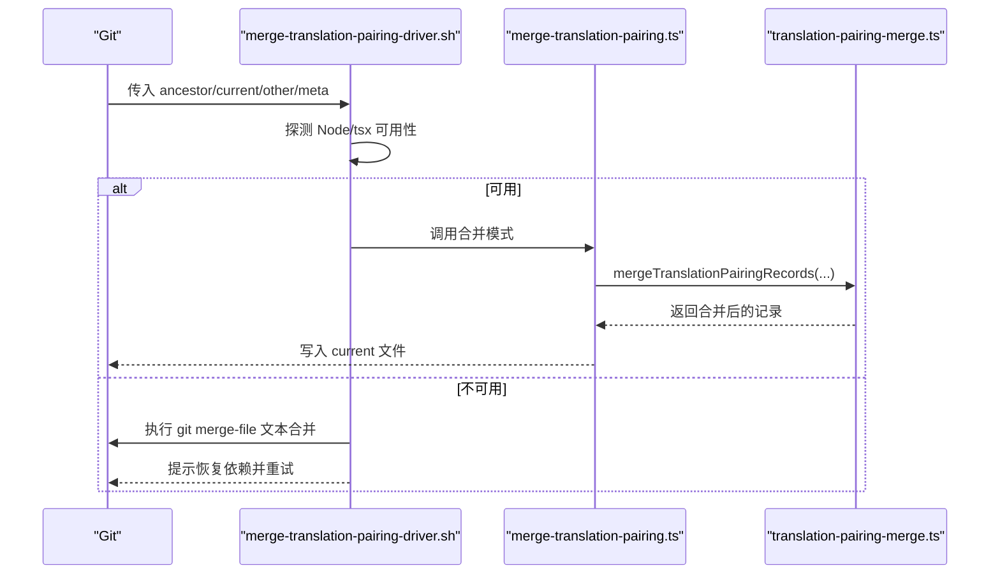
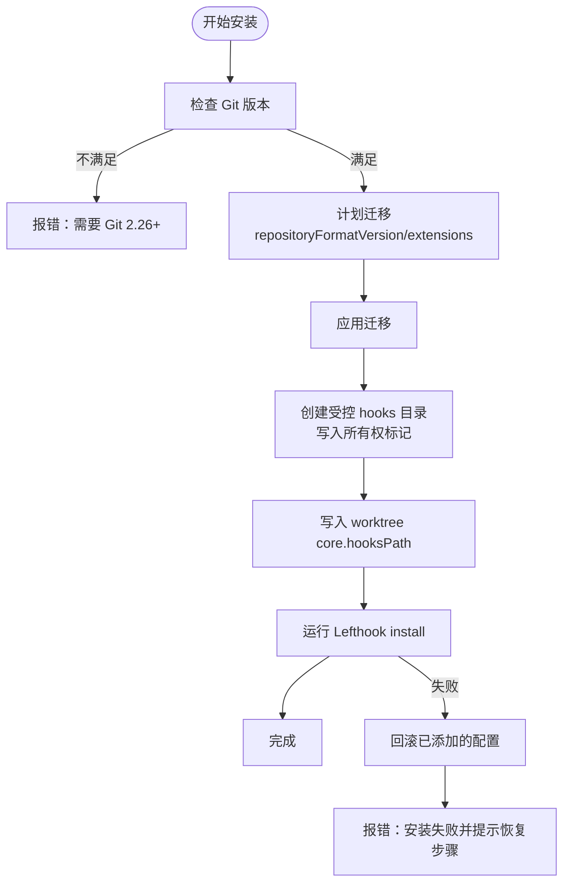
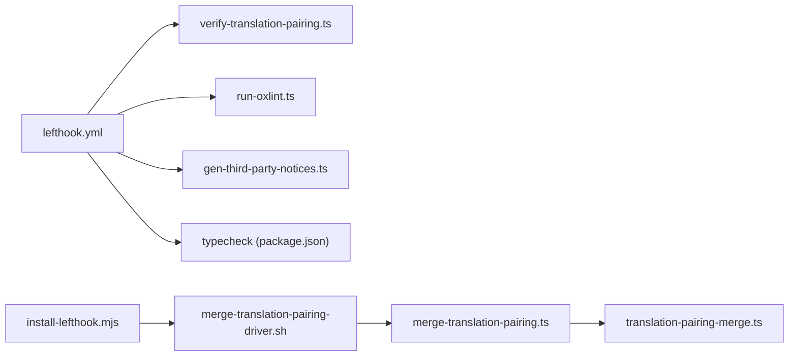

# Git 集成与钩子

<cite>
**本文引用的文件**
- [lefthook.yml](file://lefthook.yml)
- [scripts/install-lefthook.mjs](file://scripts/install-lefthook.mjs)
- [scripts/merge-translation-pairing-driver.sh](file://scripts/merge-translation-pairing-driver.sh)
- [scripts/merge-translation-pairing.ts](file://scripts/merge-translation-pairing.ts)
- [scripts/verify-translation-pairing.ts](file://scripts/verify-translation-pairing.ts)
- [scripts/translation-pairing-git.ts](file://scripts/translation-pairing-git.ts)
- [scripts/run-oxlint.ts](file://scripts/run-oxlint.ts)
- [package.json](file://package.json)
</cite>

## 目录
1. [简介](#简介)
2. [项目结构](#项目结构)
3. [核心组件](#核心组件)
4. [架构总览](#架构总览)
5. [详细组件分析](#详细组件分析)
6. [依赖关系分析](#依赖关系分析)
7. [性能考量](#性能考量)
8. [故障排查指南](#故障排查指南)
9. [结论](#结论)

## 简介
本仓库通过 Lefthook 将本地 Git 工作流自动化，覆盖提交前、合并前和推送前的关键质量门禁：配对记录验证、代码检查（Lint）、类型检查等。同时，仓库为 .i18n.yaml 双语配对记录引入了自定义合并驱动，实现自动合并与冲突解决，保障多语言文档在分支合并时的一致性。此外，安装脚本实现了 worktree 本地钩子的安全契约与回滚机制，确保不同工作区下的钩子配置既安全又可恢复。

## 项目结构
- 根级 Lefthook 配置文件 lefthook.yml 定义了 pre-commit、pre-merge-commit、pre-push 三个阶段的作业。
- scripts/install-lefthook.mjs 负责在 postinstall 中安装 Lefthook、设置 worktree 级别的 core.hooksPath、注册并校验配对合并驱动。
- scripts/merge-translation-pairing-driver.sh 是 Git 合并驱动的 Shell 入口，负责调用 TypeScript 合并逻辑或退化为文本合并。
- scripts/merge-translation-pairing.ts 提供合并驱动与冲突解析的入口。
- scripts/verify-translation-pairing.ts 在 pre-commit/pre-merge-commit 阶段校验 i18n 配对完整性与一致性。
- scripts/run-oxlint.ts 封装 Oxlint 调用，支持 --fix 模式并在 pre-commit 中自动修复可修复问题。
- package.json 暴露 typecheck 等脚本，供 pre-push 阶段执行类型检查。

图表来源
- [lefthook.yml:5-56](file://lefthook.yml#L5-L56)
- [scripts/install-lefthook.mjs:30-42](file://scripts/install-lefthook.mjs#L30-L42)
- [scripts/merge-translation-pairing-driver.sh:1-36](file://scripts/merge-translation-pairing-driver.sh#L1-L36)

章节来源
- [lefthook.yml:1-56](file://lefthook.yml#L1-L56)
- [package.json:19-143](file://package.json#L19-L143)

## 核心组件
- Lefthook 钩子编排：集中定义各阶段任务，保证本地快速门禁，CI 承担全仓矩阵检查。
- 翻译配对校验：确保英文源与中文译文的成对存在、结构一致、生成区域相同，并通过 Git blob 哈希锁定已确认状态。
- 自定义合并驱动：针对 .i18n.yaml 的合并冲突进行智能合并，必要时提示人工处理所有者冲突。
- Worktree 本地钩子安全契约：通过 worktree 级别配置隔离钩子路径，防止覆盖用户自有配置，并提供回滚能力。
- 代码检查与类型检查：pre-commit 阶段运行 oxlint 并尝试自动修复；pre-push 阶段执行类型检查，避免未通过类型检查的代码被推送。

章节来源
- [lefthook.yml:5-56](file://lefthook.yml#L5-L56)
- [scripts/verify-translation-pairing.ts:1-300](file://scripts/verify-translation-pairing.ts#L1-L300)
- [scripts/merge-translation-pairing.ts:1-52](file://scripts/merge-translation-pairing.ts#L1-L52)
- [scripts/install-lefthook.mjs:611-689](file://scripts/install-lefthook.mjs#L611-L689)
- [scripts/run-oxlint.ts:1-89](file://scripts/run-oxlint.ts#L1-L89)
- [package.json:27-28](file://package.json#L27-L28)

## 架构总览
下图展示了从 Git 操作到 Lefthook 钩子再到具体脚本执行的完整流程，以及配对合并驱动在合并时的介入点。

图表来源
- [lefthook.yml:5-56](file://lefthook.yml#L5-L56)
- [scripts/merge-translation-pairing-driver.sh:1-36](file://scripts/merge-translation-pairing-driver.sh#L1-L36)
- [scripts/merge-translation-pairing.ts:1-52](file://scripts/merge-translation-pairing.ts#L1-L52)

## 详细组件分析

### Lefthook 钩子配置与作用
- pre-commit
  - 翻译配对校验：仅对暂存区的 *.i18n.yaml 执行校验，排除归档目录，使用 --cached 模式读取索引字节，提升速度并保证准确性。
  - 归档代理笔记校验：确保归档目录内容符合规范。
  - 代码检查：对暂存区的 TS/TSX/MJS/CJS 文件执行 oxlint，支持 --fix 并 stage_fixed 自动重新暂存修复后的文件。
  - 第三方通知生成：根据包清单与锁文件重新生成 THIRD_PARTY_NOTICES.md 并加入暂存区，避免后续 CI 失败。
  - 空白字符检查：git diff --cached --check 拒绝多余空白。
  - vendor manifest 守卫：确保 vendor 清单一致性。
- pre-merge-commit
  - 再次执行翻译配对校验，确保合并提交前配对一致性。
- pre-push
  - 类型检查：执行 pnpm run typecheck，确保推送前类型正确。

章节来源
- [lefthook.yml:5-56](file://lefthook.yml#L5-L56)
- [package.json:27-28](file://package.json#L27-L28)

### 配对记录验证（pre-commit/pre-merge-commit）
- 作用范围：扫描 .md、.zh.md、.i18n.yaml 及 .agents/notes 下的相关文件，依据清单排除规则确定作用域。
- 完整性检查：要求每对源与译文都存在，且对应的 .i18n.yaml 记录存在。
- 一致性检查：
  - 通过 Git blob 哈希比对当前内容与上次确认的一致状态，防止单侧修改。
  - 比较生成区域的顺序与内容，确保两边由同一生成器产出的片段完全一致。
  - 校验双向语言切换链接是否存在。
  - 校验 Markdown 结构签名是否一致。
- 输出与退出码：错误时打印原因并返回非零退出码，阻断提交；成功时报告检查结果。

图表来源
- [scripts/verify-translation-pairing.ts:64-130](file://scripts/verify-translation-pairing.ts#L64-L130)
- [scripts/verify-translation-pairing.ts:170-271](file://scripts/verify-translation-pairing.ts#L170-L271)
- [scripts/translation-pairing-git.ts:12-17](file://scripts/translation-pairing-git.ts#L12-L17)

章节来源
- [scripts/verify-translation-pairing.ts:1-300](file://scripts/verify-translation-pairing.ts#L1-L300)
- [scripts/translation-pairing-git.ts:1-97](file://scripts/translation-pairing-git.ts#L1-L97)

### 配对合并驱动工作原理（.i18n.yaml 自动合并与冲突解决）
- 注册方式：安装脚本在工作区配置中注册合并驱动名称与命令，指向 scripts/merge-translation-pairing-driver.sh。
- 驱动行为：
  - 若 Node/tsx 可用，则调用 TypeScript 合并逻辑 mergeTranslationPairingRecords，将合并结果写回 current 文件。
  - 若不可用，则退化为 git merge-file 文本合并，并提示恢复依赖后重试。
  - 对于所有者冲突，提供 --resolve 模式列出需人工处理的记录，并指导使用 verify-translation-pairing --write 确认。
- 回滚与保护：安装脚本在安装合并驱动时会检查现有配置，避免覆盖用户自定义值；失败时回滚已添加的配置项。

图表来源
- [scripts/install-lefthook.mjs:30-42](file://scripts/install-lefthook.mjs#L30-L42)
- [scripts/merge-translation-pairing-driver.sh:1-36](file://scripts/merge-translation-pairing-driver.sh#L1-L36)
- [scripts/merge-translation-pairing.ts:1-52](file://scripts/merge-translation-pairing.ts#L1-L52)

章节来源
- [scripts/install-lefthook.mjs:611-689](file://scripts/install-lefthook.mjs#L611-L689)
- [scripts/merge-translation-pairing-driver.sh:1-36](file://scripts/merge-translation-pairing-driver.sh#L1-L36)
- [scripts/merge-translation-pairing.ts:1-52](file://scripts/merge-translation-pairing.ts#L1-L52)

### Worktree 本地钩子配置的安全契约与故障恢复
- 安全契约要点：
  - 强制 Git 版本 >= 2.26，以支持 worktree 级别配置。
  - 拒绝覆盖用户已有的 core.hooksPath（除非来自受控的 worktree 配置），防止意外替换。
  - 仅在 worktree 配置文件中写入 core.hooksPath 与合并驱动配置，避免污染全局或系统配置。
  - 使用所有权标记文件与锁文件确保安装过程原子性与并发安全。
- 迁移与回滚：
  - 自动升级 repositoryFormatVersion 至 1，启用 extensions.worktreeConfig。
  - 安装失败时回滚已添加的配置项，并提示手动恢复。
  - 若检测到残留的无效锁或所有权变更，给出明确的手动恢复指引。

图表来源
- [scripts/install-lefthook.mjs:233-305](file://scripts/install-lefthook.mjs#L233-L305)
- [scripts/install-lefthook.mjs:307-457](file://scripts/install-lefthook.mjs#L307-L457)
- [scripts/install-lefthook.mjs:526-537](file://scripts/install-lefthook.mjs#L526-L537)
- [scripts/install-lefthook.mjs:611-689](file://scripts/install-lefthook.mjs#L611-L689)

章节来源
- [scripts/install-lefthook.mjs:1-846](file://scripts/install-lefthook.mjs#L1-L846)

### 常见 Git 操作的自动化检查与错误处理
- 提交前（pre-commit）
  - 翻译配对校验：不完整或不一致的配对将被拒绝，并给出具体原因。
  - 归档笔记校验：不符合规范的归档内容将被拒绝。
  - 代码检查：oxlint 自动修复可修复问题并重新暂存；无法修复的问题将阻止提交。
  - 第三方通知：自动生成并加入暂存区，避免遗漏。
  - 空白字符与 vendor 守卫：拒绝包含尾随空白的提交，确保 vendor 清单一致。
- 合并前（pre-merge-commit）
  - 再次校验翻译配对，确保合并提交前一致性。
- 推送前（pre-push）
  - 类型检查：执行构建与类型检查，失败则阻止推送。
- 错误处理策略
  - 合并驱动不可用时降级为文本合并，并提示恢复依赖。
  - 安装脚本在失败时回滚配置，避免半安装状态。
  - 校验脚本在发现错误时输出详细诊断信息并返回非零退出码。

章节来源
- [lefthook.yml:5-56](file://lefthook.yml#L5-L56)
- [scripts/run-oxlint.ts:1-89](file://scripts/run-oxlint.ts#L1-L89)
- [scripts/merge-translation-pairing-driver.sh:1-36](file://scripts/merge-translation-pairing-driver.sh#L1-L36)
- [scripts/verify-translation-pairing.ts:1-300](file://scripts/verify-translation-pairing.ts#L1-L300)
- [package.json:27-28](file://package.json#L27-L28)

## 依赖关系分析
- Lefthook 依赖 lefthook.yml 中的作业定义，作业调用 scripts 中的各类校验与检查脚本。
- 安装脚本依赖 Git 工作区配置能力与 Node/tsx 环境，用于注册合并驱动与设置 hooksPath。
- 合并驱动依赖 TypeScript 合并逻辑，若不可用则回退到 git merge-file。
- 类型检查依赖 package.json 中定义的 typecheck 脚本，该脚本会先构建宿主库再进行客户端类型检查。

图表来源
- [lefthook.yml:5-56](file://lefthook.yml#L5-L56)
- [scripts/install-lefthook.mjs:30-42](file://scripts/install-lefthook.mjs#L30-L42)
- [scripts/merge-translation-pairing-driver.sh:1-36](file://scripts/merge-translation-pairing-driver.sh#L1-L36)
- [scripts/merge-translation-pairing.ts:1-52](file://scripts/merge-translation-pairing.ts#L1-L52)
- [package.json:27-28](file://package.json#L27-L28)

章节来源
- [lefthook.yml:5-56](file://lefthook.yml#L5-L56)
- [scripts/install-lefthook.mjs:30-42](file://scripts/install-lefthook.mjs#L30-L42)
- [scripts/merge-translation-pairing-driver.sh:1-36](file://scripts/merge-translation-pairing-driver.sh#L1-L36)
- [scripts/merge-translation-pairing.ts:1-52](file://scripts/merge-translation-pairing.ts#L1-L52)
- [package.json:27-28](file://package.json#L27-L28)

## 性能考量
- pre-commit 阶段尽量轻量：仅检查暂存文件，避免全仓扫描；翻译配对校验支持按锚点名增量检查。
- 代码检查使用 oxlint 的并行线程控制（DSH_OXLINT_THREADS），提升本地检查速度。
- 合并驱动在 Node/tsx 不可用时回退为文本合并，减少阻塞时间，但需后续人工处理。
- 类型检查在 pre-push 阶段执行，避免影响提交速度，同时确保推送质量。

[本节为通用指导，无需特定文件引用]

## 故障排查指南
- 合并驱动不可用
  - 现象：合并时提示 runtime unavailable，并留下普通文本冲突。
  - 处理：恢复 Node/tsx 依赖后重新合并，或使用 resolve-translation-pairing-conflicts 处理其他安全记录。
- 安装脚本失败
  - 现象：抛出错误并提示回滚失败或锁冲突。
  - 处理：检查是否有残留锁文件或所有权标记，按提示手动清理后重试。
- 翻译配对校验失败
  - 现象：提示缺失配对、哈希不一致、生成区域差异或缺少语言切换链接。
  - 处理：补齐配对文件、重新生成并记录哈希（verify-translation-pairing --write），或修正结构与链接。
- 代码检查失败
  - 现象：oxlint 报告错误或警告。
  - 处理：使用 --fix 自动修复，或手动修正代码风格与潜在问题。
- 类型检查失败
  - 现象：pre-push 阶段类型检查失败。
  - 处理：修复类型错误后再推送。

章节来源
- [scripts/merge-translation-pairing-driver.sh:15-36](file://scripts/merge-translation-pairing-driver.sh#L15-L36)
- [scripts/install-lefthook.mjs:611-689](file://scripts/install-lefthook.mjs#L611-L689)
- [scripts/verify-translation-pairing.ts:170-271](file://scripts/verify-translation-pairing.ts#L170-L271)
- [scripts/run-oxlint.ts:49-89](file://scripts/run-oxlint.ts#L49-L89)
- [package.json:27-28](file://package.json#L27-L28)

## 结论
本仓库通过 Lefthook 将 Git 工作流的关键质量门禁前置到本地，结合自定义合并驱动与严格的双语配对校验，确保多语言文档在合并过程中的完整性与一致性。安装脚本提供的 worktree 本地钩子安全契约与回滚机制，保障了多工作区场景下的配置安全与可恢复性。配合代码检查与类型检查，形成了从提交到推送的全链路自动化质量保证体系。