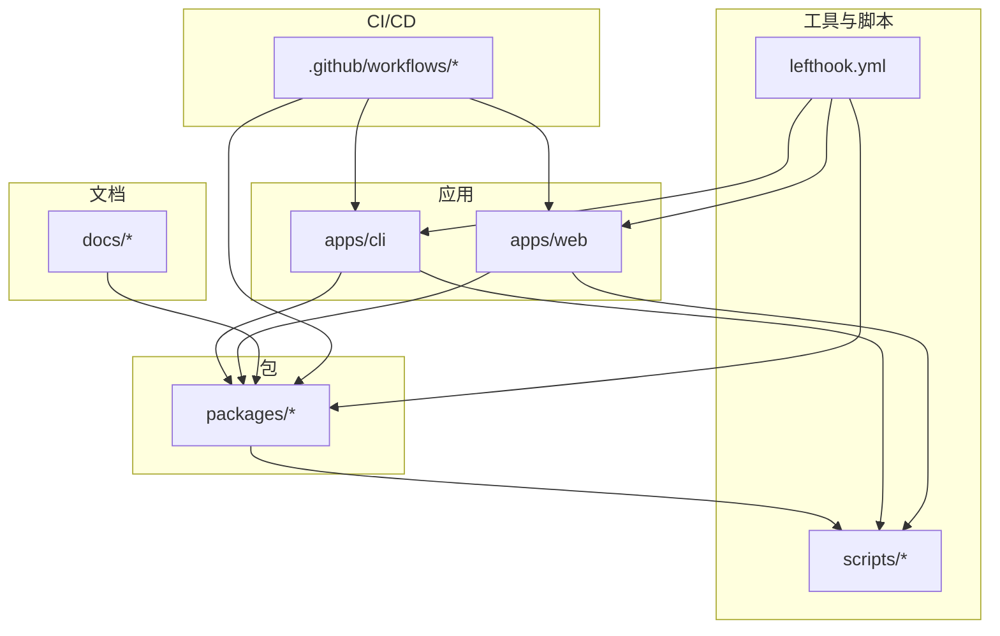
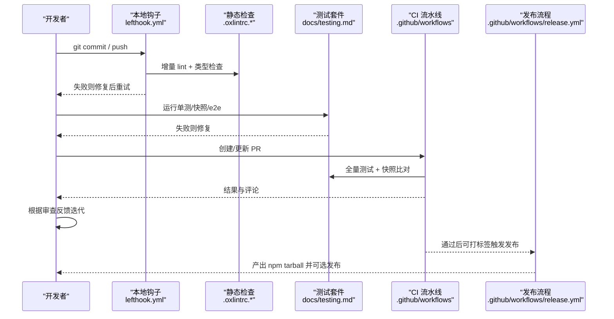
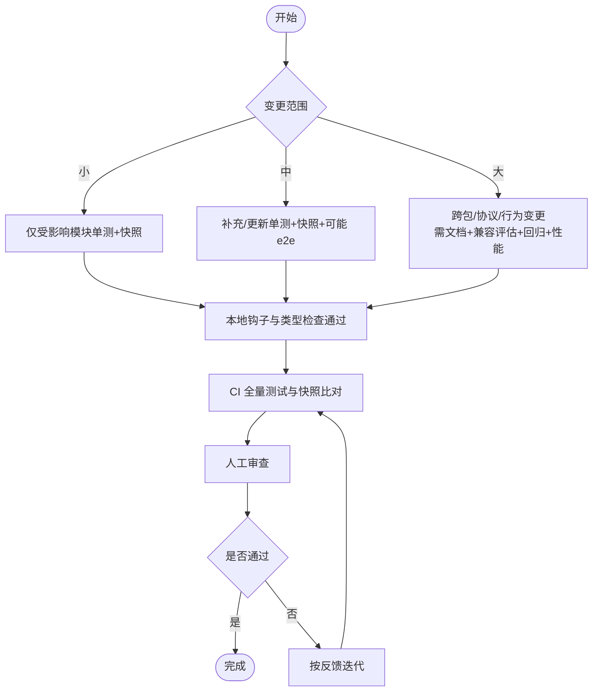
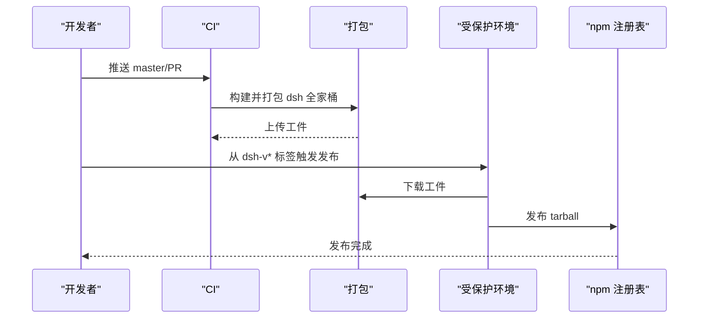
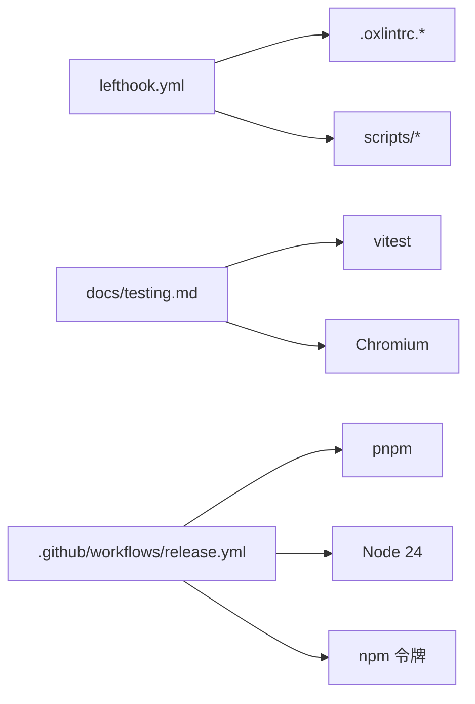

# 代码审查规范

<cite>
**本文引用的文件**
- [pull_request_template.md](file://.github/pull_request_template.md)
- [lefthook.yml](file://lefthook.yml)
- [.oxlintrc.json](file://.oxlintrc.json)
- [.oxlintrc.staged.json](file://.oxlintrc.staged.json)
- [testing.md](file://docs/testing.md)
- [release.yml](file://.github/workflows/release.yml)
- [maintaining-dsh-code-review.md](file://docs/cookbook/maintaining-dsh-code-review.md)
</cite>

## 目录
1. [引言](#引言)
2. [项目结构](#项目结构)
3. [核心组件](#核心组件)
4. [架构总览](#架构总览)
5. [详细组件分析](#详细组件分析)
6. [依赖分析](#依赖分析)
7. [性能考虑](#性能考虑)
8. [故障排查指南](#故障排查指南)
9. [结论](#结论)
10. [附录](#附录)

## 引言
本规范面向仓库贡献者与维护者，统一代码审查与 Pull Request（PR）流程，覆盖变更范围选择、验证步骤、文档同步、检查清单、反馈迭代、发布前最终检查与分支管理策略。目标是让每次 PR 可预期、可追溯、可回滚，并在保证质量的同时提升协作效率。

## 项目结构
仓库采用多包/多应用结构：packages 提供核心能力，apps 提供 CLI/Web 产品入口，examples 提供示例与端到端场景，scripts 提供构建/校验脚本，docs 为文档与子系统说明，.github/workflows 定义 CI/CD 流水线，lefthook 配置本地钩子以保障提交质量。

**章节来源**
- [lefthook.yml:1-56](file://lefthook.yml#L1-L56)
- [testing.md:1-50](file://docs/testing.md#L1-L50)

## 核心组件
- 本地质量门禁（Git Hooks）：在 pre-commit/pre-merge-commit/pre-push 阶段执行翻译配对校验、归档 Agent Notes 校验、增量 lint、第三方声明生成、空白字符检查、vendor manifest 守卫与类型检查。
- 静态规则集：基于 oxlint 的严格 TypeScript 规则，包含类型感知、禁止 any、未使用变量、悬空 Promise、模板表达式限制、风格约束等。
- 测试分层：单元测试、覆盖率门限、真实 API e2e、快照测试、Web 浏览器快照；不同层级对应不同命令与通过标准。
- 发布流水线：打包所有 dsh 相关包与应用，验证安装产物，仅在受保护环境从标签触发发布。

**章节来源**
- [lefthook.yml:1-56](file://lefthook.yml#L1-L56)
- [.oxlintrc.json:1-322](file://.oxlintrc.json#L1-L322)
- [testing.md:1-50](file://docs/testing.md#L1-L50)
- [release.yml:1-150](file://.github/workflows/release.yml#L1-L150)

## 架构总览
下图展示一次典型 PR 的生命周期：从本地提交到合并前的自动化门禁，再到 CI 全量检查与发布准备。

**图表来源**
- [lefthook.yml:1-56](file://lefthook.yml#L1-L56)
- [.oxlintrc.json:1-322](file://.oxlintrc.json#L1-L322)
- [testing.md:1-50](file://docs/testing.md#L1-L50)
- [release.yml:1-150](file://.github/workflows/release.yml#L1-L150)

## 详细组件分析

### 变更范围选择与验证步骤
- 小改动（修复 bug、样式微调、文档修正）：仅运行受影响模块的单测与快照；确保本地 pre-commit 与 typecheck 通过。
- 中改动（新增功能、重构）：补充或更新单元测试与快照；必要时增加 e2e 用例；确保覆盖率门限不降低。
- 大改动（跨包接口变更、协议变更、行为变更）：必须更新相关子系统文档与用户可见文档；补充端到端场景；进行兼容性评估与回归测试；必要时增加关键路径的性能基准。

**章节来源**
- [lefthook.yml:1-56](file://lefthook.yml#L1-L56)
- [testing.md:1-50](file://docs/testing.md#L1-L50)

### 文档更新要求
- README：若涉及用户可见行为、配置项、命令行参数或安装方式变化，需同步更新对应 README。
- JSDoc：对外暴露的函数、类、接口、事件、配置项需保持 JSDoc 与实现一致，避免过期注释。
- 子系统文档：任何子系统行为、API、配置、生命周期、错误语义变化，需在 docs/subsystems 下对应文档中更新，并保持 i18n 配对文件一致性。
- 快照与示例：对模型输出、协议传输、UI 呈现有影响的变更，应更新相应快照或示例，确保 keyless 场景稳定。

**章节来源**
- [testing.md:1-50](file://docs/testing.md#L1-L50)

### 代码审查检查清单
- 类型安全
  - 遵循 .oxlintrc 中的 TypeScript 规则，禁止 any、未使用变量、悬空 Promise、非空断言滥用等。
  - 公共 API 的类型签名需完整且稳定，变更需评估向后兼容。
- API 兼容性
  - 对外暴露的导出、事件、配置键、CLI 参数不得破坏既有消费者；如需破坏性变更，需提供迁移路径与版本规划。
- 性能影响
  - 热点路径应避免不必要的对象分配、重复计算与阻塞 I/O；对长列表、流式处理、缓存策略进行审视。
- 安全性考虑
  - 输入校验、权限最小化、敏感信息不落盘；避免任意命令执行、路径穿越、不安全反序列化。
- 可测试性
  - 关键逻辑具备单测与快照；外部边界（网络、时间、随机）可被替换；e2e 覆盖真实入口路径。
- 可维护性
  - 命名清晰、职责单一、错误处理完备；日志与诊断信息有助于定位问题。

**章节来源**
- [.oxlintrc.json:1-322](file://.oxlintrc.json#L1-L322)
- [testing.md:1-50](file://docs/testing.md#L1-L50)

### Pull Request 描述模板与最佳实践
- 模板字段
  - 关联 Issue：明确 Fixes/Related to 编号，解决型 PR 与 Issue Priority 对齐。
  - 变更：简述做了什么、为什么做、影响面。
  - 验证：列出已执行的测试、快照更新、手动验证步骤。
- 最佳实践
  - 每个 PR 聚焦单一主题，便于审查与回滚。
  - 提交信息简洁明确，引用相关 Issue。
  - 大型变更拆分为多个小 PR，逐步推进。
  - 附带截图/日志/快照差异，帮助审查者快速理解。

**章节来源**
- [pull_request_template.md:1-14](file://.github/pull_request_template.md#L1-L14)

### 审查反馈处理与迭代改进
- 收到审查意见后，优先确认问题根因与影响范围。
- 分步修复：先解决阻塞性问题，再处理建议性优化。
- 每次更新后重新运行本地钩子与测试，确保无回归。
- 如存在争议，记录决策依据并在 PR 中说明。
- 对于复杂变更，可在 PR 中追加“设计决策”段落，解释权衡与取舍。

**章节来源**
- [maintaining-dsh-code-review.md:1-65](file://docs/cookbook/maintaining-dsh-code-review.md#L1-L65)

### 发布前最终检查与发布分支管理
- 最终检查
  - 确保所有 CI 关卡通过，包括单测、覆盖率、快照、e2e。
  - 验证打包产物可安装与运行，避免依赖缺失或版本冲突。
  - 核对版本号、变更日志、许可证与第三方声明。
- 分支与标签
  - 发布由受保护的标签触发，流水线仅从指定标签执行发布任务。
  - 发布产物为不可变 tarball，发布步骤消费打包产物而非重新构建。
  - 建议在 master 上保持可发布状态，发布分支仅用于临时修复与回滚。

**图表来源**
- [release.yml:1-150](file://.github/workflows/release.yml#L1-L150)

**章节来源**
- [release.yml:1-150](file://.github/workflows/release.yml#L1-L150)

## 依赖分析
- 本地钩子依赖 oxlint 与脚本，确保提交前完成轻量级检查。
- 测试套件依赖 vitest、Chromium（Web 快照）、示例与 fixtures。
- 发布流水线依赖 pnpm、Node 版本、受保护环境与 npm token。

**图表来源**
- [lefthook.yml:1-56](file://lefthook.yml#L1-L56)
- [.oxlintrc.json:1-322](file://.oxlintrc.json#L1-L322)
- [testing.md:1-50](file://docs/testing.md#L1-L50)
- [release.yml:1-150](file://.github/workflows/release.yml#L1-L150)

**章节来源**
- [lefthook.yml:1-56](file://lefthook.yml#L1-L56)
- [.oxlintrc.json:1-322](file://.oxlintrc.json#L1-L322)
- [testing.md:1-50](file://docs/testing.md#L1-L50)
- [release.yml:1-150](file://.github/workflows/release.yml#L1-L150)

## 性能考虑
- 在热点路径减少对象分配与字符串拼接，优先使用结构化数据与流式处理。
- 对 I/O 操作进行批量化与超时控制，避免阻塞主线程。
- 合理使用缓存与去重，避免重复计算与网络请求。
- 对大数据集进行分页、虚拟滚动与懒加载。
- 通过快照与 e2e 捕获性能回归，必要时引入基准测试。

[本节为通用指导，无需特定文件来源]

## 故障排查指南
- 本地钩子失败
  - 检查 staged 文件是否符合翻译配对与归档规范。
  - 查看增量 lint 报告，修复类型与风格问题。
  - 确认第三方声明已再生成并提交。
- 类型检查失败
  - 根据 .oxlintrc 规则定位具体错误，优先修复类型安全问题。
  - 避免滥用 any 与非空断言，必要时添加窄化类型。
- 测试失败
  - 区分单测、快照、e2e 失败原因；更新快照时需人工审查差异。
  - 对真实 API 的 e2e 需确保密钥可用或自跳过。
- 发布失败
  - 确认标签格式与环境权限；检查工件是否完整。
  - 验证安装产物可运行，排除依赖冲突。

**章节来源**
- [lefthook.yml:1-56](file://lefthook.yml#L1-L56)
- [.oxlintrc.json:1-322](file://.oxlintrc.json#L1-L322)
- [testing.md:1-50](file://docs/testing.md#L1-L50)
- [release.yml:1-150](file://.github/workflows/release.yml#L1-L150)

## 结论
通过统一的本地门禁、严格的静态规则、分层测试与受控发布流程，本仓库能够在保证质量的前提下高效迭代。贡献者应遵循变更范围选择、文档同步、检查清单与 PR 模板，维护者应关注兼容性、性能与安全，确保每次发布可靠可控。

[本节为总结，无需特定文件来源]

## 附录
- 常用命令
  - 本地提交前：git commit（触发 lefthook 预提交检查）
  - 类型检查：pnpm run typecheck（pre-push 钩子执行）
  - 单测：pnpm run test
  - 覆盖率：pnpm run test:coverage
  - 快照：pnpm run test:snapshot / :record / :refresh
  - Web 快照：pnpm run test:web
  - 发布打包：pnpm run release:pack --family dsh
  - 发布验证：pnpm run release:verify --family dsh
- 参考文件
  - 本地钩子配置：lefthook.yml
  - 静态规则：.oxlintrc.json、.oxlintrc.staged.json
  - 测试策略：docs/testing.md
  - 发布流程：.github/workflows/release.yml
  - PR 模板：.github/pull_request_template.md

**章节来源**
- [lefthook.yml:1-56](file://lefthook.yml#L1-L56)
- [.oxlintrc.json:1-322](file://.oxlintrc.json#L1-L322)
- [.oxlintrc.staged.json:1-23](file://.oxlintrc.staged.json#L1-L23)
- [testing.md:1-50](file://docs/testing.md#L1-L50)
- [release.yml:1-150](file://.github/workflows/release.yml#L1-L150)
- [pull_request_template.md:1-14](file://.github/pull_request_template.md#L1-L14)