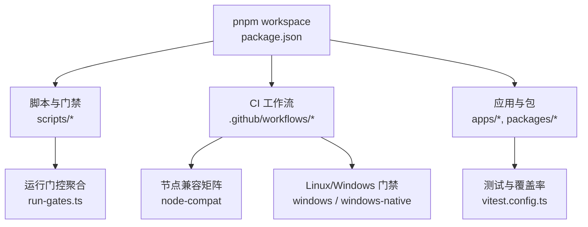
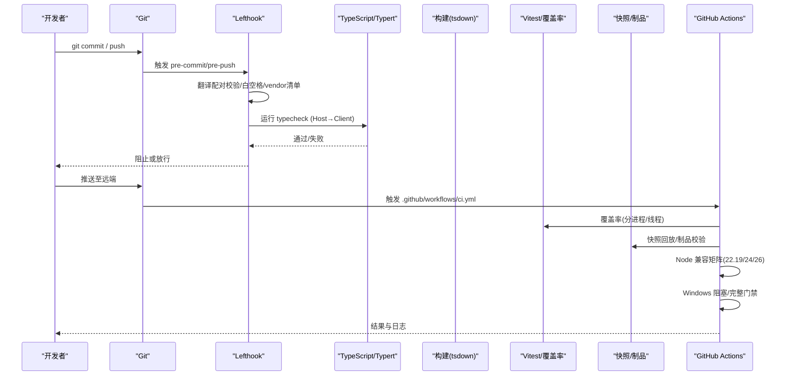
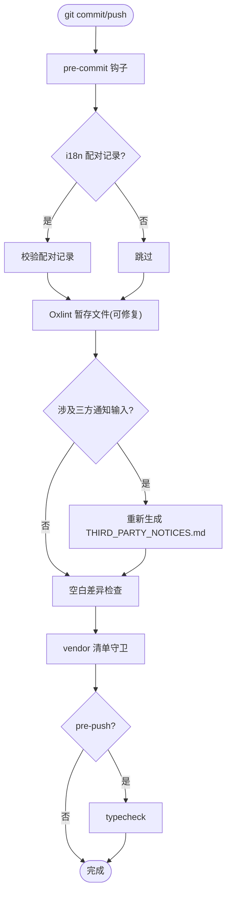
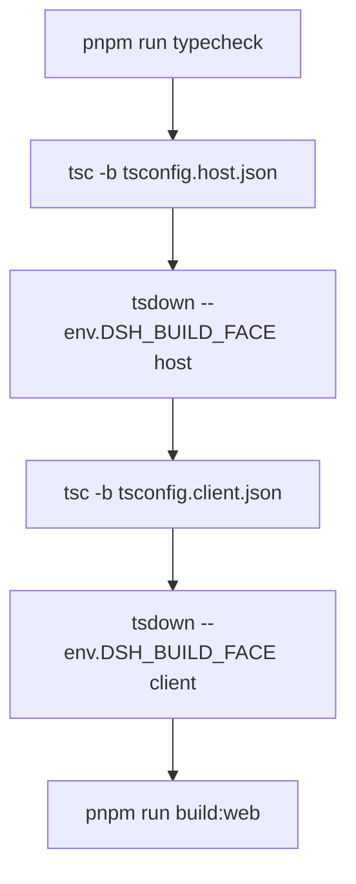
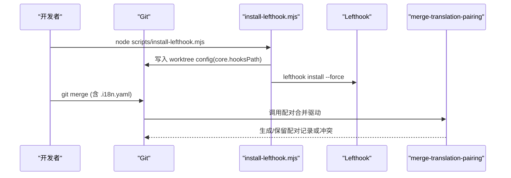
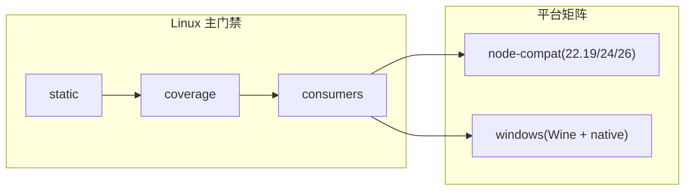
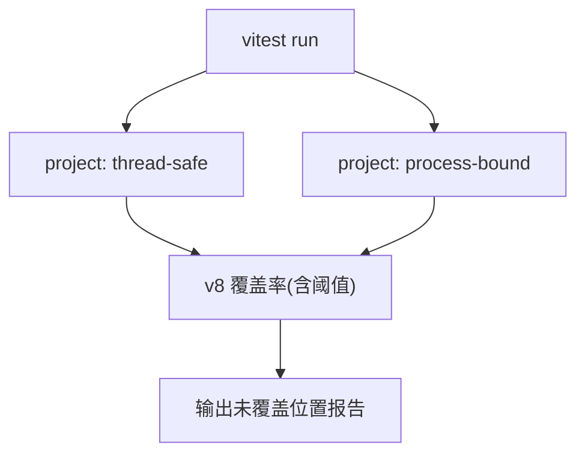
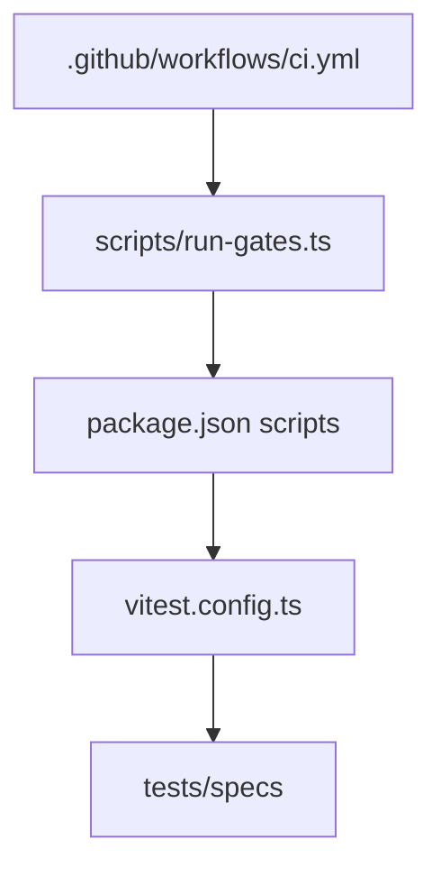

# 开发工作流程

<cite>
**本文引用的文件**
- [package.json](file://package.json)
- [lefthook.yml](file://lefthook.yml)
- [.github/workflows/ci.yml](file://.github/workflows/ci.yml)
- [scripts/run-gates.ts](file://scripts/run-gates.ts)
- [scripts/install-lefthook.mjs](file://scripts/install-lefthook.mjs)
- [scripts/merge-translation-pairing-driver.sh](file://scripts/merge-translation-pairing-driver.sh)
- [vitest.config.ts](file://vitest.config.ts)
- [docs/development.md](file://docs/development.md)
- [AGENTS.md](file://AGENTS.md)
</cite>

## 目录
1. [简介](#简介)
2. [项目结构](#项目结构)
3. [核心组件](#核心组件)
4. [架构总览](#架构总览)
5. [详细组件分析](#详细组件分析)
6. [依赖关系分析](#依赖关系分析)
7. [性能与内存问题排查](#性能与内存问题排查)
8. [故障排查指南](#故障排查指南)
9. [结论](#结论)
10. [附录：常用命令参考](#附录：常用命令参考)

## 简介
本文件面向日常开发者，系统化说明本地检查、类型检查、构建流程、Git 集成（Lefthook 钩子与配对合并驱动）、CI 门禁（关键工作流与兼容性矩阵）、常用命令、代码审查与 PR 规范，以及性能分析与内存泄漏检测的方法。内容基于仓库中的脚本、配置与工作流定义，确保可执行性与一致性。

## 项目结构
仓库采用 pnpm monorepo，根 package.json 定义了 workspaces、脚本入口与工具链；scripts 提供质量门禁与生成器；.github/workflows 定义 CI 流水线；docs 包含开发指南与子系统文档；apps、packages、examples、native、python 等构成产品与示例。

图表来源
- [package.json:1-143](file://package.json#L1-L143)
- [scripts/run-gates.ts:1-243](file://scripts/run-gates.ts#L1-L243)
- [.github/workflows/ci.yml:260-327](file://.github/workflows/ci.yml#L260-L327)
- [vitest.config.ts:117-159](file://vitest.config.ts#L117-L159)

章节来源
- [package.json:1-143](file://package.json#L1-L143)
- [docs/development.md:44-88](file://docs/development.md#L44-L88)

## 核心组件
- 本地检查与提交前校验：通过 Lefthook 在 pre-commit、pre-merge-commit、pre-push 阶段执行轻量检查与修复。
- 类型检查与构建：根脚本统一编排 Host/Client 构建与 Web 前端构建，并驱动 Typert 契约生成。
- Git 集成：自动安装 Lefthook 并配置 worktree-local hooks；注册“配对合并驱动”以处理双语 i18n 文件的合并冲突。
- CI 门禁：按 lane 组织静态检查、覆盖率、快照、制品校验、Node 版本兼容、Windows 阻塞与完整门禁。
- 测试与覆盖率：Vitest 双项目（线程安全/进程绑定）+ v8 覆盖率，严格每文件 100% 阈值。
- 演示程序：Headless、Cordis、ACP 三种演示入口。

章节来源
- [lefthook.yml:5-56](file://lefthook.yml#L5-L56)
- [package.json:19-142](file://package.json#L19-L142)
- [scripts/install-lefthook.mjs:30-42](file://scripts/install-lefthook.mjs#L30-L42)
- [scripts/merge-translation-pairing-driver.sh:1-36](file://scripts/merge-translation-pairing-driver.sh#L1-L36)
- [.github/workflows/ci.yml:48-258](file://.github/workflows/ci.yml#L48-L258)
- [vitest.config.ts:117-286](file://vitest.config.ts#L117-L286)

## 架构总览
下图展示从代码提交到 CI 门禁的端到端流程，包括本地 Lefthook 快速检查、类型检查、构建、测试、覆盖率、快照、制品校验、Node 兼容与 Windows 门禁。

图表来源
- [lefthook.yml:5-56](file://lefthook.yml#L5-L56)
- [package.json:19-142](file://package.json#L19-L142)
- [.github/workflows/ci.yml:48-258](file://.github/workflows/ci.yml#L48-L258)
- [vitest.config.ts:117-286](file://vitest.config.ts#L117-L286)

## 详细组件分析

### 本地检查与提交前校验（Lefthook）
- pre-commit：对暂存区的 i18n 配对记录进行校验；归档代理笔记校验；仅对暂存 TypeScript 文件运行 Oxlint 并尝试修复；当变更涉及第三方通知生成输入时，重新生成 THIRD_PARTY_NOTICES.md；检查空白差异；执行 vendor 清单守卫。
- pre-merge-commit：重复上述配对与归档校验，保障自动合并前的数据一致性。
- pre-push：执行 typecheck，确保 Host 契约生成与 Client 类型检查通过后再推送。

图表来源
- [lefthook.yml:5-56](file://lefthook.yml#L5-L56)

章节来源
- [lefthook.yml:5-56](file://lefthook.yml#L5-L56)

### 类型检查与构建流程
- 类型检查：先构建 Host 库（含 Typert 契约生成），再执行 Client 类型检查。
- 构建：依次执行 Host/Client 编译与 tsdown 打包，最后构建 Web 前端。
- 文档类型检查：在需要时使用 doc-typecheck 系列脚本验证文档片段的可编译性。

图表来源
- [package.json:19-32](file://package.json#L19-L32)
- [docs/development.md:64-76](file://docs/development.md#L64-L76)

章节来源
- [package.json:19-32](file://package.json#L19-L32)
- [docs/development.md:64-88](file://docs/development.md#L64-L88)

### Git 集成机制：Lefthook 与配对合并驱动
- Lefthook 安装：postinstall 自动运行安装脚本，设置 worktree-local hooks 路径，避免覆盖用户自定义 core.hooksPath；支持并发锁与回滚。
- 配对合并驱动：为 .i18n.yaml 注册 merge.dsh-translation-pairing 驱动；当 Node/tsx 不可用时回退为普通文本合并并提示恢复步骤。

图表来源
- [scripts/install-lefthook.mjs:30-42](file://scripts/install-lefthook.mjs#L30-L42)
- [scripts/install-lefthook.mjs:611-689](file://scripts/install-lefthook.mjs#L611-L689)
- [scripts/merge-translation-pairing-driver.sh:1-36](file://scripts/merge-translation-pairing-driver.sh#L1-L36)

章节来源
- [scripts/install-lefthook.mjs:691-800](file://scripts/install-lefthook.mjs#L691-L800)
- [scripts/merge-translation-pairing-driver.sh:1-36](file://scripts/merge-translation-pairing-driver.sh#L1-L36)
- [docs/development.md:101-117](file://docs/development.md#L101-L117)

### CI 门禁系统
- 关键 lanes：
  - static：运行时闭包、约束、许可证、包不变量、Cordis 配置、Issue 管理策略、模块图、knip、文档站点构建等。
  - coverage：v8 覆盖率，分进程/线程隔离，严格每文件 100%。
  - consumers：构建、Node 兼容、publint、包不变量、lint/duplication、快照、Web 快照、文档类型检查、NodeNext 类型、内置二进制冒烟。
  - windows：Wine 阻塞门禁与原生 Windows 完整门禁。
  - node-compat：在 22.19/24/26 上执行兼容性冒烟。
- 并发与缓存：使用 pnpm store 缓存、Playwright 缓存；failover 场景下调整并发与缓存策略。

图表来源
- [.github/workflows/ci.yml:48-258](file://.github/workflows/ci.yml#L48-L258)
- [.github/workflows/ci.yml:260-327](file://.github/workflows/ci.yml#L260-L327)
- [.github/workflows/ci.yml:338-490](file://.github/workflows/ci.yml#L338-L490)

章节来源
- [.github/workflows/ci.yml:48-490](file://.github/workflows/ci.yml#L48-L490)
- [scripts/run-gates.ts:192-441](file://scripts/run-gates.ts#L192-L441)

### 测试与覆盖率
- Vitest 双项目：thread-safe 与 process-bound，分别隔离进程全局状态与时序敏感测试。
- 覆盖率：v8 provider，严格 perFile 100% 阈值；排除类型文件、部分 GUI 债务区与平台专属路径；报告未覆盖位置。
- 快照与 e2e：keyless 快照回放、Web 快照、真实 API e2e（需密钥）。

图表来源
- [vitest.config.ts:117-286](file://vitest.config.ts#L117-L286)

章节来源
- [vitest.config.ts:117-286](file://vitest.config.ts#L117-L286)

### 演示程序运行
- Headless：通过 dsh CLI 运行一次性任务。
- Cordis：自引用演示，可在线修改插件运行时。
- ACP：自动化服务器，暴露 JSON-RPC stdio。

章节来源
- [package.json:136-140](file://package.json#L136-L140)
- [docs/development.md:127-151](file://docs/development.md#L127-L151)

## 依赖关系分析
- 脚本与门禁：run-gates.ts 聚合所有 gate 模式，定义依赖图与并发控制；各 pnpm 脚本作为叶子节点被调度。
- CI 与脚本：ci.yml 通过 pnpm 脚本调用 run-gates 的不同模式，形成 lane 化执行。
- 测试与覆盖率：vitest.config.ts 定义测试范围、排除项与覆盖率阈值，受环境变量影响。

图表来源
- [.github/workflows/ci.yml:48-258](file://.github/workflows/ci.yml#L48-L258)
- [scripts/run-gates.ts:192-441](file://scripts/run-gates.ts#L192-L441)
- [vitest.config.ts:117-286](file://vitest.config.ts#L117-L286)

章节来源
- [scripts/run-gates.ts:192-441](file://scripts/run-gates.ts#L192-L441)
- [.github/workflows/ci.yml:48-258](file://.github/workflows/ci.yml#L48-L258)

## 性能与内存问题排查
- 覆盖率与瓶颈定位：使用 test:coverage 获取 v8 覆盖率，结合未覆盖位置报告识别热点与盲区；通过 DSH_COVERAGE_MAX_WORKERS 控制并发，避免资源争用导致的假性慢。
- 进程/线程隔离：process-bound 项目用于隔离进程级副作用，便于复现与定位时序相关性能问题。
- 构建与打包：关注 tsdown 与 tsc 的阶段耗时；必要时使用 docs:build:mpa 或单独构建目标定位瓶颈。
- 内存泄漏检测建议：
  - 使用 Node 堆快照（heap snapshot）对比长时间运行前后对象增长，定位未释放引用。
  - 针对长生命周期服务（会话、持久化、网络连接）增加断言与清理路径，确保 dispose/close 被调用。
  - 在 e2e 与快照回放中观察内存曲线，结合 vitest worker 隔离减少交叉污染。
  - 对于 Web 前端，使用浏览器性能面板与内存面板分析渲染与事件监听器泄漏。

[本节为通用指导，不直接分析具体文件]

## 故障排查指南
- Lefthook 安装失败或锁定：查看安装锁与 ownership marker；若存在残留锁或冲突的 core.hooksPath，遵循错误提示移除或迁移配置后重试。
- 配对合并驱动不可用：当 Node/tsx 不可用时，会回退为文本合并并提示恢复；恢复依赖后可重新合并或使用 resolve-translation-pairing-conflicts 解决冲突。
- CI 超时或资源不足：调整 DSH_GATE_CONCURRENCY、DSH_COVERAGE_MAX_WORKERS、DSH_SNAPSHOT_MAX_CONCURRENCY；在 failover 场景下使用自托管池。
- 覆盖率不达标：根据未覆盖位置报告补充测试；注意平台专属路径与 GUI 债务区的排除规则。

章节来源
- [scripts/install-lefthook.mjs:307-380](file://scripts/install-lefthook.mjs#L307-L380)
- [scripts/install-lefthook.mjs:611-689](file://scripts/install-lefthook.mjs#L611-L689)
- [scripts/merge-translation-pairing-driver.sh:15-36](file://scripts/merge-translation-pairing-driver.sh#L15-L36)
- [vitest.config.ts:160-286](file://vitest.config.ts#L160-L286)

## 结论
本仓库通过 Lefthook 实现本地快速门禁，配合 run-gates 与 CI 工作流形成完整的类型检查、构建、测试、覆盖率、快照与制品校验闭环；Node 兼容矩阵与 Windows 门禁保障跨平台稳定性；严格的覆盖率阈值与详细的未覆盖报告帮助持续改进质量。开发者应优先选择最小范围的本地检查，并在 PR 中附带必要的文档与演示更新。

## 附录：常用命令参考
- 安装与初始化
  - pnpm install：安装依赖并自动配置 Lefthook 与合并驱动
- 类型检查与构建
  - pnpm run typecheck：Host/Client 类型检查（含契约生成）
  - pnpm run build：完整构建（Host/Client/Web）
- 测试与覆盖率
  - pnpm run test：单元测试
  - pnpm run test:coverage：覆盖率门禁（严格每文件 100%）
  - pnpm run test:e2e：真实 API e2e（需密钥）
  - pnpm run test:snapshot：keyless 快照回放
- 文档与站点
  - pnpm run doc-sync：文档相关门禁
  - pnpm run website:build：站点构建与死链检查
- 演示程序
  - pnpm dsh --profile headless "task"：Headless 演示
  - pnpm run demo:cordis：Cordis 演示
  - pnpm run demo:acp：ACP 自动化服务器
- 其他
  - pnpm run lint：代码风格检查
  - pnpm run duplication：克隆检测
  - pnpm run hygiene：综合健康检查（knip、publint、约束、许可证、包不变量、NodeNext 类型等）
  - pnpm run check:all：本地全量门禁（独立于 Git 钩子）

章节来源
- [package.json:19-142](file://package.json#L19-L142)
- [AGENTS.md:59-80](file://AGENTS.md#L59-L80)
- [docs/development.md:123-151](file://docs/development.md#L123-L151)