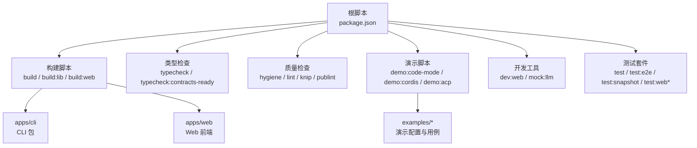
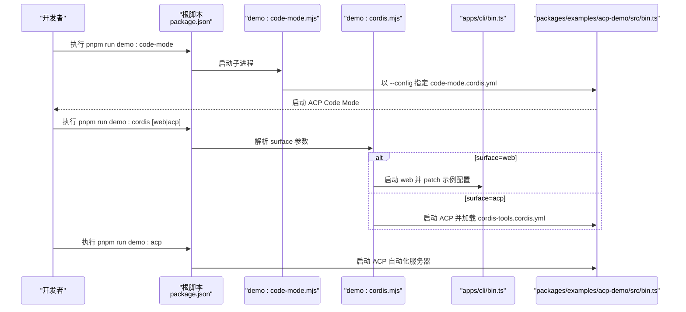
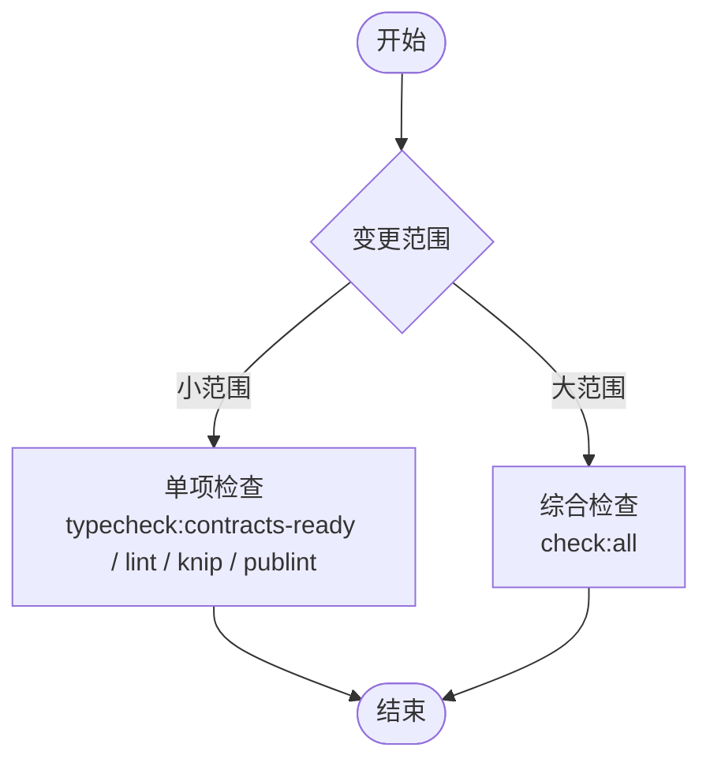
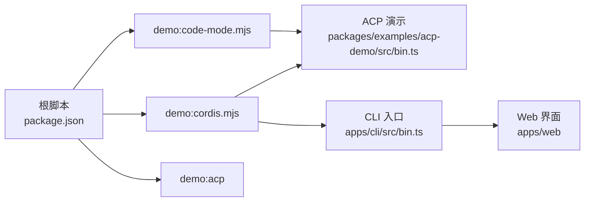

# 日常开发命令参考

<cite>
**本文引用的文件**
- [package.json](file://package.json)
- [apps/cli/package.json](file://apps/cli/package.json)
- [scripts/demo-code-mode.mjs](file://scripts/demo-code-mode.mjs)
- [scripts/demo-cordis.mjs](file://scripts/demo-cordis.mjs)
- [examples/headless-agent/README.md](file://examples/headless-agent/README.md)
- [examples/acp-agent/README.md](file://examples/acp-agent/README.md)
- [examples/web-cordis/README.md](file://examples/web-cordis/README.md)
- [scripts/dev-web.ts](file://scripts/dev-web.ts)
</cite>

## 目录
1. [简介](#简介)
2. [项目结构](#项目结构)
3. [核心命令总览](#核心命令总览)
4. [架构与流程概览](#架构与流程概览)
5. [详细命令说明](#详细命令说明)
6. [演示程序运行方式](#演示程序运行方式)
7. [选择性检查与综合检查](#选择性检查与综合检查)
8. [常用调试与开发工具快捷命令](#常用调试与开发工具快捷命令)
9. [依赖关系分析](#依赖关系分析)
10. [性能与稳定性建议](#性能与稳定性建议)
11. [故障排查指南](#故障排查指南)
12. [结论](#结论)

## 简介
本参考聚焦于日常开发中的高频命令，覆盖类型检查、构建、代码质量检查、演示程序运行（Headless 编码代理、Cordis 自引用演示、ACP 自动化服务器）、选择性检查与综合检查，以及常用调试与开发工具的快捷命令。所有命令均基于仓库根目录的 pnpm scripts 定义，便于在本地快速迭代与验证。

## 项目结构
仓库采用 monorepo 组织，根 package.json 集中定义了构建、测试、文档、发布等脚本；示例位于 examples 目录；CLI 入口位于 apps/cli；Web 前端与相关测试位于 apps/web；大量辅助脚本位于 scripts。

图表来源
- [package.json:19-142](file://package.json#L19-L142)

章节来源
- [package.json:1-183](file://package.json#L1-L183)

## 核心命令总览
- 类型检查
  - pnpm run typecheck：先构建宿主库，再执行客户端契约就绪的类型检查
  - pnpm run typecheck:contracts-ready：仅对客户端契约进行类型检查
- 构建
  - pnpm run build：构建宿主与客户端库并构建 Web 前端
  - pnpm run build:lib：分别构建宿主与客户端库
  - pnpm run build:web：仅构建 Web 前端
- 代码质量检查
  - pnpm run hygiene：组合式质量门禁（vendor 重扫描、依赖分析、许可证校验、包不变量、运行时闭包等）
  - pnpm run lint：构建宿主库后执行 oxlint
  - pnpm run lint:fix：自动修复部分问题
  - pnpm run knip：检测未使用依赖与导出
  - pnpm run publint：校验包发布清单
- 演示程序
  - pnpm run demo:code-mode：启动 ACP Code Mode 演示
  - pnpm run demo:cordis：启动 Cordis 自引用演示（默认 Web 界面，可选 acp）
  - pnpm run demo:acp：启动 ACP 自动化服务器
- 开发与调试
  - pnpm run dev:web：监听并重建 dsh.client 插件，配合 Web 服务实现热重载
  - pnpm run mock:llm：启动 LLM Mock 服务器用于离线调试
- 测试
  - pnpm run test：运行单元测试
  - pnpm run test:e2e：运行端到端测试
  - pnpm run test:snapshot：运行快照测试
  - pnpm run test:web / test:web:perf / test:web:stress：Web 相关测试

章节来源
- [package.json:19-142](file://package.json#L19-L142)

## 架构与流程概览
演示程序的启动路径由根脚本统一封装，内部通过 Node 子进程调用具体入口：
- demo:code-mode 直接启动 ACP 演示并加载 Code Mode 配置
- demo:cordis 根据参数选择 Web 或 ACP 两种表面，分别启动对应的 CLI 或 ACP 演示
- demo:acp 启动 ACP 自动化服务器，输出 JSON-RPC over stdio

图表来源
- [package.json:137-140](file://package.json#L137-L140)
- [scripts/demo-code-mode.mjs:1-17](file://scripts/demo-code-mode.mjs#L1-L17)
- [scripts/demo-cordis.mjs:1-23](file://scripts/demo-cordis.mjs#L1-L23)

章节来源
- [scripts/demo-code-mode.mjs:1-17](file://scripts/demo-code-mode.mjs#L1-L17)
- [scripts/demo-cordis.mjs:1-23](file://scripts/demo-cordis.mjs#L1-L23)
- [package.json:137-140](file://package.json#L137-L140)

## 详细命令说明
- 类型检查
  - pnpm run typecheck：适用于提交前或 CI 前的完整类型检查，会先构建宿主库，确保契约就绪后再检查客户端类型
  - pnpm run typecheck:contracts-ready：适用于快速增量检查，仅针对客户端契约
- 构建
  - pnpm run build：全量构建（宿主+客户端+Web），适合发布前或完整回归
  - pnpm run build:lib：仅构建宿主与客户端库，适合修改 packages 时快速验证
  - pnpm run build:web：仅构建 Web 前端，适合 UI 相关改动
- 代码质量检查
  - pnpm run hygiene：组合式门禁，包含 vendor 重扫描、依赖分析、许可证校验、包不变量、运行时闭包、Cordis 配置校验、Node 版本兼容性、vendored 链接校验等
  - pnpm run lint：构建宿主库后执行静态检查
  - pnpm run lint:fix：尝试自动修复可修复的问题
  - pnpm run knip：检测未使用的依赖与导出
  - pnpm run publint：校验包的发布元数据
- 演示程序
  - pnpm run demo:code-mode：需要 DEEPSEEK_API_KEY，启动 ACP Code Mode 演示
  - pnpm run demo:cordis：默认启动 Web 界面（http://127.0.0.1:3081），也可切换为 ACP 模式
  - pnpm run demo:acp：启动 ACP 自动化服务器，stdout 仅承载 JSON-RPC，诊断信息应走 stderr
- 开发与调试
  - pnpm run dev:web：监听并重建 dsh.client 插件，支持 --poll 模式适配网络挂载环境
  - pnpm run mock:llm：启动 LLM Mock 服务器，便于无模型调用的本地调试
- 测试
  - pnpm run test：运行单元测试
  - pnpm run test:e2e：运行端到端测试
  - pnpm run test:snapshot：运行快照测试
  - pnpm run test:web / test:web:perf / test:web:stress：Web 相关测试

章节来源
- [package.json:19-142](file://package.json#L19-L142)
- [scripts/dev-web.ts:1-115](file://scripts/dev-web.ts#L1-L115)

## 演示程序运行方式
- Headless 编码代理
  - 通过 CLI 以 headless 配置文件运行，创建新会话并持久化，最终输出助手文本后退出
  - 需要在仓库根 .env 或环境变量中设置 DEEPSEEK_API_KEY（可选 DEEPSEEK_BASE_URL）
  - 典型用法：pnpm dsh --profile headless "修复工作区中的失败测试"
- Cordis 自引用演示
  - 通过 demo:cordis 启动，默认打开 Web 界面（端口 3081），可在浏览器中查看 agent 当前 Cordis 进程并动态挂载/卸载插件
  - 也可通过 demo:cordis acp 切换到 ACP 自动化服务器模式
- ACP 自动化服务器
  - 通过 demo:acp 启动，提供基于 JSON-RPC stdio 的 Agent Client Protocol 接口
  - 每个 session/new 会创建独立的工作空间与权限策略，stdout 保持协议纯净，诊断信息走 stderr

章节来源
- [examples/headless-agent/README.md:7-18](file://examples/headless-agent/README.md#L7-L18)
- [examples/web-cordis/README.md:7-22](file://examples/web-cordis/README.md#L7-L22)
- [examples/acp-agent/README.md:7-18](file://examples/acp-agent/README.md#L7-L18)
- [scripts/demo-code-mode.mjs:1-17](file://scripts/demo-code-mode.mjs#L1-L17)
- [scripts/demo-cordis.mjs:1-23](file://scripts/demo-cordis.mjs#L1-L23)
- [package.json:137-140](file://package.json#L137-L140)

## 选择性检查与综合检查
- 选择性检查
  - 类型检查：pnpm run typecheck:contracts-ready（快速增量）
  - 静态检查：pnpm run lint / pnpm run lint:fix
  - 依赖与导出：pnpm run knip
  - 包发布校验：pnpm run publint
  - 变更范围较小或局部修改时，优先使用上述单项命令以提升反馈速度
- 综合检查
  - pnpm run check:all：执行仓库级 gates 的综合检查集合，适用于提交前或 PR 合并前的全面验证
  - 其他 CI 导向的检查：check:ci、check:ci:static、check:ci:coverage、check:ci:snapshot、check:ci:artifacts、check:ci:consumers 等，按 CI 阶段选择

章节来源
- [package.json:49-63](file://package.json#L49-L63)

## 常用调试与开发工具快捷命令
- 前端开发
  - pnpm run dev:web：监听并重建 dsh.client 插件，支持 --poll 模式（适用于网络挂载环境）
  - 配合 Web 服务（dsh web）实现热重载，无需手动重启
- 模型调试
  - pnpm run mock:llm：启动 LLM Mock 服务器，避免真实模型调用，便于离线调试与回放
- 演示与集成
  - pnpm run demo:code-mode：快速验证 Code Mode 能力
  - pnpm run demo:cordis：验证 Cordis 工具链与插件生命周期
  - pnpm run demo:acp：验证 ACP 协议与自动化流程
- 测试
  - pnpm run test：运行单元测试
  - pnpm run test:e2e：运行端到端测试
  - pnpm run test:snapshot：运行快照测试
  - pnpm run test:web / test:web:perf / test:web:stress：Web 相关测试

章节来源
- [package.json:137-142](file://package.json#L137-L142)
- [scripts/dev-web.ts:1-115](file://scripts/dev-web.ts#L1-L115)

## 依赖关系分析
演示脚本与 CLI、ACP 演示之间的依赖关系如下：

图表来源
- [package.json:137-140](file://package.json#L137-L140)
- [scripts/demo-code-mode.mjs:1-17](file://scripts/demo-code-mode.mjs#L1-L17)
- [scripts/demo-cordis.mjs:1-23](file://scripts/demo-cordis.mjs#L1-L23)

章节来源
- [package.json:137-140](file://package.json#L137-L140)
- [scripts/demo-code-mode.mjs:1-17](file://scripts/demo-code-mode.mjs#L1-L17)
- [scripts/demo-cordis.mjs:1-23](file://scripts/demo-cordis.mjs#L1-L23)

## 性能与稳定性建议
- 类型检查
  - 增量开发时使用 typecheck:contracts-ready，减少等待时间
  - 提交前使用 typecheck 保证契约一致性
- 构建
  - 仅修改 packages 时使用 build:lib，避免重复构建 Web
  - 仅修改 UI 时使用 build:web，提升反馈速度
- 质量检查
  - 小范围改动使用 lint/knip/publint 单项检查
  - 大范围改动或合并前使用 hygiene 或 check:all
- 演示与调试
  - 使用 mock:llm 避免模型调用开销，提高本地迭代效率
  - dev:web 的 --poll 模式适用于网络挂载环境，避免 inotify 事件缺失导致的热重载失效

[本节为通用建议，不直接分析具体文件]

## 故障排查指南
- 演示无法启动
  - 确认已设置 DEEPSEEK_API_KEY（必要时设置 DEEPSEEK_BASE_URL）
  - 检查端口占用（Web 默认 3081）
  - 查看 stdout/stderr 输出，ACP 模式下诊断信息应走 stderr
- 类型检查失败
  - 先执行 build:lib:host，确保契约就绪
  - 使用 typecheck:contracts-ready 快速定位客户端契约问题
- 构建失败
  - 区分宿主与客户端构建错误，分别使用 build:lib:host 与 build:lib:client
  - Web 构建失败时单独执行 build:web
- 质量检查失败
  - 逐项执行 lint/knip/publint/hygiene 的子任务定位问题
  - 使用 lint:fix 自动修复可修复问题
- 热重载不生效
  - 使用 dev:web --poll 模式，或在网络挂载环境中调整轮询间隔
  - 确保宿主库已构建（lib 目录存在）

章节来源
- [examples/headless-agent/README.md:7-18](file://examples/headless-agent/README.md#L7-L18)
- [examples/acp-agent/README.md:14-25](file://examples/acp-agent/README.md#L14-L25)
- [scripts/dev-web.ts:1-115](file://scripts/dev-web.ts#L1-L115)
- [package.json:19-142](file://package.json#L19-L142)

## 结论
本参考提供了从类型检查、构建、质量检查到演示程序运行与调试的全链路命令指南。通过选择性检查与综合检查的组合，开发者可根据变更范围选择合适的检查集；通过演示程序与调试工具，可快速验证功能与集成效果。建议在提交前执行综合检查，在开发过程中使用单项检查与演示脚本提升迭代效率。