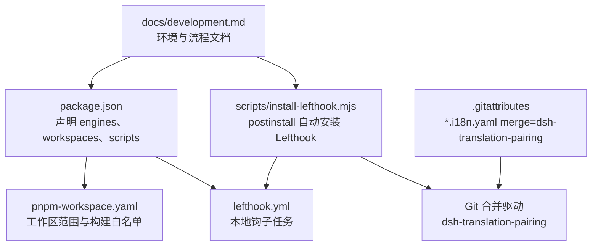
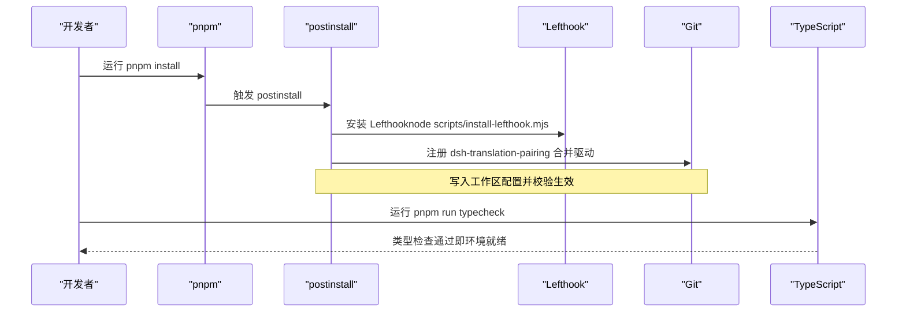
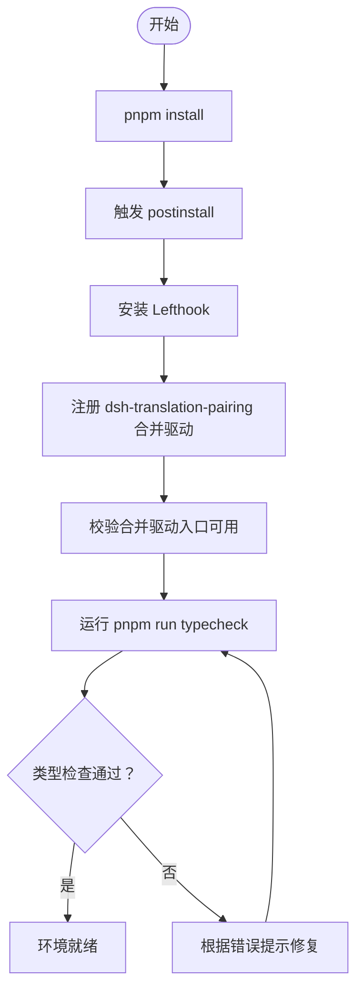
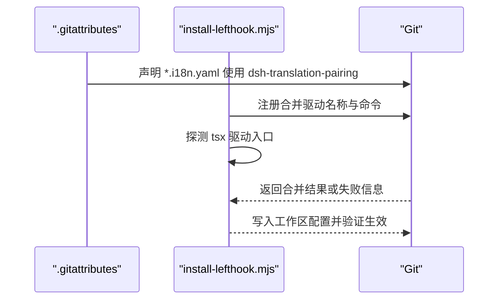
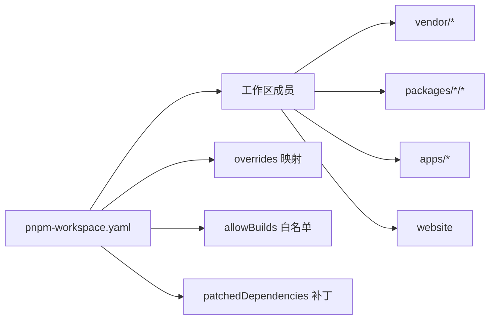

# 本地开发环境搭建

<cite>
**本文引用的文件**
- [package.json](file://package.json)
- [pnpm-workspace.yaml](file://pnpm-workspace.yaml)
- [lefthook.yml](file://lefthook.yml)
- [scripts/install-lefthook.mjs](file://scripts/install-lefthook.mjs)
- [.gitattributes](file://.gitattributes)
- [docs/development.md](file://docs/development.md)
- [README.md](file://README.md)
</cite>

## 目录
1. [简介](#简介)
2. [项目结构](#项目结构)
3. [核心组件](#核心组件)
4. [架构总览](#架构总览)
5. [详细组件分析](#详细组件分析)
6. [依赖关系分析](#依赖关系分析)
7. [性能注意事项](#性能注意事项)
8. [故障排查指南](#故障排查指南)
9. [结论](#结论)
10. [附录](#附录)

## 简介
本指南面向首次克隆仓库的开发者，详细说明如何在本机完成 Node.js、Corepack、pnpm 的安装与配置，如何在首次安装时自动启用 Lefthook 钩子并注册 Git 合并驱动，如何设置 DeepSeek API 密钥等环境变量，以及如何进行完整的初始化检查与验证。同时提供常见问题诊断与修复建议，确保你能够快速进入开发状态。

## 项目结构
仓库采用 pnpm workspace 管理多包工程，根目录通过 package.json 声明工作区成员、脚本与引擎要求；pnpm-workspace.yaml 定义工作区范围、覆盖规则与构建白名单；lefthook.yml 定义本地 Git 钩子任务；install-lefthook.mjs 在 postinstall 中自动安装 Lefthook 并配置工作区专属的 Git 合并驱动；.gitattributes 将 i18n 配对记录标记为使用自定义合并驱动；docs/development.md 提供完整的环境与流程说明。

图表来源
- [package.json:1-18](file://package.json#L1-L18)
- [pnpm-workspace.yaml:1-22](file://pnpm-workspace.yaml#L1-L22)
- [lefthook.yml:1-56](file://lefthook.yml#L1-L56)
- [scripts/install-lefthook.mjs:30-42](file://scripts/install-lefthook.mjs#L30-L42)
- [.gitattributes:11-14](file://.gitattributes#L11-L14)
- [docs/development.md:7-40](file://docs/development.md#L7-L40)

章节来源
- [package.json:1-18](file://package.json#L1-L18)
- [pnpm-workspace.yaml:1-22](file://pnpm-workspace.yaml#L1-L22)
- [lefthook.yml:1-56](file://lefthook.yml#L1-L56)
- [scripts/install-lefthook.mjs:30-42](file://scripts/install-lefthook.mjs#L30-L42)
- [.gitattributes:11-14](file://.gitattributes#L11-L14)
- [docs/development.md:7-40](file://docs/development.md#L7-L40)

## 核心组件
- Node.js 版本要求：支持 22.19+ 与 24+（CI 覆盖 22.19、24、26）。
- Corepack 与 pnpm：仓库通过 package.json 的 packageManager 字段锁定 pnpm@11.7.0；若 pnpm --version 未通过 Corepack 解析，请先执行 corepack enable。
- Git 版本要求：Git 2.26 或更高，以启用 worktree 特定配置扩展。
- 依赖安装：从仓库根运行 pnpm install；该命令会触发 postinstall 自动安装 Lefthook 并注册 dsh-translation-pairing 合并驱动。
- 手动补装：如果缓存恢复导致 postinstall 被跳过，可手动运行 node scripts/install-lefthook.mjs。
- 类型检查：首次克隆后运行 pnpm run typecheck，成功后表示环境就绪。

章节来源
- [docs/development.md:7-40](file://docs/development.md#L7-L40)
- [package.json:8-10](file://package.json#L8-L10)
- [package.json:142-142](file://package.json#L142-L142)
- [scripts/install-lefthook.mjs:19-20](file://scripts/install-lefthook.mjs#L19-L20)

## 架构总览
下图展示了“首次克隆后的安装与初始化”流程，包括 Node.js/Corepack/pnpm 校验、依赖安装、Lefthook 安装与 Git 合并驱动注册、以及类型检查验证。

图表来源
- [package.json:142-142](file://package.json#L142-L142)
- [scripts/install-lefthook.mjs:691-794](file://scripts/install-lefthook.mjs#L691-L794)
- [docs/development.md:16-40](file://docs/development.md#L16-L40)

## 详细组件分析

### 环境要求与工具链
- Node.js：满足 ^22.19.0 || >=24.0.0。
- Corepack：用于解析并安装仓库锁定的 pnpm 版本。
- pnpm：通过 packageManager 字段锁定版本，避免不同机器上的版本差异。
- Git：需要 2.26+ 以启用 worktree 配置扩展，从而让 Lefthook 钩子与工作区配置隔离。

章节来源
- [package.json:8-10](file://package.json#L8-L10)
- [docs/development.md:7-14](file://docs/development.md#L7-L14)
- [scripts/install-lefthook.mjs:19-20](file://scripts/install-lefthook.mjs#L19-L20)

### 首次克隆后的依赖安装流程
- 从仓库根执行 pnpm install。
- 安装完成后，postinstall 会自动调用 scripts/install-lefthook.mjs。
- 该脚本会：
  - 检测并安装 Lefthook。
  - 在工作区目录下创建受管理的 hooks 目录。
  - 注册 dsh-translation-pairing 合并驱动到 Git 工作区配置。
  - 校验合并驱动入口可用性。
- 如果因缓存恢复导致 postinstall 被跳过，需手动运行 node scripts/install-lefthook.mjs。

图表来源
- [package.json:142-142](file://package.json#L142-L142)
- [scripts/install-lefthook.mjs:691-794](file://scripts/install-lefthook.mjs#L691-L794)
- [docs/development.md:16-40](file://docs/development.md#L16-L40)

章节来源
- [package.json:142-142](file://package.json#L142-L142)
- [scripts/install-lefthook.mjs:691-794](file://scripts/install-lefthook.mjs#L691-L794)
- [docs/development.md:16-40](file://docs/development.md#L16-L40)

### Lefthook 钩子配置
- pre-commit：对暂存文件进行翻译配对校验、归档代理笔记校验、代码风格检查（含自动修复）、第三方通知再生成、空白字符检查、供应商清单守卫。
- pre-merge-commit：在创建自动合并提交前再次校验翻译配对。
- pre-push：执行类型检查，确保 Host 库阶段与生成的契约准备完毕后再进行客户端类型检查。

章节来源
- [lefthook.yml:5-56](file://lefthook.yml#L5-L56)
- [docs/development.md:107-117](file://docs/development.md#L107-L117)

### Git 合并驱动设置
- .gitattributes 将 *.i18n.yaml 标记为使用 dsh-translation-pairing 合并驱动。
- install-lefthook.mjs 在安装过程中会：
  - 探测 Node/tsx 驱动的入口是否可用。
  - 在工作区配置中注册合并驱动名称与命令。
  - 校验新写入的配置成为有效的工作区值。
- 若驱动不可用，Git 会回退到普通文本合并结果，并在控制台输出恢复路径。

图表来源
- [.gitattributes:11-14](file://.gitattributes#L11-L14)
- [scripts/install-lefthook.mjs:30-42](file://scripts/install-lefthook.mjs#L30-L42)
- [scripts/install-lefthook.mjs:611-689](file://scripts/install-lefthook.mjs#L611-L689)

章节来源
- [.gitattributes:11-14](file://.gitattributes#L11-L14)
- [scripts/install-lefthook.mjs:30-42](file://scripts/install-lefthook.mjs#L30-L42)
- [scripts/install-lefthook.mjs:611-689](file://scripts/install-lefthook.mjs#L611-L689)

### 环境变量配置指南（DeepSeek API 密钥）
- 真实 DeepSeek 适配器与关键演示需要 DEEPSEEK_API_KEY。
- 可选变量：DEEPSEEK_BASE_URL（默认公共 API）。
- 可在仓库根目录的 .env 文件中设置（该文件被忽略），或通过进程环境变量注入。
- 若未设置 DEEPSEEK_API_KEY，相关 e2e 测试会自动跳过。

章节来源
- [docs/development.md:90-100](file://docs/development.md#L90-L100)

### 初始化检查流程与验证步骤
- 首次克隆后：
  - 运行 pnpm install（自动安装依赖与 Lefthook，注册合并驱动）。
  - 如缓存恢复导致缺失，手动运行 node scripts/install-lefthook.mjs。
  - 运行 pnpm run typecheck，通过后表示环境就绪。
- 日常开发：
  - 修改代码后提交前，pre-commit 钩子会执行快速检查。
  - 推送前，pre-push 钩子会执行类型检查。
  - 如需全面检查，可运行 pnpm run check:all。

章节来源
- [docs/development.md:16-40](file://docs/development.md#L16-L40)
- [docs/development.md:107-117](file://docs/development.md#L107-L117)

## 依赖关系分析
- pnpm-workspace.yaml 定义了工作区成员范围，并将 vendor 与 native/landlock-run 纳入工作区。
- overrides 将某些包名指向本地 vendor 源，保证本地构建解析一致。
- allowBuilds 明确允许 esbuild、lefthook、node-pty 等需要原生构建的包执行生命周期脚本。
- patchedDependencies 对 node-pty 应用补丁，确保跨平台行为一致。

图表来源
- [pnpm-workspace.yaml:1-22](file://pnpm-workspace.yaml#L1-L22)
- [pnpm-workspace.yaml:27-56](file://pnpm-workspace.yaml#L27-L56)
- [pnpm-workspace.yaml:71-73](file://pnpm-workspace.yaml#L71-L73)

章节来源
- [pnpm-workspace.yaml:1-22](file://pnpm-workspace.yaml#L1-L22)
- [pnpm-workspace.yaml:27-56](file://pnpm-workspace.yaml#L27-L56)
- [pnpm-workspace.yaml:71-73](file://pnpm-workspace.yaml#L71-L73)

## 性能注意事项
- 本地钩子仅做快速检查，不运行全量测试与构建，以减少提交延迟。
- 类型检查在 pre-push 阶段执行，确保推送前已完成 Host 库阶段与契约生成。
- 如需一次性运行全部门禁，可使用 pnpm run check:all，但通常按变更面选择最小检查集更高效。

章节来源
- [docs/development.md:107-117](file://docs/development.md#L107-L117)

## 故障排查指南
- 缓存恢复导致的集成缺失：
  - 现象：Lefthook 未安装或合并驱动未注册。
  - 处理：手动运行 node scripts/install-lefthook.mjs。
- Git 配置冲突：
  - 现象：合并驱动配置来自包含文件或命令作用域，或被用户自定义覆盖。
  - 处理：遵循脚本的诊断信息，移除或整合自定义配置；必要时设置 DSH_LEFTHOOK_ALLOW_HOOKS_PATH_OVERRIDE=1 以允许覆盖继承的 hooksPath（谨慎使用）。
- 合并驱动不可用：
  - 现象：Node/tsx 驱动入口不可用，Git 保留普通文本结果并提示恢复路径。
  - 处理：恢复依赖后运行 pnpm run resolve-translation-pairing-conflicts，或 git merge --abort。
- 锁文件冲突：
  - 现象：安装锁文件存在且所有者进程已终止。
  - 处理：确认无其他安装进程后删除锁文件再重试。

章节来源
- [docs/development.md:26-33](file://docs/development.md#L26-L33)
- [scripts/install-lefthook.mjs:539-609](file://scripts/install-lefthook.mjs#L539-L609)
- [scripts/install-lefthook.mjs:611-689](file://scripts/install-lefthook.mjs#L611-L689)
- [scripts/install-lefthook.mjs:307-457](file://scripts/install-lefthook.mjs#L307-L457)

## 结论
按照本指南完成 Node.js、Corepack、pnpm 的安装与配置，并通过 pnpm install 与 pnpm run typecheck 完成初始化检查，即可顺利进入开发。Lefthook 与 Git 合并驱动会在安装阶段自动配置，确保本地提交与合并过程的一致性。遇到环境问题，可依据故障排查指南快速定位与修复。

## 附录
- 快速启动 Web UI（从源码）：
  - 参考 README 中的“从源码运行”步骤，先安装依赖、构建，然后运行 dsh web。
- 常用命令：
  - 构建：pnpm run build
  - 类型检查：pnpm run typecheck
  - 全面检查：pnpm run check:all

章节来源
- [README.md:25-35](file://README.md#L25-L35)
- [package.json:19-48](file://package.json#L19-L48)