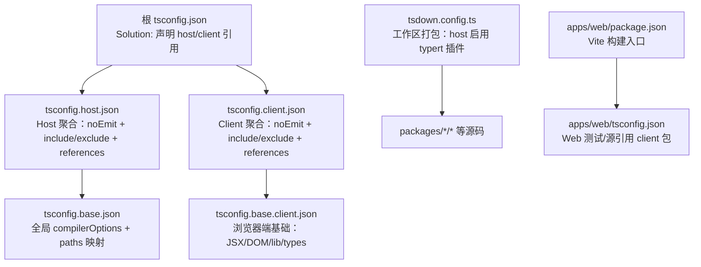
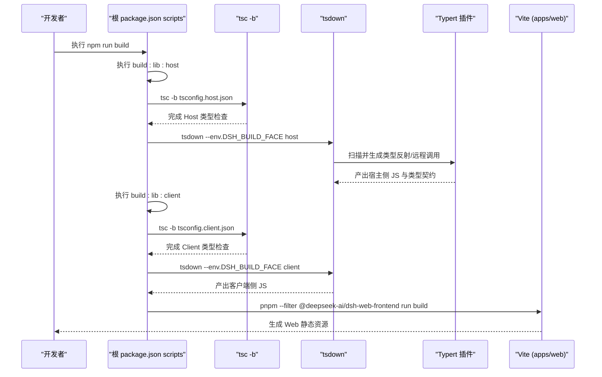
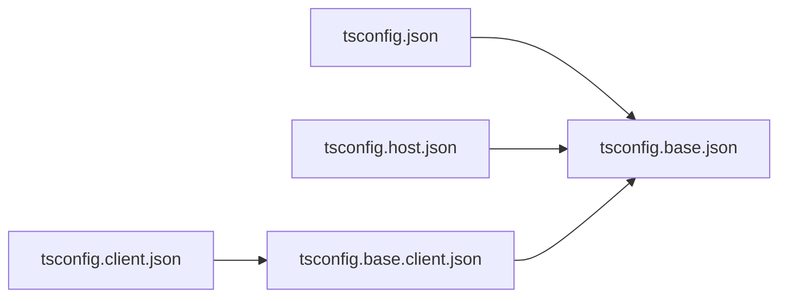
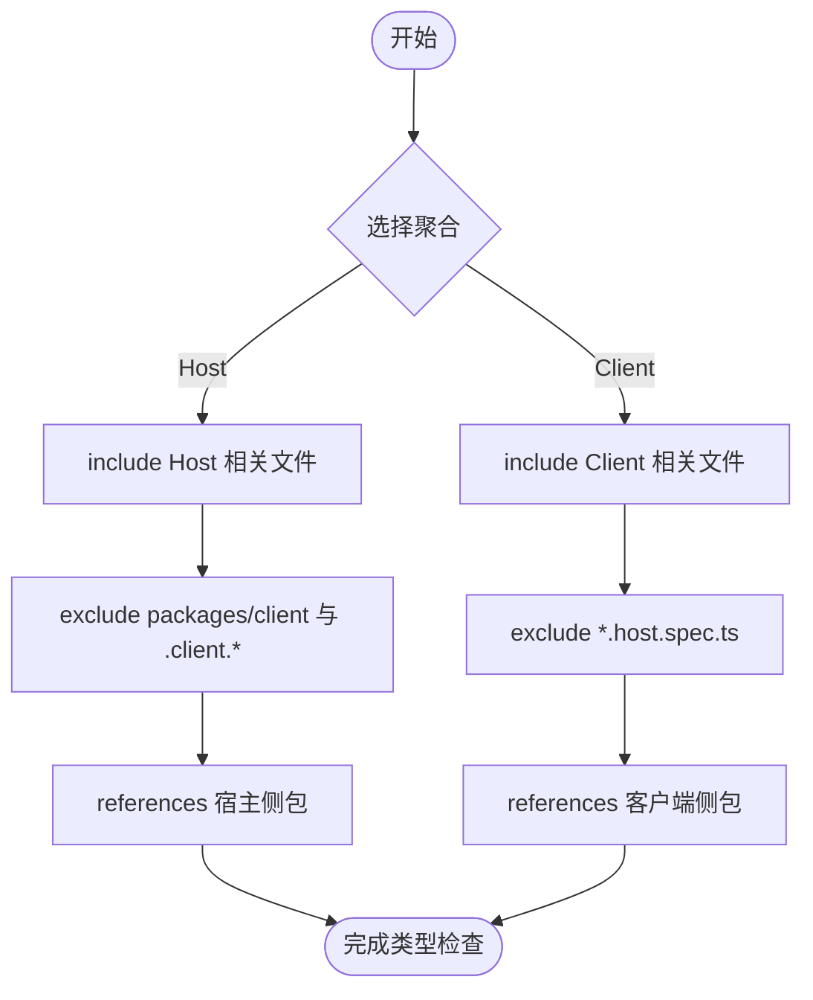
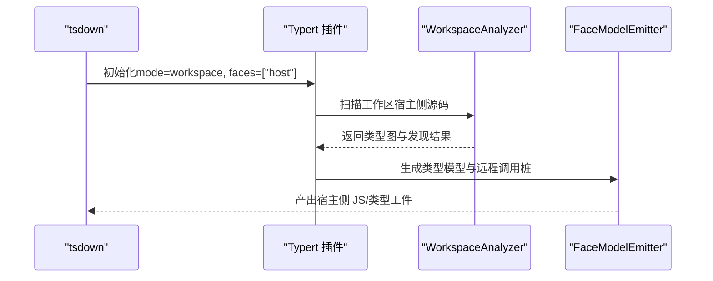
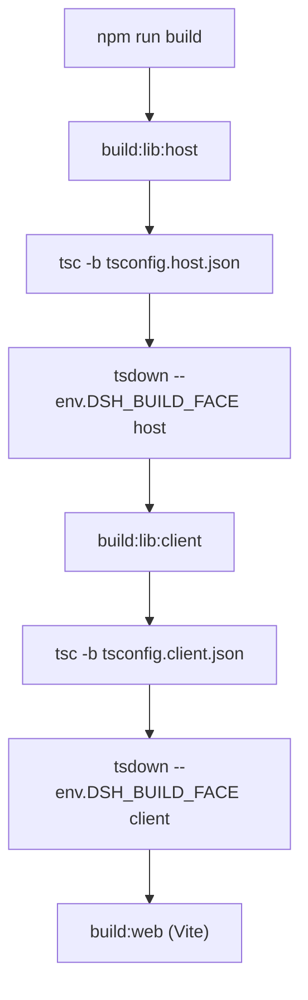
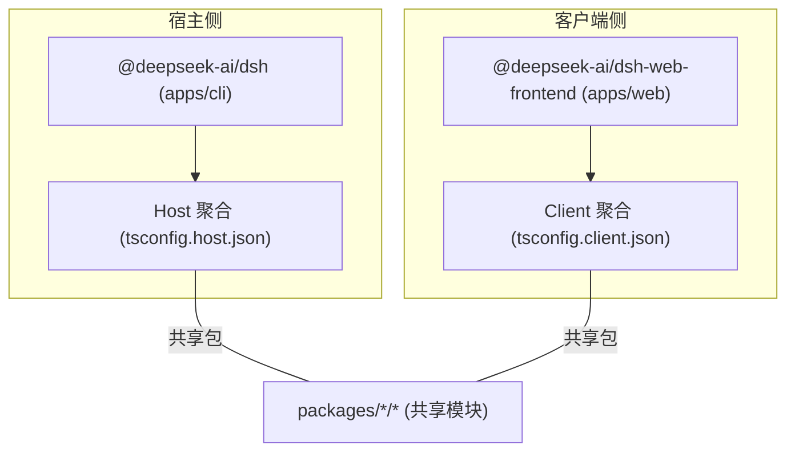

# 构建系统与 TypeScript 配置

<cite>
**本文引用的文件**
- [package.json](file://package.json)
- [tsconfig.json](file://tsconfig.json)
- [tsconfig.base.json](file://tsconfig.base.json)
- [tsconfig.base.client.json](file://tsconfig.base.client.json)
- [tsconfig.host.json](file://tsconfig.host.json)
- [tsconfig.client.json](file://tsconfig.client.json)
- [tsdown.config.ts](file://tsdown.config.ts)
- [apps/cli/package.json](file://apps/cli/package.json)
- [apps/web/package.json](file://apps/web/package.json)
- [apps/web/tsconfig.json](file://apps/web/tsconfig.json)
</cite>

## 目录
1. [简介](#简介)
2. [项目结构](#项目结构)
3. [核心组件](#核心组件)
4. [架构总览](#架构总览)
5. [详细组件分析](#详细组件分析)
6. [依赖关系分析](#依赖关系分析)
7. [性能考量](#性能考量)
8. [故障排查指南](#故障排查指南)
9. [结论](#结论)
10. [附录](#附录)

## 简介
本文件系统性说明该仓库的构建系统架构，重点解释 Host 与 Client 两个聚合程序的设计原理、TypeScript 配置的层次与继承关系、构建流程顺序（tsc 编译 → tsdown 打包 → Web 构建），以及 Typert 工具在 Host 构建阶段的作用。同时给出包间依赖管理与项目引用图，并提供自定义构建脚本的扩展方法与最佳实践。

## 项目结构
仓库采用 pnpm workspace 多包管理，根级通过 TypeScript Solution 将 Host 与 Client 两类类型检查单元解耦，并通过 tsdown 进行工作区打包，最后由 apps/web 使用 Vite 完成 Web 产物构建。

**图表来源**
- [tsconfig.json:1-16](file://tsconfig.json#L1-L16)
- [tsconfig.host.json:1-299](file://tsconfig.host.json#L1-L299)
- [tsconfig.client.json:1-99](file://tsconfig.client.json#L1-L99)
- [tsconfig.base.json:1-280](file://tsconfig.base.json#L1-L280)
- [tsconfig.base.client.json:1-12](file://tsconfig.base.client.json#L1-L12)
- [tsdown.config.ts:1-31](file://tsdown.config.ts#L1-L31)
- [apps/web/package.json:1-52](file://apps/web/package.json#L1-L52)
- [apps/web/tsconfig.json:1-107](file://apps/web/tsconfig.json#L1-L107)

**章节来源**
- [tsconfig.json:1-16](file://tsconfig.json#L1-L16)
- [tsconfig.base.json:1-280](file://tsconfig.base.json#L1-L280)
- [tsconfig.base.client.json:1-12](file://tsconfig.base.client.json#L1-L12)
- [tsconfig.host.json:1-299](file://tsconfig.host.json#L1-L299)
- [tsconfig.client.json:1-99](file://tsconfig.client.json#L1-L99)
- [tsdown.config.ts:1-31](file://tsdown.config.ts#L1-L31)
- [apps/web/package.json:1-52](file://apps/web/package.json#L1-L52)
- [apps/web/tsconfig.json:1-107](file://apps/web/tsconfig.json#L1-L107)

## 核心组件
- 根 Solution 与基础配置
  - 根 tsconfig.json 作为 Solution，仅声明 references，避免合并 host/client 的 Context。
  - tsconfig.base.json 提供统一的编译器选项与路径映射（paths），集中维护包名到源码的解析。
  - tsconfig.base.client.json 为客户端侧提供浏览器环境的基础配置（JSX、DOM lib、无 node types）。
- Host 聚合
  - tsconfig.host.json：noEmit 仅做类型检查；通过 include/exclude 精确控制参与类型检查的文件集合；references 显式列出所有被 Host 使用的包。
- Client 聚合
  - tsconfig.client.json：同样 noEmit；include/exclude 聚焦 packages/client 及以 .client.* 命名的测试；references 指向客户端相关包。
- 打包器
  - tsdown.config.ts：定义工作区打包范围、输出格式与目标平台；在 Host 模式下启用 Typert 插件生成类型反射与远程方法调用代码。
- Web 构建
  - apps/web 使用 Vite 构建前端资源；其 tsconfig 排除会引入 Host Context 的 e2e 测试，确保与 Host 类型检查分离。

**章节来源**
- [tsconfig.json:1-16](file://tsconfig.json#L1-L16)
- [tsconfig.base.json:1-280](file://tsconfig.base.json#L1-L280)
- [tsconfig.base.client.json:1-12](file://tsconfig.base.client.json#L1-L12)
- [tsconfig.host.json:1-299](file://tsconfig.host.json#L1-L299)
- [tsconfig.client.json:1-99](file://tsconfig.client.json#L1-L99)
- [tsdown.config.ts:1-31](file://tsdown.config.ts#L1-L31)
- [apps/web/tsconfig.json:1-107](file://apps/web/tsconfig.json#L1-L107)

## 架构总览
下图展示从命令到产物的完整构建链路，包括 tsc 类型检查、tsdown 打包与 Typert 集成，以及最终的 Web 构建。

**图表来源**
- [package.json:19-24](file://package.json#L19-L24)
- [tsdown.config.ts:10-29](file://tsdown.config.ts#L10-L29)
- [apps/web/package.json:22-25](file://apps/web/package.json#L22-L25)

**章节来源**
- [package.json:19-24](file://package.json#L19-L24)
- [tsdown.config.ts:10-29](file://tsdown.config.ts#L10-L29)
- [apps/web/package.json:22-25](file://apps/web/package.json#L22-L25)

## 详细组件分析

### TypeScript 配置层次与继承关系
- 继承链
  - tsconfig.json → tsconfig.base.json
  - tsconfig.host.json → tsconfig.base.json
  - tsconfig.client.json → tsconfig.base.client.json → tsconfig.base.json
- 关键差异
  - Host：noEmit，包含大量脚本、示例、网站与 Host 相关测试；exclude 明确排除 Client 专属文件。
  - Client：noEmit，仅包含 packages/client 源码与其 .client.* 测试；exclude 排除 *.host.spec.ts。
  - base.client：开启 react-jsx，lib 包含 DOM，types 为空（需要时由子包覆盖）。
- 路径映射
  - tsconfig.base.json 的 paths 集中维护了所有 dsh-* 包名到源码目录的映射，保证跨包引用一致性与可维护性。

**图表来源**
- [tsconfig.json:1-16](file://tsconfig.json#L1-L16)
- [tsconfig.base.json:1-280](file://tsconfig.base.json#L1-L280)
- [tsconfig.base.client.json:1-12](file://tsconfig.base.client.json#L1-L12)
- [tsconfig.host.json:1-299](file://tsconfig.host.json#L1-L299)
- [tsconfig.client.json:1-99](file://tsconfig.client.json#L1-L99)

**章节来源**
- [tsconfig.base.json:1-280](file://tsconfig.base.json#L1-L280)
- [tsconfig.base.client.json:1-12](file://tsconfig.base.client.json#L1-L12)
- [tsconfig.host.json:1-299](file://tsconfig.host.json#L1-L299)
- [tsconfig.client.json:1-99](file://tsconfig.client.json#L1-L99)

### Host 与 Client 聚合程序的设计原理
- 设计动机
  - Host 与 Client 各自合并 cordis Context 服务，但实现不同；若合并到同一 ts.Program 会导致冲突。因此拆分为两个独立的类型检查单元。
- 文件边界
  - Host 聚合通过 include/exclude 将 packages/client 源码与 .client.* 测试排除在外，确保不污染 Host 上下文。
  - Client 聚合则反向排除 *.host.spec.ts，保持边界清晰。
- 共享叶子
  - 共享包（如 session/llm/tools/apiproxy 等）通过各自的 references 被两侧复用，只构建一次类型信息。

**图表来源**
- [tsconfig.host.json:94-108](file://tsconfig.host.json#L94-L108)
- [tsconfig.client.json:16-37](file://tsconfig.client.json#L16-L37)

**章节来源**
- [tsconfig.host.json:1-299](file://tsconfig.host.json#L1-L299)
- [tsconfig.client.json:1-99](file://tsconfig.client.json#L1-L99)

### Typert 工具在 Host 构建阶段的作用
- 触发时机
  - 在 Host 模式下的 tsdown 构建中启用 Typert 插件，对宿主侧源码进行类型分析与工件生成。
- 主要职责
  - 类型反射：扫描宿主侧接口与类型，生成运行时可用的类型描述。
  - 远程方法调用生成：基于类型信息生成客户端/服务端调用的桩代码或协议绑定，确保两端契约一致。
- 配置要点
  - 通过环境变量 DSH_BUILD_FACE=host 切换至 Host 模式；插件以 workspace 模式运行，faces 指定为 host。

**图表来源**
- [tsdown.config.ts:1-31](file://tsdown.config.ts#L1-L31)

**章节来源**
- [tsdown.config.ts:1-31](file://tsdown.config.ts#L1-L31)

### 构建流程顺序与职责划分
- 顺序
  1) tsc -b tsconfig.host.json：Host 类型检查
  2) tsdown --env.DSH_BUILD_FACE host：Host 打包并运行 Typert
  3) tsc -b tsconfig.client.json：Client 类型检查
  4) tsdown --env.DSH_BUILD_FACE client：Client 打包
  5) Vite 构建 apps/web：生成 Web 静态资源
- 职责
  - tsc：负责严格类型检查与增量编译（composite/incremental）。
  - tsdown：负责工作区打包、ESM 输出、目标平台与插件集成。
  - Vite：负责 Web 应用资源打包与开发体验。

**图表来源**
- [package.json:19-24](file://package.json#L19-L24)
- [tsdown.config.ts:16-29](file://tsdown.config.ts#L16-L29)
- [apps/web/package.json:22-25](file://apps/web/package.json#L22-L25)

**章节来源**
- [package.json:19-24](file://package.json#L19-L24)
- [tsdown.config.ts:16-29](file://tsdown.config.ts#L16-L29)
- [apps/web/package.json:22-25](file://apps/web/package.json#L22-L25)

### 包间依赖管理与项目引用图
- 依赖声明
  - 根 package.json 通过 workspaces 声明 vendor、packages、apps、website 等子包。
  - apps/cli 与 apps/web 通过 workspace:^ 引用所需包，形成明确的消费关系。
- 项目引用
  - Host/Client 聚合通过 references 显式声明依赖的包，确保类型检查与增量构建正确。
  - tsconfig.base.json 的 paths 统一映射包名到源码，屏蔽内部目录结构变化。

**图表来源**
- [package.json:11-18](file://package.json#L11-L18)
- [apps/cli/package.json:22-84](file://apps/cli/package.json#L22-L84)
- [apps/web/package.json:28-49](file://apps/web/package.json#L28-L49)
- [tsconfig.host.json:109-296](file://tsconfig.host.json#L109-L296)
- [tsconfig.client.json:38-96](file://tsconfig.client.json#L38-L96)
- [tsconfig.base.json:30-277](file://tsconfig.base.json#L30-L277)

**章节来源**
- [package.json:11-18](file://package.json#L11-L18)
- [apps/cli/package.json:22-84](file://apps/cli/package.json#L22-L84)
- [apps/web/package.json:28-49](file://apps/web/package.json#L28-L49)
- [tsconfig.host.json:109-296](file://tsconfig.host.json#L109-L296)
- [tsconfig.client.json:38-96](file://tsconfig.client.json#L38-L96)
- [tsconfig.base.json:30-277](file://tsconfig.base.json#L30-L277)

### 自定义构建脚本的扩展方法与最佳实践
- 扩展点
  - 根 scripts 中的任务可作为新构建步骤的参考模板；通过 tsx 直接运行 TypeScript 脚本。
  - tsdown 插件机制允许在打包阶段注入自定义逻辑（如 Typert）。
- 建议
  - 新增构建步骤优先通过 package.json scripts 组合现有工具（tsc、tsdown、Vite），保持职责单一。
  - 使用环境变量（如 DSH_BUILD_FACE）区分 Host/Client 行为，避免分支爆炸。
  - 遵循 include/exclude 的显式约定，确保类型检查边界稳定。
  - 对新增包，先在 tsconfig.base.json 的 paths 中注册映射，再在相应聚合的 references 中添加引用。

[本节为通用指导，不直接分析具体文件]

## 性能考量
- 增量编译
  - 启用 composite 与 incremental，配合 tsc -b 实现增量类型检查，缩短冷启动时间。
- 并行与缓存
  - 将 Host 与 Client 的类型检查与打包分步执行，便于 CI 缓存与并行化。
- 产物体积
  - tsdown 输出 ESM 且 target 为 es2024，减少兼容层开销；按需启用插件（仅在 Host 模式启用 Typert）。
- Web 构建
  - Vite 负责前端资源优化与 HMR，与宿主构建解耦，提升开发体验。

[本节为通用指导，不直接分析具体文件]

## 故障排查指南
- 常见错误
  - 环境变量错误：DSH_BUILD_FACE 必须为 host 或 client，否则 tsdown 抛出错误。
  - 类型检查失败：确认当前聚合的 include/exclude 是否包含了目标文件；必要时调整 tsconfig.host.json 或 tsconfig.client.json。
  - 路径解析异常：检查 tsconfig.base.json 的 paths 是否正确映射新增包。
- 定位方法
  - 逐步执行：先单独运行 tsc -b 对应聚合，再运行 tsdown，最后运行 Vite，逐步缩小问题范围。
  - 清理重建：删除 lib 与缓存后重试，避免旧产物干扰。
  - 查看引用：核对 references 列表是否遗漏新增包的依赖。

**章节来源**
- [tsdown.config.ts:4-8](file://tsdown.config.ts#L4-L8)
- [tsconfig.host.json:94-108](file://tsconfig.host.json#L94-L108)
- [tsconfig.client.json:16-37](file://tsconfig.client.json#L16-L37)
- [tsconfig.base.json:30-277](file://tsconfig.base.json#L30-L277)

## 结论
本项目通过 TypeScript Solution 将 Host 与 Client 的类型检查解耦，结合 tsdown 的工作区打包与 Typert 的类型反射能力，实现了清晰的宿主/客户端边界与稳定的契约生成。Vite 独立负责 Web 构建，整体流程模块化、可扩展，适合大型多包协作与持续集成。

[本节为总结性内容，不直接分析具体文件]

## 附录
- 快速命令
  - 全量构建：npm run build
  - 仅构建库：npm run build:lib
  - 仅构建 Web：npm run build:web
  - 类型检查：npm run typecheck
- 关键配置文件位置
  - 根配置：tsconfig.json、tsconfig.base.json、tsconfig.base.client.json
  - 聚合配置：tsconfig.host.json、tsconfig.client.json
  - 打包配置：tsdown.config.ts
  - Web 配置：apps/web/package.json、apps/web/tsconfig.json

[本节为补充信息，不直接分析具体文件]