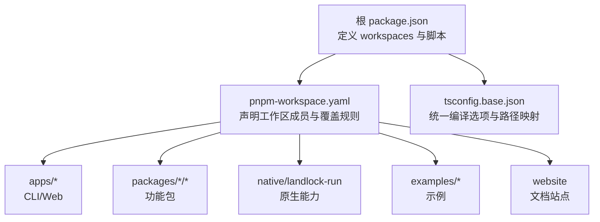
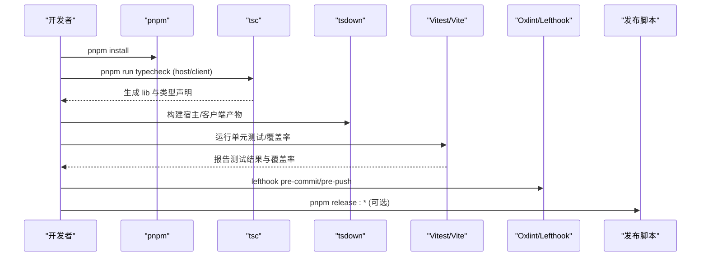
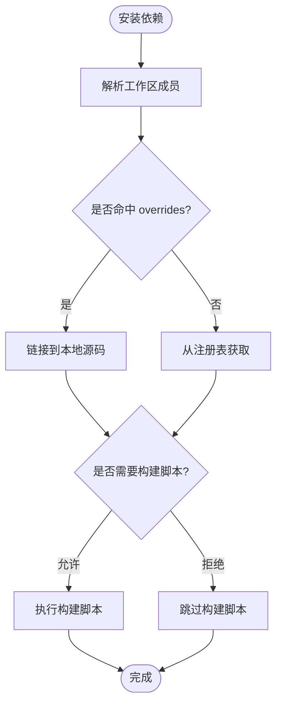
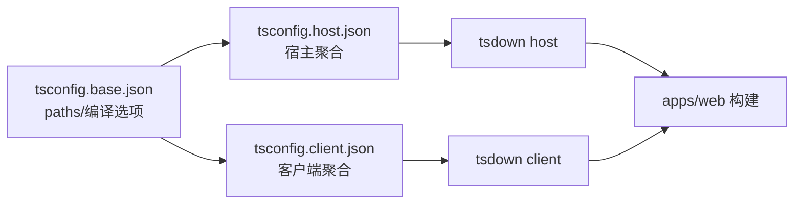
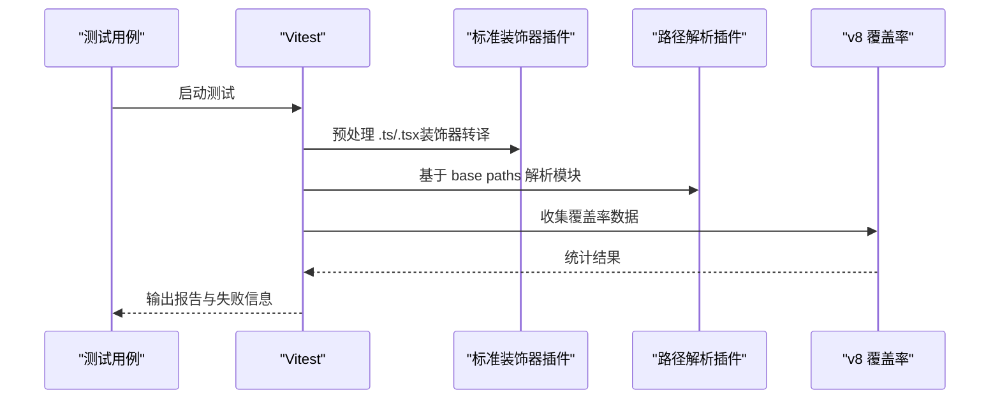
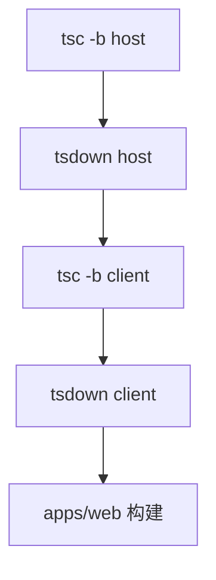
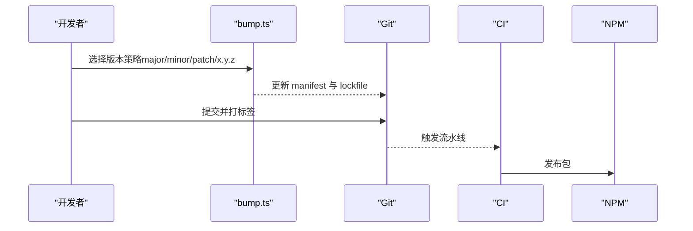
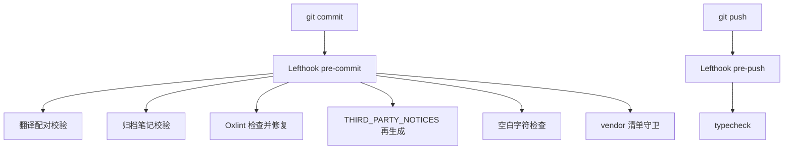
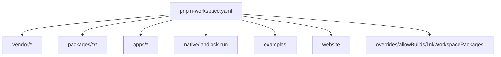

# 开发指南

<cite>
**本文引用的文件**
- [package.json](file://package.json)
- [pnpm-workspace.yaml](file://pnpm-workspace.yaml)
- [vitest.config.ts](file://vitest.config.ts)
- [vitest.shared.ts](file://vitest.shared.ts)
- [tsconfig.base.json](file://tsconfig.base.json)
- [lefthook.yml](file://lefthook.yml)
- [docs/development.md](file://docs/development.md)
- [docs/testing.md](file://docs/testing.md)
- [CONTRIBUTING.md](file://CONTRIBUTING.md)
- [README.md](file://README.md)
- [scripts/release/bump.ts](file://scripts/release/bump.ts)
</cite>

## 目录
1. [简介](#简介)
2. [项目结构](#项目结构)
3. [核心组件](#核心组件)
4. [架构总览](#架构总览)
5. [详细组件分析](#详细组件分析)
6. [依赖分析](#依赖分析)
7. [性能考虑](#性能考虑)
8. [故障排查指南](#故障排查指南)
9. [结论](#结论)
10. [附录](#附录)

## 简介
本指南面向希望在 DeepSeek Harness（dsh）Monorepo 中进行高效开发与调试的工程师。内容涵盖：环境搭建、Monorepo 结构与包管理、构建与发布流程、测试策略（单元/集成/e2e/快照/覆盖率）、性能分析与内存泄漏检测、IDE 与热重载配置、代码规范与贡献流程，以及 Pull Request 与代码审查建议。

## 项目结构
仓库采用 pnpm workspace 组织的 Monorepo，包含：
- apps：产品应用（CLI、Web）
- packages：可复用的功能包（Host/Client 双聚合）
- native：原生能力（如 landlock-run）
- examples：示例与演示
- scripts：构建、校验、发布等脚本
- website：文档站点

工作区成员由根 package.json 与 pnpm-workspace.yaml 共同声明，确保依赖解析与构建目标分离。TypeScript 使用“Host/Client 双聚合”工程引用模式，通过 tsconfig.base.json 提供统一的编译器选项与路径映射。

**图表来源**
- [package.json:11-18](file://package.json#L11-L18)
- [pnpm-workspace.yaml:1-22](file://pnpm-workspace.yaml#L1-L22)

**章节来源**
- [package.json:11-18](file://package.json#L11-L18)
- [pnpm-workspace.yaml:1-22](file://pnpm-workspace.yaml#L1-L22)
- [tsconfig.base.json:1-10](file://tsconfig.base.json#L1-L10)
- [docs/development.md:44-78](file://docs/development.md#L44-L78)

## 核心组件
- 包管理与工作区
  - 使用 pnpm@11.7.0，通过 root package.json 的 workspaces 与 pnpm-workspace.yaml 声明成员，并启用 linkWorkspacePackages 保证本地开发时解析到源码。
- TypeScript 工程组织
  - Host/Client 双聚合：tsconfig.host.json 与 tsconfig.client.json 分别聚合宿主端与客户端包；tsconfig.base.json 提供 paths 映射与通用编译选项，避免重复 include/files 污染。
- 构建工具链
  - tsc -b 进行增量类型检查与编译；tsdown 用于打包产物；Vitest 负责测试与覆盖率；Oxlint 负责静态检查；Lefthook 提供本地 Git 钩子。
- 测试体系
  - Vitest 多项目（线程安全 vs 进程绑定），v8 覆盖率，严格的 per-file 100% 门槛；支持快照、Web e2e、真实 API e2e 等多层测试。
- 发布与版本管理
  - 脚本化版本升级与发布流程，支持 dsh 家族共享版本与 vendor 家族独立版本策略。

**章节来源**
- [package.json:19-142](file://package.json#L19-L142)
- [pnpm-workspace.yaml:23-56](file://pnpm-workspace.yaml#L23-L56)
- [tsconfig.base.json:27-78](file://tsconfig.base.json#L27-L78)
- [docs/development.md:64-88](file://docs/development.md#L64-L88)
- [vitest.config.ts:117-159](file://vitest.config.ts#L117-L159)
- [scripts/release/bump.ts:1-15](file://scripts/release/bump.ts#L1-L15)

## 架构总览
下图展示了从源码到运行时的关键阶段：安装依赖、类型检查、构建、测试与发布。

**图表来源**
- [package.json:19-40](file://package.json#L19-L40)
- [docs/development.md:64-88](file://docs/development.md#L64-L88)
- [lefthook.yml:5-56](file://lefthook.yml#L5-L56)
- [scripts/release/bump.ts:1-15](file://scripts/release/bump.ts#L1-L15)

## 详细组件分析

### 包管理与工作区（pnpm + workspace）
- 工作区成员
  - 通过 pnpm-workspace.yaml 声明 vendor、packages、apps、native、examples、website 等成员，确保依赖解析与构建目标分离。
- 依赖覆盖与允许构建
  - 使用 overrides 将特定包指向本地 vendor；allowBuilds 精确放行需要构建脚本的依赖（如 esbuild、node-pty）。
- 链接本地包
  - linkWorkspacePackages 确保开发时直接解析到源码，避免二次加载已构建产物导致的单例问题。

**图表来源**
- [pnpm-workspace.yaml:23-56](file://pnpm-workspace.yaml#L23-L56)

**章节来源**
- [pnpm-workspace.yaml:1-22](file://pnpm-workspace.yaml#L1-L22)
- [pnpm-workspace.yaml:23-56](file://pnpm-workspace.yaml#L23-L56)

### TypeScript 工程与路径映射
- 双聚合设计
  - Host/Client 各自形成独立程序，避免 Context 接口合并冲突；tsconfig.base.json 提供 paths 映射，使 vitest 与脚本能正确解析源码。
- 构建顺序
  - 先 tsc host → tsdown host → tsc client → tsdown client → web 构建；Typert 在宿主侧生成远程类型与运行时贡献。

**图表来源**
- [tsconfig.base.json:27-78](file://tsconfig.base.json#L27-L78)
- [docs/development.md:64-78](file://docs/development.md#L64-L78)

**章节来源**
- [tsconfig.base.json:1-10](file://tsconfig.base.json#L1-L10)
- [tsconfig.base.json:27-78](file://tsconfig.base.json#L27-L78)
- [docs/development.md:44-78](file://docs/development.md#L44-L78)

### 测试体系（Vitest）
- 多项目隔离
  - thread-safe 与 process-bound 两个项目，前者以 worker/forks 运行，后者针对进程级用例单独隔离，避免全局状态干扰。
- 覆盖率门控
  - v8 提供者，per-file 100% 阈值；排除类型文件、bin/worker 入口及暂不覆盖的 UI 分支；CI 下输出更详细的未覆盖位置报告。
- 装饰器与路径解析
  - 自定义插件在 Vite 解析前转译 TypeScript 装饰器；通过 vite-tsconfig-paths 指向 tsconfig.base.json，确保源码级解析。

**图表来源**
- [vitest.config.ts:117-159](file://vitest.config.ts#L117-L159)
- [vitest.config.ts:160-283](file://vitest.config.ts#L160-L283)
- [vitest.shared.ts:1-43](file://vitest.shared.ts#L1-L43)

**章节来源**
- [vitest.config.ts:117-159](file://vitest.config.ts#L117-L159)
- [vitest.config.ts:160-283](file://vitest.config.ts#L160-L283)
- [vitest.shared.ts:1-43](file://vitest.shared.ts#L1-L43)
- [docs/testing.md:7-15](file://docs/testing.md#L7-L15)

### 构建流程（tsc + tsdown + web）
- 宿主侧
  - tsc -b 生成 lib 与类型声明；tsdown 根据 DSH_BUILD_FACE=host 产出宿主入口与反射/远程类型。
- 客户端侧
  - tsc -b 生成客户端类型；tsdown 根据 DSH_BUILD_FACE=client 产出浏览器端产物。
- Web 前端
  - 最后构建 apps/web，依赖前述宿主/客户端产物。

**图表来源**
- [docs/development.md:64-78](file://docs/development.md#L64-L78)
- [package.json:20-24](file://package.json#L20-L24)

**章节来源**
- [docs/development.md:64-78](file://docs/development.md#L64-L78)
- [package.json:20-24](file://package.json#L20-L24)

### 发布流程（版本与发布脚本）
- 版本策略
  - dsh 家族共享版本（root package.json），vendor 家族按包独立版本；脚本支持 major/minor/patch 或显式版本号。
- 发布步骤
  - 版本升级写入清单与锁文件；提交后人工打标签；CI 不写仓库；发布脚本负责打包与推送。

**图表来源**
- [scripts/release/bump.ts:1-15](file://scripts/release/bump.ts#L1-L15)
- [scripts/release/bump.ts:126-179](file://scripts/release/bump.ts#L126-L179)

**章节来源**
- [scripts/release/bump.ts:1-15](file://scripts/release/bump.ts#L1-L15)
- [scripts/release/bump.ts:126-179](file://scripts/release/bump.ts#L126-L179)

### 代码规范与本地检查（Lefthook + Oxlint）
- 预提交钩子
  - 翻译配对校验、归档笔记校验、staged 文件 lint（自动修复）、第三方通知再生成、空白字符检查、vendor 清单守卫。
- 推送前检查
  - 执行 typecheck，确保宿主/客户端类型检查通过。

**图表来源**
- [lefthook.yml:5-56](file://lefthook.yml#L5-L56)

**章节来源**
- [lefthook.yml:5-56](file://lefthook.yml#L5-L56)

### 贡献流程与 PR 审查
- 当前对外贡献政策
  - 项目处于早期快速迭代阶段，暂不接受外部 PR；鼓励社区反馈、插件生态与文档改进。
- 内部贡献建议
  - 遵循本地钩子与 CI 门禁；变更需附带相应测试与快照；保持最小必要改动，清晰描述动机与影响面。

**章节来源**
- [CONTRIBUTING.md:1-24](file://CONTRIBUTING.md#L1-L24)

## 依赖分析
- 工作区依赖关系
  - 通过 pnpm-workspace.yaml 统一管理成员；overrides 将特定包指向本地 vendor；linkWorkspacePackages 确保源码级解析。
- 构建期依赖
  - 仅允许必要的构建脚本（esbuild、node-pty、koffi 等），其他依赖默认禁止构建脚本，提升安全性与稳定性。

**图表来源**
- [pnpm-workspace.yaml:1-22](file://pnpm-workspace.yaml#L1-L22)
- [pnpm-workspace.yaml:23-56](file://pnpm-workspace.yaml#L23-L56)

**章节来源**
- [pnpm-workspace.yaml:1-22](file://pnpm-workspace.yaml#L1-L22)
- [pnpm-workspace.yaml:23-56](file://pnpm-workspace.yaml#L23-L56)

## 性能考虑
- 测试性能
  - 使用 forks 池隔离进程级用例，避免共享状态竞争；对重型套件可按需豁免，减少覆盖率采集开销。
- 构建性能
  - tsc 增量编译与 tsdown 并行打包；按需构建宿主/客户端；web 构建在最后阶段，避免阻塞日常开发。
- 运行时性能
  - 通过宿主/客户端分离与远程类型生成，减少不必要的运行时依赖；谨慎引入全局状态，优先使用作用域与事件驱动。

[本节为通用指导，无需具体文件来源]

## 故障排查指南
- 常见问题定位
  - 依赖解析异常：确认 pnpm-workspace 成员与 overrides 是否正确；必要时清理 node_modules 后重新安装。
  - 类型检查失败：确保先执行宿主侧构建（生成 Typert 契约），再执行客户端类型检查。
  - 测试失败：区分 unit/snapshot/e2e；查看 Vitest 报告中的未覆盖位置与失败堆栈；必要时调整 exclude 或补充测试。
  - 钩子失败：检查 lefthook 配置与 staged 文件；按提示修复后再提交。
- 调试技巧
  - 使用 Vitest 的 watch 模式与断点；结合 VS Code 调试器配置 Node 进程；对 Web 测试可使用浏览器开发者工具。
  - 性能分析：使用 Node 内置 --prof 与 Chrome DevTools 分析 CPU/内存；对 Web 场景使用 Performance/Memory 面板。

**章节来源**
- [docs/development.md:101-117](file://docs/development.md#L101-L117)
- [docs/testing.md:7-15](file://docs/testing.md#L7-L15)
- [vitest.config.ts:160-283](file://vitest.config.ts#L160-L283)

## 结论
本指南总结了 DeepSeek Harness 的开发环境与工作流程，包括 Monorepo 结构、包管理、构建与发布、测试策略、性能优化与故障排查。遵循上述实践可显著提升开发效率与代码质量。建议在每次提交前运行相关本地检查，并在 CI 中验证完整门禁。

[本节为总结性内容，无需具体文件来源]

## 附录
- 快速命令参考
  - 安装依赖：pnpm install
  - 类型检查：pnpm run typecheck
  - 构建：pnpm run build
  - 运行 Web：pnpm dsh web
  - 单元测试：pnpm run test
  - 覆盖率：pnpm run test:coverage
  - e2e（真实 API）：pnpm run test:e2e
  - 快照测试：pnpm run test:snapshot
  - Web 快照：pnpm run test:web
- 环境变量
  - DEEPSEEK_API_KEY、DEEPSEEK_BASE_URL 用于真实模型调用与演示。

**章节来源**
- [README.md:13-35](file://README.md#L13-L35)
- [docs/development.md:90-100](file://docs/development.md#L90-L100)
- [package.json:19-40](file://package.json#L19-L40)