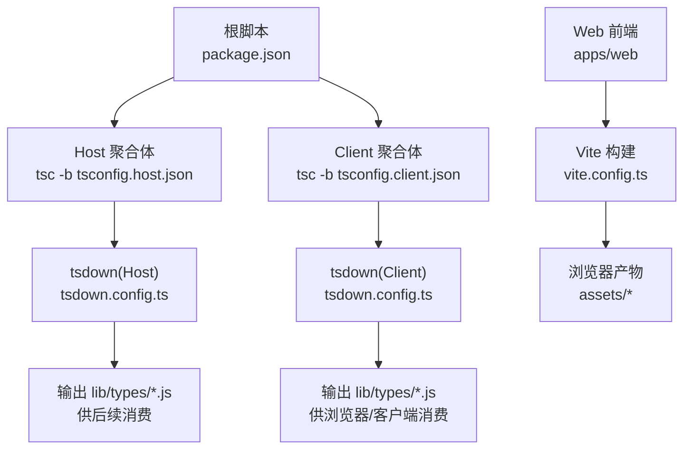
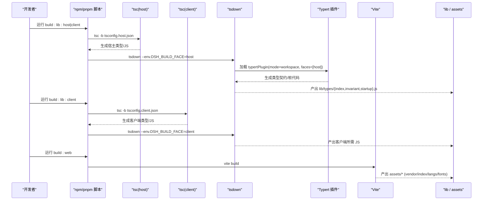
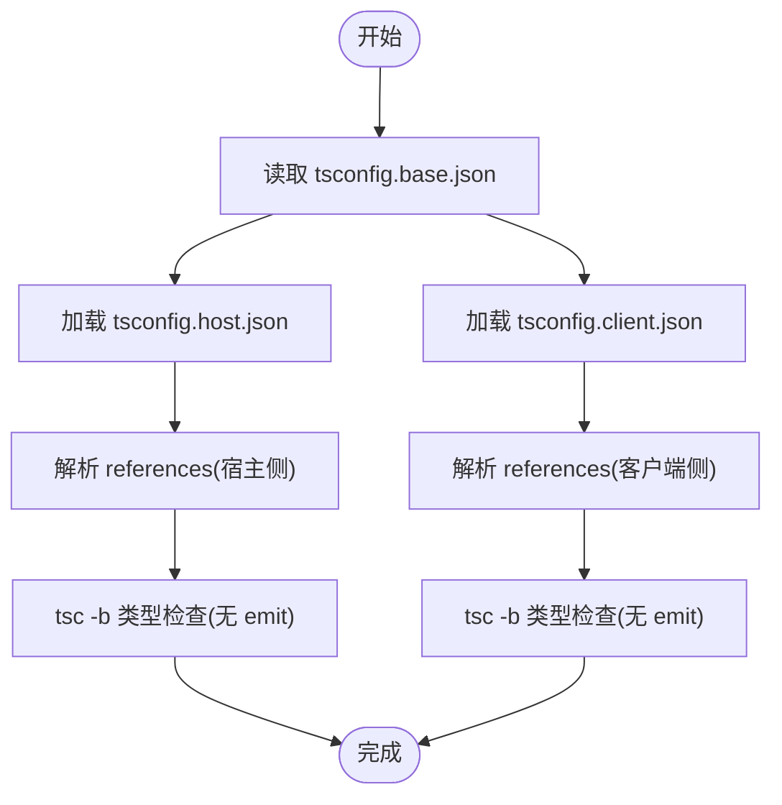
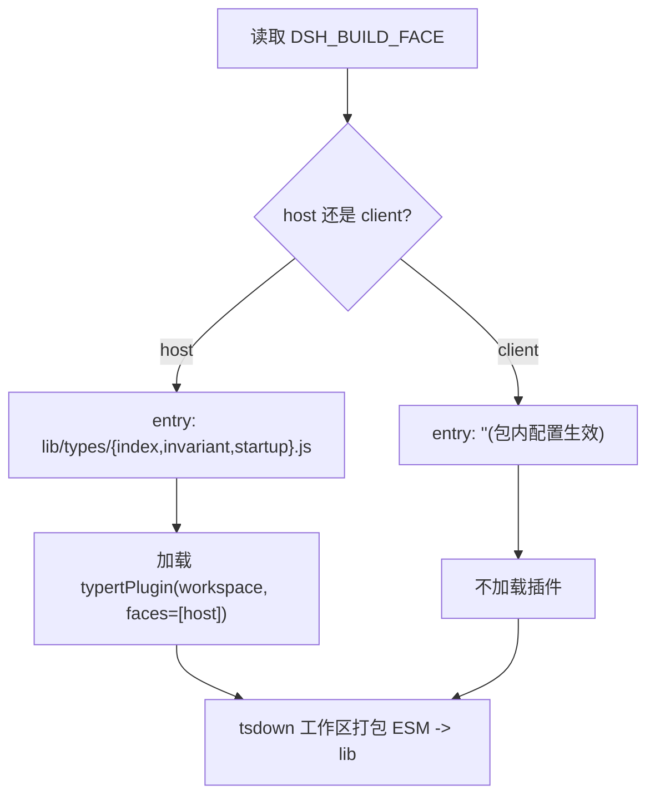
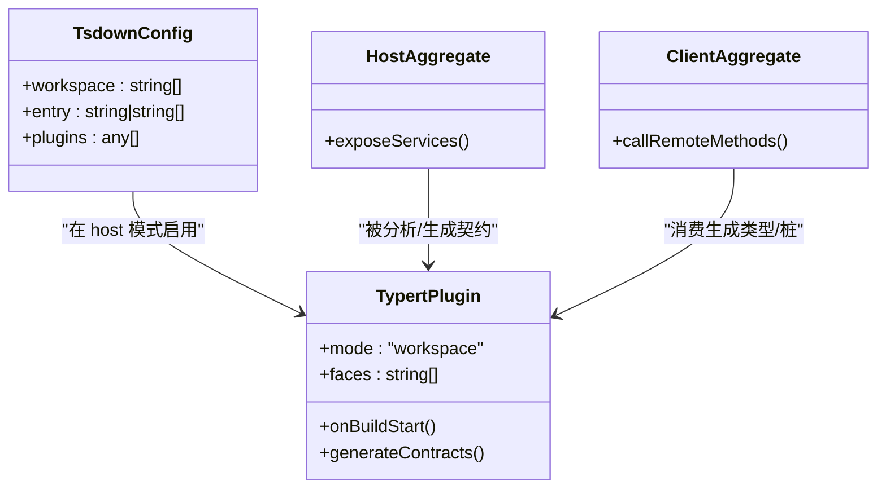
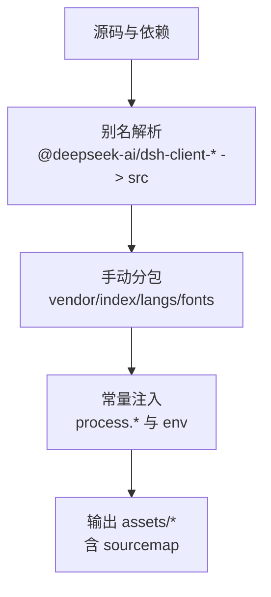
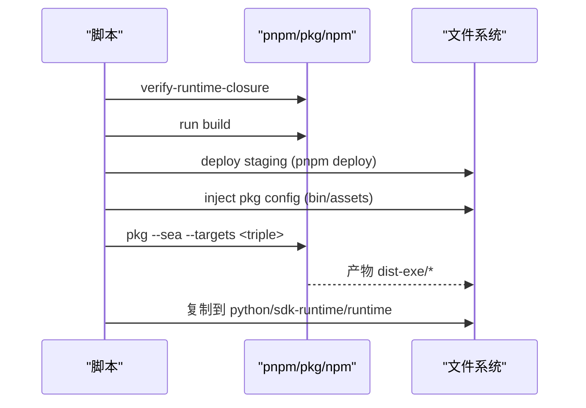
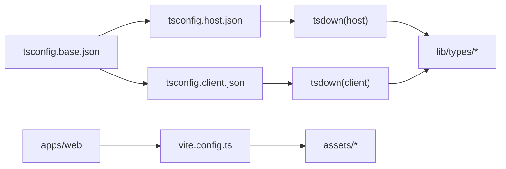

# 构建系统

<cite>
**本文引用的文件**
- [tsdown.config.ts](file://tsdown.config.ts)
- [package.json](file://package.json)
- [apps/cli/tsdown.config.ts](file://apps/cli/tsdown.config.ts)
- [apps/web/vite.config.ts](file://apps/web/vite.config.ts)
- [tsconfig.base.json](file://tsconfig.base.json)
- [tsconfig.host.json](file://tsconfig.host.json)
- [tsconfig.client.json](file://tsconfig.client.json)
- [scripts/build-exe-for-python-sdk.ts](file://scripts/build-exe-for-python-sdk.ts)
- [scripts/publish-npm-baseline.ts](file://scripts/publish-npm-baseline.ts)
- [packages/typert/generator/src/tsdown-plugin.ts](file://packages/typert/generator/src/tsdown-plugin.ts)
</cite>

## 目录
1. [简介](#简介)
2. [项目结构](#项目结构)
3. [核心组件](#核心组件)
4. [架构总览](#架构总览)
5. [详细组件分析](#详细组件分析)
6. [依赖关系分析](#依赖关系分析)
7. [性能考虑](#性能考虑)
8. [故障排除指南](#故障排除指南)
9. [结论](#结论)
10. [附录](#附录)

## 简介
本文件系统性解析该仓库的构建系统，覆盖 TypeScript 编译配置、Host 与 Client 聚合体的构建流程、tsdown 多目标与环境变量驱动构建、Typert 类型反射在构建期的集成方式、Web 前端打包策略、自定义构建脚本（包发布、资源打包、平台特定产物）以及构建优化与调优方法。目标是帮助开发者快速理解并高效维护整个构建流水线。

## 项目结构
仓库采用 monorepo 组织，核心构建入口位于根级 package.json 脚本，通过 TypeScript Project References 将 Host 与 Client 两类聚合体解耦，并使用 tsdown 进行工作区级别的 ESM 打包；Web 前端使用 Vite 进行浏览器侧构建与分包优化。

图表来源
- [package.json:19-28](file://package.json#L19-L28)
- [tsdown.config.ts:16-29](file://tsdown.config.ts#L16-L29)
- [apps/web/vite.config.ts:92-128](file://apps/web/vite.config.ts#L92-L128)

章节来源
- [package.json:19-28](file://package.json#L19-L28)
- [tsdown.config.ts:16-29](file://tsdown.config.ts#L16-L29)
- [apps/web/vite.config.ts:92-128](file://apps/web/vite.config.ts#L92-L128)

## 核心组件
- TypeScript 工程引用与增量编译：通过 tsconfig.base.json 启用 composite/incremental，配合 tsconfig.host.json 与 tsconfig.client.json 分别定义 Host/Client 两个独立类型检查程序，避免共享 Context 合并冲突。
- tsdown 工作区打包：根 tsdown.config.ts 根据环境变量 DSH_BUILD_FACE 切换 host/client 模式，选择不同 entry 与插件（如 Typert）。
- Web 前端构建：apps/web/vite.config.ts 配置 React、手动分包 vendor/index/langs/fonts、别名与 define 常量注入，确保浏览器环境正确运行。
- 自定义构建脚本：scripts/build-exe-for-python-sdk.ts 负责 Python SDK 运行时可执行产物打包；scripts/publish-npm-baseline.ts 负责工作区基线打包、校验与发布。

章节来源
- [tsconfig.base.json:1-20](file://tsconfig.base.json#L1-L20)
- [tsconfig.host.json:1-10](file://tsconfig.host.json#L1-L10)
- [tsconfig.client.json:1-15](file://tsconfig.client.json#L1-L15)
- [tsdown.config.ts:16-29](file://tsdown.config.ts#L16-L29)
- [apps/web/vite.config.ts:92-128](file://apps/web/vite.config.ts#L92-L128)
- [scripts/build-exe-for-python-sdk.ts:219-409](file://scripts/build-exe-for-python-sdk.ts#L219-L409)
- [scripts/publish-npm-baseline.ts:495-613](file://scripts/publish-npm-baseline.ts#L495-L613)

## 架构总览
下图展示了从脚本到编译、再到打包产物的整体流程，包括 Host/Client 双通道与 Web 前端并行构建。

图表来源
- [package.json:19-28](file://package.json#L19-L28)
- [tsdown.config.ts:16-29](file://tsdown.config.ts#L16-L29)
- [apps/web/vite.config.ts:92-128](file://apps/web/vite.config.ts#L92-L128)

## 详细组件分析

### TypeScript 编译配置与聚合体
- 基础配置：启用 es2024、bundler 模块解析、composite/incremental、strict 等严格选项，并通过 paths 映射大量内部包与 invariant/client 子路径，保证跨包引用一致性与类型安全。
- Host 聚合体：仅做类型检查（noEmit），包含测试、脚本、网站与所有宿主侧依赖 references，排除 client 侧源码与测试，避免上下文合并冲突。
- Client 聚合体：同样 noEmit，聚焦 packages/client 及其相关 UI 扩展与测试，引用 webserver、compaction leaf 等最小必要依赖，确保浏览器纯净性由各自包的 tsconfig 保障。

图表来源
- [tsconfig.base.json:1-20](file://tsconfig.base.json#L1-L20)
- [tsconfig.host.json:1-10](file://tsconfig.host.json#L1-L10)
- [tsconfig.client.json:1-15](file://tsconfig.client.json#L1-L15)

章节来源
- [tsconfig.base.json:1-20](file://tsconfig.base.json#L1-L20)
- [tsconfig.host.json:1-10](file://tsconfig.host.json#L1-L10)
- [tsconfig.client.json:1-15](file://tsconfig.client.json#L1-L15)

### tsdown 工具与多目标构建
- 工作区扫描：workspace 包含 vendor/*、packages/*/*、apps/cli，统一以 ESM 格式输出至 lib。
- 环境变量控制：DSH_BUILD_FACE 决定构建面为 host 或 client；host 模式 entry 指向 lib/types/{index,invariant,startup}.js，client 模式为空字符串以触发包内本地配置。
- 插件集成：host 模式启用 Typert 插件（mode=workspace, faces=['host']），用于在工作区范围内生成类型契约与桩代码，便于远程调用与契约验证。
- CLI 应用打包：apps/cli 单独 tsdown 配置，entry 指向 lib/types/bin.js，复用根 tsdown 的 ESM/Node/es2024 目标。

图表来源
- [tsdown.config.ts:4-29](file://tsdown.config.ts#L4-L29)
- [apps/cli/tsdown.config.ts:3-18](file://apps/cli/tsdown.config.ts#L3-L18)

章节来源
- [tsdown.config.ts:4-29](file://tsdown.config.ts#L4-L29)
- [apps/cli/tsdown.config.ts:3-18](file://apps/cli/tsdown.config.ts#L3-L18)

### Typert 类型反射系统与构建期集成
- 角色定位：Typert 提供类型反射能力，在构建期基于工作区源码生成契约与桩代码，使 Host/Client 之间的远程方法调用具备强类型约束与契约验证。
- 插件接入：通过 tsdown 插件在 host 构建阶段注入，结合 workspace 模式扫描依赖图，识别需要生成契约的类型边界。
- 使用方式：在 Host 侧暴露服务接口，Client 侧通过生成的类型与代理调用远程方法；契约变更会在类型层报错，提前发现破坏性变更。

图表来源
- [tsdown.config.ts:16-29](file://tsdown.config.ts#L16-L29)
- [packages/typert/generator/src/tsdown-plugin.ts](file://packages/typert/generator/src/tsdown-plugin.ts)

章节来源
- [tsdown.config.ts:16-29](file://tsdown.config.ts#L16-L29)
- [packages/typert/generator/src/tsdown-plugin.ts](file://packages/typert/generator/src/tsdown-plugin.ts)

### Web 前端构建与依赖优化
- 插件与别名：启用 react 插件，并将多个 @deepseek-ai/dsh-client-* 包别名指向其 src 入口，以便浏览器侧直接编译 CSS 与样式管线。
- 手动分包：将重型渲染依赖（katex、shiki、micromark 系列）放入 vendor chunk，语法高亮启动词法表归入 vendor，其他语言语法按需懒加载；字体资源路由到 assets/fonts。
- 常量注入：define process.versions.node、process.execArgv、process.env.CORDIS_SHARED，屏蔽 Node-only 分支，确保 vendored loader 在浏览器中行为正确。
- 输出布局：主 chunk 与 vendor 置于 assets 根目录，lang 语法块置于 assets/langs，字体置于 assets/fonts，sourcemap 跟随 js 输出。

图表来源
- [apps/web/vite.config.ts:92-128](file://apps/web/vite.config.ts#L92-L128)
- [apps/web/vite.config.ts:129-159](file://apps/web/vite.config.ts#L129-L159)

章节来源
- [apps/web/vite.config.ts:92-128](file://apps/web/vite.config.ts#L92-L128)
- [apps/web/vite.config.ts:129-159](file://apps/web/vite.config.ts#L129-L159)

### 自定义构建脚本：包发布与平台特定构建
- Python SDK 可执行产物：scripts/build-exe-for-python-sdk.ts 实现“验证闭包 -> 构建 -> 部署 staging -> 注入 pkg 配置 -> 多平台打包 -> 同步到 Python 运行时”的流水线，支持 node24-linux-x64/arm64、node24-macos-arm64 等目标，处理原生 addon（node-pty）与 macOS spawn-helper。
- npm 基线发布：scripts/publish-npm-baseline.ts 创建 detached worktree，统一版本与依赖锁定，构建并 pack 所有包，生成 manifest 与 SHA256SUMS，安装校验 dsh 入口与 Web 启动探针，支持发布到指定 registry 并打 dist-tag。

图表来源
- [scripts/build-exe-for-python-sdk.ts:219-409](file://scripts/build-exe-for-python-sdk.ts#L219-L409)
- [scripts/publish-npm-baseline.ts:495-613](file://scripts/publish-npm-baseline.ts#L495-L613)

章节来源
- [scripts/build-exe-for-python-sdk.ts:219-409](file://scripts/build-exe-for-python-sdk.ts#L219-L409)
- [scripts/publish-npm-baseline.ts:495-613](file://scripts/publish-npm-baseline.ts#L495-L613)

## 依赖关系分析
- 聚合体解耦：Host 与 Client 通过独立的 tsconfig 引用集合隔离，避免共享 Context 合并导致的类型污染。
- 工作区范围：tsdown 的工作区配置覆盖 vendor、packages 与 apps/cli，确保统一打包策略与产物一致性。
- Web 依赖管理：Vite 通过 alias 与 manualChunks 精确控制浏览器侧依赖归属，减少 index 体积并提升缓存命中。

图表来源
- [tsconfig.base.json:1-20](file://tsconfig.base.json#L1-L20)
- [tsconfig.host.json:109-296](file://tsconfig.host.json#L109-L296)
- [tsconfig.client.json:38-96](file://tsconfig.client.json#L38-L96)
- [tsdown.config.ts:16-29](file://tsdown.config.ts#L16-L29)
- [apps/web/vite.config.ts:92-128](file://apps/web/vite.config.ts#L92-L128)

章节来源
- [tsconfig.host.json:109-296](file://tsconfig.host.json#L109-L296)
- [tsconfig.client.json:38-96](file://tsconfig.client.json#L38-L96)
- [tsdown.config.ts:16-29](file://tsdown.config.ts#L16-L29)
- [apps/web/vite.config.ts:92-128](file://apps/web/vite.config.ts#L92-L128)

## 性能考虑
- 增量构建：启用 TypeScript composite/incremental，显著缩短二次编译时间；建议保持 .tsbuildinfo 不被清理。
- 并行编译：Host/Client 两条编译链路可并行执行（CI 中可拆分任务），减少总体构建时长。
- 缓存机制：
  - tsdown 设置 clean:false，避免重复清理开销；
  - Vite 通过 vendor/index/langs 分包与哈希文件名，利用浏览器缓存提升冷启动性能；
  - 发布脚本使用 detached worktree 与冻结锁文件，确保可重复构建。
- 体积优化：将重型第三方库抽离 vendor，语法高亮按需懒加载，字体集中管理，减少首屏资源。

[本节为通用指导，不直接分析具体文件]

## 故障排除指南
- 环境变量错误：tsdown 要求 DSH_BUILD_FACE 为 host 或 client，传入非法值会抛出错误；请检查脚本传参。
- 独立 Web 服务限制：直接在 apps/web 下用 Vite serve 会被拒绝，需通过 dsh web 或安装后的 dsh web 启动；开发时配合 dev:web 使用。
- 可执行产物缺失：Python SDK 打包前需确保 lib/ 已构建；若跳过构建步骤，需在 staging 中存在入口文件。
- 原生依赖问题：Linux 目标需本机架构构建 node-pty 原生 addon；macOS 目标需复制 spawn-helper。
- 发布校验失败：基线发布会校验 tarball 完整性、版本号、dist-tag 与远程注册表一致性；如遇不一致，检查版本与标签配置。

章节来源
- [tsdown.config.ts:4-8](file://tsdown.config.ts#L4-L8)
- [apps/web/vite.config.ts:6-19](file://apps/web/vite.config.ts#L6-L19)
- [scripts/build-exe-for-python-sdk.ts:358-409](file://scripts/build-exe-for-python-sdk.ts#L358-L409)
- [scripts/publish-npm-baseline.ts:615-765](file://scripts/publish-npm-baseline.ts#L615-L765)

## 结论
该构建系统通过 TypeScript Project References 将 Host/Client 解耦，结合 tsdown 的环境变量驱动与 Typert 插件，实现了类型安全的远程调用与契约验证；Web 端借助 Vite 精细分包与常量注入，满足浏览器环境的性能与兼容性需求。配合自定义脚本，完成了从工作区构建、产物打包到平台特定分发与发布的完整闭环。遵循本文的优化与排障建议，可进一步提升构建效率与稳定性。

## 附录
- 常用命令参考：
  - 构建宿主与客户端库：npm run build:lib:host | build:lib:client
  - 构建 Web：npm run build:web
  - 类型检查与 Lint：npm run typecheck | lint
  - 可执行产物：tsx scripts/build-exe-for-python-sdk.ts [--targets ...]
  - 基线发布：tsx scripts/publish-npm-baseline.ts plan|pack|publish

[本节为补充说明，不直接分析具体文件]