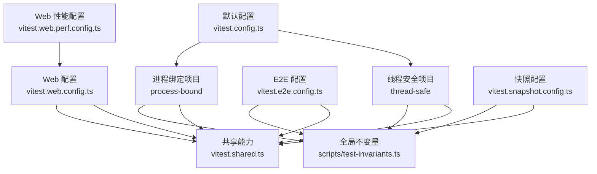
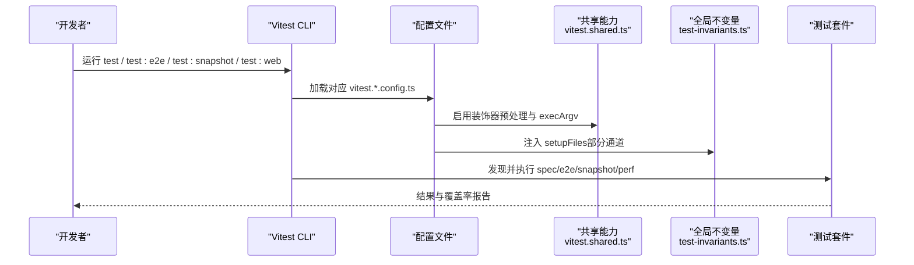
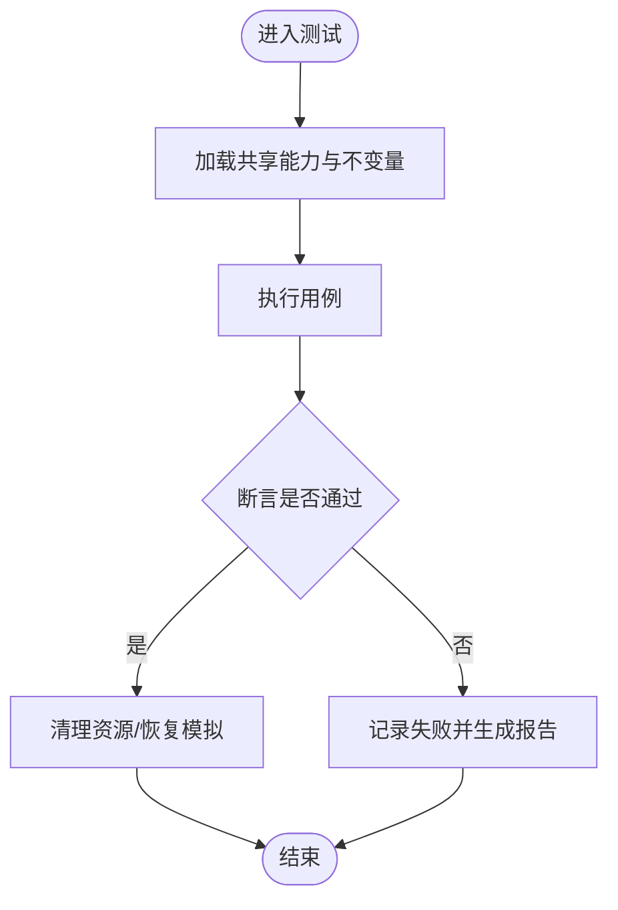
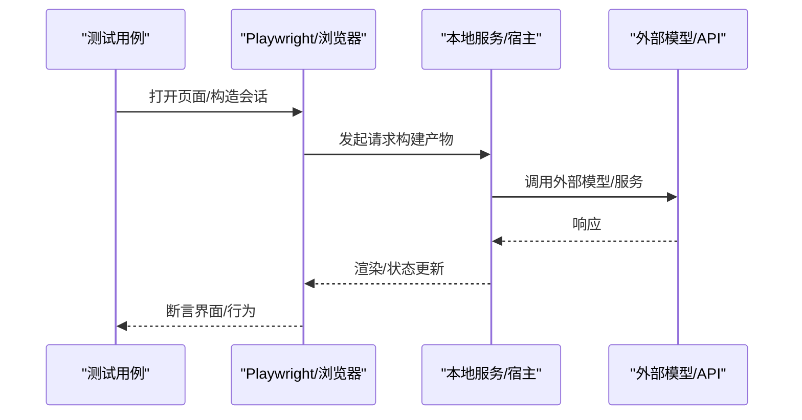
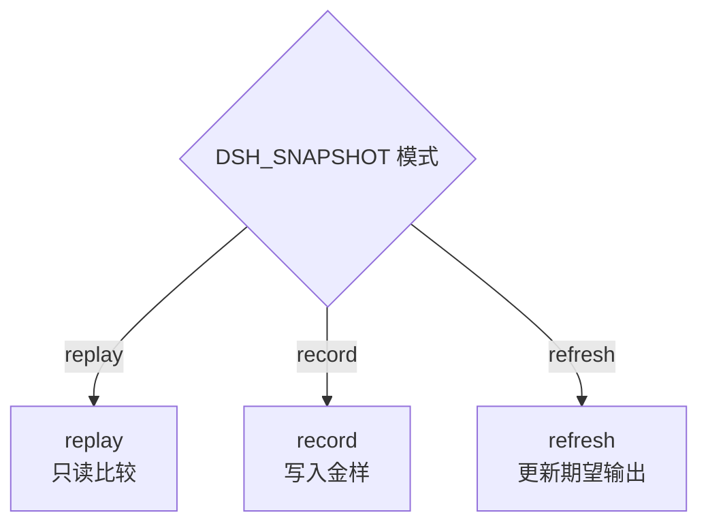
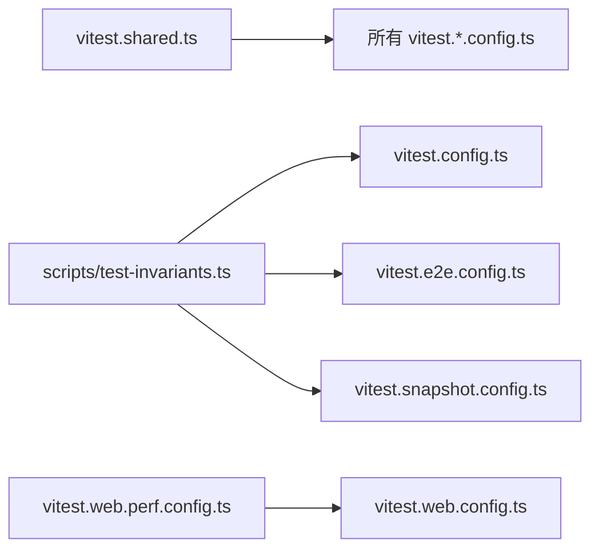

# 测试指南

<cite>
**本文引用的文件**
- [vitest.config.ts](file://vitest.config.ts)
- [vitest.e2e.config.ts](file://vitest.e2e.config.ts)
- [vitest.web.config.ts](file://vitest.web.config.ts)
- [vitest.snapshot.config.ts](file://vitest.snapshot.config.ts)
- [vitest.shared.ts](file://vitest.shared.ts)
- [vitest.web.perf.config.ts](file://vitest.web.perf.config.ts)
- [testing.md](file://docs/testing.md)
- [test-invariants.ts](file://scripts/test-invariants.ts)
- [args.spec.ts](file://apps/cli/tests/args.spec.ts)
- [approval.spec.ts](file://packages/acp/acp/tests/approval.spec.ts)
- [support.ts](file://apps/web/tests/support.ts)
- [cleanup.ts](file://examples/acp-agent/tests/cleanup.ts)
</cite>

## 目录
1. [简介](#简介)
2. [项目结构](#项目结构)
3. [核心组件](#核心组件)
4. [架构总览](#架构总览)
5. [详细组件分析](#详细组件分析)
6. [依赖关系分析](#依赖关系分析)
7. [性能考虑](#性能考虑)
8. [故障排查指南](#故障排查指南)
9. [结论](#结论)
10. [附录](#附录)

## 简介
本指南面向 deepseek-harness 仓库的测试体系，覆盖单元测试、集成测试、端到端（E2E）与快照测试的配置与执行；详细说明 Vitest 的使用方式、测试组织、模拟对象、异步处理、真实 API 测试、快照测试、性能测试；并提供最佳实践：测试数据管理、错误处理、覆盖率报告、可维护性约定、调试方法与常见问题解决方案。

## 项目结构
仓库采用多配置分层的 Vitest 工程模式，按测试类型划分独立配置与运行通道：
- 单元与脚本测试：默认 vitest.config.ts，包含 thread-safe 与 process-bound 两个子项目，统一覆盖率门禁（每文件 100%）。
- E2E 真实 API 测试：vitest.e2e.config.ts，支持并行度控制、重试、长超时。
- Web 浏览器快照与交互测试：vitest.web.config.ts，串行执行共享浏览器实例。
- 快照回放/录制：vitest.snapshot.config.ts，区分 replay/record/refresh 模式。
- Web 性能测试：vitest.web.perf.config.ts，继承 web 配置并放宽超时。
- 共享能力：vitest.shared.ts 提供装饰器预处理与 execArgv 设置。
- 全局不变量与插件生命周期保障：scripts/test-invariants.ts。

**图表来源**
- [vitest.config.ts:117-159](file://vitest.config.ts#L117-L159)
- [vitest.e2e.config.ts:31-57](file://vitest.e2e.config.ts#L31-L57)
- [vitest.web.config.ts:16-35](file://vitest.web.config.ts#L16-L35)
- [vitest.snapshot.config.ts:39-67](file://vitest.snapshot.config.ts#L39-L67)
- [vitest.web.perf.config.ts:1-16](file://vitest.web.perf.config.ts#L1-L16)
- [vitest.shared.ts:1-43](file://vitest.shared.ts#L1-L43)
- [test-invariants.ts:1-274](file://scripts/test-invariants.ts#L1-L274)

**章节来源**
- [vitest.config.ts:85-159](file://vitest.config.ts#L85-L159)
- [vitest.e2e.config.ts:1-59](file://vitest.e2e.config.ts#L1-L59)
- [vitest.web.config.ts:1-36](file://vitest.web.config.ts#L1-L36)
- [vitest.snapshot.config.ts:1-69](file://vitest.snapshot.config.ts#L1-L69)
- [vitest.shared.ts:1-43](file://vitest.shared.ts#L1-L43)
- [test-invariants.ts:1-274](file://scripts/test-invariants.ts#L1-L274)
- [testing.md:7-15](file://docs/testing.md#L7-L15)

## 核心组件
- 多项目与池化策略
  - 默认配置定义了两个子项目：thread-safe（多线程/worker）与 process-bound（进程绑定），均使用 forks 池以避免 Node 线程级问题。
  - 通过 include/exclude 精确控制不同平台与包范围的测试集。
- 覆盖率门禁
  - 使用 v8 提供者，阈值 perFile=100%，对 packages/*/src/** 进行严格门禁；大量客户端/UI 路径暂时排除，逐步补齐。
- E2E 与 Web 通道
  - E2E：长超时、重试、可控并发（DSH_E2E_MAX_WORKERS），适合真实模型调用。
  - Web：串行执行，共享浏览器实例，适合 UI 快照与交互流程。
- 快照通道
  - 支持 replay/record/refresh 三种模式；replay 默认并行受控，record/refresh 串行写回金样。
- 共享能力
  - 标准装饰器预编译、execArgv 屏蔽 webstorage 冲突。
- 全局不变量
  - 自动挂载各包的 invariant 伴随插件，确保服务启动完成后再运行业务逻辑，避免竞态与未就绪状态。

**章节来源**
- [vitest.config.ts:117-283](file://vitest.config.ts#L117-L283)
- [vitest.e2e.config.ts:31-57](file://vitest.e2e.config.ts#L31-L57)
- [vitest.web.config.ts:16-35](file://vitest.web.config.ts#L16-L35)
- [vitest.snapshot.config.ts:24-67](file://vitest.snapshot.config.ts#L24-L67)
- [vitest.shared.ts:1-43](file://vitest.shared.ts#L1-L43)
- [test-invariants.ts:1-274](file://scripts/test-invariants.ts#L1-L274)
- [testing.md:7-15](file://docs/testing.md#L7-L15)

## 架构总览
下图展示了测试入口、配置、共享能力与测试用例之间的调用关系，以及关键运行时约束（如覆盖率门禁、并发控制、浏览器串行等）。

**图表来源**
- [vitest.config.ts:117-159](file://vitest.config.ts#L117-L159)
- [vitest.e2e.config.ts:31-57](file://vitest.e2e.config.ts#L31-L57)
- [vitest.web.config.ts:16-35](file://vitest.web.config.ts#L16-L35)
- [vitest.snapshot.config.ts:39-67](file://vitest.snapshot.config.ts#L39-L67)
- [vitest.shared.ts:1-43](file://vitest.shared.ts#L1-L43)
- [test-invariants.ts:1-274](file://scripts/test-invariants.ts#L1-L274)

## 详细组件分析

### 单元测试：配置、组织与断言
- 配置要点
  - 双项目隔离：thread-safe 与 process-bound 分别控制并发与进程边界行为。
  - 覆盖率门禁：perFile 100%，失败即阻断合并。
  - 平台差异：Windows 下排除不支持 bash/sandbox 等套件。
- 组织规范
  - 测试与源码同域：tests 目录紧邻被测模块；脚本类测试位于 scripts/**/*.spec.ts。
  - 命名约定：以 .spec.ts 结尾，描述被测功能或场景。
- 断言与模拟
  - 使用 Vitest 内置 expect/vi；示例中通过 vi.spyOn(process.exit/stdout/stderr) 捕获 CLI 退出码与输出。
  - 异步测试：直接返回 Promise 或使用 async/await；注意清理副作用（afterEach）。
- 参考实现路径
  - CLI 参数解析测试：[apps/cli/tests/args.spec.ts](file://apps/cli/tests/args.spec.ts)
  - 审批策略测试（桥接 harness）：[packages/acp/acp/tests/approval.spec.ts](file://packages/acp/acp/tests/approval.spec.ts)

**图表来源**
- [vitest.config.ts:117-159](file://vitest.config.ts#L117-L159)
- [vitest.shared.ts:1-43](file://vitest.shared.ts#L1-L43)
- [test-invariants.ts:1-274](file://scripts/test-invariants.ts#L1-L274)
- [args.spec.ts:1-107](file://apps/cli/tests/args.spec.ts#L1-L107)
- [approval.spec.ts:1-79](file://packages/acp/acp/tests/approval.spec.ts#L1-L79)

**章节来源**
- [vitest.config.ts:85-159](file://vitest.config.ts#L85-L159)
- [args.spec.ts:1-107](file://apps/cli/tests/args.spec.ts#L1-L107)
- [approval.spec.ts:1-79](file://packages/acp/acp/tests/approval.spec.ts#L1-L79)
- [testing.md:7-15](file://docs/testing.md#L7-L15)

### 端到端测试：真实 API 与浏览器交互
- 真实 API 测试（E2E）
  - 配置：长超时、重试、并发上限（DSH_E2E_MAX_WORKERS），适合调用外部模型与服务。
  - 密钥管理：从环境变量或根 .env 加载；无密钥时自跳过，保证 keyless CI 绿色。
- Web 浏览器测试
  - 配置：串行执行，共享浏览器实例；构建产物作为被测目标。
  - 辅助工具：端口探测、页面创建、工作区连接、截图保存等。
- 参考实现路径
  - E2E 配置：[vitest.e2e.config.ts](file://vitest.e2e.config.ts)
  - Web 配置：[vitest.web.config.ts](file://vitest.web.config.ts)
  - Web 支撑：[apps/web/tests/support.ts](file://apps/web/tests/support.ts)

**图表来源**
- [vitest.e2e.config.ts:31-57](file://vitest.e2e.config.ts#L31-L57)
- [vitest.web.config.ts:16-35](file://vitest.web.config.ts#L16-L35)
- [support.ts:1-136](file://apps/web/tests/support.ts#L1-L136)

**章节来源**
- [vitest.e2e.config.ts:1-59](file://vitest.e2e.config.ts#L1-L59)
- [vitest.web.config.ts:1-36](file://vitest.web.config.ts#L1-L36)
- [support.ts:1-136](file://apps/web/tests/support.ts#L1-L136)
- [testing.md:11-15](file://docs/testing.md#L11-L15)

### 快照测试：回放、录制与刷新
- 模式说明
  - replay（默认）：基于已录制的输入回放，不写入金样，适合 CI。
  - record：读取密钥，调用真实 API，生成/更新金样与期望输出。
  - refresh：基于已提交脚本回放并更新当前期望输出。
- 并发与稳定性
  - replay 支持文件级并行与 in-file 并发限制；record/refresh 串行写回，避免竞争。
- 参考实现路径
  - 快照配置：[vitest.snapshot.config.ts](file://vitest.snapshot.config.ts)

**图表来源**
- [vitest.snapshot.config.ts:24-67](file://vitest.snapshot.config.ts#L24-L67)

**章节来源**
- [vitest.snapshot.config.ts:1-69](file://vitest.snapshot.config.ts#L1-L69)
- [testing.md:12-15](file://docs/testing.md#L12-L15)

### 性能测试：Web 高基数诊断
- 配置特点
  - 继承 web 配置，放宽 hook/test 超时，关闭控制台拦截以便采集指标。
- 参考实现路径
  - Web 性能配置：[vitest.web.perf.config.ts](file://vitest.web.perf.config.ts)

**章节来源**
- [vitest.web.perf.config.ts:1-16](file://vitest.web.perf.config.ts#L1-L16)

### 测试数据与资源管理
- 临时工作区与清理
  - 示例中提供统一的清理函数，确保进程关闭与目录删除都尽力执行并聚合失败。
- 参考实现路径
  - 清理函数：[examples/acp-agent/tests/cleanup.ts](file://examples/acp-agent/tests/cleanup.ts)

**章节来源**
- [cleanup.ts:1-24](file://examples/acp-agent/tests/cleanup.ts#L1-L24)

## 依赖关系分析
- 配置间依赖
  - web.perf 继承 web 配置；所有配置复用 shared 提供的装饰器与 execArgv。
- 运行时依赖
  - 多数通道引入 test-invariants 作为 setupFiles，确保插件/服务就绪。
- 测试与源码解耦
  - 通过 vite-tsconfig-paths 指向 tsconfig.base.json，保证测试阶段解析到 src，避免加载已构建产物导致单例重复。

**图表来源**
- [vitest.shared.ts:1-43](file://vitest.shared.ts#L1-L43)
- [vitest.config.ts:117-159](file://vitest.config.ts#L117-L159)
- [vitest.e2e.config.ts:31-57](file://vitest.e2e.config.ts#L31-L57)
- [vitest.snapshot.config.ts:39-67](file://vitest.snapshot.config.ts#L39-L67)
- [vitest.web.config.ts:16-35](file://vitest.web.config.ts#L16-L35)
- [vitest.web.perf.config.ts:1-16](file://vitest.web.perf.config.ts#L1-L16)

**章节来源**
- [vitest.config.ts:117-159](file://vitest.config.ts#L117-L159)
- [vitest.e2e.config.ts:31-57](file://vitest.e2e.config.ts#L31-L57)
- [vitest.snapshot.config.ts:39-67](file://vitest.snapshot.config.ts#L39-L67)
- [vitest.web.config.ts:16-35](file://vitest.web.config.ts#L16-L35)
- [vitest.web.perf.config.ts:1-16](file://vitest.web.perf.config.ts#L1-L16)
- [vitest.shared.ts:1-43](file://vitest.shared.ts#L1-L43)
- [test-invariants.ts:1-274](file://scripts/test-invariants.ts#L1-L274)

## 性能考虑
- 并发与隔离
  - 默认配置将进程绑定测试分离至单独项目，避免跨进程状态污染。
  - E2E 与快照可通过环境变量控制并发，平衡速度与稳定性。
- 浏览器串行
  - Web 测试串行执行，减少浏览器资源争用，提高稳定性。
- 覆盖率开销
  - 全量覆盖率门禁严格，建议仅在必要通道开启；快照与 E2E 通常不纳入覆盖率门禁。

[本节为通用指导，无需特定文件引用]

## 故障排查指南
- 常见错误与定位
  - 覆盖率不达标：查看 perFile 100% 门禁失败的具体文件与行号；必要时调整 exclude 列表或补充用例。
  - Windows 平台跳过：确认是否命中 windowsUnsupportedTests 列表；必要时在 Windows 环境运行相关套件。
  - 缺少 pwsh：pwsh-local 相关套件在无 pwsh 主机上会自跳过；CI 自带 pwsh 则强制覆盖。
  - 浏览器未构建：Web 测试要求先构建产物；若缺失 dist，需先执行构建命令。
  - 密钥缺失：E2E/Web 真实模型调用需要密钥；无密钥时自跳过，确保 CI 绿色。
- 调试技巧
  - 使用 Vitest 的 --inspect 或 IDE 调试器附加 Node 进程。
  - 降低并发：设置 DSH_E2E_MAX_WORKERS=1 或 DSH_SNAPSHOT_MAX_CONCURRENCY=1 复现问题。
  - 聚焦用例：仅运行单个 spec 文件缩小范围。
  - 截图证据：Web 测试失败时保存截图便于定位 UI 问题。
- 参考实现路径
  - 失败截图与端口探测：[apps/web/tests/support.ts](file://apps/web/tests/support.ts)
  - 清理聚合失败：[examples/acp-agent/tests/cleanup.ts](file://examples/acp-agent/tests/cleanup.ts)

**章节来源**
- [vitest.config.ts:21-83](file://vitest.config.ts#L21-L83)
- [vitest.e2e.config.ts:5-14](file://vitest.e2e.config.ts#L5-L14)
- [vitest.web.config.ts:5-14](file://vitest.web.config.ts#L5-L14)
- [support.ts:1-136](file://apps/web/tests/support.ts#L1-L136)
- [cleanup.ts:1-24](file://examples/acp-agent/tests/cleanup.ts#L1-L24)

## 结论
本项目通过多配置分层与严格的覆盖率门禁，构建了稳定可靠的测试体系。单元测试强调隔离与确定性，E2E 侧重真实调用与回归验证，快照测试保障协议与呈现一致性，Web 测试覆盖用户交互。遵循本文的组织与最佳实践，可有效提升代码质量与交付信心。

[本节为总结性内容，无需特定文件引用]

## 附录
- 快速命令参考
  - 单元测试与覆盖率：pnpm run test / pnpm run test:coverage
  - 真实 API E2E：pnpm run test:e2e
  - 快照回放/录制/刷新：pnpm run test:snapshot / test:snapshot:record / test:snapshot:refresh
  - Web 浏览器测试：pnpm run test:web
  - Web 性能测试：使用 vitest.web.perf.config.ts 指定运行
- 最佳实践清单
  - 测试命名：以 .spec.ts 结尾，描述被测功能或场景。
  - 断言模式：优先断言可见结果与外部世界变化，而非内部状态自报告。
  - 测试隔离：每个用例负责自身资源创建与销毁；共享 fixture 放在非 spec 文件中。
  - 模拟策略：仅对昂贵或非确定边界做 mock，尽量走真实实现。
  - 数据管理：使用临时目录与统一清理函数，避免污染与泄漏。
  - 错误处理：在 after/before 中妥善处理异常与资源释放，避免掩盖主错误。
  - 覆盖率：新增/修改代码应同步补充用例，维持 perFile 100%。
  - 可维护性：保持测试小而专一，关注单一职责；复杂流程拆分为可复用步骤。

[本节为通用指导，无需特定文件引用]