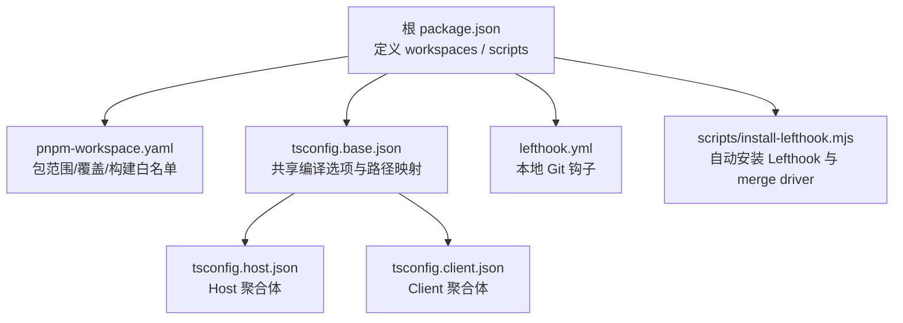
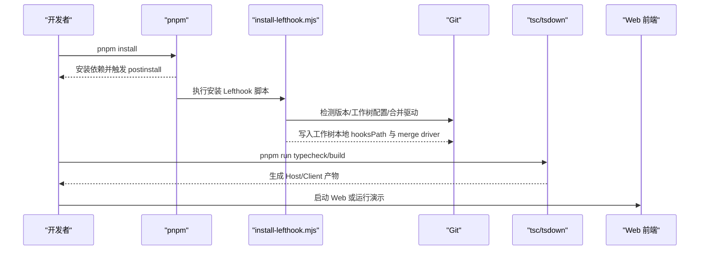
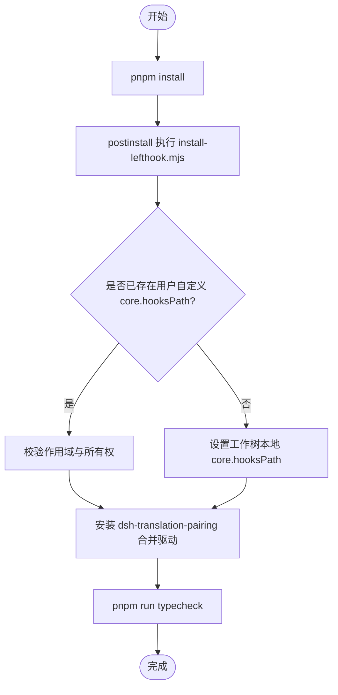
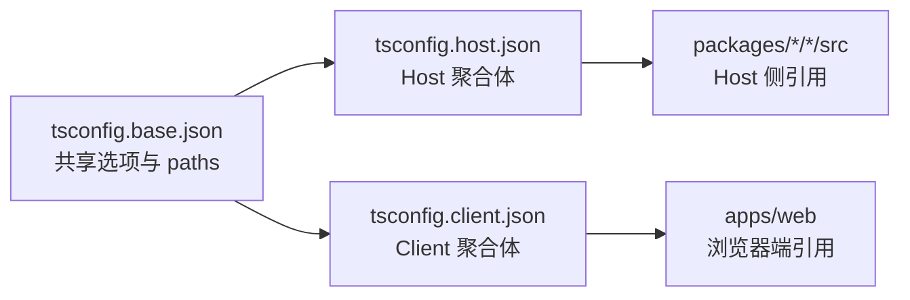
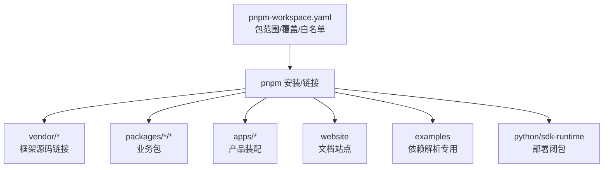

# 环境搭建

<cite>
**本文引用的文件**
- [package.json](file://package.json)
- [pnpm-workspace.yaml](file://pnpm-workspace.yaml)
- [lefthook.yml](file://lefthook.yml)
- [tsconfig.base.json](file://tsconfig.base.json)
- [tsconfig.host.json](file://tsconfig.host.json)
- [tsconfig.client.json](file://tsconfig.client.json)
- [scripts/install-lefthook.mjs](file://scripts/install-lefthook.mjs)
- [README.md](file://README.md)
- [docs/development.md](file://docs/development.md)
</cite>

## 目录
1. [简介](#简介)
2. [项目结构](#项目结构)
3. [核心组件](#核心组件)
4. [架构总览](#架构总览)
5. [详细组件分析](#详细组件分析)
6. [依赖关系分析](#依赖关系分析)
7. [性能注意事项](#性能注意事项)
8. [故障排查指南](#故障排查指南)
9. [结论](#结论)
10. [附录](#附录)

## 简介
本指南面向首次参与 DeepSeek Harness（dsh）Monorepo 的开发者，提供从零开始的环境搭建与初始化步骤。内容涵盖 Node.js 版本要求、Corepack 启用、Git 配置、Monorepo 依赖安装、Lefthook 钩子与 Git merge driver 设置、TypeScript 项目结构与 Host/Client 聚合体概念、tsconfig 层次关系、环境变量（特别是 DeepSeek API 密钥）以及常见环境问题修复方法。

## 项目结构
仓库采用 pnpm Monorepo，根级 package.json 声明了工作区成员与脚本；pnpm-workspace.yaml 定义了包范围、覆盖策略与构建白名单；TypeScript 通过 tsconfig.base.json 统一编译器选项与路径映射，并通过 tsconfig.host.json 与 tsconfig.client.json 将代码划分为两个独立的类型检查程序（Host 与 Client）。

图表来源
- [package.json:1-183](file://package.json#L1-L183)
- [pnpm-workspace.yaml:1-73](file://pnpm-workspace.yaml#L1-L73)
- [tsconfig.base.json:1-280](file://tsconfig.base.json#L1-L280)
- [tsconfig.host.json:1-299](file://tsconfig.host.json#L1-L299)
- [tsconfig.client.json:1-99](file://tsconfig.client.json#L1-L99)
- [lefthook.yml:1-56](file://lefthook.yml#L1-L56)
- [scripts/install-lefthook.mjs:1-846](file://scripts/install-lefthook.mjs#L1-L846)

章节来源
- [package.json:1-183](file://package.json#L1-L183)
- [pnpm-workspace.yaml:1-73](file://pnpm-workspace.yaml#L1-L73)
- [tsconfig.base.json:1-280](file://tsconfig.base.json#L1-L280)
- [tsconfig.host.json:1-299](file://tsconfig.host.json#L1-L299)
- [tsconfig.client.json:1-99](file://tsconfig.client.json#L1-L99)
- [lefthook.yml:1-56](file://lefthook.yml#L1-L56)
- [scripts/install-lefthook.mjs:1-846](file://scripts/install-lefthook.mjs#L1-L846)

## 核心组件
- 运行时与包管理器：Node.js 引擎约束与 Corepack + pnpm 锁定版本。
- Monorepo 管理：pnpm workspace 与工作区链接、构建白名单与依赖覆盖。
- 开发质量门禁：Lefthook 本地钩子（pre-commit/pre-push 等）与 Git merge driver。
- TypeScript 工程化：基础配置、Host/Client 双聚合体、路径映射与引用图。
- 运行与演示：Web UI、Headless 与 ACP 自动化演示需要 API 密钥。

章节来源
- [package.json:1-183](file://package.json#L1-L183)
- [pnpm-workspace.yaml:1-73](file://pnpm-workspace.yaml#L1-L73)
- [lefthook.yml:1-56](file://lefthook.yml#L1-L56)
- [tsconfig.base.json:1-280](file://tsconfig.base.json#L1-L280)
- [tsconfig.host.json:1-299](file://tsconfig.host.json#L1-L299)
- [tsconfig.client.json:1-99](file://tsconfig.client.json#L1-L99)
- [docs/development.md:90-100](file://docs/development.md#L90-L100)

## 架构总览
下图展示了从“克隆仓库”到“可运行 Web 界面”的关键流程，包括依赖安装、钩子与 merge driver 自动配置、类型检查与构建。

图表来源
- [package.json:19-142](file://package.json#L19-L142)
- [scripts/install-lefthook.mjs:691-846](file://scripts/install-lefthook.mjs#L691-L846)
- [docs/development.md:16-40](file://docs/development.md#L16-L40)

## 详细组件分析

### 前置条件与环境准备
- Node.js 版本：支持 22.19+ 与 24+（CI 覆盖 22.19、24、26）。
- Corepack 与 pnpm：仓库锁定 pnpm@11.7.0，需启用 Corepack 以解析固定版本。
- Git 版本：最低 2.26，用于工作树本地钩子与合并驱动。
- 可选：DeepSeek API 密钥用于 Web、Headless 与 ACP 自动化演示及真实 API e2e 测试。

章节来源
- [docs/development.md:9-15](file://docs/development.md#L9-L15)
- [package.json:8-10](file://package.json#L8-L10)

### Monorepo 初始化步骤
- 安装依赖：在仓库根目录执行 pnpm install。该命令会安装所有工作区依赖并触发 postinstall。
- 自动钩子与合并驱动：postinstall 会调用 scripts/install-lefthook.mjs，完成：
  - 检查工作树本地 hooksPath 安全迁移
  - 安装 Lefthook 钩子（pre-commit、pre-merge-commit、pre-push）
  - 注册 dsh-translation-pairing 合并驱动（工作树级别）
- 首次类型检查：执行 pnpm run typecheck，确保 Host 与 Client 类型检查通过。

图表来源
- [package.json:136-142](file://package.json#L136-L142)
- [scripts/install-lefthook.mjs:691-846](file://scripts/install-lefthook.mjs#L691-L846)
- [docs/development.md:16-40](file://docs/development.md#L16-L40)

章节来源
- [package.json:19-142](file://package.json#L19-L142)
- [scripts/install-lefthook.mjs:691-846](file://scripts/install-lefthook.mjs#L691-L846)
- [docs/development.md:16-40](file://docs/development.md#L16-L40)

### Lefthook 钩子配置
- pre-commit：验证翻译配对记录、归档笔记、对暂存文件进行轻量 lint（含自动修复）、再生成第三方通知、空白字符检查与 vendor manifest 守卫。
- pre-merge-commit：在创建自动合并提交前再次校验翻译配对。
- pre-push：执行完整类型检查（包含 Host 构建与生成的 Typert 契约），再进入 Client 类型检查。

章节来源
- [lefthook.yml:5-56](file://lefthook.yml#L5-L56)
- [docs/development.md:107-115](file://docs/development.md#L107-L115)

### Git 合并驱动（翻译配对）
- 名称：dsh-translation-pairing
- 行为：当双语 i18n 文件发生冲突且满足文本合并条件时，基于祖先、当前与其他分支 blob 推导合并结果；否则关闭失败。
- 安装位置：工作树本地 git config（core.hooksPath 与 merge.* 项由脚本写入）。
- 恢复路径：若 Node/tsx 驱动不可用，Git 会写出普通文本结果并提示恢复方式；可通过 resolve 命令或中止合并修复。

章节来源
- [scripts/install-lefthook.mjs:30-42](file://scripts/install-lefthook.mjs#L30-L42)
- [scripts/install-lefthook.mjs:611-689](file://scripts/install-lefthook.mjs#L611-L689)
- [docs/development.md:101-106](file://docs/development.md#L101-L106)

### TypeScript 项目结构与 Host/Client 聚合体
- 基础配置：tsconfig.base.json 集中声明编译器选项与源路径映射（paths），作为 vitest 与 tsx 的路径解析门面。
- Host 聚合体：tsconfig.host.json 包含 Host 包、示例、测试、脚本、网站与 api/remotes 的 Host 入口，形成独立 tsc 程序。
- Client 聚合体：tsconfig.client.json 包含 packages/client/* 及其测试、apps/web 与 api/remotes 的 Client 入口，形成另一个独立 tsc 程序。
- 分离原因：两侧均对 cordis Context 接口进行声明合并但服务不同，合并到同一程序会导致冲突；因此拆分为两个聚合体。

图表来源
- [tsconfig.base.json:1-280](file://tsconfig.base.json#L1-L280)
- [tsconfig.host.json:1-299](file://tsconfig.host.json#L1-L299)
- [tsconfig.client.json:1-99](file://tsconfig.client.json#L1-L99)

章节来源
- [tsconfig.base.json:1-280](file://tsconfig.base.json#L1-L280)
- [tsconfig.host.json:1-299](file://tsconfig.host.json#L1-L299)
- [tsconfig.client.json:1-99](file://tsconfig.client.json#L1-L99)
- [docs/development.md:44-78](file://docs/development.md#L44-L78)

### 环境变量与 DeepSeek API 密钥
- 必需/可选变量：
  - DEEPSEEK_API_KEY：用于 Web、Headless 与 ACP 自动化演示及真实 API e2e 测试。
  - DEEPSEEK_BASE_URL：可选，默认公共 API。
- 读取方式：适配器从环境变量或仓库根目录 .env（被忽略）中读取。
- 安全建议：切勿提交真实凭据；未设置时真实 API e2e 套件会自动跳过。

章节来源
- [docs/development.md:90-100](file://docs/development.md#L90-L100)

## 依赖关系分析
- 工作区成员：vendor/*、packages/*/*、native/landlock-run 及其子包、apps/*、website、examples（仅依赖解析）、python/sdk-runtime（部署根）。
- 构建白名单：esbuild、lefthook、node-pty、koffi 等允许构建；部分包的生命周期脚本被显式拒绝但仍可安装。
- 覆盖与链接：linkWorkspacePackages 开启工作区链接；overrides 将特定包指向 vendor 源码。

图表来源
- [pnpm-workspace.yaml:1-73](file://pnpm-workspace.yaml#L1-L73)

章节来源
- [pnpm-workspace.yaml:1-73](file://pnpm-workspace.yaml#L1-L73)

## 性能注意事项
- 本地钩子保持轻量：仅做快速检查，全面门禁由 CI 负责。
- 类型检查顺序：先 Host 构建（含 Typert 生成），再 Client 类型检查，避免重复工作。
- 构建产物复用：tsdown 消费 tsc 产出的 lib/types，减少重复编译。

章节来源
- [docs/development.md:64-78](file://docs/development.md#L64-L78)
- [lefthook.yml:1-56](file://lefthook.yml#L1-L56)

## 故障排查指南
- 缓存恢复后缺少钩子/合并驱动：
  - 手动执行 node scripts/install-lefthook.mjs 重新安装。
  - 若报告锁冲突或配置不合法，遵循诊断信息处理后再重试。
- 移动工作树后路径失效：
  - 重新运行安装脚本以重新生成工作树本地 hooksPath 与合并驱动。
- 合并驱动 Node/tsx 不可用：
  - Git 会输出普通文本结果并提示恢复路径；恢复依赖后运行 resolve 命令或中止合并。
- 预推送类型检查失败：
  - 先执行完整构建（pnpm run build），再运行类型检查；必要时清理并重建。

章节来源
- [docs/development.md:16-40](file://docs/development.md#L16-L40)
- [docs/development.md:101-106](file://docs/development.md#L101-L106)
- [scripts/install-lefthook.mjs:691-846](file://scripts/install-lefthook.mjs#L691-L846)

## 结论
通过 Node.js 与 Corepack/pnpm 的版本锁定、工作树本地 Lefthook 与合并驱动的自动安装、以及 Host/Client 双聚合体的 TypeScript 工程化配置，开发者可以在本机获得一致、高效的开发与协作体验。配合环境变量注入 DeepSeek API 密钥，即可快速启动 Web 界面与各类演示。遇到缓存或工作树迁移问题时，按指引重新运行安装脚本即可恢复。

## 附录
- 快速启动 Web 界面（从源码）：
  - 克隆仓库 → pnpm install → pnpm run build → pnpm dsh web
- 常用命令：
  - 类型检查：pnpm run typecheck
  - 构建：pnpm run build
  - 文档站点：pnpm run docs:dev / docs:build

章节来源
- [README.md:25-35](file://README.md#L25-L35)
- [package.json:19-142](file://package.json#L19-L142)