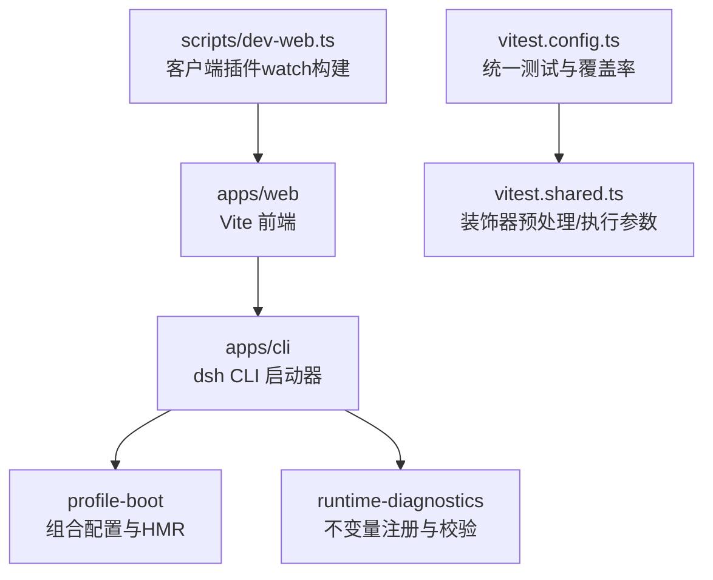
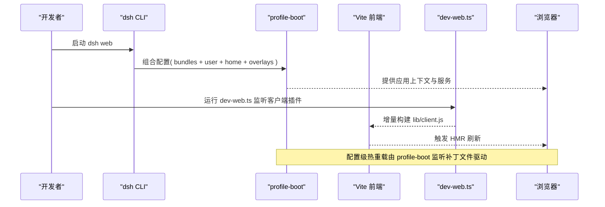
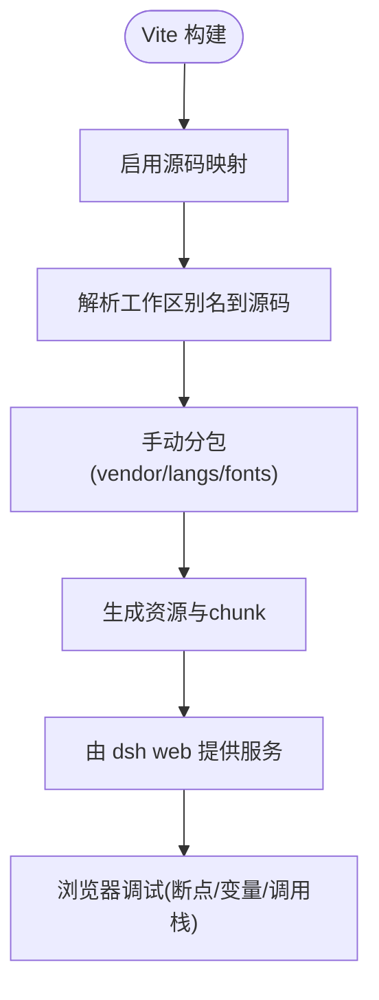
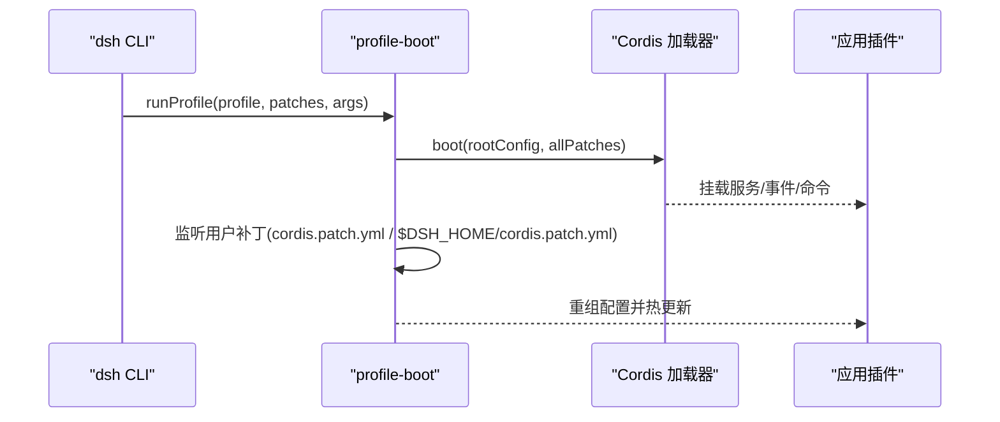
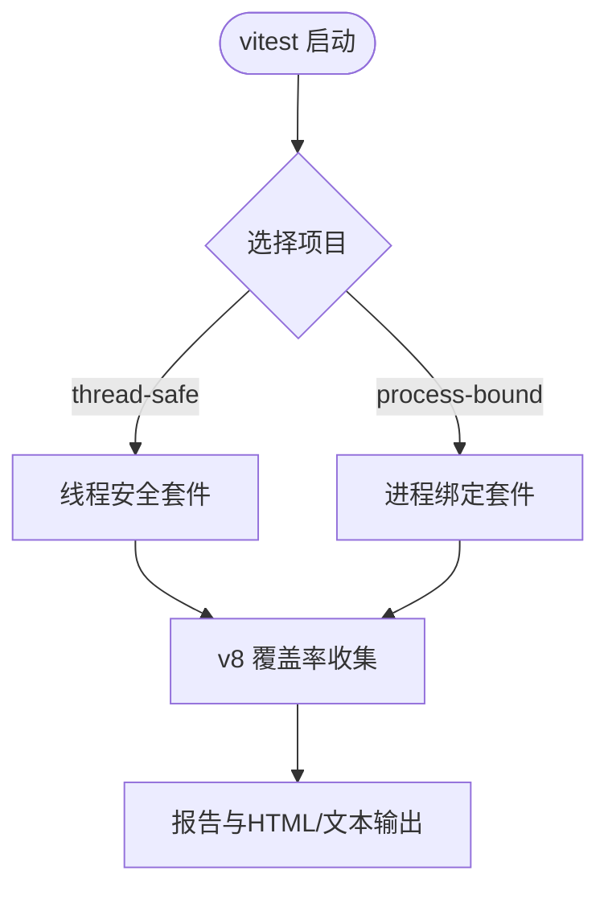
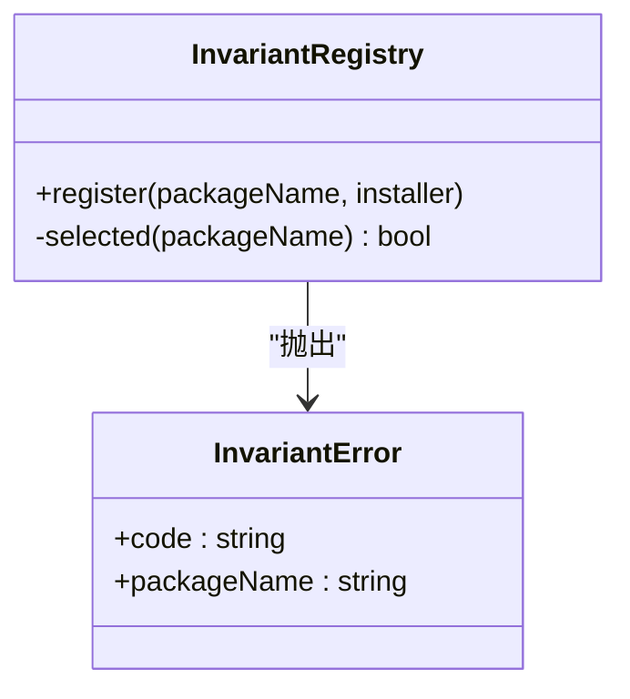
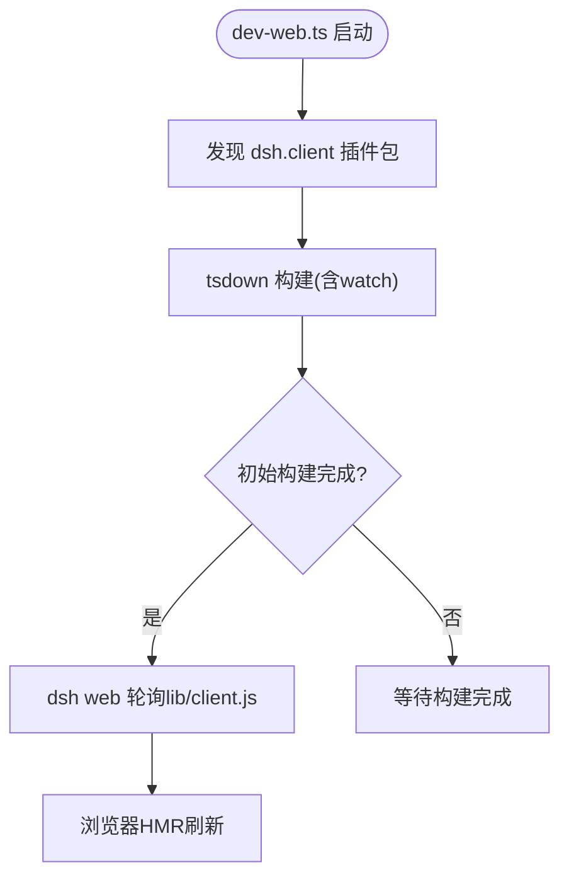
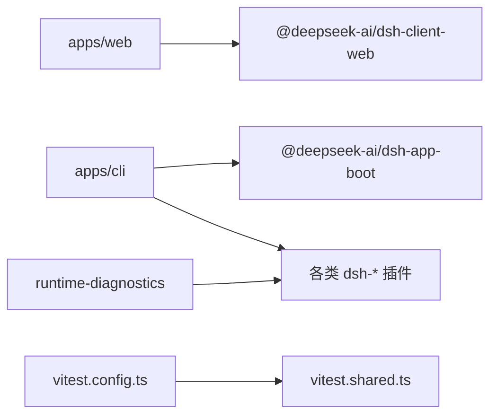

# 调试工具

<cite>
**本文引用的文件**
- [apps/web/vite.config.ts](file://apps/web/vite.config.ts)
- [package.json](file://package.json)
- [apps/web/package.json](file://apps/web/package.json)
- [apps/cli/package.json](file://apps/cli/package.json)
- [vitest.config.ts](file://vitest.config.ts)
- [vitest.shared.ts](file://vitest.shared.ts)
- [scripts/dev-web.ts](file://scripts/dev-web.ts)
- [apps/cli/src/profile-boot.ts](file://apps/cli/src/profile-boot.ts)
- [packages/runtime-diagnostics/invariants/src/index.ts](file://packages/runtime-diagnostics/invariants/src/index.ts)
</cite>

## 目录
1. [简介](#简介)
2. [项目结构](#项目结构)
3. [核心组件](#核心组件)
4. [架构总览](#架构总览)
5. [详细组件分析](#详细组件分析)
6. [依赖关系分析](#依赖关系分析)
7. [性能注意事项](#性能注意事项)
8. [故障排查指南](#故障排查指南)
9. [结论](#结论)
10. [附录](#附录)

## 简介
本文件面向开发者，系统化介绍 deepseek-harness 的调试与开发体验：前端使用 Vite 进行开发与调试（源码映射、网络请求监控、性能分析），后端/CLI 使用 Node.js 调试器、日志与错误追踪，以及运行时不变量诊断。同时给出常见调试场景的解决方案，如插件加载问题、会话状态调试、API 调用调试等，并覆盖热重载与 HMR 的配置要点。

## 项目结构
仓库采用 monorepo 组织，前端在 apps/web，通过 Vite 构建；CLI 入口在 apps/cli，负责启动 profile、组合配置、监听用户补丁并支持热重载；测试与覆盖率由 Vitest 统一管理；运行时不变量诊断位于 packages/runtime-diagnostics。

图表来源
- [apps/web/vite.config.ts:92-160](file://apps/web/vite.config.ts#L92-L160)
- [apps/cli/src/profile-boot.ts:207-300](file://apps/cli/src/profile-boot.ts#L207-L300)
- [vitest.config.ts:117-283](file://vitest.config.ts#L117-L283)
- [vitest.shared.ts:15-42](file://vitest.shared.ts#L15-L42)
- [scripts/dev-web.ts:54-86](file://scripts/dev-web.ts#L54-L86)

章节来源
- [apps/web/vite.config.ts:92-160](file://apps/web/vite.config.ts#L92-L160)
- [apps/cli/src/profile-boot.ts:207-300](file://apps/cli/src/profile-boot.ts#L207-L300)
- [vitest.config.ts:117-283](file://vitest.config.ts#L117-L283)
- [vitest.shared.ts:15-42](file://vitest.shared.ts#L15-L42)
- [scripts/dev-web.ts:54-86](file://scripts/dev-web.ts#L54-L86)

## 核心组件
- 前端构建与调试（Vite）
  - 启用源码映射，便于浏览器断点定位到源码。
  - 通过别名将工作区包指向源码，利于本地调试。
  - 手动分包策略优化缓存与加载性能。
- CLI 启动与热重载（profile-boot）
  - 组合 bundle 层、用户层、home 层与 overlay 层，形成最终配置树。
  - 监听用户补丁文件变更，实现配置级热重载。
  - 注入命令行参数与环境快照，供插件读取。
- 测试与覆盖率（Vitest）
  - 统一测试入口，按进程/线程隔离运行。
  - 严格覆盖率门限（每文件 100%）。
  - 预转换 TypeScript 装饰器，保证调试时能正确映射。
- 运行时不变量（invariants）
  - 提供可配置的不变量注册机制，快速定位违反契约的代码位置。
  - 支持包名白名单/黑名单过滤，便于聚焦关键模块。

章节来源
- [apps/web/vite.config.ts:92-160](file://apps/web/vite.config.ts#L92-L160)
- [apps/cli/src/profile-boot.ts:207-300](file://apps/cli/src/profile-boot.ts#L207-L300)
- [vitest.config.ts:117-283](file://vitest.config.ts#L117-L283)
- [vitest.shared.ts:15-42](file://vitest.shared.ts#L15-L42)
- [packages/runtime-diagnostics/invariants/src/index.ts:94-197](file://packages/runtime-diagnostics/invariants/src/index.ts#L94-L197)

## 架构总览
下图展示从 CLI 启动到前端渲染与 HMR 的整体流程，包括配置组合、补丁监听、客户端插件 watch 构建与浏览器刷新。

图表来源
- [apps/cli/src/profile-boot.ts:207-300](file://apps/cli/src/profile-boot.ts#L207-L300)
- [scripts/dev-web.ts:54-86](file://scripts/dev-web.ts#L54-L86)
- [apps/web/vite.config.ts:92-160](file://apps/web/vite.config.ts#L92-L160)

## 详细组件分析

### 前端调试（Vite）
- 源码映射
  - 构建阶段开启 sourcemap，使浏览器调试可直接映射到源码。
- 别名与工作区源码
  - 通过 resolve.alias 将工作区包映射到 src，确保调试的是源码而非产物。
  - 对 node-only 模块提供 stub，避免浏览器环境报错。
- 手动分包与缓存
  - 将重型第三方库放入 vendor chunk，减少频繁编辑时的重新哈希范围。
  - 语法高亮相关语言包按需拆分，提升首屏性能。
- 开发服务器限制
  - 阻止以独立模式直接 serve apps/web，要求通过 dsh web 启动，以保证运行时上下文完整。

图表来源
- [apps/web/vite.config.ts:92-160](file://apps/web/vite.config.ts#L92-L160)

章节来源
- [apps/web/vite.config.ts:92-160](file://apps/web/vite.config.ts#L92-L160)

### 后端/CLI 调试（Node.js）
- 启动与配置组合
  - profile-boot 组合多层配置，注入命令行参数与环境快照，便于在插件中读取。
- 热重载（配置级）
  - 监听用户补丁文件（profile patch 与 home patch），修改后自动重组配置并生效。
  - 若未挂载 HMR 服务，会按需挂载轻量 HMR 与计时服务，保障长生命周期表面可用。
- 信号与优雅退出
  - 处理 SIGTERM/SIGINT，确保 fiber 与资源正确释放。
- 调试建议
  - 使用 Node.js 内置调试器或 IDE 调试器附加进程，结合日志输出定位问题。
  - 通过环境变量控制行为（例如关闭遥测），缩小问题范围。

图表来源
- [apps/cli/src/profile-boot.ts:207-300](file://apps/cli/src/profile-boot.ts#L207-L300)

章节来源
- [apps/cli/src/profile-boot.ts:207-300](file://apps/cli/src/profile-boot.ts#L207-L300)

### 测试与覆盖率（Vitest）
- 统一配置
  - 通过 vitest.config.ts 聚合所有测试套件，区分线程安全与进程绑定两类用例。
  - 严格覆盖率阈值（语句/分支/函数/行均为 100%），逐文件检查。
- 装饰器与源码映射
  - vitest.shared.ts 提供标准装饰器预处理器，保留 source map，便于调试。
- 平台差异与排除
  - Windows 下排除不支持的包与测试；根据 pwsh 可用性动态调整覆盖范围。

图表来源
- [vitest.config.ts:117-283](file://vitest.config.ts#L117-L283)
- [vitest.shared.ts:15-42](file://vitest.shared.ts#L15-L42)

章节来源
- [vitest.config.ts:117-283](file://vitest.config.ts#L117-L283)
- [vitest.shared.ts:15-42](file://vitest.shared.ts#L15-L42)

### 运行时不变量（Invariants）
- 设计目标
  - 为每个包提供独立的不变量注册入口，集中管理契约校验。
  - 通过白名单/黑名单精准控制哪些包的不变量生效。
- 使用方式
  - 在包内注册 installer，失败时抛出带包名的 InvariantError，便于快速定位。
  - 可在配置中全局开关或按包过滤，便于调试期聚焦关键路径。

图表来源
- [packages/runtime-diagnostics/invariants/src/index.ts:94-197](file://packages/runtime-diagnostics/invariants/src/index.ts#L94-L197)

章节来源
- [packages/runtime-diagnostics/invariants/src/index.ts:94-197](file://packages/runtime-diagnostics/invariants/src/index.ts#L94-L197)

### 客户端插件热重载（dev-web.ts）
- 功能概述
  - 扫描所有声明为 dsh.client 且 platform 为 web 的包，使用 tsdown 以 watch 模式构建。
  - 当源文件变化时，重写 lib/client.js，由 dsh web 的静态服务器轮询检测并重载页面。
- 使用方式
  - 运行脚本并可选启用 polling 模式（适用于网络挂载目录无 inotify 的场景）。
  - 首次构建完成后返回就绪，后续增量构建触发浏览器刷新。

图表来源
- [scripts/dev-web.ts:54-86](file://scripts/dev-web.ts#L54-L86)

章节来源
- [scripts/dev-web.ts:54-86](file://scripts/dev-web.ts#L54-L86)

## 依赖关系分析
- 前端依赖
  - apps/web 依赖 @deepseek-ai/dsh-client-web 及 React 生态，通过 Vite 构建。
- CLI 依赖
  - apps/cli 依赖多个 dsh 子包，负责组合与启动。
- 测试依赖
  - 根级 vitest.config.ts 聚合测试，vitest.shared.ts 提供共享能力。
- 运行时诊断
  - runtime-diagnostics 提供不变量服务，被各包按需注册。

图表来源
- [apps/web/package.json:1-52](file://apps/web/package.json#L1-L52)
- [apps/cli/package.json:1-102](file://apps/cli/package.json#L1-L102)
- [vitest.config.ts:117-283](file://vitest.config.ts#L117-L283)
- [vitest.shared.ts:15-42](file://vitest.shared.ts#L15-L42)

章节来源
- [apps/web/package.json:1-52](file://apps/web/package.json#L1-L52)
- [apps/cli/package.json:1-102](file://apps/cli/package.json#L1-L102)
- [vitest.config.ts:117-283](file://vitest.config.ts#L117-L283)
- [vitest.shared.ts:15-42](file://vitest.shared.ts#L15-L42)

## 性能注意事项
- 前端打包与缓存
  - 将重型依赖放入 vendor chunk，减少编辑 shell 代码时的重新哈希范围。
  - 语法高亮语言包按需懒加载，降低首屏体积。
- 构建与监视
  - 使用 dev-web.ts 的 watch 模式，配合 dsh web 的轮询机制，在网络挂载目录下也能稳定触发 HMR。
- 测试覆盖率
  - 严格覆盖率门限有助于尽早发现回归；必要时可通过覆盖豁免列表控制重套件影响。

[本节为通用指导，不直接分析具体文件]

## 故障排查指南
- 插件加载问题
  - 确认 apps/web 不是独立启动（Vite 会拒绝 standalone serve），应通过 dsh web 启动以获得完整上下文。
  - 检查 resolve.alias 是否正确指向工作区源码，避免加载到构建产物导致行为不一致。
- 会话状态调试
  - 使用 profile-boot 提供的命令行参数与环境快照，在插件中读取并打印关键状态。
  - 利用不变量服务注册会话相关的契约检查，快速捕获异常状态。
- API 调用调试
  - 在前端使用浏览器开发者工具的 Network 面板查看请求与响应；结合源码映射定位发起处。
  - 在后端通过日志与不变量输出，结合 CLI 的环境变量控制（如关闭遥测）缩小范围。
- 热重载不生效
  - 确认 dev-web.ts 已运行并处于 watch 模式；在网络挂载环境下启用 --poll。
  - 检查 dsh web 是否轮询到 lib/client.js 的变化并触发刷新。
- 测试与覆盖率
  - 若出现进程/线程相关问题，参考 vitest.config.ts 中的 pool 设置与进程绑定套件分组。
  - 遇到 Windows 平台不支持的套件，注意其已被排除；必要时在 CI 中单独验证。

章节来源
- [apps/web/vite.config.ts:11-19](file://apps/web/vite.config.ts#L11-L19)
- [apps/web/vite.config.ts:129-159](file://apps/web/vite.config.ts#L129-L159)
- [apps/cli/src/profile-boot.ts:207-300](file://apps/cli/src/profile-boot.ts#L207-L300)
- [packages/runtime-diagnostics/invariants/src/index.ts:94-197](file://packages/runtime-diagnostics/invariants/src/index.ts#L94-L197)
- [scripts/dev-web.ts:54-86](file://scripts/dev-web.ts#L54-L86)
- [vitest.config.ts:117-283](file://vitest.config.ts#L117-L283)

## 结论
本项目提供了完善的前后端调试与开发体验：前端基于 Vite 的源码映射与分包策略，CLI 基于 profile-boot 的配置组合与热重载，测试基于 Vitest 的统一管理与严格覆盖率，运行时不变量为契约校验与快速定位问题提供支持。遵循本文档的实践，可高效开展插件开发、会话调试与性能优化。

[本节为总结性内容，不直接分析具体文件]

## 附录
- 常用命令
  - 前端开发：参见 apps/web/package.json 中的 scripts（build/dev/watch）。
  - 根级脚本：参见 package.json 中的 scripts（如 dev:web、test、test:coverage 等）。
- 环境变量
  - 通过 CLI 启动时传入的参数与环境快照，可在插件中读取并用于调试。
  - 可使用环境变量控制行为（例如关闭遥测），以便隔离问题。

章节来源
- [apps/web/package.json:22-26](file://apps/web/package.json#L22-L26)
- [package.json:19-142](file://package.json#L19-L142)