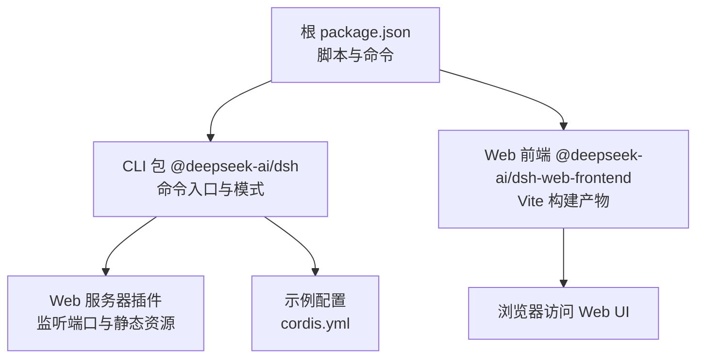
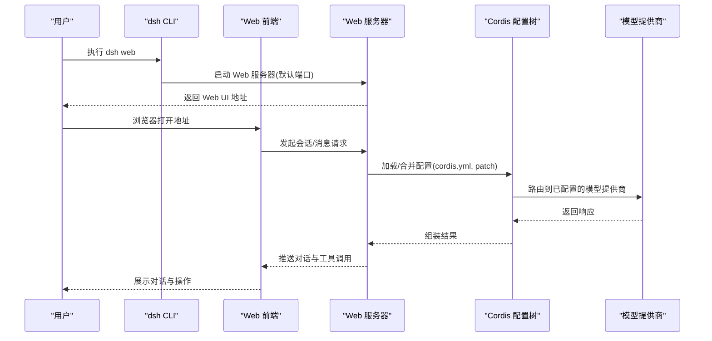
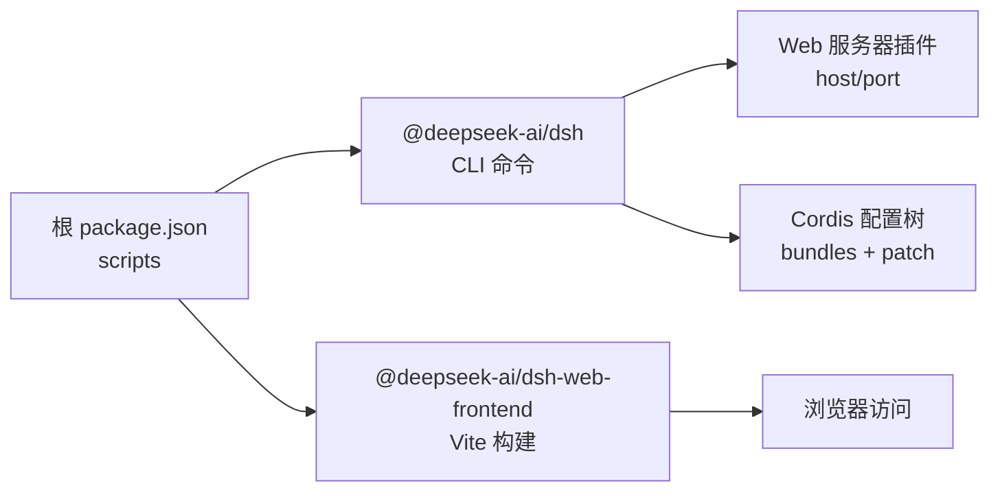

# 快速开始

<cite>
**本文引用的文件**
- [README.md](file://README.md)
- [package.json](file://package.json)
- [apps/cli/README.md](file://apps/cli/README.md)
- [apps/cli/package.json](file://apps/cli/package.json)
- [apps/web/package.json](file://apps/web/package.json)
- [docs/user/guide/index.md](file://docs/user/guide/index.md)
- [docs/user/guide/providers.md](file://docs/user/guide/providers.md)
- [examples/web-cordis/cordis.yml](file://examples/web-cordis/cordis.yml)
- [examples/acp-agent/cordis.yml](file://examples/acp-agent/cordis.yml)
</cite>

## 目录
1. [简介](#简介)
2. [项目结构](#项目结构)
3. [核心组件](#核心组件)
4. [架构总览](#架构总览)
5. [详细组件分析](#详细组件分析)
6. [依赖分析](#依赖分析)
7. [性能注意事项](#性能注意事项)
8. [故障排除指南](#故障排除指南)
9. [结论](#结论)
10. [附录](#附录)

## 简介
本指南面向首次接触 DeepSeek Harness（dsh）的用户，目标是帮助你在最短时间内完成安装、启动 Web UI、配置模型并运行第一个智能体。你将学到：
- 通过 npm 直接运行 dsh
- 从源码构建与运行
- 启动 Web UI 并选择工作区
- 配置模型提供商与基本环境变量
- 常见问题的定位与解决

## 项目结构
仓库采用多包 monorepo 组织，关键入口包括：
- CLI 命令行工具：提供 web、headless 等模式
- Web 前端：由 Vite 构建，被 CLI 的 web 模式服务
- 示例与文档：包含最小可运行的 cordis 配置与用户指南

图表来源
- [package.json:19-48](file://package.json#L19-L48)
- [apps/cli/package.json:14-16](file://apps/cli/package.json#L14-L16)
- [apps/web/package.json:22-25](file://apps/web/package.json#L22-L25)

章节来源
- [package.json:19-48](file://package.json#L19-L48)
- [apps/cli/package.json:14-16](file://apps/cli/package.json#L14-L16)
- [apps/web/package.json:22-25](file://apps/web/package.json#L22-L25)

## 核心组件
- CLI 命令与模式：支持 web、headless 等，web 是浏览器的快捷入口
- Web 前端：构建后由 CLI 的 web 模式提供静态页面与服务端 API
- 配置系统：基于 Cordis 的插件树与 patch 机制，可通过 cordis.yml 组合能力
- 模型与凭据：通过设置页或配置文件管理提供商与密钥

章节来源
- [apps/cli/README.md:7-17](file://apps/cli/README.md#L7-L17)
- [apps/web/package.json:22-25](file://apps/web/package.json#L22-L25)
- [examples/web-cordis/cordis.yml:9-20](file://examples/web-cordis/cordis.yml#L9-L20)

## 架构总览
下图展示了从命令行到 Web UI 的核心调用链与数据流。

图表来源
- [apps/cli/README.md:7-17](file://apps/cli/README.md#L7-L17)
- [examples/web-cordis/cordis.yml:9-20](file://examples/web-cordis/cordis.yml#L9-L20)
- [docs/user/guide/index.md:5-23](file://docs/user/guide/index.md#L5-L23)

## 详细组件分析

### 安装与运行
- 通过 npm 快速运行
  - 需要 Node.js，然后使用 npx 启动 Web UI
- 从源码构建与运行
  - 克隆仓库，安装依赖，构建库与前端，再运行 dsh web

章节来源
- [README.md:15-35](file://README.md#L15-L35)
- [package.json:19-48](file://package.json#L19-L48)

### 启动 Web UI 并选择工作区
- 启动后在终端会输出本地访问地址
- 首次使用需选择工作区（即当前目录或目标项目目录），之后才能使用会话编辑器

章节来源
- [README.md:15-23](file://README.md#L15-L23)
- [docs/user/guide/index.md:5-16](file://docs/user/guide/index.md#L5-L16)

### 配置模型与提供商
- 在 Web UI 的设置中进入“模型”页面，添加提供商并保存密钥
- 支持内置提供商与自定义 OpenAI 兼容网关
- 图像输入需在模型或路由级别声明支持的模态

章节来源
- [docs/user/guide/index.md:7-11](file://docs/user/guide/index.md#L7-L11)
- [docs/user/guide/providers.md:7-30](file://docs/user/guide/providers.md#L7-L30)
- [docs/user/guide/providers.md:31-80](file://docs/user/guide/providers.md#L31-L80)

### 运行第一个智能体
- 选择工作区后，新建会话并发送任务指令
- 智能体可读取/编辑文件、执行命令、委派子任务并维护计划
- 涉及敏感操作时，界面会根据权限策略提示确认

章节来源
- [docs/user/guide/index.md:13-23](file://docs/user/guide/index.md#L13-L23)

### 环境变量与配置选项
常用环境变量与配置要点：
- DSH_HOME：Homes 目录，用于凭据与设置存储
- DSH_PERMISSION_MODE：控制沙箱与审批策略（如 workspace-write、danger-full-access）
- DSH_SNAPSHOT：快照模式开关，影响日志压缩与行为
- E2B_API_KEY：E2B 远程沙箱所需密钥
- 端口与主机：可通过补丁覆盖 Web 服务器 host/port
- 凭据与设置：保存在 $DSH_HOME/.credentials.yaml 与 settings.yaml

章节来源
- [examples/acp-agent/cordis.yml:18-31](file://examples/acp-agent/cordis.yml#L18-L31)
- [examples/acp-agent/cordis.yml:42-57](file://examples/acp-agent/cordis.yml#L42-L57)
- [examples/web-cordis/cordis.yml:9-13](file://examples/web-cordis/cordis.yml#L9-L13)
- [docs/user/guide/providers.md:13-14](file://docs/user/guide/providers.md#L13-L14)

### 补丁与叠加配置
- 使用 --patch 将额外 cordis.yml 作为叠加层注入，便于临时调整（例如修改端口、启用调试工具）
- 示例演示了如何覆盖 webserver 的 host/port，并插入 Cordis 宿主运行器与工具

章节来源
- [examples/web-cordis/cordis.yml:1-20](file://examples/web-cordis/cordis.yml#L1-L20)

## 依赖分析
- CLI 包暴露 dsh 命令，负责解析参数并启动对应模式
- Web 前端通过 Vite 构建，产物由 CLI 的 web 模式提供静态资源与 API
- 配置系统以 Cordis 插件树为核心，通过 bundles 与 patch 组合能力

图表来源
- [package.json:19-48](file://package.json#L19-L48)
- [apps/cli/package.json:22-83](file://apps/cli/package.json#L22-L83)
- [apps/web/package.json:22-25](file://apps/web/package.json#L22-L25)

章节来源
- [apps/cli/package.json:22-83](file://apps/cli/package.json#L22-L83)
- [apps/web/package.json:22-25](file://apps/web/package.json#L22-L25)

## 性能注意事项
- 并发与限流：可通过 agent-loop 的 maxParallelToolCalls 控制每步最大并行工具调用数
- 上下文压缩：compaction-basic 可按比例阈值触发摘要压缩，避免上下文溢出
- 代码执行预算：worker-thread 运行时支持计算耗时与堆内存上限，防止长时间占用
- 网络与 I/O：合理设置 bash 超时与输出缓冲，避免大输出阻塞

章节来源
- [docs/config-catalog.md:135-165](file://docs/config-catalog.md#L135-L165)
- [docs/config-catalog.md:468-512](file://docs/config-catalog.md#L468-L512)
- [docs/config-catalog.md:431-466](file://docs/config-catalog.md#L431-L466)
- [docs/config-catalog.md:343-388](file://docs/config-catalog.md#L343-L388)

## 故障排除指南
常见问题与处理建议：
- 缺少凭据：确保已在“模型”页面保存密钥，或提供对应的环境变量
- 未知模型：选择已配置的模型或在自定义提供商中添加该模型
- 获取模型列表失败：检查 API Key；若接口不支持 /models，请手动填写模型
- 图片被拒绝：为模型声明 image 模态，或在路由级设置 defaultInput
- 提供商拒绝图片：移除不存在的 image 声明，并开启新会话重试
- 端口冲突：通过补丁覆盖 host/port，或使用操作系统分配的随机端口

章节来源
- [docs/user/guide/providers.md:88-99](file://docs/user/guide/providers.md#L88-L99)
- [examples/web-cordis/cordis.yml:9-13](file://examples/web-cordis/cordis.yml#L9-L13)

## 结论
通过以上步骤，你可以快速安装并运行 DeepSeek Harness，启动 Web UI，配置模型提供商，并在所选工作区中运行第一个智能体。借助 Cordis 的配置系统与补丁机制，你可以灵活地扩展与定制能力。遇到问题时，优先检查凭据、模型配置与权限策略。

## 附录

### 快速上手清单
- 安装 Node.js
- 使用 npx 启动 Web UI，或从源码构建后运行
- 在 Web UI 中选择工作区
- 在“模型”页面添加提供商并保存密钥
- 发送第一条任务指令，体验智能体的文件读写、命令执行与计划能力

章节来源
- [README.md:15-35](file://README.md#L15-L35)
- [docs/user/guide/index.md:5-23](file://docs/user/guide/index.md#L5-L23)

### 常用命令参考
- 通过 npm 运行 Web UI：npx @deepseek-ai/dsh web
- 从源码运行：pnpm install → pnpm run build → pnpm dsh web
- 使用补丁覆盖端口：dsh web --patch <你的补丁文件>

章节来源
- [README.md:15-35](file://README.md#L15-L35)
- [examples/web-cordis/cordis.yml:9-20](file://examples/web-cordis/cordis.yml#L9-L20)