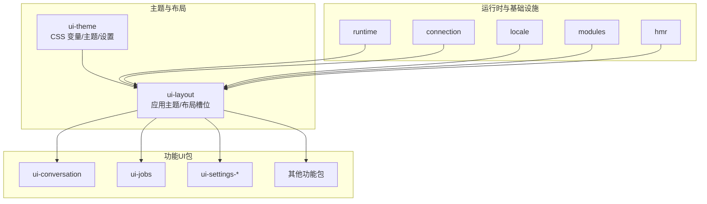
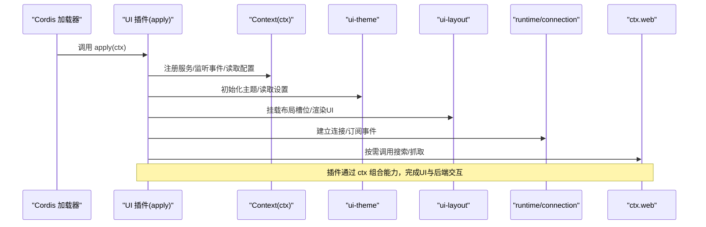
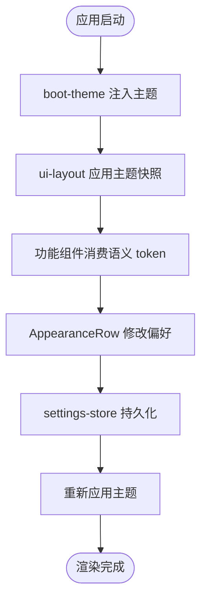
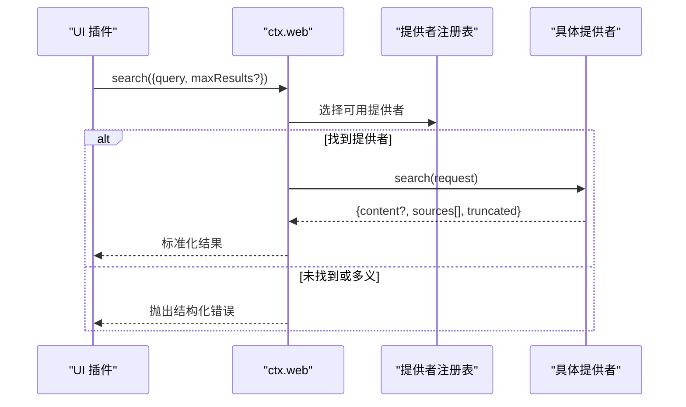
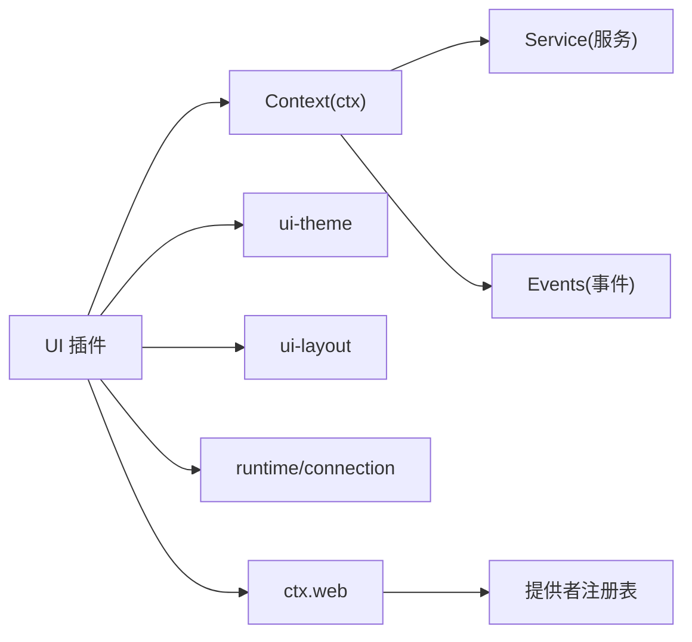

# UI 插件开发

<cite>
**本文引用的文件**
- [01-first-plugin.md](file://docs/cordis-tutorial/01-first-plugin.md)
- [06-composition-and-hmr.md](file://docs/cordis-tutorial/06-composition-and-hmr.md)
- [context.md](file://docs/cordis-api/context.md)
- [service.md](file://docs/cordis-api/service.md)
- [web.md](file://docs/subsystems/web.md)
- [web-styling.md](file://docs/web-styling.md)
- [index.ts](file://packages/client/ui-theme/src/index.ts)
- [boot-theme.ts](file://packages/client/ui-theme/src/boot-theme.ts)
- [AppearanceRow.tsx](file://packages/client/ui-theme/src/client/AppearanceRow.tsx)
- [settings-store.ts](file://packages/client/ui-theme/src/client/settings-store.ts)
- [base.css](file://packages/client/ui-theme/src/styles/base.css)
- [design-platform.css](file://packages/client/ui-theme/src/styles/design-platform.css)
- [scrollbar.css](file://packages/client/ui-theme/src/styles/scrollbar.css)
- [shiki.css](file://packages/client/ui-theme/src/styles/shiki.css)
- [index.ts](file://packages/client/ui-layout/src/index.ts)
- [index.ts](file://packages/client/connection/src/index.ts)
- [index.ts](file://packages/client/runtime/src/index.ts)
- [index.ts](file://packages/client/locale/src/index.ts)
- [index.ts](file://packages/client/modules/src/index.ts)
- [index.ts](file://packages/client/hmr/src/index.ts)
- [index.ts](file://packages/web/web/src/index.ts)
- [provider.ts](file://packages/web/web-fetch-http/src/provider.ts)
- [policy.ts](file://packages/web/web-fetch-http/src/policy.ts)
</cite>

## 目录
1. [简介](#简介)
2. [项目结构](#项目结构)
3. [核心组件](#核心组件)
4. [架构总览](#架构总览)
5. [详细组件分析](#详细组件分析)
6. [依赖关系分析](#依赖关系分析)
7. [性能考虑](#性能考虑)
8. [故障排查指南](#故障排查指南)
9. [结论](#结论)
10. [附录](#附录)

## 简介
本文件面向在 DeepSeek Harness（DSH）中开发 Web 前端 UI 插件的工程师，系统化阐述插件架构、组件集成、状态管理、事件处理、样式定制与主题系统、国际化支持、响应式设计以及常见界面组件（面板、对话框、工具栏等）的封装与复用模式。文档同时给出性能优化与用户体验设计建议，帮助你在不侵入宿主应用的前提下，以插件方式扩展 UI 能力。

## 项目结构
DSH 的前端 UI 采用“主题层 + 布局层 + 功能包”的分层组织：
- 主题层 ui-theme：集中定义 CSS 变量、语义化 token、字体、动效、阴影、滚动条样式与明暗偏好；提供启动时注入主题的入口与设置项。
- 布局层 ui-layout：负责将解析后的主题快照应用到文档，并承载全局布局槽位与容器。
- 功能包：按业务域拆分（如对话、消息反馈、工作流、终端、设置等），通过 CSS Modules 与 clsx 实现局部样式隔离，消费主题语义 token。
- 运行时与连接：runtime、connection、locale、modules、hmr 等基础能力为 UI 插件提供运行期上下文、通信、本地化、模块加载与热更新。

图表来源
- [index.ts](file://packages/client/ui-theme/src/index.ts)
- [boot-theme.ts](file://packages/client/ui-theme/src/boot-theme.ts)
- [index.ts](file://packages/client/ui-layout/src/index.ts)
- [index.ts](file://packages/client/runtime/src/index.ts)
- [index.ts](file://packages/client/connection/src/index.ts)
- [index.ts](file://packages/client/locale/src/index.ts)
- [index.ts](file://packages/client/modules/src/index.ts)
- [index.ts](file://packages/client/hmr/src/index.ts)

章节来源
- [web-styling.md:7-25](file://docs/web-styling.md#L7-L25)
- [index.ts](file://packages/client/ui-theme/src/index.ts)
- [boot-theme.ts](file://packages/client/ui-theme/src/boot-theme.ts)
- [index.ts](file://packages/client/ui-layout/src/index.ts)

## 核心组件
- 主题系统（ui-theme）
  - 职责：维护 --dsw-* 静态比例、语义别名、排版、动效、渐变、阴影、滚动条样式与明暗偏好；提供设置项与运行时切换能力。
  - 关键文件：主题索引、启动注入、外观行组件、设置存储、样式表集合。
- 布局系统（ui-layout）
  - 职责：将主题快照应用到文档，提供布局槽位与容器，供功能包挂载 UI。
- 运行时与连接（runtime、connection）
  - 职责：提供宿主能力接入、事件总线、服务注册与生命周期管理，支撑插件间通信与状态同步。
- 国际化（locale）
  - 职责：多语言资源管理与切换，配合 UI 组件展示本地化文案。
- 模块与热更新（modules、hmr）
  - 职责：动态加载/卸载插件模块，结合 Cordis HMR 实现热重载，提升开发体验。

章节来源
- [web-styling.md:7-25](file://docs/web-styling.md#L7-L25)
- [index.ts](file://packages/client/ui-theme/src/index.ts)
- [boot-theme.ts](file://packages/client/ui-theme/src/boot-theme.ts)
- [index.ts](file://packages/client/ui-layout/src/index.ts)
- [index.ts](file://packages/client/runtime/src/index.ts)
- [index.ts](file://packages/client/connection/src/index.ts)
- [index.ts](file://packages/client/locale/src/index.ts)
- [index.ts](file://packages/client/modules/src/index.ts)
- [index.ts](file://packages/client/hmr/src/index.ts)

## 架构总览
DSH 的 UI 插件基于 Cordis 插件体系：每个插件导出 apply(ctx)，由 loader 根据 cordis.yml 装配。插件通过 ctx 提供的服务、事件、反射与注册表进行协作，支持隔离作用域、拦截配置、子上下文扩展与热替换。Web 能力作为可选能力，通过 ctx.web 暴露搜索与抓取接口，统一选择策略与错误模型。

图表来源
- [01-first-plugin.md:5-51](file://docs/cordis-tutorial/01-first-plugin.md#L5-L51)
- [06-composition-and-hmr.md:23-59](file://docs/cordis-tutorial/06-composition-and-hmr.md#L23-L59)
- [context.md:14-95](file://docs/cordis-api/context.md#L14-L95)
- [service.md:4-12](file://docs/cordis-api/service.md#L4-L12)
- [web.md:130-198](file://docs/subsystems/web.md#L130-L198)

## 详细组件分析

### 主题系统与样式定制（ui-theme）
- 所有权与规则
  - 主题拥有 --dsw-* 静态比例、语义别名、排版、动效、渐变、阴影、滚动条样式与明暗偏好。
  - 功能组件使用 CSS Modules 与 clsx，仅消费语义 token，不在组件内定义全局主题分支。
- 运行时注入与切换
  - 启动时通过 boot-theme 将主题应用到文档。
  - AppearanceRow 提供外观设置入口，settings-store 持久化用户偏好。
- 样式文件组织
  - base.css、design-platform.css、scrollbar.css、shiki.css 等集中管理全局样式。

图表来源
- [boot-theme.ts](file://packages/client/ui-theme/src/boot-theme.ts)
- [index.ts](file://packages/client/ui-theme/src/index.ts)
- [AppearanceRow.tsx](file://packages/client/ui-theme/src/client/AppearanceRow.tsx)
- [settings-store.ts](file://packages/client/ui-theme/src/client/settings-store.ts)
- [base.css](file://packages/client/ui-theme/src/styles/base.css)
- [design-platform.css](file://packages/client/ui-theme/src/styles/design-platform.css)
- [scrollbar.css](file://packages/client/ui-theme/src/styles/scrollbar.css)
- [shiki.css](file://packages/client/ui-theme/src/styles/shiki.css)

章节来源
- [web-styling.md:7-25](file://docs/web-styling.md#L7-L25)
- [index.ts](file://packages/client/ui-theme/src/index.ts)
- [boot-theme.ts](file://packages/client/ui-theme/src/boot-theme.ts)
- [AppearanceRow.tsx](file://packages/client/ui-theme/src/client/AppearanceRow.tsx)
- [settings-store.ts](file://packages/client/ui-theme/src/client/settings-store.ts)
- [base.css](file://packages/client/ui-theme/src/styles/base.css)
- [design-platform.css](file://packages/client/ui-theme/src/styles/design-platform.css)
- [scrollbar.css](file://packages/client/ui-theme/src/styles/scrollbar.css)
- [shiki.css](file://packages/client/ui-theme/src/styles/shiki.css)

### 布局与插槽（ui-layout）
- 职责：将主题应用到文档，提供布局槽位与容器，使功能包可插拔地挂载到指定区域。
- 与主题的关系：消费 ui-theme 输出的主题快照，不重复定义全局样式。

章节来源
- [index.ts](file://packages/client/ui-layout/src/index.ts)
- [web-styling.md:7-25](file://docs/web-styling.md#L7-L25)

### 运行时、连接与事件（runtime、connection）
- 运行时（runtime）：提供宿主能力、生命周期钩子与服务发现。
- 连接（connection）：建立与后端的通道，支撑实时数据与命令下发。
- 事件机制：通过 ctx.events 或连接层的事件总线，实现跨插件通信。

章节来源
- [index.ts](file://packages/client/runtime/src/index.ts)
- [index.ts](file://packages/client/connection/src/index.ts)
- [context.md:120-128](file://docs/cordis-api/context.md#L120-L128)

### 国际化（locale）
- 职责：管理多语言资源与切换逻辑，确保 UI 文案可本地化。
- 与主题/布局：与主题设置联动，支持按语言切换显示内容。

章节来源
- [index.ts](file://packages/client/locale/src/index.ts)
- [web-styling.md:7-25](file://docs/web-styling.md#L7-L25)

### 模块加载与热更新（modules、hmr）
- 模块加载：动态加载/卸载插件模块，支持按需引入。
- 热更新：结合 Cordis HMR，保存即重载，自动卸载旧实例并加载新代码，保持状态一致。

章节来源
- [index.ts](file://packages/client/modules/src/index.ts)
- [index.ts](file://packages/client/hmr/src/index.ts)
- [06-composition-and-hmr.md:23-59](file://docs/cordis-tutorial/06-composition-and-hmr.md#L23-L59)

### Web 能力（ctx.web）
- 能力范围：搜索与抓取两个操作，统一的选择策略、错误模型与取消信号。
- 提供者：search/fetch 提供者通过注册表注入，执行时按配置或可用数量选择。
- 结果规范：搜索结果包含 sources 与 truncated；抓取结果包含 url、statusCode、body 与 truncated。

图表来源
- [web.md:130-198](file://docs/subsystems/web.md#L130-L198)
- [index.ts](file://packages/web/web/src/index.ts)
- [provider.ts](file://packages/web/web-fetch-http/src/provider.ts)
- [policy.ts](file://packages/web/web-fetch-http/src/policy.ts)

章节来源
- [web.md:130-198](file://docs/subsystems/web.md#L130-L198)
- [index.ts](file://packages/web/web/src/index.ts)
- [provider.ts](file://packages/web/web-fetch-http/src/provider.ts)
- [policy.ts](file://packages/web/web-fetch-http/src/policy.ts)

### React/Vue 组件封装与复用模式
- 封装原则
  - 使用 CSS Modules 与 clsx 管理类名，避免全局样式污染。
  - 通过 props 暴露行为，内部状态最小化，复杂状态交由运行时/连接层管理。
  - 组件消费主题语义 token，不直接引用颜色常量。
- 复用模式
  - 基础原子组件（按钮、输入、图标）集中在 ui-primitives。
  - 领域组件（会话、任务、计划等）在对应 ui-* 包中实现，并通过 ui-layout 的槽位挂载。
  - 通过 slots 与组合式 API 将通用行为抽象为高阶组件或 Hook。

章节来源
- [web-styling.md:13-22](file://docs/web-styling.md#L13-L22)
- [index.ts](file://packages/client/ui-layout/src/index.ts)

### 自定义面板、对话框、工具栏
- 面板：通过 ui-layout 的槽位插入，结合主题 token 与 CSS Modules 实现自适应布局。
- 对话框：以模态形式挂载于根容器，遵循键盘可达性与无障碍要求。
- 工具栏：聚合常用操作，支持快捷键与可配置项，通过事件总线触发业务动作。

章节来源
- [web-styling.md:13-22](file://docs/web-styling.md#L13-L22)
- [index.ts](file://packages/client/ui-layout/src/index.ts)

### 状态管理、事件处理与样式定制机制
- 状态管理
  - 通过 runtime/connection 提供的服务与事件总线维护全局状态，组件仅持有视图状态。
  - 利用 ctx.isolate 与 ctx.intercept 实现作用域隔离与配置拦截，避免状态串扰。
- 事件处理
  - 使用 ctx.events 或连接层事件进行解耦通信，支持过滤与优先级控制。
- 样式定制
  - 通过 ui-theme 的语义 token 与 CSS 变量实现主题切换；组件内仅使用局部变量。

章节来源
- [context.md:39-95](file://docs/cordis-api/context.md#L39-L95)
- [web-styling.md:7-25](file://docs/web-styling.md#L7-L25)

### 主题系统、国际化支持与响应式设计
- 主题系统
  - 集中管理 --dsw-* 变量与语义别名，支持明暗模式与动效开关。
- 国际化
  - locale 包提供多语言资源与切换；与主题设置联动，支持按语言切换文案。
- 响应式设计
  - 使用 CSS 媒体查询与弹性布局，结合主题排版变量，保证在不同屏幕尺寸下的可读性。

章节来源
- [web-styling.md:7-25](file://docs/web-styling.md#L7-L25)
- [index.ts](file://packages/client/locale/src/index.ts)

## 依赖关系分析
- 插件与上下文
  - 插件通过 apply(ctx) 接入，使用 ctx 的服务、事件、反射与注册表。
- 主题与布局
  - ui-layout 依赖 ui-theme 的输出；功能包依赖 ui-layout 的槽位。
- 运行时与连接
  - 功能包通过 runtime/connection 获取宿主能力与通信通道。
- Web 能力
  - 插件通过 ctx.web 调用搜索/抓取，提供者由 web 包注册与管理。

图表来源
- [context.md:14-95](file://docs/cordis-api/context.md#L14-L95)
- [service.md:4-12](file://docs/cordis-api/service.md#L4-L12)
- [index.ts](file://packages/client/ui-theme/src/index.ts)
- [index.ts](file://packages/client/ui-layout/src/index.ts)
- [index.ts](file://packages/client/runtime/src/index.ts)
- [index.ts](file://packages/client/connection/src/index.ts)
- [web.md:130-198](file://docs/subsystems/web.md#L130-L198)

章节来源
- [context.md:14-95](file://docs/cordis-api/context.md#L14-L95)
- [service.md:4-12](file://docs/cordis-api/service.md#L4-L12)
- [web.md:130-198](file://docs/subsystems/web.md#L130-L198)

## 性能考虑
- 组件粒度与懒加载
  - 将重型组件拆分为独立模块，按需加载；结合 modules/hmr 实现热更新与增量编译。
- 样式与主题
  - 使用 CSS Modules 减少样式冲突；通过主题 token 复用样式，避免重复计算。
- 事件与状态
  - 使用事件总线解耦，避免频繁重渲染；仅在必要时更新视图状态。
- Web 能力
  - 合理设置 maxResults 与超时限制，避免过大响应；对抓取内容进行截断与缓存。

[本节为通用指导，无需特定文件来源]

## 故障排查指南
- 插件未加载或处于 PENDING
  - 检查 inject 声明的服务是否已提供；通过 registry 枚举 fiber 状态定位缺失依赖。
- 热更新无效
  - 确认 HMR 插件已启用，且 cordis.yml 中配置了 root 路径；保存后观察日志输出。
- 主题未生效
  - 确认 boot-theme 已执行，ui-layout 已应用主题快照；检查 settings-store 中的偏好值。
- Web 能力报错
  - 查看 ctx.web 返回的结构化错误码，确认提供者是否可用、配置是否正确。

章节来源
- [06-composition-and-hmr.md:61-109](file://docs/cordis-tutorial/06-composition-and-hmr.md#L61-L109)
- [context.md:153-161](file://docs/cordis-api/context.md#L153-L161)
- [web.md:120-128](file://docs/subsystems/web.md#L120-L128)

## 结论
DSH 的 UI 插件体系以 Cordis 为核心，结合 ui-theme 与 ui-layout 形成清晰的主题与布局分层，功能包通过槽位与事件进行松耦合集成。借助 runtime/connection 与 ctx.web，插件可安全地与宿主及后端交互。遵循样式与组件规范，可实现高质量的主题定制、国际化与响应式体验，并通过 HMR 与模块化提升开发效率。

## 附录
- 快速上手
  - 参考教程创建首个插件，理解 apply(ctx) 与 cordis.yml 的组合方式。
  - 使用 HMR 插件进行热重载，提升迭代速度。
- 最佳实践
  - 使用 CSS Modules 与语义 token；避免在组件内定义全局主题。
  - 通过 ctx.isolate 与 ctx.intercept 实现作用域隔离与配置覆盖。
  - 合理使用 Web 能力的 maxResults 与超时控制，保障性能与稳定性。

章节来源
- [01-first-plugin.md:5-51](file://docs/cordis-tutorial/01-first-plugin.md#L5-L51)
- [06-composition-and-hmr.md:23-59](file://docs/cordis-tutorial/06-composition-and-hmr.md#L23-L59)
- [web-styling.md:7-25](file://docs/web-styling.md#L7-L25)
- [context.md:39-95](file://docs/cordis-api/context.md#L39-L95)
- [web.md:130-198](file://docs/subsystems/web.md#L130-L198)