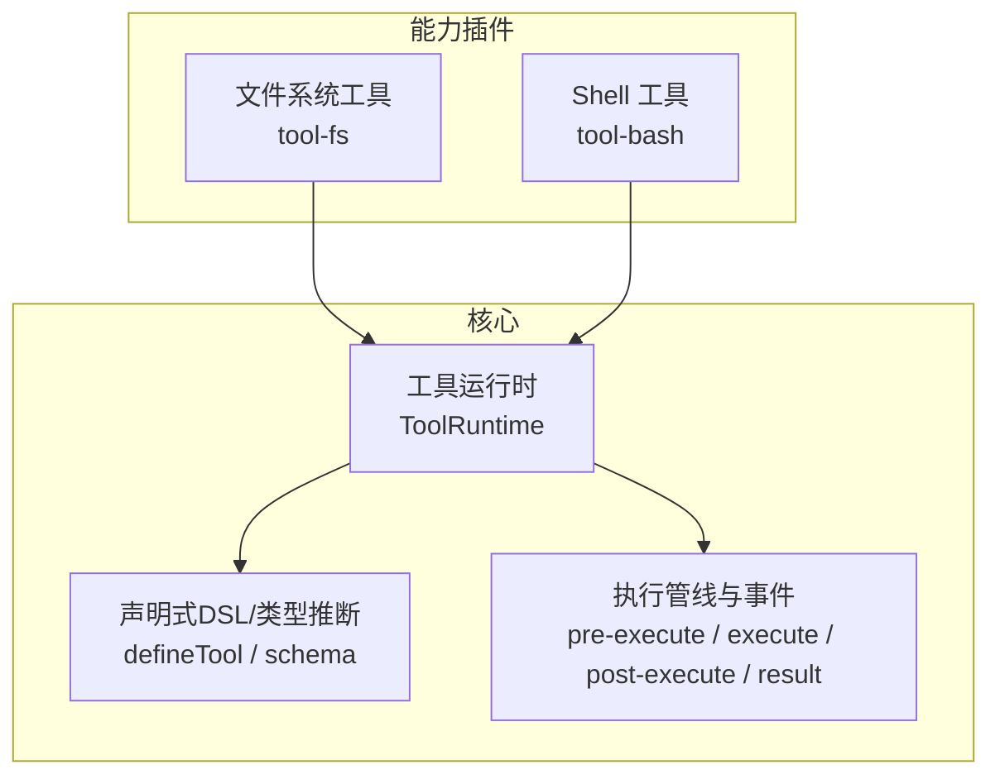
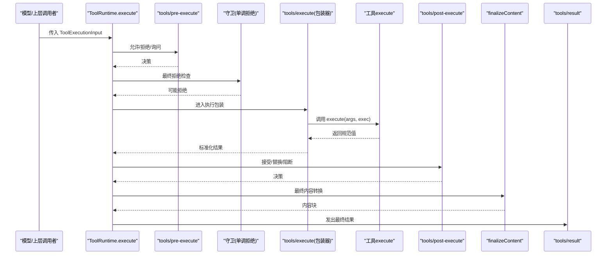
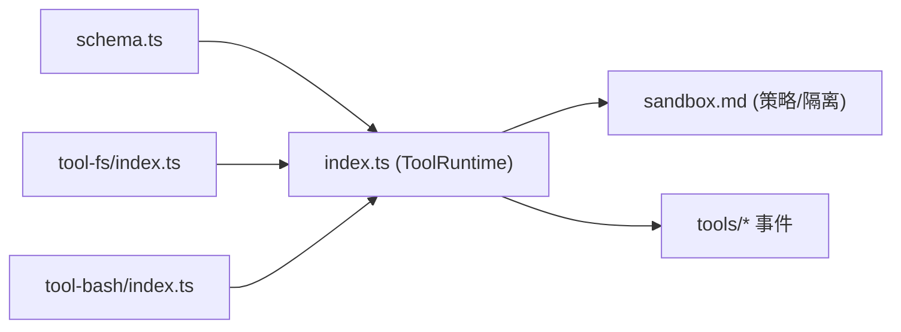

# 工具插件开发

<cite>
**本文引用的文件**
- [packages/core/tools/src/index.ts](file://packages/core/tools/src/index.ts)
- [packages/core/tools/src/schema.ts](file://packages/core/tools/src/schema.ts)
- [packages/fs/tool-fs/src/index.ts](file://packages/fs/tool-fs/src/index.ts)
- [packages/shell/tool-bash/src/index.ts](file://packages/shell/tool-bash/src/index.ts)
- [docs/subsystems/tools.md](file://docs/subsystems/tools.md)
- [docs/subsystems/sandbox.md](file://docs/subsystems/sandbox.md)
</cite>

## 目录
1. [简介](#简介)
2. [项目结构](#项目结构)
3. [核心组件](#核心组件)
4. [架构总览](#架构总览)
5. [详细组件分析](#详细组件分析)
6. [依赖关系分析](#依赖关系分析)
7. [性能与并发](#性能与并发)
8. [故障排查指南](#故障排查指南)
9. [结论](#结论)
10. [附录：标准流程与模板](#附录：标准流程与模板)

## 简介
本章节面向希望为系统扩展“工具”的开发者，系统性说明工具的声明式定义、参数校验、执行上下文、权限控制、沙箱隔离与资源限制机制；并给出 TypeScript 工具的标准开发流程与模板，覆盖异步工具、流式输出、子进程工具等常见模式，以及文件系统操作、命令执行、网络请求等典型用例。

## 项目结构
围绕工具体系的核心代码位于 core/tools 包，提供工具注册表、声明式 DSL、执行流水线与事件钩子；具体能力由各功能包以插件形式注册到工具运行时（如文件系统工具、Shell 工具）。

图表来源
- [packages/core/tools/src/index.ts:787-800](file://packages/core/tools/src/index.ts#L787-L800)
- [packages/core/tools/src/schema.ts:545-617](file://packages/core/tools/src/schema.ts#L545-L617)
- [packages/fs/tool-fs/src/index.ts:54-79](file://packages/fs/tool-fs/src/index.ts#L54-L79)
- [packages/shell/tool-bash/src/index.ts:190-394](file://packages/shell/tool-bash/src/index.ts#L190-L394)

章节来源
- [packages/core/tools/src/index.ts:787-800](file://packages/core/tools/src/index.ts#L787-L800)
- [packages/core/tools/src/schema.ts:545-617](file://packages/core/tools/src/schema.ts#L545-L617)
- [packages/fs/tool-fs/src/index.ts:54-79](file://packages/fs/tool-fs/src/index.ts#L54-L79)
- [packages/shell/tool-bash/src/index.ts:190-394](file://packages/shell/tool-bash/src/index.ts#L190-L394)

## 核心组件
- 工具定义与注册
  - 使用 defineTool 声明 name/description/parameters/output/execute 及可选 finalizeContent/presentCall/presentResult/isConcurrencySafe/timeoutMs。
  - 通过 ctx.tools.register 注册到 ToolRuntime；同一作用域内可覆盖全局工具，支持 restrict 进行可见性过滤。
- 参数与输出校验
  - parameters 采用声明式 ValueSchemaSpec 编译为受支持的 JSON Schema 子集；output.schema 对返回值做严格校验。
  - 参数不合法抛出 INVALID_ARGS；输出不合法抛出 INVALID_TOOL_OUTPUT。
- 执行上下文与生命周期
  - execute 接收已解析且冻结的参数与 ToolRunContext（含 deferContext/concludeTurn）。
  - 执行管线：tools/pre-execute → 守卫 → tools/execute（可替换 signal）→ tools/post-execute → finalizeContent → tools/result。
- UI 呈现
  - presentCall/presentResult 返回中性渲染意图（terminal/diff/search/read/web/generic），供宿主适配。
- 并发与超时
  - isConcurrencySafe 决定是否可以与兄弟调用并行；timeoutMs 配合外部策略实现协作式超时。

章节来源
- [packages/core/tools/src/schema.ts:545-617](file://packages/core/tools/src/schema.ts#L545-L617)
- [packages/core/tools/src/index.ts:221-288](file://packages/core/tools/src/index.ts#L221-L288)
- [docs/subsystems/tools.md:9-151](file://docs/subsystems/tools.md#L9-L151)
- [docs/subsystems/tools.md:170-404](file://docs/subsystems/tools.md#L170-L404)

## 架构总览
下图展示了从模型请求到工具执行的完整链路，包括参数校验、策略门控、执行包装、结果投影与持久化。

图表来源
- [packages/core/tools/src/index.ts:152-197](file://packages/core/tools/src/index.ts#L152-L197)
- [packages/core/tools/src/index.ts:787-800](file://packages/core/tools/src/index.ts#L787-L800)
- [docs/subsystems/tools.md:170-404](file://docs/subsystems/tools.md#L170-L404)

## 详细组件分析

### 工具运行时与注册表（ToolRuntime）
- 职责
  - 维护工具定义、作用域可见性、限制规则、守卫集合。
  - 暴露 schemas/restrict/register/guard/execute 等 API。
  - 将工具定义投影为模型可见的 ToolSchema[]（仅白名单字段）。
- 关键行为
  - execute 完成参数快照与冻结、分配 token、串联 pre-execute/guards/execute/post-execute/finalizeContent/result。
  - 失败路径统一归一化为结构化错误（UNKNOWN_TOOL/INVALID_ARGS/INVALID_TOOL_OUTPUT 等）。

章节来源
- [packages/core/tools/src/index.ts:787-800](file://packages/core/tools/src/index.ts#L787-L800)
- [packages/core/tools/src/index.ts:488-522](file://packages/core/tools/src/index.ts#L488-L522)
- [docs/subsystems/tools.md:478-574](file://docs/subsystems/tools.md#L478-L574)

### 声明式 DSL 与类型推断（schema.ts）
- 作者友好 DSL
  - 支持 string/number/integer/boolean/null/array/object/json/oneOf，强制 object 显式 additionalProperties。
  - 参数根为隐式开放对象，required 标注在属性级。
- 编译与校验
  - parameterSchemaSpecToJsonSchema/valueSchemaSpecToJsonSchema 编译为受支持的 JSON Schema 子集。
  - validateArgs 用于运行时参数校验；输出值经 output.schema 校验。
- defineTool
  - 自动绑定参数/输出类型推断，封装 execute 中的参数校验与返回值规范化。
  - presentCall/presentResult 软校验，回放兼容旧参数。

章节来源
- [packages/core/tools/src/schema.ts:11-175](file://packages/core/tools/src/schema.ts#L11-L175)
- [packages/core/tools/src/schema.ts:438-480](file://packages/core/tools/src/schema.ts#L438-L480)
- [packages/core/tools/src/schema.ts:545-617](file://packages/core/tools/src/schema.ts#L545-L617)

### 文件系统工具（tool-fs）
- 能力
  - 提供 read/read_image/write/edit 等文件操作工具，基于 ctx.fs 抽象，不耦合具体提供者。
  - 支持读取窗口、行/字节上限、大文件流式读取等配置。
- 安全与策略
  - 通过 FsSandboxController 聚合变更类工具的告警门控、每调用策略判定与拒绝标记映射。
  - 当 ctx.fs 处于沙箱模式时，变更操作需遵循策略。
- 注册方式
  - apply(ctx, config) 中根据注入能力按需注册 read_image（需要 attachments 挂载）。

章节来源
- [packages/fs/tool-fs/src/index.ts:1-80](file://packages/fs/tool-fs/src/index.ts#L1-L80)

### Shell 工具（tool-bash）
- 能力
  - 执行 bash 命令，支持前台/后台模式；后台模式返回 job id，结合 jobs 服务管理生命周期。
  - 工作目录解析与会话 cwd 关联；支持超时、环境变量注入。
- 沙箱与升级
  - 若 executor 具备沙箱能力，则通过 ctx.sandboxPolicy.resolve 获取 per-call 策略；必要时走 approveEscalation 申请更宽权限。
  - 对沙箱拒绝提供明确提示与一次性升级路径。
- 呈现
  - presentCall/presentResult 将前台命令呈现为终端卡片，后台启动呈现为通用卡片。

章节来源
- [packages/shell/tool-bash/src/index.ts:1-395](file://packages/shell/tool-bash/src/index.ts#L1-L395)
- [docs/subsystems/sandbox.md:9-94](file://docs/subsystems/sandbox.md#L9-L94)

### 权限控制与沙箱隔离
- 权限控制
  - tools/pre-execute 可实现允许/拒绝/询问（ask）；守卫为单调拒绝，无法被后续监听器恢复允许。
  - ToolRestriction 可对全局工具进行 allow/deny 过滤，不影响作用域内注册。
- 沙箱隔离
  - SandboxMode 限定文件效果：read-only/workspace-write/danger-full-access；非危险模式交由 ctx.sandbox.confine 包装 argv。
  - 策略服务 ctx.sandboxPolicy.resolve 提供 per-call 策略，包含 workspaceRoot 与会话标识。

章节来源
- [docs/subsystems/tools.md:153-172](file://docs/subsystems/tools.md#L153-L172)
- [docs/subsystems/tools.md:315-325](file://docs/subsystems/tools.md#L315-L325)
- [docs/subsystems/sandbox.md:9-94](file://docs/subsystems/sandbox.md#L9-L94)
- [docs/subsystems/sandbox.md:166-213](file://docs/subsystems/sandbox.md#L166-L213)

### 资源限制与超时
- 协作式超时
  - timeoutMs 声明后由外部策略（tools/execute 包装器）驱动；工具需转发 exec.signal 并在取消时尽快静默。
- 并发控制
  - isConcurrencySafe 返回 true 才可与兄弟调用并行；否则形成顺序屏障。
- 子进程/作业
  - 后台任务通过 jobs 管理，取消信号在移交前由调用方持有，移交后由作业服务接管。

章节来源
- [packages/core/tools/src/index.ts:248-269](file://packages/core/tools/src/index.ts#L248-L269)
- [packages/shell/tool-bash/src/index.ts:349-378](file://packages/shell/tool-bash/src/index.ts#L349-L378)

## 依赖关系分析
- 工具运行时依赖
  - 声明式 DSL（schema.ts）生成参数/输出 JSON Schema 并执行校验。
  - 能力插件（tool-fs/tool-bash）通过 ctx.tools.register 注册工具。
  - 沙箱策略（sandbox）为 shell/fs 等提供执行边界。
- 事件与钩子
  - tools/pre-execute/tools/execute/tools/post-execute/tools/result 构成可扩展的执行水落石出。
  - tools/code-dispatch-log 用于 Code Mode 下子调用的日志内容替换。

图表来源
- [packages/core/tools/src/schema.ts:545-617](file://packages/core/tools/src/schema.ts#L545-L617)
- [packages/core/tools/src/index.ts:787-800](file://packages/core/tools/src/index.ts#L787-L800)
- [packages/fs/tool-fs/src/index.ts:54-79](file://packages/fs/tool-fs/src/index.ts#L54-L79)
- [packages/shell/tool-bash/src/index.ts:190-394](file://packages/shell/tool-bash/src/index.ts#L190-L394)
- [docs/subsystems/sandbox.md:166-213](file://docs/subsystems/sandbox.md#L166-L213)

章节来源
- [packages/core/tools/src/index.ts:787-800](file://packages/core/tools/src/index.ts#L787-L800)
- [packages/core/tools/src/schema.ts:545-617](file://packages/core/tools/src/schema.ts#L545-L617)
- [packages/fs/tool-fs/src/index.ts:54-79](file://packages/fs/tool-fs/src/index.ts#L54-L79)
- [packages/shell/tool-bash/src/index.ts:190-394](file://packages/shell/tool-bash/src/index.ts#L190-L394)
- [docs/subsystems/sandbox.md:166-213](file://docs/subsystems/sandbox.md#L166-L213)

## 性能与并发
- 并行调度
  - 仅当 isConcurrencySafe 返回 true 时才加入并行池；否则串行执行，避免共享状态竞争。
- 超时与取消
  - 工具必须尊重 exec.signal；包装器可在 tools/execute 中替换信号但不可移除，最终仍会融合调用方取消。
- 结果投影
  - render/presentationMeta 应为纯函数；框架会在执行前后分别快照与冻结，保证回放一致性与持久化安全。

章节来源
- [packages/core/tools/src/index.ts:248-269](file://packages/core/tools/src/index.ts#L248-L269)
- [packages/core/tools/src/index.ts:524-553](file://packages/core/tools/src/index.ts#L524-L553)
- [docs/subsystems/tools.md:243-255](file://docs/subsystems/tools.md#L243-L255)

## 故障排查指南
- 未知工具
  - 现象：调用未注册的工具名。
  - 处理：框架抛出 UNKNOWN_TOOL；检查工具是否在当前作用域可见或被 restrict 隐藏。
- 参数非法
  - 现象：参数不符合 parameters 声明。
  - 处理：抛出 INVALID_ARGS；核对参数类型与 required 标注。
- 输出非法
  - 现象：execute 返回值不符合 output.schema。
  - 处理：抛出 INVALID_TOOL_OUTPUT；检查输出结构与约束。
- 沙箱拒绝
  - 现象：命令或文件操作被拒绝。
  - 处理：依据拒绝信息判断是否需要一次性升级权限（bash 工具支持 escalation），或调整 workdir/策略。
- 超时/取消
  - 现象：工具长时间无响应或中途取消。
  - 处理：确保工具转发 exec.signal 并在取消时尽快退出；必要时拆分任务或使用后台作业。

章节来源
- [packages/core/tools/src/index.ts:488-522](file://packages/core/tools/src/index.ts#L488-L522)
- [packages/core/tools/src/schema.ts:460-480](file://packages/core/tools/src/schema.ts#L460-L480)
- [packages/shell/tool-bash/src/index.ts:202-233](file://packages/shell/tool-bash/src/index.ts#L202-L233)

## 结论
本系统提供了强类型、可组合、可审计的工具生态：通过声明式 DSL 定义参数与输出，借助执行管线实现灵活的权限控制与结果治理；配合沙箱与策略服务，保障执行的安全边界。插件只需关注业务逻辑，即可快速构建文件系统、命令执行、网络请求等丰富能力。

## 附录：标准流程与模板

### 开发步骤（TypeScript）
1. 定义参数与输出
   - 使用 parameters 描述输入，output.schema 描述成功返回值；必要时添加 description/title/default/examples。
2. 实现 execute
   - 接收已校验参数与 ToolRunContext；如需嵌套上下文，使用 deferContext；如需终止当前轮次，使用 concludeTurn。
3. 可选增强
   - finalizeContent：对最终内容进行最后修改（例如截断超大文本）。
   - presentCall/presentResult：自定义 UI 呈现（terminal/diff/search/read/web）。
   - isConcurrencySafe：声明可并行。
   - timeoutMs：声明协作式超时预算。
4. 注册工具
   - 在插件 apply 中调用 ctx.tools.register(defineTool({...}))。
5. 权限与沙箱
   - 若涉及敏感操作，结合 tools/pre-execute 或守卫进行审批；对命令/文件操作使用 ctx.sandboxPolicy 与 ctx.sandbox 进行隔离。

章节来源
- [packages/core/tools/src/schema.ts:545-617](file://packages/core/tools/src/schema.ts#L545-L617)
- [packages/core/tools/src/index.ts:221-288](file://packages/core/tools/src/index.ts#L221-L288)
- [packages/shell/tool-bash/src/index.ts:242-394](file://packages/shell/tool-bash/src/index.ts#L242-L394)

### 异步工具模式
- 直接 await 异步 I/O，并确保在取消信号触发时及时退出。
- 长耗时任务建议拆分为后台作业（jobs），返回作业 ID 并提供查询/停止接口。

章节来源
- [packages/shell/tool-bash/src/index.ts:349-378](file://packages/shell/tool-bash/src/index.ts#L349-L378)

### 流式工具模式
- 对于大输出，优先使用流式读取与分页展示；UI 侧通过 search/read 等呈现视图承载。
- 保持 output.schema 稳定，render 负责将结构化值转为模型可读的内容块。

章节来源
- [packages/fs/tool-fs/src/index.ts:24-41](file://packages/fs/tool-fs/src/index.ts#L24-L41)
- [docs/subsystems/tools.md:459-468](file://docs/subsystems/tools.md#L459-L468)

### 子进程工具模式
- 使用 ctx.shell.run/start 执行命令；必要时通过 ctx.sandbox.confine 包装 argv。
- 对后台任务，使用 jobs.start 托管进程生命周期，并在回调中处理取消与完成。

章节来源
- [packages/shell/tool-bash/src/index.ts:330-390](file://packages/shell/tool-bash/src/index.ts#L330-L390)
- [docs/subsystems/sandbox.md:166-213](file://docs/subsystems/sandbox.md#L166-L213)

### 常见工具类型示例指引
- 文件系统操作
  - 参考 tool-fs：read/read_image/write/edit 的注册与沙箱集成。
- 命令执行
  - 参考 tool-bash：前台/后台执行、工作目录解析、沙箱升级与呈现。
- 网络请求
  - 可复用工具运行时的参数/输出校验与执行管线；结合策略与沙箱限制出站访问范围（按部署策略实现）。

章节来源
- [packages/fs/tool-fs/src/index.ts:54-79](file://packages/fs/tool-fs/src/index.ts#L54-L79)
- [packages/shell/tool-bash/src/index.ts:190-394](file://packages/shell/tool-bash/src/index.ts#L190-L394)