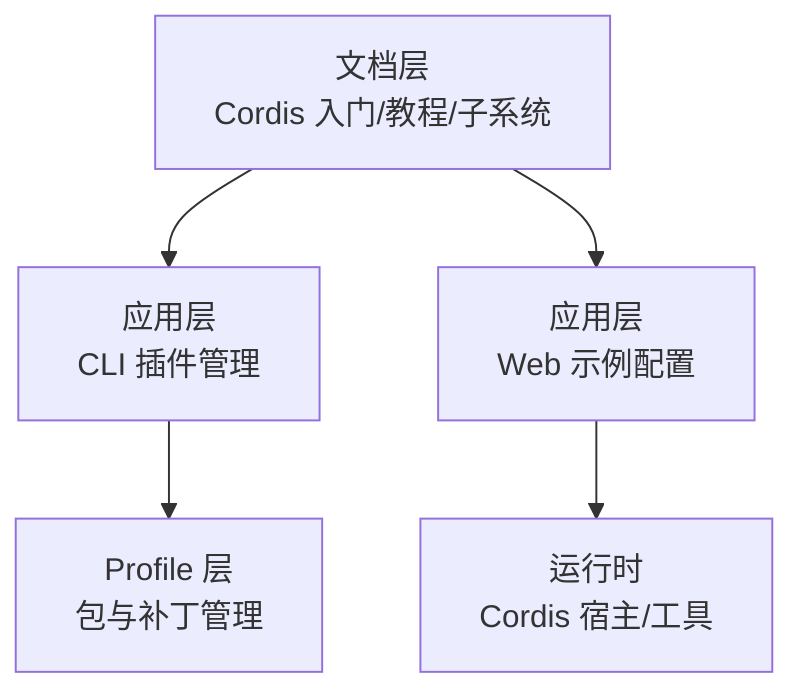
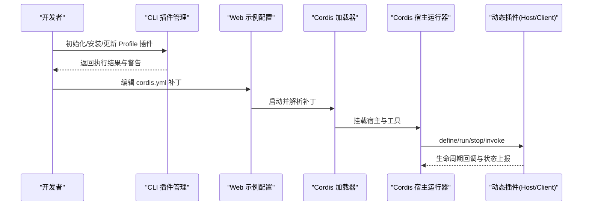
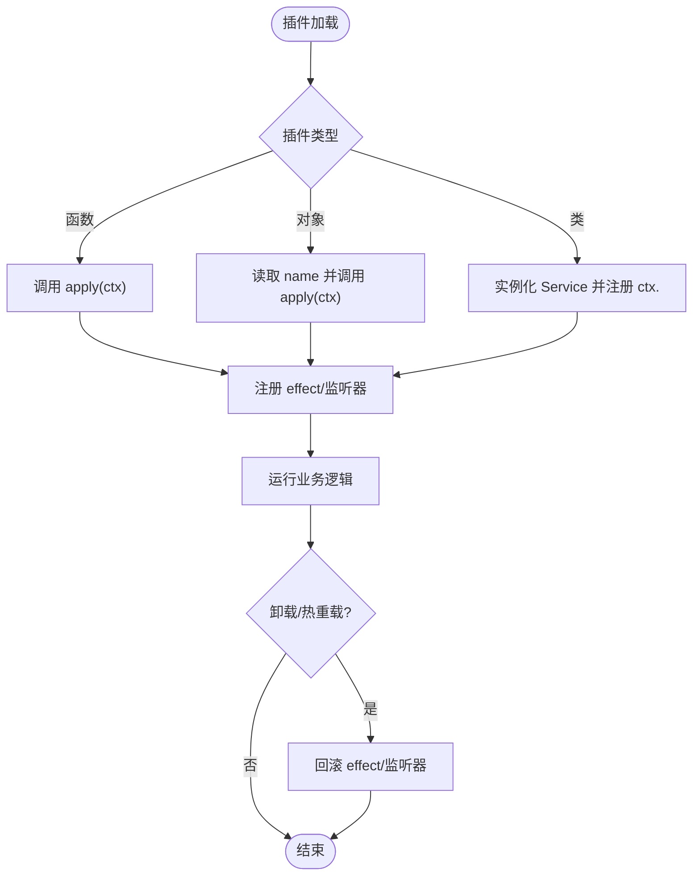
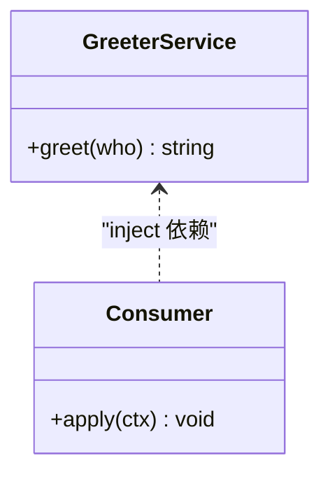
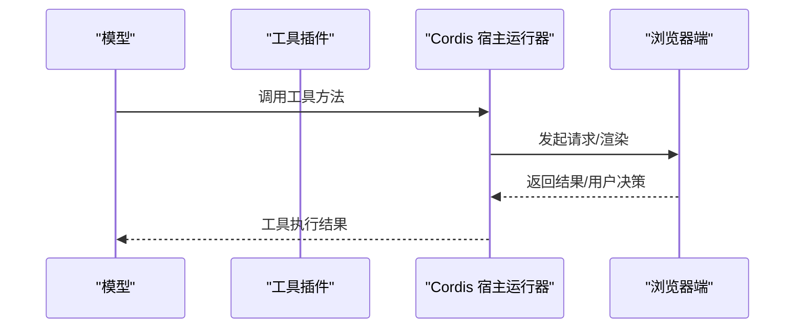
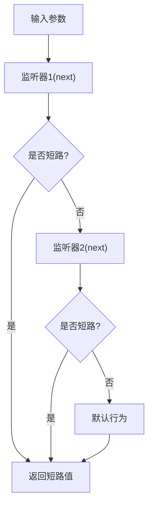
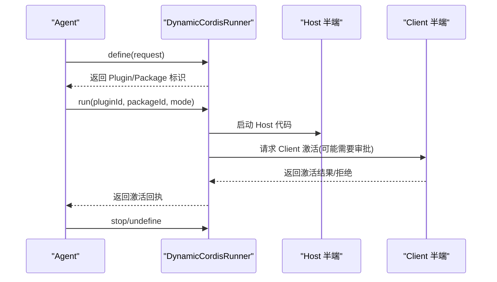
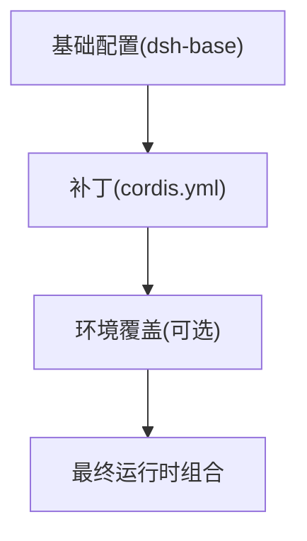
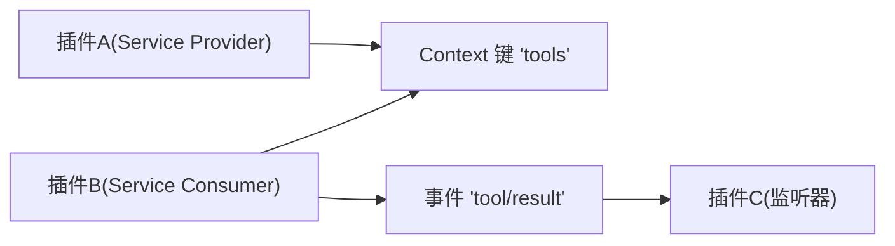

# 插件开发

<cite>
**本文引用的文件**
- [Cordis 入门](file://docs/cordis-primer.md)
- [Cordis 教程索引](file://docs/cordis-tutorial/index.md)
- [教程 1：第一个插件](file://docs/cordis-tutorial/01-first-plugin.md)
- [教程 3：服务](file://docs/cordis-tutorial/03-services.md)
- [教程 4：事件](file://docs/cordis-tutorial/04-events.md)
- [扩展子系统](file://docs/subsystems/extensions.md)
- [CLI 插件管理](file://apps/cli/src/plugin.ts)
- [Web Cordis 示例配置](file://examples/web-cordis/cordis.yml)
</cite>

## 目录
1. [简介](#简介)
2. [项目结构](#项目结构)
3. [核心组件](#核心组件)
4. [架构总览](#架构总览)
5. [详细组件分析](#详细组件分析)
6. [依赖分析](#依赖分析)
7. [性能考虑](#性能考虑)
8. [故障排查指南](#故障排查指南)
9. [结论](#结论)
10. [附录](#附录)

## 简介
本指南面向基于 Cordis 框架的插件开发者，系统讲解插件架构、生命周期钩子与扩展点，覆盖服务插件、工具插件与 UI 插件的开发方式；并给出打包发布、版本管理、模板与脚手架、调试测试、依赖管理与冲突解决、安全与权限控制以及实战案例与最佳实践。内容以仓库中的 Cordis 教程、扩展子系统文档和 CLI 插件管理实现为依据，帮助读者从零到一完成可维护、可演进的插件生态建设。

## 项目结构
- 文档层：包含 Cordis 入门、教程（按章节逐步上手）、子系统说明（如扩展子系统）等，是理解插件机制与能力的权威来源。
- 应用层：CLI 提供插件管理命令与 Profile 层管理；Web 端通过示例配置接入动态 Cordis 宿主运行器与工具能力。
- 示例层：展示如何在 Web 环境中以补丁叠加的方式启用 Cordis 宿主与工具，便于快速验证。

**章节来源**
- [Cordis 教程索引:1-61](file://docs/cordis-tutorial/index.md#L1-L61)
- [扩展子系统:1-365](file://docs/subsystems/extensions.md#L1-L365)
- [CLI 插件管理:1-159](file://apps/cli/src/plugin.ts#L1-L159)
- [Web Cordis 示例配置:1-20](file://examples/web-cordis/cordis.yml#L1-L20)

## 核心组件
- 上下文与插件：插件以函数、对象或 Service 子类形式存在，通过 Context 注册能力与监听事件。
- 服务与依赖：服务以稳定键名暴露于 Context，插件通过 inject 声明依赖，由框架保证加载顺序与可用性。
- 事件系统：支持 emit、parallel、serial、bail、waterfall 多种分发模式，用于广播、转换与短路决策。
- 动态插件与宿主：扩展子系统提供动态定义、运行、停止、撤销与检查能力，支持 Host/Client 双端协作。
- 配置与组合：通过 cordis.yml 描述插件树与配置，支持补丁叠加与环境切换。

**章节来源**
- [Cordis 入门:7-45](file://docs/cordis-primer.md#L7-L45)
- [教程 1：第一个插件:1-96](file://docs/cordis-tutorial/01-first-plugin.md#L1-L96)
- [教程 3：服务:1-99](file://docs/cordis-tutorial/03-services.md#L1-L99)
- [教程 4：事件:1-145](file://docs/cordis-tutorial/04-events.md#L1-L145)
- [扩展子系统:15-365](file://docs/subsystems/extensions.md#L15-L365)

## 架构总览
下图展示了从 CLI 到运行时、再到动态插件宿主的整体流程：CLI 负责 Profile 与包管理；Web 示例通过补丁叠加启用 Cordis 宿主与工具；运行时通过 Context 挂载服务、事件与动态插件。

**图表来源**
- [CLI 插件管理:120-159](file://apps/cli/src/plugin.ts#L120-L159)
- [Web Cordis 示例配置:9-20](file://examples/web-cordis/cordis.yml#L9-L20)
- [扩展子系统:67-257](file://docs/subsystems/extensions.md#L67-L257)

**章节来源**
- [CLI 插件管理:1-159](file://apps/cli/src/plugin.ts#L1-L159)
- [Web Cordis 示例配置:1-20](file://examples/web-cordis/cordis.yml#L1-L20)
- [扩展子系统:67-257](file://docs/subsystems/extensions.md#L67-L257)

## 详细组件分析

### 插件类型与生命周期
- 函数插件：最简形式，导出 apply(ctx) 进行注册。
- 对象插件：导出 name 与 apply。
- 类插件：继承 Service，在构造函数中注册服务键名。
- 生命周期：插件卸载时，所有 effect 注册（监听器、副作用）自动回滚，避免悬挂资源。

**图表来源**
- [教程 1：第一个插件:53-77](file://docs/cordis-tutorial/01-first-plugin.md#L53-L77)
- [教程 3：服务:37-43](file://docs/cordis-tutorial/03-services.md#L37-L43)
- [Cordis 入门:13-14](file://docs/cordis-primer.md#L13-L14)

**章节来源**
- [教程 1：第一个插件:1-96](file://docs/cordis-tutorial/01-first-plugin.md#L1-L96)
- [教程 3：服务:1-99](file://docs/cordis-tutorial/03-services.md#L1-L99)
- [Cordis 入门:7-45](file://docs/cordis-primer.md#L7-L45)

### 服务插件（Service Plugin）
- 提供服务：通过 Service 子类将能力挂载到 Context 的稳定键上，其他插件通过 inject 声明依赖。
- 消费服务：使用 ctx.get 可选获取，或使用 inject 强依赖确保可用。
- 命名空间：服务名全局唯一，建议前缀区分。

**图表来源**
- [教程 3：服务:20-43](file://docs/cordis-tutorial/03-services.md#L20-L43)
- [教程 3：服务:44-79](file://docs/cordis-tutorial/03-services.md#L44-L79)

**章节来源**
- [教程 3：服务:1-99](file://docs/cordis-tutorial/03-services.md#L1-L99)

### 工具插件（Tool Plugin）
- 工具作为服务的一种特化能力，通常通过事件或专用服务暴露给模型调用。
- 可通过扩展子系统的动态宿主运行器将工具代码注入到宿主侧，并在浏览器端配合 Client 代码完成交互。
- 示例中通过补丁叠加启用 cordis-host-runner 与 tool-cordis，使 Web 环境具备动态工具能力。

**图表来源**
- [扩展子系统:67-257](file://docs/subsystems/extensions.md#L67-L257)
- [Web Cordis 示例配置:15-20](file://examples/web-cordis/cordis.yml#L15-L20)

**章节来源**
- [扩展子系统:15-365](file://docs/subsystems/extensions.md#L15-L365)
- [Web Cordis 示例配置:1-20](file://examples/web-cordis/cordis.yml#L1-L20)

### UI 插件（UI Plugin）
- UI 插件通常通过事件与宿主提供的插槽/面板进行集成，借助动态宿主运行器的 Client 端能力在浏览器中渲染。
- 通过 inspect 与清单同步，可在宿主与客户端之间共享元数据，便于调试与可视化。

**图表来源**
- [扩展子系统:17-65](file://docs/subsystems/extensions.md#L17-L65)
- [扩展子系统:163-178](file://docs/subsystems/extensions.md#L163-L178)

**章节来源**
- [扩展子系统:15-365](file://docs/subsystems/extensions.md#L15-L365)

### 事件系统与 Waterfall 拦截
- 事件模式：emit（广播）、parallel（并行）、serial（串行）、bail（同步短路）、waterfall（中间件式）。
- Waterfall 用于拦截与改写：监听器可选择调用 next() 传递结果，或直接返回以短路后续处理。

**图表来源**
- [教程 4：事件:80-141](file://docs/cordis-tutorial/04-events.md#L80-L141)
- [Cordis 入门:15-35](file://docs/cordis-primer.md#L15-L35)

**章节来源**
- [教程 4：事件:1-145](file://docs/cordis-tutorial/04-events.md#L1-L145)
- [Cordis 入门:15-35](file://docs/cordis-primer.md#L15-L35)

### 动态插件与宿主生命周期
- 定义与运行：define 创建或追加 Package；run 启动或切换版本；stop 停止运行但保留版本；undefine 移除插件及其运行。
- 授权与审批：某些激活需要用户批准，支持“批准未来版本”策略。
- 检查与快照：inventory/snapshot/inspect 提供无源码元数据与精确包信息，便于诊断。

**图表来源**
- [扩展子系统:67-257](file://docs/subsystems/extensions.md#L67-L257)

**章节来源**
- [扩展子系统:67-257](file://docs/subsystems/extensions.md#L67-L257)

### 配置与组合（cordis.yml）
- 插件树：通过 name 指定模块或 npm 包，条目并发加载，顺序由依赖决定而非文件位置。
- 补丁叠加：Web 示例使用 id 定位目标行并以 insert/patch 方式叠加，便于多环境切换。
- 配置插值：Loader 支持对 config 与 disabled 字段进行表达式插值与延迟求值。

**图表来源**
- [Web Cordis 示例配置:1-20](file://examples/web-cordis/cordis.yml#L1-L20)
- [Cordis 入门:36-39](file://docs/cordis-primer.md#L36-L39)

**章节来源**
- [教程 1：第一个插件:23-51](file://docs/cordis-tutorial/01-first-plugin.md#L23-L51)
- [Web Cordis 示例配置:1-20](file://examples/web-cordis/cordis.yml#L1-L20)
- [Cordis 入门:36-39](file://docs/cordis-primer.md#L36-L39)

## 依赖分析
- 插件间耦合：通过服务键与事件名解耦，避免直接导入具体实现。
- 依赖追踪：inject 不仅影响启动顺序，还在运行时服务消失时触发依赖链卸载与重加载。
- 外部依赖：CLI 通过 pnpm 管理 Profile 层的包与补丁，检测 dsh.bundle 声明决定是否加入层栈。

**图表来源**
- [教程 3：服务:44-79](file://docs/cordis-tutorial/03-services.md#L44-L79)
- [CLI 插件管理:30-91](file://apps/cli/src/plugin.ts#L30-L91)

**章节来源**
- [教程 3：服务:44-79](file://docs/cordis-tutorial/03-services.md#L44-L79)
- [CLI 插件管理:30-91](file://apps/cli/src/plugin.ts#L30-L91)

## 性能考虑
- 并发与等待：parallel 适合独立任务并行；serial/bail 适合有序决策；emit 仅广播不阻塞。
- 短路与中间件：Waterfall 应谨慎短路，仅在拥有决策权时使用；观察型监听器必须调用 next()。
- 资源释放：所有注册需有 disposer，避免内存泄漏与悬挂定时器/监听器。

[本节为通用指导，无需特定文件引用]

## 故障排查指南
- 插件未加载：检查 cordis.yml 中 name 拼写与路径解析；若模块无法解析，会通过日志服务报告而非崩溃。
- 依赖缺失：若 inject 的服务不可用，插件会保持 PENDING；确认提供者已加载且名称一致。
- CLI 错误：pnpm 未找到或构建脚本被阻止时，CLI 会输出明确提示与修复建议。

**章节来源**
- [教程 1：第一个插件:79-92](file://docs/cordis-tutorial/01-first-plugin.md#L79-L92)
- [教程 3：服务:72-79](file://docs/cordis-tutorial/03-services.md#L72-L79)
- [CLI 插件管理:127-156](file://apps/cli/src/plugin.ts#L127-L156)

## 结论
基于 Cordis 的插件体系以 Context 为中心，通过服务与事件实现松耦合扩展；动态宿主运行器让插件具备版本化、可审批、可检查的生命周期管理能力；CLI 与补丁叠加使得部署与组合灵活可控。遵循依赖声明、事件契约与资源释放规范，可构建高内聚、低耦合、易演进的插件生态。

[本节为总结性内容，无需特定文件引用]

## 附录

### 插件开发模板与脚手架
- 最小模板：参考教程 1 的 hello.ts 与 cordis.yml，快速搭建函数插件。
- 服务模板：参考教程 3 的 Service 子类与 inject 用法，声明与消费服务。
- 事件模板：参考教程 4 的 Events 合并与 waterfall 示例，实现拦截与转换。
- 动态插件：参考扩展子系统 API，使用 define/run/stop/inspect 管理动态插件。

**章节来源**
- [教程 1：第一个插件:7-51](file://docs/cordis-tutorial/01-first-plugin.md#L7-L51)
- [教程 3：服务:7-43](file://docs/cordis-tutorial/03-services.md#L7-L43)
- [教程 4：事件:7-79](file://docs/cordis-tutorial/04-events.md#L7-L79)
- [扩展子系统:67-257](file://docs/subsystems/extensions.md#L67-L257)

### 打包、发布与版本管理
- 包声明：通过 dsh.bundle 标记 Profile 插件，CLI 自动将其纳入层栈。
- 版本切换：动态插件支持 run(mode=current|switch) 切换版本；approveFutureVersions 可一次性批准后续版本。
- 清单与快照：inventory/snapshot/inspect 提供无源码元数据，便于审计与回滚。

**章节来源**
- [CLI 插件管理:30-91](file://apps/cli/src/plugin.ts#L30-L91)
- [扩展子系统:97-153](file://docs/subsystems/extensions.md#L97-L153)
- [扩展子系统:180-223](file://docs/subsystems/extensions.md#L180-L223)

### 调试与测试方法
- 本地调试：使用教程中的 node --import tsx 启动器，结合 cordis.yml 快速迭代。
- 运行时诊断：利用 inspect 与 snapshot 查看插件状态与失败原因。
- 端到端：Web 示例提供补丁叠加方式，便于在真实环境中验证工具与 UI 插件。

**章节来源**
- [Cordis 教程索引:13-46](file://docs/cordis-tutorial/index.md#L13-L46)
- [扩展子系统:180-257](file://docs/subsystems/extensions.md#L180-L257)
- [Web Cordis 示例配置:1-20](file://examples/web-cordis/cordis.yml#L1-L20)

### 依赖管理与冲突解决
- 依赖声明：优先使用 inject 声明硬依赖，避免隐式耦合。
- 冲突解决：服务名全局唯一，必要时使用前缀；通过补丁覆盖替换实现（如 shell 提供商）。
- 层栈管理：CLI 根据实际安装状态 reconcile bundles，新增/移除依赖自动生效。

**章节来源**
- [教程 3：服务:74-79](file://docs/cordis-tutorial/03-services.md#L74-L79)
- [CLI 插件管理:47-91](file://apps/cli/src/plugin.ts#L47-L91)

### 安全与权限控制
- 审批机制：动态插件激活可能需用户批准，支持“批准未来版本”。
- 沙箱与守卫：Client 端激活受守卫限制，失败会上报；Host 端通过 inspect 限制敏感操作。
- 最小权限：仅暴露必要方法与事件，避免泄露内部状态。

**章节来源**
- [扩展子系统:97-153](file://docs/subsystems/extensions.md#L97-L153)
- [扩展子系统:224-257](file://docs/subsystems/extensions.md#L224-L257)

### 实战案例与最佳实践
- 案例：在 Web 环境中通过补丁叠加启用 cordis-host-runner 与 tool-cordis，实现动态工具与 UI 插件。
- 最佳实践：
  - 用事件表达横切关注点，用服务暴露业务能力。
  - 所有注册必须有 disposer，避免资源泄漏。
  - 使用 watermark/short-circuit 明确决策边界，记录日志并委托下游。
  - 通过补丁与覆盖实现环境差异化部署。

**章节来源**
- [Web Cordis 示例配置:1-20](file://examples/web-cordis/cordis.yml#L1-L20)
- [Cordis 入门:40-45](file://docs/cordis-primer.md#L40-L45)
- [教程 4：事件:94-141](file://docs/cordis-tutorial/04-events.md#L94-L141)