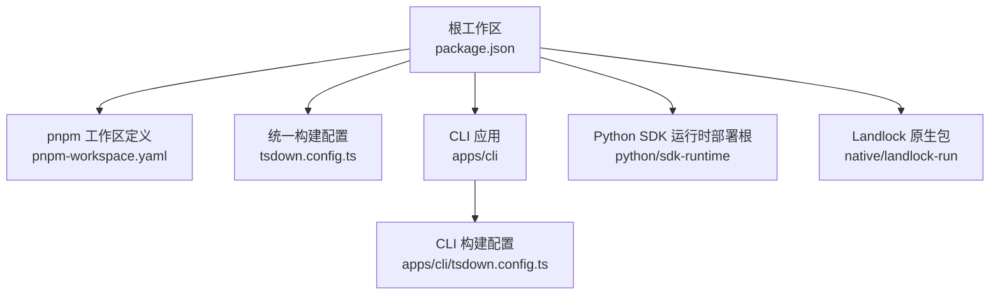
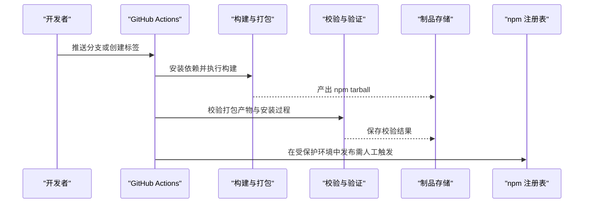
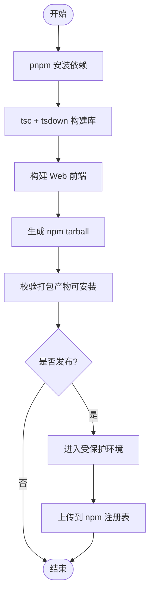
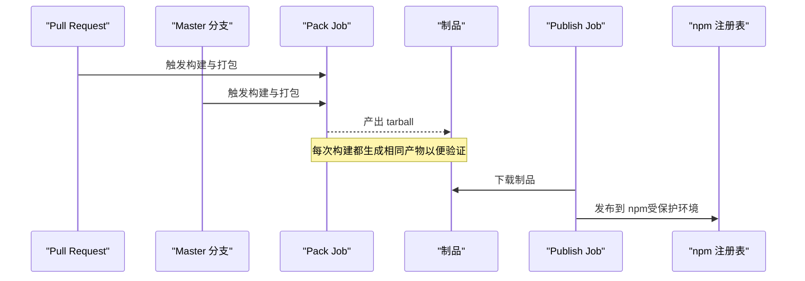
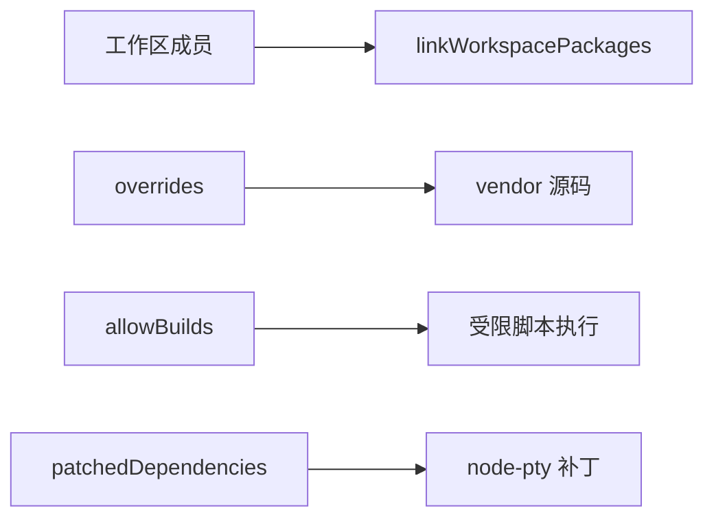
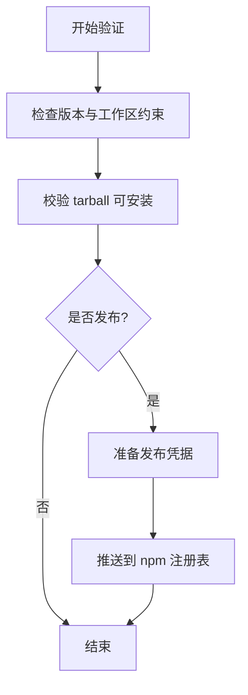
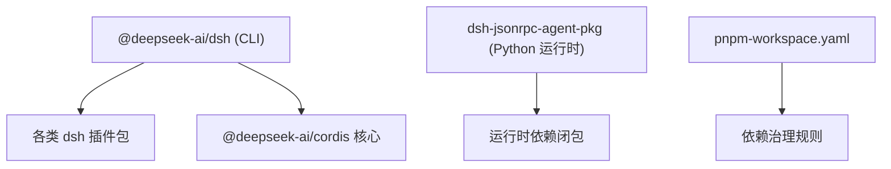

# 插件打包与发布

<cite>
**本文引用的文件**
- [package.json](file://package.json)
- [pnpm-workspace.yaml](file://pnpm-workspace.yaml)
- [tsdown.config.ts](file://tsdown.config.ts)
- [apps/cli/package.json](file://apps/cli/package.json)
- [apps/cli/tsdown.config.ts](file://apps/cli/tsdown.config.ts)
- [.github/workflows/release.yml](file://.github/workflows/release.yml)
- [native/landlock-run/package.json](file://native/landlock-run/package.json)
- [python/sdk-runtime/package.json](file://python/sdk-runtime/package.json)
</cite>

## 目录
1. [简介](#简介)
2. [项目结构](#项目结构)
3. [核心组件](#核心组件)
4. [架构总览](#架构总览)
5. [详细组件分析](#详细组件分析)
6. [依赖关系分析](#依赖关系分析)
7. [性能考虑](#性能考虑)
8. [故障排查指南](#故障排查指南)
9. [结论](#结论)
10. [附录](#附录)

## 简介
本文件面向在 Monorepo 环境下开发、打包、版本管理与发布的插件作者与维护者，系统化说明：
- 插件如何被构建、打包与发布到 npm
- Monorepo 中的包管理策略与依赖解析规则
- 构建脚本配置与优化选项
- 版本规范、签名验证与自动化发布流程
- 配置文件、资源与二进制文件的处理方式
- 插件分发最佳实践与安全注意事项

## 项目结构
仓库采用 pnpm workspace 组织多个子包与应用程序。根工作区定义了所有参与构建与发布的成员范围，并通过统一的 tsdown 工具进行多包构建；CLI 应用作为产品入口，提供 dsh 命令并聚合大量插件能力。

**图示来源**
- [package.json:1-18](file://package.json#L1-L18)
- [pnpm-workspace.yaml:1-22](file://pnpm-workspace.yaml#L1-L22)
- [tsdown.config.ts:16-29](file://tsdown.config.ts#L16-L29)
- [apps/cli/tsdown.config.ts:1-19](file://apps/cli/tsdown.config.ts#L1-L19)

**章节来源**
- [package.json:1-18](file://package.json#L1-L18)
- [pnpm-workspace.yaml:1-22](file://pnpm-workspace.yaml#L1-L22)

## 核心组件
- 工作区与包清单：通过 pnpm-workspace.yaml 声明所有参与安装与构建的包路径，确保依赖解析一致且可重复。
- 统一构建器：使用 tsdown 对 vendor/* 与 packages/*/* 以及 apps/cli 进行批量构建，输出 ESM 产物至 lib 目录。
- CLI 应用：apps/cli 暴露 dsh 命令，聚合众多插件能力，其自身也通过 tsdown 单独构建入口。
- Python 运行时部署根：python/sdk-runtime 仅作为依赖清单，用于生成可执行与 Python 运行时的闭包。
- Landlock 原生包：native/landlock-run 提供平台相关的原生能力，具备独立的构建与发布脚本。

**章节来源**
- [pnpm-workspace.yaml:1-22](file://pnpm-workspace.yaml#L1-L22)
- [tsdown.config.ts:16-29](file://tsdown.config.ts#L16-L29)
- [apps/cli/package.json:1-20](file://apps/cli/package.json#L1-L20)
- [python/sdk-runtime/package.json:1-118](file://python/sdk-runtime/package.json#L1-L118)
- [native/landlock-run/package.json:1-32](file://native/landlock-run/package.json#L1-L32)

## 架构总览
下图展示了从代码到 npm 包的完整流水线：工作区安装与构建、打包产物校验、上传制品、受保护环境下的发布。

**图示来源**
- [.github/workflows/release.yml:36-108](file://.github/workflows/release.yml#L36-L108)
- [.github/workflows/release.yml:109-150](file://.github/workflows/release.yml#L109-L150)

## 详细组件分析

### 构建系统与脚本
- 根构建脚本：
  - build:lib 调用 tsc 与 tsdown 完成宿主与客户端面构建
  - build:web 调用前端构建
  - 提供大量 verify/publish 相关脚本，如 release:verify、release:pack、release:publish
- tsdown 配置：
  - 工作区范围包含 vendor/*、packages/*/*、apps/cli
  - 输出格式为 ESM，目标平台 Node，目标版本 es2024
  - 支持 client/host 两种构建面，通过环境变量切换
- CLI 构建：
  - 单独覆盖 entry 指向 bin 入口，将可达模块一并打包

**图示来源**
- [package.json:19-142](file://package.json#L19-L142)
- [tsdown.config.ts:16-29](file://tsdown.config.ts#L16-L29)
- [apps/cli/tsdown.config.ts:1-19](file://apps/cli/tsdown.config.ts#L1-L19)

**章节来源**
- [package.json:19-142](file://package.json#L19-L142)
- [tsdown.config.ts:16-29](file://tsdown.config.ts#L16-L29)
- [apps/cli/tsdown.config.ts:1-19](file://apps/cli/tsdown.config.ts#L1-L19)

### 版本管理与发布流程
- 版本来源：根 package.json 与 apps/cli 各自维护版本号，工作区通过 workspace:* 关联内部依赖。
- 发布流水线：
  - pack 阶段：在所有 PR 与 master 推送上执行，生成 npm tarball 并上传为制品
  - publish 阶段：仅在带特定标签的 workflow_dispatch 中触发，读取已生成的制品并推送到 npm
- 安全控制：
  - 发布步骤运行在受保护环境，需要审批与环境变量（如 NPM_TOKEN）
  - 只允许从指定制品目录发布，避免二次构建引入不可控因�

**图示来源**
- [.github/workflows/release.yml:36-108](file://.github/workflows/release.yml#L36-L108)
- [.github/workflows/release.yml:109-150](file://.github/workflows/release.yml#L109-L150)

**章节来源**
- [package.json:1-10](file://package.json#L1-L10)
- [apps/cli/package.json:1-20](file://apps/cli/package.json#L1-L20)
- [.github/workflows/release.yml:36-150](file://.github/workflows/release.yml#L36-L150)

### Monorepo 包管理策略与依赖处理
- 工作区成员：
  - vendor/*、packages/*/*、native/landlock-run、apps/*、website、examples、python/sdk-runtime
- 依赖解析：
  - linkWorkspacePackages: true 保证本地构建时优先解析工作区源
  - overrides 将特定包名映射到 vendor 源码，保持上游 semver 范围同时锁定本地实现
  - allowBuilds 严格限制允许执行安装/构建脚本的包，降低供应链风险
  - patchedDependencies 对关键依赖进行补丁修复
- 示例：node-pty 通过 patches 目录进行补丁，确保跨平台行为一致

**图示来源**
- [pnpm-workspace.yaml:1-73](file://pnpm-workspace.yaml#L1-L73)

**章节来源**
- [pnpm-workspace.yaml:1-73](file://pnpm-workspace.yaml#L1-L73)

### 插件配置、资源与二进制文件
- 配置文件：
  - CLI 包通过 files 字段声明纳入包的内容，例如 lib/*.js 与 config 目录
  - 插件可通过 cordis.yml 等配置文件描述能力与依赖
- 资源文件：
  - 前端资源由 web 构建流程产出，CLI 产物不包含前端静态资源
- 二进制文件：
  - native/landlock-run 提供原生能力，拥有独立构建与发布脚本
  - Python SDK 运行时通过 python/sdk-runtime 声明依赖闭包，配合脚本生成可执行

**章节来源**
- [apps/cli/package.json:14-20](file://apps/cli/package.json#L14-L20)
- [native/landlock-run/package.json:8-23](file://native/landlock-run/package.json#L8-L23)
- [python/sdk-runtime/package.json:1-118](file://python/sdk-runtime/package.json#L1-L118)

### 签名、验证与部署自动化
- 构建与打包：
  - 使用 tsdown 统一构建，输出 ESM 产物
  - 通过 release:pack 生成 npm tarball，并上传为 GitHub Actions 制品
- 验证：
  - release:verify 检查版本与工作区约束
  - release:verify-packed-install 验证打包产物可安装与运行
- 部署：
  - release:publish 在受保护环境中将制品发布到 npm
  - 发布步骤仅接受来自 dist/npm 的制品，避免二次构建

**图示来源**
- [.github/workflows/release.yml:72-108](file://.github/workflows/release.yml#L72-L108)
- [.github/workflows/release.yml:141-150](file://.github/workflows/release.yml#L141-L150)

**章节来源**
- [.github/workflows/release.yml:72-150](file://.github/workflows/release.yml#L72-L150)

## 依赖关系分析
- 工作区依赖：
  - apps/cli 依赖大量 @deepseek-ai/dsh-* 与 @deepseek-ai/cordis-* 插件包，体现“插件即包”的组织方式
  - python/sdk-runtime 声明了完整的运行时依赖闭包，用于生成可执行与 Python 运行时
- 外部依赖治理：
  - 通过 allowBuilds 与 patchedDependencies 严格控制第三方脚本与二进制行为
  - overrides 将框架包指向 vendor 源码，便于本地开发与一致性

**图示来源**
- [apps/cli/package.json:22-84](file://apps/cli/package.json#L22-L84)
- [python/sdk-runtime/package.json:7-116](file://python/sdk-runtime/package.json#L7-L116)
- [pnpm-workspace.yaml:27-73](file://pnpm-workspace.yaml#L27-L73)

**章节来源**
- [apps/cli/package.json:22-84](file://apps/cli/package.json#L22-L84)
- [python/sdk-runtime/package.json:7-116](file://python/sdk-runtime/package.json#L7-L116)
- [pnpm-workspace.yaml:27-73](file://pnpm-workspace.yaml#L27-L73)

## 性能考虑
- 构建并行化：
  - tsdown 支持工作区批量构建，减少重复编译开销
  - 通过固定 target 与 format 提升构建稳定性
- 缓存与增量：
  - pnpm store 缓存依赖，加速安装
  - 构建产物输出到 lib 目录，便于增量更新
- 产物体积：
  - ESM 格式与按需打包可减少冗余
  - 前端资源与后端逻辑分离，避免不必要的捆绑

[本节为通用指导，不直接分析具体文件]

## 故障排查指南
- 安装失败：
  - 检查 allowBuilds 列表是否包含必要的原生构建脚本
  - 确认 patchedDependencies 是否正确应用
- 构建失败：
  - 确认 DSH_BUILD_FACE 环境变量设置正确
  - 检查 tsdown 工作区范围是否包含目标包
- 发布失败：
  - 确认已在受保护环境并设置了 NPM_TOKEN
  - 验证制品目录是否为 dist/npm，避免误发未校验产物

**章节来源**
- [pnpm-workspace.yaml:35-73](file://pnpm-workspace.yaml#L35-L73)
- [tsdown.config.ts:4-8](file://tsdown.config.ts#L4-L8)
- [.github/workflows/release.yml:141-150](file://.github/workflows/release.yml#L141-L150)

## 结论
该仓库通过 pnpm workspace 与 tsdown 实现了统一的插件构建与发布体系。Monorepo 内的依赖治理严格而灵活，既能保证本地开发的一致性，又能支撑安全的自动化发布。遵循本文的流程与最佳实践，可以高效地打包、验证并发布插件，同时保障安全性与可维护性。

## 附录
- 常用命令参考：
  - 构建：pnpm run build
  - 校验：pnpm run release:verify
  - 打包：pnpm run release:pack
  - 发布：pnpm run release:publish
- 工作区成员范围与构建目标见 pnpm-workspace.yaml 与 tsdown.config.ts
- CLI 入口与文件清单见 apps/cli/package.json

[本节为补充信息，不直接分析具体文件]