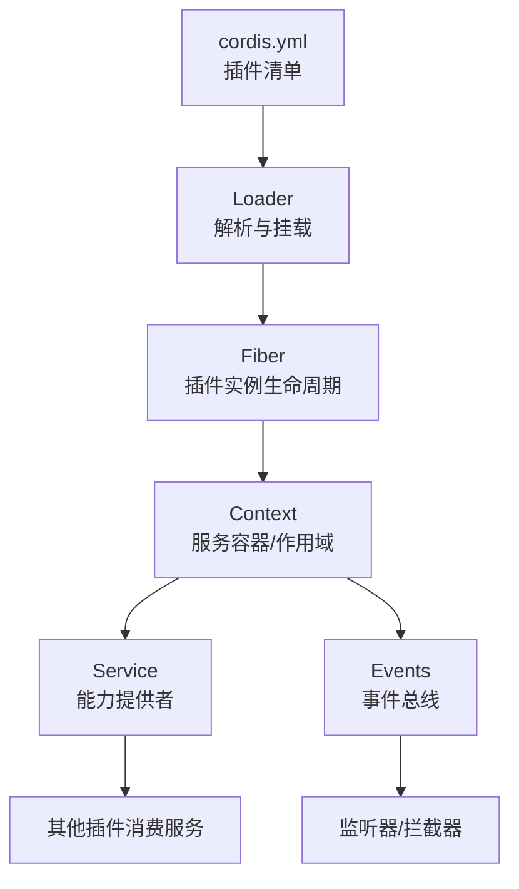
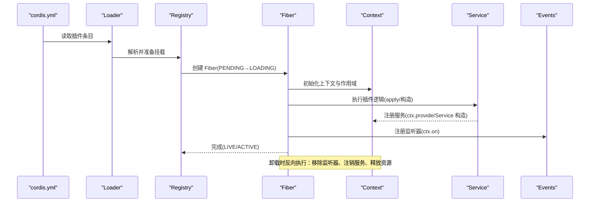
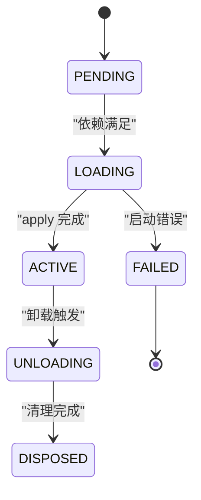
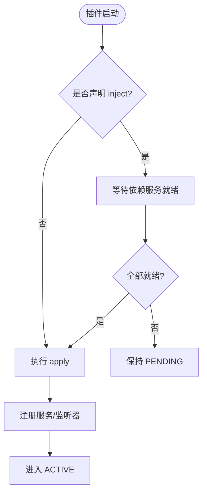
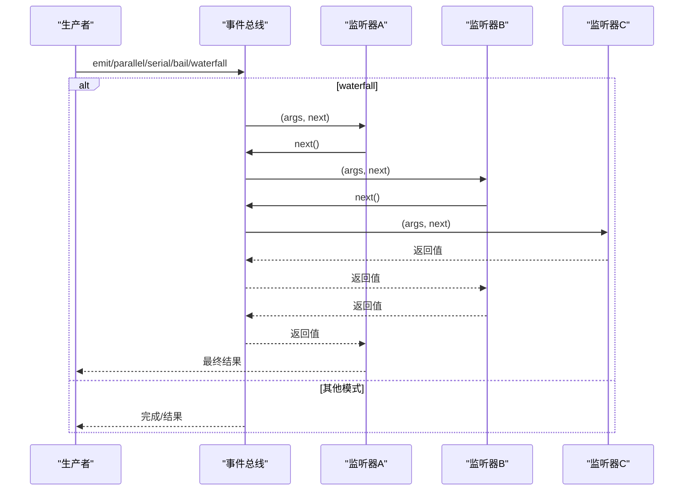
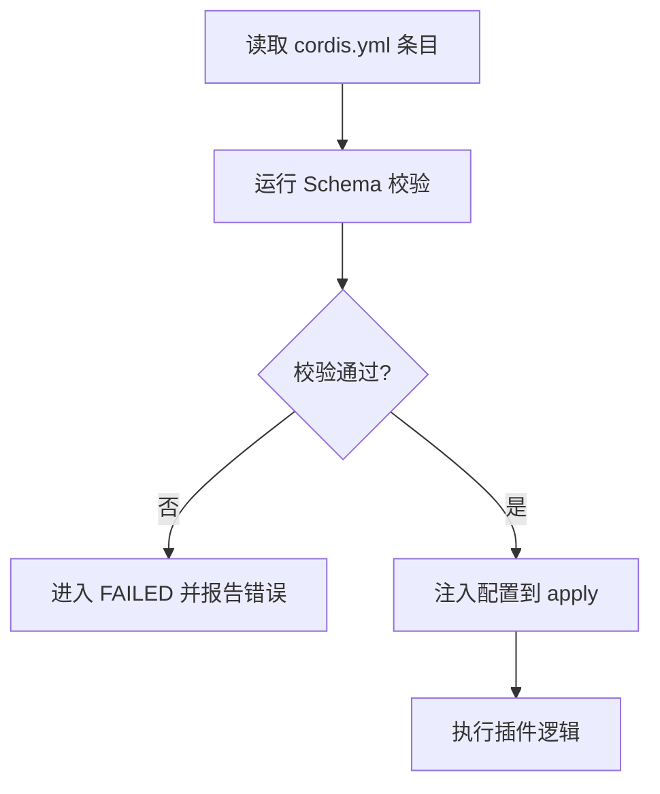
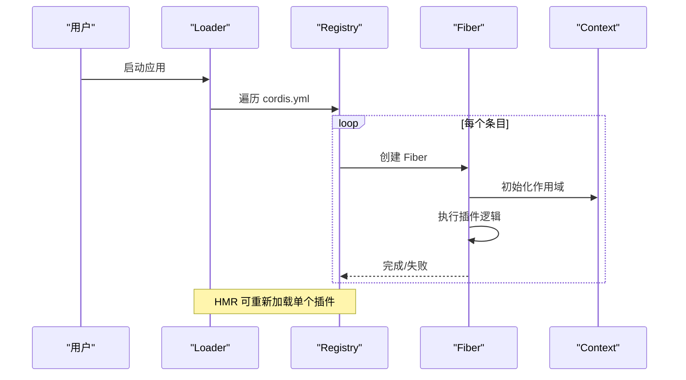
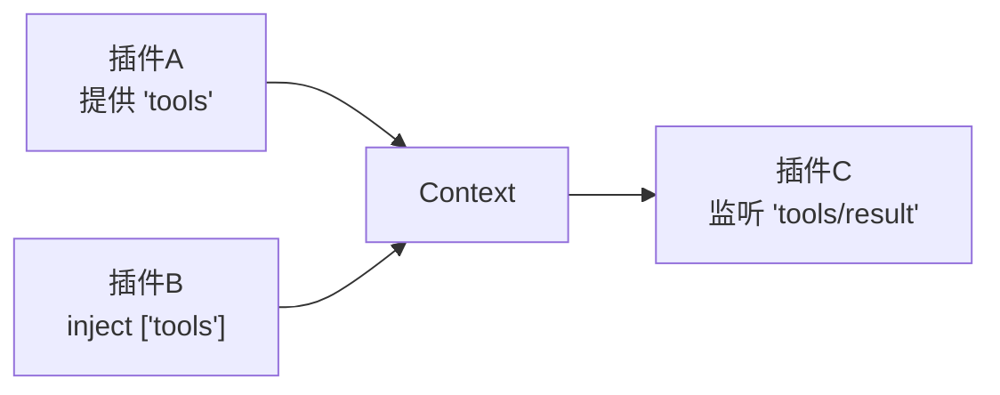

# 插件架构基础

<cite>
**本文引用的文件**
- [Cordis 入门](file://docs/cordis-primer.md)
- [教程：第一个插件](file://docs/cordis-tutorial/01-first-plugin.md)
- [教程：生命周期与效果](file://docs/cordis-tutorial/02-lifecycle-and-effects.md)
- [教程：服务](file://docs/cordis-tutorial/03-services.md)
- [教程：事件](file://docs/cordis-tutorial/04-events.md)
- [教程：配置](file://docs/cordis-tutorial/05-config.md)
- [教程：组合与热重载](file://docs/cordis-tutorial/06-composition-and-hmr.md)
- [教程：进入 Harness](file://docs/cordis-tutorial/07-into-the-harness.md)
- [API：Context](file://docs/cordis-api/context.md)
- [API：Service](file://docs/cordis-api/service.md)
- [API：Events](file://docs/cordis-api/events.md)
- [API：Registry](file://docs/cordis-api/registry.md)
- [示例：无头代理组合](file://examples/headless-agent/cordis.yml)
- [示例：CLI Agent 预设组合](file://apps/cli/config/agent-presets/cordis/agent.cordis.yml)
</cite>

## 目录
1. [简介](#简介)
2. [项目结构](#项目结构)
3. [核心组件](#核心组件)
4. [架构总览](#架构总览)
5. [详细组件分析](#详细组件分析)
6. [依赖关系分析](#依赖关系分析)
7. [性能考量](#性能考量)
8. [故障排查指南](#故障排查指南)
9. [结论](#结论)
10. [附录](#附录)

## 简介
本文件系统性介绍基于 Cordis 框架的插件架构基础，覆盖插件生命周期、扩展点机制、依赖注入系统、注册发现与加载流程、插件间通信机制，以及 Service、Context、Config 等核心概念。同时给出设计原则与最佳实践，并通过实际示例展示插件基本结构与生命周期钩子的使用方式。

## 项目结构
Cordis 插件体系由“配置即应用”的组合模型驱动：通过 cordis.yml 声明式地挂载插件，插件之间通过 Context 暴露的服务名进行解耦协作，事件用于松耦合通信，配置在启动前校验并注入到插件。

图表来源
- [教程：第一个插件:23-51](file://docs/cordis-tutorial/01-first-plugin.md#L23-L51)
- [教程：生命周期与效果:68-80](file://docs/cordis-tutorial/02-lifecycle-and-effects.md#L68-L80)
- [教程：服务:44-79](file://docs/cordis-tutorial/03-services.md#L44-L79)
- [教程：事件:80-141](file://docs/cordis-tutorial/04-events.md#L80-L141)
- [API：Context:8-162](file://docs/cordis-api/context.md#L8-L162)
- [API：Registry:35-56](file://docs/cordis-api/registry.md#L35-L56)

章节来源
- [教程：第一个插件:23-51](file://docs/cordis-tutorial/01-first-plugin.md#L23-L51)
- [教程：生命周期与效果:68-80](file://docs/cordis-tutorial/02-lifecycle-and-effects.md#L68-L80)
- [教程：服务:44-79](file://docs/cordis-tutorial/03-services.md#L44-L79)
- [教程：事件:80-141](file://docs/cordis-tutorial/04-events.md#L80-L141)
- [API：Context:8-162](file://docs/cordis-api/context.md#L8-L162)
- [API：Registry:35-56](file://docs/cordis-api/registry.md#L35-L56)

## 核心组件
- 插件（Plugin）
  - 三种形态：函数、对象（含 apply）、类（继承 Service）。
  - 通过 name 标识，可选 Config 做运行时校验，inject 声明依赖，provide 声明提供能力。
- 上下文（Context）
  - 服务容器与作用域；支持 extend/isolate/intercept 创建子作用域；提供 get/provide/accessor/mixin 等反射能力。
- 服务（Service）
  - 以名称注册到 Context，被其他插件通过 inject 或 ctx.get 消费；卸载时自动移除。
- 事件（Events）
  - 通过 ctx.emit/parallel/serial/bail/waterfall 分发；监听器通过 ctx.on 注册，随插件卸载自动清理。
- 配置（Config）
  - 每个插件可导出 Schema 并在 cordis.yml 中声明 config；启动前校验失败则进入 FAILED 状态。

章节来源
- [API：Registry:58-118](file://docs/cordis-api/registry.md#L58-L118)
- [API：Context:8-162](file://docs/cordis-api/context.md#L8-L162)
- [API：Service:4-103](file://docs/cordis-api/service.md#L4-L103)
- [API：Events:8-208](file://docs/cordis-api/events.md#L8-L208)
- [教程：配置:7-81](file://docs/cordis-tutorial/05-config.md#L7-L81)

## 架构总览
Cordis 将“应用装配”从代码迁移到配置：loader 读取 cordis.yml，按条目并发挂载插件；插件通过 Service 暴露能力，通过 Events 进行通信；Context 提供作用域隔离与拦截能力，使同一服务在不同作用域可有不同实现。

图表来源
- [教程：第一个插件:23-51](file://docs/cordis-tutorial/01-first-plugin.md#L23-L51)
- [教程：生命周期与效果:68-80](file://docs/cordis-tutorial/02-lifecycle-and-effects.md#L68-L80)
- [教程：服务:37-43](file://docs/cordis-tutorial/03-services.md#L37-L43)
- [教程：事件:80-141](file://docs/cordis-tutorial/04-events.md#L80-L141)
- [API：Registry:35-56](file://docs/cordis-api/registry.md#L35-L56)
- [API：Context:8-162](file://docs/cordis-api/context.md#L8-L162)

## 详细组件分析

### 插件生命周期与 Fiber 状态机
- 状态流转：PENDING → LOADING → ACTIVE → UNLOADING → DISPOSED；异常路径进入 FAILED。
- PENDING：等待 inject 声明的服务就绪；若依赖缺失，不会阻塞进程退出。
- 卸载：所有 effect 的反向执行按逆序触发；异步清理并发执行，如需顺序应在单一 disposer 内 await。

图表来源
- [教程：生命周期与效果:68-80](file://docs/cordis-tutorial/02-lifecycle-and-effects.md#L68-L80)

章节来源
- [教程：生命周期与效果:68-80](file://docs/cordis-tutorial/02-lifecycle-and-effects.md#L68-L80)

### 依赖注入与服务发现
- 强依赖：通过 inject 声明数组或映射；只有当所有依赖可用时才进入 LOADING。
- 弱依赖：使用 ctx.get('name') 按需探测，避免强制依赖。
- 作用域隔离：ctx.isolate(name, label) 为指定服务创建独立作用域，便于多实现共存。
- 拦截配置：ctx.intercept(name, config) 为下游插件合并服务配置。

图表来源
- [教程：服务:44-79](file://docs/cordis-tutorial/03-services.md#L44-L79)
- [API：Context:39-96](file://docs/cordis-api/context.md#L39-L96)
- [API：Registry:123-150](file://docs/cordis-api/registry.md#L123-L150)

章节来源
- [教程：服务:44-79](file://docs/cordis-tutorial/03-services.md#L44-L79)
- [API：Context:39-96](file://docs/cordis-api/context.md#L39-L96)
- [API：Registry:123-150](file://docs/cordis-api/registry.md#L123-L150)

### 事件系统与通信模式
- 分发模式：emit（同步广播）、parallel（并行等待）、serial（串行直到 bail）、bail（同步短路）、waterfall（中间件式拦截）。
- Waterfall：监听器接收 next()，可选择调用以继续链式处理，或不调用以否决默认行为。
- 监听器生命周期：ctx.on 注册的监听器随插件卸载自动移除。

图表来源
- [教程：事件:80-141](file://docs/cordis-tutorial/04-events.md#L80-L141)
- [API：Events:8-123](file://docs/cordis-api/events.md#L8-L123)

章节来源
- [教程：事件:80-141](file://docs/cordis-tutorial/04-events.md#L80-L141)
- [API：Events:8-123](file://docs/cordis-api/events.md#L8-L123)

### 配置系统与校验
- 插件可导出 Config Schema（Standard Schema），在 apply 前进行校验；校验失败进入 FAILED。
- 支持 !!js 表达式在 config 和 disabled 字段中进行动态计算。
- 配置项可通过 ctx.intercept 在特定作用域内覆盖。

图表来源
- [教程：配置:7-81](file://docs/cordis-tutorial/05-config.md#L7-L81)
- [API：Registry:70-83](file://docs/cordis-api/registry.md#L70-L83)

章节来源
- [教程：配置:7-81](file://docs/cordis-tutorial/05-config.md#L7-L81)
- [API：Registry:70-83](file://docs/cordis-api/registry.md#L70-L83)

### 插件注册、发现与加载流程
- 入口：cordis.yml 中的 name 指向模块或包；Loader 并发解析并挂载。
- 注册：Service 子类在构造时通过 super(ctx, name) 注册；ctx.provide 也可动态注册。
- 发现：消费者通过 inject 或 ctx.get 按名称获取；Context 支持 isolate 隔离作用域。
- 加载：Fiber 管理生命周期；HMR 可替换运行中的插件。

图表来源
- [教程：第一个插件:23-51](file://docs/cordis-tutorial/01-first-plugin.md#L23-L51)
- [教程：组合与热重载:23-60](file://docs/cordis-tutorial/06-composition-and-hmr.md#L23-L60)
- [API：Registry:35-56](file://docs/cordis-api/registry.md#L35-L56)
- [API：Context:8-162](file://docs/cordis-api/context.md#L8-L162)

章节来源
- [教程：第一个插件:23-51](file://docs/cordis-tutorial/01-first-plugin.md#L23-L51)
- [教程：组合与热重载:23-60](file://docs/cordis-tutorial/06-composition-and-hmr.md#L23-L60)
- [API：Registry:35-56](file://docs/cordis-api/registry.md#L35-L56)
- [API：Context:8-162](file://docs/cordis-api/context.md#L8-L162)

### 插件间通信机制
- 直接调用：通过 Service 方法调用，适合强相关能力。
- 事件：通过 Events 广播/串联/拦截，适合跨插件通知与策略拦截。
- 工具管线：通过 tools 服务注册工具，并通过 events 观察执行结果。

章节来源
- [教程：进入 Harness:7-94](file://docs/cordis-tutorial/07-into-the-harness.md#L7-L94)
- [教程：事件:80-141](file://docs/cordis-tutorial/04-events.md#L80-L141)

### 设计原则与最佳实践
- 以插件封装能力：将工具流水线、模型流式输出、Agent 协调等分别归属对应服务。
- 优先事件用于拦截与策略；优先服务方法用于直接能力调用。
- 每个注册都应具备可撤销的 effect；必要时在单一 disposer 中保证有序清理。
- 使用 isolate 隔离服务作用域，避免全局污染；使用 intercept 精细化配置覆盖。
- 通过 inject 表达依赖而非硬编码顺序；PENDING 是正常状态，需诊断缺失依赖。

章节来源
- [Cordis 入门:40-45](file://docs/cordis-primer.md#L40-L45)
- [教程：生命周期与效果:84-95](file://docs/cordis-tutorial/02-lifecycle-and-effects.md#L84-L95)
- [教程：服务:92-95](file://docs/cordis-tutorial/03-services.md#L92-L95)
- [教程：组合与热重载:61-110](file://docs/cordis-tutorial/06-composition-and-hmr.md#L61-L110)

## 依赖关系分析
- 低耦合：插件仅依赖服务名，不直接引用具体实现；通过 Context 的作用域隔离实现多实现共存。
- 可替换性：通过更换 cordis.yml 条目即可替换实现（如 shell、LLM 适配器）。
- 可扩展性：新增能力只需注册新服务与事件监听器，无需修改现有插件。

图表来源
- [教程：进入 Harness:7-94](file://docs/cordis-tutorial/07-into-the-harness.md#L7-L94)
- [教程：服务:44-79](file://docs/cordis-tutorial/03-services.md#L44-L79)

章节来源
- [教程：进入 Harness:7-94](file://docs/cordis-tutorial/07-into-the-harness.md#L7-L94)
- [教程：服务:44-79](file://docs/cordis-tutorial/03-services.md#L44-L79)

## 性能考量
- 并发加载：cordis.yml 条目并发挂载，减少启动时间；但应避免在 apply 中执行重型同步任务。
- 事件分发选择：
  - emit：轻量广播，不等待结果。
  - parallel：并行监听，整体等待。
  - serial/bail：有序短路，适合决策链。
  - waterfall：中间件式拦截，注意不要遗漏 next() 导致静默吞掉默认行为。
- 作用域隔离：isolate 可减少冲突，但会增加内存与查找开销，应仅在必要时使用。
- 配置校验：Schema 校验在启动阶段集中进行，有助于快速失败。

[本节为通用指导，不直接分析具体文件]

## 故障排查指南
- 插件无输出且未报错：检查是否处于 PENDING 状态，可能缺少依赖服务。
- 诊断方法：枚举 registry 并检查 fiber.state 是否为 PENDING。
- 常见原因：
  - inject 声明的服务未被任何插件提供。
  - 作用域隔离导致服务不可见（需确认 isolate 标签一致）。
  - 配置校验失败导致 FAILED。
- 热重载问题：确保 HMR 插件已正确挂载，且依赖服务存在。

章节来源
- [教程：组合与热重载:61-110](file://docs/cordis-tutorial/06-composition-and-hmr.md#L61-L110)
- [教程：生命周期与效果:68-80](file://docs/cordis-tutorial/02-lifecycle-and-effects.md#L68-L80)
- [教程：配置:53-69](file://docs/cordis-tutorial/05-config.md#L53-L69)

## 结论
Cordis 通过“配置即应用”的组合模型，将插件的生命周期、依赖注入、事件通信与作用域隔离有机结合，形成高内聚、低耦合的扩展体系。遵循其设计原则与最佳实践，可以构建可替换、可观测、易维护的插件化系统。

[本节为总结，不直接分析具体文件]

## 附录

### 实际示例参考
- 无头代理组合：展示了 LLM 适配器、会话持久化、子代理、工作流、工具等插件的组合方式。
- CLI Agent 预设组合：展示了 persona、工具、计划模式、压缩、委托与工作流等能力的组合与隔离。

章节来源
- [示例：无头代理组合:1-166](file://examples/headless-agent/cordis.yml#L1-L166)
- [示例：CLI Agent 预设组合:1-263](file://apps/cli/config/agent-presets/cordis/agent.cordis.yml#L1-L263)