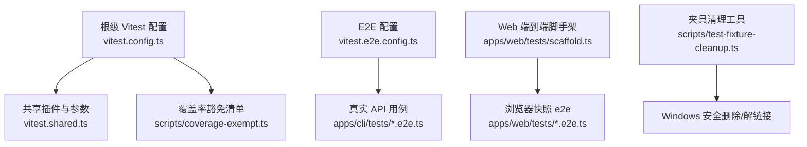
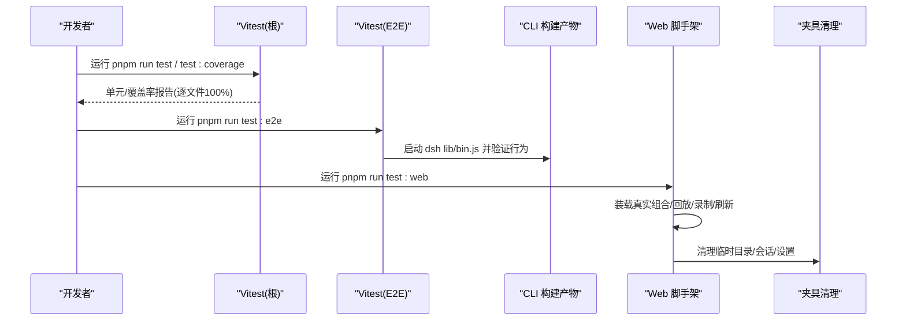
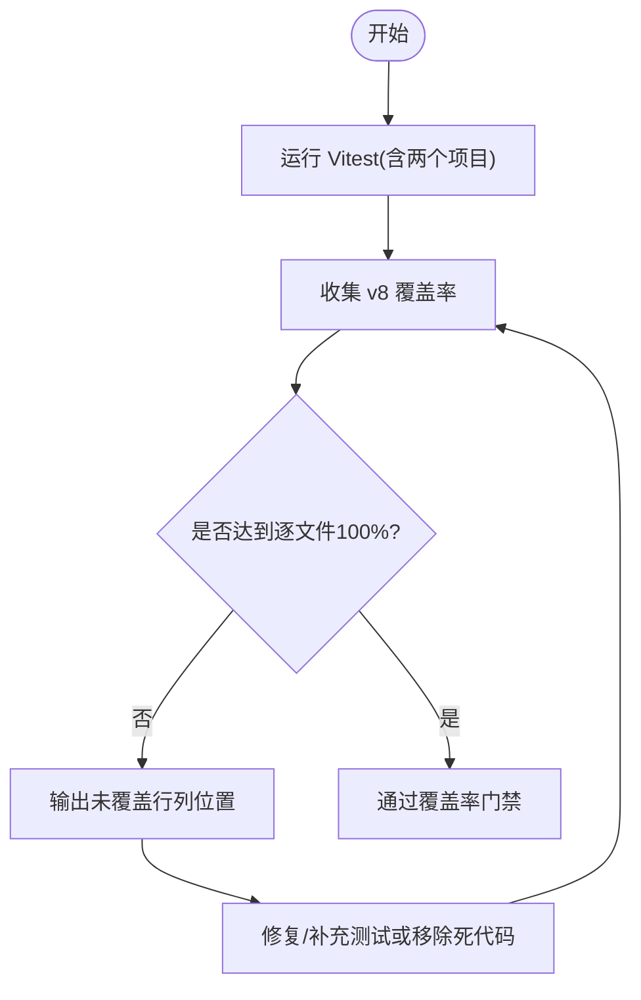
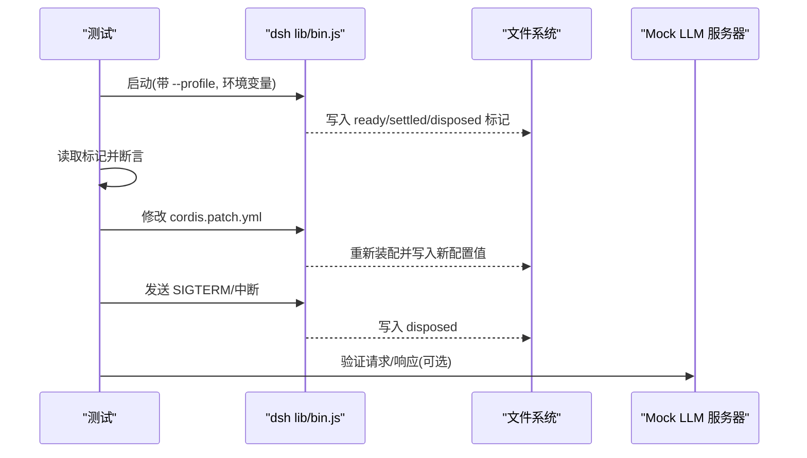
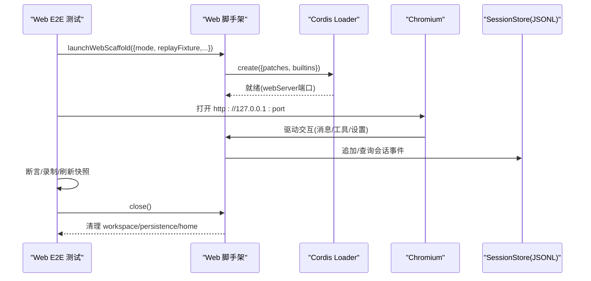
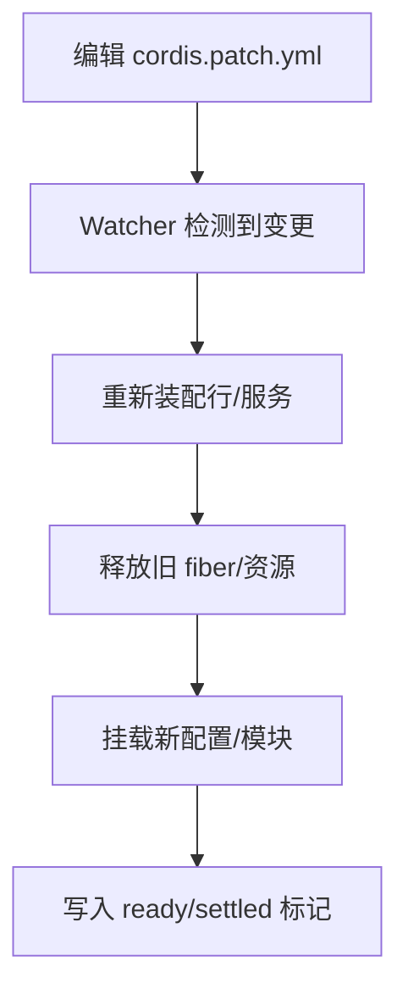
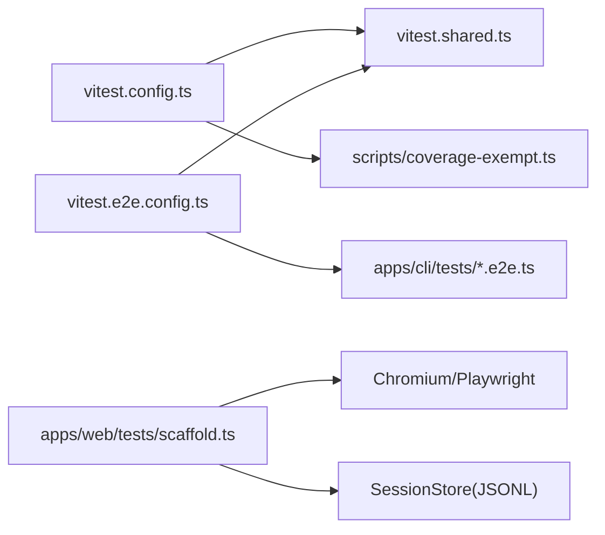

# 插件调试与测试

<cite>
**本文引用的文件**
- [docs/testing.md](file://docs/testing.md)
- [vitest.config.ts](file://vitest.config.ts)
- [vitest.e2e.config.ts](file://vitest.e2e.config.ts)
- [vitest.shared.ts](file://vitest.shared.ts)
- [scripts/coverage-exempt.ts](file://scripts/coverage-exempt.ts)
- [apps/cli/tests/built-bin.e2e.ts](file://apps/cli/tests/built-bin.e2e.ts)
- [apps/web/tests/scaffold.ts](file://apps/web/tests/scaffold.ts)
- [scripts/test-fixture-cleanup.ts](file://scripts/test-fixture-cleanup.ts)
- [AGENTS.md](file://AGENTS.md)
</cite>

## 目录
1. [简介](#简介)
2. [项目结构](#项目结构)
3. [核心组件](#核心组件)
4. [架构总览](#架构总览)
5. [详细组件分析](#详细组件分析)
6. [依赖关系分析](#依赖关系分析)
7. [性能考量](#性能考量)
8. [故障排查指南](#故障排查指南)
9. [结论](#结论)
10. [附录](#附录)

## 简介
本文件面向插件开发者，系统化说明 DeepSeek Harness 的调试与测试方法：开发环境配置、热重载机制、单元测试/集成测试/端到端测试编写规范、调试工具技巧、常见问题定位、性能分析与内存泄漏检测、外部依赖模拟与边界条件测试、覆盖率要求与持续集成配置。内容基于仓库现有测试策略与配置实现，确保可落地执行。

## 项目结构
仓库采用多包工作区组织，测试覆盖单元、覆盖率门禁、真实 API 端到端、快照回放、Web 浏览器快照等层级；CLI 与 Web 应用各自拥有端到端用例与脚手架。

图示来源
- [vitest.config.ts:1-286](file://vitest.config.ts#L1-L286)
- [vitest.shared.ts:1-43](file://vitest.shared.ts#L1-L43)
- [scripts/coverage-exempt.ts:1-42](file://scripts/coverage-exempt.ts#L1-L42)
- [vitest.e2e.config.ts:1-59](file://vitest.e2e.config.ts#L1-L59)
- [apps/web/tests/scaffold.ts:1-800](file://apps/web/tests/scaffold.ts#L1-L800)
- [scripts/test-fixture-cleanup.ts:1-50](file://scripts/test-fixture-cleanup.ts#L1-L50)

章节来源
- [AGENTS.md:59-80](file://AGENTS.md#L59-L80)
- [docs/testing.md:7-15](file://docs/testing.md#L7-L15)

## 核心组件
- 测试分层与策略
  - 单元测试：Vitest 扫描 packages/apps/examples/scripts 下的 spec 文件，按线程隔离运行，保证并发稳定。
  - 覆盖率门禁：对 packages/*/*/src 逐文件 100% 阈值，未覆盖行视为需删除的死代码或需补齐测试。
  - 真实 API 端到端：独立配置，支持凭据与环境变量，自动跳过无密钥场景。
  - 快照测试：关键行为通过 JSONL/截图快照锁定，CI 只回放不写预期。
  - Web 浏览器快照：Chromium 对比 UI 输出，CI 强制回放模式。
- 解析与转换
  - tsconfig.base.json 路径映射统一解析到 src，避免加载已构建产物导致单例重复。
  - 装饰器预转译：在 Vite 默认解析前将 TS 装饰器转为运行时兼容代码。
- 进程与平台适配
  - Windows 不支持套件排除与仅 Windows 包覆盖豁免。
  - PowerShell 可用性探测决定 pwsh-local 相关覆盖豁免。
  - 子进程/终端/沙箱类测试在独立进程池运行，避免全局状态污染。

章节来源
- [docs/testing.md:7-50](file://docs/testing.md#L7-L50)
- [vitest.config.ts:15-84](file://vitest.config.ts#L15-L84)
- [vitest.config.ts:117-159](file://vitest.config.ts#L117-L159)
- [vitest.config.ts:160-283](file://vitest.config.ts#L160-L283)
- [vitest.shared.ts:1-43](file://vitest.shared.ts#L1-L43)
- [scripts/coverage-exempt.ts:1-42](file://scripts/coverage-exempt.ts#L1-L42)

## 架构总览
下图展示测试层与关键入口的关系：根级 Vitest 聚合单元与覆盖率；E2E 配置驱动 CLI/Web 端到端；Web 脚手架提供真实组合与回放能力；夹具清理保障跨平台稳定性。

图示来源
- [vitest.config.ts:117-159](file://vitest.config.ts#L117-L159)
- [vitest.e2e.config.ts:31-58](file://vitest.e2e.config.ts#L31-L58)
- [apps/cli/tests/built-bin.e2e.ts:17-39](file://apps/cli/tests/built-bin.e2e.ts#L17-L39)
- [apps/web/tests/scaffold.ts:294-626](file://apps/web/tests/scaffold.ts#L294-L626)
- [scripts/test-fixture-cleanup.ts:18-49](file://scripts/test-fixture-cleanup.ts#L18-L49)

## 详细组件分析

### 单元测试与覆盖率门禁
- 运行方式
  - 使用根 Vitest 配置，包含 thread-safe 与 process-bound 两个项目，分别隔离线程与进程敏感用例。
  - 通过 vite-tsconfig-paths 指向 tsconfig.base.json，统一解析到 src。
- 覆盖率策略
  - 使用 v8 provider，逐文件 100% 阈值（语句/分支/函数/行）。
  - 针对重型/编译器/子进程用例，通过环境变量开关从覆盖率测量中豁免，但仍参与正确性回归。
  - 未覆盖位置由自定义 reporter 输出精确行列信息，便于快速定位。
- 最佳实践
  - 每个注册点需提供 HMR 安全测试（释放 fiber、断言清理）。
  - 优先覆盖边缘情况、错误路径、事件顺序、并发竞态与持久化契约回归。
  - 类型文件不参与覆盖率；bin/worker 入口由端到端/子进程测试覆盖。

图示来源
- [vitest.config.ts:117-159](file://vitest.config.ts#L117-L159)
- [vitest.config.ts:160-283](file://vitest.config.ts#L160-L283)
- [scripts/coverage-exempt.ts:1-42](file://scripts/coverage-exempt.ts#L1-L42)

章节来源
- [docs/testing.md:7-15](file://docs/testing.md#L7-L15)
- [docs/testing.md:21-35](file://docs/testing.md#L21-L35)
- [vitest.config.ts:160-283](file://vitest.config.ts#L160-L283)

### 端到端测试（CLI）
- 目标
  - 验证发布产物 dsh lib/bin.js 的行为：参数路由、profile 生命周期、配置导出、信号处理、热重载补丁层等。
- 关键能力
  - 通过 execa 启动构建后的 bin，注入临时 home/profile，断言退出码、stdout/stderr、文件标记。
  - 使用 mock LLM 服务验证 headless profile 能发起模型调用并返回预期结果。
  - 动态创建 bundle/patch 以验证热重载与卸载回退。
- 典型流程
  - 启动 CLI -> 等待 ready/settled/disposed 标记 -> 修改 patch.yml -> 断言重新装配 -> 发送终止信号 -> 验证清理。

图示来源
- [apps/cli/tests/built-bin.e2e.ts:17-39](file://apps/cli/tests/built-bin.e2e.ts#L17-L39)
- [apps/cli/tests/built-bin.e2e.ts:62-147](file://apps/cli/tests/built-bin.e2e.ts#L62-L147)
- [apps/cli/tests/built-bin.e2e.ts:496-546](file://apps/cli/tests/built-bin.e2e.ts#L496-L546)
- [apps/cli/tests/built-bin.e2e.ts:370-395](file://apps/cli/tests/built-bin.e2e.ts#L370-L395)

章节来源
- [apps/cli/tests/built-bin.e2e.ts:312-763](file://apps/cli/tests/built-bin.e2e.ts#L312-L763)

### 端到端测试（Web）与快照回放
- 目标
  - 在真实浏览器环境中回放用户交互，比对 UI 快照；支持录制与刷新模式。
- 关键能力
  - 通过 scaffold 装载 shipped 组合（base/web-app），注入临时 persistenceRoot、settings/credentials、webserver、replay 适配器。
  - 支持 replay/record/refresh 三种模式，严格校验 fixture 消费完整性。
  - 通过 SessionStore + JSONL 持久化，seed/realize 会话数据，确保回放一致性。
- 典型流程
  - 启动 Web 脚手架 -> 选择模式 -> 装载组合 -> 安装 ReplayAdapter -> 打开浏览器 -> 驱动交互 -> 断言/录制快照 -> 关闭并清理。

图示来源
- [apps/web/tests/scaffold.ts:294-626](file://apps/web/tests/scaffold.ts#L294-L626)
- [apps/web/tests/scaffold.ts:651-776](file://apps/web/tests/scaffold.ts#L651-L776)

章节来源
- [apps/web/tests/scaffold.ts:1-800](file://apps/web/tests/scaffold.ts#L1-L800)

### 热重载机制与开发体验
- 机制要点
  - 通过 Cordis Loader 与 patch 层实现热重载：编辑 cordis.patch.yml 后，运行中的树会重新装配，旧 fiber 被释放，新配置生效。
  - CLI 端到端用例验证了“添加/更新/移除”补丁后，配置值与生命周期标记的正确性。
- 开发建议
  - 使用最小 bundle/patch 进行快速迭代，配合 ready/settled/disposed 标记判断阶段。
  - 利用 --dump-default-config/--dump-config 观察组合层顺序与最终配置。
  - 注意用户层与 profile 层优先级，避免意外覆盖。

图示来源
- [apps/cli/tests/built-bin.e2e.ts:496-546](file://apps/cli/tests/built-bin.e2e.ts#L496-L546)
- [apps/cli/tests/built-bin.e2e.ts:578-610](file://apps/cli/tests/built-bin.e2e.ts#L578-L610)

章节来源
- [apps/cli/tests/built-bin.e2e.ts:496-610](file://apps/cli/tests/built-bin.e2e.ts#L496-L610)

### 调试工具与技巧
- 日志与诊断
  - 使用 --dump-default-config/--dump-config 查看组合层与最终配置。
  - 通过 CLI 端到端中的 stdout/stderr 断言定位启动失败、参数错误、配置缺失。
- 进程与信号
  - 通过 SIGTERM/中断触发优雅关闭，验证 disposed 标记与资源释放。
  - 使用临时 home/workspace 隔离运行，避免污染本地环境。
- 回放与快照
  - Web 模式支持 replay/record/refresh，CI 强制回放，本地录制/刷新需人工审查差异。
  - 会话 JSONL 作为黄金记录，规范化后用于跨平台一致比对。

章节来源
- [apps/cli/tests/built-bin.e2e.ts:312-763](file://apps/cli/tests/built-bin.e2e.ts#L312-L763)
- [apps/web/tests/scaffold.ts:294-626](file://apps/web/tests/scaffold.ts#L294-L626)
- [docs/testing.md:11-15](file://docs/testing.md#L11-L15)

### 外部依赖模拟与边界条件
- 模拟 LLM
  - 使用 Mock LLM 服务器拦截 chat/completions，验证 headless 流程与凭证传递。
  - Web 脚手架内置 RouteOnlyAdapter 与 ReplayHandle，确保无密钥场景下不会误发模型请求。
- 模拟文件系统/Shell
  - 通过临时 workspace/persistenceRoot 隔离文件操作；必要时使用 bash/pwsh 工具链。
- 边界条件
  - 覆盖超时、取消、幂等性、空输入、非法配置、缺失 profile、权限拒绝等路径。
  - 使用重试与超时保护网络/IO 不稳定场景。

章节来源
- [apps/cli/tests/built-bin.e2e.ts:370-395](file://apps/cli/tests/built-bin.e2e.ts#L370-L395)
- [apps/web/tests/scaffold.ts:125-164](file://apps/web/tests/scaffold.ts#L125-L164)
- [docs/testing.md:17-35](file://docs/testing.md#L17-L35)

### 性能分析与内存泄漏检测
- 性能分析
  - 端到端用例具备较长超时与重试，适合捕捉慢路径；可通过浏览器性能面板与 Node 性能分析辅助定位。
  - Web 回放支持 paceMs 控制流式速率，便于观察 UI 增量渲染。
- 内存泄漏检测
  - 关注 fiber.dispose、定时器清理、文件句柄释放；CLI 端到端通过 disposed 标记验证。
  - Web 脚手架在 close 中先断言 replay 完全消费，再清理 workspace/persistence/home，避免残留引用。
  - 使用 v8 堆快照/火焰图结合端到端场景复现问题。

章节来源
- [apps/cli/tests/built-bin.e2e.ts:496-546](file://apps/cli/tests/built-bin.e2e.ts#L496-L546)
- [apps/web/tests/scaffold.ts:607-626](file://apps/web/tests/scaffold.ts#L607-L626)
- [docs/testing.md:21-35](file://docs/testing.md#L21-L35)

### 测试覆盖率要求与持续集成
- 覆盖率要求
  - 对 packages/*/*/src 逐文件 100% 阈值；未覆盖行通常意味着死代码或需删除。
  - 某些重型/编译器/子进程用例通过环境变量从覆盖率测量中豁免，但仍参与正确性回归。
- CI 配置要点
  - 真实 API 端到端需要密钥，无密钥时自跳过；CI 仅回放快照，不写入预期。
  - Web 浏览器快照在 Linux PR 门禁中强制回放模式。
  - 覆盖率门禁为 CI 质量门，必须通过才能合并。

章节来源
- [docs/testing.md:7-15](file://docs/testing.md#L7-L15)
- [docs/testing.md:17-35](file://docs/testing.md#L17-L35)
- [vitest.config.ts:160-283](file://vitest.config.ts#L160-L283)
- [vitest.e2e.config.ts:31-58](file://vitest.e2e.config.ts#L31-L58)

## 依赖关系分析
- 配置依赖
  - vitest.config.ts 依赖 vitest.shared.ts（装饰器插件、execArgv）、scripts/coverage-exempt.ts（重型用例豁免）。
  - vitest.e2e.config.ts 依赖标准装饰器插件与路径解析，聚焦 apps/cli 与 examples 的 e2e。
- 运行时依赖
  - CLI 端到端依赖构建产物 dsh lib/bin.js 与 Mock LLM 服务器。
  - Web 端到端依赖 Cordis Loader、Replay、SessionStore、JSONL 持久化。
- 平台依赖
  - Windows 排除 Bash/终端/沙箱相关套件；PowerShell 可用性影响 pwsh-local 覆盖豁免。

图示来源
- [vitest.config.ts:1-286](file://vitest.config.ts#L1-L286)
- [vitest.e2e.config.ts:1-59](file://vitest.e2e.config.ts#L1-L59)
- [apps/web/tests/scaffold.ts:294-626](file://apps/web/tests/scaffold.ts#L294-L626)

章节来源
- [vitest.config.ts:15-84](file://vitest.config.ts#L15-L84)
- [vitest.config.ts:117-159](file://vitest.config.ts#L117-L159)
- [vitest.e2e.config.ts:31-58](file://vitest.e2e.config.ts#L31-L58)

## 性能考量
- 并行度控制
  - 单元用例使用 fork 池提升稳定性；E2E 通过 DSH_E2E_MAX_WORKERS 控制并发，避免 API 配额超限。
- 超时与重试
  - E2E 设置较长超时与重试，适应网络波动与模型延迟。
- 回放节奏
  - Web 回放支持 paceMs，便于观察 UI 增量渲染与性能瓶颈。
- 资源隔离
  - 每个测试使用临时 workspace/persistence/home，避免竞争与泄漏。

章节来源
- [vitest.e2e.config.ts:46-58](file://vitest.e2e.config.ts#L46-L58)
- [apps/web/tests/scaffold.ts:294-626](file://apps/web/tests/scaffold.ts#L294-L626)

## 故障排查指南
- 常见症状与定位
  - 启动失败/参数错误：检查 CLI 端到端中的帮助/用法断言与 stderr 输出。
  - 配置缺失/无效：使用 --dump-default-config/--dump-config 查看组合层与最终配置。
  - 热重载未生效：确认 watcher 是否触发，检查 ready/settled 标记与 patch 优先级。
  - 快照不一致：确认回放模式、fixture 消费完整性、规范化规则（时间/路径/ID 替换）。
- 清理与恢复
  - 使用脚本安全清理 Windows 符号链接与临时目录，避免递归删除宿主机目录。
  - 在测试 after/before 钩子中显式释放 fiber、定时器、文件句柄。

章节来源
- [apps/cli/tests/built-bin.e2e.ts:312-763](file://apps/cli/tests/built-bin.e2e.ts#L312-L763)
- [apps/web/tests/scaffold.ts:607-626](file://apps/web/tests/scaffold.ts#L607-L626)
- [scripts/test-fixture-cleanup.ts:18-49](file://scripts/test-fixture-cleanup.ts#L18-L49)

## 结论
本仓库提供了完善的插件调试与测试体系：分层清晰的测试策略、严格的覆盖率门禁、健壮的端到端与快照回放、跨平台兼容的夹具管理。遵循本文档的实践，可高效完成插件开发与质量保障，确保在 CI 中稳定运行并快速定位问题。

## 附录
- 常用命令
  - 单元测试：pnpm run test
  - 覆盖率门禁：pnpm run test:coverage
  - 真实 API 端到端：pnpm run test:e2e
  - 快照测试：pnpm run test:snapshot（记录/刷新见文档）
  - Web 浏览器快照：pnpm run test:web
- 环境变量
  - DEEPSEEK_API_KEY、DEEPSEEK_BASE_URL 等用于真实 API 测试。
  - DSH_SNAPSHOT=replay|record|refresh 控制 Web 快照模式。
  - DSH_E2E_MAX_WORKERS 控制 E2E 并发。

章节来源
- [AGENTS.md:59-80](file://AGENTS.md#L59-L80)
- [docs/testing.md:11-15](file://docs/testing.md#L11-L15)
- [vitest.e2e.config.ts:5-14](file://vitest.e2e.config.ts#L5-L14)