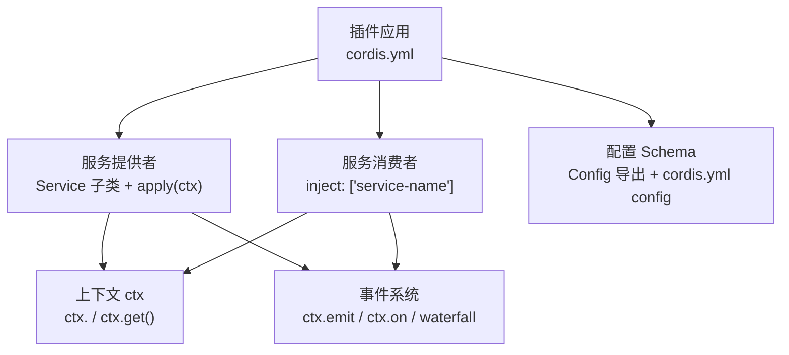
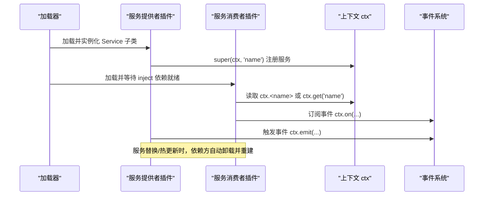
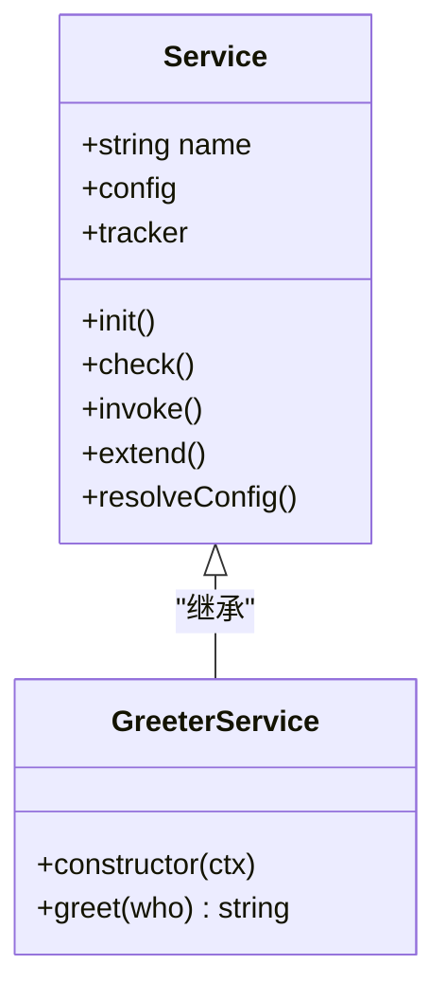
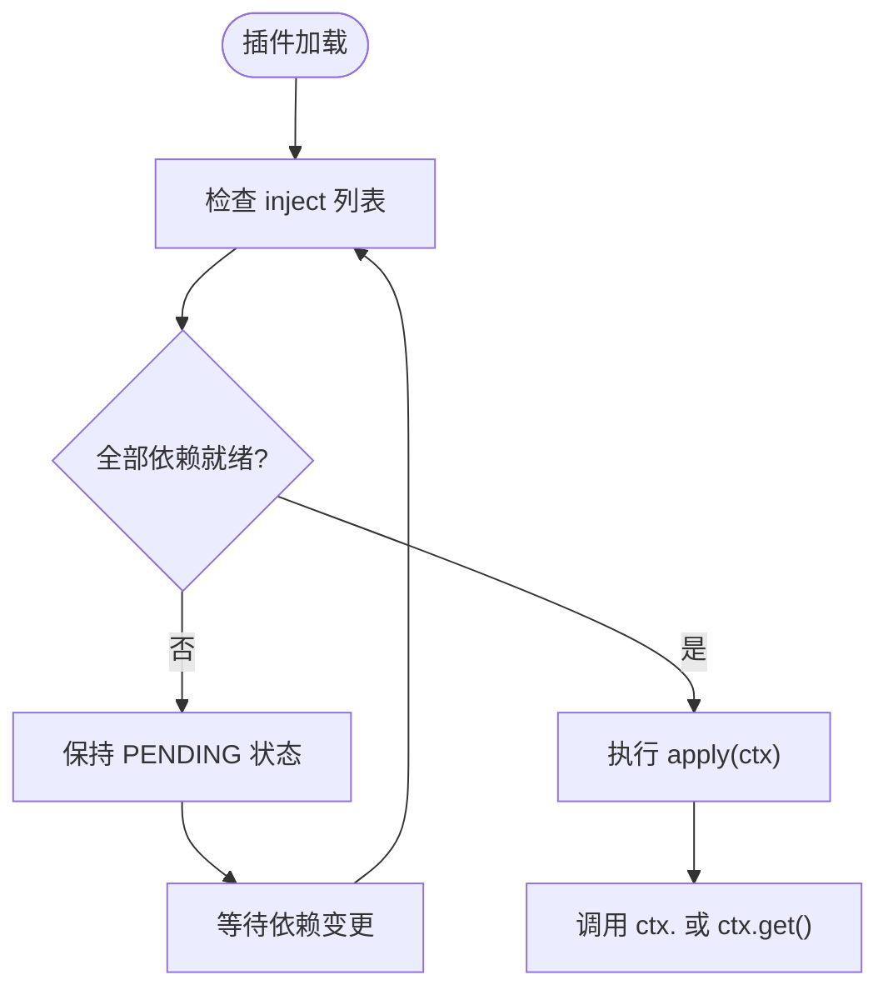
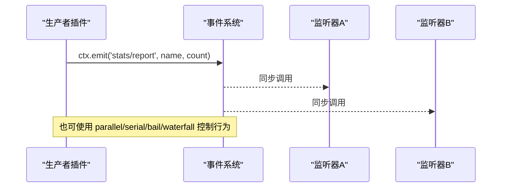
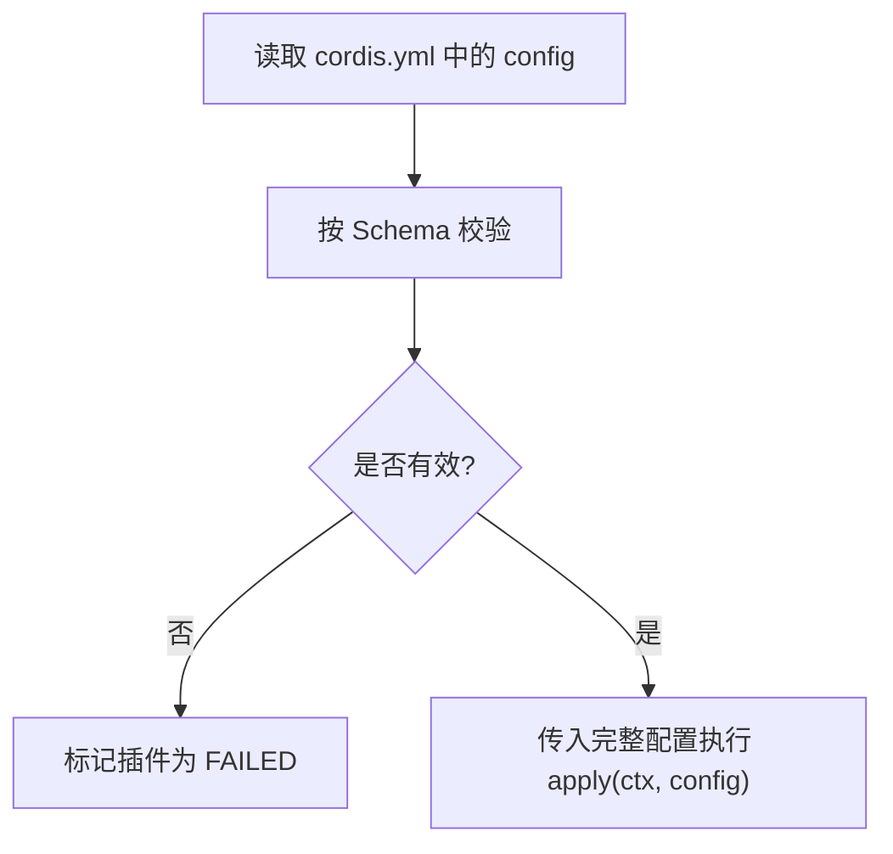
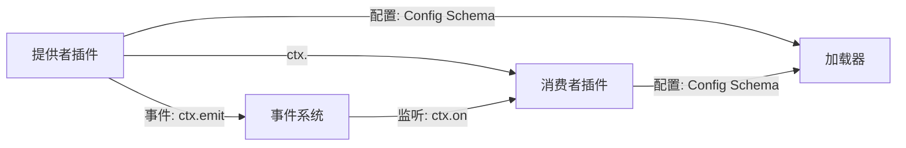

# 服务插件开发

<cite>
**本文引用的文件**
- [服务 API 文档](file://docs/cordis-api/service.md)
- [事件 API 文档](file://docs/cordis-api/events.md)
- [教程：服务](file://docs/cordis-tutorial/03-services.md)
- [教程：事件](file://docs/cordis-tutorial/04-events.md)
- [教程：配置](file://docs/cordis-tutorial/05-config.md)
</cite>

## 目录
1. [简介](#简介)
2. [项目结构](#项目结构)
3. [核心组件](#核心组件)
4. [架构总览](#架构总览)
5. [详细组件分析](#详细组件分析)
6. [依赖关系分析](#依赖关系分析)
7. [性能考虑](#性能考虑)
8. [故障排查指南](#故障排查指南)
9. [结论](#结论)
10. [附录](#附录)

## 简介
本指南面向希望为 Harness/Cordis 生态开发“服务类型插件”的开发者。内容涵盖服务的定义、注册与实现模式，生命周期管理、配置选项与事件处理；并提供从项目结构到代码实现的完整流程，以及服务间通信、错误处理和性能优化的最佳实践。通过示例展示如何构建可复用的业务逻辑组件，并以事件机制实现松耦合的跨插件协作。

## 项目结构
围绕服务插件开发，仓库提供了两类关键材料：
- Cordis API 参考：描述 Service 基类、上下文注入、事件分发等能力。
- Cordis 教程：以循序渐进的方式演示如何提供/消费服务、声明事件、使用配置校验。

**图示来源**
- [服务 API 文档:1-103](file://docs/cordis-api/service.md#L1-L103)
- [事件 API 文档:1-208](file://docs/cordis-api/events.md#L1-L208)
- [教程：服务:1-99](file://docs/cordis-tutorial/03-services.md#L1-L99)
- [教程：事件:1-145](file://docs/cordis-tutorial/04-events.md#L1-L145)
- [教程：配置:1-85](file://docs/cordis-tutorial/05-config.md#L1-L85)

**章节来源**
- [服务 API 文档:1-103](file://docs/cordis-api/service.md#L1-L103)
- [教程：服务:1-99](file://docs/cordis-tutorial/03-services.md#L1-L99)
- [教程：事件:1-145](file://docs/cordis-tutorial/04-events.md#L1-L145)
- [教程：配置:1-85](file://docs/cordis-tutorial/05-config.md#L1-L85)

## 核心组件
- 服务（Service）：基于基类的命名能力提供者，构造时即向上下文注册，随所属 fiber 自动移除。
- 上下文（Context）：插件共享的能力总线，支持直接调用已注册服务、订阅事件、获取可选服务。
- 事件（Events）：解耦的发布/订阅机制，支持多种分发模式（emit、parallel、serial、bail、waterfall）。
- 配置（Config）：每个插件可声明 Schema，在 apply 前完成校验与默认值填充，失败则快速失败。

**章节来源**
- [服务 API 文档:1-103](file://docs/cordis-api/service.md#L1-L103)
- [事件 API 文档:1-208](file://docs/cordis-api/events.md#L1-L208)
- [教程：服务:1-99](file://docs/cordis-tutorial/03-services.md#L1-L99)
- [教程：配置:1-85](file://docs/cordis-tutorial/05-config.md#L1-L85)

## 架构总览
下图展示了服务插件的典型交互：提供者通过 Service 子类暴露能力，消费者通过 inject 或 ctx.get 获取；同时通过事件进行异步解耦通信；配置在加载阶段校验并注入 apply。

**图示来源**
- [教程：服务:1-99](file://docs/cordis-tutorial/03-services.md#L1-L99)
- [事件 API 文档:1-208](file://docs/cordis-api/events.md#L1-L208)

## 详细组件分析

### 服务定义与注册模式
- 继承 Service 基类并在构造函数中调用 super(ctx, name)，即可将实例以名称注册到上下文。
- 通过 declare module 合并 Context 接口，获得编译期类型安全。
- 在 apply(ctx) 中使用 ctx.plugin(ServiceClass) 挂载服务，服务作为插件被统一管理。
- 服务随 fiber 生命周期自动移除，避免资源泄漏。

**图示来源**
- [服务 API 文档:1-103](file://docs/cordis-api/service.md#L1-L103)

**章节来源**
- [服务 API 文档:1-103](file://docs/cordis-api/service.md#L1-L103)
- [教程：服务:1-99](file://docs/cordis-tutorial/03-services.md#L1-L99)

### 服务消费与依赖管理
- 使用 inject 声明强依赖，Cordis 会确保所有依赖就绪后才运行 apply，保证 ctx.<name> 可用。
- 对于可选能力，使用 ctx.get('name') 探测是否存在，避免阻塞启动。
- 依赖变化（提供者卸载/热替换）会触发依赖方卸载并重新加载，保持引用一致性。

**图示来源**
- [教程：服务:1-99](file://docs/cordis-tutorial/03-services.md#L1-L99)

**章节来源**
- [教程：服务:1-99](file://docs/cordis-tutorial/03-services.md#L1-L99)

### 事件系统与通信
- 事件用于解耦通信，适合跨插件广播或流水线式处理。
- 五种分发模式：
  - emit：同步广播，不收集返回值。
  - parallel：并发执行所有监听器，统一 await。
  - serial：顺序执行，首个非空返回值短路。
  - bail：同步版本的 serial。
  - waterfall：中间件风格，最后一个参数为 next 回调，可转换或拦截。
- 使用 ctx.on/once 注册监听器，监听器随插件卸载自动清理。

**图示来源**
- [事件 API 文档:1-208](file://docs/cordis-api/events.md#L1-L208)
- [教程：事件:1-145](file://docs/cordis-tutorial/04-events.md#L1-L145)

**章节来源**
- [事件 API 文档:1-208](file://docs/cordis-api/events.md#L1-L208)
- [教程：事件:1-145](file://docs/cordis-tutorial/04-events.md#L1-L145)

### 配置选项与校验
- 插件导出 Config Schema（如 Schemastery），在 apply 前完成校验与默认值填充。
- 配置错误会导致插件进入 FAILED 状态，便于快速定位问题。
- 支持 !!js 标签在配置中计算动态值（仅限 config 与 disabled 字段）。

**图示来源**
- [教程：配置:1-85](file://docs/cordis-tutorial/05-config.md#L1-L85)

**章节来源**
- [教程：配置:1-85](file://docs/cordis-tutorial/05-config.md#L1-L85)

### 生命周期管理与扩展点
- 服务实例在构造时注册，随 fiber 销毁而移除。
- 可通过静态符号扩展服务行为（如 init、check、invoke、extend、tracker、resolveConfig）。
- 事件监听器注册为 effect，随插件卸载自动清理。

**章节来源**
- [服务 API 文档:1-103](file://docs/cordis-api/service.md#L1-L103)
- [事件 API 文档:1-208](file://docs/cordis-api/events.md#L1-L208)
- [教程：事件:1-145](file://docs/cordis-tutorial/04-events.md#L1-L145)

## 依赖关系分析
- 服务提供者与服务消费者通过名称空间解耦，降低模块耦合度。
- 事件系统进一步解耦生产者和消费者，支持多播与流水线处理。
- 配置与运行时分离，Schema 负责契约，apply 负责实现。

**图示来源**
- [教程：服务:1-99](file://docs/cordis-tutorial/03-services.md#L1-L99)
- [事件 API 文档:1-208](file://docs/cordis-api/events.md#L1-L208)
- [教程：配置:1-85](file://docs/cordis-tutorial/05-config.md#L1-L85)

**章节来源**
- [教程：服务:1-99](file://docs/cordis-tutorial/03-services.md#L1-L99)
- [事件 API 文档:1-208](file://docs/cordis-api/events.md#L1-L208)
- [教程：配置:1-85](file://docs/cordis-tutorial/05-config.md#L1-L85)

## 性能考虑
- 优先使用事件进行广播型通知，避免频繁的直接服务调用造成耦合与锁竞争。
- 对高吞吐场景，选择合适的事件分发模式：
  - parallel：并发执行监听器，适合独立且无副作用的通知。
  - serial/bail：需要顺序或短路决策时使用。
  - waterfall：适合中间件式处理链，注意必须调用 next 以避免静默吞掉下游行为。
- 使用 ctx.get 做可选能力探测，避免不必要的依赖阻塞。
- 合理拆分服务职责，避免单体服务过大导致初始化与调用开销上升。

[本节为通用指导，无需特定文件来源]

## 故障排查指南
- 插件处于 PENDING：检查 inject 列表是否满足，确认依赖提供者已加载。
- 插件处于 FAILED：查看配置校验错误信息，修正 cordis.yml 中的 config。
- 事件未触发：确认事件名一致、监听器已注册且未被卸载；检查分发模式是否符合预期。
- 服务替换后行为异常：确认依赖方是否正确卸载并重建；必要时在 apply 中重新建立连接或缓存。

**章节来源**
- [教程：服务:1-99](file://docs/cordis-tutorial/03-services.md#L1-L99)
- [教程：配置:1-85](file://docs/cordis-tutorial/05-config.md#L1-L85)
- [事件 API 文档:1-208](file://docs/cordis-api/events.md#L1-L208)

## 结论
通过 Service 基类、Context 注入、事件系统与配置 Schema，Cordis/Harness 提供了清晰的服务插件开发范式。遵循依赖管理、事件通信与配置校验的最佳实践，可以构建高内聚、低耦合、易扩展的可复用业务组件。结合生命周期管理与错误快速失败策略，能够显著提升系统的可维护性与稳定性。

[本节为总结性内容，无需特定文件来源]

## 附录
- 快速上手步骤
  - 定义服务：继承 Service，构造时 super(ctx, name)。
  - 提供服务：在 apply(ctx) 中 ctx.plugin(ServiceClass)。
  - 消费服务：在消费者插件中 inject: ['service-name']，或在 apply 中 ctx.get('service-name')。
  - 事件通信：声明 Events 接口，使用 ctx.emit/on/parallel/serial/bail/waterfall。
  - 配置校验：导出 Config Schema，并在 cordis.yml 中配置 config。
- 参考路径
  - 服务定义与注册：[服务 API 文档](file://docs/cordis-api/service.md)
  - 事件通信模式：[事件 API 文档](file://docs/cordis-api/events.md)
  - 端到端示例：[教程：服务](file://docs/cordis-tutorial/03-services.md)、[教程：事件](file://docs/cordis-tutorial/04-events.md)、[教程：配置](file://docs/cordis-tutorial/05-config.md)

[本节为补充说明，无需特定文件来源]