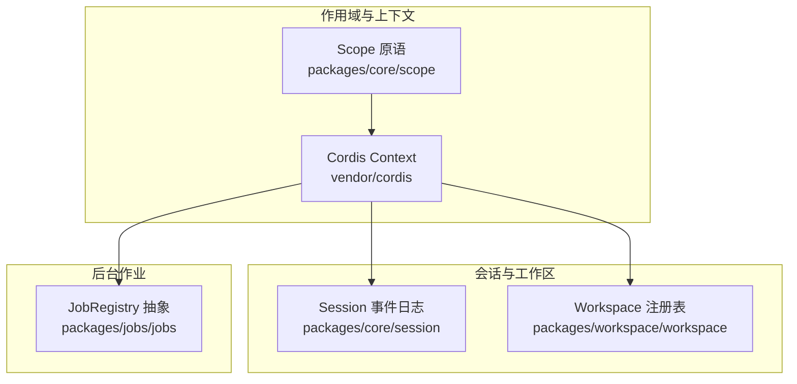
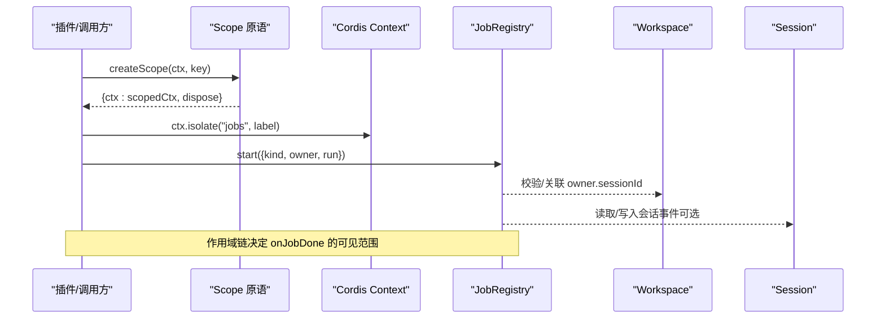
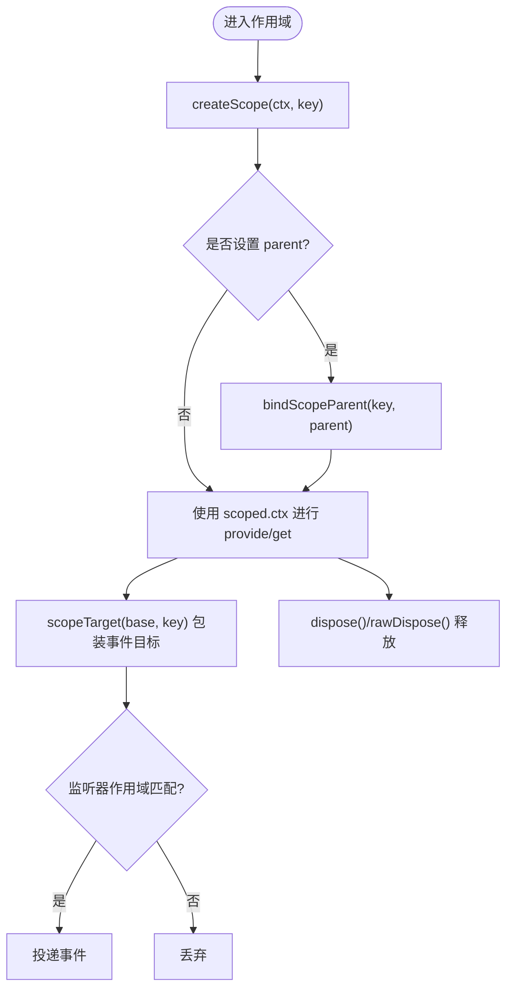
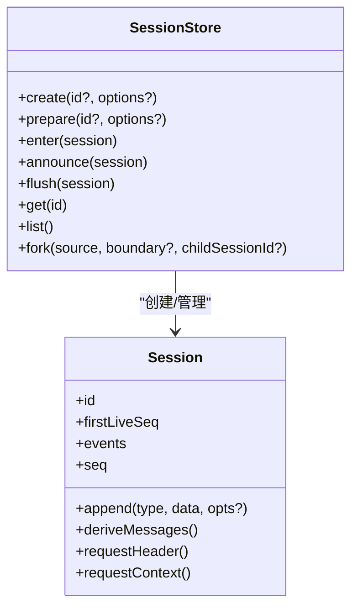
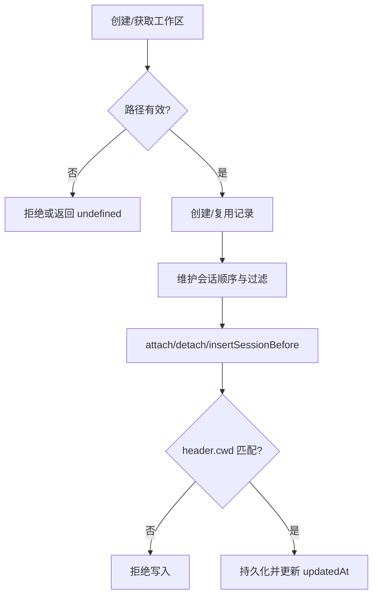
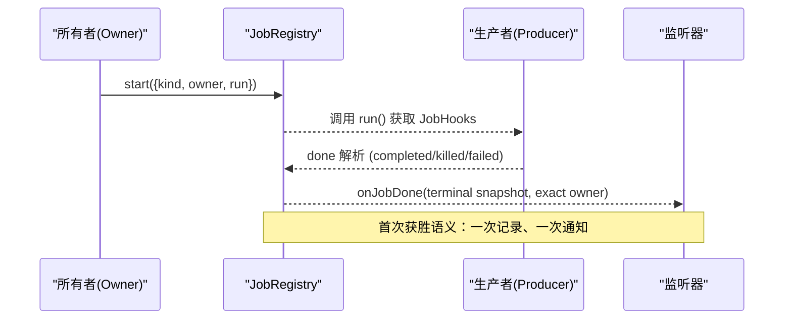
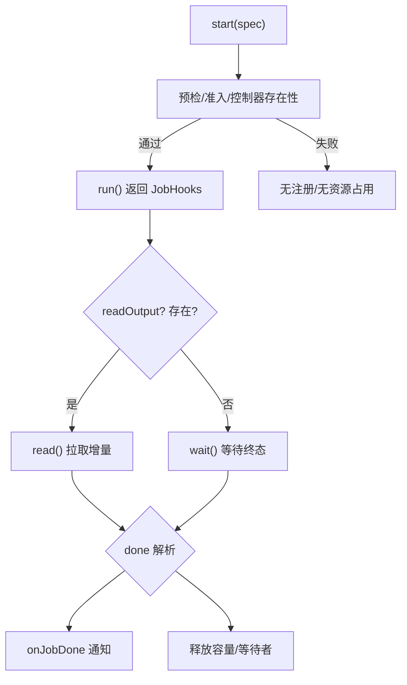
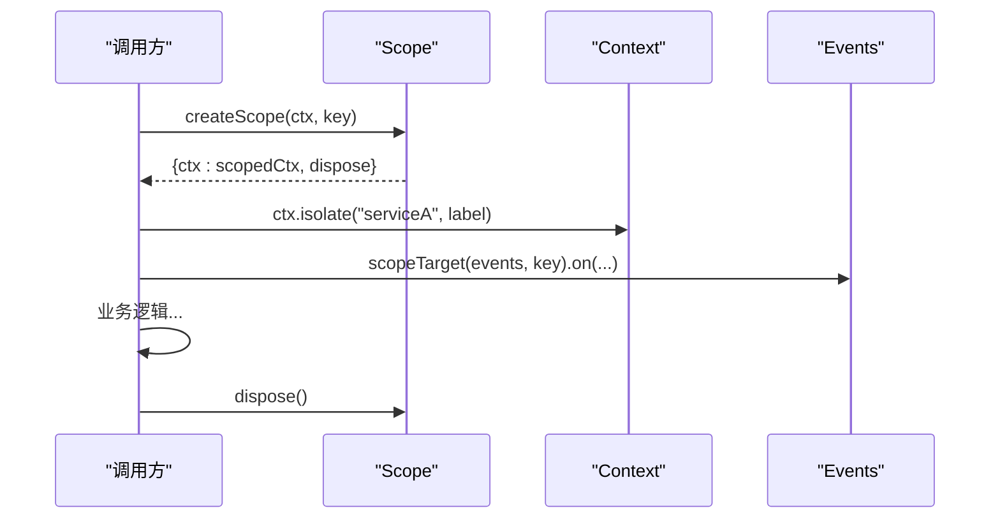
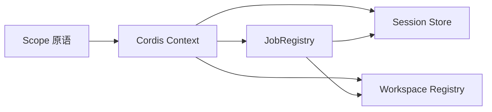

# Agent 作用域与上下文

<cite>
**本文引用的文件**
- [packages/core/scope/src/index.ts](file://packages/core/scope/src/index.ts)
- [docs/subsystems/scope.md](file://docs/subsystems/scope.md)
- [docs/cordis-api/context.md](file://docs/cordis-api/context.md)
- [docs/subsystems/jobs.md](file://docs/subsystems/jobs.md)
- [packages/jobs/jobs/src/index.ts](file://packages/jobs/jobs/src/index.ts)
- [docs/subsystems/session.md](file://docs/subsystems/session.md)
- [docs/subsystems/workspace.md](file://docs/subsystems/workspace.md)
</cite>

## 目录
1. [引言](#引言)
2. [项目结构](#项目结构)
3. [核心组件](#核心组件)
4. [架构总览](#架构总览)
5. [详细组件分析](#详细组件分析)
6. [依赖关系分析](#依赖关系分析)
7. [性能考量](#性能考量)
8. [故障排查指南](#故障排查指南)
9. [结论](#结论)
10. [附录](#附录)

## 引言
本文件围绕 Agent 的作用域管理与上下文隔离机制展开，系统阐述：
- 作用域的概念、层次结构与继承关系
- 上下文数据的存储、访问与共享（会话级、工作区级、全局级）
- 消息队列的实现原理（路由、优先级、背压）
- 工作消费模式（异步任务与并发控制）
- 作用域切换与上下文传递的实践要点
- 内存管理与垃圾回收策略

## 项目结构
本仓库将“作用域/上下文”能力拆分为多个子系统与文档：
- 作用域原语：@deepseek-ai/dsh-scope（packages/core/scope），提供 ScopeKey、Scoped、Scope、scopeTarget、作用域链等基础能力
- 上下文服务：Cordis Context（vendor/cordis），提供 extend/isolate/intercept、provide/get/set、事件总线等
- 会话模型：dsh-session（packages/core/session），以追加式事件日志作为唯一事实源
- 工作区：dsh-workspace（packages/workspace/workspace），持久化记录用户工作目录与会话归属
- 后台作业：dsh-jobs（packages/jobs），抽象 JobRegistry 与本地实现，负责长任务生命周期、可见性与完成通知

**图示来源**
- [packages/core/scope/src/index.ts:1-205](file://packages/core/scope/src/index.ts#L1-L205)
- [docs/cordis-api/context.md:1-365](file://docs/cordis-api/context.md#L1-L365)
- [docs/subsystems/session.md:1-850](file://docs/subsystems/session.md#L1-L850)
- [docs/subsystems/workspace.md:1-229](file://docs/subsystems/workspace.md#L1-L229)
- [packages/jobs/jobs/src/index.ts:1-180](file://packages/jobs/jobs/src/index.ts#L1-L180)

**章节来源**
- [docs/subsystems/scope.md:1-60](file://docs/subsystems/scope.md#L1-L60)
- [docs/cordis-api/context.md:1-365](file://docs/cordis-api/context.md#L1-L365)
- [docs/subsystems/session.md:1-850](file://docs/subsystems/session.md#L1-L850)
- [docs/subsystems/workspace.md:1-229](file://docs/subsystems/workspace.md#L1-L229)
- [packages/jobs/jobs/src/index.ts:1-180](file://packages/jobs/jobs/src/index.ts#L1-L180)

## 核心组件
- 作用域原语（Scope）
  - 通过 ScopeKey 标识一个作用域；通过 Scoped<T> 为事件分发提供仅路由的载体；通过 scopeTarget(base, key) 包装事件目标，使监听器按作用域链向上匹配
  - createScope(ctx, key, options) 创建带独立 fiber 的 scoped context，并返回 rawDispose/dispose 两种销毁边界
  - 作用域链由 WeakMap 维护 parent 关系，支持 rebind 重绑定但禁止环
- Cordis Context
  - ctx.extend/meta 构建子上下文；ctx.isolate(name, label) 对特定服务名建立隔离作用域；ctx.intercept 注入拦截配置
  - ctx.provide/get/set/accessor/mixin 管理服务生命周期与作用域可见性
- 会话 Session
  - 以追加式事件日志为唯一事实源；deriveMessages 从表面事件投影出模型可见历史；fork/prepare/enter/announce 控制会话生命周期
- 工作区 Workspace
  - 持久化目录到会话归属映射；校验 session header.cwd 与 workspace path 的一致性；提供 attach/detach/insertBefore/list 等 API
- 后台作业 JobRegistry
  - 抽象接口定义 start/list/read/kill/wait/onJobDone/onJobsChanged/attachController；本地实现负责准入、可见性、完成通知与容量控制

**章节来源**
- [packages/core/scope/src/index.ts:1-205](file://packages/core/scope/src/index.ts#L1-L205)
- [docs/cordis-api/context.md:1-365](file://docs/cordis-api/context.md#L1-L365)
- [docs/subsystems/session.md:1-850](file://docs/subsystems/session.md#L1-L850)
- [docs/subsystems/workspace.md:1-229](file://docs/subsystems/workspace.md#L1-L229)
- [packages/jobs/jobs/src/index.ts:1-180](file://packages/jobs/jobs/src/index.ts#L1-L180)

## 架构总览
下图展示作用域如何驱动上下文隔离、事件路由与作业可见性。

**图示来源**
- [packages/core/scope/src/index.ts:129-185](file://packages/core/scope/src/index.ts#L129-L185)
- [docs/cordis-api/context.md:14-96](file://docs/cordis-api/context.md#L14-L96)
- [packages/jobs/jobs/src/index.ts:62-176](file://packages/jobs/jobs/src/index.ts#L62-L176)
- [docs/subsystems/workspace.md:118-223](file://docs/subsystems/workspace.md#L118-L223)
- [docs/subsystems/session.md:615-745](file://docs/subsystems/session.md#L615-L745)

## 详细组件分析

### 作用域与上下文隔离
- 作用域键与作用域链
  - ScopeKey 是身份比较的不可见对象；scopeChainOf(key) 返回从 key 到根的作用域链
  - bindScopeParent/rebind 维护父子关系，禁止环；scopeParentOf 可查询父节点
- 事件路由与 Scoped 载体
  - scopeTarget(base, key) 为事件目标附加 filter：未标记监听器全局可见；已标记监听器需位于 key 或其祖先作用域中才接收
  - isScopeCarrier/carrierKeyOf 用于识别与读取载体键
- 作用域上下文创建与销毁
  - createScope 在 Cordis 中启动一个 fiber 并扩展 ctx，rawDispose 暴露精确 disposer，dispose 幂等等待清理完成
- 上下文隔离与拦截
  - ctx.isolate(name, label) 对指定服务名建立隔离作用域，相同 label 会合并作用域
  - ctx.intercept(name, config) 为下游插件注入拦截配置，不影响父上下文
  - ctx.extend(meta) 创建携带元数据子上下文

**图示来源**
- [packages/core/scope/src/index.ts:54-118](file://packages/core/scope/src/index.ts#L54-L118)
- [packages/core/scope/src/index.ts:129-185](file://packages/core/scope/src/index.ts#L129-L185)
- [docs/cordis-api/context.md:14-96](file://docs/cordis-api/context.md#L14-L96)

**章节来源**
- [packages/core/scope/src/index.ts:1-205](file://packages/core/scope/src/index.ts#L1-L205)
- [docs/cordis-api/context.md:1-365](file://docs/cordis-api/context.md#L1-L365)

### 会话级上下文：事件日志与派生历史
- 事件日志
  - Session 是追加式事件日志，所有消息历史均由其推导；append 严格校验 JSON 可序列化与表面操作语义
- 表面与投影
  - SurfaceEventType 限定 user/message、assistant/message、tool/result；surfaceOp 控制 append/replace
  - deriveMessages 缓存每节点投影结果，重写时重建
- 生命周期
  - prepare/enter/announce 组合确保会话与 effect 有序析构；flush 触发持久化检查点
- 分支与恢复
  - fork 基于稳定边界创建子会话；fromRestore 恢复冻结后的会话图

**图示来源**
- [docs/subsystems/session.md:359-519](file://docs/subsystems/session.md#L359-L519)
- [docs/subsystems/session.md:615-745](file://docs/subsystems/session.md#L615-L745)

**章节来源**
- [docs/subsystems/session.md:1-850](file://docs/subsystems/session.md#L1-L850)

### 工作区级上下文：目录与会话归属
- 工作区实体
  - 稳定的 id、规范化路径、显示标题、会话顺序列表；每次变更更新 updatedAt
- 注册表行为
  - create/get/list/delete/insertBefore/resolveByPath；attach/detach/insertSessionBefore 维护会话归属
  - 启动时根据持久化头信息一次性引导历史分组；删除只移除登记与顺序，不触碰目录与会话日志
- 一致性
  - 会话归属需要同时满足：id 在账户中且 session header.cwd 规范化后等于 workspace path

**图示来源**
- [docs/subsystems/workspace.md:21-123](file://docs/subsystems/workspace.md#L21-L123)
- [docs/subsystems/workspace.md:152-223](file://docs/subsystems/workspace.md#L152-L223)

**章节来源**
- [docs/subsystems/workspace.md:1-229](file://docs/subsystems/workspace.md#L1-L229)

### 消息队列：作业注册、路由与完成通知
- 作业契约
  - JobStart 声明 kind/label/outputLimitBytes/owner/run；JobHooks 提供 cancel/done/readOutput
  - JobSnapshot/JobRead 提供只读视图与增量输出
- 可见性与授权
  - list/get/read/kill/wait 均接受 caller 并与 owner.sessionId 做授权校验；unowned 作业对非 agent 调用者可见
- 完成通知与观察者
  - onJobDone 接收每个 owner 的终结快照；onJobsChanged 观察可见集合变化
- 控制器与准入
  - attachController 允许当前作用域下的控制器读写/停止作业；start 在无控制器服务该 owner 时拒绝工作

**图示来源**
- [docs/subsystems/jobs.md:24-96](file://docs/subsystems/jobs.md#L24-L96)
- [docs/subsystems/jobs.md:98-157](file://docs/subsystems/jobs.md#L98-L157)
- [packages/jobs/jobs/src/index.ts:62-176](file://packages/jobs/jobs/src/index.ts#L62-L176)

**章节来源**
- [docs/subsystems/jobs.md:1-291](file://docs/subsystems/jobs.md#L1-L291)
- [packages/jobs/jobs/src/index.ts:1-180](file://packages/jobs/jobs/src/index.ts#L1-L180)

### 工作消费模式：异步任务与并发控制
- 生产-消费分离
  - 生产者拥有执行资源，运行时管理身份、访问与生命周期状态；消费者通过 read/wait/list 获取快照与增量输出
- 并发与容量
  - 本地实现维护 per-owner 并发上限（默认 10），running+stopping 计数共享桶；终端结算释放容量
- 背压与流式输出
  - 流式作业通过 readOutput 拉取增量；最终输出型作业在结事后返回最终 output；read 幂等，不会重复消费
- 取消与清理
  - kill 请求取消并标记 stopping/reported；teardown 会取消并等待合规生产者；抛错仅影响记录，不改变作业状态

**图示来源**
- [docs/subsystems/jobs.md:24-96](file://docs/subsystems/jobs.md#L24-L96)
- [docs/subsystems/jobs.md:98-157](file://docs/subsystems/jobs.md#L98-L157)
- [docs/subsystems/jobs.md:155-178](file://docs/subsystems/jobs.md#L155-L178)

**章节来源**
- [docs/subsystems/jobs.md:1-291](file://docs/subsystems/jobs.md#L1-L291)

### 作用域切换与上下文传递实践
- 创建作用域
  - 使用 createScope(ctx, key) 获得 scoped.ctx，并在该上下文中注册服务/监听器
- 作用域链与事件路由
  - 通过 scopeTarget(base, key) 包装事件目标，使祖先作用域的监听器能收到后代作用域的事件
- 服务隔离
  - 使用 ctx.isolate(name, label) 对特定服务名建立隔离作用域，相同 label 合并作用域
- 拦截配置
  - 使用 ctx.intercept(name, config) 为下游插件注入拦截配置，不影响父上下文
- 销毁与清理
  - 使用 dispose/rawDispose 释放作用域；fiber 惰性清理保证竞态安全

**图示来源**
- [packages/core/scope/src/index.ts:129-185](file://packages/core/scope/src/index.ts#L129-L185)
- [docs/cordis-api/context.md:14-96](file://docs/cordis-api/context.md#L14-L96)

**章节来源**
- [packages/core/scope/src/index.ts:1-205](file://packages/core/scope/src/index.ts#L1-L205)
- [docs/cordis-api/context.md:1-365](file://docs/cordis-api/context.md#L1-L365)

## 依赖关系分析
- 作用域依赖 Cordis Context 的 fiber 与事件机制
- 会话与工作区通过 Context 提供服务接入点（ctx.sessions、ctx.workspaceRegistry）
- 作业注册表通过 Context 暴露 ctx.jobs，并依赖会话与工作区的授权与归属约束
- 事件路由通过作用域链实现“祖先可见后代”，避免跨作用域泄漏

**图示来源**
- [packages/core/scope/src/index.ts:1-205](file://packages/core/scope/src/index.ts#L1-L205)
- [docs/cordis-api/context.md:1-365](file://docs/cordis-api/context.md#L1-L365)
- [docs/subsystems/session.md:615-745](file://docs/subsystems/session.md#L615-L745)
- [docs/subsystems/workspace.md:152-223](file://docs/subsystems/workspace.md#L152-L223)
- [packages/jobs/jobs/src/index.ts:62-176](file://packages/jobs/jobs/src/index.ts#L62-L176)

**章节来源**
- [packages/core/scope/src/index.ts:1-205](file://packages/core/scope/src/index.ts#L1-L205)
- [docs/cordis-api/context.md:1-365](file://docs/cordis-api/context.md#L1-L365)
- [docs/subsystems/session.md:615-745](file://docs/subsystems/session.md#L615-L745)
- [docs/subsystems/workspace.md:152-223](file://docs/subsystems/workspace.md#L152-L223)
- [packages/jobs/jobs/src/index.ts:62-176](file://packages/jobs/jobs/src/index.ts#L62-L176)

## 性能考量
- 事件日志与投影
  - Session.deriveMessages 缓存每节点投影，重写时重建；append 热路径不阻塞 I/O，持久化异步缓冲
- 作业并发与背压
  - per-owner 并发上限限制活跃任务数；readOutput 拉取式消费避免积压；终端结算释放容量
- 作用域链查找
  - 作用域链长度有限，事件路由沿链向上匹配；WeakMap 存储 parent 关系，开销低
- 工作区过滤
  - 会话归属同步过滤无效项，减少后续查询成本

[本节为通用指导，无需具体文件引用]

## 故障排查指南
- 作用域链环检测
  - 绑定父作用域时会检测环，抛出错误；若出现循环，请检查 rebind 调用路径
- 作用域未生效
  - 确认使用了 scopeTarget 包装事件目标；监听器需在 key 或其祖先作用域中
- 作业不可见或无法开始
  - 检查是否有 attachController 服务该 owner；确认 caller 与 owner.sessionId 一致
- 会话持久化问题
  - 确保 flush 被正确调用；检查 append 的数据是否 JSON 可序列化；关注 surfaceOp 合法性
- 工作区归属不一致
  - 校验 session header.cwd 规范化后是否与 workspace path 一致；重新 attach 或修正 cwd

**章节来源**
- [packages/core/scope/src/index.ts:54-82](file://packages/core/scope/src/index.ts#L54-L82)
- [packages/core/scope/src/index.ts:158-185](file://packages/core/scope/src/index.ts#L158-L185)
- [docs/subsystems/jobs.md:155-178](file://docs/subsystems/jobs.md#L155-L178)
- [docs/subsystems/session.md:437-519](file://docs/subsystems/session.md#L437-L519)
- [docs/subsystems/workspace.md:118-123](file://docs/subsystems/workspace.md#L118-L123)

## 结论
- 作用域原语与 Cordis Context 共同实现了细粒度的上下文隔离与事件路由
- 会话以事件日志为唯一事实源，结合表面操作与投影，提供稳定、可复现的历史
- 工作区将目录与会话归属持久化，并通过 header.cwd 校验保持一致性
- 作业注册表提供统一的长任务生命周期管理，结合作用域实现可见性与完成通知
- 通过 isolate/extend/intercept 与 scopeTarget，可在不同层级间灵活切换与传递上下文
- 内存与 GC 方面，WeakMap 与 fiber 生命周期管理确保作用域与注册项在不再使用时被回收

[本节为总结，无需具体文件引用]

## 附录
- 关键 API 参考
  - 作用域：createScope、scopeTarget、scopeChainOf、bindScopeParent、rebind
  - 上下文：ctx.extend、ctx.isolate、ctx.intercept、ctx.provide/get/set
  - 会话：Session.append、deriveMessages、SessionStore.create/prepare/enter/announce/flush/fork
  - 工作区：WorkspaceRegistry.create/get/list/delete/insertBefore/resolveByPath、attach/detach/insertSessionBefore
  - 作业：JobRegistry.start/list/read/kill/wait/onJobDone/onJobsChanged/attachController

[本节为参考索引，无需具体文件引用]