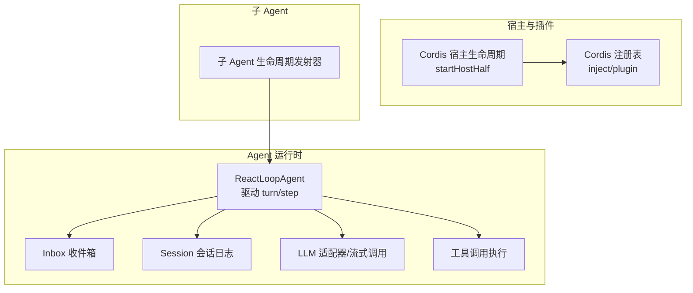
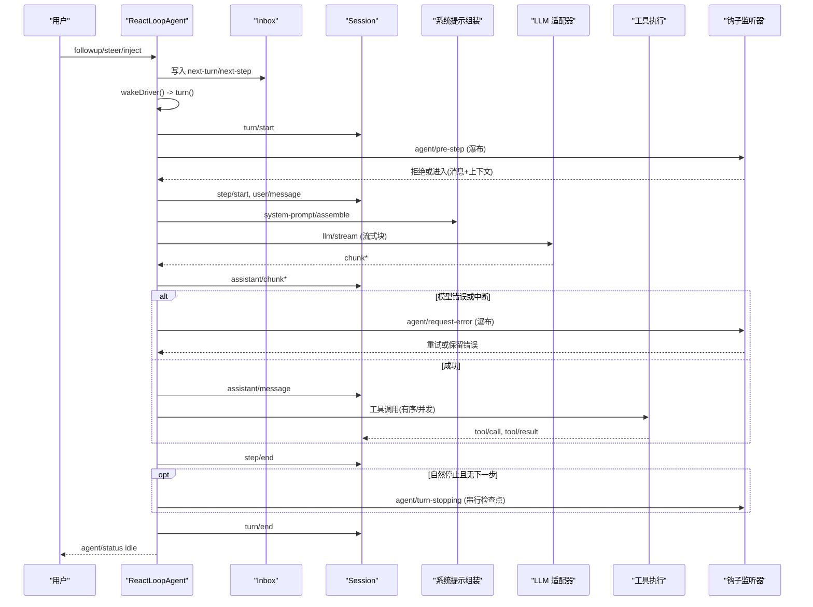
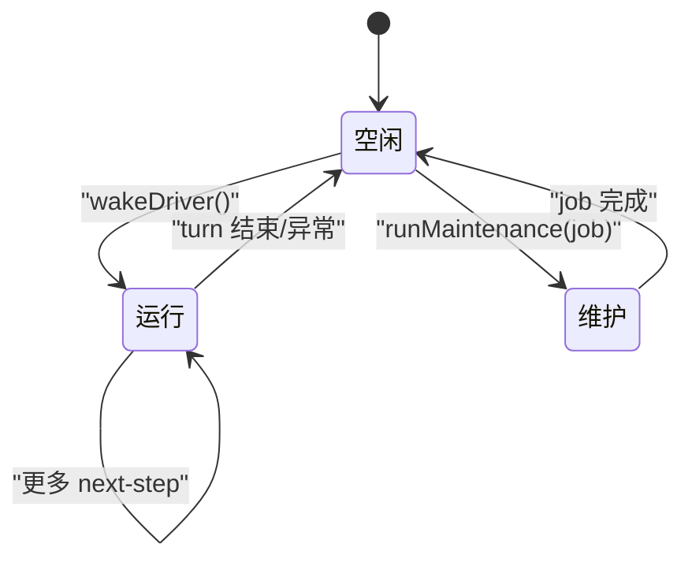
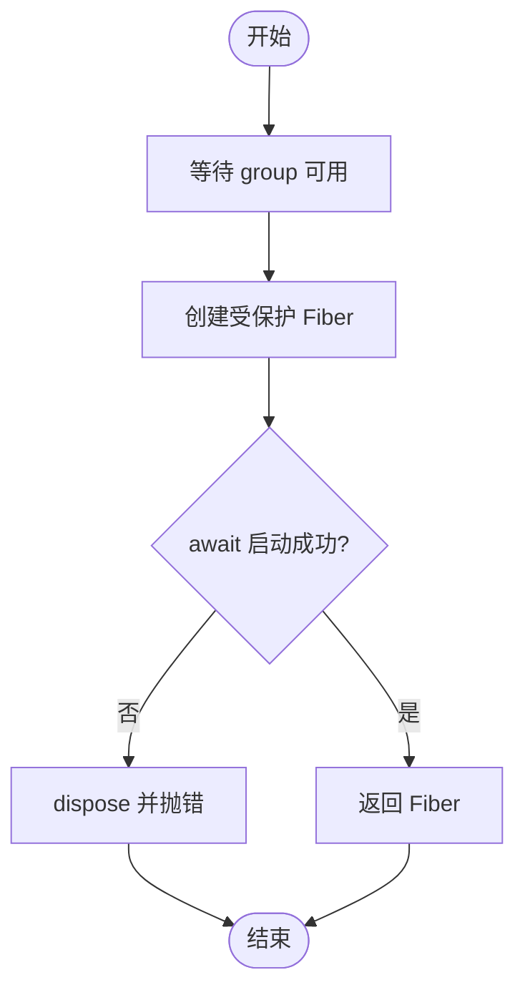
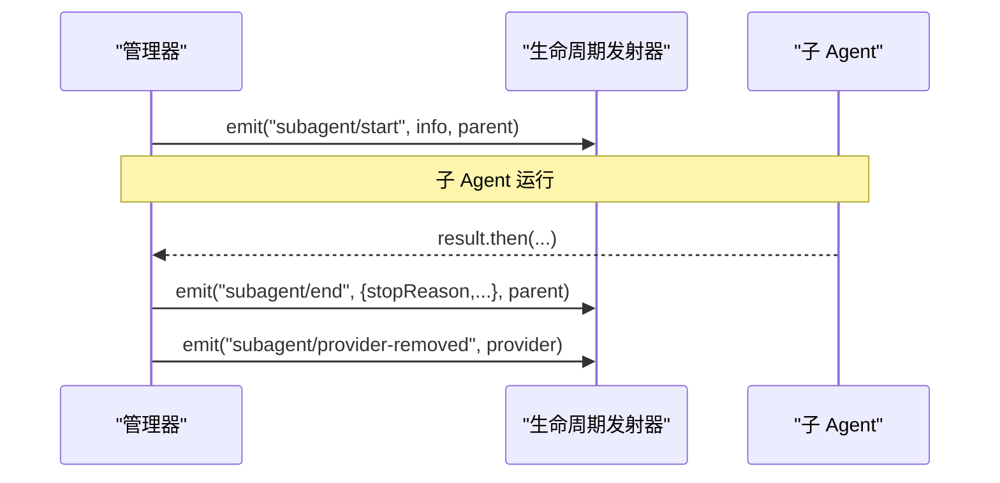
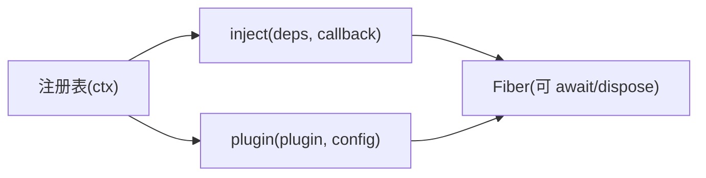
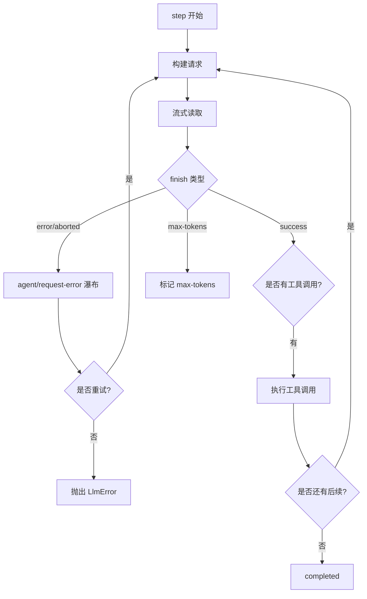
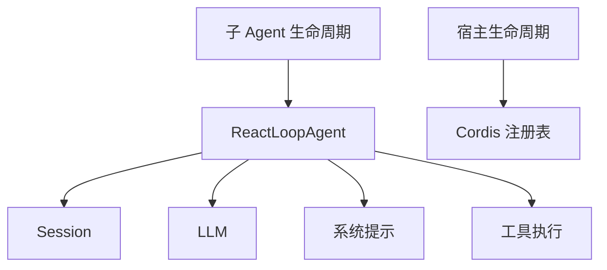

# Agent 生命周期管理

<cite>
**本文引用的文件**
- [packages/core/agent-loop/src/agent.ts](file://packages/core/agent-loop/src/agent.ts)
- [packages/extensions/cordis-host-runner/src/lifecycle.ts](file://packages/extensions/cordis-host-runner/src/lifecycle.ts)
- [packages/subagent/subagent/src/lifecycle.ts](file://packages/subagent/subagent/src/lifecycle.ts)
- [docs/agent-lifecycle.md](file://docs/agent-lifecycle.md)
- [docs/cordis-api/registry.md](file://docs/cordis-api/registry.md)
</cite>

## 目录
1. [简介](#简介)
2. [项目结构](#项目结构)
3. [核心组件](#核心组件)
4. [架构总览](#架构总览)
5. [详细组件分析](#详细组件分析)
6. [依赖关系分析](#依赖关系分析)
7. [性能考虑](#性能考虑)
8. [故障排查指南](#故障排查指南)
9. [结论](#结论)
10. [附录](#附录)

## 简介
本文件系统性阐述 Agent 的完整生命周期：初始化、启动、运行、暂停（取消）、恢复与销毁，覆盖触发条件、执行流程与状态转换；说明 Agent 注册表与动态加载/卸载机制；给出生命周期钩子的使用方式与示例路径；解释错误处理与异常恢复策略；并提供性能监控与资源清理的最佳实践。内容基于仓库中的核心实现与文档进行归纳与可视化。

## 项目结构
围绕 Agent 生命周期涉及的关键位置如下：
- Agent 驱动与轮询循环：packages/core/agent-loop/src/agent.ts
- 宿主侧插件生命周期封装：packages/extensions/cordis-host-runner/src/lifecycle.ts
- 子 Agent 生命周期事件发射器：packages/subagent/subagent/src/lifecycle.ts
- Agent Turn/Step 序列与事件流说明：docs/agent-lifecycle.md
- Cordis 插件注册表与注入能力：docs/cordis-api/registry.md

图表来源
- [packages/core/agent-loop/src/agent.ts:64-193](file://packages/core/agent-loop/src/agent.ts#L64-L193)
- [packages/extensions/cordis-host-runner/src/lifecycle.ts:22-45](file://packages/extensions/cordis-host-runner/src/lifecycle.ts#L22-L45)
- [packages/subagent/subagent/src/lifecycle.ts:100-123](file://packages/subagent/subagent/src/lifecycle.ts#L100-L123)
- [docs/cordis-api/registry.md:8-56](file://docs/cordis-api/registry.md#L8-L56)

章节来源
- [packages/core/agent-loop/src/agent.ts:64-193](file://packages/core/agent-loop/src/agent.ts#L64-L193)
- [packages/extensions/cordis-host-runner/src/lifecycle.ts:22-45](file://packages/extensions/cordis-host-runner/src/lifecycle.ts#L22-L45)
- [packages/subagent/subagent/src/lifecycle.ts:100-123](file://packages/subagent/subagent/src/lifecycle.ts#L100-L123)
- [docs/cordis-api/registry.md:8-56](file://docs/cordis-api/registry.md#L8-L56)

## 核心组件
- ReactLoopAgent：实现 Agent 接口，维护内部阶段（空闲/维护/运行），通过 Inbox 接收消息，驱动 Session 的 turn/step 边界，协调 LLM 请求与工具调用，并暴露 cancel/runMaintenance/whenIdle 等控制面。
- Cordis 宿主生命周期：以 Fiber 为单位安全地启动/停止插件，失败时自动回收，避免悬挂的失败 Fiber。
- 子 Agent 生命周期发射器：为子 Agent 的 start/end/provider-removed 事件提供隔离且可观测的发布通道，保证父子生命周期一致性与容错。
- 注册表与注入：通过 ctx.inject 与 ctx.plugin 声明依赖、加载插件，支持动态替换与按需激活。

章节来源
- [packages/core/agent-loop/src/agent.ts:64-193](file://packages/core/agent-loop/src/agent.ts#L64-L193)
- [packages/extensions/cordis-host-runner/src/lifecycle.ts:22-45](file://packages/extensions/cordis-host-runner/src/lifecycle.ts#L22-L45)
- [packages/subagent/subagent/src/lifecycle.ts:100-123](file://packages/subagent/subagent/src/lifecycle.ts#L100-L123)
- [docs/cordis-api/registry.md:8-56](file://docs/cordis-api/registry.md#L8-L56)

## 架构总览
下图展示从用户输入到 Agent 运行、再到结束的全链路交互，包括钩子与持久化事件。

图表来源
- [docs/agent-lifecycle.md:8-72](file://docs/agent-lifecycle.md#L8-L72)
- [packages/core/agent-loop/src/agent.ts:225-330](file://packages/core/agent-loop/src/agent.ts#L225-L330)
- [packages/core/agent-loop/src/agent.ts:332-401](file://packages/core/agent-loop/src/agent.ts#L332-L401)

## 详细组件分析

### ReactLoopAgent：状态机与生命周期
- 阶段定义
  - idle：空闲，等待唤醒
  - maintenance：维护任务期间，不响应普通工作
  - running：正在执行 turn/step 循环
- 关键方法
  - send/followup/steer/inject：向收件箱投递消息，必要时唤醒驱动
  - cancel：清空收件箱（可选）并中止当前活动
  - runMaintenance：在空闲态执行维护任务，结束后若仍有待处理消息则继续驱动
  - whenIdle：等待当前活动完成
  - wakeDriver：将 idle 转为 running，创建 AbortController 并启动 kick
  - turn：打开 turn/start，循环 preStep/step，记录 step/end/turn/end，处理 max-tokens 粘性语义
  - step：构建请求、流式获取、组装 assistant/message、执行工具调用、处理 request-error 重试
- 状态转换
  - idle -> running：wakeDriver
  - running -> idle：turn 结束或异常后 finally 重置
  - maintenance -> idle：runMaintenance 完成
  - 任意阶段 -> idle：cancel 导致 abort 并在 finally 中复位

图表来源
- [packages/core/agent-loop/src/agent.ts:38-47](file://packages/core/agent-loop/src/agent.ts#L38-L47)
- [packages/core/agent-loop/src/agent.ts:103-111](file://packages/core/agent-loop/src/agent.ts#L103-L111)
- [packages/core/agent-loop/src/agent.ts:142-162](file://packages/core/agent-loop/src/agent.ts#L142-L162)
- [packages/core/agent-loop/src/agent.ts:172-193](file://packages/core/agent-loop/src/agent.ts#L172-L193)
- [packages/core/agent-loop/src/agent.ts:210-223](file://packages/core/agent-loop/src/agent.ts#L210-L223)
- [packages/core/agent-loop/src/agent.ts:246-330](file://packages/core/agent-loop/src/agent.ts#L246-L330)

章节来源
- [packages/core/agent-loop/src/agent.ts:64-193](file://packages/core/agent-loop/src/agent.ts#L64-L193)
- [packages/core/agent-loop/src/agent.ts:210-330](file://packages/core/agent-loop/src/agent.ts#L210-L330)

### 宿主侧插件生命周期：动态加载与卸载
- startHostHalf：在 cordis-dynamic 组 Fiber 上启动受保护插件，await 启动结果；失败时 dispose 并抛出，避免悬挂失败 Fiber；对“已注册”冲突给出替换指引。
- missingServices：列出尚未就绪的 inject 服务名，便于诊断。

图表来源
- [packages/extensions/cordis-host-runner/src/lifecycle.ts:22-45](file://packages/extensions/cordis-host-runner/src/lifecycle.ts#L22-L45)
- [packages/extensions/cordis-host-runner/src/lifecycle.ts:55-57](file://packages/extensions/cordis-host-runner/src/lifecycle.ts#L55-L57)

章节来源
- [packages/extensions/cordis-host-runner/src/lifecycle.ts:22-45](file://packages/extensions/cordis-host-runner/src/lifecycle.ts#L22-L45)
- [packages/extensions/cordis-host-runner/src/lifecycle.ts:55-57](file://packages/extensions/cordis-host-runner/src/lifecycle.ts#L55-L57)

### 子 Agent 生命周期：start/end 与 provider 移除
- createLifecycleEmitter：统一发射 subagent/start、subagent/end、subagent/provider-removed，每个监听器独立捕获异常，不影响其他监听器与主流程。
- observeRun：一次性运行的 start/end 配对，结果完成后发出 end。
- createActivationObserver：可延续激活的生命周期观察，按边界截取事件计算 stopReason，确保冷启动/热恢复场景下 telemetry 准确。

图表来源
- [packages/subagent/subagent/src/lifecycle.ts:100-123](file://packages/subagent/subagent/src/lifecycle.ts#L100-L123)
- [packages/subagent/subagent/src/lifecycle.ts:133-162](file://packages/subagent/subagent/src/lifecycle.ts#L133-L162)
- [packages/subagent/subagent/src/lifecycle.ts:175-217](file://packages/subagent/subagent/src/lifecycle.ts#L175-L217)

章节来源
- [packages/subagent/subagent/src/lifecycle.ts:100-123](file://packages/subagent/subagent/src/lifecycle.ts#L100-L123)
- [packages/subagent/subagent/src/lifecycle.ts:133-162](file://packages/subagent/subagent/src/lifecycle.ts#L133-L162)
- [packages/subagent/subagent/src/lifecycle.ts:175-217](file://packages/subagent/subagent/src/lifecycle.ts#L175-L217)

### 注册表与动态加载/卸载
- ctx.inject：当所需服务可用时运行回调，服务变化时自动重新运行，适合按需装配。
- ctx.plugin：在当前上下文加载插件，支持函数/类/对象三种入口形状，配置校验与生命周期由 Fiber 管理。
- 动态替换：宿主层对“已注册”冲突提供明确替换步骤，避免新旧版本共存导致的命名冲突。

图表来源
- [docs/cordis-api/registry.md:8-56](file://docs/cordis-api/registry.md#L8-L56)
- [packages/extensions/cordis-host-runner/src/lifecycle.ts:22-45](file://packages/extensions/cordis-host-runner/src/lifecycle.ts#L22-L45)

章节来源
- [docs/cordis-api/registry.md:8-56](file://docs/cordis-api/registry.md#L8-L56)
- [packages/extensions/cordis-host-runner/src/lifecycle.ts:22-45](file://packages/extensions/cordis-host-runner/src/lifecycle.ts#L22-L45)

### 生命周期钩子与自定义逻辑
- agent/pre-step：在进入 step 前拦截，可拒绝进入或改写消息与上下文。用于压力控制、注入上下文、策略审查等。
- agent/request：构造请求前拦截，可调整 provider/model/工具集等。
- agent/request-error：模型请求失败时触发，可决定重试或保留错误。
- agent/turn-stopping：turn 即将结束时串行执行检查点，用于收尾或持久化。
- 使用方式：通过 Agent 的事件分发（waterfall/serial）挂载监听器，遵循“幂等、快速、可中断”的原则。

章节来源
- [packages/core/agent-loop/src/agent.ts:225-243](file://packages/core/agent-loop/src/agent.ts#L225-L243)
- [packages/core/agent-loop/src/agent.ts:332-401](file://packages/core/agent-loop/src/agent.ts#L332-L401)
- [docs/agent-lifecycle.md:28-72](file://docs/agent-lifecycle.md#L28-L72)

### 错误处理与异常恢复
- 结构化错误：LLM 错误携带 failure 事实，非 LlmError 会被扁平化为 UNKNOWN 码的错误链。
- 请求错误恢复：通过 agent/request-error 瀑布决定是否重试；若选择重试，则回到 step 循环；否则抛出错误并关闭 turn。
- 取消与中止：AbortController 贯穿 turn/step，任何阶段均可被 cancel 中断；finally 中确保 turn/end 写入。
- 子 Agent 终止原因：依据 epoch 事件后缀推导 stopReason，区分 completed/max-tokens/aborted/error/refusal。

图表来源
- [packages/core/agent-loop/src/agent.ts:332-401](file://packages/core/agent-loop/src/agent.ts#L332-L401)
- [packages/subagent/subagent/src/lifecycle.ts:235-260](file://packages/subagent/subagent/src/lifecycle.ts#L235-L260)

章节来源
- [packages/core/agent-loop/src/agent.ts:302-330](file://packages/core/agent-loop/src/agent.ts#L302-L330)
- [packages/core/agent-loop/src/agent.ts:332-401](file://packages/core/agent-loop/src/agent.ts#L332-L401)
- [packages/subagent/subagent/src/lifecycle.ts:235-260](file://packages/subagent/subagent/src/lifecycle.ts#L235-L260)

## 依赖关系分析
- ReactLoopAgent 依赖：
  - Session：记录 turn/step 边界与事件，作为唯一事实源
  - LLM：流式调用与请求准备
  - 系统提示：组装上下文与工具集
  - 工具执行：有序/并发执行工具调用
- Cordis 宿主：
  - 通过 Fiber 管理插件生命周期，失败即回收
- 子 Agent：
  - 通过生命周期发射器对外暴露 start/end/provider-removed，解耦具体实现

图表来源
- [packages/core/agent-loop/src/agent.ts:64-193](file://packages/core/agent-loop/src/agent.ts#L64-L193)
- [packages/extensions/cordis-host-runner/src/lifecycle.ts:22-45](file://packages/extensions/cordis-host-runner/src/lifecycle.ts#L22-L45)
- [packages/subagent/subagent/src/lifecycle.ts:100-123](file://packages/subagent/subagent/src/lifecycle.ts#L100-L123)

章节来源
- [packages/core/agent-loop/src/agent.ts:64-193](file://packages/core/agent-loop/src/agent.ts#L64-L193)
- [packages/extensions/cordis-host-runner/src/lifecycle.ts:22-45](file://packages/extensions/cordis-host-runner/src/lifecycle.ts#L22-L45)
- [packages/subagent/subagent/src/lifecycle.ts:100-123](file://packages/subagent/subagent/src/lifecycle.ts#L100-L123)

## 性能考虑
- 流式处理：LLM 输出以 chunk 形式追加到 Session，减少内存峰值并提升首字延迟。
- 工具调用批处理：按模型顺序产出结果，结合屏障与有界滚动池，平衡吞吐与稳定性。
- 钩子性能：pre-step/request/request-error 等瀑布应尽快返回，避免阻塞主循环。
- 状态切换最小化：status 仅在变化时广播，降低 UI/SDK 负载。
- 资源清理：所有阶段均通过 AbortController 与 finally 确保及时释放资源，避免悬挂任务。

[本节为通用指导，无需特定文件引用]

## 故障排查指南
- 启动失败：
  - 检查宿主层 startHostHalf 的 await 结果，失败会 dispose 并抛出；若出现“已注册”冲突，按提示先停止旧版本再启动新版本。
- 无法进入 step：
  - 检查 agent/pre-step 是否拒绝进入；确认收件箱是否有 pending 消息。
- 模型请求失败：
  - 查看 agent/request-error 是否返回 retry；若未重试，检查 LLM 适配器与网络。
- 子 Agent 异常：
  - 通过 subagent/end 的 stopReason 判断终止原因；provider-removed 事件用于追踪提供者移除。
- 长时间无响应：
  - 使用 whenIdle 等待活动结束；检查是否存在无限循环的工具调用或未完成的流式读取。

章节来源
- [packages/extensions/cordis-host-runner/src/lifecycle.ts:22-45](file://packages/extensions/cordis-host-runner/src/lifecycle.ts#L22-L45)
- [packages/core/agent-loop/src/agent.ts:225-243](file://packages/core/agent-loop/src/agent.ts#L225-L243)
- [packages/core/agent-loop/src/agent.ts:332-401](file://packages/core/agent-loop/src/agent.ts#L332-L401)
- [packages/subagent/subagent/src/lifecycle.ts:133-162](file://packages/subagent/subagent/src/lifecycle.ts#L133-L162)

## 结论
本仓库通过 ReactLoopAgent 实现了稳健的 Agent 生命周期管理，结合 Cordis 的插件注册表与 Fiber 模型，提供了安全的动态加载/卸载能力；子 Agent 生命周期事件保证了可观测性与一致性。借助丰富的生命周期钩子与结构化错误处理，开发者可在不同阶段插入自定义逻辑并实现可靠的异常恢复。配合流式处理与工具调用优化，系统在性能与稳定性之间取得良好平衡。

[本节为总结性内容，无需特定文件引用]

## 附录
- 术语
  - Turn：一次完整的对话回合，包含一个或多个 Step
  - Step：一次模型调用与可能的工具调用序列
  - 钩子：生命周期中的扩展点，如 pre-step、request、request-error、turn-stopping
- 参考路径
  - 生命周期序列图与事件：docs/agent-lifecycle.md
  - 注册表 API：docs/cordis-api/registry.md
  - Agent 驱动实现：packages/core/agent-loop/src/agent.ts
  - 宿主生命周期：packages/extensions/cordis-host-runner/src/lifecycle.ts
  - 子 Agent 生命周期：packages/subagent/subagent/src/lifecycle.ts

[本节为补充信息，无需特定文件引用]