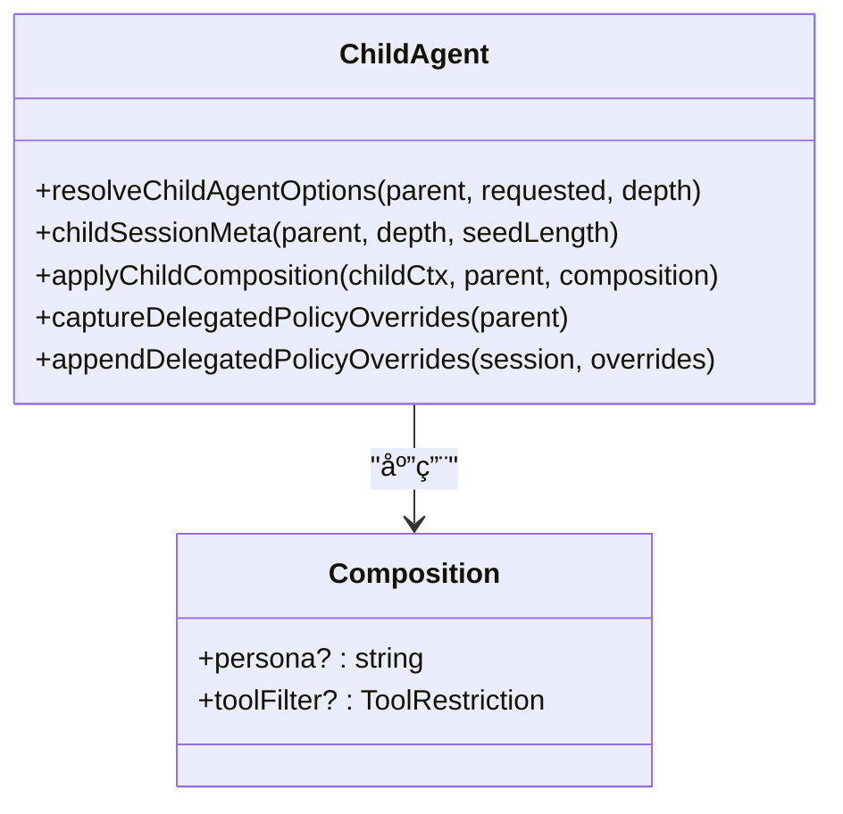

# � Agent 系统

<cite>
**本文引用的文件**
- [packages/subagent/subagent/src/index.ts](file://packages/subagent/subagent/src/index.ts)
- [packages/subagent/subagent/src/types.ts](file://packages/subagent/subagent/src/types.ts)
- [packages/subagent/subagent/src/continuation.ts](file://packages/subagent/subagent/src/continuation.ts)
- [packages/subagent/subagent/src/descriptor.ts](file://packages/subagent/subagent/src/descriptor.ts)
- [packages/subagent/subagent/src/child-agent.ts](file://packages/subagent/subagent/src/child-agent.ts)
- [packages/subagent/subagent-spawn-in-process/src/index.ts](file://packages/subagent/subagent-spawn-in-process/src/index.ts)
- [packages/subagent/tool-subagent/src/index.ts](file://packages/subagent/tool-subagent/src/index.ts)
- [docs/subsystems/subagent.md](file://docs/subsystems/subagent.md)
</cite>

## 目录
1. [简介](#简介)
2. [项目结�](#项目结�)
3. [核心组件](#核心组件)
4. [��总览](#��总览)
5. [详细组件分�](#详细组件分�)
6. [�赖关系分�](#�赖关系分�)
7. [性能考虑](#性能考虑)
8. [故障�查指�](#故障�查指�)
9. [结论](#结论)
10. [附录](#附录)

## 简介
本文件系统性地介�� Agent 系统的���使用方法，�点说�主 Agent 如何创建�管�� Agent，包括：
- � Agent 的继承机制��置传递�作用域隔离
- � Agent 的生命周期�父 Agent 的关系
- � Agent 间的通信�议（消�投递�中断�报告）
- ���制�资��制�安全隔离
- 常�模�示例：并行执行�串行调用�嵌套� Agent
- 错误传播�结���策略
- 性能优化建议�调试技巧

## 项目结�
� Agent 能力由一组包组�，围绕“命��供者注册 + 一次性/�延续� Agent 生命周期管��展开。关键目录��责如下：
- subagent：�务定义�类���行时��延续管�器��述符��代�组�等
- subagent-spawn-in-process / fork-in-process：进程内一次性/�父��派生的�代���
- subagent-acp / codex / claude-code / dsh-sdk：跨进程或外部产��代���
- tool-subagent：��模�的委托工具（��等待/��任务/�延续对�）
- tool-subagent-control / report：�代��制��到父的报告通�

```mermaid
graph TB
A["tool-subagent<br/>模�侧委托工具"] --> B["SubagentRuntime<br/>ctx.subagents"]
B --> C["SubagentContinuationManager<br/>�延续�代�编�"]
B --> D["Provider 注册表<br/>spawn/fork/acp/codex/..."]
C --> E["Activation 生命周期<br/>冷�动/唤醒/�收"]
D --> F["In-process Driver<br/>一次性�行驱动"]
D --> G["Out-of-process 适�器<br/>ACP/Codex/Claude/Dash"]
B --> H["�久化�举<br/>listChildren/listDescendants"]
```

图表��
- [packages/subagent/subagent/src/index.ts:171-497](file://packages/subagent/subagent/src/index.ts#L171-L497)
- [packages/subagent/subagent/src/continuation.ts:349-800](file://packages/subagent/subagent/src/continuation.ts#L349-L800)
- [packages/subagent/subagent-spawn-in-process/src/index.ts:41-64](file://packages/subagent/subagent-spawn-in-process/src/index.ts#L41-L64)
- [packages/subagent/tool-subagent/src/index.ts:267-468](file://packages/subagent/tool-subagent/src/index.ts#L267-L468)

章节��
- [docs/subsystems/subagent.md:1-735](file://docs/subsystems/subagent.md#L1-L735)
- [packages/subagent/subagent/src/index.ts:1-500](file://packages/subagent/subagent/src/index.ts#L1-L500)

## 核心组件
- SubagentRuntime（�务入�）
  - �供 start�startContinuable�followup�interrupt�reportFrom�listChildren�listDescendants�registerProvider 等能力
  - 负责能力校验��述符快照�生命周期事件�射��延续管�器装�
- SubagentContinuationManager（�延续�代�编�）
  - 维护稳定 childId�Activation 驻留期�冷���父�所有�图��优先释放�结算通知
  - 通过 Agent inbox 作为唯一队列，��顺��一致性
- Provider（�代��供者）
  - 声� capabilities�inheritsParentContext，�� start ��选 prepareContinuable
- �述符 Descriptor
  - 版本化的 session 事件，标识 one-shot/continuable ����的组�信�
- �代�组� ChildAgent
  - 深度预算�会�元数��AgentOptions 解��作用域注入（persona�toolFilter）�委派策略��

章节��
- [packages/subagent/subagent/src/index.ts:171-497](file://packages/subagent/subagent/src/index.ts#L171-L497)
- [packages/subagent/subagent/src/continuation.ts:349-800](file://packages/subagent/subagent/src/continuation.ts#L349-L800)
- [packages/subagent/subagent/src/types.ts:19-325](file://packages/subagent/subagent/src/types.ts#L19-L325)
- [packages/subagent/subagent/src/descriptor.ts:1-315](file://packages/subagent/subagent/src/descriptor.ts#L1-L315)
- [packages/subagent/subagent/src/child-agent.ts:1-238](file://packages/subagent/subagent/src/child-agent.ts#L1-L238)

## ��总览
� Agent 系统采用“�务 + �供者 + 编�器�的分层设计：
- 模�侧通过 tool-subagent 暴露统一工具��，选择 provider 并决定��/��/�延续模�
- SubagentRuntime �能力校验��述符快照�事件�射，并将一次性委托交给具体 provider
- �延续�代�由 SubagentContinuationManager 统一管� Activation�冷���消�路由�中断�报告
- �代�会�通过 descriptor �久化身份����组�，支��举�冷�动

```mermaid
sequenceDiagram
participant M as "模�"
participant T as "tool-subagent"
participant R as "SubagentRuntime"
participant P as "Provider"
participant C as "ContinuationManager"
participant S as "Session/Agent"
M->>T : 调用 subagent(�述, �示, 选项)
T->>R : start(name, request) 或 startContinuable(spec)
alt 一次性
R->>P : start(resolvedRequest)
P->>S : 创建� Agent/会�
S-->>P : �布��柄
P-->>R : SubagentRun
R-->>T : 返� run
T->>R : await result()/dispose()
R-->>T : SubagentResult(stopReason, output, structured?)
else �延续
R->>C : startContinuable(spec)
C->>P : prepareContinuable(request)
C->>S : 创建/冷��并投递�始消�
C-->>R : {childId, messageId}
R-->>T : 返��代�ID
T-->>M : 立�返���/�延续
end
```

图表��
- [packages/subagent/tool-subagent/src/index.ts:267-468](file://packages/subagent/tool-subagent/src/index.ts#L267-L468)
- [packages/subagent/subagent/src/index.ts:414-426](file://packages/subagent/subagent/src/index.ts#L414-L426)
- [packages/subagent/subagent/src/continuation.ts:403-457](file://packages/subagent/subagent/src/continuation.ts#L403-L457)
- [packages/subagent/subagent-spawn-in-process/src/index.ts:41-64](file://packages/subagent/subagent-spawn-in-process/src/index.ts#L41-L64)

## 详细组件分�

### 一次性�代�（One-shot）
- 请求�能力校验
  - SubagentStartRequest �带 label�prompt�parent�signal�agentOptions�outputSchema�maxDepth�toolFilter�persona
  - SubagentRuntime.start 在委托�校验 capabilities � maxDepth，生��述符并交由 provider.start
- Provider 契约
  - start 返� SubagentRun；localAgent 表示本地进程�代�；result 承载最终输出� stopReason
- 结æ�œä¸�终止å�Ÿå›
  - SubagentResult.output 为最��空助手消�内容；structured 仅在满足 outputSchema 时存在
  - stopReason 为�并扩展��，未知值视为失败

```mermaid
flowchart TD
Start(["开始: start(name, request)"]) --> CapCheck{"能力校验通过?"}
CapCheck -- � --> Err["抛出 UNSUPPORTED_CAPABILITY"]
CapCheck -- 是 --> Desc["生��述符 snapshot"]
Desc --> CallProvider["调用 provider.start(resolved)"]
CallProvider --> Publish{"是�已�布�会�?"}
Publish -- � --> Cleanup["清�未�布资�并拒�"]
Publish -- 是 --> ReturnRun["返� SubagentRun"]
ReturnRun --> AwaitResult["await result()"]
AwaitResult --> Stop{"stopReason"}
Stop --> |completed| Ok["�功输出/结�化结�"]
Stop --> |aborted/error/max-tokens/refusal| Fail["映射为 isError 并附带部分输出"]
```

图表��
- [packages/subagent/subagent/src/index.ts:414-426](file://packages/subagent/subagent/src/index.ts#L414-L426)
- [packages/subagent/subagent/src/types.ts:217-275](file://packages/subagent/subagent/src/types.ts#L217-L275)
- [packages/subagent/tool-subagent/src/index.ts:112-197](file://packages/subagent/tool-subagent/src/index.ts#L112-L197)

章节��
- [packages/subagent/subagent/src/types.ts:93-158](file://packages/subagent/subagent/src/types.ts#L93-L158)
- [packages/subagent/subagent/src/index.ts:414-426](file://packages/subagent/subagent/src/index.ts#L414-L426)
- [packages/subagent/subagent/src/types.ts:217-275](file://packages/subagent/subagent/src/types.ts#L217-L275)

### �延续�代�（Continuable）
- 概念�状�
  - 一个�久 Session + 至多一个进程内 Activation（驻留期），Activation �能执行多个 FIFO turn
  - 状�：running/waiting/settled，由 Agent �默� ownedChildren 集��导
- �动��续消�
  - startContinuable 预留 childId�快照�述符�准备 provider 的 detached spec�创建/冷��并�交�始消�，返� {childId, messageId}
  - followup 根� Activation 驻留情况入队/唤醒/冷��，确�唯一队列顺�
- 中断�报告
  - interrupt(target, authority) ���立�下� cancel，�等待目标�默
  - reportFrom(child, content, options) 将选定内容以用户消�形�投递给直�父 Agent，支� quiet/wakeup 两�调度策略
- 结算通知
  - 当 Activation 结算时，�父��一���扩展的 runtime 账户消�，说�结��因�最终助手内容

```mermaid
sequenceDiagram
participant P as "父 Agent"
participant R as "SubagentRuntime"
participant C as "ContinuationManager"
participant S as "å­� Agent/Session"
P->>R : startContinuable({provider,label,request,signal})
R->>C : startContinuable(spec)
C->>C : 预留 childId/快照�述符
C->>R : prepareContinuable(provider, req)
R-->>C : ContinuableCreateSpec
C->>S : 创建/冷��并投递�始消�
C-->>R : {childId, messageId}
R-->>P : 返��代�ID
P->>R : followup(parent, childId, content, options)
R->>C : followup(...)
alt 有 Activation
C->>S : 入队/唤醒
else æ—  Activation
C->>S : 冷��并投递
end
C-->>R : accepted messageId
R-->>P : 返� messageId
```

图表��
- [packages/subagent/subagent/src/continuation.ts:403-457](file://packages/subagent/subagent/src/continuation.ts#L403-L457)
- [packages/subagent/subagent/src/continuation.ts:476-505](file://packages/subagent/subagent/src/continuation.ts#L476-L505)
- [packages/subagent/subagent/src/index.ts:212-238](file://packages/subagent/subagent/src/index.ts#L212-L238)

章节��
- [packages/subagent/subagent/src/continuation.ts:1-800](file://packages/subagent/subagent/src/continuation.ts#L1-L800)
- [packages/subagent/subagent/src/index.ts:212-238](file://packages/subagent/subagent/src/index.ts#L212-L238)

### 继承机制��置传递�作用域隔离
- 继承�上下文
  - inheritsParentContext 仅�述“会���是�被播��，�代表工具/�务/��继承
  - fork �端会传入父已完���的�缀作为 seed；spawn �继承会���
- �置传递
  - resolveChildAgentOptions 继承 parent.provider/model/maxTokens，并�被 per-child 覆盖，�时写入 subagentDepth
  - childSessionMeta 记录 cwd�agentPreset�origin�delegationDepth�seedLength
- 作用域隔离
  - applyChildComposition 在�创建窗�中：加入父 preset�注入委派范围�示�按�粒度安装 persona � toolFilter
  - 委派策略��：captureDelegatedPolicyOverrides �� sandbox/mode � approval/policy，并以 source:'delegation' 追加到�日志

图表��
- [packages/subagent/subagent/src/child-agent.ts:68-175](file://packages/subagent/subagent/src/child-agent.ts#L68-L175)
- [packages/subagent/subagent/src/child-agent.ts:199-225](file://packages/subagent/subagent/src/child-agent.ts#L199-L225)

章节��
- [packages/subagent/subagent/src/child-agent.ts:1-238](file://packages/subagent/subagent/src/child-agent.ts#L1-L238)
- [packages/subagent/subagent-spawn-in-process/src/index.ts:41-64](file://packages/subagent/subagent-spawn-in-process/src/index.ts#L41-L64)

### ���制�资��制�安全隔离
- 深度�制
  - resolveChildDepth 基�父 delegationDepth+1 计算，若超过 maxDepth 则抛出 SubagentDepthError
  - 工具层默认 maxDepth=3，�通过�置关闭或交由 provider-managed
- 工具过滤
  - toolFilter 在�创建窗�通过 tools.restrict() 生效，对���性�执行�拦截
- 委派策略
  - �代�的 sandbox/mode � approval/policy 在委派边界固定，�无法自行扩大��
- 安全隔离
  - �代�拥有独立 scope � session，父/兄弟���其内部注册；cold resume 仅�放必�元数�

章节��
- [packages/subagent/subagent/src/child-agent.ts:48-83](file://packages/subagent/subagent/src/child-agent.ts#L48-L83)
- [packages/subagent/tool-subagent/src/index.ts:267-300](file://packages/subagent/tool-subagent/src/index.ts#L267-L300)
- [packages/subagent/subagent/src/child-agent.ts:199-225](file://packages/subagent/subagent/src/child-agent.ts#L199-L225)

### �代�间通信�议
- 消�投递
  - followup 是唯一续命通�，� Agent inbox �队，��顺���观测性
- 中断
  - interrupt 使用 keepInbox=true �消当� turn，已认领工作��入队，空闲�继续处��队消�
- 报告
  - reportFrom 将�代�选定的内容包装为用户消�投递给直�父，quiet �唤醒，wakeup 唤醒父
- 结算通知
  - �代�结算时，runtime �父����扩展的结算消�，说�结��因�最终助手内容

章节��
- [packages/subagent/subagent/src/continuation.ts:507-693](file://packages/subagent/subagent/src/continuation.ts#L507-L693)

### 模�示例
- 并行执行
  - 通过多次调用 ctx.subagents.start 或 startContinuable 并��动多个�代�，�自独立�行�结算
- 串行调用
  - 在��模�下 await run.result，或在�延续模�下先 startContinuable，��次 followup �进
- 嵌套�代�
  - �代�内部�次调用工具进行委托，形�树状层级；通过 listDescendants ��举完整�树

章节��
- [packages/subagent/tool-subagent/src/index.ts:369-430](file://packages/subagent/tool-subagent/src/index.ts#L369-L430)
- [docs/subsystems/subagent.md:287-305](file://docs/subsystems/subagent.md#L287-L305)

### 错误传播�结���
- 一次性�代�
  - � completed 的 stopReason 表示输出�能�完整，工具层将其映射为 isError，并附带部分文本输出
- �延续�代�
  - 中断/冷��/结算�有�确语义；报告�结算消��会改��代� turn 的完�状�
- ��策略
  - ��模�直�收集结�；��/�延续模�通过 job_output 或�续 followup ��中间进展，最终以结算通知汇总

章节��
- [packages/subagent/tool-subagent/src/index.ts:112-197](file://packages/subagent/tool-subagent/src/index.ts#L112-L197)
- [packages/subagent/subagent/src/types.ts:217-275](file://packages/subagent/subagent/src/types.ts#L217-L275)

## �赖关系分�
- 模�耦�
  - tool-subagent �赖 SubagentRuntime � provider；runtime �赖 continuation manager�descriptor�child-agent 组�逻辑
  - � provider（spawn/fork/acp/codex/...）�� SubagentProvider ��，共享�一�务契约
- 外部�赖
  - 会�存储��久化�Agent 循��工具注册�系统�示等通过 Cordis 注入

```mermaid
graph LR
Tool["tool-subagent"] --> Runtime["SubagentRuntime"]
Runtime --> Cont["ContinuationManager"]
Runtime --> Prov["Provider 注册表"]
Prov --> Spawn["spawn-in-process"]
Prov --> Fork["fork-in-process"]
Prov --> ACP["acp"]
Prov --> Codex["codex"]
Prov --> Claude["claude-code"]
Prov --> SDK["dsh-sdk"]
Runtime --> Desc["Descriptor"]
Runtime --> Child["ChildAgent"]
```

图表��
- [packages/subagent/tool-subagent/src/index.ts:267-468](file://packages/subagent/tool-subagent/src/index.ts#L267-L468)
- [packages/subagent/subagent/src/index.ts:171-497](file://packages/subagent/subagent/src/index.ts#L171-L497)
- [packages/subagent/subagent/src/descriptor.ts:1-315](file://packages/subagent/subagent/src/descriptor.ts#L1-L315)
- [packages/subagent/subagent/src/child-agent.ts:1-238](file://packages/subagent/subagent/src/child-agent.ts#L1-L238)

章节��
- [packages/subagent/subagent/src/index.ts:171-497](file://packages/subagent/subagent/src/index.ts#L171-L497)
- [packages/subagent/tool-subagent/src/index.ts:267-468](file://packages/subagent/tool-subagent/src/index.ts#L267-L468)

## 性能考虑
- ���必�的冷��
  - followup 命中已有 Activation 时直�入队/唤醒，�少�建�本
- 批��动
  - 并行 start 多个一次性�代�，利用并�����；注�资�上��令牌预算
- 结�化输出
  - 使用 outputSchema ��少往返�解�开销，但需确� provider 支�
- 工具过滤最�化
  - 仅�许必�工具，�� prompt 大��执行路径��度
- 深度�制
  - ��设置 maxDepth，防止过深嵌套导致资�膨胀

[本节为通用指导，无需特定文件引用]

## 故障�查指�
- 常�问题定�
  - 能力�支�：检查 provider.capabilities �请求字段匹�（如 outputSchema�depthLimit�toolFilter�persona）
  - 深度超�：确认 resolveChildDepth � maxDepth �置
  - 中断无效：确认 authority 是�为 exact live ancestor 或正确的 user parentSessionId
  - 报告未�达：检查 direct parent 是�存活，delivery 策略 quiet/wakeup 是�符�预期
- 诊断手段
  - 使用 listChildren/listDescendants 查看�代�状���置
  - 观察 subagent/start � subagent/end 事件对，核对 provider�id�stopReason
  - 检查 descriptor 是��功写入�会�日志，确���举�冷��

章节��
- [packages/subagent/subagent/src/index.ts:481-496](file://packages/subagent/subagent/src/index.ts#L481-L496)
- [packages/subagent/subagent/src/continuation.ts:528-568](file://packages/subagent/subagent/src/continuation.ts#L528-L568)
- [packages/subagent/subagent/src/descriptor.ts:259-315](file://packages/subagent/subagent/src/descriptor.ts#L259-L315)

## 结论
� Agent 系统通过清晰的�务契约���拔的�供者�强大的�延续编�，��了�活�安全��扩展的�代�能力。借助�述符�会��久化，系统支�冷����举；通过深度�制�工具过滤�委派策略��，�障���资�隔离。结���/��/�延续三�模�，�满足并行�串行�嵌套等多�业务场景。

[本节为总结性内容，无需特定文件引用]

## 附录
- 常用 API 速览
  - 一次性：ctx.subagents.start(name, request) → SubagentRun → result()/dispose()
  - �延续：ctx.subagents.startContinuable(spec) → {childId, messageId}
  - �续消�：ctx.subagents.followup(parent, childId, content, options)
  - 中断：ctx.subagents.interrupt(targetSessionId, authority)
  - 报告：ctx.subagents.reportFrom(child, content, options)
  - �举：ctx.subagents.listChildren(parentSessionId), listDescendants(rootSessionId)

章节��
- [packages/subagent/subagent/src/index.ts:212-360](file://packages/subagent/subagent/src/index.ts#L212-L360)
- [docs/subsystems/subagent.md:478-649](file://docs/subsystems/subagent.md#L478-L649)