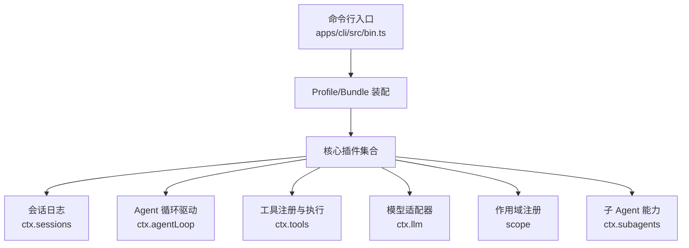
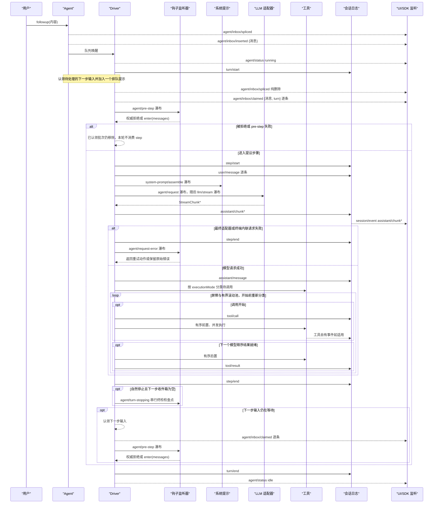
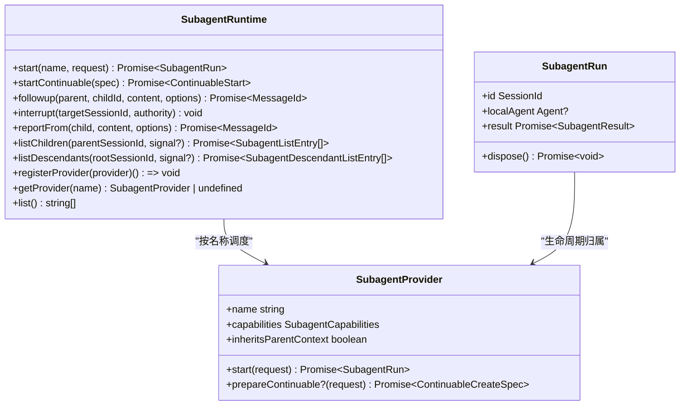
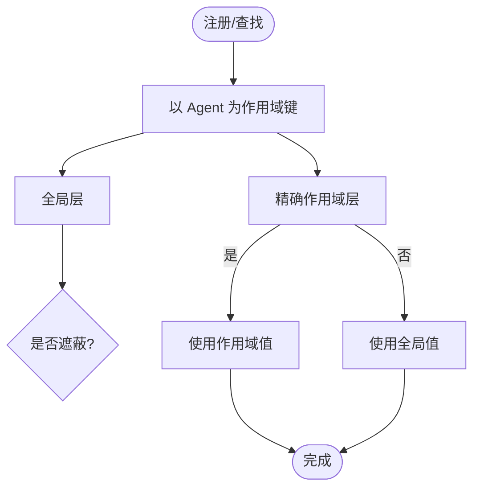
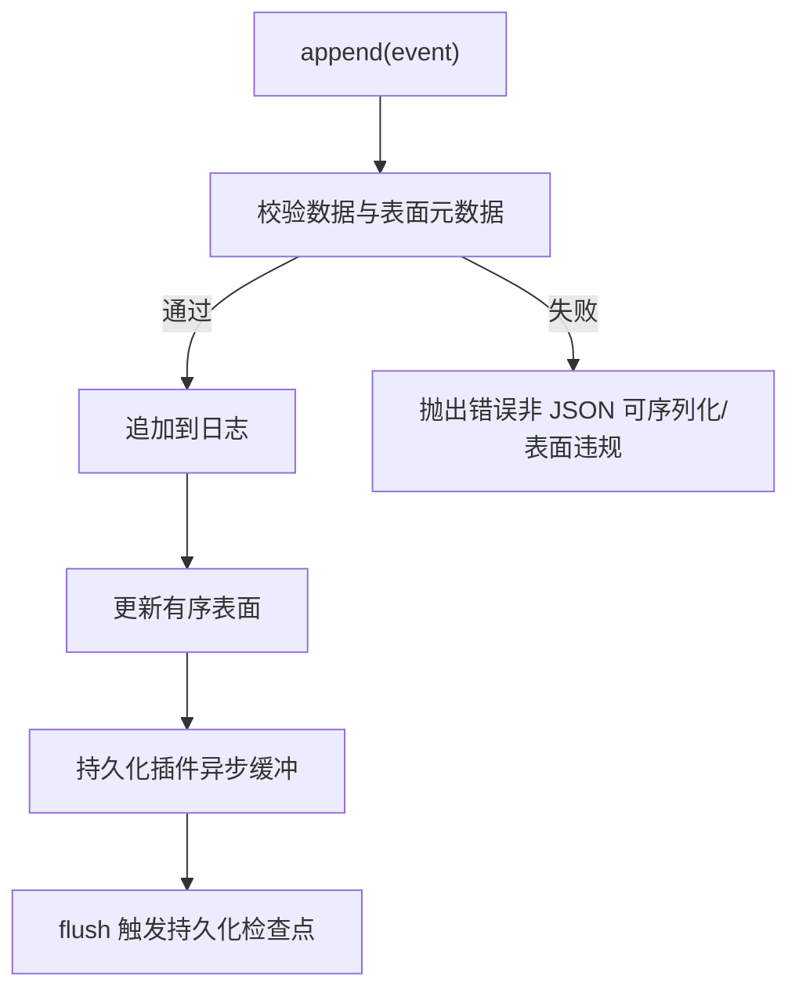
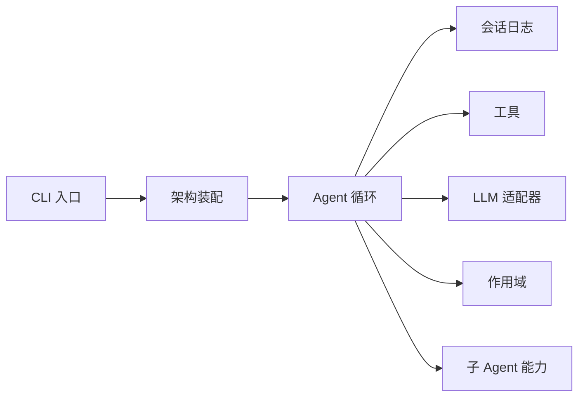

# 智能体系统

<cite>
**本文引用的文件**
- [apps/cli/src/bin.ts](file://apps/cli/src/bin.ts)
- [docs/architecture.md](file://docs/architecture.md)
- [docs/subsystems/subagent.md](file://docs/subsystems/subagent.md)
- [docs/subsystems/scope.md](file://docs/subsystems/scope.md)
- [docs/subsystems/session.md](file://docs/subsystems/session.md)
</cite>

## 目录
1. [简介](#简介)
2. [项目结构](#项目结构)
3. [核心组件](#核心组件)
4. [架构总览](#架构总览)
5. [详细组件分析](#详细组件分析)
6. [依赖关系分析](#依赖关系分析)
7. [性能考量](#性能考量)
8. [故障排查指南](#故障排查指南)
9. [结论](#结论)
10. [附录](#附录)

## 简介
本文件系统性介绍 DeepSeek Harness 的智能体（Agent）系统，覆盖 Agent 的创建、配置、生命周期管理、销毁；主 Agent 与子 Agent 的关系、继承与组合模式、Agent 间通信机制；作用域管理、状态持久化、错误处理与恢复；以及 Web、CLI、无头三种运行模式的实现要点。同时给出与工具集成、自定义行为扩展、性能优化建议与最佳实践。

## 项目结构
DeepSeek Harness 基于 Cordis 插件体系组织：每个能力以“服务定义 + 服务提供者 + 消费者”的接缝形式存在，通过配置层叠加形成最终运行态。Agent 循环、会话日志、工具注册、LLM 适配器等均为可替换插件。CLI 入口按模式动态加载不同启动流程，Web 与 Headless 作为模板 profile 提供开箱即用组合。

图表来源
- [apps/cli/src/bin.ts:1-54](file://apps/cli/src/bin.ts#L1-L54)
- [docs/architecture.md:15-51](file://docs/architecture.md#L15-L51)

章节来源
- [docs/architecture.md:15-51](file://docs/architecture.md#L15-L51)
- [apps/cli/src/bin.ts:1-54](file://apps/cli/src/bin.ts#L1-L54)

## 核心组件
- Agent 与 Agent 循环：负责轮询收件箱、组装提示词、发起模型请求、编排工具调用、维护 turn/step 边界与状态事件。
- 会话日志：以追加式事件为唯一事实源，衍生模型历史、回放、持久化与恢复。
- 工具系统：按作用域注册、受控执行、结果回写与会话事件记录。
- 子 Agent：支持一次性委托与可延续后台子 Agent，具备能力发现、描述符、冷启动恢复、中断与报告通道。
- 作用域：以 Agent 对象为键的注册上下文，提供按 Agent 可见性与共享生命周期管理能力。
- 运行时模式：CLI 入口根据参数选择 profile 与启动路径，支撑 Web、Headless 等模式。

章节来源
- [docs/architecture.md:39-128](file://docs/architecture.md#L39-L128)
- [docs/subsystems/session.md:1-125](file://docs/subsystems/session.md#L1-L125)
- [docs/subsystems/subagent.md:1-10](file://docs/subsystems/subagent.md#L1-L10)
- [docs/subsystems/scope.md:1-60](file://docs/subsystems/scope.md#L1-L60)

## 架构总览
下图展示一次完整 Turn 的关键交互：从用户输入进入 Agent 收件箱，到 Driver 驱动 step、LLM 流式响应、工具调用与结果回写，再到 Turn 结束与状态更新。

图表来源
- [docs/architecture.md:63-90](file://docs/architecture.md#L63-L90)

章节来源
- [docs/architecture.md:63-90](file://docs/architecture.md#L63-L90)

## 详细组件分析

### Agent 创建、配置与生命周期
- 创建与装配：通过 Cordis profile/bundle 将插件树组合，Agent 循环由默认驱动实现，会话由 ctx.sessions 管理。
- 配置来源：profile 声明 bundle 列表与 patch，bundle 提供配置行与挂载代码；可通过 --dump-config 查看实际装配。
- 生命周期：
  - 启动：Driver 打开 turn，认领输入，组装提示与工具 schema，进入 step。
  - 运行：LLM 流式输出写入 assistant/chunk，最终汇聚为 assistant/message；工具调用产生 tool/call 与 tool/result。
  - 结束：step/end、turn/end，必要时触发 agent/turn-stopping 进行终检检查点。
- 销毁：当 Agent 所在 fiber 卸载时，会话与注册一并清理；子 Agent 的 Activation 在子级全部处置后释放父级所有权。

章节来源
- [docs/architecture.md:15-51](file://docs/architecture.md#L15-L51)
- [docs/architecture.md:63-90](file://docs/architecture.md#L63-L90)
- [docs/subsystems/session.md:577-599](file://docs/subsystems/session.md#L577-L599)

### 主 Agent 与子 Agent：关系、继承与组合
- 子 Agent 能力：通过 ctx.subagents 注册多个 provider（如 spawn、fork、acp 等），支持一次性委托与可延续后台子 Agent。
- 能力发现：provider 在 start 前声明静态 capabilities；可延续能力通过是否存在 prepareContinuable 方法判定。
- 描述符与冷启动：continuable 子 Agent 使用持久化描述符（含 provider/model/persona/toolFilter 快照），冷启动时由管理器重建 Activation 并投递初始提示。
- 继承与组合：
  - fork 后端可注入父会话的已完成前缀作为种子，使子 Agent 看到父对话上下文。
  - 子 Agent 拥有独立扁平作用域，不直接继承父注册；通过 persona 与 toolFilter 实现细粒度定制。
- 通信与控制：
  - 后续消息通过 followup 投递至子 Agent 收件箱，遵循 FIFO 顺序。
  - 中断通过 interrupt 授权后取消当前 turn，未认领工作保留，已认领不重入。
  - 子 Agent 可通过 reportFrom 向直接父 Agent 发送报告，支持 quiet/wakeup 两种投递策略。

图表来源
- [docs/subsystems/subagent.md:478-649](file://docs/subsystems/subagent.md#L478-L649)

章节来源
- [docs/subsystems/subagent.md:11-101](file://docs/subsystems/subagent.md#L11-L101)
- [docs/subsystems/subagent.md:114-159](file://docs/subsystems/subagent.md#L114-L159)
- [docs/subsystems/subagent.md:287-305](file://docs/subsystems/subagent.md#L287-L305)
- [docs/subsystems/subagent.md:308-405](file://docs/subsystems/subagent.md#L308-L405)
- [docs/subsystems/subagent.md:406-469](file://docs/subsystems/subagent.md#L406-L469)

### 作用域管理与注册隔离
- 作用域键：以 Agent 对象为不可透传的标识，用于按 Agent 可见性过滤注册。
- 注册上下文：Scope 提供 ctx 与 dispose/rawDispose，确保按 Agent 生命周期的有序清理。
- 分层合并：ScopedLayers 维护全局层与精确作用域层，读取时按插入顺序合并，允许作用域遮蔽全局注册。

图表来源
- [docs/subsystems/scope.md:9-60](file://docs/subsystems/scope.md#L9-L60)

章节来源
- [docs/subsystems/scope.md:9-60](file://docs/subsystems/scope.md#L9-L60)

### 状态持久化、恢复与回放
- 事件溯源：Session 是追加式事件日志，所有模型可见输入必须可重构于日志中。
- 表面投影：user/message、assistant/message、tool/result 构成有序表面，deriveMessages 生成模型历史。
- 首活边界：session/end-seed 标记种子与实时写入的分界，便于崩溃恢复与回放。
- 持久化契约：所有 event.data 必须可 JSON 序列化；seq 连续，chunk 不得丢弃；后端可按自身编码存储但 load 需还原原事件。
- 恢复与分支：fork 接受稳定边界（通常为 turn 之间），创建子会话；resume 通过 fromRestore 恢复 detached session。

图表来源
- [docs/subsystems/session.md:21-125](file://docs/subsystems/session.md#L21-L125)
- [docs/subsystems/session.md:152-192](file://docs/subsystems/session.md#L152-L192)
- [docs/subsystems/session.md:194-357](file://docs/subsystems/session.md#L194-L357)
- [docs/subsystems/session.md:577-605](file://docs/subsystems/session.md#L577-L605)

章节来源
- [docs/subsystems/session.md:21-125](file://docs/subsystems/session.md#L21-L125)
- [docs/subsystems/session.md:152-192](file://docs/subsystems/session.md#L152-L192)
- [docs/subsystems/session.md:194-357](file://docs/subsystems/session.md#L194-L357)
- [docs/subsystems/session.md:577-605](file://docs/subsystems/session.md#L577-L605)

### 错误处理与恢复机制
- 请求错误：agent/request-error 瀑布允许拦截并重试或保留错误；dsh-compaction-basic 在特定条件下进行工具结果裁剪与摘要选择。
- 终止原因：turn/end 携带 TurnEndReasonMap，区分 completed、aborted、blocked、error、max-tokens、interrupted。
- 子 Agent 终止：SubagentStopReasonMap 包含 completed、aborted、error、max-tokens、refusal；非 completed 表示输出可能不完整。
- 崩溃恢复：persistence 在重载时关闭孤儿 turn；session/end-seed 帮助识别种子与实时写入边界。

章节来源
- [docs/architecture.md:63-90](file://docs/architecture.md#L63-L90)
- [docs/subsystems/session.md:540-576](file://docs/subsystems/session.md#L540-L576)
- [docs/subsystems/subagent.md:308-359](file://docs/subsystems/subagent.md#L308-L359)

### 运行模式：Web、CLI、无头
- CLI 入口：按解析出的 mode 动态导入对应启动模块（profile、plugin、dump-config），仅有效模式进入分支。
- Web 模式：通过 web profile 装配浏览器应用与相关插件。
- 无头模式：headless profile 提供无需服务器的单次运行器。

章节来源
- [apps/cli/src/bin.ts:1-54](file://apps/cli/src/bin.ts#L1-L54)
- [docs/architecture.md:15-37](file://docs/architecture.md#L15-L37)

### 与工具的集成与自定义行为
- 工具注册：通过 ctx.tools 注册工具，schema 参与提示词组装；执行管道受控，结果回写 tool/result。
- 拦截点：tools/pre-execute、tools/execute、tools/post-execute 为瀑布事件，可注入审计、限流、重写逻辑。
- 自定义 Agent：通过 agent/* 事件（如 agent/pre-step、agent/request、agent/turn-stopping）拦截与改写行为；使用 agent.inject() 注入上下文。

章节来源
- [docs/architecture.md:98-128](file://docs/architecture.md#L98-L128)

## 依赖关系分析
- Agent 循环依赖会话日志、工具、LLM 适配器与作用域；子 Agent 通过 ctx.subagents 接入多种后端。
- 会话日志为所有回放、持久化、遥测的基础；工具与 LLM 产生的事件均落盘。
- CLI 入口仅做模式分发，具体行为由 profile/bundle 装配决定。

图表来源
- [apps/cli/src/bin.ts:1-54](file://apps/cli/src/bin.ts#L1-L54)
- [docs/architecture.md:39-128](file://docs/architecture.md#L39-L128)

章节来源
- [docs/architecture.md:39-128](file://docs/architecture.md#L39-L128)

## 性能考量
- 流式输出：LLM 流式 chunk 先写入日志再聚合为消息，减少阻塞并提升 UI 响应。
- 工具并发：在屏障与有界滚动池约束下并发执行工具，兼顾吞吐与安全。
- 作用域缓存：作用域层按需惰性创建，避免不必要的开销；查询时按插入顺序合并，命中作用域遮蔽。
- 子 Agent 冷启动：通过描述符与持久化快速恢复，Activation 驻留期间复用 AgentHandle 与收件箱队列。
- 持久化缓冲：append 热路径不阻塞 I/O，由插件异步缓冲并在 flush 时落盘。

[本节为通用指导，不直接分析具体文件]

## 故障排查指南
- 无法进入 step：检查 agent/pre-step 是否被权威拒绝或改写为空；确认 claimed 批次是否正确移除。
- 模型请求失败：订阅 agent/request-error 瀑布，判断是否可重试；关注 dsh-compaction-basic 的裁剪与摘要选择逻辑。
- 子 Agent 无法恢复：确认描述符版本与字段完整性；检查 cold resume 是否成功重建 Activation 并投递初始提示。
- 中断无效：验证 interrupt 的 authority（user/ancestor）是否匹配目标；注意未认领工作保留、已认领不重入。
- 持久化不一致：确保 event.data 可 JSON 序列化；检查 seq 连续性；利用 session/end-seed 定位种子与实时写入边界。

章节来源
- [docs/architecture.md:63-90](file://docs/architecture.md#L63-L90)
- [docs/subsystems/session.md:577-605](file://docs/subsystems/session.md#L577-L605)
- [docs/subsystems/subagent.md:114-159](file://docs/subsystems/subagent.md#L114-L159)

## 结论
DeepSeek Harness 的智能体系统以 Cordis 插件为核心，围绕 Agent 循环、会话日志、工具与子 Agent 能力构建可扩展、可回放、可恢复的运行环境。通过作用域隔离与描述符持久化，系统在复杂场景下保持清晰的职责边界与稳定的生命周期管理。结合 CLI/Web/Headless 多模式支持与丰富的扩展点，开发者可以灵活定制 Agent 行为并与工具深度集成。

[本节为总结，不直接分析具体文件]

## 附录
- 推荐实践
  - 将模型可见输入设计为新的 SessionEvent，保证可重构性。
  - 使用 agent/pre-step 与 tools/* 瀑布进行可控拦截与增强。
  - 对子 Agent 使用描述符与冷启动恢复，避免状态丢失。
  - 通过作用域注册实现按 Agent 的隔离与共享。
  - 在关键路径调用 flush 确保检查点落地。

[本节为通用指导，不直接分析具体文件]