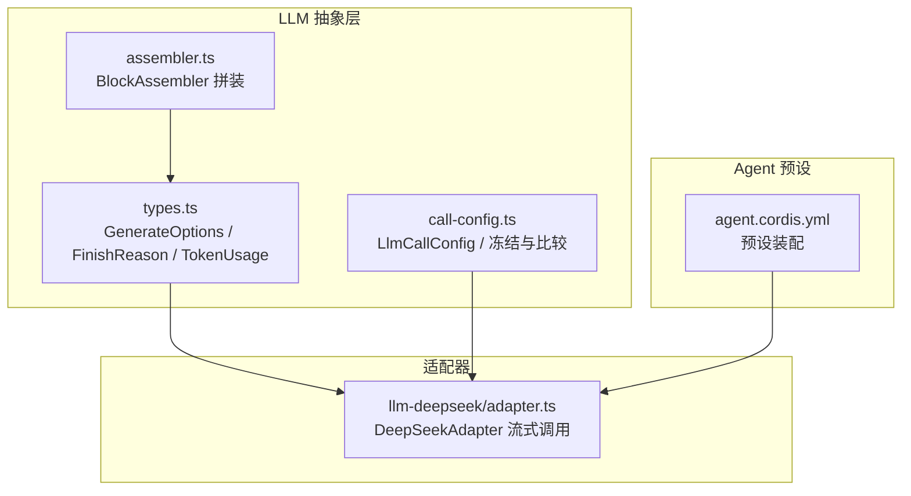
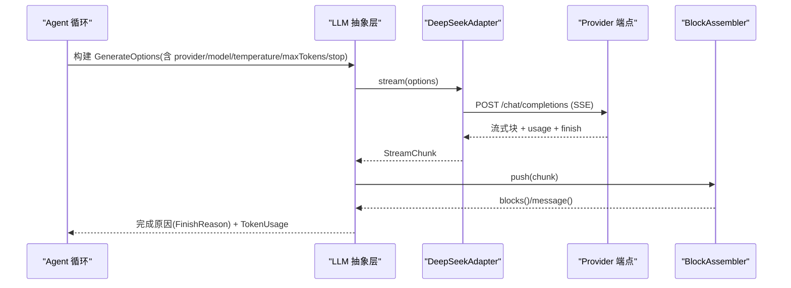
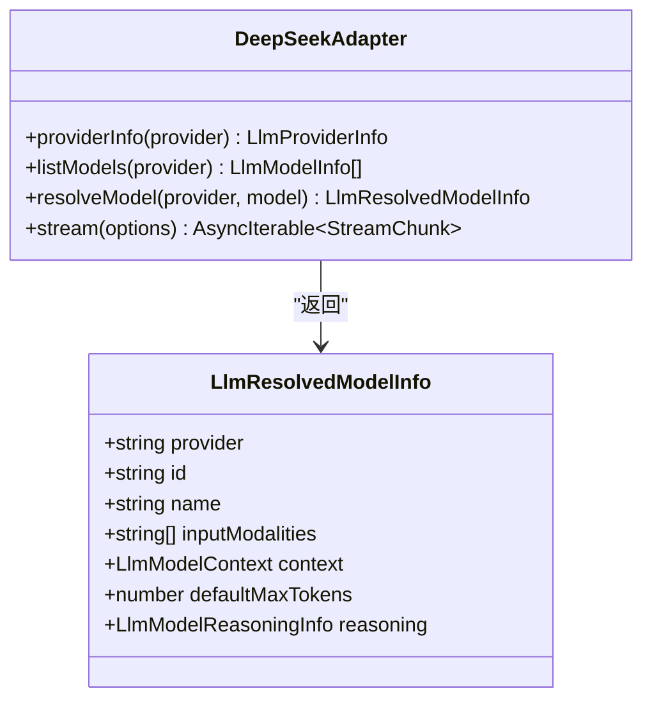
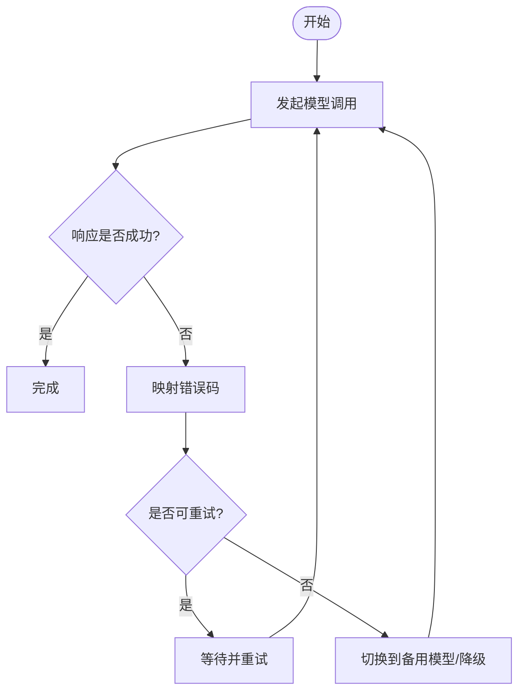
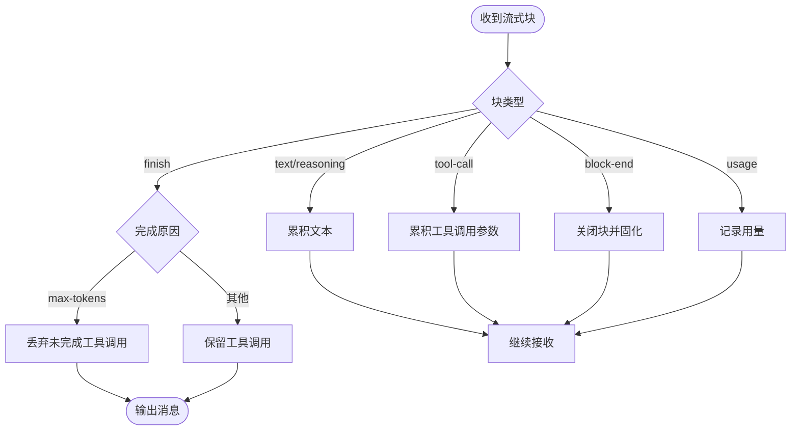
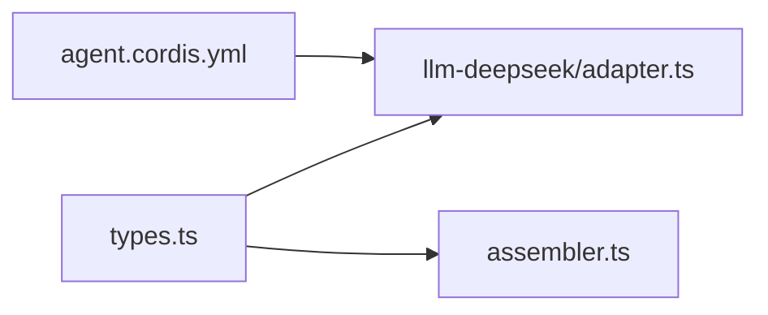

# 模型选择与配置

<cite>
**本文引用的文件**
- [packages/llm/llm/src/call-config.ts](file://packages/llm/llm/src/call-config.ts)
- [packages/llm/llm/src/types.ts](file://packages/llm/llm/src/types.ts)
- [packages/llm/llm-deepseek/src/adapter.ts](file://packages/llm/llm-deepseek/src/adapter.ts)
- [packages/llm/llm/src/assembler.ts](file://packages/llm/llm/src/assembler.ts)
- [apps/cli/config/agent-presets/code/agent.cordis.yml](file://apps/cli/config/agent-presets/code/agent.cordis.yml)
- [apps/cli/config/agent-presets/standard/preset.yml](file://apps/cli/config/agent-presets/standard/preset.yml)
- [docs/subsystems/token-meter.md](file://docs/subsystems/token-meter.md)
</cite>

## 目录
1. [简介](#简介)
2. [项目结构](#项目结构)
3. [核心组件](#核心组件)
4. [架构总览](#架构总览)
5. [详细组件分析](#详细组件分析)
6. [依赖关系分析](#依赖关系分析)
7. [性能考量](#性能考量)
8. [故障排查指南](#故障排查指南)
9. [结论](#结论)
10. [附录：配置示例与最佳实践](#附录：配置示例与最佳实践)

## 简介
本章节面向 Agent 的模型选择与配置机制，说明如何为不同 Agent 实例选择合适的 LLM 模型，包括模型参数（温度、最大令牌数）、推理强度、停止序列等；阐述多模型支持与负载均衡思路；给出 YAML 与编程接口层面的配置要点；解释回退与故障转移策略；并提供基于 Token 用量与流式完成原因的监控与调优建议。

## 项目结构
围绕模型选择与配置的关键代码集中在 LLM 抽象层、适配器实现以及 Agent 预设配置中：
- LLM 抽象层定义请求选项、完成原因、Token 用量、模型元数据等统一类型，确保上层调用与下游适配器解耦。
- DeepSeek 适配器将统一的 GenerateOptions 序列化为具体协议请求，并处理流式响应、超时、错误码映射与重试策略。
- Agent 预设通过 Cordis 配置文件组织工具、技能、工作流等能力，其中包含对模型呈现与系统提示的注入点。
- 组装器负责将流式块拼装为最终消息，并在达到最大令牌限制时安全丢弃不完整的工具调用。

图表来源
- [packages/llm/llm/src/types.ts:319-356](file://packages/llm/llm/src/types.ts#L319-L356)
- [packages/llm/llm/src/call-config.ts:23-39](file://packages/llm/llm/src/call-config.ts#L23-L39)
- [packages/llm/llm/src/assembler.ts:36-164](file://packages/llm/llm/src/assembler.ts#L36-L164)
- [packages/llm/llm-deepseek/src/adapter.ts:158-212](file://packages/llm/llm-deepseek/src/adapter.ts#L158-L212)
- [apps/cli/config/agent-presets/code/agent.cordis.yml:29-40](file://apps/cli/config/agent-presets/code/agent.cordis.yml#L29-L40)

章节来源
- [packages/llm/llm/src/types.ts:319-356](file://packages/llm/llm/src/types.ts#L319-L356)
- [packages/llm/llm/src/call-config.ts:23-39](file://packages/llm/llm/src/call-config.ts#L23-L39)
- [packages/llm/llm/src/assembler.ts:36-164](file://packages/llm/llm/src/assembler.ts#L36-L164)
- [packages/llm/llm-deepseek/src/adapter.ts:158-212](file://packages/llm/llm-deepseek/src/adapter.ts#L158-L212)
- [apps/cli/config/agent-presets/code/agent.cordis.yml:29-40](file://apps/cli/config/agent-presets/code/agent.cordis.yml#L29-L40)

## 核心组件
- 生成选项与模型元数据：Define provider/model/reasoningEffort/temperature/maxTokens/stop/messages/system/tools/sessionId/purpose 等字段，用于一次模型调用。
- 完成原因与 Token 用量：统一 finish reason（stop/tool-calls/max-tokens/aborted/error）与 token 用量统计，便于监控与计费。
- 调用配置比较与冻结：保证同一会话内请求头稳定，避免缓存失效；提供 deepFreeze 防止意外变更。
- 适配器：以 DeepSeek 为例，将统一请求转为 HTTP/SSE 流，处理默认上下文窗口、默认 maxTokens、推理强度、重试策略、错误码映射与超时。
- 流式组装：将块增量拼装为完整消息，遇到 max-tokens 终止时丢弃不安全的工具调用。

章节来源
- [packages/llm/llm/src/types.ts:116-141](file://packages/llm/llm/src/types.ts#L116-L141)
- [packages/llm/llm/src/types.ts:319-356](file://packages/llm/llm/src/types.ts#L319-L356)
- [packages/llm/llm/src/call-config.ts:23-39](file://packages/llm/llm/src/call-config.ts#L23-L39)
- [packages/llm/llm/src/call-config.ts:49-59](file://packages/llm/llm/src/call-config.ts#L49-L59)
- [packages/llm/llm/src/call-config.ts:88-117](file://packages/llm/llm/src/call-config.ts#L88-L117)
- [packages/llm/llm-deepseek/src/adapter.ts:171-212](file://packages/llm/llm-deepseek/src/adapter.ts#L171-L212)
- [packages/llm/llm/src/assembler.ts:134-139](file://packages/llm/llm/src/assembler.ts#L134-L139)

## 架构总览
下图展示从 Agent 到适配器的模型调用流程，涵盖配置解析、参数传递、流式响应与完成原因处理。

图表来源
- [packages/llm/llm/src/types.ts:319-356](file://packages/llm/llm/src/types.ts#L319-L356)
- [packages/llm/llm-deepseek/src/adapter.ts:214-269](file://packages/llm/llm-deepseek/src/adapter.ts#L214-L269)
- [packages/llm/llm/src/assembler.ts:47-94](file://packages/llm/llm/src/assembler.ts#L47-L94)

## 详细组件分析

### 模型选择策略与多模型支持
- 模型发现与元数据：适配器暴露 listModels 与 resolveModel，返回模型 ID、名称、描述、输入模态、上下文窗口、默认 maxTokens 与推理强度集合。未显式声明的模型也会按文本模式兜底。
- 推理强度：根据配置决定是否暴露“关闭/高/最大”等推理级别，并可设置默认值。
- 多模型路由：通过 provider 路由选择适配器实例；每个适配器可管理多个 model id，由上层根据任务类型、性能与成本进行调度。

图表来源
- [packages/llm/llm/src/types.ts:232-281](file://packages/llm/llm/src/types.ts#L232-L281)
- [packages/llm/llm-deepseek/src/adapter.ts:171-212](file://packages/llm/llm-deepseek/src/adapter.ts#L171-L212)

章节来源
- [packages/llm/llm-deepseek/src/adapter.ts:171-212](file://packages/llm/llm-deepseek/src/adapter.ts#L171-L212)
- [packages/llm/llm/src/types.ts:232-281](file://packages/llm/llm/src/types.ts#L232-L281)

### 模型参数与采样控制
- 温度 temperature：影响输出随机性，适合创意类任务提高创造性，降低以提高稳定性。
- 最大令牌数 maxTokens：控制单次输出上限；当达到上限时，完成原因为 max-tokens，且不会执行不完整的工具调用。
- 停止序列 stop：命中任意停止字符串即结束生成，常用于结构化输出或分隔符。
- 推理强度 reasoningEffort：在适配器层面暴露可选级别与默认值，平衡质量与延迟。

章节来源
- [packages/llm/llm/src/types.ts:319-356](file://packages/llm/llm/src/types.ts#L319-L356)
- [packages/llm/llm/src/assembler.ts:134-139](file://packages/llm/llm/src/assembler.ts#L134-L139)
- [packages/llm/llm-deepseek/src/adapter.ts:194-212](file://packages/llm/llm-deepseek/src/adapter.ts#L194-L212)

### 多模型支持与负载均衡
- 多模型支持：通过 provider 路由与模型列表，可在同一部署中注册多个模型；上层可根据任务类型（如代码生成、摘要、检索增强）选择合适模型。
- 负载均衡思路：
  - 基于任务类型的静态路由：例如复杂推理使用高推理强度模型，简单问答使用轻量模型。
  - 基于性能的动态路由：结合 TTFT、吞吐、缓存命中率等指标，优先选择低延迟模型。
  - 基于成本的动态路由：在满足质量阈值的前提下，优先选择低成本模型。
  - 健康检查与熔断：对上游返回的错误码（如配额超限、速率限制、服务器错误）进行识别，触发回退。

[本节为概念性说明，不直接分析具体文件]

### 模型回退与故障转移
- 错误码映射：适配器将 HTTP 状态与提供商错误体映射为稳定错误码（如 AUTH、RATE_LIMIT、CONTEXT_WINDOW_EXCEEDED、QUOTA_EXCEEDED、SERVER），便于上层策略决策。
- 重试策略：适配器暴露 providerRetryPolicy，可由上层根据错误码与 provider 建议的重试间隔进行重试。
- 超时保护：流式读取具备空闲超时，避免长时间无响应导致资源占用。
- 回退路径：当主模型不可用或频繁失败时，可切换至备用模型或降级策略（如减少推理强度、缩短输出长度）。

图表来源
- [packages/llm/llm-deepseek/src/adapter.ts:138-149](file://packages/llm/llm-deepseek/src/adapter.ts#L138-L149)
- [packages/llm/llm-deepseek/src/adapter.ts:214-269](file://packages/llm/llm-deepseek/src/adapter.ts#L214-L269)

章节来源
- [packages/llm/llm-deepseek/src/adapter.ts:138-149](file://packages/llm/llm-deepseek/src/adapter.ts#L138-L149)
- [packages/llm/llm-deepseek/src/adapter.ts:214-269](file://packages/llm/llm-deepseek/src/adapter.ts#L214-L269)

### 流式组装与最大令牌截断
- 流式块拼装：BlockAssembler 接收 block-start/text-delta/tool-call-delta/block-end/usage/finish 等块，逐步组装为最终消息。
- 最大令牌截断：当 finish 原因为 max-tokens 时，丢弃不完整的工具调用，避免执行不安全操作。

图表来源
- [packages/llm/llm/src/assembler.ts:47-94](file://packages/llm/llm/src/assembler.ts#L47-L94)
- [packages/llm/llm/src/assembler.ts:134-139](file://packages/llm/llm/src/assembler.ts#L134-L139)

章节来源
- [packages/llm/llm/src/assembler.ts:47-94](file://packages/llm/llm/src/assembler.ts#L47-L94)
- [packages/llm/llm/src/assembler.ts:134-139](file://packages/llm/llm/src/assembler.ts#L134-L139)

### Agent 预设中的模型相关配置
- 系统提示注入：预设可通过 persona 行注入包含模型信息的系统提示，使模型感知当前使用的模型与工作目录。
- 能力装配：预设组合工具、技能、计划模式、压缩策略、子代理与工作流等，这些能力与模型选择共同决定 Agent 行为。

章节来源
- [apps/cli/config/agent-presets/code/agent.cordis.yml:29-40](file://apps/cli/config/agent-presets/code/agent.cordis.yml#L29-L40)
- [apps/cli/config/agent-presets/standard/preset.yml:1-4](file://apps/cli/config/agent-presets/standard/preset.yml#L1-L4)

## 依赖关系分析
- 类型依赖：types.ts 定义了跨模块共享的请求与响应类型，被适配器与组装器引用。
- 适配器依赖：llm-deepseek/adapter.ts 依赖 types.ts 的统一接口，并将请求序列化后发送至 Provider。
- 预设依赖：agent.cordis.yml 通过 Cordis 装配服务与工具，间接影响模型可见性与系统提示。

图表来源
- [packages/llm/llm/src/types.ts:319-356](file://packages/llm/llm/src/types.ts#L319-L356)
- [packages/llm/llm-deepseek/src/adapter.ts:158-212](file://packages/llm/llm-deepseek/src/adapter.ts#L158-L212)
- [apps/cli/config/agent-presets/code/agent.cordis.yml:29-40](file://apps/cli/config/agent-presets/code/agent.cordis.yml#L29-L40)

章节来源
- [packages/llm/llm/src/types.ts:319-356](file://packages/llm/llm/src/types.ts#L319-L356)
- [packages/llm/llm-deepseek/src/adapter.ts:158-212](file://packages/llm/llm-deepseek/src/adapter.ts#L158-L212)
- [apps/cli/config/agent-presets/code/agent.cordis.yml:29-40](file://apps/cli/config/agent-presets/code/agent.cordis.yml#L29-L40)

## 性能考量
- 温度与推理强度：提高温度或推理强度可能提升质量但增加延迟与成本；应根据任务需求权衡。
- 最大令牌数：合理设置 maxTokens 可减少无效输出与成本；注意 max-tokens 完成时的截断处理。
- 缓存命中：保持请求头稳定（provider/model/temperature/maxTokens/stop）有助于缓存复用；call-config 提供相等性比较与冻结。
- 流式超时：适配器内置空闲超时，避免长连接阻塞；可根据网络状况调整。
- Token 用量监控：通过 Token Meter 获取会话表面与请求压力的测量快照，辅助容量规划与定价。

章节来源
- [packages/llm/llm/src/call-config.ts:49-59](file://packages/llm/llm/src/call-config.ts#L49-L59)
- [packages/llm/llm/src/call-config.ts:88-117](file://packages/llm/llm/src/call-config.ts#L88-L117)
- [packages/llm/llm-deepseek/src/adapter.ts:214-269](file://packages/llm/llm-deepseek/src/adapter.ts#L214-L269)
- [docs/subsystems/token-meter.md:1-91](file://docs/subsystems/token-meter.md#L1-L91)

## 故障排查指南
- 认证失败（AUTH）：检查 API Key 与权限；确认凭证解析函数正确返回密钥。
- 配额超限（QUOTA_EXCEEDED）：联系提供方扩容或降低并发；利用 providerRetryAfterMs 进行退避。
- 速率限制（RATE_LIMIT）：实施指数退避与限流；必要时切换到备用模型。
- 上下文窗口超限（CONTEXT_WINDOW_EXCEEDED）：压缩历史、减少输入或切换到更大上下文模型。
- 服务器错误（SERVER）：重试并观察趋势；若持续失败则切换模型或上报问题。
- 流式超时（TIMEOUT）：检查网络与 Provider 响应；适当增大空闲超时或优化请求大小。

章节来源
- [packages/llm/llm-deepseek/src/adapter.ts:138-149](file://packages/llm/llm-deepseek/src/adapter.ts#L138-L149)
- [packages/llm/llm-deepseek/src/adapter.ts:214-269](file://packages/llm/llm-deepseek/src/adapter.ts#L214-L269)

## 结论
本仓库通过统一的 LLM 抽象层与适配器实现，提供了灵活的模型选择与配置机制。借助类型化的请求选项、稳定的调用配置、完善的错误码映射与流式组装，可以在多模型环境下实现基于任务类型、性能与成本的智能路由与回退。配合 Token 用量监控与合理的参数调优，可有效提升 Agent 的质量、效率与经济性。

## 附录：配置示例与最佳实践

### YAML 配置要点（Agent 预设）
- 在预设中注入系统提示，使模型感知当前使用的模型与工作目录。
- 组合必要的工具、技能与工作流，形成完整的 Agent 能力集。
- 参考标准模式的预设结构进行扩展。

章节来源
- [apps/cli/config/agent-presets/code/agent.cordis.yml:29-40](file://apps/cli/config/agent-presets/code/agent.cordis.yml#L29-L40)
- [apps/cli/config/agent-presets/standard/preset.yml:1-4](file://apps/cli/config/agent-presets/standard/preset.yml#L1-L4)

### 编程接口要点（GenerateOptions）
- 必填字段：provider、model、messages。
- 可选字段：system、tools、temperature、maxTokens、stop、sessionId、purpose。
- 通过 resolveModel 获取模型的上下文窗口、默认 maxTokens 与推理强度集合，用于自动选择与参数校验。

章节来源
- [packages/llm/llm/src/types.ts:319-356](file://packages/llm/llm/src/types.ts#L319-L356)
- [packages/llm/llm-deepseek/src/adapter.ts:171-212](file://packages/llm/llm-deepseek/src/adapter.ts#L171-L212)

### 模型参数调优建议
- 温度：创意任务适度提高，确定性任务降低。
- 最大令牌数：根据任务输出长度预估设置，避免过长导致成本上升与截断风险。
- 停止序列：为结构化输出设定明确分隔符，提高可控性。
- 推理强度：复杂推理启用更高强度，简单任务关闭以节省成本。

章节来源
- [packages/llm/llm/src/types.ts:319-356](file://packages/llm/llm/src/types.ts#L319-L356)
- [packages/llm/llm-deepseek/src/adapter.ts:194-212](file://packages/llm/llm-deepseek/src/adapter.ts#L194-L212)

### 监控与调优
- 使用 Token Meter 获取会话表面与请求压力快照，评估成本与容量。
- 关注完成原因分布（stop/tool-calls/max-tokens/aborted/error），针对性优化参数与路由策略。
- 结合 TTFT、吞吐与缓存命中率，动态选择模型与参数。

章节来源
- [docs/subsystems/token-meter.md:1-91](file://docs/subsystems/token-meter.md#L1-L91)
- [packages/llm/llm/src/types.ts:116-141](file://packages/llm/llm/src/types.ts#L116-L141)