# �行时类�系统

<cite>
**本文引用的文件**
- [packages/typert/README.md](file://packages/typert/README.md)
- [packages/typert/generator/src/model.ts](file://packages/typert/generator/src/model.ts)
- [packages/typert/generator/src/emitter.ts](file://packages/typert/generator/src/emitter.ts)
- [packages/typert/generator/src/index.ts](file://packages/typert/generator/src/index.ts)
- [packages/core/session/src/types.ts](file://packages/core/session/src/types.ts)
- [packages/core/session/src/json.ts](file://packages/core/session/src/json.ts)
- [packages/core/agent/src/types.ts](file://packages/core/agent/src/types.ts)
- [packages/api/gateway/src/types.ts](file://packages/api/gateway/src/types.ts)
</cite>

## 目录
1. [简介](#简介)
2. [项目结�](#项目结�)
3. [核心组件](#核心组件)
4. [��总览](#��总览)
5. [详细组件分�](#详细组件分�)
6. [�赖关系分�](#�赖关系分�)
7. [性能考�](#性能考�)
8. [故障�查指�](#故障�查指�)
9. [结论](#结论)
10. [附录](#附录)

## 简介
本文件系统性介� Agent 系统的�行时类�定义�类�安全机制，覆盖以下方�：
- 核心数�类�：Agent �置�状��事件�消�的结�化定义
- 类�验���列化：确�数�在�久化�跨边界传输时的一致性�完整性
- 类�扩展�自定义类�：如何在�有契约上安全扩展
- 类�安全的 API 使用示例：基�生�代�的调用方�
- 类�版本管����兼容：会�日志格�版本策略��忽略事件标记
- 类�检查�调试工具：如何定�类�问题�生�产物

## 项目结�
Typert 将“��分���行时存储�Loader ���解耦，并通过�建期生�器产出�行时校验 Schema（Zod）�客户端/宿主侧的类�声�。Session �系统�供���的事件日志模��严格的 JSON 边界；Agent 通过扩展 Session 事件映射注入领域事件；API Gateway 暴露 Typert 网关��用�远程方法调用。

```mermaid
graph TB
subgraph "Typert 生�器"
A["分�模�<br/>model.ts"]
B["�射器<br/>emitter.ts"]
C["索引入�<br/>index.ts"]
end
subgraph "会��事件"
D["会�类��事件<br/>session/types.ts"]
E["JSON 边界校验<br/>session/json.ts"]
F["Agent 事件扩展<br/>agent/types.ts"]
end
subgraph "网关"
G["网关类�契约<br/>api/gateway/types.ts"]
end
A --> B
C --> A
B --> D
D --> E
F --> D
G --> B
```

**图示��**
- [packages/typert/generator/src/model.ts:1-438](file://packages/typert/generator/src/model.ts#L1-L438)
- [packages/typert/generator/src/emitter.ts:1-935](file://packages/typert/generator/src/emitter.ts#L1-L935)
- [packages/typert/generator/src/index.ts:1-17](file://packages/typert/generator/src/index.ts#L1-L17)
- [packages/core/session/src/types.ts:1-437](file://packages/core/session/src/types.ts#L1-L437)
- [packages/core/session/src/json.ts:1-191](file://packages/core/session/src/json.ts#L1-L191)
- [packages/core/agent/src/types.ts:1-28](file://packages/core/agent/src/types.ts#L1-L28)
- [packages/api/gateway/src/types.ts:1-55](file://packages/api/gateway/src/types.ts#L1-L55)

**章节��**
- [packages/typert/README.md:1-12](file://packages/typert/README.md#L1-L12)

## 核心组件
- Typert 分�模���射器：� TypeScript ��抽�类�图，生� Zod Schema �类�声�，并输出宿主/客户端远端�述符
- 会�事件模�：以���追加日志为核心，严格区分表�事件�日志事件，支�版本��忽略标记
- JSON 边界：�供“无� JSON�校验�快照，���久化��字节级一致
- Agent 事件扩展：通过模��并� Session 事件映射注入领域事件
- API 网关：统一的远程调用请求/错误�契约，�� Typert 生�的�述符进行�数校验�结�解�

**章节��**
- [packages/typert/generator/src/model.ts:1-438](file://packages/typert/generator/src/model.ts#L1-L438)
- [packages/typert/generator/src/emitter.ts:1-935](file://packages/typert/generator/src/emitter.ts#L1-L935)
- [packages/core/session/src/types.ts:1-437](file://packages/core/session/src/types.ts#L1-L437)
- [packages/core/session/src/json.ts:1-191](file://packages/core/session/src/json.ts#L1-L191)
- [packages/core/agent/src/types.ts:1-28](file://packages/core/agent/src/types.ts#L1-L28)
- [packages/api/gateway/src/types.ts:1-55](file://packages/api/gateway/src/types.ts#L1-L55)

## ��总览
Typert 的工作�：
1) 分�阶段：扫�工作区，�建 FaceModel � TypeGraph
2) �射阶段：为�个包生��行时 Schema（Zod）�类�声��远端�述符
3) �行阶段：会�写入�对事件数�进行 JSON 边界校验；网关调用���述符进行入�/出�校验

```mermaid
sequenceDiagram
participant Dev as "开�者"
participant Gen as "Typert 生�器"
participant Host as "宿主�务"
participant Sess as "会��系统"
participant GW as "网关"
Dev->>Gen : 编写类���务
Gen-->>Dev : 生� Zod Schema / d.ts / 远端�述符
Host->>Sess : append(事件, 数�)
Sess->>Sess : isJsonValue(数�)
Sess-->>Host : �功/拒�
GW->>GW : invoke(InvokeRemoteRequest)
GW->>GW : 按�述符校验 args/result
GW-->>Dev : 返�结�或结�化错误
```

**图示��**
- [packages/typert/generator/src/emitter.ts:186-329](file://packages/typert/generator/src/emitter.ts#L186-L329)
- [packages/core/session/src/json.ts:165-191](file://packages/core/session/src/json.ts#L165-L191)
- [packages/api/gateway/src/types.ts:6-47](file://packages/api/gateway/src/types.ts#L6-L47)

## 详细组件分�

### 会�事件�版本管�
- 会�事件采用强类�的判别��，所有事件具备 seq/time，且仅“表�事件��带 surfaceOp/sourceEventSeqs
- 通过 TurnEndReasonMap ç­‰å�ˆå¹¶å�¯æ‰©å±•çš„æ�šä¸¾é›†å�ˆï¼Œæ�’件å�¯å®‰å…¨æ‰©å±•ç»ˆæ­¢å�Ÿå›
- 会�日志格�版本由�一常��制，写端�读端统一读�；新�事件类��强制�级，但结�性�更需�级版本
- ignorable 标记�许旧�行时跳过未知但�关键的事件，���默破��建逻辑

```mermaid
flowchart TD
Start(["写入事件"]) --> CheckSurface{"是�表�事件?"}
CheckSurface --> |是| AddMeta["附加 surfaceOp/sourceEventSeqs"]
CheckSurface --> |�| SkipMeta["�附加表�元信�"]
AddMeta --> Validate["isJsonValue 校验数�"]
SkipMeta --> Validate
Validate --> Valid{"通过?"}
Valid --> |是| Append["追加到日志"]
Valid --> |�| Reject["拒�写入并报错"]
Append --> End(["完�"])
Reject --> End
```

**图示��**
- [packages/core/session/src/types.ts:231-437](file://packages/core/session/src/types.ts#L231-L437)
- [packages/core/session/src/json.ts:165-191](file://packages/core/session/src/json.ts#L165-L191)

**章节��**
- [packages/core/session/src/types.ts:21-177](file://packages/core/session/src/types.ts#L21-L177)
- [packages/core/session/src/types.ts:231-437](file://packages/core/session/src/types.ts#L231-L437)
- [packages/core/session/src/json.ts:1-191](file://packages/core/session/src/json.ts#L1-L191)

### Agent 事件扩展
- Agent 通过模��并� Session 事件映射注入领域事件键�载�类�，��类�安全
- 例如 agent/inbox/spliced 事件，包�目标队列�起始�置�移除计数��入消���选结�

```mermaid
classDiagram
class SessionEventMap {
+ "turn/start"
+ "turn/end"
+ "step/start"
+ "step/end"
+ "user/message"
+ "assistant/chunk"
+ "assistant/message"
+ "tool/call"
+ "tool/result"
+ "todo/write"
+ "request/header"
+ "request/context"
+ "session/end-seed"
}
class AgentExtension {
+ "agent/inbox/spliced"
}
SessionEventMap <.. AgentExtension : "�并扩展"
```

**图示��**
- [packages/core/session/src/types.ts:231-337](file://packages/core/session/src/types.ts#L231-L337)
- [packages/core/agent/src/types.ts:12-27](file://packages/core/agent/src/types.ts#L12-L27)

**章节��**
- [packages/core/agent/src/types.ts:1-28](file://packages/core/agent/src/types.ts#L1-L28)

### Typert 类�图�生�产物
- 分�模�将 TypeScript 类�表达�抽象为 TypeNodeModel 树，记录声���员�泛��交�/��等
- �射器根�模�生�：
  - �行时 Zod Schema �导出
  - 类�声�文件（d.ts），将�类�投影为 ZodType
  - 宿主侧远端�述符（TYPERT_REMOTE），供网关调度�校验
- 支�命�空间�作用域�上下文绑定��消信�等高级特性

```mermaid
classDiagram
class TypeNodeModel {
+ id
+ kind
+ �节点/签�/�员
}
class InvocationModel {
+ id/service/namespace/method
+ parameters[]
+ result
+ cancellation?
}
class RemoteBoundaryModel {
+ type
+ codecType
+ acceptsUndefined
+ imports[]
}
TypeNodeModel <.. InvocationModel : "被引用"
InvocationModel --> RemoteBoundaryModel : "�数/结�边界"
```

**图示��**
- [packages/typert/generator/src/model.ts:116-187](file://packages/typert/generator/src/model.ts#L116-L187)
- [packages/typert/generator/src/model.ts:349-387](file://packages/typert/generator/src/model.ts#L349-L387)
- [packages/typert/generator/src/emitter.ts:245-329](file://packages/typert/generator/src/emitter.ts#L245-L329)

**章节��**
- [packages/typert/generator/src/model.ts:1-438](file://packages/typert/generator/src/model.ts#L1-L438)
- [packages/typert/generator/src/emitter.ts:1-935](file://packages/typert/generator/src/emitter.ts#L1-L935)
- [packages/typert/generator/src/index.ts:1-17](file://packages/typert/generator/src/index.ts#L1-L17)

### 类�安全的 API 使用（网关）
- 网关�收 InvokeRemoteRequest，按�述符校验 args，执行�返�业务结�或抛出结�化错误
- 错误�涵盖查找失败��数无效�绑定无效�上下文��用等，便�上层统一处�
- �通过 Context.typertGateway ��网关�例进行远程调用

```mermaid
sequenceDiagram
participant Client as "调用方"
participant GW as "TypertGateway"
participant Desc as "�述符/Schema"
Client->>GW : invoke({ namespace, method, args, signal? })
GW->>Desc : 校验 args
Desc-->>GW : 通过/抛出 arguments-invalid
GW->>GW : 路由到��/上下文
GW-->>Client : Promise<结�> 或抛出结�化错误
```

**图示��**
- [packages/api/gateway/src/types.ts:6-47](file://packages/api/gateway/src/types.ts#L6-L47)
- [packages/typert/generator/src/emitter.ts:274-329](file://packages/typert/generator/src/emitter.ts#L274-L329)

**章节��**
- [packages/api/gateway/src/types.ts:1-55](file://packages/api/gateway/src/types.ts#L1-L55)

## �赖关系分�
- Typert 生�器�赖分�模��渲染器，产出 Schema �类�声�
- 会��系统�赖 JSON 边界校验，确�事件数��无��久化
- Agent 通过模��并扩展 Session 事件映射
- 网关�赖�述符进行�行时校验，�生�器产出的 TYPERT_REMOTE ��

```mermaid
graph LR
Model["分�模� model.ts"] --> Emit["�射器 emitter.ts"]
Emit --> Types["会�类� types.ts"]
Types --> Json["JSON 边界 json.ts"]
AgentTypes["Agent 事件扩展 agent/types.ts"] --> Types
Emit --> Gateway["网关类� gateway/types.ts"]
```

**图示��**
- [packages/typert/generator/src/model.ts:1-438](file://packages/typert/generator/src/model.ts#L1-L438)
- [packages/typert/generator/src/emitter.ts:1-935](file://packages/typert/generator/src/emitter.ts#L1-L935)
- [packages/core/session/src/types.ts:1-437](file://packages/core/session/src/types.ts#L1-L437)
- [packages/core/session/src/json.ts:1-191](file://packages/core/session/src/json.ts#L1-L191)
- [packages/core/agent/src/types.ts:1-28](file://packages/core/agent/src/types.ts#L1-L28)
- [packages/api/gateway/src/types.ts:1-55](file://packages/api/gateway/src/types.ts#L1-L55)

**章节��**
- [packages/typert/generator/src/model.ts:1-438](file://packages/typert/generator/src/model.ts#L1-L438)
- [packages/typert/generator/src/emitter.ts:1-935](file://packages/typert/generator/src/emitter.ts#L1-L935)
- [packages/core/session/src/types.ts:1-437](file://packages/core/session/src/types.ts#L1-L437)
- [packages/core/session/src/json.ts:1-191](file://packages/core/session/src/json.ts#L1-L191)
- [packages/core/agent/src/types.ts:1-28](file://packages/core/agent/src/types.ts#L1-L28)
- [packages/api/gateway/src/types.ts:1-55](file://packages/api/gateway/src/types.ts#L1-L55)

## 性能考�
- 会�事件写入�进行 JSON 边界校验，���法对象进入�久化层；校验为迭代��，��栈溢出
- 生�器在�建期完�类�分�� Schema 生�，�行时仅�轻�校验，��热路径开销
- 表�事件�日志事件分离，�少�必�的元数�处�
- 会�日志版本�一整数，简化兼容性判断��移�本

[本节为通用指导，无需特定文件��]

## 故障�查指�
- 写入事件被拒�：检查事件 data 是�为“无� JSON�，必�时使用 snapshotJsonValue ����久化副本
- 远端调用报 arguments-invalid：确认传入�数结���述符一致，注� optional/wire 字段映射
- 旧�行时无法解�新日志：若新�事件未标记 ignorable，旧�行时�能拒��建；必�时�级会�格�版本
- 类�声��匹�：检查生�器是��新�行，确� d.ts ��行时 Schema �步

**章节��**
- [packages/core/session/src/json.ts:165-191](file://packages/core/session/src/json.ts#L165-L191)
- [packages/api/gateway/src/types.ts:18-47](file://packages/api/gateway/src/types.ts#L18-L47)
- [packages/core/session/src/types.ts:33-56](file://packages/core/session/src/types.ts#L33-L56)
- [packages/core/session/src/types.ts:404-437](file://packages/core/session/src/types.ts#L404-L437)

## 结论
该�行时类�系统通过“��类� + �建期生� + �行时校验�的三层�障，��了：
- 强类�的事件�消�契约
- �演进��兼容的会�日志格�
- 跨边界的�数/结�校验
- ��扩展的�件机制（事件�并��务注册）
结� Typert 生�器� Session �系统，Agent 系统在类�安全��维护性��观测性方�具备��基础。

[本节为总结性内容，无需特定文件��]

## 附录
- 类�扩展�践：通过模��并� SessionEventMap 注入新事件键�载�类�，��编译期��行期一致
- 自定义类�：在 Typert 中声�类�并导出，生�器将自动产出 Zod Schema �类�声�，供网关�消费方使用
- 调试建议：利用生æˆ�器的类å�‹å›¾æ¸²æŸ“能力定ä½�ç±»å�‹å¼•ç”¨é“¾ï¼›ç»“å�ˆé”™è¯¯ç �快速定ä½�网关调用失败å�Ÿå›

[本节为补充说�，无需特定文件��]