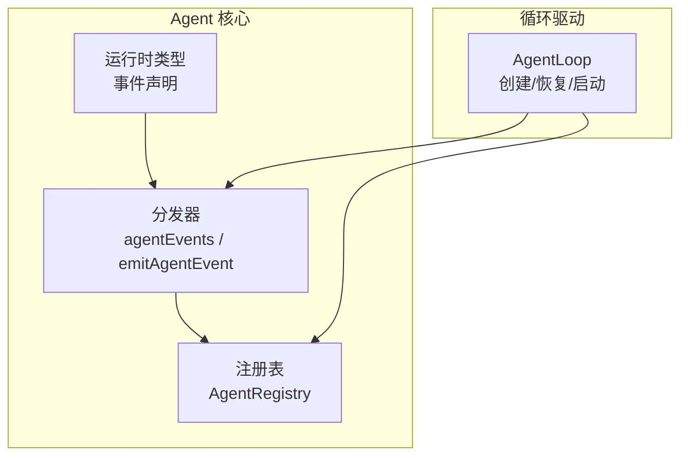
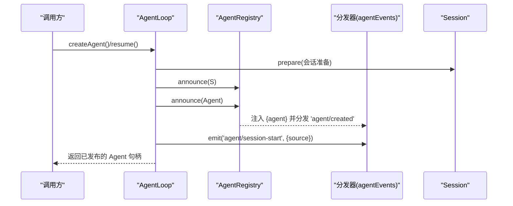
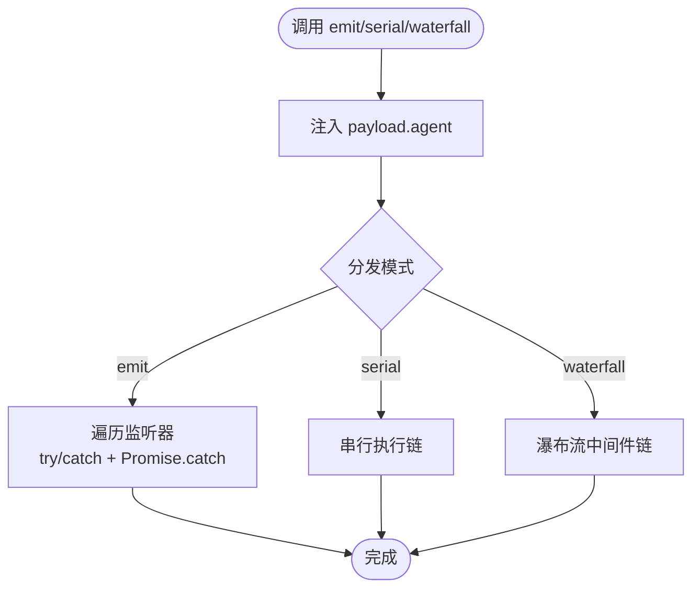
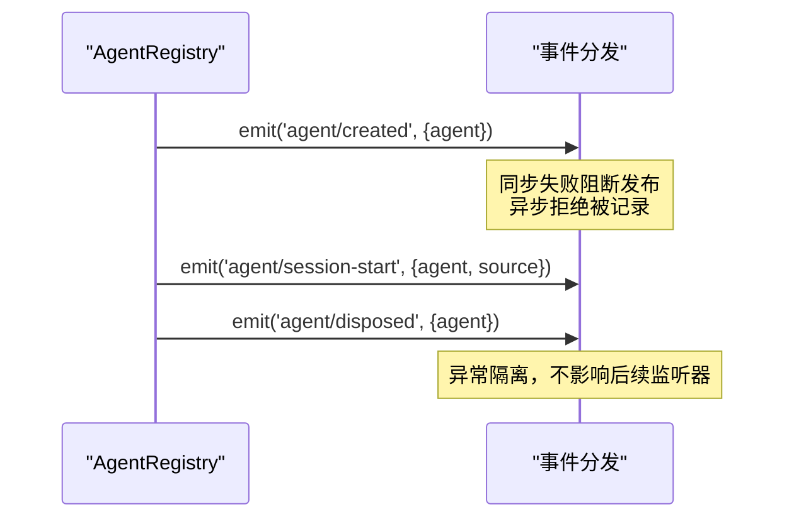
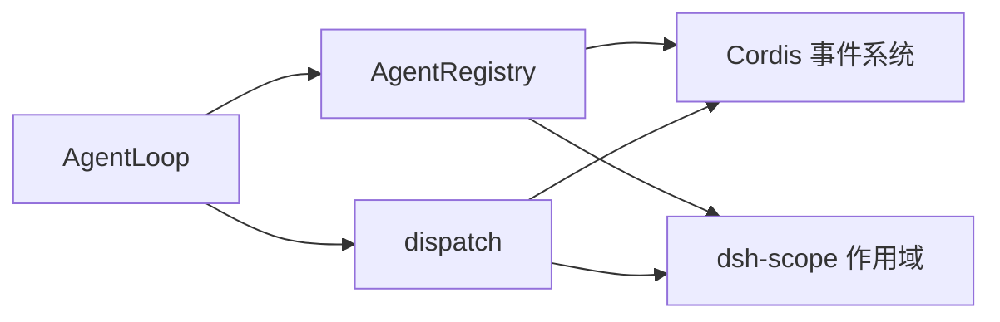

# Agent 事件系统

<cite>
**本文引用的文件**
- [dispatch.ts](file://packages/core/agent/src/dispatch.ts)
- [index.ts](file://packages/core/agent/src/index.ts)
- [runtime-types.ts](file://packages/core/agent/src/runtime-types.ts)
- [agent-loop index.ts](file://packages/core/agent-loop/src/index.ts)
</cite>

## 目录
1. [简介](#简介)
2. [项目结构](#项目结构)
3. [核心组件](#核心组件)
4. [架构总览](#架构总览)
5. [详细组件分析](#详细组件分析)
6. [依赖关系分析](#依赖关系分析)
7. [性能考量](#性能考量)
8. [故障排查指南](#故障排查指南)
9. [结论](#结论)
10. [附录](#附录)

## 简介
本文件系统性介绍 Agent 事件系统的架构与使用方式，覆盖以下主题：
- 核心事件 agent/created、agent/session-start、agent/disposed 的触发时机与携带数据。
- 事件分发机制：作用域过滤、监听器注册与注销、emit/serial/waterfall 三种分发模式。
- 与其他系统事件的集成：与 session 生命周期、工具调用等上下文的关联。
- 自定义事件发送：如何使用 emitAgentEvent() 安全地发出 Agent 事件。
- 异步处理与错误隔离：通知型事件的容错策略与串行/瀑布流控制。
- 性能优化：热路径零分配、批处理建议与内存管理实践。
- 事件驱动编程的最佳实践与实际应用场景。

## 项目结构
Agent 事件系统由三个关键部分组成：
- 类型与事件声明：定义 Agent 及其事件契约（运行时类型）。
- 分发与载体：提供 agentEvents、agentCarrier、emitAgentEvent 等能力，实现作用域绑定与注入。
- 生命周期编排：在 Agent 创建/恢复流程中按序发布事件，确保顺序一致性与可回滚性。

图表来源
- [runtime-types.ts:146-291](file://packages/core/agent/src/runtime-types.ts#L146-L291)
- [dispatch.ts:94-165](file://packages/core/agent/src/dispatch.ts#L94-L165)
- [index.ts:256-576](file://packages/core/agent/src/index.ts#L256-L576)
- [agent-loop index.ts:560-570](file://packages/core/agent-loop/src/index.ts#L560-L570)

章节来源
- [runtime-types.ts:146-291](file://packages/core/agent/src/runtime-types.ts#L146-L291)
- [dispatch.ts:94-165](file://packages/core/agent/src/dispatch.ts#L94-L165)
- [index.ts:256-576](file://packages/core/agent/src/index.ts#L256-L576)
- [agent-loop index.ts:560-570](file://packages/core/agent-loop/src/index.ts#L560-L570)

## 核心组件
- Agent 事件契约：通过扩展 Cordis Events 接口声明 agent/* 系列事件，包括生命周期、状态、入站消息、会话启动、请求拦截、错误上报等。
- 作用域载体：agentCarrier(agent) 将 Agent 同时作为 scope key 与 subject，保证事件仅分发给该 Agent 的作用域。
- 融合分发器：agentEvents(ctx, agent, carrier) 返回 emit/serial/waterfall 三合一分发器，自动注入 payload.agent 并限定 thisArg 为 agent 作用域。
- 便捷发送：emitAgentEvent(ctx, agent, name, payload) 用于一次性发送 Agent 事件，内部复用 agentEvents 的注入与过滤逻辑。
- 注册表：AgentRegistry 负责 Agent 的进入、公告、注销与配对释放，确保 agent/created 与 agent/disposed 成对出现。

章节来源
- [runtime-types.ts:146-291](file://packages/core/agent/src/runtime-types.ts#L146-L291)
- [dispatch.ts:94-165](file://packages/core/agent/src/dispatch.ts#L94-L165)
- [index.ts:450-576](file://packages/core/agent/src/index.ts#L450-L576)

## 架构总览
Agent 事件系统在“创建/恢复”流程中被严格编排：
- 准备阶段：构造 SessionPreparation，构建 Agent 上下文并完成 setup。
- 公告阶段：先 announce(session)，再 announce(agent)，随后立即发出 agent/session-start。
- 启动阶段：循环开始运行，后续根据输入与步骤触发 pre-step/request/turn-stopping 等事件。

图表来源
- [agent-loop index.ts:560-570](file://packages/core/agent-loop/src/index.ts#L560-L570)
- [index.ts:549-576](file://packages/core/agent/src/index.ts#L549-L576)
- [dispatch.ts:107-148](file://packages/core/agent/src/dispatch.ts#L107-L148)

## 详细组件分析

### 事件契约与数据结构
- agent/created：在 Agent 被注册并公告时触发，payload 包含 agent。
- agent/session-start：在会话与 Agent 公告后、循环启动前触发，payload 包含 agent 与 source（startup/resume/clear/compact）。
- agent/disposed：在 Agent 从注册表移除时触发，payload 包含 agent。
- 其他相关事件：agent/status、agent/inbox/*、agent/pre-step、agent/request、agent/request-error、agent/turn-stopping、agent/error。

章节来源
- [runtime-types.ts:146-291](file://packages/core/agent/src/runtime-types.ts#L146-L291)

### 事件分发机制
- 作用域过滤：所有 agent/* 事件通过 Scoped<Agent> 作为 thisArg，结合 dsh-scope 的 scopeTarget，确保只有对应 Agent 的监听器收到事件。
- 注入 payload.agent：agentEvents 在分发前将 agent 注入到 payload，避免调用方误传或遗漏。
- 三种分发模式：
  - emit：通知型，逐个调用监听器，异常被捕获并记录，不会中断后续监听器。
  - serial：串行链式调用，适合需要顺序执行且可能短路的结果。
  - waterfall：瀑布流中间件模式，支持 next() 组合多个处理器。

图表来源
- [dispatch.ts:107-148](file://packages/core/agent/src/dispatch.ts#L107-L148)

章节来源
- [dispatch.ts:107-148](file://packages/core/agent/src/dispatch.ts#L107-L148)

### 生命周期事件时序
- agent/created：在 AgentRegistry.announce 中同步派发，若同步监听器抛出会阻止发布；返回 Promise 的拒绝会被捕获并记录。
- agent/session-start：在 AgentLoop.publish 流程中，于 session 与 agent 公告后立即发出，source 指明启动来源。
- agent/disposed：在 detachEntered 中派发，确保与 created 成对出现；同样对异常进行隔离与日志记录。

图表来源
- [index.ts:549-576](file://packages/core/agent/src/index.ts#L549-L576)
- [index.ts:527-540](file://packages/core/agent/src/index.ts#L527-L540)
- [agent-loop index.ts:560-570](file://packages/core/agent-loop/src/index.ts#L560-L570)

章节来源
- [index.ts:527-576](file://packages/core/agent/src/index.ts#L527-L576)
- [agent-loop index.ts:560-570](file://packages/core/agent-loop/src/index.ts#L560-L570)

### 与其他系统事件的集成
- 与 Session 事件：Agent 的生命周期与 Session 紧密耦合，session 先公告，再 agent 公告，最后 agent/session-start。
- 与工具调用事件：工具调用发生在 step 内，可通过 agent/request、agent/pre-step 等事件在请求前注入上下文或调整配置；错误通过 agent/request-error 上报。
- 与 Inbound 消息：agent/inbox/inserted/claimed/discarded 描述消息进入、领取与丢弃，配合 agent/turn-stopping 控制回合关闭。

章节来源
- [runtime-types.ts:146-291](file://packages/core/agent/src/runtime-types.ts#L146-L291)
- [agent-loop index.ts:560-570](file://packages/core/agent-loop/src/index.ts#L560-L570)

### 使用 emitAgentEvent() 发送自定义 Agent 事件
- 适用场景：在任意位置向特定 Agent 作用域发送通知型事件，无需持有分发器实例。
- 行为特性：
  - 自动注入 payload.agent。
  - 通过作用域过滤，仅目标 Agent 的监听器接收。
  - 异常隔离：监听器抛错或被拒绝的 Promise 会被捕获并记录，不中断后续监听器。
- 推荐用法：仅在需要“通知”时使用 emit；如需顺序控制或结果聚合，优先使用 agentEvents(...).serial 或 waterfall。

章节来源
- [dispatch.ts:151-165](file://packages/core/agent/src/dispatch.ts#L151-L165)

### 监听器的注册与注销
- 注册：通过 Cordis 的 ctx.on(...) 在 Agent 作用域内订阅 agent/* 事件。
- 注销：ctx.on 返回取消函数，可在合适时机调用以移除监听器，避免内存泄漏。
- 最佳实践：
  - 在 agent/created 中注册与 Agent 相关的副作用。
  - 在 agent/disposed 中清理资源，确保与 created 成对。
  - 对于长生命周期任务，使用 whenIdle 或 runMaintenance 协调。

章节来源
- [runtime-types.ts:146-291](file://packages/core/agent/src/runtime-types.ts#L146-L291)
- [index.ts:450-576](file://packages/core/agent/src/index.ts#L450-L576)

## 依赖关系分析
- AgentRegistry 依赖 Cordis 的事件系统与 Fiber 生命周期，负责 Agent 的进入/公告/注销。
- dispatch 模块依赖 dsh-scope 的作用域能力，确保事件仅作用于目标 Agent。
- AgentLoop 依赖 AgentRegistry 与分发器，编排事件顺序，保证一致性。

图表来源
- [index.ts:256-576](file://packages/core/agent/src/index.ts#L256-L576)
- [dispatch.ts:94-165](file://packages/core/agent/src/dispatch.ts#L94-L165)
- [agent-loop index.ts:560-570](file://packages/core/agent-loop/src/index.ts#L560-L570)

章节来源
- [index.ts:256-576](file://packages/core/agent/src/index.ts#L256-L576)
- [dispatch.ts:94-165](file://packages/core/agent/src/dispatch.ts#L94-L165)
- [agent-loop index.ts:560-570](file://packages/core/agent-loop/src/index.ts#L560-L570)

## 性能考量
- 热路径零分配：agentEvents 可复用同一 carrier，避免每次分发都重建作用域载体。
- 通知型事件隔离：emit 模式下每个监听器独立 try/catch 与 Promise.catch，避免单点失败阻塞整体。
- 批处理建议：
  - 对高频事件（如 inbox/inserted）可在应用层做合并窗口，减少下游处理压力。
  - 使用 watermark 或节流策略限制瞬时峰值。
- 内存管理：
  - 及时注销监听器，避免在 agent/disposed 后仍持有引用。
  - 避免在监听器中创建闭包长期引用大对象。
- 序列化与日志：
  - 对 payload 中的敏感信息做脱敏。
  - 控制日志级别与采样率，避免 I/O 瓶颈。

[本节为通用指导，不直接分析具体文件]

## 故障排查指南
- 常见问题定位：
  - 未收到事件：检查是否在正确的 Agent 作用域内订阅；确认 carrier 与 agent 匹配。
  - 事件顺序异常：确认通过 AgentLoop 的标准流程发布；避免在 setup 中提前触发。
  - 监听器崩溃：查看 emit 模式的日志输出，确认异常已被捕获并记录。
- 调试技巧：
  - 在 agent/created 中打印 agent.id 与 source。
  - 在 agent/error 中收集 turn/step 与错误堆栈。
  - 使用 whenIdle/runMaintenance 观察空闲期与任务边界。
- 恢复策略：
  - 对 request-error 使用 waterfall 的 next() 委托默认重试策略。
  - 对 turn-stopping 通过 steer/inject 注入上下文以继续回合。

章节来源
- [runtime-types.ts:146-291](file://packages/core/agent/src/runtime-types.ts#L146-L291)
- [dispatch.ts:120-148](file://packages/core/agent/src/dispatch.ts#L120-L148)
- [index.ts:527-576](file://packages/core/agent/src/index.ts#L527-L576)

## 结论
Agent 事件系统通过严格的生命周期编排与作用域过滤，提供了高内聚、低耦合的事件驱动模型。其设计兼顾了可靠性（异常隔离）、可观测性（丰富事件）与可扩展性（waterfall/serial），并通过热路径优化与内存管理实践保障性能。在实际使用中，应遵循“通知用 emit、控制用 serial/waterfall”的原则，并在合适的生命周期点进行注册与注销，以获得稳定高效的系统行为。

[本节为总结性内容，不直接分析具体文件]

## 附录
- 典型使用场景：
  - 监控与遥测：订阅 agent/status、agent/error，统计运行时长与错误率。
  - 审计与合规：在 agent/inbox/inserted/claimed 记录消息流转。
  - 动态策略：在 agent/pre-step 与 agent/request 中注入上下文或调整模型配置。
  - 用户交互：在 agent/turn-stopping 中提示用户或发起审批。
- 最佳实践清单：
  - 始终在 agent/created 中注册，在 agent/disposed 中清理。
  - 使用 emitAgentEvent 发送通知，避免自行维护分发器。
  - 对高频事件做批处理与限流。
  - 保持 payload 最小化，避免传递大对象。
  - 在 waterfall 中谨慎修改状态，优先通过 next() 委托默认行为。

[本节为概念性内容，不直接分析具体文件]