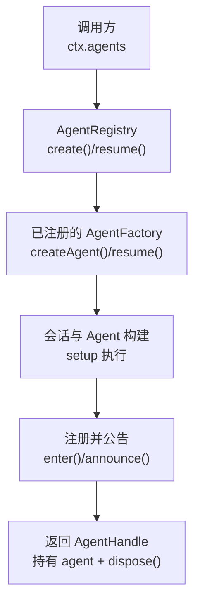
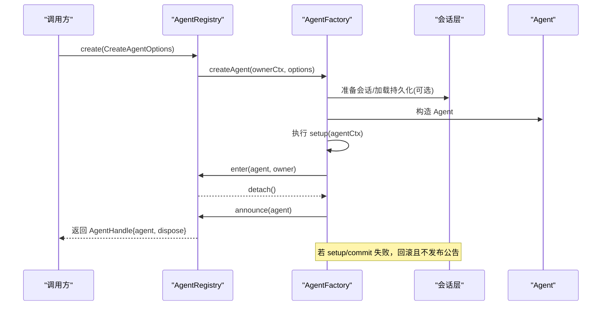
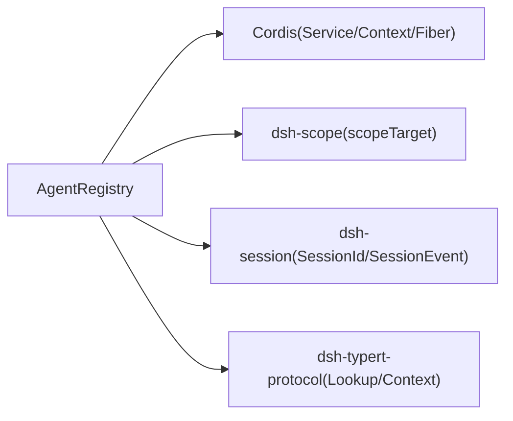

# Agent 创建与初始化

<cite>
**本文引用的文件**
- [packages/core/agent/src/index.ts](file://packages/core/agent/src/index.ts)
</cite>

## 目录
1. [简介](#简介)
2. [项目结构](#项目结构)
3. [核心组件](#核心组件)
4. [架构总览](#架构总览)
5. [详细组件分析](#详细组件分析)
6. [依赖关系分析](#依赖关系分析)
7. [性能考量](#性能考量)
8. [故障排查指南](#故障排查指南)
9. [结论](#结论)
10. [附录：使用示例与最佳实践](#附录使用示例与最佳实践)

## 简介
本章节聚焦于 Agent 的创建与初始化流程，围绕 AgentRegistry.create() 的工作机制展开，解释 CreateAgentOptions 的配置项、会话元数据的验证与处理、工厂模式（setFactory）如何注册自定义创建逻辑、AgentSetup 回调的执行时机与作用，以及 AgentHandle 的生命周期管理。文末提供不同场景下的完整代码示例路径，便于快速上手。

## 项目结构
Agent 的创建与初始化由 dsh-agent 包中的 AgentRegistry 统一编排，具体创建与驱动逻辑由实现 AgentFactory 的“循环插件”完成。调用方通过 ctx.agents 访问 Registry，并通过 setFactory 注入工厂，随后调用 create/resume 完成创建或恢复。

图表来源
- [packages/core/agent/src/index.ts:405-430](file://packages/core/agent/src/index.ts#L405-L430)
- [packages/core/agent/src/index.ts:450-576](file://packages/core/agent/src/index.ts#L450-L576)

章节来源
- [packages/core/agent/src/index.ts:256-704](file://packages/core/agent/src/index.ts#L256-L704)

## 核心组件
- AgentRegistry：进程内 Agent 注册表，负责工厂委派、生命周期公告、发起者上下文传播。
- AgentFactory：由循环插件实现的创建/恢复接口，对外隐藏具体实现细节。
- AgentHandle：拥有 Agent 实例及其唯一销毁能力。
- CreateAgentOptions / ResumeAgentOptions：创建与恢复的参数契约。
- AgentSetup：在发布前对 Agent 作用域进行组合与校验的回调。

章节来源
- [packages/core/agent/src/index.ts:80-133](file://packages/core/agent/src/index.ts#L80-L133)
- [packages/core/agent/src/index.ts:139-156](file://packages/core/agent/src/index.ts#L139-L156)
- [packages/core/agent/src/index.ts:172-175](file://packages/core/agent/src/index.ts#L172-L175)
- [packages/core/agent/src/index.ts:177-214](file://packages/core/agent/src/index.ts#L177-L214)
- [packages/core/agent/src/index.ts:256-704](file://packages/core/agent/src/index.ts#L256-L704)

## 架构总览
下图展示了从调用到发布的完整时序，包括工厂委派、setup 执行、进入注册表、公告事件与启动循环的关键阶段。

图表来源
- [packages/core/agent/src/index.ts:405-430](file://packages/core/agent/src/index.ts#L405-L430)
- [packages/core/agent/src/index.ts:450-576](file://packages/core/agent/src/index.ts#L450-L576)
- [packages/core/agent/src/index.ts:177-214](file://packages/core/agent/src/index.ts#L177-L214)

## 详细组件分析

### AgentRegistry.create() 工作原理
- 获取当前上下文作为 ownerCtx，确保后续效果绑定到调用方作用域。
- 通过 requireFactory() 获取已注册的工厂目标，并使用 getTraceable 将调用上下文透传到工厂方法，保证所有权与追踪正确。
- 通过 Reflect.apply 调用 target.createAgent(ownerCtx, options)，将实际创建职责委托给循环插件。
- 若未注册工厂，将抛出“无工厂”错误；若创建/setup 失败，会回滚且不发布任何 ID。

章节来源
- [packages/core/agent/src/index.ts:390-415](file://packages/core/agent/src/index.ts#L390-L415)
- [packages/core/agent/src/index.ts:216-219](file://packages/core/agent/src/index.ts#L216-L219)

### CreateAgentOptions 配置项与元数据验证
- sessionId：必须提供，作为 Agent 与 Session 共享的唯一标识。
- meta：会话创建元数据，包含 cwd、parentSession、seedLength、origin、delegationDepth、agentPreset。该元数据会被会话边界验证并快照，属于持久化数据的一部分。
- seed：初始回放/分叉历史，要求从 seq 0 连续、仅含可逆 JSON 数据、不包含未完成的回合或工具调用。
- agentOptions：每 Agent 选项（如模型等）。
- signal：创建期取消信号，在句柄可见前被分离。
- setup：在 session/agent 插入与公告之前执行的组合回调，支持返回同步 commit，用于在发布边界做最终校验。

章节来源
- [packages/core/agent/src/index.ts:80-133](file://packages/core/agent/src/index.ts#L80-L133)

### 工厂模式与 setFactory()
- setFactory(factory)：注册 AgentFactory，内部以 effect 形式保存工厂目标，并在 effect 结束时清理。重复注册会抛错。
- 工厂对象会被规范化为真实目标，避免多层代理叠加；每次 create/resume 都会通过 getTraceable 重新绑定调用上下文，使所有权跟随调用方。
- 工厂需实现 createAgent 与 resume，分别对应新建与恢复流程。

章节来源
- [packages/core/agent/src/index.ts:360-394](file://packages/core/agent/src/index.ts#L360-L394)
- [packages/core/agent/src/index.ts:177-214](file://packages/core/agent/src/index.ts#L177-L214)

### AgentSetup 回调的执行时机与作用
- 执行时机：在构造 agentCtx 之后、插入/公告 session 与 agent 之前。所有通过 agentCtx 注册的 scoped tools、prompt sections/variables、restrictions、监听器、子插件等均在此时生效。
- 返回值：可返回 AgentSetupCommit.commit()，在 setup 全部 await 完成后、发布前同步执行，用于最终一致性校验。
- 语义约束：setup 是“组合而非驱动”，不应在此回调中驱动 Agent 运行；应在 create/resume 返回后开始驱动。
- 失败与回滚：setup 抛错、commit 抛错或所有者被释放，均会回滚，不会发布任何 ID。

章节来源
- [packages/core/agent/src/index.ts:114-133](file://packages/core/agent/src/index.ts#L114-L133)
- [packages/core/agent/src/index.ts:53-62](file://packages/core/agent/src/index.ts#L53-L62)

### AgentHandle 生命周期管理
- 返回内容：AgentHandle 包含 agent 与 dispose()。只有句柄持有者能销毁该 Agent。
- dispose() 的职责：停止循环、等待退出、注销 Agent、从存储移除会话、最后撤销其作用域世界。
- 查找与归属：可通过 ctx.agents.get(id) 获取裸 Agent；isOwnedBy(id, owner) 可判断某 Agent 是否由指定父 Agent 在其作用域下创建。
- 根 Agent：roots() 返回顶层 Agent（无 owner），即使恢复的分叉也可能被视为根。

章节来源
- [packages/core/agent/src/index.ts:158-175](file://packages/core/agent/src/index.ts#L158-L175)
- [packages/core/agent/src/index.ts:578-617](file://packages/core/agent/src/index.ts#L578-L617)

### 注册与公告：enter() 与 announce()
- enter(agent, owner)：将已构造但未公告的 Agent 插入注册表，建立 detach 能力，用于有序生命周期控制。
- announce(agent)：在 enter 之后调用，发射 agent/created 事件，并标记已公告。若 announce 期间发生异常，会触发回滚与配对 disposal。
- 并发安全：同一 id 不可重复注册；announcing/announced 标志防止重入与重复公告。

章节来源
- [packages/core/agent/src/index.ts:459-576](file://packages/core/agent/src/index.ts#L459-L576)

### 发起者上下文与 withInitiator/withoutInitiator
- currentInitiator()/requireInitiator()：读取当前发起者 Agent，用于日志、追踪、指标或主机归因。
- withInitiator()/withoutInitiator()：为异步驱动链建立/清除发起者边界，确保因果归属清晰且不影响显式字段。
- 关闭与回收：服务卸载时会关闭新边界并等待已存在边界回收，避免悬挂引用。

章节来源
- [packages/core/agent/src/index.ts:300-358](file://packages/core/agent/src/index.ts#L300-L358)
- [packages/core/agent/src/index.ts:619-704](file://packages/core/agent/src/index.ts#L619-L704)

## 依赖关系分析
- AgentRegistry 依赖 Cordis 的 Service、Context、FiberState、getTraceable 等能力，用于作用域、效果与追踪。
- 依赖 dsh-scope 的 scopeTarget 用于事件作用域载体。
- 依赖 dsh-session 的类型 SessionId、SessionEvent，用于身份与会话事件。
- 依赖 dsh-typert-protocol 的 TypertLookup/Context，用于类型解析与上下文宿主。

图表来源
- [packages/core/agent/src/index.ts:8-15](file://packages/core/agent/src/index.ts#L8-L15)
- [packages/core/agent/src/index.ts:26-34](file://packages/core/agent/src/index.ts#L26-L34)
- [packages/core/agent/src/index.ts:266-288](file://packages/core/agent/src/index.ts#L266-L288)

章节来源
- [packages/core/agent/src/index.ts:8-15](file://packages/core/agent/src/index.ts#L8-L15)
- [packages/core/agent/src/index.ts:26-34](file://packages/core/agent/src/index.ts#L26-L34)
- [packages/core/agent/src/index.ts:266-288](file://packages/core/agent/src/index.ts#L266-L288)

## 性能考量
- 工厂委派与上下文重追踪：通过 getTraceable 将调用上下文绑定到工厂方法，避免代理栈叠加，减少额外开销。
- 作用域与事件：使用 scopeTarget 与事件作用域，确保事件过滤高效且隔离。
- 异步边界管理：withInitiator/withoutInitiator 精确控制发起者上下文传播，避免不必要的继承与泄漏。
- 注册与公告：enter/announce 采用状态标志与幂等 detach，避免重复公告与竞态。

[本节为通用指导，不直接分析具体文件]

## 故障排查指南
- 未注册工厂：调用 create/resume 前必须先 setFactory，否则会抛出“无工厂”错误。
- 重复注册：同一 Agent id 不能重复注册，enter 会拒绝重复。
- 重复公告：announce 对同一 Agent 只能调用一次，重复会抛错。
- 会话与 Agent 不一致：enter 会校验 agent.id 与 agent.session.id 一致，否则抛错。
- 发起者上下文不可用：在 disposed 状态下读取发起者会抛错；需在 active 状态使用。
- setup/commit 失败：会回滚且不发布任何 ID，检查 setup 内的资源分配与校验逻辑。

章节来源
- [packages/core/agent/src/index.ts:216-219](file://packages/core/agent/src/index.ts#L216-L219)
- [packages/core/agent/src/index.ts:474-483](file://packages/core/agent/src/index.ts#L474-L483)
- [packages/core/agent/src/index.ts:549-576](file://packages/core/agent/src/index.ts#L549-L576)
- [packages/core/agent/src/index.ts:683-685](file://packages/core/agent/src/index.ts#L683-L685)

## 结论
AgentRegistry 通过工厂模式解耦了创建与驱动，提供了严格的发布前组合点（setup/commit）与安全的生命周期管理（enter/announce/dispose）。CreateAgentOptions 与 ResumeAgentOptions 明确了配置与恢复契约，AgentHandle 则保证了资源的受控释放。配合发起者上下文传播，可在复杂异步链路中保持清晰的因果归属。

[本节为总结性内容，不直接分析具体文件]

## 附录：使用示例与最佳实践

### 基本创建（无配置）
- 步骤：
  - 通过 ctx.agents.setFactory 注册工厂。
  - 调用 ctx.agents.create({ sessionId })。
  - 使用返回的 handle.agent 进行驱动。
  - 结束后调用 handle.dispose()。
- 参考路径：
  - [packages/core/agent/src/index.ts:405-415](file://packages/core/agent/src/index.ts#L405-L415)
  - [packages/core/agent/src/index.ts:158-175](file://packages/core/agent/src/index.ts#L158-L175)

### 带配置的创建（meta、seed、agentOptions、signal、setup）
- 步骤：
  - 设置 CreateAgentOptions.meta（cwd、parentSession、seedLength、origin、delegationDepth、agentPreset）。
  - 传入 seed（初始回放/分叉历史）。
  - 配置 agentOptions（如模型）。
  - 可选传入 AbortSignal 用于创建期取消。
  - 在 setup 中注册 scoped tools、prompt 片段、restrictions 等，并可返回 commit 做发布前校验。
- 参考路径：
  - [packages/core/agent/src/index.ts:80-133](file://packages/core/agent/src/index.ts#L80-L133)
  - [packages/core/agent/src/index.ts:114-133](file://packages/core/agent/src/index.ts#L114-L133)

### 恢复已持久化的 Agent
- 步骤：
  - 调用 ctx.agents.resume({ resumeSessionId, agentOptions?, signal?, setup? })。
  - 在 setup 中补充运行时所需的能力（如工具、监听器等）。
  - 成功后通过 handle.agent 继续驱动，结束时 dispose。
- 参考路径：
  - [packages/core/agent/src/index.ts:417-430](file://packages/core/agent/src/index.ts#L417-L430)
  - [packages/core/agent/src/index.ts:139-156](file://packages/core/agent/src/index.ts#L139-L156)

### 工厂注册与自定义创建逻辑
- 步骤：
  - 实现 AgentFactory.createAgent 与 AgentFactory.resume。
  - 在 createAgent 中：准备会话、构造 Agent、执行 setup、调用 enter/announce、启动循环、返回 handle。
  - 在 resume 中：加载持久化、构造 Agent、执行 setup、同样走 enter/announce 与启动循环。
- 参考路径：
  - [packages/core/agent/src/index.ts:177-214](file://packages/core/agent/src/index.ts#L177-L214)
  - [packages/core/agent/src/index.ts:360-394](file://packages/core/agent/src/index.ts#L360-L394)

### 最佳实践
- 始终在 create/resume 返回后再驱动 Agent，避免在 setup 中驱动。
- 使用 setup 的 commit 做发布前的最终一致性校验。
- 使用 withInitiator/withoutInitiator 明确异步驱动的因果归属。
- 妥善管理 AgentHandle，确保 dispose 被调用以避免资源泄漏。
- 在 setup 中谨慎分配资源，确保失败时可回滚。

[本节为实践指导，不直接分析具体文件]