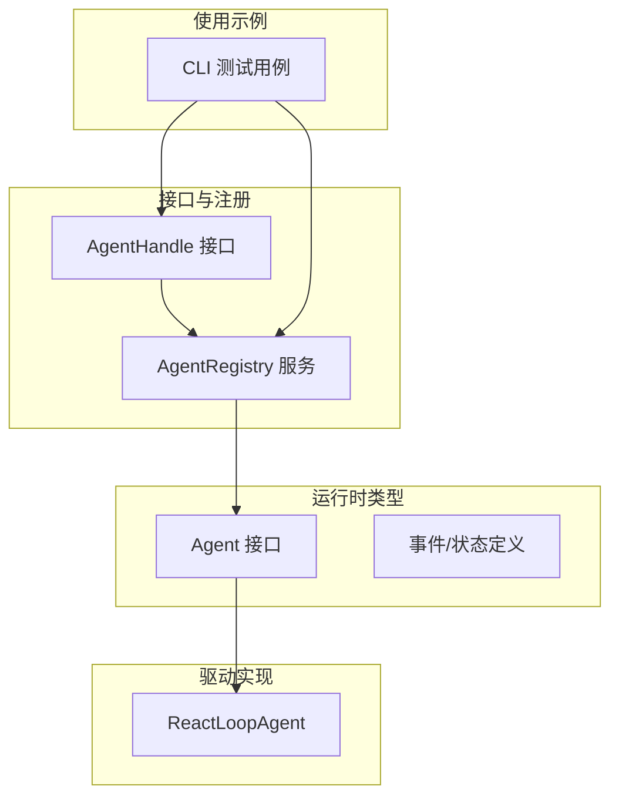
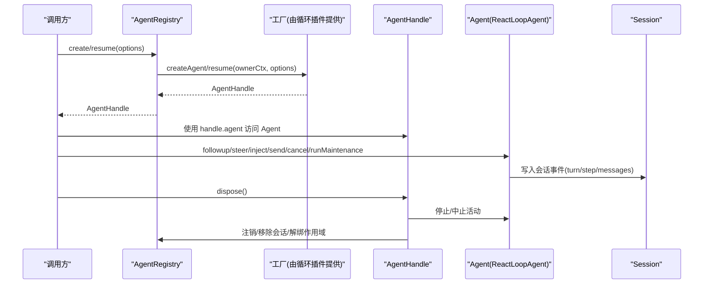
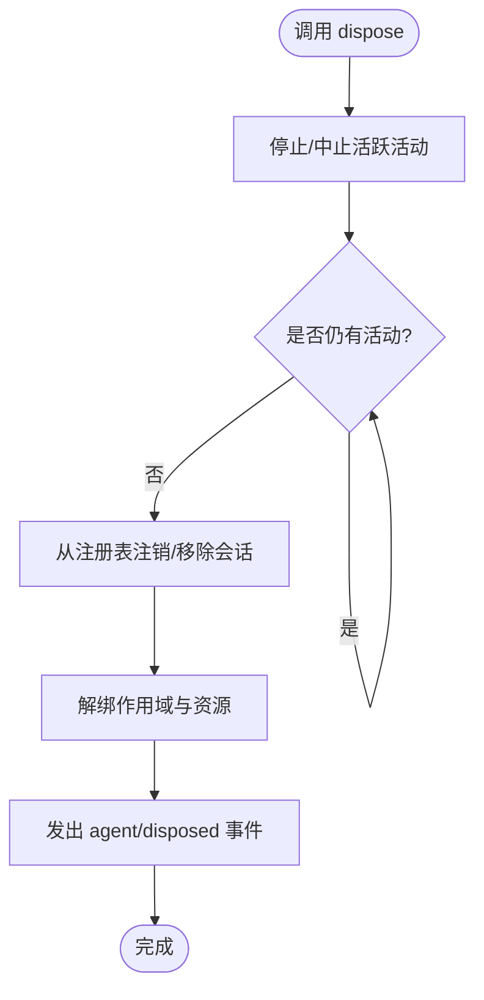
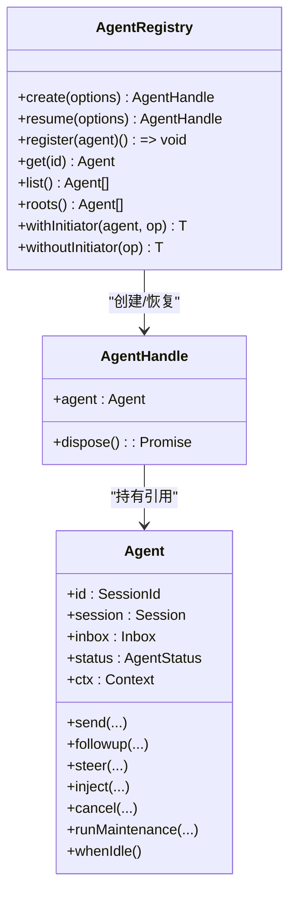
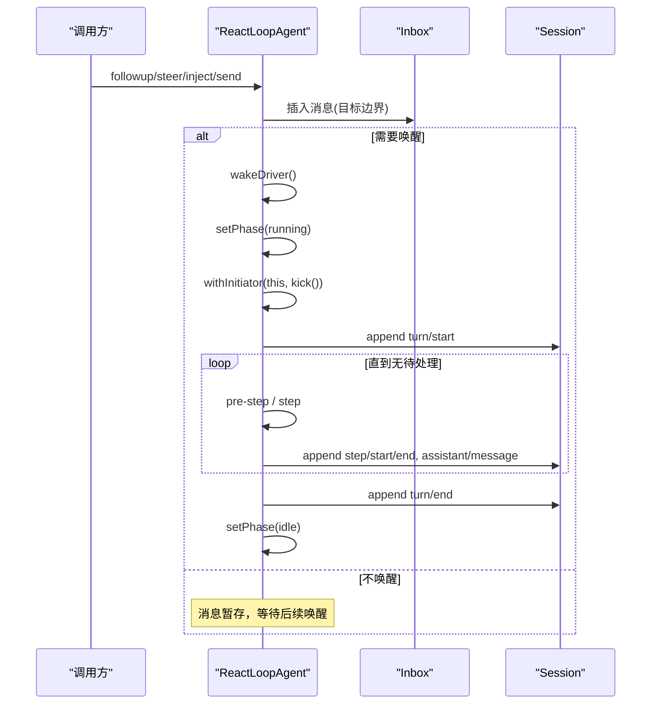
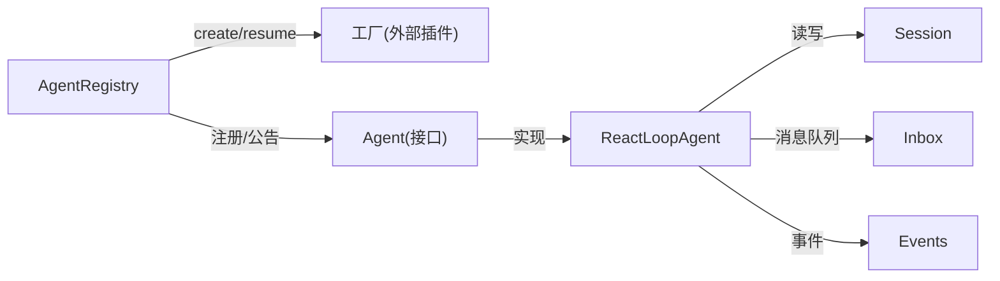

# Agent 句柄管理

<cite>
**本文引用的文件**
- [packages/core/agent/src/index.ts](file://packages/core/agent/src/index.ts)
- [packages/core/agent/src/runtime-types.ts](file://packages/core/agent/src/runtime-types.ts)
- [packages/core/agent-loop/src/agent.ts](file://packages/core/agent-loop/src/agent.ts)
- [apps/cli/tests/web-agent-presets.e2e.ts](file://apps/cli/tests/web-agent-presets.e2e.ts)
</cite>

## 目录
1. [简介](#简介)
2. [项目结构](#项目结构)
3. [核心组件](#核心组件)
4. [架构总览](#架构总览)
5. [详细组件分析](#详细组件分析)
6. [依赖关系分析](#依赖关系分析)
7. [性能考虑](#性能考虑)
8. [故障排查指南](#故障排查指南)
9. [结论](#结论)
10. [附录：完整示例与最佳实践](#附录完整示例与最佳实践)

## 简介
本文件聚焦于 AgentHandle 接口的设计与生命周期管理，系统说明 handle.agent 属性的作用与访问方式、handle.dispose() 的清理流程与资源释放语义；阐述句柄的所有权模型、如何正确获取与管理 Agent 实例引用；解释句柄与 AgentRegistry 的关系及在不同作用域下的行为差异；并提供完整的代码示例路径，展示句柄的创建、使用与正确销毁模式。

## 项目结构
围绕 Agent 句柄的关键实现分布在以下模块：
- 接口与注册中心：AgentHandle 接口定义、AgentRegistry 服务（创建/恢复/注册/发现/作用域传播）
- 运行时类型：Agent 公共接口、事件与状态定义
- 驱动实现：ReactLoopAgent（会话驱动、消息入队、步骤执行、取消与空闲等待）
- 使用示例：CLI 测试中通过 ctx.agents.create 获取句柄并调用 dispose 进行销毁

图表来源
- [packages/core/agent/src/index.ts:172-175](file://packages/core/agent/src/index.ts#L172-L175)
- [packages/core/agent/src/index.ts:256-704](file://packages/core/agent/src/index.ts#L256-L704)
- [packages/core/agent/src/runtime-types.ts:64-144](file://packages/core/agent/src/runtime-types.ts#L64-L144)
- [packages/core/agent-loop/src/agent.ts:64-193](file://packages/core/agent-loop/src/agent.ts#L64-L193)
- [apps/cli/tests/web-agent-presets.e2e.ts:173-183](file://apps/cli/tests/web-agent-presets.e2e.ts#L173-L183)

章节来源
- [packages/core/agent/src/index.ts:172-175](file://packages/core/agent/src/index.ts#L172-L175)
- [packages/core/agent/src/index.ts:256-704](file://packages/core/agent/src/index.ts#L256-L704)
- [packages/core/agent/src/runtime-types.ts:64-144](file://packages/core/agent/src/runtime-types.ts#L64-L144)
- [packages/core/agent-loop/src/agent.ts:64-193](file://packages/core/agent-loop/src/agent.ts#L64-L193)
- [apps/cli/tests/web-agent-presets.e2e.ts:173-183](file://apps/cli/tests/web-agent-presets.e2e.ts#L173-L183)

## 核心组件
- AgentHandle：拥有 Agent 实例及其处置能力的句柄，持有 agent 属性与 dispose 方法。
- AgentRegistry：进程内 Agent 注册中心，负责工厂委派、创建/恢复、注册/注销、查找、根节点枚举以及“发起者”作用域传播。
- Agent：对外暴露的 Agent 运行时接口，包含会话、收件箱、状态、上下文、发送/注入/取消/维护任务等能力。
- ReactLoopAgent：默认驱动实现，基于会话日志驱动轮次与步骤，处理消息入队、请求构建、工具调用与错误处理。

章节来源
- [packages/core/agent/src/index.ts:172-175](file://packages/core/agent/src/index.ts#L172-L175)
- [packages/core/agent/src/index.ts:256-704](file://packages/core/agent/src/index.ts#L256-L704)
- [packages/core/agent/src/runtime-types.ts:64-144](file://packages/core/agent/src/runtime-types.ts#L64-L144)
- [packages/core/agent-loop/src/agent.ts:64-193](file://packages/core/agent-loop/src/agent.ts#L64-L193)

## 架构总览
下图展示了从创建到销毁的端到端流程：上层通过 AgentRegistry 创建或恢复 Agent，获得 AgentHandle；句柄持有对 Agent 的引用并可触发其运行；当不再需要时，调用 dispose 完成停止、注销与资源回收。

图表来源
- [packages/core/agent/src/index.ts:405-430](file://packages/core/agent/src/index.ts#L405-L430)
- [packages/core/agent/src/index.ts:450-576](file://packages/core/agent/src/index.ts#L450-L576)
- [packages/core/agent-loop/src/agent.ts:113-193](file://packages/core/agent-loop/src/agent.ts#L113-L193)
- [packages/core/agent-loop/src/agent.ts:245-330](file://packages/core/agent-loop/src/agent.ts#L245-L330)

## 详细组件分析

### AgentHandle 接口设计
- 属性 agent：指向当前活跃的 Agent 实例，用于访问会话、收件箱、上下文、状态与输入输出通道。
- 方法 dispose：幂等的处置能力，仅持有该句柄的调用方可终止该 Agent 的生命周期。

所有权模型要点
- 句柄是“能力型”对象：只有返回给调用方的句柄持有者可以销毁对应 Agent。
- 句柄不等同于全局可见引用；ctx.agents.get(id) 仅返回裸 Agent，不会暴露 dispose 能力。
- 工厂提供者作为结构性所有者，在卸载时会停止并排空由其创建的句柄。

章节来源
- [packages/core/agent/src/index.ts:158-175](file://packages/core/agent/src/index.ts#L158-L175)
- [packages/core/agent/src/index.ts:405-430](file://packages/core/agent/src/index.ts#L405-L430)

### handle.agent 的作用与访问方式
- 通过句柄的 agent 属性直接访问 Agent，从而调用 send/followup/steer/inject/cancel/runMaintenance/whenIdle 等方法。
- Agent.ctx 上会挂载 agent 自身，便于在 Agent 作用域内以 this/上下文形式访问当前 Agent。
- 在驱动内部，ReactLoopAgent 通过 ctx.extend({ agent: this }) 将自身注入到 Agent 作用域上下文中。

章节来源
- [packages/core/agent/src/runtime-types.ts:64-144](file://packages/core/agent/src/runtime-types.ts#L64-L144)
- [packages/core/agent-loop/src/agent.ts:94-96](file://packages/core/agent-loop/src/agent.ts#L94-L96)

### handle.dispose() 的清理过程与资源释放
- 停止循环：中止正在进行的轮次/步骤，清空或保留收件箱（取决于取消选项）。
- 等待空闲：确保所有活动收敛到空闲态，避免资源泄漏。
- 注销与移除：从注册表移除 Agent，删除会话存储项，解绑作用域注册。
- 事件通知：发出 agent/disposed 事件，供监听器做收尾工作。

图表来源
- [packages/core/agent/src/index.ts:158-175](file://packages/core/agent/src/index.ts#L158-L175)
- [packages/core/agent/src/index.ts:450-576](file://packages/core/agent/src/index.ts#L450-L576)
- [packages/core/agent-loop/src/agent.ts:134-162](file://packages/core/agent-loop/src/agent.ts#L134-L162)

### 句柄的所有权模型与引用管理
- 创建/恢复：通过 AgentRegistry.create/resume 返回句柄，调用方成为句柄所有者。
- 查找：ctx.agents.get(id) 可获取裸 Agent，但无法销毁；适合只读访问。
- 归属校验：isOwnedBy(id, owner) 可用于判断某 Agent 是否由指定父 Agent 在其作用域下创建。
- 根节点：roots() 返回顶层 Agent（无运行时拥有者），便于进程级管理。

章节来源
- [packages/core/agent/src/index.ts:405-430](file://packages/core/agent/src/index.ts#L405-L430)
- [packages/core/agent/src/index.ts:583-617](file://packages/core/agent/src/index.ts#L583-L617)

### 句柄与 AgentRegistry 的关系与作用域行为
- 工厂委派：create/resume 委托给已注册的工厂实现，保证创建/恢复流程一致且可回滚。
- 注册与公告：enter/announce 控制发布顺序，确保观察者不会看到未完全配置的 Agent。
- 发起者作用域：withInitiator/withoutInitiator 控制异步链中的“发起者”继承，用于日志、追踪与归属标注。
- 关闭与销毁：closeInitiators/disposeInitiators 在卸载阶段阻止新边界并等待残留 Promise 边界结束。

图表来源
- [packages/core/agent/src/index.ts:256-704](file://packages/core/agent/src/index.ts#L256-L704)
- [packages/core/agent/src/index.ts:172-175](file://packages/core/agent/src/index.ts#L172-L175)
- [packages/core/agent/src/runtime-types.ts:64-144](file://packages/core/agent/src/runtime-types.ts#L64-L144)

### ReactLoopAgent 驱动关键流程
- 输入入队：send/followup/steer/inject 将消息投递到收件箱的不同边界，可选择唤醒驱动。
- 轮次与步骤：turn 打开会话边界，pre-step 组装上下文与决策，step 构建请求并流式消费结果。
- 取消与空闲：cancel 支持保留收件箱或清空；whenIdle 等待所有活动收敛。
- 启动驱动：wakeDriver 在空闲时进入 running 阶段并通过 withInitiator 绑定发起者。

图表来源
- [packages/core/agent-loop/src/agent.ts:113-193](file://packages/core/agent-loop/src/agent.ts#L113-L193)
- [packages/core/agent-loop/src/agent.ts:245-330](file://packages/core/agent-loop/src/agent.ts#L245-L330)
- [packages/core/agent-loop/src/agent.ts:332-401](file://packages/core/agent-loop/src/agent.ts#L332-L401)

## 依赖关系分析
- AgentRegistry 依赖 Cordis 上下文与服务机制，管理工厂槽位、AsyncLocalStorage 发起者作用域与事件分发。
- AgentHandle 依赖 Agent 接口，但不直接依赖具体驱动实现；驱动通过 Agent 抽象被调用。
- ReactLoopAgent 依赖 Session、Inbox、System Prompt、LLM 适配器与事件总线，实现会话驱动的完整生命周期。

图表来源
- [packages/core/agent/src/index.ts:256-704](file://packages/core/agent/src/index.ts#L256-L704)
- [packages/core/agent-loop/src/agent.ts:64-193](file://packages/core/agent-loop/src/agent.ts#L64-L193)

章节来源
- [packages/core/agent/src/index.ts:256-704](file://packages/core/agent/src/index.ts#L256-L704)
- [packages/core/agent-loop/src/agent.ts:64-193](file://packages/core/agent-loop/src/agent.ts#L64-L193)

## 性能考虑
- 驱动空闲优化：仅在有空闲时启动 driver，避免不必要的上下文切换。
- 流式处理：助手消息分块写入会话，减少内存峰值。
- 作用域最小化：withInitiator/withoutInitiator 精确控制发起者继承范围，避免不必要的作用域污染。
- 取消与节流：cancel 支持 keepInbox，避免重复重建工作；whenIdle 确保收敛后再释放。

[本节为通用指导，不直接分析具体文件]

## 故障排查指南
- 未注册工厂：调用 create/resume 前需确保已注册工厂，否则会抛出“未注册工厂”的错误。
- 重复注册：同一 id 的 Agent 不可重复注册，enter 会检测冲突。
- 作用域失效：在 initiator 作用域关闭/销毁后，禁止新建边界，否则抛出“作用域已销毁”错误。
- 事件监听失败：agent/created 与 agent/disposed 监听器抛错会被捕获并记录，不影响主流程。

章节来源
- [packages/core/agent/src/index.ts:390-430](file://packages/core/agent/src/index.ts#L390-L430)
- [packages/core/agent/src/index.ts:474-576](file://packages/core/agent/src/index.ts#L474-L576)
- [packages/core/agent/src/index.ts:619-685](file://packages/core/agent/src/index.ts#L619-L685)

## 结论
AgentHandle 提供了安全、明确的所有权边界：通过句柄持有并管理 Agent 实例，使用 dispose 完成有序的资源释放与注销；AgentRegistry 负责创建、注册、查找与作用域传播；ReactLoopAgent 实现会话驱动的完整生命周期。遵循“创建即持有、使用即作用域、销毁即释放”的原则，可确保系统在复杂并发与多作用域场景下的稳定性与可观测性。

[本节为总结，不直接分析具体文件]

## 附录：完整示例与最佳实践
- 创建与销毁
  - 通过 ctx.agents.create 获取句柄，并在完成后调用 handle.dispose()。
  - 参考示例路径：[apps/cli/tests/web-agent-presets.e2e.ts:173-183](file://apps/cli/tests/web-agent-presets.e2e.ts#L173-L183)
- 获取 Agent 引用
  - 使用句柄的 agent 属性访问 Agent，或通过 ctx.agents.get(id) 获取只读引用。
  - 参考类型定义：[packages/core/agent/src/index.ts:172-175](file://packages/core/agent/src/index.ts#L172-L175)
- 作用域与发起者
  - 在驱动内部使用 withInitiator/withoutInitiator 控制发起者继承，便于追踪与归属。
  - 参考实现：[packages/core/agent/src/index.ts:328-358](file://packages/core/agent/src/index.ts#L328-L358)
- 驱动交互
  - 使用 followup/steer/inject/send 向不同边界投递消息；使用 cancel/whenIdle 管理生命周期。
  - 参考实现：[packages/core/agent-loop/src/agent.ts:113-193](file://packages/core/agent-loop/src/agent.ts#L113-L193)

章节来源
- [apps/cli/tests/web-agent-presets.e2e.ts:173-183](file://apps/cli/tests/web-agent-presets.e2e.ts#L173-L183)
- [packages/core/agent/src/index.ts:172-175](file://packages/core/agent/src/index.ts#L172-L175)
- [packages/core/agent/src/index.ts:328-358](file://packages/core/agent/src/index.ts#L328-L358)
- [packages/core/agent-loop/src/agent.ts:113-193](file://packages/core/agent-loop/src/agent.ts#L113-L193)