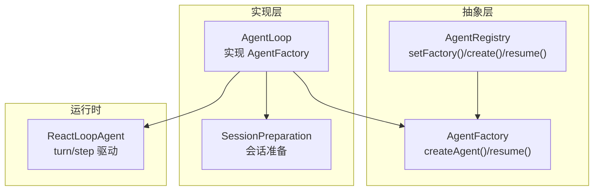
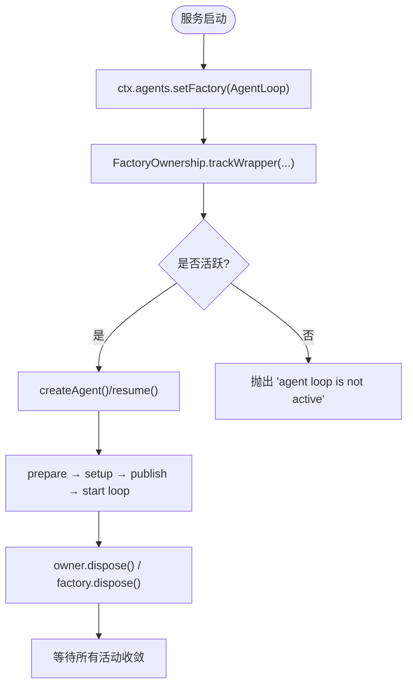
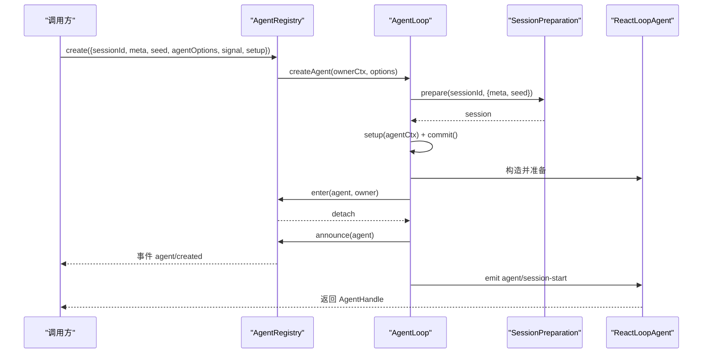
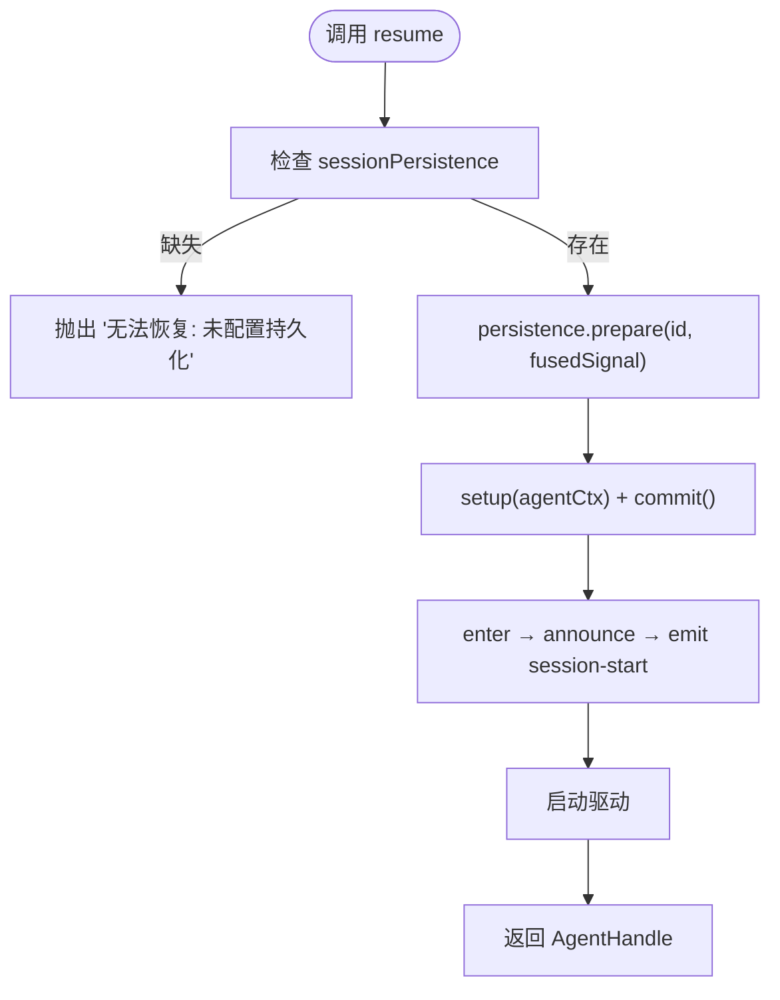
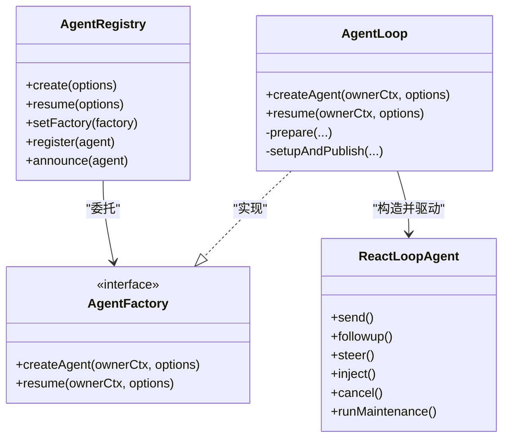

# Agent 工厂模式

<cite>
**本文引用的文件**
- [packages/core/agent/src/index.ts](file://packages/core/agent/src/index.ts)
- [packages/core/agent-loop/src/index.ts](file://packages/core/agent-loop/src/index.ts)
- [packages/core/agent-loop/src/agent.ts](file://packages/core/agent-loop/src/agent.ts)
- [packages/core/agent/tests/agent.spec.ts](file://packages/core/agent/tests/agent.spec.ts)
- [examples/headless-agent/tests/fixtures/semantic-checkpoint-agent.ts](file://examples/headless-agent/tests/fixtures/semantic-checkpoint-agent.ts)
- [examples/headless-agent/tests/resume.e2e.ts](file://examples/headless-agent/tests/resume.e2e.ts)
</cite>

## 目录
1. [简介](#简介)
2. [项目结构](#项目结构)
3. [核心组件](#核心组件)
4. [架构总览](#架构总览)
5. [详细组件分析](#详细组件分析)
6. [依赖关系分析](#依赖关系分析)
7. [性能考量](#性能考量)
8. [故障排查指南](#故障排查指南)
9. [结论](#结论)
10. [附录：使用示例与最佳实践](#附录使用示例与最佳实践)

## 简介
本文件系统性说明 Agent 工厂模式的实现与使用，重点解释 AgentFactory 接口的设计原理、createAgent() 与 resume() 方法的作用与参数、如何通过 setFactory() 注册自定义工厂、工厂的生命周期管理，以及工厂模式如何支持“基本创建”和“恢复已持久化的 Agent”等场景。文档同时提供代码级流程图与时序图，帮助读者快速理解从调用到发布、再到驱动运行的完整链路。

## 项目结构
- 抽象层（dsh-agent）：定义 AgentRegistry、AgentFactory、CreateAgentOptions、ResumeAgentOptions、AgentSetup、AgentHandle 等类型与注册表，负责生命周期事件与上下文传播。
- 实现层（dsh-agent-loop）：提供 AgentLoop 服务，实现 AgentFactory，完成会话准备、设置阶段、发布、启动循环、恢复持久化会话等。
- 运行时驱动（ReactLoopAgent）：封装 turn/step 驱动、消息流、工具调用、错误处理与状态机。
- 测试与示例：展示如何在测试中注册自定义工厂、在示例中通过 ctx.agents.resume() 恢复会话。



**图表来源**
- [packages/core/agent/src/index.ts:256-430](file://packages/core/agent/src/index.ts#L256-L430)
- [packages/core/agent-loop/src/index.ts:296-710](file://packages/core/agent-loop/src/index.ts#L296-L710)
- [packages/core/agent-loop/src/agent.ts:64-223](file://packages/core/agent-loop/src/agent.ts#L64-L223)

**章节来源**
- [packages/core/agent/src/index.ts:256-430](file://packages/core/agent/src/index.ts#L256-L430)
- [packages/core/agent-loop/src/index.ts:296-710](file://packages/core/agent-loop/src/index.ts#L296-L710)

## 核心组件
- AgentRegistry：暴露 create()/resume() 并委托给已注册的工厂；维护 agent/session 的注册、公告与销毁；提供 withInitiator/withoutInitiator 等上下文能力。
- AgentFactory：定义 createAgent(ownerCtx, options) 与 resume(ownerCtx, options) 两个入口，分别用于“新建”和“恢复”。
- AgentLoop：具体工厂实现，负责会话准备、setup 执行、发布、启动驱动、恢复持久化会话、工厂级生命周期管理。
- ReactLoopAgent：驱动 Agent 运行，管理 turn/step、消息流、工具调用、错误与取消。

**章节来源**
- [packages/core/agent/src/index.ts:183-214](file://packages/core/agent/src/index.ts#L183-L214)
- [packages/core/agent/src/index.ts:256-430](file://packages/core/agent/src/index.ts#L256-L430)
- [packages/core/agent-loop/src/index.ts:296-710](file://packages/core/agent-loop/src/index.ts#L296-L710)
- [packages/core/agent-loop/src/agent.ts:64-223](file://packages/core/agent-loop/src/agent.ts#L64-L223)

## 架构总览
下图展示了从调用方通过 AgentRegistry 委托到具体工厂，再到发布并启动驱动的完整时序。

```mermaid
sequenceDiagram
participant Caller as "调用方"
participant Reg as "AgentRegistry"
participant Fac as "AgentFactory(实现为AgentLoop)"
participant Prep as "SessionPreparation"
participant Pub as "发布(enter/announce)"
participant Loop as "ReactLoopAgent"
Caller->>Reg : create(options)/resume(options)
Reg->>Fac : createAgent()/resume()
Fac->>Prep : prepare(sessionId, meta/seed)
Prep-->>Fac : session
Fac->>Fac : setup(agentCtx) + commit()
Fac->>Pub : enter(agent, owner)
Pub-->>Fac : 可撤销的 detach
Fac->>Pub : announce(agent)
Pub-->>Caller : 事件 agent/created
Fac->>Loop : emit agent/session-start
Loop-->>Caller : 返回 AgentHandle{agent, dispose}
```

**图表来源**
- [packages/core/agent/src/index.ts:405-430](file://packages/core/agent/src/index.ts#L405-L430)
- [packages/core/agent-loop/src/index.ts:606-645](file://packages/core/agent-loop/src/index.ts#L606-L645)
- [packages/core/agent-loop/src/index.ts:653-710](file://packages/core/agent-loop/src/index.ts#L653-L710)

## 详细组件分析

### AgentFactory 接口设计
- createAgent(ownerCtx, options)
  - 作用：基于传入 sessionId、可选 seed/meta/agentOptions/setup/signal，创建并发布一个全新的 Agent。
  - 关键流程：会话准备 → 执行 setup（含可选同步 commit）→ 进入注册表 → 公告 → 发出 agent/session-start → 启动驱动。
  - 返回值：拥有者持有的 AgentHandle，包含 agent 与 dispose。
- resume(ownerCtx, options)
  - 作用：加载已持久化的会话，并在其上恢复 Agent。
  - 关键流程：加载持久化会话 → 构造 Agent → 执行 setup（含可选同步 commit）→ 进入注册表 → 公告 → 发出 agent/session-start → 启动驱动。
  - 注意：必须在 sessionPersistence 可用后调用；失败会抛出明确错误。

**章节来源**
- [packages/core/agent/src/index.ts:183-214](file://packages/core/agent/src/index.ts#L183-L214)
- [packages/core/agent/src/index.ts:73-156](file://packages/core/agent/src/index.ts#L73-L156)
- [packages/core/agent-loop/src/index.ts:606-645](file://packages/core/agent-loop/src/index.ts#L606-L645)
- [packages/core/agent-loop/src/index.ts:653-710](file://packages/core/agent-loop/src/index.ts#L653-L710)

### AgentRegistry.setFactory() 与生命周期
- setFactory(factory)
  - 作用：注册唯一工厂实现；若已注册则抛错；返回 effect 清理器，卸载时清空工厂槽位。
  - 追踪：对 Service 包装的工厂进行去重，避免重复 shadow 层；调用时通过 getTraceable 将调用上下文绑定到实际所有者。
- 生命周期
  - 工厂由 AgentLoop 在服务构造时通过 ctx.effect(() => ctx.agents.setFactory(this)) 自动注册。
  - 工厂级所有权（FactoryOwnership）统一管理：跟踪所有活跃 Agent 的 dispose、配置启动任务、对外部 create/resume 的 Promise 边界，并在卸载时中止所有活动并等待收敛。



**图表来源**
- [packages/core/agent/src/index.ts:372-388](file://packages/core/agent/src/index.ts#L372-L388)
- [packages/core/agent-loop/src/index.ts:319-350](file://packages/core/agent-loop/src/index.ts#L319-L350)
- [packages/core/agent-loop/src/index.ts:39-90](file://packages/core/agent-loop/src/index.ts#L39-L90)

**章节来源**
- [packages/core/agent/src/index.ts:372-388](file://packages/core/agent/src/index.ts#L372-L388)
- [packages/core/agent-loop/src/index.ts:39-90](file://packages/core/agent-loop/src/index.ts#L39-L90)
- [packages/core/agent-loop/src/index.ts:319-350](file://packages/core/agent-loop/src/index.ts#L319-L350)

### 基本创建流程（createAgent）
- 输入：sessionId、meta（cwd/parentSession/seedLength/origin/delegationDepth/agentPreset）、seed（历史事件）、agentOptions、signal、setup。
- 行为：
  - 通过 SessionPreparation.prepare 准备会话（含 seed/meta）。
  - 构建 ReactLoopAgent，执行 setup（可返回同步 commit），在 commit 之后、发布之前校验。
  - 进入注册表（enter），公告（announce），发出 agent/session-start，启动驱动。
  - 返回 AgentHandle，持有者可调用 dispose 停止并回收资源。



**图表来源**
- [packages/core/agent/src/index.ts:405-415](file://packages/core/agent/src/index.ts#L405-L415)
- [packages/core/agent-loop/src/index.ts:606-645](file://packages/core/agent-loop/src/index.ts#L606-L645)
- [packages/core/agent/src/index.ts:474-576](file://packages/core/agent/src/index.ts#L474-L576)

**章节来源**
- [packages/core/agent/src/index.ts:73-133](file://packages/core/agent/src/index.ts#L73-L133)
- [packages/core/agent-loop/src/index.ts:606-645](file://packages/core/agent-loop/src/index.ts#L606-L645)

### 恢复已持久化的 Agent（resume）
- 输入：resumeSessionId、agentOptions、signal、setup。
- 行为：
  - 检查 sessionPersistence 是否存在，否则抛错。
  - 通过 persistence.prepare(id, fusedSignal) 加载持久化会话，融合 caller signal、owner 卸载信号与工厂卸载信号。
  - 构造 Agent、执行 setup、发布并启动驱动。
  - 若加载失败且确认为不存在，则在配置驱动路径下回退为创建新会话（仅适用于配置驱动场景）。



**图表来源**
- [packages/core/agent-loop/src/index.ts:653-710](file://packages/core/agent-loop/src/index.ts#L653-L710)

**章节来源**
- [packages/core/agent-loop/src/index.ts:653-710](file://packages/core/agent-loop/src/index.ts#L653-L710)

### 工厂模式如何支持不同创建场景
- 基本创建：通过 createAgent 传入 sessionId、seed、meta、agentOptions、setup，适合全新会话或带种子历史的分支。
- 恢复持久化：通过 resume 指定 resumeSessionId，适合冷启动恢复历史。
- 配置驱动：AgentLoop 在构造时根据配置 agents 数组，选择 create 或 resume，并统一纳入 FactoryOwnership 管理。
- 自定义工厂：通过 setFactory 替换默认实现，可在不修改上层调用的情况下改变创建/恢复策略（例如注入审计、限流、多后端路由等）。

**章节来源**
- [packages/core/agent-loop/src/index.ts:254-382](file://packages/core/agent-loop/src/index.ts#L254-L382)
- [packages/core/agent/src/index.ts:372-430](file://packages/core/agent/src/index.ts#L372-L430)

## 依赖关系分析
- AgentRegistry 依赖 Cordis Context、Typert 注册、事件系统，并通过 setFactory 解耦具体创建逻辑。
- AgentLoop 依赖 sessions、llm、tools、systemPrompt、sessionPersistence（恢复时），并通过 FactoryOwnership 管理生命周期。
- ReactLoopAgent 依赖 session 事件、LLM 流式调用、工具执行、系统提示组装。



**图表来源**
- [packages/core/agent/src/index.ts:256-430](file://packages/core/agent/src/index.ts#L256-L430)
- [packages/core/agent-loop/src/index.ts:296-710](file://packages/core/agent-loop/src/index.ts#L296-L710)
- [packages/core/agent-loop/src/agent.ts:64-223](file://packages/core/agent-loop/src/agent.ts#L64-L223)

**章节来源**
- [packages/core/agent/src/index.ts:256-430](file://packages/core/agent/src/index.ts#L256-L430)
- [packages/core/agent-loop/src/index.ts:296-710](file://packages/core/agent-loop/src/index.ts#L296-L710)

## 性能考量
- 并行工具调用上限：通过 AGENT_LOOP_SETTINGS_NAMESPACE 的 maxParallelToolCalls 控制每步最大并发工具调用数，避免过载。
- 请求头与上下文缓存：首次请求记录 header，后续变更才追加，减少冗余日志。
- 取消与回收：通过 AbortController 融合 caller、owner、factory 三层取消信号，确保长耗时 I/O 及时中断。
- 发布前校验：setup 的同步 commit 在发布前执行，尽早失败，避免无效资源占用。

[本节为通用指导，无需特定文件引用]

## 故障排查指南
- “没有注册 Agent 工厂”：在调用 create/resume 前需确保 setFactory 已执行；通常由 AgentLoop 在服务启动时自动注册。
- “工厂已注册”：重复 setFactory 会抛错，应确保只注册一次。
- “无法恢复：未配置持久化”：resume 需要 sessionPersistence 服务；请加载对应后端。
- “agent loop is not active”：工厂卸载或 fiber 处于非活跃状态时，禁止创建/恢复；等待服务稳定后再调用。
- “maxTokens 非法”：必须为正整数且在安全范围内；请在 AgentOptions 中修正。

**章节来源**
- [packages/core/agent/src/index.ts:216-219](file://packages/core/agent/src/index.ts#L216-L219)
- [packages/core/agent/src/index.ts:372-388](file://packages/core/agent/src/index.ts#L372-L388)
- [packages/core/agent-loop/src/index.ts:653-658](file://packages/core/agent-loop/src/index.ts#L653-L658)
- [packages/core/agent-loop/src/index.ts:459-471](file://packages/core/agent-loop/src/index.ts#L459-L471)
- [packages/core/agent-loop/src/index.ts:141-147](file://packages/core/agent-loop/src/index.ts#L141-L147)

## 结论
Agent 工厂模式通过 AgentRegistry 与 AgentFactory 的解耦设计，将“创建/恢复”的具体实现交给 AgentLoop，使上层调用保持一致的 API。结合 setup/commit 机制与严格的发布顺序，保证了 Agent 在可见之前的完整性与可回滚性。FactoryOwnership 统一管理生命周期，确保在卸载或取消时能正确收敛。该模式既支持全新创建，也支持冷启动恢复，便于扩展自定义创建策略。

[本节为总结，无需特定文件引用]

## 附录：使用示例与最佳实践

### 在测试中注册自定义工厂
- 通过 ctx.agents.setFactory(customFactory) 替换默认工厂，随后即可调用 ctx.agents.create()/resume()。
- 参考测试用例中的 setFactory 用法与断言。

**章节来源**
- [packages/core/agent/tests/agent.spec.ts:382-399](file://packages/core/agent/tests/agent.spec.ts#L382-L399)
- [packages/core/agent/tests/agent.spec.ts:432-434](file://packages/core/agent/tests/agent.spec.ts#L432-L434)

### 通过 ctx.agents.resume() 恢复会话
- 在示例中，直接调用 ctx.agents.resume({ resumeSessionId }) 即可恢复历史会话并启动 Agent。
- 适用于 CLI/Web/Headless 等多种宿主环境。

**章节来源**
- [examples/headless-agent/tests/fixtures/semantic-checkpoint-agent.ts:20](file://examples/headless-agent/tests/fixtures/semantic-checkpoint-agent.ts#L20)
- [examples/headless-agent/tests/resume.e2e.ts:54](file://examples/headless-agent/tests/resume.e2e.ts#L54)

### 自定义工厂实现要点
- 实现 AgentFactory 接口的 createAgent 与 resume 方法。
- 在 createAgent 中：
  - 使用 SessionPreparation.prepare 准备会话（支持 seed/meta）。
  - 构造 Agent，执行 setup，必要时返回同步 commit。
  - 通过 registry.enter/announce 发布，发出 agent/session-start，启动驱动。
- 在 resume 中：
  - 获取 sessionPersistence，调用 prepare 加载持久化会话。
  - 构造 Agent，执行 setup，发布并启动驱动。
- 遵循取消与生命周期：
  - 融合 caller signal、owner 卸载、工厂卸载信号。
  - 在工厂卸载或 owner 释放时，确保所有活动被中止并等待收敛。

**章节来源**
- [packages/core/agent/src/index.ts:183-214](file://packages/core/agent/src/index.ts#L183-L214)
- [packages/core/agent-loop/src/index.ts:459-578](file://packages/core/agent-loop/src/index.ts#L459-L578)
- [packages/core/agent-loop/src/index.ts:606-710](file://packages/core/agent-loop/src/index.ts#L606-L710)