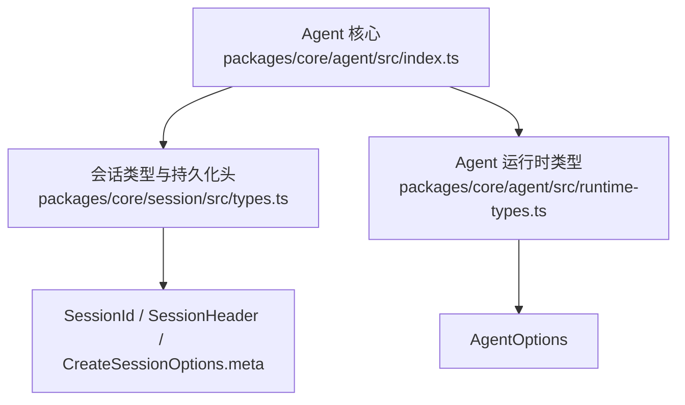
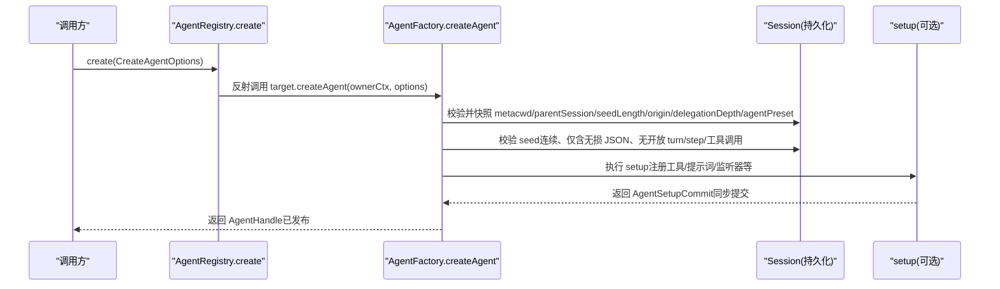
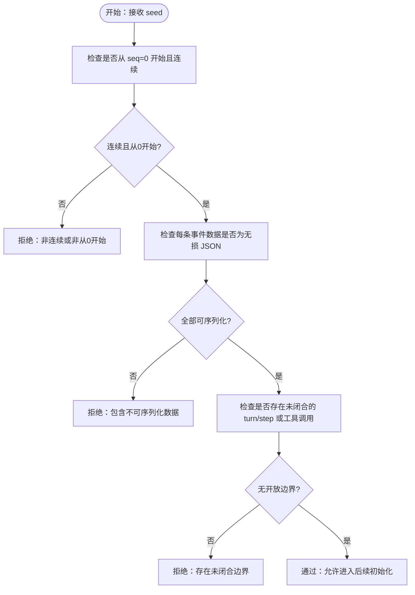
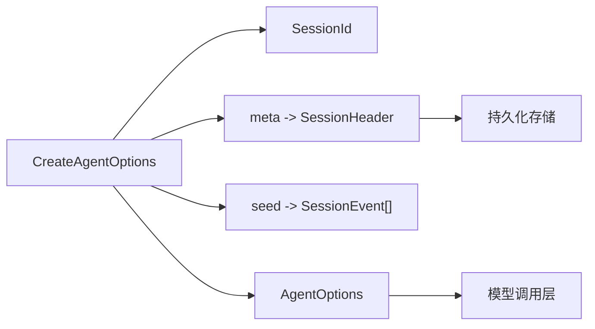

# 创建选项配置

<cite>
**本文引用的文件**
- [packages/core/agent/src/index.ts](file://packages/core/agent/src/index.ts)
- [packages/core/session/src/types.ts](file://packages/core/session/src/types.ts)
- [packages/core/agent/src/runtime-types.ts](file://packages/core/agent/src/runtime-types.ts)
</cite>

## 目录
1. [简介](#简介)
2. [项目结构](#项目结构)
3. [核心组件](#核心组件)
4. [架构总览](#架构总览)
5. [详细组件分析](#详细组件分析)
6. [依赖关系分析](#依赖关系分析)
7. [性能考虑](#性能考虑)
8. [故障排查指南](#故障排查指南)
9. [结论](#结论)
10. [附录](#附录)

## 简介
本文件聚焦于 CreateAgentOptions 接口的全部配置项，系统性说明其语义、约束与使用方式。重点覆盖：
- sessionId 的唯一性与生成规则
- meta 元数据字段的作用与验证边界（cwd、parentSession、seedLength、origin、delegationDepth、agentPreset）
- seed 历史数据的格式要求与校验点
- agentOptions 的配置项与默认行为
- signal 取消信号的使用场景与最佳实践
- 常见错误与处理建议
- 可操作的配置示例（以路径引用形式给出）

## 项目结构
CreateAgentOptions 定义位于 Agent 核心模块，并与 Session 持久化头信息紧密耦合；AgentOptions 用于指定模型调用参数。关键位置如下：
- CreateAgentOptions 接口定义：packages/core/agent/src/index.ts
- SessionId、SessionHeader、CreateSessionOptions.meta 等类型：packages/core/session/src/types.ts
- AgentOptions 及 Agent 运行时类型：packages/core/agent/src/runtime-types.ts

图表来源
- [packages/core/agent/src/index.ts:80-133](file://packages/core/agent/src/index.ts#L80-L133)
- [packages/core/session/src/types.ts:21-122](file://packages/core/session/src/types.ts#L21-L122)
- [packages/core/agent/src/runtime-types.ts:23-31](file://packages/core/agent/src/runtime-types.ts#L23-L31)

章节来源
- [packages/core/agent/src/index.ts:80-133](file://packages/core/agent/src/index.ts#L80-L133)
- [packages/core/session/src/types.ts:21-122](file://packages/core/session/src/types.ts#L21-L122)
- [packages/core/agent/src/runtime-types.ts:23-31](file://packages/core/agent/src/runtime-types.ts#L23-L31)

## 核心组件
- CreateAgentOptions：创建 Agent 的入口配置，包含会话标识、元数据、初始历史、Agent 选项、取消信号与可选 setup 钩子。
- SessionId：会话唯一标识的类型别名（带品牌标记），由上层工厂或宿主生成并传入。
- SessionHeader：持久化的会话头信息，来源于 CreateAgentOptions.meta，并在创建时进行校验与快照。
- AgentOptions：Agent 运行时的模型调用配置（provider、model、maxTokens）。

章节来源
- [packages/core/agent/src/index.ts:80-133](file://packages/core/agent/src/index.ts#L80-L133)
- [packages/core/session/src/types.ts:21-122](file://packages/core/session/src/types.ts#L21-L122)
- [packages/core/agent/src/runtime-types.ts:23-31](file://packages/core/agent/src/runtime-types.ts#L23-L31)

## 架构总览
下图展示了从调用方传入 CreateAgentOptions 到 Agent 创建完成的关键流程，包括元数据校验、种子历史校验、setup 执行与发布。

图表来源
- [packages/core/agent/src/index.ts:80-133](file://packages/core/agent/src/index.ts#L80-L133)
- [packages/core/agent/src/index.ts:405-415](file://packages/core/agent/src/index.ts#L405-L415)
- [packages/core/session/src/types.ts:58-99](file://packages/core/session/src/types.ts#L58-L99)

## 详细组件分析

### CreateAgentOptions 字段详解

- sessionId
  - 作用：当前 Agent/会话的运行时身份标识。
  - 唯一性要求：由工厂/宿主在创建时提供，需全局唯一且稳定，用于存储与检索。
  - 生成规则：类型上为带品牌的字符串（SessionId），具体生成策略由宿主实现；调用方不应自行构造裸字符串，应通过宿主提供的工厂或 API 获取。
  - 参考：[packages/core/session/src/types.ts:21-31](file://packages/core/session/src/types.ts#L21-L31)

- meta
  - 作用：会话创建元数据，会被持久化为 SessionHeader，并在异步初始化前进行校验与快照。
  - 字段说明与约束：
    - cwd：绝对工作目录（若存在）。用于记录会话创建时的上下文目录。
    - parentSession：父会话 ID（若为分叉/派生）。用于构建会话血缘。
    - seedLength：继承自种子的历史事件数量边界，用于区分“种子历史”和“后续活动”。
    - origin：粗略分类，当前限定为 'subagent'，表示该会话作为子代理创建。
    - delegationDepth：委托深度，顶层会话为 0，子代理为父深度+1；用于递归预算控制。
    - agentPreset：本次 Agent 组合所使用的预设标识，影响工具与提示词装配。
  - 参考：
    - [packages/core/agent/src/index.ts:83-101](file://packages/core/agent/src/index.ts#L83-L101)
    - [packages/core/session/src/types.ts:58-99](file://packages/core/session/src/types.ts#L58-L99)

- seed
  - 作用：初始回放/分叉历史，供新会话继承父会话的部分日志。
  - 格式要求：
    - 必须是从 seq 0 开始的连续事件序列。
    - 仅包含可无损 JSON 的数据。
    - 不得包含未闭合的 turn/step 或未完成的工具调用。
  - 校验时机：在工厂侧的“会话持久化校验/快照边界”进行验证，通过后才会继续后续异步初始化。
  - 参考：[packages/core/agent/src/index.ts:102-109](file://packages/core/agent/src/index.ts#L102-L109)

- agentOptions
  - 作用：Agent 运行时的模型调用配置。
  - 字段：
    - provider：模型提供者路由（需在调用时已注册适配器）。
    - model：模型标识（由所选 provider 解释）。
    - maxTokens：每次对话模型请求的最大输出 token 数。
  - 默认值：均为可选，未设置时使用系统或注册器默认值。
  - 参考：[packages/core/agent/src/runtime-types.ts:23-31](file://packages/core/agent/src/runtime-types.ts#L23-L31)

- signal
  - 作用：创建阶段的可选取消信号。
  - 生命周期：在返回的句柄可见之前被分离（detach），避免泄漏到后续运行期。
  - 使用场景：当创建过程耗时较长或需要外部中断（如页面卸载、任务取消）时，可通过 AbortSignal 提前终止创建。
  - 最佳实践：
    - 将信号与 UI/任务生命周期绑定，确保在不再需要时及时 abort。
    - 捕获并处理因取消导致的异常，避免误报为业务错误。
  - 参考：[packages/core/agent/src/index.ts:112-113](file://packages/core/agent/src/index.ts#L112-L113)

- setup（可选）
  - 作用：在 Agent 上下文创建后、会话/Agent 发布前执行的组合阶段，用于注册工具、提示词片段/变量、限制器、监听器以及等待的子插件等。
  - 语义要点：
    - 负责“组合”，不驱动 Agent 运行。
    - 所有注册内容在 session/created、agent/created、agent/session-start 及首次提示词组装之前可见。
    - 若 setup 抛出或被处置回滚，不会发布任何 id。
  - 参考：[packages/core/agent/src/index.ts:114-133](file://packages/core/agent/src/index.ts#L114-L133)

章节来源
- [packages/core/agent/src/index.ts:80-133](file://packages/core/agent/src/index.ts#L80-L133)
- [packages/core/session/src/types.ts:58-122](file://packages/core/session/src/types.ts#L58-L122)
- [packages/core/agent/src/runtime-types.ts:23-31](file://packages/core/agent/src/runtime-types.ts#L23-L31)

### 元数据与持久化头映射
CreateAgentOptions.meta 与 SessionHeader 的对应关系如下：

- cwd → SessionHeader.cwd
- parentSession → SessionHeader.parentSession
- seedLength → SessionHeader.seedLength
- origin → SessionHeader.origin
- delegationDepth → SessionHeader.delegationDepth
- agentPreset → SessionHeader.agentPreset

这些字段在创建时被持久化，用于恢复、分叉与呈现。

章节来源
- [packages/core/agent/src/index.ts:83-101](file://packages/core/agent/src/index.ts#L83-L101)
- [packages/core/session/src/types.ts:58-99](file://packages/core/session/src/types.ts#L58-L99)

### 历史数据（seed）校验流程图

图表来源
- [packages/core/agent/src/index.ts:102-109](file://packages/core/agent/src/index.ts#L102-L109)

## 依赖关系分析
- CreateAgentOptions 依赖 SessionId、SessionEvent 等类型，来自 dsh-session。
- meta 字段最终写入 SessionHeader，受持久化后端版本与加载逻辑保护。
- AgentOptions 影响模型调用层（provider/model/maxTokens），由运行时注册表解析。

图表来源
- [packages/core/agent/src/index.ts:80-133](file://packages/core/agent/src/index.ts#L80-L133)
- [packages/core/session/src/types.ts:21-122](file://packages/core/session/src/types.ts#L21-L122)
- [packages/core/agent/src/runtime-types.ts:23-31](file://packages/core/agent/src/runtime-types.ts#L23-L31)

章节来源
- [packages/core/agent/src/index.ts:80-133](file://packages/core/agent/src/index.ts#L80-L133)
- [packages/core/session/src/types.ts:21-122](file://packages/core/session/src/types.ts#L21-L122)
- [packages/core/agent/src/runtime-types.ts:23-31](file://packages/core/agent/src/runtime-types.ts#L23-L31)

## 性能考虑
- seed 过大可能导致创建阶段校验与快照开销增加，建议仅传递必要的历史前缀。
- setup 中应避免阻塞式 I/O；如需异步准备，应在 setup 内正确 await，并确保失败时能回滚注册。
- 合理设置 maxTokens，避免过大的响应导致内存与网络压力。

## 故障排查指南
- 创建被取消
  - 现象：create 调用抛出取消相关异常。
  - 原因：signal 被触发。
  - 处理：捕获并区分“用户主动取消”与“业务错误”，必要时重试或降级。
  - 参考：[packages/core/agent/src/index.ts:112-113](file://packages/core/agent/src/index.ts#L112-L113)

- seed 校验失败
  - 现象：创建阶段拒绝 seed。
  - 可能原因：
    - 非从 seq=0 开始或不连续。
    - 包含不可 JSON 序列化的数据。
    - 存在未闭合的 turn/step 或工具调用。
  - 处理：修正 seed 构造逻辑，确保满足连续性、可序列化与边界闭合。
  - 参考：[packages/core/agent/src/index.ts:102-109](file://packages/core/agent/src/index.ts#L102-L109)

- 元数据不一致
  - 现象：恢复或分叉后出现异常。
  - 可能原因：meta 字段与持久化头不一致（如 parentSession/seedLength/origin/delegationDepth/agentPreset）。
  - 处理：确保创建时 meta 与实际意图一致，并在恢复时保持一致性。
  - 参考：[packages/core/session/src/types.ts:58-99](file://packages/core/session/src/types.ts#L58-L99)

- 模型调用配置错误
  - 现象：首次请求失败或未按预期路由。
  - 可能原因：provider 未注册、model 无效、maxTokens 不合理。
  - 处理：确认注册表状态与配置值，调整 maxTokens。
  - 参考：[packages/core/agent/src/runtime-types.ts:23-31](file://packages/core/agent/src/runtime-types.ts#L23-L31)

章节来源
- [packages/core/agent/src/index.ts:102-113](file://packages/core/agent/src/index.ts#L102-L113)
- [packages/core/session/src/types.ts:58-99](file://packages/core/session/src/types.ts#L58-L99)
- [packages/core/agent/src/runtime-types.ts:23-31](file://packages/core/agent/src/runtime-types.ts#L23-L31)

## 结论
CreateAgentOptions 提供了创建 Agent 所需的最小而完备的配置面：通过 sessionId 标识会话、通过 meta 固化会话元数据、通过 seed 安全地继承历史、通过 agentOptions 控制模型调用、通过 signal 支持创建期取消，并通过可选 setup 完成 Agent 的组合装配。遵循上述约束与最佳实践，可确保会话创建的正确性、可恢复性与可观测性。

## 附录

### 配置示例（以路径引用形式）
- 基础创建（仅 sessionId + agentOptions）
  - 参考：[packages/core/agent/src/index.ts:80-133](file://packages/core/agent/src/index.ts#L80-L133)
- 带元数据的创建（cwd、parentSession、seedLength、origin、delegationDepth、agentPreset）
  - 参考：[packages/core/agent/src/index.ts:83-101](file://packages/core/agent/src/index.ts#L83-L101)
  - 参考：[packages/core/session/src/types.ts:58-99](file://packages/core/session/src/types.ts#L58-L99)
- 带历史种子的创建（seed）
  - 参考：[packages/core/agent/src/index.ts:102-109](file://packages/core/agent/src/index.ts#L102-L109)
- 带取消信号的创建（signal）
  - 参考：[packages/core/agent/src/index.ts:112-113](file://packages/core/agent/src/index.ts#L112-L113)
- 带组合钩子的创建（setup）
  - 参考：[packages/core/agent/src/index.ts:114-133](file://packages/core/agent/src/index.ts#L114-L133)