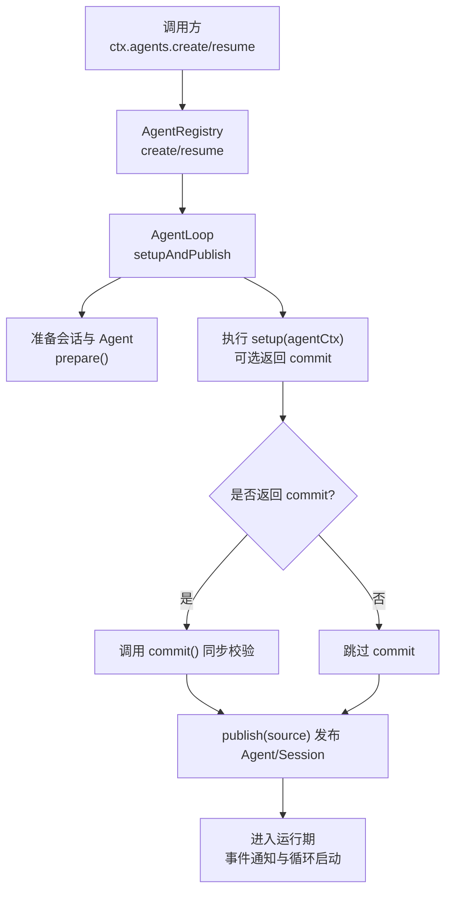
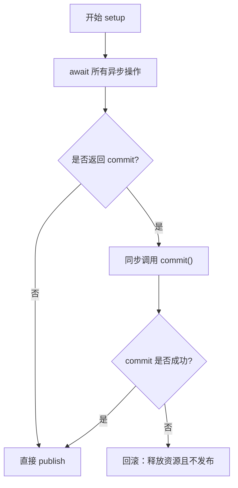
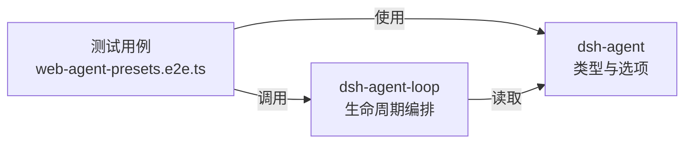

# 设置回调函数

<cite>
**本文引用的文件**
- [packages/core/agent/src/index.ts](file://packages/core/agent/src/index.ts)
- [packages/core/agent-loop/src/index.ts](file://packages/core/agent-loop/src/index.ts)
- [apps/cli/tests/web-agent-presets.e2e.ts](file://apps/cli/tests/web-agent-presets.e2e.ts)
</cite>

## 目录
1. [简介](#简介)
2. [项目结构](#项目结构)
3. [核心组件](#核心组件)
4. [架构总览](#架构总览)
5. [详细组件分析](#详细组件分析)
6. [依赖关系分析](#依赖关系分析)
7. [性能考量](#性能考量)
8. [故障排查指南](#故障排查指南)
9. [结论](#结论)
10. [附录：示例与最佳实践](#附录示例与最佳实践)

## 简介
本章节聚焦 AgentSetup 回调函数的执行时机与作用机制，解释 setup 函数接收的 agentCtx 上下文对象、如何在回调中进行 Agent 的自定义初始化；说明 AgentSetupCommit 提交机制的工作原理、commit() 方法的调用时机与验证作用；阐述 setup 回调中的错误处理与回滚机制；并提供服务注册、工具绑定、权限配置等初始化操作的参考路径。

## 项目结构
围绕 AgentSetup 的关键代码分布在两个包中：
- dsh-agent（接口与类型定义）：定义 AgentSetup、AgentSetupCommit、CreateAgentOptions.setup、ResumeAgentOptions.setup 等契约。
- dsh-agent-loop（具体实现）：在创建或恢复 Agent 时执行 setup，并在合适的时机调用 commit()，随后发布 Agent/Session 并启动循环。



图表来源
- [packages/core/agent/src/index.ts:114-132](file://packages/core/agent/src/index.ts#L114-L132)
- [packages/core/agent-loop/src/index.ts:606-645](file://packages/core/agent-loop/src/index.ts#L606-L645)

章节来源
- [packages/core/agent/src/index.ts:52-71](file://packages/core/agent/src/index.ts#L52-L71)
- [packages/core/agent/src/index.ts:114-132](file://packages/core/agent/src/index.ts#L114-L132)
- [packages/core/agent/src/index.ts:146-155](file://packages/core/agent/src/index.ts#L146-L155)
- [packages/core/agent-loop/src/index.ts:606-645](file://packages/core/agent-loop/src/index.ts#L606-L645)

## 核心组件
- AgentSetup：一个可同步或异步的回调，用于在未发布的 Agent 作用域内完成初始化。它接收 agentCtx（未发布的 Agent 作用域上下文），可选择返回 AgentSetupCommit。
- AgentSetupCommit：包含 commit() 方法，用于在“发布前”进行最终校验与提交。若抛出异常，将触发回滚。
- CreateAgentOptions.setup / ResumeAgentOptions.setup：分别对应新建与恢复场景下的 setup 注入点。
- AgentLoop.setupAndPublish：负责编排 setup 的执行、commit 的调用以及发布流程。

章节来源
- [packages/core/agent/src/index.ts:56-71](file://packages/core/agent/src/index.ts#L56-L71)
- [packages/core/agent/src/index.ts:114-132](file://packages/core/agent/src/index.ts#L114-L132)
- [packages/core/agent/src/index.ts:146-155](file://packages/core/agent/src/index.ts#L146-L155)
- [packages/core/agent-loop/src/index.ts:624-645](file://packages/core/agent-loop/src/index.ts#L624-L645)

## 架构总览
下图展示了从创建到发布的完整时序，包括 setup 的执行、commit 的调用与发布边界。

```mermaid
sequenceDiagram
participant Caller as "调用方"
participant Registry as "AgentRegistry"
participant Loop as "AgentLoop"
participant Prep as "会话准备"
participant Setup as "setup(agentCtx)"
participant Commit as "commit()"
participant Pub as "publish(source)"
Caller->>Registry : create/resume(options)
Registry->>Loop : createAgent/resume(ownerCtx, options)
Loop->>Prep : 准备会话与 Agent
Loop->>Setup : 执行 setup(agentCtx)
alt 返回了 commit
Setup-->>Loop : AgentSetupCommit
Loop->>Commit : 调用 commit() 做发布前校验
else 未返回 commit
Setup-->>Loop : void
end
Loop->>Pub : publish(source)
Pub-->>Caller : 返回已发布的 AgentHandle
```

图表来源
- [packages/core/agent-loop/src/index.ts:606-645](file://packages/core/agent-loop/src/index.ts#L606-L645)
- [packages/core/agent/src/index.ts:114-132](file://packages/core/agent/src/index.ts#L114-L132)

## 详细组件分析

### AgentSetup 与 agentCtx 的作用
- agentCtx 是“未发布”的 Agent 作用域上下文。在此作用域内进行的任何注册（工具、技能、提示词片段、权限限制、监听器等）都会在发布前生效，确保外部观察者不会看到部分配置的中间态。
- setup 可以是同步或异步。若为异步，框架会在所有 await  settle 后、立即调用 commit()（如果存在）。

章节来源
- [packages/core/agent/src/index.ts:114-132](file://packages/core/agent/src/index.ts#L114-L132)
- [packages/core/agent/src/index.ts:56-71](file://packages/core/agent/src/index.ts#L56-L71)

### AgentSetupCommit 与 commit() 的调用时机
- 当 setup 返回 AgentSetupCommit 时，框架会在 setup 全部 settle 之后、publish 之前同步调用 commit()。
- commit() 的职责是对“即将发布”的状态做最终校验。若抛出异常，将触发回滚，不发布该 Agent/Session。



图表来源
- [packages/core/agent-loop/src/index.ts:624-645](file://packages/core/agent-loop/src/index.ts#L624-L645)
- [packages/core/agent/src/index.ts:56-71](file://packages/core/agent/src/index.ts#L56-L71)

### 错误处理与回滚机制
- 在 setup 阶段抛出的错误或 Promise 拒绝，会触发回滚：释放已准备的资源，且不发布 Agent/Session。
- 若 setup 返回了 commit，而 commit() 抛出异常，同样会回滚。
- 对于 resume 场景，加载持久化与 setup 均受取消信号保护，避免挂起或泄漏。

章节来源
- [packages/core/agent/src/index.ts:114-132](file://packages/core/agent/src/index.ts#L114-L132)
- [packages/core/agent-loop/src/index.ts:624-645](file://packages/core/agent-loop/src/index.ts#L624-L645)
- [packages/core/agent-loop/src/index.ts:667-709](file://packages/core/agent-loop/src/index.ts#L667-L709)

### 实际使用示例（参考路径）
以下示例来自测试用例，展示在 setup 中通过上下文挂载预设、组合能力。你可以据此扩展为服务注册、工具绑定、权限配置等操作。

- 挂载预设以组合工具与能力
  - 参考路径：[apps/cli/tests/web-agent-presets.e2e.ts:173-184](file://apps/cli/tests/web-agent-presets.e2e.ts#L173-L184)
  - 参考路径：[apps/cli/tests/web-agent-presets.e2e.ts:195-215](file://apps/cli/tests/web-agent-presets.e2e.ts#L195-L215)
  - 参考路径：[apps/cli/tests/web-agent-presets.e2e.ts:217-236](file://apps/cli/tests/web-agent-presets.e2e.ts#L217-L236)
  - 参考路径：[apps/cli/tests/web-agent-presets.e2e.ts:261-285](file://apps/cli/tests/web-agent-presets.e2e.ts#L261-L285)
  - 参考路径：[apps/cli/tests/web-agent-presets.e2e.ts:287-317](file://apps/cli/tests/web-agent-presets.e2e.ts#L287-L317)

- 多 Agent 隔离与独立生命周期
  - 参考路径：[apps/cli/tests/web-agent-presets.e2e.ts:238-259](file://apps/cli/tests/web-agent-presets.e2e.ts#L238-L259)

- 在 setup 中组合子代理能力
  - 参考路径：[apps/cli/tests/web-agent-presets.e2e.ts:604-606](file://apps/cli/tests/web-agent-presets.e2e.ts#L604-L606)
  - 参考路径：[apps/cli/tests/web-agent-presets.e2e.ts:630-631](file://apps/cli/tests/web-agent-presets.e2e.ts#L630-L631)

注意：以上为“参考路径”，不包含具体代码内容。你可在这些位置查看完整的 setup 用法模式。

## 依赖关系分析
- dsh-agent 提供 AgentSetup、AgentSetupCommit 等类型与选项字段，作为跨包的契约。
- dsh-agent-loop 实现具体的生命周期编排：准备会话、执行 setup、调用 commit、发布并启动循环。
- 测试用例展示了在真实环境中如何通过 ctx 访问服务（如 agentPresets、tools、systemPrompt）来完成初始化。



图表来源
- [packages/core/agent/src/index.ts:114-132](file://packages/core/agent/src/index.ts#L114-L132)
- [packages/core/agent-loop/src/index.ts:606-645](file://packages/core/agent-loop/src/index.ts#L606-L645)
- [apps/cli/tests/web-agent-presets.e2e.ts:173-184](file://apps/cli/tests/web-agent-presets.e2e.ts#L173-L184)

章节来源
- [packages/core/agent/src/index.ts:114-132](file://packages/core/agent/src/index.ts#L114-L132)
- [packages/core/agent-loop/src/index.ts:606-645](file://packages/core/agent-loop/src/index.ts#L606-L645)
- [apps/cli/tests/web-agent-presets.e2e.ts:173-184](file://apps/cli/tests/web-agent-presets.e2e.ts#L173-L184)

## 性能考量
- setup 应在最小必要范围内完成初始化，避免阻塞发布。
- 若需要耗时操作，建议使用异步并配合取消信号（resume 场景已内置对 owner 与工厂销毁的取消支持）。
- 将 commit() 设计为轻量校验，避免在 commit 中执行重计算或 I/O。

## 故障排查指南
- 现象：创建/恢复失败且未发布 Agent/Session
  - 可能原因：setup 抛出错误或 Promise 拒绝；或 commit() 抛出异常。
  - 处理建议：检查 setup 内部异步逻辑与 commit 校验逻辑，确认资源清理正确。
  - 参考路径：[packages/core/agent-loop/src/index.ts:624-645](file://packages/core/agent-loop/src/index.ts#L624-L645)

- 现象：长时间无响应或卡住
  - 可能原因：setup 中的异步任务未 settle；或 resume 的持久化加载被取消但未释放。
  - 处理建议：确保所有 await 能正常结束；利用取消信号及时中止长任务。
  - 参考路径：[packages/core/agent-loop/src/index.ts:667-709](file://packages/core/agent-loop/src/index.ts#L667-L709)

- 现象：多个 Agent 互相影响
  - 可能原因：未在各自作用域内注册能力；或在共享作用域中误改全局状态。
  - 处理建议：严格使用 setup 提供的 agentCtx 进行作用域内注册。
  - 参考路径：[apps/cli/tests/web-agent-presets.e2e.ts:238-259](file://apps/cli/tests/web-agent-presets.e2e.ts#L238-L259)

## 结论
AgentSetup 提供了在 Agent 发布前进行安全初始化的可靠机制。通过 agentCtx 在作用域内完成服务注册、工具绑定与权限配置，并通过可选的 AgentSetupCommit 在发布边界进行最终校验。框架保证：setup 与 commit 的错误会触发回滚，确保不会发布部分配置的 Agent/Session。结合测试用例中的 preset 挂载模式，可以高效地组合不同能力的 Agent。

## 附录：示例与最佳实践
- 服务注册
  - 在 setup 中通过 ctx 获取服务并进行挂载或配置。
  - 参考路径：[apps/cli/tests/web-agent-presets.e2e.ts:173-184](file://apps/cli/tests/web-agent-presets.e2e.ts#L173-L184)

- 工具绑定
  - 使用 ctx.tools.schemas 或相关 API 在作用域内注册工具，确保仅当前 Agent 可见。
  - 参考路径：[apps/cli/tests/web-agent-presets.e2e.ts:195-215](file://apps/cli/tests/web-agent-presets.e2e.ts#L195-L215)

- 权限配置
  - 在 setup 中通过 ctx 的权限或服务进行限制，确保最小权限原则。
  - 参考路径：[apps/cli/tests/web-agent-presets.e2e.ts:217-236](file://apps/cli/tests/web-agent-presets.e2e.ts#L217-L236)

- 组合与继承
  - 通过 preset 或子代理组合能力，保持模块化与可复用性。
  - 参考路径：[apps/cli/tests/web-agent-presets.e2e.ts:261-285](file://apps/cli/tests/web-agent-presets.e2e.ts#L261-L285)
  - 参考路径：[apps/cli/tests/web-agent-presets.e2e.ts:604-606](file://apps/cli/tests/web-agent-presets.e2e.ts#L604-L606)