# Agent 并��制

<cite>
**本文引用的文件**
- [agent.ts](file://packages/core/agent-loop/src/agent.ts)
- [tool-calls.ts](file://packages/core/agent-loop/src/tool-calls.ts)
- [runtime-context.ts](file://packages/core/agent-loop/src/runtime-context.ts)
- [scope.ts](file://packages/client/runtime/src/client/agents/scope.ts)
- [scope.spec.ts](file://packages/core/scope/tests/scope.spec.ts)
- [agent-initiator.spec.ts](file://packages/core/agent-loop/tests/agent-initiator.spec.ts)
- [agent.spec.ts](file://packages/core/agent-loop/tests/agent.spec.ts)
</cite>

## 目录
1. [简介](#简介)
2. [项目结�](#项目结�)
3. [核心组件](#核心组件)
4. [��总览](#��总览)
5. [详细组件分�](#详细组件分�)
6. [�赖关系分�](#�赖关系分�)
7. [性能考�](#性能考�)
8. [故障�查指�](#故障�查指�)
9. [结论](#结论)
10. [附录](#附录)

## 简介
本文件�焦� Agent 的并��制�异步处�机制，围绕以下关键点展开：
- 使用 AsyncLocalStorage（通过 Context 作用域）在 Agent 上下文中传播，确�异步�作继承�起者 Agent 上下文。
- InitiatorRun 嵌套链管��activeInitiatorRuns 计数�递归边界处�。
- 注册表访问的线程安全�状�一致性维护。
- �消机制：AbortSignal 的使用��消传播。
- 工作队列�任务调度：高并�下的资��争�死�预防。
- 并�调试�性能分�方法论。

## 项目结�
Agent 驱动�� agent-loop 包中，核心由 ReactLoopAgent ��，负责轮询�地�进“轮次（turn）�和“步骤（step）�，并通过 Inbox �收外部输入�通过 LLM ��调用生��应�执行工具调用并�写会�日志。上下文�作用域通过 Context/Scope 体系注入，�消信�贯穿整个执行链路。

```mermaid
graph TB
A["ReactLoopAgent<br/>轮次/步骤驱动"] --> B["Inbox<br/>消�入队/唤醒"]
A --> C["LLM 适�器<br/>��请求/�试"]
A --> D["工具执行器<br/>executeToolCalls"]
A --> E["会�日志<br/>append/deriveMessages"]
A --> F["Context/Scope<br/>作用域�事件分�"]
F --> G["AsyncLocalStorage<br/>上下文传播"]
```

图表��
- [agent.ts:64-193](file://packages/core/agent-loop/src/agent.ts#L64-L193)
- [agent.ts:225-330](file://packages/core/agent-loop/src/agent.ts#L225-L330)
- [agent.ts:332-495](file://packages/core/agent-loop/src/agent.ts#L332-L495)

章节��
- [agent.ts:64-193](file://packages/core/agent-loop/src/agent.ts#L64-L193)
- [agent.ts:225-330](file://packages/core/agent-loop/src/agent.ts#L225-L330)
- [agent.ts:332-495](file://packages/core/agent-loop/src/agent.ts#L332-L495)

## 核心组件
- ReactLoopAgent：��例驱动一个会�的生命周期，维护 phase（idle/maintenance/running）�AbortController�轮次/步骤计数器，以�活动完� Promise。
- Inbox：消�入队�按目标（next-turn/next-step）�用�唤醒驱动。
- LLM 适�层：�建请求���读��错误处���试策略。
- 工具执行器：并行或串行执行工具调用，必�时将上下文�写 next-step。
- Context/Scope：�供事件分��系统�示组装��行时上下文投影，以�通过 AsyncLocalStorage ��的上下文传播。

章节��
- [agent.ts:64-193](file://packages/core/agent-loop/src/agent.ts#L64-L193)
- [agent.ts:225-330](file://packages/core/agent-loop/src/agent.ts#L225-L330)
- [agent.ts:332-495](file://packages/core/agent-loop/src/agent.ts#L332-L495)

## ��总览
下图展示一次用户输入到最终��的完整�程，包括上下文传播��消信�传递�工具调用�结��写。

```mermaid
sequenceDiagram
participant U as "调用方"
participant A as "ReactLoopAgent"
participant I as "Inbox"
participant S as "Session"
participant L as "LLM 适�器"
participant T as "工具执行器"
participant C as "Context/Scope"
U->>A : send/followup/steer/inject
A->>I : splice(目标, �入�置, 消�)
A->>A : wakeDriver()
A->>C : withInitiator(agent)
A->>A : kick() -> turn() -> preStep()
A->>S : append("turn/start")
A->>A : step()
A->>L : stream(request + signal)
L-->>A : chunk* (�续追加到 Session)
A->>T : executeToolCalls(toolCalls, signal)
T-->>A : concluded?
A->>S : append("assistant/message", usage)
A->>S : append("step/end", "turn/end")
A-->>U : whenIdle()/status
```

图表��
- [agent.ts:113-193](file://packages/core/agent-loop/src/agent.ts#L113-L193)
- [agent.ts:225-330](file://packages/core/agent-loop/src/agent.ts#L225-L330)
- [agent.ts:332-495](file://packages/core/agent-loop/src/agent.ts#L332-L495)

## 详细组件分�

### 上下文传播� AsyncLocalStorage
- 作用域入�：wakeDriver 中使用 loopCtx.agents.withInitiator(this, () => this.kick()) 将当� Agent 作为 Initiator �入作用域栈，确��续所有异步分支（LLM 调用�工具执行�事件�调等）都能通过 Context ��到�起者 Agent。
- 上下文装�：preStep 中通过 loopCtx.systemPrompt.assemble(assembleContextFor(this, signal)) 组装系统�示�上下文，并在决策阶段�并为消��列。
- �行时上下文投影：RuntimeContextProjection 基� session � ctx 派生�行时视图，供�件�工具消费。

```mermaid
flowchart TD
Start(["进入 withInitiator"]) --> Push["�入 Initiator 栈"]
Push --> Exec["执行 kick/turn/step"]
Exec --> UseCtx["assembleContextFor / RuntimeContextProjection"]
UseCtx --> AsyncOps["LLM �/工具调用/事件�调"]
AsyncOps --> Pop["退出时弹出 Initiator"]
Pop --> End(["��外层上下文"])
```

图表��
- [agent.ts:172-193](file://packages/core/agent-loop/src/agent.ts#L172-L193)
- [agent.ts:225-243](file://packages/core/agent-loop/src/agent.ts#L225-L243)
- [runtime-context.ts](file://packages/core/agent-loop/src/runtime-context.ts)

章节��
- [agent.ts:172-193](file://packages/core/agent-loop/src/agent.ts#L172-L193)
- [agent.ts:225-243](file://packages/core/agent-loop/src/agent.ts#L225-L243)
- [runtime-context.ts](file://packages/core/agent-loop/src/runtime-context.ts)

### InitiatorRun 嵌套链� activeInitiatorRuns 计数
- 嵌套链：withInitiator 以栈形�维护 Initiator 链，支�� Agent/�作用域嵌套调用，���个异步分支都能正确�溯到其直��起者。
- 计数�边界：activeInitiatorRuns 用�统计当�活跃 Initiator 数�，防止���动或泄�；当计数归零时清�资�。
- 递归边界：在 preStep/step 等关键路径上检查 AbortSignal � phase，��在已中止或空闲状�下继续�进。

```mermaid
classDiagram
class Scope {
+withInitiator(agent, fn)
+ctx
}
class ReactLoopAgent {
-phase
-activityDone
+send()
+followup()
+steer()
+inject()
+cancel()
+runMaintenance()
+whenIdle()
-kick()
-turn()
-step()
}
Scope --> ReactLoopAgent : "withInitiator 包装执行"
```

图表��
- [scope.ts](file://packages/client/runtime/src/client/agents/scope.ts)
- [agent.ts:172-193](file://packages/core/agent-loop/src/agent.ts#L172-L193)
- [agent.ts:225-330](file://packages/core/agent-loop/src/agent.ts#L225-L330)

章节��
- [scope.ts](file://packages/client/runtime/src/client/agents/scope.ts)
- [agent.ts:172-193](file://packages/core/agent-loop/src/agent.ts#L172-L193)
- [agent.ts:225-330](file://packages/core/agent-loop/src/agent.ts#L225-L330)

### 并�安全�状�一致性
- �驱动模�：ReactLoopAgent 在�一时刻仅有一个 running 驱动（kick），通过 activityDone 串�多次唤醒，���入导致的��。
- 阶段机：phase 严格区分 idle/maintenance/running，任何�法转�都会抛出错误，�障状�一致性。
- 注册表访问：事件分��系统�示组装通过 Context �供的����进行，��全局��状�被并�修改。
- 会�写入：所有对 Session 的写入�通过 append，且附带 surfaceOp/sourceEventSeqs 等元数�，便��放�一致性校验。

```mermaid
stateDiagram-v2
[*] --> Idle
Idle --> Running : "wakeDriver()"
Running --> Idle : "turn 结�/无待处�消�"
Idle --> Maintenance : "runMaintenance()"
Maintenance --> Idle : "job 完�"
```

图表��
- [agent.ts:64-193](file://packages/core/agent-loop/src/agent.ts#L64-L193)
- [agent.ts:225-330](file://packages/core/agent-loop/src/agent.ts#L225-L330)

章节��
- [agent.ts:64-193](file://packages/core/agent-loop/src/agent.ts#L64-L193)
- [agent.ts:225-330](file://packages/core/agent-loop/src/agent.ts#L225-L330)

### �消机制� AbortSignal 传播
- 统一信��：�个 running 阶段�有独立的 AbortController，cancel 会清空收件箱并触� abort。
- 全链路传播：preStep�step�LLM �迭代�工具执行��调用 signal.throwIfAborted()，确��消立�生效。
- 粘性终止：max-tokens 标记在 turn 内��，�使�续步骤正常完�也��级 turn 结�。
- 维护模�隔离：maintenance 模�下 cancel �影� inbox �留策略（keepInbox）。

```mermaid
sequenceDiagram
participant U as "调用方"
participant A as "ReactLoopAgent"
participant L as "LLM �"
participant T as "工具执行器"
U->>A : cancel(cause)
A->>A : phase.abort.abort(cause)
A->>L : throwIfAborted()
L-->>A : �止消费
A->>T : throwIfAborted()
T-->>A : 中断执行
A-->>U : è¿”å›�/抛出å�–消å�Ÿå›
```

图表��
- [agent.ts:134-140](file://packages/core/agent-loop/src/agent.ts#L134-L140)
- [agent.ts:225-243](file://packages/core/agent-loop/src/agent.ts#L225-L243)
- [agent.ts:332-400](file://packages/core/agent-loop/src/agent.ts#L332-L400)

章节��
- [agent.ts:134-140](file://packages/core/agent-loop/src/agent.ts#L134-L140)
- [agent.ts:225-243](file://packages/core/agent-loop/src/agent.ts#L225-L243)
- [agent.ts:332-400](file://packages/core/agent-loop/src/agent.ts#L332-L400)

### 工作队列�任务调度
- 入队�唤醒：send/followup/steer/inject 将消��入 Inbox 指定目标（next-turn/next-step），wakeup=true 时触� wakeDriver。
- 串行�进：turn 循�内�次处� step，直到满足终止�件（空消��blocked�max-tokens�aborted）。
- 防死�设计：
  - �次 turn 结��若�有待处�消�，创建新的 AbortController 并�置 step，��旧�制器导致的状��一致。
  - maintenance � aborted 活动中的唤醒会被 latch 到 wakeRequested，收敛�� replay，����唤醒。
- 工具上下文�写：工具执行��将上下文追加到 next-step，形�“工具输出→下一步输入�的闭�。

```mermaid
flowchart TD
Q(["Inbox 有消�?"]) --> |是| P["claim(target, turn)"]
P --> D{"决策: reject?"}
D --> |是| B["turn 结�(blocked)"]
D --> |�| S["step() 执行"]
S --> R{"是� max-tokens?"}
R --> |是| M["记录粘性终止"]
R --> |�| T{"是�有工具调用?"}
T --> |是| X["executeToolCalls(signal)"]
X --> C{"concluded?"}
C --> |�| N["将上下文追加到 next-step"]
N --> P
C --> |是| E["step 完�"]
T --> |�| E
E --> J{"inbox.nextStep 为空?"}
J --> |是| END["turn 结�"]
J --> |�| P
```

图表��
- [agent.ts:225-330](file://packages/core/agent-loop/src/agent.ts#L225-L330)
- [agent.ts:332-400](file://packages/core/agent-loop/src/agent.ts#L332-L400)
- [tool-calls.ts](file://packages/core/agent-loop/src/tool-calls.ts)

章节��
- [agent.ts:225-330](file://packages/core/agent-loop/src/agent.ts#L225-L330)
- [agent.ts:332-400](file://packages/core/agent-loop/src/agent.ts#L332-L400)
- [tool-calls.ts](file://packages/core/agent-loop/src/tool-calls.ts)

### 并�调试�性能分�
- 断点�日志：在 preStep�step�LLM �迭代�工具执行��设置断点，观察 turn/step 计数� signal.aborted 状�。
- 指标采集：利用 session.append 的事件�列�追踪耗时���，结� request/header �更事件定��置漂移。
- 常�并�问题定�：
  - ��唤醒：检查 wakeRequested � activityDone 是�被正确�用。
  - �消未生效：确认�异步分支是�调用 signal.throwIfAborted()。
  - 死�：检查 turn 结�时是��置 AbortController � step，��旧�制器残留。
- 测试辅助：使用 agent-initiator � scope 相关测试用例验�作用域��消行为。

章节��
- [agent.spec.ts](file://packages/core/agent-loop/tests/agent.spec.ts)
- [agent-initiator.spec.ts](file://packages/core/agent-loop/tests/agent-initiator.spec.ts)
- [scope.spec.ts](file://packages/core/scope/tests/scope.spec.ts)

## �赖关系分�
- ReactLoopAgent �赖：
  - Inbox：消�队列�唤醒。
  - Context/Scope：事件分��系统�示组装�作用域传播。
  - LLM 适�器：请求�建���读��错误��试。
  - Session：�久化事件�消�。
  - 工具执行器：工具调用�上下文�写。
- 作用域� Initiator：
  - withInitiator 将 Agent �入作用域栈，确�异步分支�访问�起者。
  - activeInitiatorRuns 计数确�资�生命周期正确。

```mermaid
graph LR
A["ReactLoopAgent"] --> B["Inbox"]
A --> C["Context/Scope"]
A --> D["LLM 适�器"]
A --> E["Session"]
A --> F["工具执行器"]
C --> G["AsyncLocalStorage"]
```

图表��
- [agent.ts:64-193](file://packages/core/agent-loop/src/agent.ts#L64-L193)
- [agent.ts:225-330](file://packages/core/agent-loop/src/agent.ts#L225-L330)
- [agent.ts:332-495](file://packages/core/agent-loop/src/agent.ts#L332-L495)

章节��
- [agent.ts:64-193](file://packages/core/agent-loop/src/agent.ts#L64-L193)
- [agent.ts:225-330](file://packages/core/agent-loop/src/agent.ts#L225-L330)
- [agent.ts:332-495](file://packages/core/agent-loop/src/agent.ts#L332-L495)

## 性能考�
- 热路径优化：dispatch 在�造时��，��热点路径分�。
- ��处�：LLM �应分�追加，�少内存峰值。
- 粘性终止：max-tokens 标记���必�的�续步骤，��无效计算。
- 请求头缓存：首次登录��用 header，�少���列化�比较。
- 工具调用批处�：尽�能在一次 step 中完�多个工具调用，�少往返。

[本节为通用指导，�直�分�具体文件]

## 故障�查指�
- 症状：�消��继续执行
  - 检查：�异步分支是�调用 signal.throwIfAborted()。
  - �考：step �工具执行�的信�检查。
- 症状：多次唤醒导致��轮次
  - 检查：wakeRequested � activityDone 是�正确�用；maintenance/aborted 场景下是� latch。
- 症状：上下文丢失
  - 检查：是�在 withInitiator 包裹的函数内执行；preStep 是�正确组装上下文。
- 症状：死�或��
  - 检查：turn 结�时是��置 AbortController � step；inbox 是��有 pending 消�。

章节��
- [agent.ts:134-140](file://packages/core/agent-loop/src/agent.ts#L134-L140)
- [agent.ts:225-330](file://packages/core/agent-loop/src/agent.ts#L225-L330)
- [agent.ts:332-400](file://packages/core/agent-loop/src/agent.ts#L332-L400)

## 结论
该 Agent ��通过�驱动模��严格的阶段机�统一的�消信��作用域传播，��了高并�下的安全�一致性。Inbox � turn/step 调度确�了任务有��进，while 工具执行�上下文�写形�了�活的闭�。��完善的测试�调试手段，�在��场景中稳定�行。

[本节为总结性内容，�直�分�具体文件]

## 附录
- 术语
  - Turn：一轮对�，包�若干 Step。
  - Step：一次 LLM 调用��能的工具执行。
  - InboxTarget：消�投递目标（next-turn/next-step）。
  - AbortSignal：�消信�，贯穿执行链路。
- 最佳�践
  - 始终在 withInitiator 中执行�能产生异步分支的�作。
  - 在关键异步点检查 AbortSignal。
  - ��在 maintenance 或已中止活动中�� wakeup。
  - 使用 session.append 的 sourceEventSeqs 关�事件，便��放�诊断。

[本节为补充说�，�直�分�具体文件]