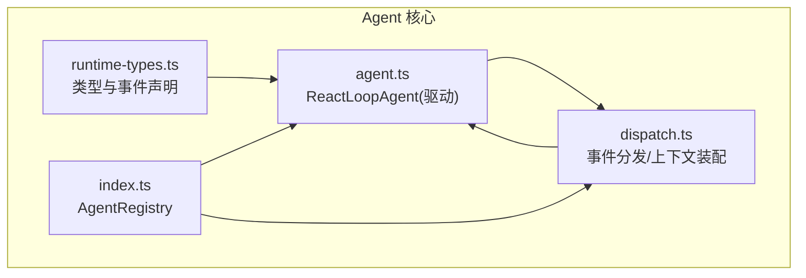
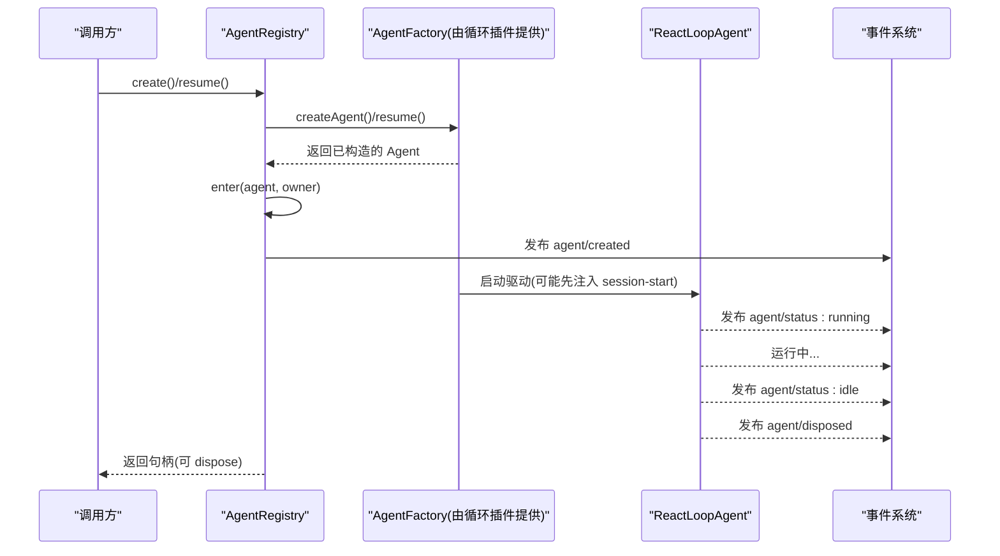
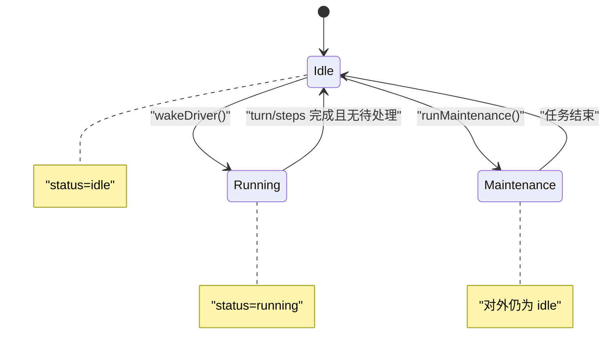
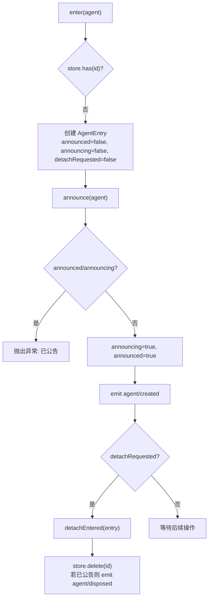
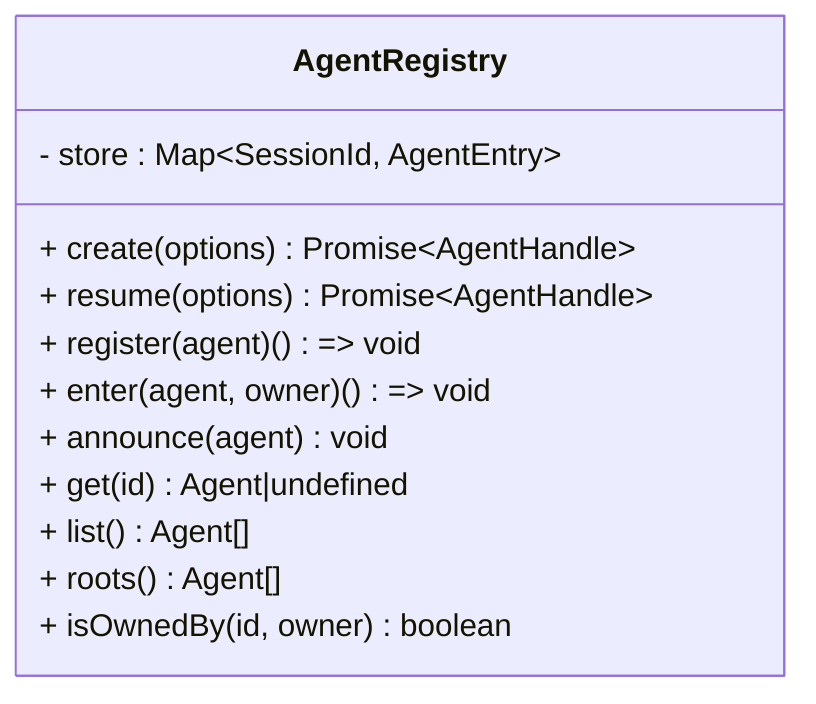
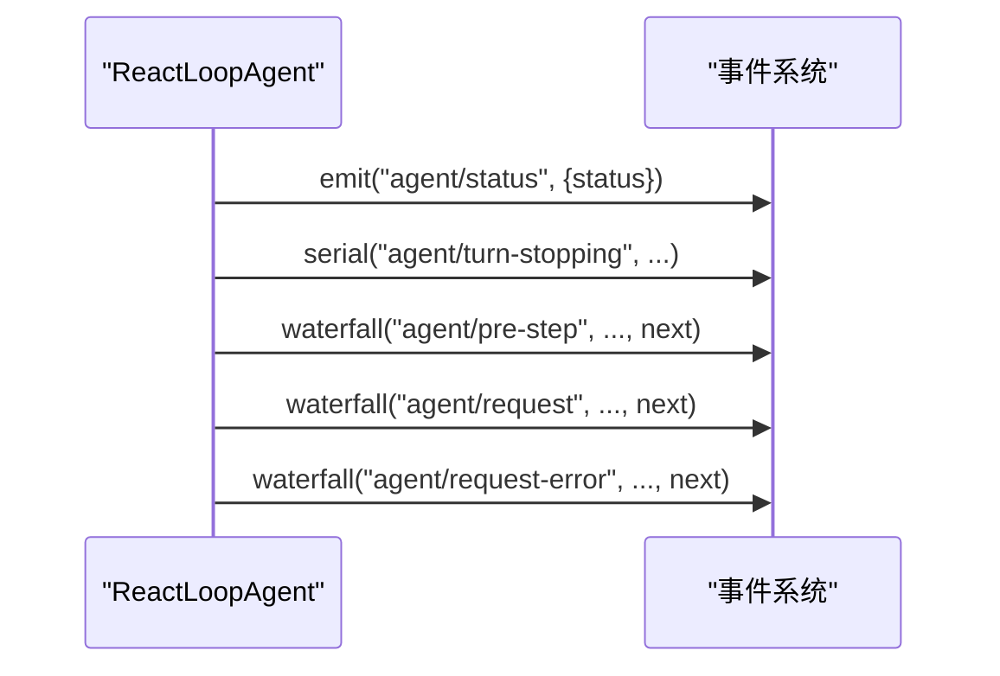
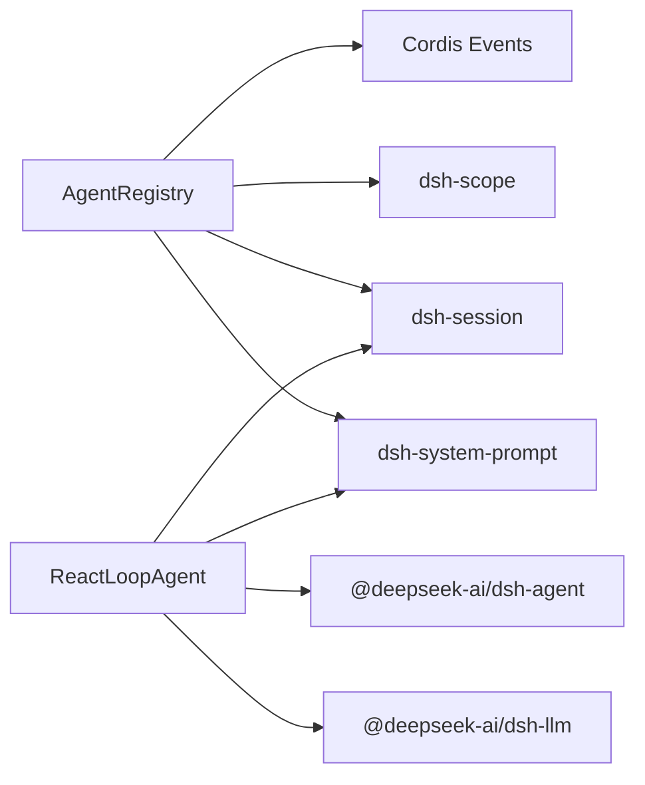

# Agent 状态管理

<cite>
**本文引用的文件**
- [packages/core/agent/src/index.ts](file://packages/core/agent/src/index.ts)
- [packages/core/agent/src/runtime-types.ts](file://packages/core/agent/src/runtime-types.ts)
- [packages/core/agent/src/dispatch.ts](file://packages/core/agent/src/dispatch.ts)
- [packages/core/agent-loop/src/agent.ts](file://packages/core/agent-loop/src/agent.ts)
</cite>

## 目录
1. [简介](#简介)
2. [项目结构](#项目结构)
3. [核心组件](#核心组件)
4. [架构总览](#架构总览)
5. [详细组件分析](#详细组件分析)
6. [依赖关系分析](#依赖关系分析)
7. [性能考虑](#性能考虑)
8. [故障排查指南](#故障排查指南)
9. [结论](#结论)
10. [附录](#附录)

## 简介
本文件聚焦于 Agent 的状态管理机制，覆盖从创建到销毁的完整生命周期、AgentEntry 标志位与同步机制、AgentRegistry 对活跃 Agent 的存储与查找、状态变更事件的发布机制，以及并发安全与调试实践。目标是帮助读者理解：
- Agent 对外可见的状态（idle/running）及其转换条件
- AgentRegistry 如何保证注册、公告、注销的顺序与一致性
- 事件系统如何以作用域过滤的方式通知外部组件
- 在并发场景下如何避免竞态并保持状态一致

## 项目结构
围绕 Agent 状态管理的核心代码分布在以下模块：
- Agent 运行时类型与事件定义：runtime-types.ts
- Agent 事件分发与上下文装配：dispatch.ts
- Agent 注册中心与生命周期入口：index.ts（AgentRegistry）
- Agent 驱动与状态机实现：agent.ts（ReactLoopAgent）

图表来源
- [packages/core/agent/src/runtime-types.ts:1-293](file://packages/core/agent/src/runtime-types.ts#L1-L293)
- [packages/core/agent/src/dispatch.ts:1-177](file://packages/core/agent/src/dispatch.ts#L1-L177)
- [packages/core/agent/src/index.ts:256-707](file://packages/core/agent/src/index.ts#L256-L707)
- [packages/core/agent-loop/src/agent.ts:64-497](file://packages/core/agent-loop/src/agent.ts#L64-L497)

章节来源
- [packages/core/agent/src/runtime-types.ts:1-293](file://packages/core/agent/src/runtime-types.ts#L1-L293)
- [packages/core/agent/src/dispatch.ts:1-177](file://packages/core/agent/src/dispatch.ts#L1-L177)
- [packages/core/agent/src/index.ts:256-707](file://packages/core/agent/src/index.ts#L256-L707)
- [packages/core/agent-loop/src/agent.ts:64-497](file://packages/core/agent-loop/src/agent.ts#L64-L497)

## 核心组件
- AgentRegistry：进程内 Agent 注册中心，负责创建/恢复代理、维护活跃 Agent 集合、发布 agent/created 与 agent/disposed 事件，并提供 get/list/roots 等查询能力。
- ReactLoopAgent：具体 Agent 驱动，维护内部 phase（idle/maintenance/running），对外暴露 status（idle/running），并通过事件系统发布状态变化。
- 事件分发器：将 Agent 作为作用域键，确保事件仅投递给对应 Agent 的监听者，并支持 emit/serial/waterfall 三种模式。

章节来源
- [packages/core/agent/src/index.ts:256-707](file://packages/core/agent/src/index.ts#L256-L707)
- [packages/core/agent-loop/src/agent.ts:64-111](file://packages/core/agent-loop/src/agent.ts#L64-L111)
- [packages/core/agent/src/dispatch.ts:107-149](file://packages/core/agent/src/dispatch.ts#L107-L149)

## 架构总览
下图展示了 Agent 从创建到销毁的关键路径：工厂创建 → 进入注册表 → 公告 created → 启动驱动 → 运行中 → 空闲/错误/终止 → 注销并发布 disposed。

图表来源
- [packages/core/agent/src/index.ts:405-430](file://packages/core/agent/src/index.ts#L405-L430)
- [packages/core/agent/src/index.ts:474-576](file://packages/core/agent/src/index.ts#L474-L576)
- [packages/core/agent-loop/src/agent.ts:192-223](file://packages/core/agent-loop/src/agent.ts#L192-L223)
- [packages/core/agent/src/runtime-types.ts:148-178](file://packages/core/agent/src/runtime-types.ts#L148-L178)

## 详细组件分析

### Agent 状态机与转换
- 对外状态：AgentStatus = 'idle' | 'running'
- 内部阶段：Phase = { kind: 'idle'|'maintenance'|'running', ... }
- 关键转换：
  - idle → running：收到唤醒输入或 followup/steer/inject 触发 wakeDriver，设置 running 并发布 agent/status: running
  - running → idle：一轮或多轮 step 完成后，无待处理消息时回到 idle，并发布 agent/status: idle
  - maintenance：用于非 turn 任务，不改变对外 status（仍为 idle），结束后若 inbox 有 pending 且曾请求唤醒，则继续驱动
  - 取消/中止：cancel 会中断当前活动；disposed 是注销原因之一，不会作为“状态”被观察

图表来源
- [packages/core/agent-loop/src/agent.ts:38-47](file://packages/core/agent-loop/src/agent.ts#L38-L47)
- [packages/core/agent-loop/src/agent.ts:99-111](file://packages/core/agent-loop/src/agent.ts#L99-L111)
- [packages/core/agent-loop/src/agent.ts:142-162](file://packages/core/agent-loop/src/agent.ts#L142-L162)
- [packages/core/agent-loop/src/agent.ts:172-223](file://packages/core/agent-loop/src/agent.ts#L172-L223)

章节来源
- [packages/core/agent-loop/src/agent.ts:38-47](file://packages/core/agent-loop/src/agent.ts#L38-L47)
- [packages/core/agent-loop/src/agent.ts:99-111](file://packages/core/agent-loop/src/agent.ts#L99-L111)
- [packages/core/agent-loop/src/agent.ts:142-162](file://packages/core/agent-loop/src/agent.ts#L142-L162)
- [packages/core/agent-loop/src/agent.ts:172-223](file://packages/core/agent-loop/src/agent.ts#L172-L223)
- [packages/core/agent/src/runtime-types.ts:43-50](file://packages/core/agent/src/runtime-types.ts#L43-L50)

### AgentEntry 标志位与同步机制
- announced：是否已完成 agent/created 公告
- announcing：是否正在执行公告派发（防止重入与重复公告）
- detachRequested：是否在公告派发期间请求了注销（延迟到派发结束后再执行）

同步要点：
- announce 前检查 announced/announcing，避免重复公告
- 公告期间若收到 detach，标记 detachRequested，并在 finally 中统一清理
- detachEntered 仅在 entry 仍存活且已公告时发出 agent/disposed

图表来源
- [packages/core/agent/src/index.ts:474-576](file://packages/core/agent/src/index.ts#L474-L576)
- [packages/core/agent/src/index.ts:511-540](file://packages/core/agent/src/index.ts#L511-L540)

章节来源
- [packages/core/agent/src/index.ts:221-231](file://packages/core/agent/src/index.ts#L221-L231)
- [packages/core/agent/src/index.ts:474-576](file://packages/core/agent/src/index.ts#L474-L576)
- [packages/core/agent/src/index.ts:511-540](file://packages/core/agent/src/index.ts#L511-L540)

### AgentRegistry 的存储与查找
- 存储：Map<SessionId, AgentEntry>
- 方法：
  - get(id)：返回 Agent 实例或 undefined
  - list()：按注册顺序返回所有 Agent
  - roots()：返回无 owner 的顶层 Agent（包括通过 resume 恢复的根）
  - isOwnedBy(id, owner)：判断运行时归属关系
- 创建/恢复：create/resume 委托给注册的 AgentFactory，完成 setup、公告、启动驱动后返回句柄

图表来源
- [packages/core/agent/src/index.ts:256-263](file://packages/core/agent/src/index.ts#L256-L263)
- [packages/core/agent/src/index.ts:405-430](file://packages/core/agent/src/index.ts#L405-L430)
- [packages/core/agent/src/index.ts:583-617](file://packages/core/agent/src/index.ts#L583-L617)

章节来源
- [packages/core/agent/src/index.ts:256-263](file://packages/core/agent/src/index.ts#L256-L263)
- [packages/core/agent/src/index.ts:405-430](file://packages/core/agent/src/index.ts#L405-L430)
- [packages/core/agent/src/index.ts:583-617](file://packages/core/agent/src/index.ts#L583-L617)

### 状态变更事件发布机制
- agent/created：在 announce 时发布，携带 agent 对象与作用域载体
- agent/status：当对外 status 变化时发布（idle ↔ running）
- agent/disposed：在注销时发布，确保与 created 成对出现
- 事件作用域：通过 Scoped<Agent> 载体，确保只有对应 Agent 的监听者收到事件
- 事件模式：
  - emit：通知型，失败隔离
  - serial：串行，用于如 agent/turn-stopping 等需要顺序处理的钩子
  - waterfall：中间件式，如 agent/pre-step、agent/request、agent/request-error

图表来源
- [packages/core/agent/src/runtime-types.ts:148-291](file://packages/core/agent/src/runtime-types.ts#L148-L291)
- [packages/core/agent/src/dispatch.ts:107-149](file://packages/core/agent/src/dispatch.ts#L107-L149)
- [packages/core/agent-loop/src/agent.ts:103-111](file://packages/core/agent-loop/src/agent.ts#L103-L111)

章节来源
- [packages/core/agent/src/runtime-types.ts:148-291](file://packages/core/agent/src/runtime-types.ts#L148-L291)
- [packages/core/agent/src/dispatch.ts:107-149](file://packages/core/agent/src/dispatch.ts#L107-L149)
- [packages/core/agent-loop/src/agent.ts:103-111](file://packages/core/agent-loop/src/agent.ts#L103-L111)

### 并发安全与一致性保障
- 注册唯一性：enter 时检测 id 冲突，拒绝重复注册
- 公告原子性：announce 先置 announcing/announced，再派发事件；若在派发期间请求 detach，延迟到 finally 统一处理
- 作用域隔离：事件通过 Scoped<Agent> 载体路由，避免跨 Agent 污染
- 初始化器边界：withInitiator/withoutInitiator 使用 AsyncLocalStorage 维护发起者链，关闭期禁止新建边界，确保资源有序释放
- 驱动收敛：wakeDriver 在 running 时可能 latch 唤醒请求，确保在收敛后继续处理

章节来源
- [packages/core/agent/src/index.ts:474-576](file://packages/core/agent/src/index.ts#L474-L576)
- [packages/core/agent/src/index.ts:619-703](file://packages/core/agent/src/index.ts#L619-L703)
- [packages/core/agent-loop/src/agent.ts:172-223](file://packages/core/agent-loop/src/agent.ts#L172-L223)

### 最佳实践：状态监控与调试
- 订阅 agent/status：用于 UI 显示与指标采集，区分 idle 与 running
- 订阅 agent/error：集中记录错误上下文（turn/step/error）
- 订阅 agent/inbox/*：追踪消息插入、认领、丢弃，辅助定位阻塞点
- 使用 whenIdle：在测试或编排中等待驱动完全收敛
- 使用 runMaintenance：在 idle 阶段执行后台任务，避免干扰 turn 流程
- 利用 agent/turn-stopping：在 turn 即将关闭时做收尾或补充 steering

章节来源
- [packages/core/agent/src/runtime-types.ts:148-291](file://packages/core/agent/src/runtime-types.ts#L148-L291)
- [packages/core/agent-loop/src/agent.ts:195-200](file://packages/core/agent-loop/src/agent.ts#L195-L200)
- [packages/core/agent-loop/src/agent.ts:142-162](file://packages/core/agent-loop/src/agent.ts#L142-L162)

## 依赖关系分析
- AgentRegistry 依赖：
  - Cordis Context/Service/Events：服务注册、事件系统、Fiber 生命周期
  - dsh-scope：作用域载体，确保事件按 Agent 过滤
  - dsh-session：会话 ID、事件序列等
  - dsh-system-prompt：提示词组装上下文
- ReactLoopAgent 依赖：
  - dsh-agent：Agent 接口、Inbox、事件分发
  - dsh-llm：模型调用、流式输出、错误封装
  - dsh-session：追加 turn/step 等持久化事件
  - dsh-system-prompt：渲染系统提示与上下文

图表来源
- [packages/core/agent/src/index.ts:8-23](file://packages/core/agent/src/index.ts#L8-L23)
- [packages/core/agent-loop/src/agent.ts:7-36](file://packages/core/agent-loop/src/agent.ts#L7-L36)

章节来源
- [packages/core/agent/src/index.ts:8-23](file://packages/core/agent/src/index.ts#L8-L23)
- [packages/core/agent-loop/src/agent.ts:7-36](file://packages/core/agent-loop/src/agent.ts#L7-L36)

## 性能考虑
- 事件分发热路径优化：ReactLoopAgent 在构造函数中构建一次性 dispatch，避免每次派发分配
- 最小化锁竞争：注册与公告采用单线程事件循环内的顺序控制，配合 AsyncLocalStorage 降低并发开销
- 流式输出：LLM 调用使用流式 API，逐步写入会话日志，减少内存峰值
- 唤醒合并：wakeDriver 在非 idle 时 latch 唤醒请求，避免重复驱动

[本节为通用指导，无需特定文件引用]

## 故障排查指南
- 常见错误：
  - 未注册工厂：调用 create/resume 前需 setFactory
  - 重复注册：同一 id 的 Agent 只能注册一次
  - 重复公告：已公告的 Agent 不能再次 announce
  - 无发起者：在关闭期或无边界时读取 currentInitiator/requireInitiator 会抛错
- 诊断步骤：
  - 订阅 agent/error 获取 turn/step 与错误信息
  - 检查 inbox 是否有 pending 消息导致无法收敛
  - 确认 agent/status 是否按预期切换
  - 使用 whenIdle 等待收敛后再进行断言或清理

章节来源
- [packages/core/agent/src/index.ts:216-219](file://packages/core/agent/src/index.ts#L216-L219)
- [packages/core/agent/src/index.ts:474-576](file://packages/core/agent/src/index.ts#L474-L576)
- [packages/core/agent/src/index.ts:619-703](file://packages/core/agent/src/index.ts#L619-L703)
- [packages/core/agent-loop/src/agent.ts:202-208](file://packages/core/agent-loop/src/agent.ts#L202-L208)

## 结论
Agent 的状态管理通过 AgentRegistry 与 ReactLoopAgent 的协作实现：前者负责注册、公告与注销的一致性，后者维护驱动级状态机并对外暴露稳定的 status。事件系统以作用域隔离的方式可靠地传播状态变化，结合 AsyncLocalStorage 与严格的进入/离开协议，保证了并发下的正确性与可观测性。遵循本文的最佳实践，可在复杂系统中稳定地监控与调试 Agent 行为。

[本节为总结性内容，无需特定文件引用]

## 附录
- 术语对照：
  - created：Agent 已注册并发布 agent/created
  - running：驱动处于 running 阶段，对外 status 为 running
  - paused：本实现未暴露“paused”状态，通常通过 cancel 或 inbox 策略达到类似效果
  - disposed：Agent 已从注册表移除并发布 agent/disposed

[本节为概念性说明，无需特定文件引用]