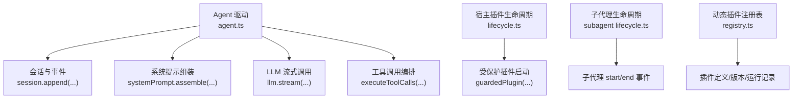
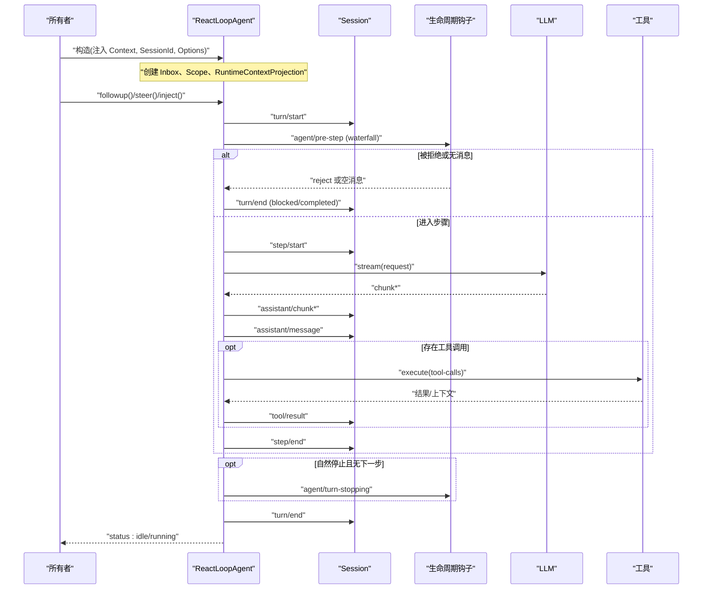
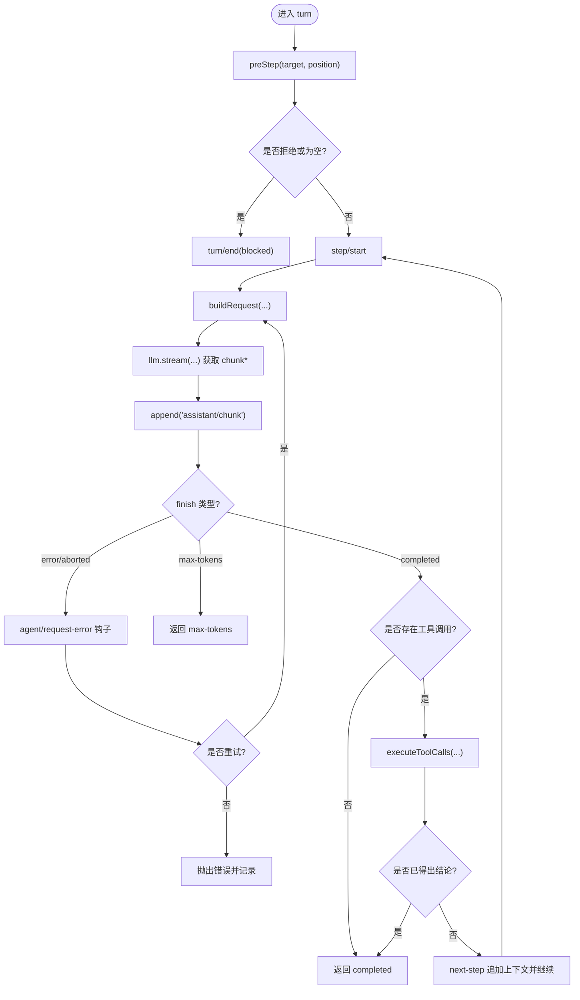
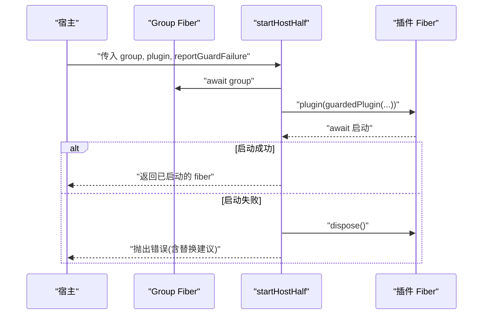
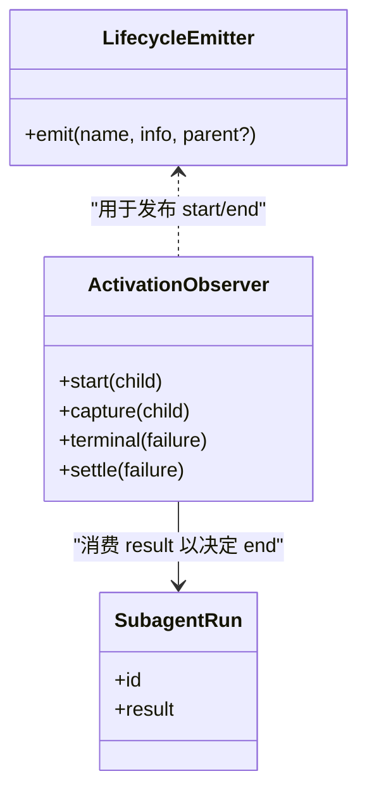
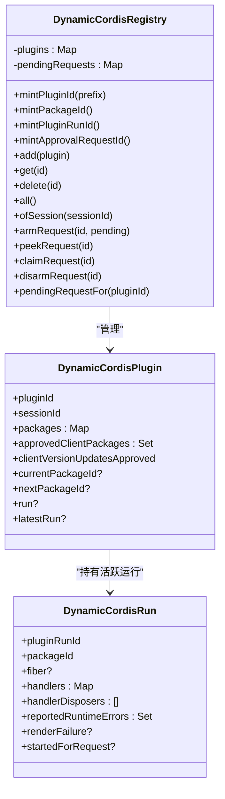
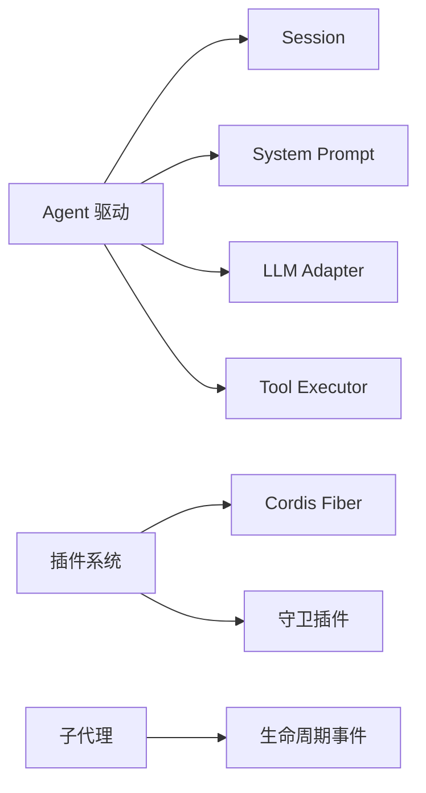

# Agent 生命周期

<cite>
**本文引用的文件**
- [packages/core/agent-loop/src/agent.ts](file://packages/core/agent-loop/src/agent.ts)
- [packages/extensions/cordis-host-runner/src/lifecycle.ts](file://packages/extensions/cordis-host-runner/src/lifecycle.ts)
- [packages/subagent/subagent/src/lifecycle.ts](file://packages/subagent/subagent/src/lifecycle.ts)
- [packages/extensions/cordis-host-runner/src/registry.ts](file://packages/extensions/cordis-host-runner/src/registry.ts)
- [docs/agent-lifecycle.md](file://docs/agent-lifecycle.md)
</cite>

## 目录
1. [简介](#简介)
2. [项目结构](#项目结构)
3. [核心组件](#核心组件)
4. [架构总览](#架构总览)
5. [详细组件分析](#详细组件分析)
6. [依赖关系分析](#依赖关系分析)
7. [性能考量](#性能考量)
8. [故障排查指南](#故障排查指南)
9. [结论](#结论)
10. [附录](#附录)

## 简介
本文件系统性阐述 Agent 的完整生命周期：创建、初始化、运行、暂停、恢复与销毁；说明状态管理机制与各阶段执行逻辑；解释 Agent 注册表的工作原理、实例内存管理与资源清理；提供生命周期钩子的使用示例，展示如何在关键节点插入自定义逻辑；并说明 Agent 与插件系统的集成方式，以及如何通过生命周期扩展 Agent 功能。

## 项目结构
围绕 Agent 生命周期的关键代码分布在以下模块：
- Agent 驱动与循环：packages/core/agent-loop/src/agent.ts
- 宿主侧插件生命周期管理：packages/extensions/cordis-host-runner/src/lifecycle.ts
- 子代理生命周期事件：packages/subagent/subagent/src/lifecycle.ts
- 动态插件注册表：packages/extensions/cordis-host-runner/src/registry.ts
- 回合/步骤生命周期文档与序列图：docs/agent-lifecycle.md

图表来源
- [packages/core/agent-loop/src/agent.ts:64-497](file://packages/core/agent-loop/src/agent.ts#L64-L497)
- [packages/extensions/cordis-host-runner/src/lifecycle.ts:22-45](file://packages/extensions/cordis-host-runner/src/lifecycle.ts#L22-L45)
- [packages/subagent/subagent/src/lifecycle.ts:100-123](file://packages/subagent/subagent/src/lifecycle.ts#L100-L123)
- [packages/extensions/cordis-host-runner/src/registry.ts:141-277](file://packages/extensions/cordis-host-runner/src/registry.ts#L141-L277)

章节来源
- [packages/core/agent-loop/src/agent.ts:64-497](file://packages/core/agent-loop/src/agent.ts#L64-L497)
- [packages/extensions/cordis-host-runner/src/lifecycle.ts:22-45](file://packages/extensions/cordis-host-runner/src/lifecycle.ts#L22-L45)
- [packages/subagent/subagent/src/lifecycle.ts:100-123](file://packages/subagent/subagent/src/lifecycle.ts#L100-L123)
- [packages/extensions/cordis-host-runner/src/registry.ts:141-277](file://packages/extensions/cordis-host-runner/src/registry.ts#L141-L277)
- [docs/agent-lifecycle.md:4-83](file://docs/agent-lifecycle.md#L4-L83)

## 核心组件
- ReactLoopAgent（Agent 驱动）：维护内部 Phase（idle/maintenance/running），负责 turn/step 边界、消息入队与唤醒、请求构建、LLM 流式处理、工具调用编排、错误与终止原因上报。
- 宿主插件生命周期：以 Fiber 为单位安全地启动、等待、处置插件，捕获启动失败并报告守卫拒绝。
- 子代理生命周期：为一次性运行和可延续激活提供 start/end 事件对，确保可观测性与一致性。
- 动态插件注册表：进程内维护插件、包版本、运行实例、待审批请求等，提供 ID 生成与查询能力。

章节来源
- [packages/core/agent-loop/src/agent.ts:64-497](file://packages/core/agent-loop/src/agent.ts#L64-L497)
- [packages/extensions/cordis-host-runner/src/lifecycle.ts:22-45](file://packages/extensions/cordis-host-runner/src/lifecycle.ts#L22-L45)
- [packages/subagent/subagent/src/lifecycle.ts:100-123](file://packages/subagent/subagent/src/lifecycle.ts#L100-L123)
- [packages/extensions/cordis-host-runner/src/registry.ts:141-277](file://packages/extensions/cordis-host-runner/src/registry.ts#L141-L277)

## 架构总览
下图展示了 Agent 从创建到销毁的关键路径，以及各阶段的状态转换与外部交互。

图表来源
- [packages/core/agent-loop/src/agent.ts:225-330](file://packages/core/agent-loop/src/agent.ts#L225-L330)
- [packages/core/agent-loop/src/agent.ts:332-401](file://packages/core/agent-loop/src/agent.ts#L332-L401)
- [docs/agent-lifecycle.md:4-83](file://docs/agent-lifecycle.md#L4-L83)

## 详细组件分析

### Agent 驱动与状态机（ReactLoopAgent）
- 创建与初始化
  - 构造时建立事件分发器、Inbox、Scope、运行时上下文投影，并读取最近一次 turn 作为 lastTurn。
  - 初始状态为 idle，对外暴露 status 只读属性。
- 运行与唤醒
  - followup/steer/inject 将消息投递到 next-turn 或 next-step 队列，必要时触发 wakeDriver。
  - wakeDriver 在 idle 时开启 running 阶段并启动 kick 循环；在非 idle 时可能 latch 唤醒请求以便收敛后重放。
- Turn/Step 控制
  - turn() 打开 turn/start，循环执行 preStep -> step -> 结束判断；支持 max-tokens 粘性策略，保证后续步骤不会降级最终结果。
  - step() 构建请求、流式获取响应、写入 assistant/chunk 与 assistant/message，处理 request-error 钩子与重试，执行工具调用并决定是否继续。
- 暂停与恢复
  - runMaintenance 允许在 idle 时执行维护任务，完成后若存在挂起的唤醒且队列非空则自动重启驱动。
  - cancel 可清空收件箱并中止当前活动；whenIdle 可用于等待活动完成。
- 销毁与资源清理
  - 驱动退出时重置 phase 为 idle，并在有挂起唤醒时再次尝试；scope 由生命周期拥有者在驱动退出后展开。
- 钩子与扩展点
  - agent/pre-step：拦截/改写下一步输入，可拒绝进入步骤。
  - agent/request：修改请求配置（provider/model/maxTokens 等）。
  - agent/request-error：统一错误处理，可选择重试。
  - agent/turn-stopping：自然停止时的串行终端检查点。
  - agent/status：状态变更通知（idle/running）。

图表来源
- [packages/core/agent-loop/src/agent.ts:245-330](file://packages/core/agent-loop/src/agent.ts#L245-L330)
- [packages/core/agent-loop/src/agent.ts:332-401](file://packages/core/agent-loop/src/agent.ts#L332-L401)

章节来源
- [packages/core/agent-loop/src/agent.ts:64-497](file://packages/core/agent-loop/src/agent.ts#L64-L497)

### 宿主侧插件生命周期
- 启动与守卫
  - startHostHalf 在 group fiber 上创建受保护的 child fiber，await 启动并捕获异常；若包含“already registered”等常见冲突，给出替换指引。
  - 启动失败会立即 dispose，避免残留失败 fiber。
- 服务缺失检测
  - missingServices 用于列出尚未就绪的 inject 服务名，便于诊断。
- 与 Agent 集成
  - 插件的错误可通过 reportGuardFailure 回调上报给所属 Agent，实现统一的错误治理。

图表来源
- [packages/extensions/cordis-host-runner/src/lifecycle.ts:22-45](file://packages/extensions/cordis-host-runner/src/lifecycle.ts#L22-L45)

章节来源
- [packages/extensions/cordis-host-runner/src/lifecycle.ts:22-45](file://packages/extensions/cordis-host-runner/src/lifecycle.ts#L22-L45)

### 子代理生命周期
- 事件发射器
  - createLifecycleEmitter 提供 subagent/start、subagent/end、subagent/provider-removed 三类事件，并对每个监听器进行异常隔离。
- 一次性运行观察
  - observeRun 在运行结果 settle 时发出 end，并附带 stopReason 与可选输出。
- 可延续激活观察者
  - createActivationObserver 为激活周期提供 start/capture/settle 顺序，确保即使冷启动恢复也能正确计算 epoch 的最终停止原因。
- 停止原因推导
  - epochStopReason 基于会话事件后缀推断 stopReason（completed/max-tokens/aborted/error/refusal），保证与底层日志一致。

图表来源
- [packages/subagent/subagent/src/lifecycle.ts:100-123](file://packages/subagent/subagent/src/lifecycle.ts#L100-L123)
- [packages/subagent/subagent/src/lifecycle.ts:133-162](file://packages/subagent/subagent/src/lifecycle.ts#L133-L162)
- [packages/subagent/subagent/src/lifecycle.ts:175-217](file://packages/subagent/subagent/src/lifecycle.ts#L175-L217)
- [packages/subagent/subagent/src/lifecycle.ts:235-260](file://packages/subagent/subagent/src/lifecycle.ts#L235-L260)

章节来源
- [packages/subagent/subagent/src/lifecycle.ts:100-123](file://packages/subagent/subagent/src/lifecycle.ts#L100-L123)
- [packages/subagent/subagent/src/lifecycle.ts:133-162](file://packages/subagent/subagent/src/lifecycle.ts#L133-L162)
- [packages/subagent/subagent/src/lifecycle.ts:175-217](file://packages/subagent/subagent/src/lifecycle.ts#L175-L217)
- [packages/subagent/subagent/src/lifecycle.ts:235-260](file://packages/subagent/subagent/src/lifecycle.ts#L235-L260)

### 动态插件注册表
- 职责
  - 维护进程内的插件、包版本、运行实例与待审批请求索引。
  - 提供稳定的 ID 生成（插件、包、运行、审批请求）。
  - 支持按会话过滤、查询、删除等操作。
- 关键数据结构
  - DynamicCordisDefinition：不可变包版本元数据。
  - DynamicCordisPlugin：稳定插件实例，包含包版本集合、授权状态、当前/下一包版本、活跃运行与最新尝试。
  - DynamicCordisRun：单次激活及其拥有的资源（fiber、handlers、错误记录等）。
  - DynamicCordisPendingRequest：模型驱动的待审批激活请求。

图表来源
- [packages/extensions/cordis-host-runner/src/registry.ts:141-277](file://packages/extensions/cordis-host-runner/src/registry.ts#L141-L277)

章节来源
- [packages/extensions/cordis-host-runner/src/registry.ts:141-277](file://packages/extensions/cordis-host-runner/src/registry.ts#L141-L277)

## 依赖关系分析
- Agent 驱动依赖
  - 会话层：通过 append 持久化 turn/step/消息/工具调用等事件，支撑回放与审计。
  - 提示组装：systemPrompt.assemble 生成系统提示上下文。
  - LLM 适配器：prepareCall/stream 提供流式推理与默认值折叠。
  - 工具执行：executeToolCalls 协调工具调用与结果回写。
- 插件系统依赖
  - Cordis Fiber：以 fiber 为单位组织插件作用域与生命周期。
  - 守卫插件：guard 包装插件，捕获启动期错误并上报。
- 子代理依赖
  - 事件发射器：统一发布子代理生命周期事件，供上层监控与决策。

图表来源
- [packages/core/agent-loop/src/agent.ts:64-497](file://packages/core/agent-loop/src/agent.ts#L64-L497)
- [packages/extensions/cordis-host-runner/src/lifecycle.ts:22-45](file://packages/extensions/cordis-host-runner/src/lifecycle.ts#L22-L45)
- [packages/subagent/subagent/src/lifecycle.ts:100-123](file://packages/subagent/subagent/src/lifecycle.ts#L100-L123)

章节来源
- [packages/core/agent-loop/src/agent.ts:64-497](file://packages/core/agent-loop/src/agent.ts#L64-L497)
- [packages/extensions/cordis-host-runner/src/lifecycle.ts:22-45](file://packages/extensions/cordis-host-runner/src/lifecycle.ts#L22-L45)
- [packages/subagent/subagent/src/lifecycle.ts:100-123](file://packages/subagent/subagent/src/lifecycle.ts#L100-L123)

## 性能考量
- 热路径零分配：事件分发器在构造时融合，避免热点路径重复分配。
- 流式处理：LLM 响应以 chunk 流式写入会话，降低峰值内存占用。
- 粘性策略：max-tokens 一旦命中，后续步骤不得降级最终结果，减少不必要的重试与开销。
- 批量操作：工具调用采用有序前处理、并发执行与有序后处理，兼顾吞吐与一致性。
- 唤醒合并：wakeRequested 机制避免频繁切换状态，提升调度效率。

[本节为通用指导，不直接分析具体文件]

## 故障排查指南
- 启动冲突
  - 当插件启动报“already registered”，需先停止旧版本再启动新版本，参考宿主生命周期中的错误提示。
- 请求错误与重试
  - 通过 agent/request-error 钩子统一处理 provider 错误，可按策略选择重试或保留原始错误。
- 停止原因判定
  - 子代理 epoch 的 stopReason 基于会话事件后缀推导，确保失败/取消/达到上限等语义准确。
- 状态不一致
  - 若 status 长期不回到 idle，检查 whenIdle 等待是否被阻塞，或是否存在未释放的 activityDone。

章节来源
- [packages/extensions/cordis-host-runner/src/lifecycle.ts:22-45](file://packages/extensions/cordis-host-runner/src/lifecycle.ts#L22-L45)
- [packages/core/agent-loop/src/agent.ts:332-401](file://packages/core/agent-loop/src/agent.ts#L332-L401)
- [packages/subagent/subagent/src/lifecycle.ts:235-260](file://packages/subagent/subagent/src/lifecycle.ts#L235-L260)

## 结论
Agent 生命周期以 ReactLoopAgent 为核心，围绕 turn/step 边界与事件持久化，结合钩子系统与插件生态，实现了可扩展、可观测、可恢复的运行模型。通过宿主侧 Fiber 与守卫机制保障插件稳定性，借助子代理生命周期事件统一对外暴露运行事实。注册表为动态插件提供稳定的身份与状态管理能力。整体设计在保证性能的同时，提供了丰富的扩展点与故障处理能力。

[本节为总结性内容，不直接分析具体文件]

## 附录

### 生命周期钩子使用示例（路径引用）
- 拦截/改写下一步输入：在 agent/pre-step 中返回 enter/reject，或追加上下文。
  - 参考路径：[packages/core/agent-loop/src/agent.ts:225-243](file://packages/core/agent-loop/src/agent.ts#L225-L243)
- 调整请求配置：在 agent/request 中设置 provider/model/maxTokens 等。
  - 参考路径：[packages/core/agent-loop/src/agent.ts:438-445](file://packages/core/agent-loop/src/agent.ts#L438-L445)
- 统一错误处理：在 agent/request-error 中根据 failure.code 决定重试或透传。
  - 参考路径：[packages/core/agent-loop/src/agent.ts:355-370](file://packages/core/agent-loop/src/agent.ts#L355-L370)
- 自然停止检查点：在 agent/turn-stopping 中执行收尾逻辑。
  - 参考路径：[packages/core/agent-loop/src/agent.ts:295-299](file://packages/core/agent-loop/src/agent.ts#L295-L299)
- 子代理事件监听：订阅 subagent/start 与 subagent/end，收集运行指标。
  - 参考路径：[packages/subagent/subagent/src/lifecycle.ts:100-123](file://packages/subagent/subagent/src/lifecycle.ts#L100-L123)

### 与插件系统集成要点
- 通过 startHostHalf 安全启动插件，捕获启动失败并上报。
  - 参考路径：[packages/extensions/cordis-host-runner/src/lifecycle.ts:22-45](file://packages/extensions/cordis-host-runner/src/lifecycle.ts#L22-L45)
- 使用 DynamicCordisRegistry 管理插件版本与运行实例，支持按会话隔离与审批流程。
  - 参考路径：[packages/extensions/cordis-host-runner/src/registry.ts:141-277](file://packages/extensions/cordis-host-runner/src/registry.ts#L141-L277)