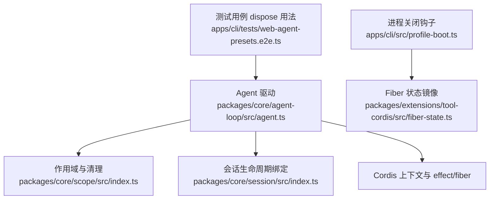
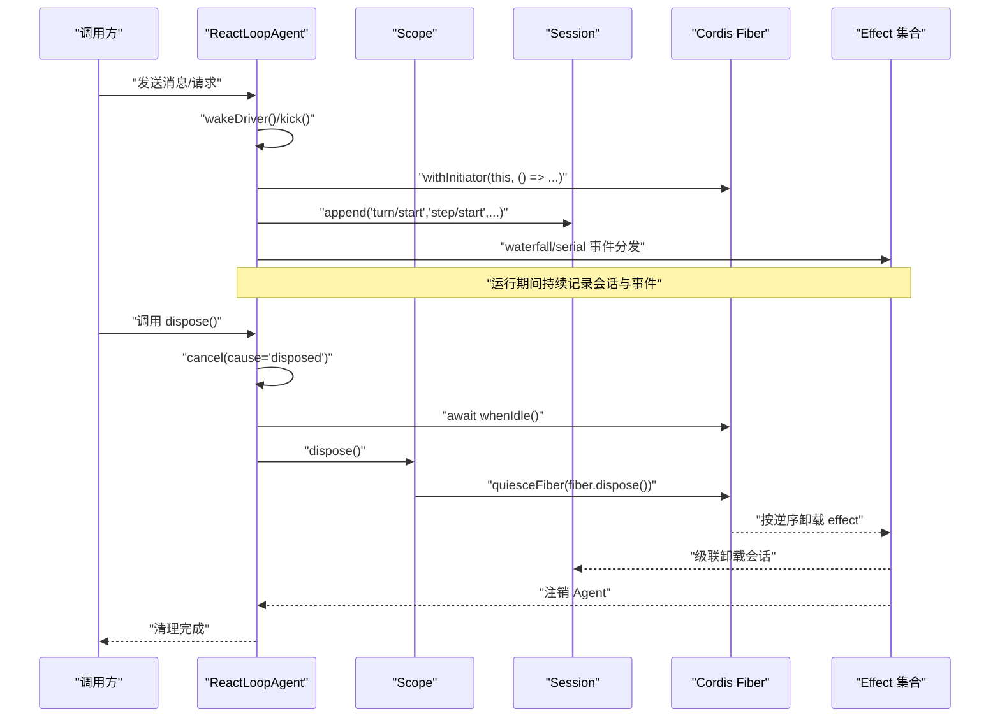
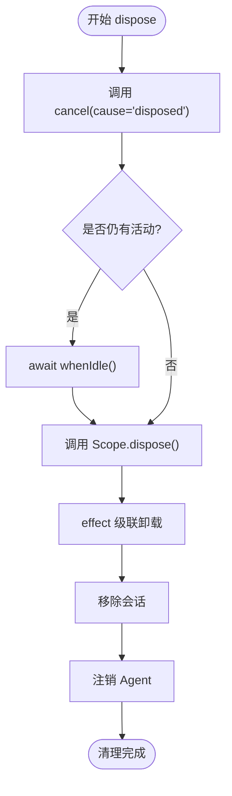
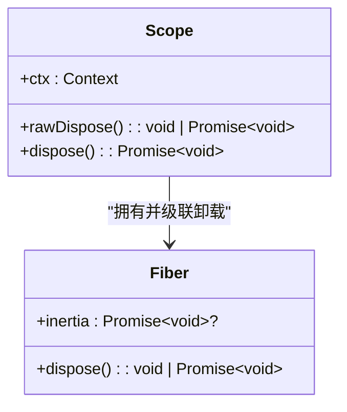
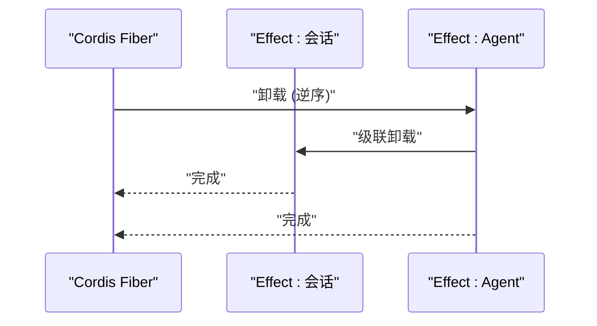
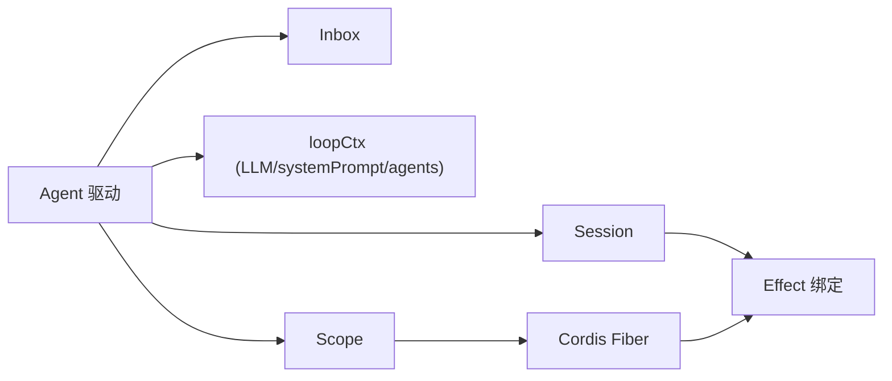

# Agent 资源管理

<cite>
**本文引用的文件**
- [packages/core/agent-loop/src/agent.ts](file://packages/core/agent-loop/src/agent.ts)
- [packages/core/scope/src/index.ts](file://packages/core/scope/src/index.ts)
- [packages/extensions/tool-cordis/src/fiber-state.ts](file://packages/extensions/tool-cordis/src/fiber-state.ts)
- [apps/cli/src/profile-boot.ts](file://apps/cli/src/profile-boot.ts)
- [apps/cli/tests/web-agent-presets.e2e.ts](file://apps/cli/tests/web-agent-presets.e2e.ts)
- [packages/core/session/src/index.ts](file://packages/core/session/src/index.ts)
</cite>

## 目录
1. [简介](#简介)
2. [项目结构](#项目结构)
3. [核心组件](#核心组件)
4. [架构总览](#架构总览)
5. [详细组件分析](#详细组件分析)
6. [依赖关系分析](#依赖关系分析)
7. [性能考量](#性能考量)
8. [故障排查指南](#故障排查指南)
9. [结论](#结论)
10. [附录](#附录)

## 简介
本文聚焦于 Agent 的资源管理与清理机制，围绕以下目标展开：
- 解释 AgentHandle.dispose() 的完整清理流程：停止循环、等待退出、注销 Agent、移除会话、撤销作用域。
- 说明 Agent 的内存管理策略与作用域自动清理、资源泄漏防护。
- 描述 Agent 与 Cordis 框架的集成方式，如何通过 effect 与 fiber 机制确保有序释放。
- 解释启动器边界管理：withInitiator() 与 withoutInitiator() 的使用场景与注意事项。
- 提供资源监控与诊断工具使用建议，以及如何检测和处理资源泄漏。
- 总结资源管理的最佳实践与常见陷阱避免方法。

## 项目结构
Agent 资源管理涉及的核心模块包括：
- Agent 驱动与生命周期：位于 packages/core/agent-loop/src/agent.ts，负责运行循环、阶段切换、事件分发、请求构建与执行。
- 作用域与清理：位于 packages/core/scope/src/index.ts，提供 createScope、dispose、scopeTarget 等能力，用于注册隔离与级联清理。
- Fiber 状态镜像：位于 packages/extensions/tool-cordis/src/fiber-state.ts，映射 Cordis 的 FiberState 常量，便于诊断与日志标注。
- 进程级关闭钩子：位于 apps/cli/src/profile-boot.ts，演示在进程关闭时调用 fiber.dispose() 进行统一回收。
- 测试用例中的 dispose 用法：位于 apps/cli/tests/web-agent-presets.e2e.ts，展示多实例场景下的正确释放顺序。
- 会话与 Agent 的生命周期绑定：位于 packages/core/session/src/index.ts，体现会话与 Agent 通过 effect 绑定的卸载级联。

图表来源
- [packages/core/agent-loop/src/agent.ts:64-193](file://packages/core/agent-loop/src/agent.ts#L64-L193)
- [packages/core/scope/src/index.ts:104-147](file://packages/core/scope/src/index.ts#L104-L147)
- [packages/core/session/src/index.ts:832-848](file://packages/core/session/src/index.ts#L832-L848)
- [apps/cli/src/profile-boot.ts:210-224](file://apps/cli/src/profile-boot.ts#L210-L224)
- [packages/extensions/tool-cordis/src/fiber-state.ts:10-31](file://packages/extensions/tool-cordis/src/fiber-state.ts#L10-L31)

章节来源
- [packages/core/agent-loop/src/agent.ts:64-193](file://packages/core/agent-loop/src/agent.ts#L64-L193)
- [packages/core/scope/src/index.ts:104-147](file://packages/core/scope/src/index.ts#L104-L147)
- [packages/core/session/src/index.ts:832-848](file://packages/core/session/src/index.ts#L832-L848)
- [apps/cli/src/profile-boot.ts:210-224](file://apps/cli/src/profile-boot.ts#L210-L224)
- [packages/extensions/tool-cordis/src/fiber-state.ts:10-31](file://packages/extensions/tool-cordis/src/fiber-state.ts#L10-L31)

## 核心组件
- ReactLoopAgent（Agent 驱动）
  - 维护运行阶段（idle/maintenance/running），通过 AbortController 控制取消与退出。
  - 使用 Inbox 管理消息队列，支持 next-turn 与 next-step 投递。
  - 通过 loopCtx.agents.withInitiator(this, () => this.kick()) 启动驱动，确保启动器边界。
  - 在 turn/step 边界记录会话事件，并处理错误与终止原因。
- Scope（作用域）
  - createScope 创建带标识的作用域上下文，所有在该 ctx 上的注册受该作用域管理。
  - dispose 会触发底层 fiber 的 quiesce，确保异步清理完成。
  - scopeTarget 提供基于作用域的事件路由，允许父作用域接收子作用域事件。
- Fiber 状态镜像
  - 提供 PENDING、LOADING、ACTIVE、FAILED、DISPOSED、UNLOADING 等状态标签，便于诊断。
- 进程关闭钩子
  - 在 CLI 中注册进程关闭回调，调用 fiber.dispose() 以统一回收资源。
- 会话与 Agent 绑定
  - 通过 effect 将会话与 Agent 的生命周期绑定，fiber 卸载时会级联卸载会话与 Agent。

章节来源
- [packages/core/agent-loop/src/agent.ts:64-193](file://packages/core/agent-loop/src/agent.ts#L64-L193)
- [packages/core/scope/src/index.ts:104-147](file://packages/core/scope/src/index.ts#L104-L147)
- [packages/extensions/tool-cordis/src/fiber-state.ts:10-31](file://packages/extensions/tool-cordis/src/fiber-state.ts#L10-L31)
- [apps/cli/src/profile-boot.ts:210-224](file://apps/cli/src/profile-boot.ts#L210-L224)
- [packages/core/session/src/index.ts:832-848](file://packages/core/session/src/index.ts#L832-L848)

## 架构总览
下图展示了 Agent 驱动、作用域、会话与 Cordis fiber 的关系，以及资源释放的级联路径。

图表来源
- [packages/core/agent-loop/src/agent.ts:134-193](file://packages/core/agent-loop/src/agent.ts#L134-L193)
- [packages/core/scope/src/index.ts:114-147](file://packages/core/scope/src/index.ts#L114-L147)
- [packages/core/session/src/index.ts:832-848](file://packages/core/session/src/index.ts#L832-L848)

## 详细组件分析

### Agent 驱动与清理流程（ReactLoopAgent）
- 启动与运行
  - wakeDriver 设置 running 阶段，创建新的 AbortController，并通过 withInitiator 启动 kick。
  - kick 循环执行 turn，turn 内循环执行 step，直到无待处理消息或终止条件满足。
- 取消与退出
  - cancel 清空收件箱（可选）、标记唤醒请求、触发 abort，使当前活动退出。
  - whenIdle 等待 activityDone 完成，确保所有轮次与步骤结束。
- 清理步骤
  - 调用 cancel({ kind: 'disposed' }) 停止循环。
  - await whenIdle() 等待退出。
  - 通过 Scope.dispose() 撤销作用域，触发 effect 级联卸载。
  - 会话与 Agent 随 effect 卸载被移除与注销。

图表来源
- [packages/core/agent-loop/src/agent.ts:134-200](file://packages/core/agent-loop/src/agent.ts#L134-L200)
- [packages/core/scope/src/index.ts:114-147](file://packages/core/scope/src/index.ts#L114-L147)
- [packages/core/session/src/index.ts:832-848](file://packages/core/session/src/index.ts#L832-L848)

章节来源
- [packages/core/agent-loop/src/agent.ts:134-200](file://packages/core/agent-loop/src/agent.ts#L134-L200)
- [packages/core/scope/src/index.ts:114-147](file://packages/core/scope/src/index.ts#L114-L147)
- [packages/core/session/src/index.ts:832-848](file://packages/core/session/src/index.ts#L832-L848)

### 作用域与内存管理（Scope）
- 创建与继承
  - createScope 基于传入 Context 创建 scoped context，并将 key 写入 context tag。
  - 支持 parent 参数绑定父作用域，形成作用域链，事件路由向上兼容。
- 清理与幂等
  - dispose 内部缓存 Promise，多次调用共享同一完成结果。
  - quiesceFiber 先调用 fiber.dispose()，再等待 inertia 完成，确保异步清理彻底。
- 事件路由
  - scopeTarget 为事件载体添加 filter，仅允许匹配 key 或其祖先作用域的监听者接收事件。

图表来源
- [packages/core/scope/src/index.ts:104-147](file://packages/core/scope/src/index.ts#L104-L147)

章节来源
- [packages/core/scope/src/index.ts:104-147](file://packages/core/scope/src/index.ts#L104-L147)

### 启动器边界管理（withInitiator / withoutInitiator）
- withInitiator
  - 在 agent.ts 中，wakeDriver 通过 loopCtx.agents.withInitiator(this, () => this.kick()) 启动驱动。
  - 该边界确保 Agent 作为启动器参与生命周期，其 effect 与 fiber 的卸载会包含 Agent 的清理。
- withoutInitiator
  - 当不需要将 Agent 作为启动器时，应避免将其纳入 withInitiator 的回调，防止不必要的启动器责任与资源占用。
- 注意事项
  - 启动器边界影响 effect 的归属与卸载顺序；不当使用可能导致资源未释放或重复释放。
  - 在测试与集成场景中，应显式调用 dispose() 并等待 whenIdle()，确保边界清晰。

章节来源
- [packages/core/agent-loop/src/agent.ts:172-193](file://packages/core/agent-loop/src/agent.ts#L172-L193)

### 与 Cordis 框架的集成（effect 与 fiber）
- effect 级联卸载
  - 会话与 Agent 通过 effect 绑定到 fiber，fiber 卸载时按逆序卸载 effect，确保资源有序释放。
- fiber 状态
  - 通过 FiberState 镜像可识别当前 fiber 的状态，辅助诊断与日志标注。
- 进程级回收
  - 在 CLI 中注册进程关闭钩子，调用 fiber.dispose() 以统一回收所有资源。

图表来源
- [packages/core/session/src/index.ts:832-848](file://packages/core/session/src/index.ts#L832-L848)
- [packages/extensions/tool-cordis/src/fiber-state.ts:10-31](file://packages/extensions/tool-cordis/src/fiber-state.ts#L10-L31)
- [apps/cli/src/profile-boot.ts:210-224](file://apps/cli/src/profile-boot.ts#L210-L224)

章节来源
- [packages/core/session/src/index.ts:832-848](file://packages/core/session/src/index.ts#L832-L848)
- [packages/extensions/tool-cordis/src/fiber-state.ts:10-31](file://packages/extensions/tool-cordis/src/fiber-state.ts#L10-L31)
- [apps/cli/src/profile-boot.ts:210-224](file://apps/cli/src/profile-boot.ts#L210-L224)

## 依赖关系分析
- Agent 驱动依赖
  - 依赖 Inbox 管理消息，依赖 session 记录事件，依赖 loopCtx 提供 LLM、systemPrompt、agents 等能力。
  - 通过 AbortController 控制取消，通过 phase 管理状态。
- 作用域依赖
  - 依赖 Cordis Context 与 Fiber，提供注册隔离与级联清理。
- 会话依赖
  - 通过 effect 与 Agent 生命周期绑定，确保卸载时的级联行为。
- 进程钩子依赖
  - 依赖 fiber.dispose() 进行统一回收，确保进程退出时资源释放。

图表来源
- [packages/core/agent-loop/src/agent.ts:64-193](file://packages/core/agent-loop/src/agent.ts#L64-L193)
- [packages/core/scope/src/index.ts:104-147](file://packages/core/scope/src/index.ts#L104-L147)
- [packages/core/session/src/index.ts:832-848](file://packages/core/session/src/index.ts#L832-L848)

章节来源
- [packages/core/agent-loop/src/agent.ts:64-193](file://packages/core/agent-loop/src/agent.ts#L64-L193)
- [packages/core/scope/src/index.ts:104-147](file://packages/core/scope/src/index.ts#L104-L147)
- [packages/core/session/src/index.ts:832-848](file://packages/core/session/src/index.ts#L832-L848)

## 性能考量
- 减少分配
  - dispatch 在构造时一次性构建，避免热路径分配。
  - 冻结配置与消息，减少后续拷贝与变更成本。
- 流式处理
  - 使用 stream 逐块处理模型输出，降低内存峰值。
- 取消与重试
  - 通过 AbortSignal 及时中断无效请求，结合 retry 策略提升鲁棒性。
- 作用域隔离
  - 通过 scopeTarget 限制事件传播范围，减少无关监听者的开销。

[本节为通用性能指导，不直接分析具体文件]

## 故障排查指南
- 资源泄漏检测
  - 检查是否正确调用 dispose() 并等待 whenIdle()。
  - 观察 fiber 状态（PENDING/LOADING/ACTIVE/FAILED/DISPOSED/UNLOADING），确认卸载路径。
  - 在测试中复用 web-agent-presets.e2e.ts 的 dispose 模式，确保多实例场景下顺序释放。
- 常见问题
  - 未等待 whenIdle() 导致提前回收：确保在 dispose() 后 await whenIdle()。
  - 作用域未正确绑定：检查 createScope 的 parent 参数与 scopeTarget 的使用。
  - 进程关闭未回收：在 profile-boot.ts 中注册关闭钩子，调用 fiber.dispose()。
- 诊断工具
  - 使用 FiberState 镜像标注日志，定位卡滞状态。
  - 通过会话事件（turn/step 的开始与结束）判断运行边界。

章节来源
- [apps/cli/tests/web-agent-presets.e2e.ts:183-615](file://apps/cli/tests/web-agent-presets.e2e.ts#L183-L615)
- [packages/extensions/tool-cordis/src/fiber-state.ts:10-31](file://packages/extensions/tool-cordis/src/fiber-state.ts#L10-L31)
- [apps/cli/src/profile-boot.ts:210-224](file://apps/cli/src/profile-boot.ts#L210-L224)

## 结论
Agent 的资源管理通过作用域、effect 与 fiber 的协同实现有序释放。ReactLoopAgent 负责运行循环与取消，Scope 提供隔离与级联清理，会话与 Agent 通过 effect 绑定确保卸载一致性。正确使用 withInitiator/withoutInitiator 明确启动器边界，配合进程级关闭钩子与测试用例的最佳实践，可有效避免资源泄漏。通过 FiberState 与会话事件进行诊断，能够快速定位问题并优化性能。

## 附录
- 最佳实践
  - 始终在 dispose() 后 await whenIdle()，确保完全退出。
  - 使用 createScope 隔离注册，并通过 scopeTarget 限定事件路由。
  - 在进程关闭时统一调用 fiber.dispose()，避免残留资源。
- 常见陷阱
  - 忽略取消信号导致长时间阻塞。
  - 作用域嵌套错误导致事件无法到达预期监听者。
  - 未冻结配置导致意外修改引发不可预测行为。

[本节为通用指导，不直接分析具体文件]