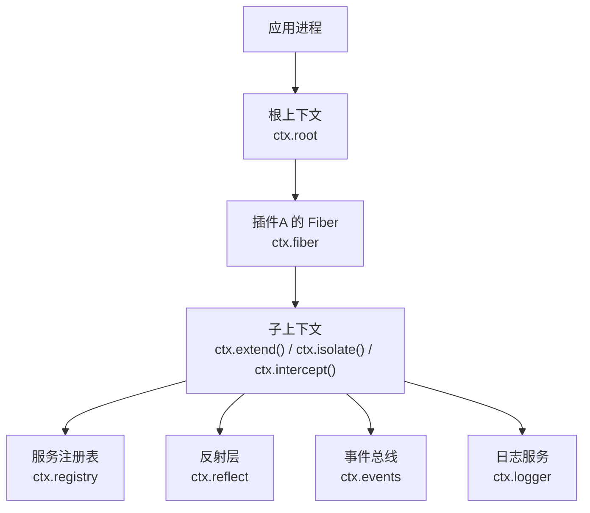
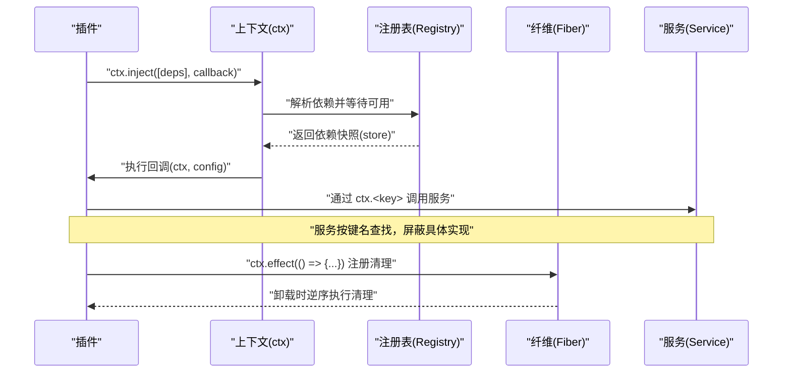
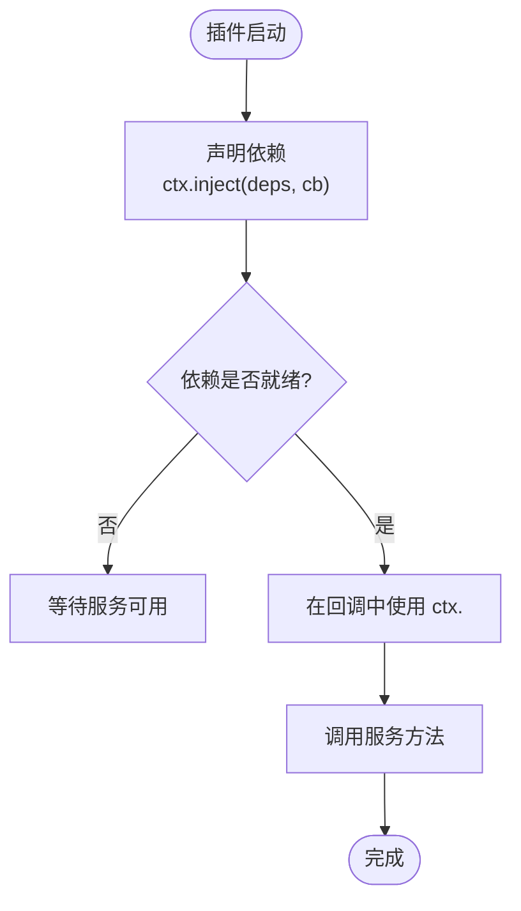
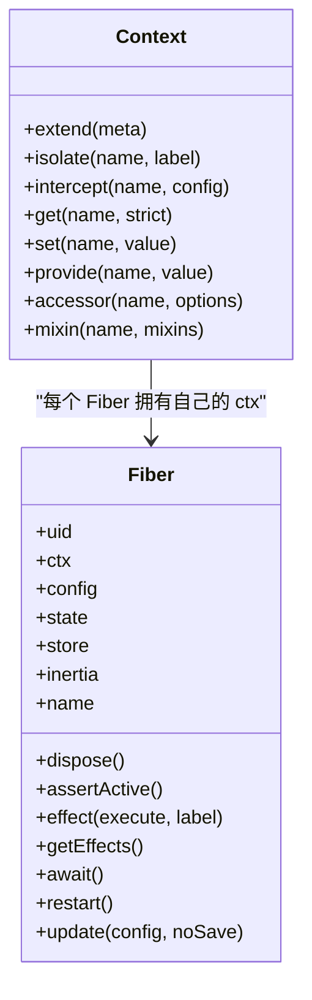
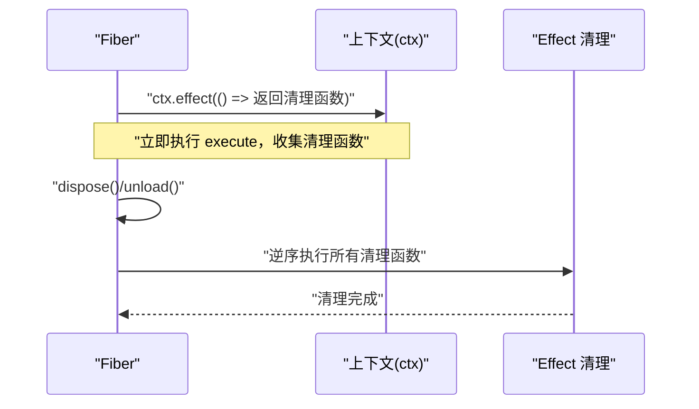
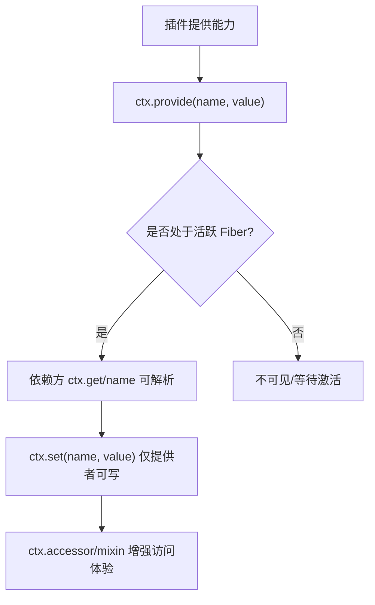
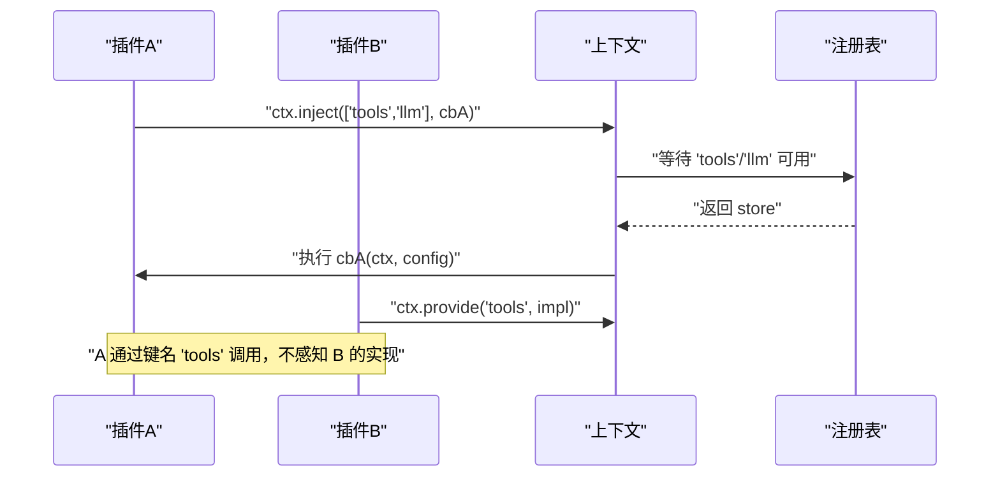
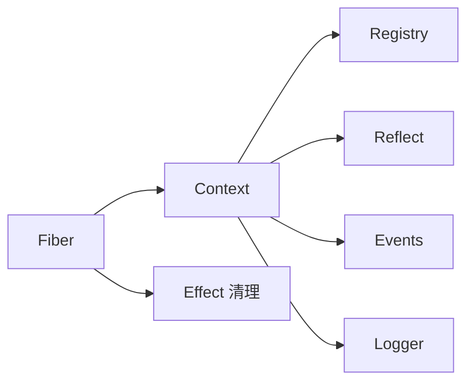

# Context 上下文机制

<cite>
**本文引用的文件**
- [context.md](file://docs/cordis-api/context.md)
- [service.md](file://docs/cordis-api/service.md)
- [registry.md](file://docs/cordis-api/registry.md)
- [fiber.md](file://docs/cordis-api/fiber.md)
- [inherited.md](file://docs/cordis-api/inherited.md)
- [README.md](file://packages/context/README.md)
</cite>

## 目录
1. [简介](#简介)
2. [项目结构](#项目结构)
3. [核心组件](#核心组件)
4. [架构总览](#架构总览)
5. [详细组件分析](#详细组件分析)
6. [依赖关系分析](#依赖关系分析)
7. [性能考虑](#性能考虑)
8. [故障排查指南](#故障排查指南)
9. [结论](#结论)
10. [附录](#附录)

## 简介
本文件系统性阐述 Cordis 的 Context 上下文机制，将其定位为“服务仓库”。通过 ctx.<key>（如 ctx.tools、ctx.llm、ctx.sessions）以键名访问已注册服务，插件之间仅依赖键名而非具体实现，从而实现松耦合与可替换性。文档覆盖：
- 服务的发现与解析机制
- 插件间基于键名的通信方式
- 上下文的继承与隔离（extend/isolate/intercept）
- 作用域与生命周期管理（Fiber 与 effect）
- 调试与日志记录（ctx.serviceName 的使用建议）
- 在插件中获取并使用其他服务的实践示例
- 常见错误与边界情况的处理策略

## 项目结构
Context 是 Cordis 的核心对象，所有服务、事件与生命周期 API 都通过 ctx 暴露。根上下文与子上下文构成依赖容器树；普通属性读取走服务解析器，而 extend/isolate/intercept 创建不污染父作用域的派生上下文。

图示来源
- [context.md:6-12](file://docs/cordis-api/context.md#L6-L12)
- [inherited.md:10-21](file://docs/cordis-api/inherited.md#L10-L21)

章节来源
- [context.md:6-12](file://docs/cordis-api/context.md#L6-L12)
- [inherited.md:10-21](file://docs/cordis-api/inherited.md#L10-L21)

## 核心组件
- 上下文（Context）：服务仓库与作用域容器，提供 get/set/provide/accessor/mixin 等能力，以及 extend/isolate/intercept 的作用域控制。
- 服务（Service）：以命名键注册到 ctx 的可复用能力，支持配置拦截、调用约定与扩展。
- 注册表（Registry）：插件加载与依赖注入，支持 inject/plugin 声明式装配。
- 纤维（Fiber）：插件运行实例，承载配置、状态、effect 清理与生命周期。

章节来源
- [context.md:14-163](file://docs/cordis-api/context.md#L14-L163)
- [service.md:4-23](file://docs/cordis-api/service.md#L4-L23)
- [registry.md:4-57](file://docs/cordis-api/registry.md#L4-L57)
- [fiber.md:4-48](file://docs/cordis-api/fiber.md#L4-L48)

## 架构总览
下图展示插件如何通过 ctx 进行服务发现、依赖注入与作用域隔离，并体现 Fiber 的生命周期对资源清理的保障。

图示来源
- [registry.md:8-33](file://docs/cordis-api/registry.md#L8-L33)
- [fiber.md:8-37](file://docs/cordis-api/fiber.md#L8-L37)
- [context.md:237-365](file://docs/cordis-api/context.md#L237-L365)

## 详细组件分析

### 服务发现与键名通信
- 通过 ctx.get(name) 直接读取服务，或借助 ctx.inject([...]) 声明依赖后在回调中使用 ctx.<key>。
- 插件只依赖键名（如 tools、llm、sessions），不关心具体实现类，便于替换与测试。
- mixin 可将某服务的成员直接挂载到 ctx 上（例如 ctx.on 转发到 ctx.events.on）。

图示来源
- [registry.md:8-33](file://docs/cordis-api/registry.md#L8-L33)
- [context.md:237-365](file://docs/cordis-api/context.md#L237-L365)

章节来源
- [registry.md:8-33](file://docs/cordis-api/registry.md#L8-L33)
- [context.md:237-365](file://docs/cordis-api/context.md#L237-L365)

### 作用域：继承与隔离
- ctx.extend(meta)：创建携带额外元数据的子上下文，原型链继承父上下文属性，自身属性遮蔽父属性。
- ctx.isolate(name, label?)：为指定服务 name 创建独立作用域的子上下文，读写该服务将解析到新标签下，避免影响父作用域；相同 label 可合并作用域。
- ctx.intercept(name, config)：为后续加载的插件增加针对某服务的拦截配置，合并顺序自祖先至后代。

图示来源
- [context.md:14-163](file://docs/cordis-api/context.md#L14-L163)
- [fiber.md:58-275](file://docs/cordis-api/fiber.md#L58-L275)

章节来源
- [context.md:14-163](file://docs/cordis-api/context.md#L14-L163)
- [fiber.md:58-275](file://docs/cordis-api/fiber.md#L58-L275)

### 生命周期与清理
- Fiber 代表一个插件实例，持有当前 fiber 的 ctx、配置、状态与 effect 集合。
- ctx.effect(execute, label) 注册的清理函数会在 fiber 卸载或显式调用 disposer 时按逆序执行。
- 在 fiber 已销毁后注册 effect 会抛出 INACTIVE_EFFECT；配置校验失败会抛出 ValidationError。

图示来源
- [fiber.md:8-37](file://docs/cordis-api/fiber.md#L8-L37)
- [fiber.md:102-111](file://docs/cordis-api/fiber.md#L102-L111)
- [fiber.md:146-162](file://docs/cordis-api/fiber.md#L146-L162)
- [fiber.md:331-375](file://docs/cordis-api/fiber.md#L331-L375)

章节来源
- [fiber.md:8-37](file://docs/cordis-api/fiber.md#L8-L37)
- [fiber.md:102-111](file://docs/cordis-api/fiber.md#L102-L111)
- [fiber.md:146-162](file://docs/cordis-api/fiber.md#L146-L162)
- [fiber.md:331-375](file://docs/cordis-api/fiber.md#L331-L375)

### 服务注册与访问
- provide(name, value)：在当前 fiber 注册服务，可见范围受 isolate 作用域限制；返回 disposer 用于注销。
- set(name, value)：仅允许提供该服务的 fiber 更新值。
- accessor(name, options)：定义计算型属性，随 fiber 卸载移除。
- mixin(name, mixins)：将服务成员直接暴露到 ctx 上，便于短路径调用。

图示来源
- [context.md:286-365](file://docs/cordis-api/context.md#L286-L365)

章节来源
- [context.md:286-365](file://docs/cordis-api/context.md#L286-L365)

### 插件间通信与键名约定
- 插件通过 ctx.inject([...]) 声明所需服务，框架保证回调执行时依赖可用。
- 插件内部使用 ctx.<key> 调用服务，屏蔽具体实现，便于替换与多环境部署。
- 可通过 intercept 注入每服务级配置，实现行为定制而不侵入实现。

图示来源
- [registry.md:8-33](file://docs/cordis-api/registry.md#L8-L33)
- [context.md:237-365](file://docs/cordis-api/context.md#L237-L365)

章节来源
- [registry.md:8-33](file://docs/cordis-api/registry.md#L8-L33)
- [context.md:237-365](file://docs/cordis-api/context.md#L237-L365)

### 调试与日志：ctx.serviceName 的使用建议
- Service 基类包含 name 字段，标识实例注册键名，可用于日志与诊断。
- 建议在关键路径打印 service.name，结合 ctx.logger(name) 输出带上下文的日志。
- 对于复杂链路，可在 effect 中记录 fiber.uid 与名称，辅助定位问题。

章节来源
- [service.md:14-23](file://docs/cordis-api/service.md#L14-L23)
- [fiber.md:58-144](file://docs/cordis-api/fiber.md#L58-L144)
- [context.md:131-139](file://docs/cordis-api/context.md#L131-L139)

### 实际用法示例（以代码片段路径引用）
- 在插件中声明依赖并消费服务：
  - [registry.md:8-33](file://docs/cordis-api/registry.md#L8-L33)
- 注册服务并在同一 fiber 内被依赖方解析：
  - [context.md:286-314](file://docs/cordis-api/context.md#L286-L314)
- 使用 mixin 简化常用调用（如事件）：
  - [context.md:340-365](file://docs/cordis-api/context.md#L340-L365)
- 在 fiber 中注册清理逻辑：
  - [fiber.md:8-37](file://docs/cordis-api/fiber.md#L8-L37)
- 通过 isolate 为特定服务切换实现：
  - [context.md:39-66](file://docs/cordis-api/context.md#L39-L66)

## 依赖关系分析
- 上下文依赖注册表、反射层、事件总线与日志服务，形成稳定的运行时支撑。
- Fiber 作为插件运行容器，向上提供 ctx，向下管理 effect 与生命周期。
- 服务通过键名解耦，插件仅依赖契约（键名与类型），提升可替换性与可测试性。

图示来源
- [inherited.md:10-21](file://docs/cordis-api/inherited.md#L10-L21)
- [fiber.md:4-48](file://docs/cordis-api/fiber.md#L4-L48)

章节来源
- [inherited.md:10-21](file://docs/cordis-api/inherited.md#L10-L21)
- [fiber.md:4-48](file://docs/cordis-api/fiber.md#L4-L48)

## 性能考虑
- 优先使用 ctx.inject 声明依赖，减少运行时查找成本。
- 合理使用 isolate 与 intercept，避免不必要的上下文复制与配置合并。
- 将昂贵初始化放入 effect，并确保在 dispose 中释放资源，防止内存泄漏。
- 对高频调用的服务，尽量通过 mixin 缩短调用链。

[本节为通用指导，无需源码引用]

## 故障排查指南
- 在已销毁的 fiber 上注册 effect：抛出 INACTIVE_EFFECT。应在 effect 前检查 fiber 活性或使用 try/catch 捕获。
- 配置校验失败：抛出 ValidationError，需检查插件 Config 与传入参数。
- 服务未提供：ctx.get 可能返回 undefined，应在业务层做防御性判断或改用 inject 确保可用性。
- 作用域冲突：同名服务在不同 isolate 标签下存在多个实现，确认 label 是否正确共享。
- 日志与诊断：利用 ctx.logger(name)、fiber.name、fiber.uid 与 getEffects() 快速定位问题。

章节来源
- [fiber.md:146-162](file://docs/cordis-api/fiber.md#L146-L162)
- [fiber.md:331-375](file://docs/cordis-api/fiber.md#L331-L375)
- [context.md:237-314](file://docs/cordis-api/context.md#L237-L314)

## 结论
Context 作为服务仓库，通过键名驱动的服务发现与作用域隔离，实现了插件间的松耦合与高内聚。配合 Fiber 的生命周期管理与 effect 清理机制，能够可靠地管理资源与副作用。实践中应遵循“声明依赖、键名通信、最小化作用域、完善清理”的原则，以获得更好的可维护性与可观测性。

[本节为总结，无需源码引用]

## 附录
- 产品级上下文扩展包（如 session-reference、time-context、tmux-context、agent-instructions）通过各自 key 暴露能力，可作为参考实现理解如何在真实系统中组织上下文。

章节来源
- [README.md:1-15](file://packages/context/README.md#L1-L15)