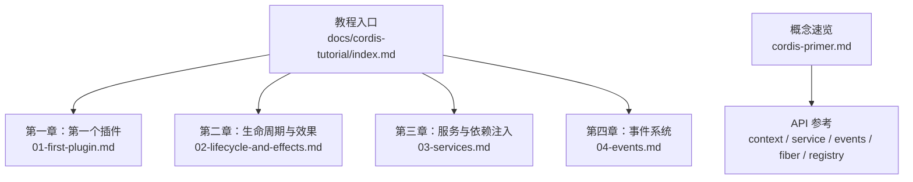
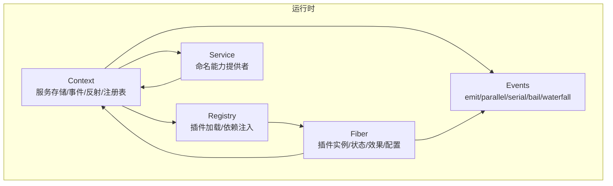
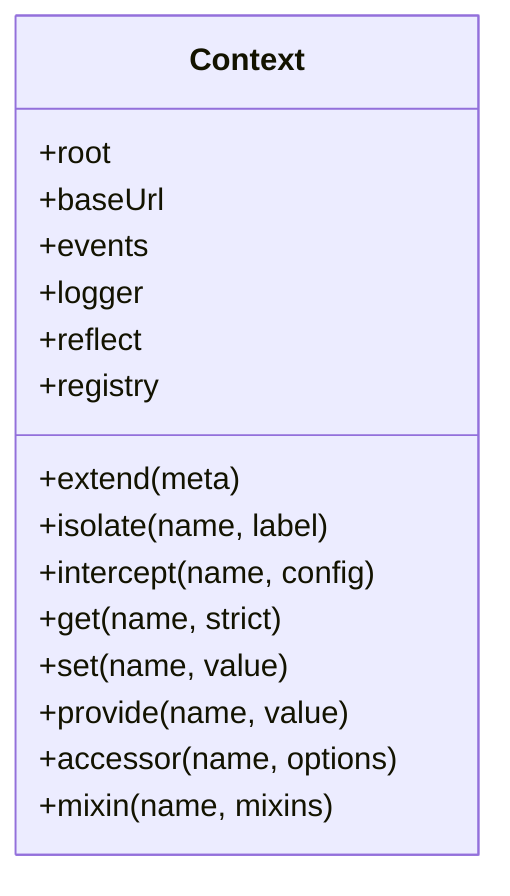
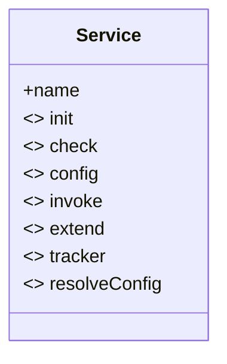
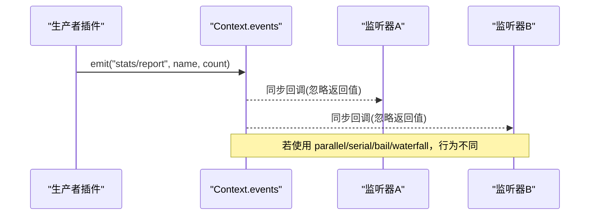
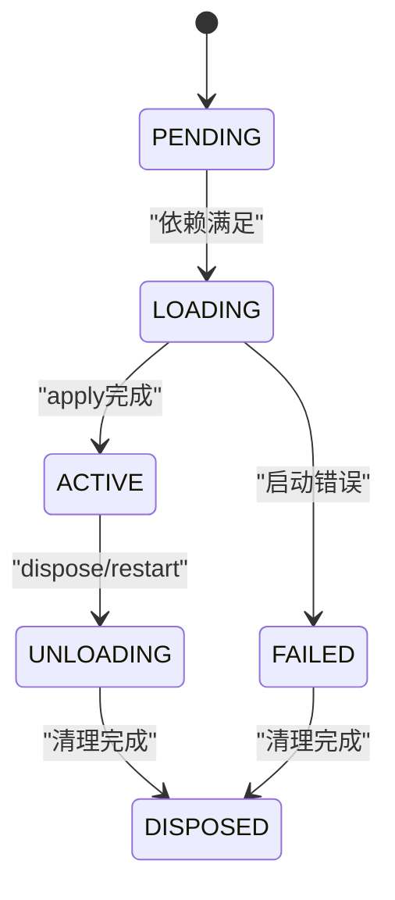
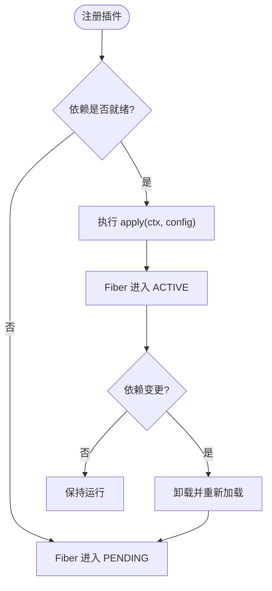
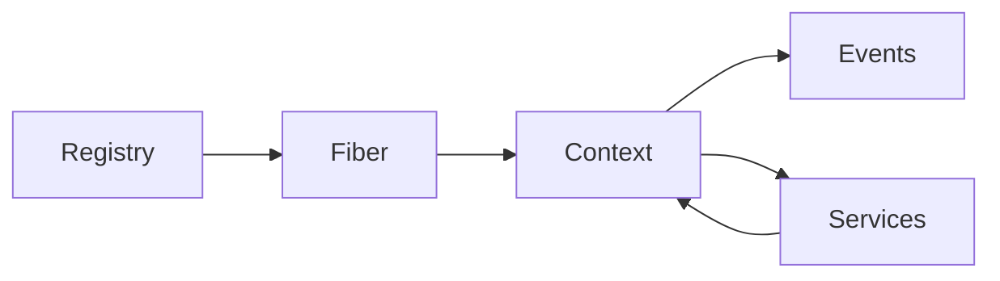

# Cordis 插件框架

<cite>
**本文引用的文件**
- [docs/cordis-api/context.md](file://docs/cordis-api/context.md)
- [docs/cordis-api/service.md](file://docs/cordis-api/service.md)
- [docs/cordis-api/events.md](file://docs/cordis-api/events.md)
- [docs/cordis-api/fiber.md](file://docs/cordis-api/fiber.md)
- [docs/cordis-api/registry.md](file://docs/cordis-api/registry.md)
- [docs/cordis-tutorial/index.md](file://docs/cordis-tutorial/index.md)
- [docs/cordis-tutorial/01-first-plugin.md](file://docs/cordis-tutorial/01-first-plugin.md)
- [docs/cordis-tutorial/02-lifecycle-and-effects.md](file://docs/cordis-tutorial/02-lifecycle-and-effects.md)
- [docs/cordis-tutorial/03-services.md](file://docs/cordis-tutorial/03-services.md)
- [docs/cordis-tutorial/04-events.md](file://docs/cordis-tutorial/04-events.md)
- [docs/cordis-primer.md](file://docs/cordis-primer.md)
</cite>

## 目录
1. [简介](#简介)
2. [项目结构](#项目结构)
3. [核心组件](#核心组件)
4. [架构总览](#架构总览)
5. [详细组件分析](#详细组件分析)
6. [依赖关系分析](#依赖关系分析)
7. [性能考量](#性能考量)
8. [故障排查指南](#故障排查指南)
9. [结论](#结论)
10. [附录：快速上手与最佳实践](#附录快速上手与最佳实践)

## 简介
Cordis 是 DeepSeek Harness 的底层插件框架，它将工具、LLM 适配器、文件系统访问、Agent 循环等能力都抽象为“插件”，挂载到共享的上下文（Context）中。通过 Service 接口、依赖注入、事件驱动通信和可逆的生命周期效果（Effect），Cordis 实现了高内聚、低耦合、可热重载的可插拔架构。本文件面向初学者提供概念性理解，并为高级用户提供实现细节与最佳实践。

## 项目结构
Cordis 的核心 API 文档位于 docs/cordis-api，教程位于 docs/cordis-tutorial，概念速览位于 docs/cordis-primer。教程以“从零开始”的方式引导读者创建插件、声明依赖、处理事件并接入 Harness 服务；API 文档则给出 Context、Service、Events、Fiber、Registry 的完整契约。

**章节来源**
- [docs/cordis-tutorial/index.md:1-61](file://docs/cordis-tutorial/index.md#L1-L61)
- [docs/cordis-primer.md:1-45](file://docs/cordis-primer.md#L1-L45)

## 核心组件
- 上下文（Context）：插件运行时的根容器，提供事件总线、日志、反射层、注册表等能力，支持扩展、隔离、拦截等子上下文操作。
- 服务（Service）：基于基类的命名能力提供者，自动注册到 ctx，随 Fiber 生命周期管理。
- 事件（Events）：类型化事件总线，支持 emit、parallel、serial、bail、waterfall 多种分发模式。
- 纤维（Fiber）：单个插件实例的运行态，管理配置、状态机、效果集合与清理。
- 注册表（Registry）：插件加载与依赖注入，支持函数/类/对象三种插件形态，以及 inject 声明式依赖。

**章节来源**
- [docs/cordis-api/context.md:1-365](file://docs/cordis-api/context.md#L1-L365)
- [docs/cordis-api/service.md:1-103](file://docs/cordis-api/service.md#L1-L103)
- [docs/cordis-api/events.md:1-208](file://docs/cordis-api/events.md#L1-L208)
- [docs/cordis-api/fiber.md:1-376](file://docs/cordis-api/fiber.md#L1-L376)
- [docs/cordis-api/registry.md:1-153](file://docs/cordis-api/registry.md#L1-L153)

## 架构总览
Cordis 以 Context 为中心，插件通过 Registry 加载，使用 Service 暴露能力，通过 Events 进行松耦合通信，所有注册均作为 Effect 被 Fiber 统一管理，确保可逆与可恢复。

**图表来源**
- [docs/cordis-api/context.md:1-365](file://docs/cordis-api/context.md#L1-L365)
- [docs/cordis-api/fiber.md:1-376](file://docs/cordis-api/fiber.md#L1-L376)
- [docs/cordis-api/registry.md:1-153](file://docs/cordis-api/registry.md#L1-L153)
- [docs/cordis-api/events.md:1-208](file://docs/cordis-api/events.md#L1-L208)
- [docs/cordis-api/service.md:1-103](file://docs/cordis-api/service.md#L1-L103)

## 详细组件分析

### 上下文（Context）
- 作用：插件运行的根容器，提供 get/set/provide/accessor/mixin 等服务存取能力，以及 extend/isolate/intercept 构建子上下文的能力。
- 关键点：
  - 属性读取走服务解析器，extend/isolate/intercept 创建不污染父上下文的子上下文。
  - 内置 events、logger、reflect、registry 等服务混入 ctx。
  - isolate 可按服务名隔离作用域，intercept 可为下游插件注入拦截配置。

**图表来源**
- [docs/cordis-api/context.md:14-163](file://docs/cordis-api/context.md#L14-L163)
- [docs/cordis-api/context.md:237-365](file://docs/cordis-api/context.md#L237-L365)

**章节来源**
- [docs/cordis-api/context.md:1-365](file://docs/cordis-api/context.md#L1-L365)

### 服务（Service）
- 作用：以命名方式在 ctx 上暴露能力，子类通过 super(ctx, name) 自动注册，随 Fiber 卸载而移除。
- 静态符号：init/check/config/invoke/extend/tracker/resolveConfig 用于框架内部扩展与配置解析。
- 典型用法：继承 Service 并在 apply 中通过 ctx.plugin 挂载，或通过 Service 自身作为插件形式挂载。

**图表来源**
- [docs/cordis-api/service.md:14-103](file://docs/cordis-api/service.md#L14-L103)

**章节来源**
- [docs/cordis-api/service.md:1-103](file://docs/cordis-api/service.md#L1-L103)

### 事件（Events）
- 作用：类型化事件总线，支持五种分发模式：
  - emit：同步广播，忽略返回值
  - parallel：并发执行，全部等待
  - serial：顺序执行，首个非空返回值短路
  - bail：同步版 serial
  - waterfall：中间件式链式调用，支持 next() 委托或短路否决
- 监听：ctx.on/once 返回 disposer，随插件卸载自动移除。

**图表来源**
- [docs/cordis-api/events.md:8-123](file://docs/cordis-api/events.md#L8-L123)

**章节来源**
- [docs/cordis-api/events.md:1-208](file://docs/cordis-api/events.md#L1-L208)

### 纤维（Fiber）与效果（Effect）
- 作用：每个插件实例对应一个 Fiber，管理其生命周期状态、已验证配置、已注册效果与清理。
- 状态机：PENDING → LOADING → ACTIVE → UNLOADING → DISPOSED（失败分支 FAILED）。
- effect：注册带清理的效果体，返回 disposer；Fiber 卸载时按逆序执行异步/同步清理。
- 诊断：getEffects 返回效果树，便于调试。

**图表来源**
- [docs/cordis-api/fiber.md:68-81](file://docs/cordis-api/fiber.md#L68-L81)

**章节来源**
- [docs/cordis-api/fiber.md:1-376](file://docs/cordis-api/fiber.md#L1-L376)

### 注册表（Registry）与依赖注入（inject）
- 插件形态：函数、类、对象（含 apply）。
- 依赖声明：inject 数组或对象映射，表示所需服务及可选拦截配置；未满足时 Fiber 保持 PENDING。
- 加载：ctx.plugin 或快捷方式 ctx.inject 启动插件，await Fiber 以等待加载完成。
- 动态更新：当依赖变化时，依赖方会被卸载并重新加载，保证一致性。

**图表来源**
- [docs/cordis-api/registry.md:8-56](file://docs/cordis-api/registry.md#L8-L56)
- [docs/cordis-api/registry.md:123-153](file://docs/cordis-api/registry.md#L123-L153)

**章节来源**
- [docs/cordis-api/registry.md:1-153](file://docs/cordis-api/registry.md#L1-L153)

## 依赖关系分析
- 组件耦合：
  - Context 聚合 Events、Logger、Reflect、Registry，是插件交互的统一入口。
  - Service 依赖 Context 进行注册与访问。
  - Fiber 持有 Context 引用，管理 Effect 与生命周期。
  - Registry 负责加载插件并协调依赖注入。
- 外部集成点：
  - 通过 ctx.tools、ctx.llm、ctx.agents 等 Harness 服务接入上层能力。
  - 通过事件系统与子系统解耦协作。

**图表来源**
- [docs/cordis-api/context.md:1-365](file://docs/cordis-api/context.md#L1-L365)
- [docs/cordis-api/fiber.md:1-376](file://docs/cordis-api/fiber.md#L1-L376)
- [docs/cordis-api/registry.md:1-153](file://docs/cordis-api/registry.md#L1-L153)

**章节来源**
- [docs/cordis-api/context.md:1-365](file://docs/cordis-api/context.md#L1-L365)
- [docs/cordis-api/fiber.md:1-376](file://docs/cordis-api/fiber.md#L1-L376)
- [docs/cordis-api/registry.md:1-153](file://docs/cordis-api/registry.md#L1-L153)

## 性能考量
- 事件分发模式选择：
  - emit 适合无副作用的广播通知，开销最小。
  - parallel 适合独立且可并发的监听器，注意避免阻塞。
  - serial/bail 适合需要顺序决策的场景，首个有效返回值即短路。
  - waterfall 适合中间件式处理，务必正确调用 next()，否则会导致默认行为被吞掉。
- 依赖注入与 PENDING：
  - 依赖未满足时 Fiber 处于 PENDING，不会占用事件循环；确保关键服务尽早提供以避免长时间挂起。
- 效果清理：
  - 多个异步清理器并行执行，如需有序清理，应在单一效果体内串行 await。

[本节为通用指导，无需特定文件引用]

## 故障排查指南
- 插件未运行：检查 cordis.yml 中的模块路径拼写与解析；无法解析的模块会通过 Logger 报告而非崩溃。
- 插件始终 PENDING：确认依赖服务是否已提供；可通过 ctx.get('service') 探测是否存在。
- 事件未触发：确认事件名称与类型声明一致；检查监听器是否正确注册且未被卸载。
- Waterfall 短路：确保仅有意短路的监听器不调用 next()；观察/标注型监听器必须调用 next()。
- 资源泄漏：确保所有外部资源（定时器、连接、监听器）都在 ctx.effect() 中注册并返回 disposer。

**章节来源**
- [docs/cordis-tutorial/01-first-plugin.md:79-92](file://docs/cordis-tutorial/01-first-plugin.md#L79-L92)
- [docs/cordis-tutorial/03-services.md:72-79](file://docs/cordis-tutorial/03-services.md#L72-L79)
- [docs/cordis-tutorial/04-events.md:94-141](file://docs/cordis-tutorial/04-events.md#L94-L141)

## 结论
Cordis 通过 Context、Service、Events、Fiber、Registry 五大构件，构建了可组合、可观测、可热重载的插件生态。依赖注入让加载顺序由声明决定；事件驱动让插件间解耦协作；效果机制确保资源可逆清理。遵循这些原则，可以构建稳定、可扩展、易维护的 Harness 插件体系。

[本节为总结，无需特定文件引用]

## 附录：快速上手与最佳实践

### 快速上手
- 创建第一个插件：导出 apply(ctx)，并通过 cordis.yml 挂载。
- 声明依赖：使用 inject 数组或对象，确保依赖就绪后再运行。
- 提供服务：继承 Service，super(ctx, 'name') 注册，其他插件通过 ctx.name 访问。
- 处理事件：声明 Events 类型合并，使用 ctx.emit/ctx.on/ctx.waterfall 等进行通信。
- 管理生命周期：将外部资源放入 ctx.effect()，返回 disposer，交由 Fiber 统一清理。

**章节来源**
- [docs/cordis-tutorial/01-first-plugin.md:7-77](file://docs/cordis-tutorial/01-first-plugin.md#L7-L77)
- [docs/cordis-tutorial/02-lifecycle-and-effects.md:7-95](file://docs/cordis-tutorial/02-lifecycle-and-effects.md#L7-L95)
- [docs/cordis-tutorial/03-services.md:7-95](file://docs/cordis-tutorial/03-services.md#L7-L95)
- [docs/cordis-tutorial/04-events.md:7-141](file://docs/cordis-tutorial/04-events.md#L7-L141)

### 最佳实践
- 优先使用事件进行跨插件协作，使用服务进行直接能力调用。
- 对 Waterfall 监听器严格区分“观察/标注”与“决策/短路”，必要时使用 prepend 控制顺序。
- 将相关清理逻辑集中在一个效果体内，以保证有序释放。
- 通过 intercept 为下游插件注入配置，避免硬编码。
- 使用 isolate 隔离同名服务的不同实现，避免相互影响。

**章节来源**
- [docs/cordis-primer.md:15-45](file://docs/cordis-primer.md#L15-L45)
- [docs/cordis-api/context.md:39-96](file://docs/cordis-api/context.md#L39-L96)
- [docs/cordis-api/events.md:97-123](file://docs/cordis-api/events.md#L97-L123)