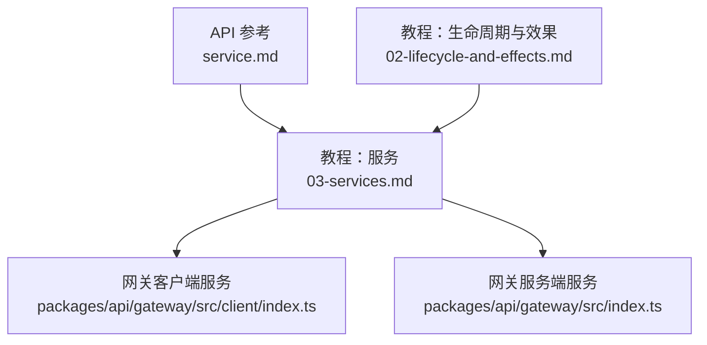
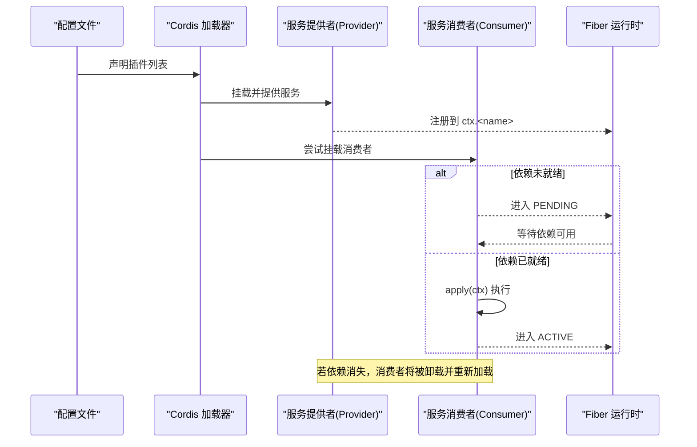
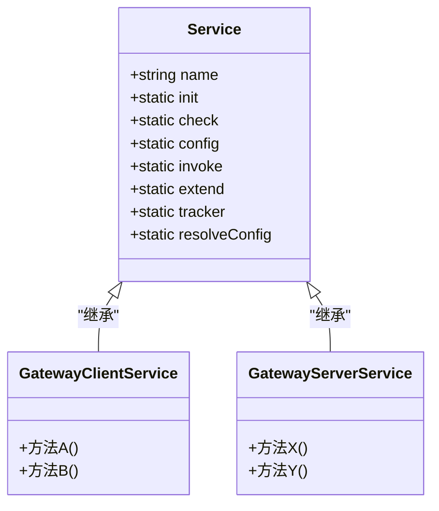
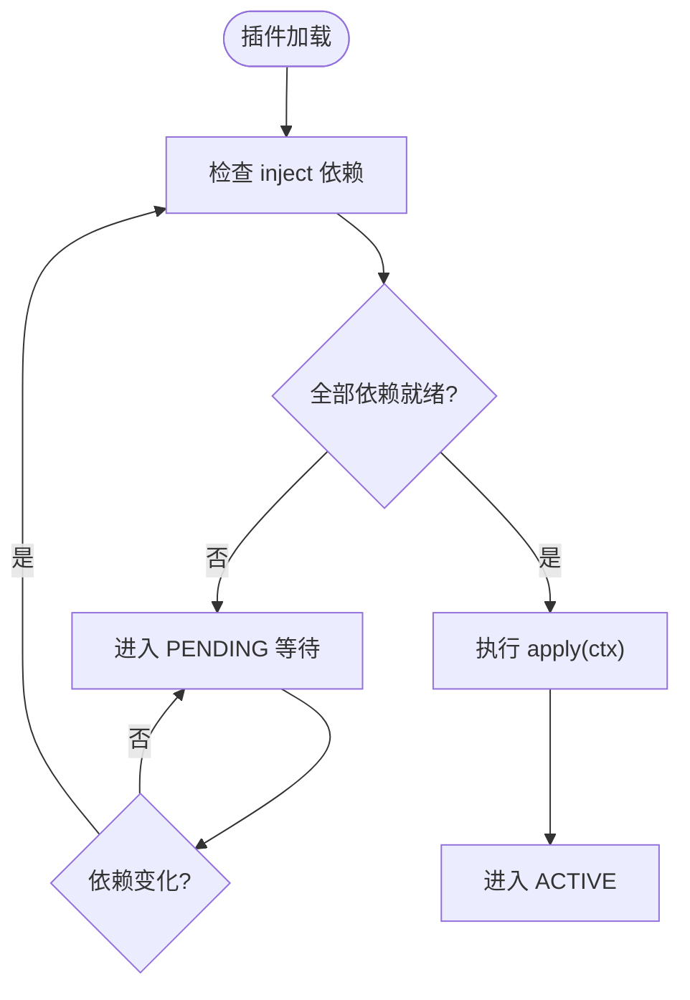
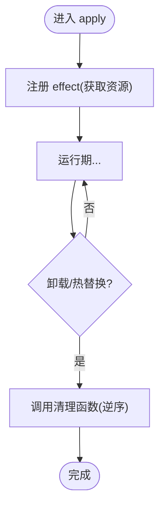
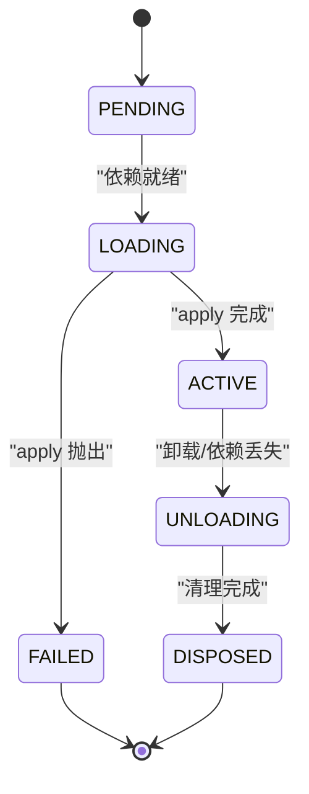

# Service 接口与生命周期

<cite>
**本文引用的文件**
- [服务文档（英文）](file://docs/cordis-api/service.md)
- [服务教程（英文）](file://docs/cordis-tutorial/03-services.md)
- [生命周期与效果教程（英文）](file://docs/cordis-tutorial/02-lifecycle-and-effects.md)
- [网关客户端服务实现](file://packages/api/gateway/src/client/index.ts)
- [网关服务端服务实现](file://packages/api/gateway/src/index.ts)
</cite>

## 目录
1. [简介](#简介)
2. [项目结构](#项目结构)
3. [核心组件](#核心组件)
4. [架构总览](#架构总览)
5. [详细组件分析](#详细组件分析)
6. [依赖关系分析](#依赖关系分析)
7. [性能考量](#性能考量)
8. [故障排查指南](#故障排查指南)
9. [结论](#结论)
10. [附录](#附录)

## 简介
本章节面向初学者与高级用户，系统阐述 Cordis 中的 Service 概念、函数式与类式两种实现方式、依赖注入机制 inject、apply(ctx) 的执行时机与上下文、effect() 的可逆性，以及插件从挂载、激活到卸载的完整生命周期。通过图示与示例路径，帮助读者理解如何创建不同类型的 Service、声明依赖、管理工作流并保证资源安全释放。

## 项目结构
围绕 Service 的相关文档与实现分布在以下位置：
- API 参考：Service 基类与静态成员说明
- 教程：服务提供与消费、依赖注入、可选依赖、命名规范
- 教程：生命周期与 effect 可逆性、Fiber 状态机
- 实际实现：网关相关 Service 作为类式服务的落地示例

图表来源
- [服务文档（英文）:1-103](file://docs/cordis-api/service.md#L1-L103)
- [服务教程（英文）:1-99](file://docs/cordis-tutorial/03-services.md#L1-L99)
- [生命周期与效果教程（英文）:1-99](file://docs/cordis-tutorial/02-lifecycle-and-effects.md#L1-L99)
- [网关客户端服务实现:1-500](file://packages/api/gateway/src/client/index.ts#L1-L500)
- [网关服务端服务实现:1-200](file://packages/api/gateway/src/index.ts#L1-L200)

章节来源
- [服务文档（英文）:1-103](file://docs/cordis-api/service.md#L1-L103)
- [服务教程（英文）:1-99](file://docs/cordis-tutorial/03-services.md#L1-L99)
- [生命周期与效果教程（英文）:1-99](file://docs/cordis-tutorial/02-lifecycle-and-effects.md#L1-L99)

## 核心组件
- Service 基类：用于在上下文中注册具名能力，实例化后自动注册并在所属 fiber 销毁时移除。
- 静态成员：
  - init：类式插件构造后执行的实例方法标记
  - check：传递给 ctx.provide() 的可用性谓词标记
  - config：拦截配置的类型占位标记
  - invoke：使服务可调用（如 ctx.logger()）的调用体标记
  - extend：派生扩展服务实例的辅助标记
  - tracker：上下文追踪用的跟踪器元数据标记
  - resolveConfig：拦截配置的解析辅助标记
- 名称空间：每个应用内服务名扁平化，需避免冲突。

章节来源
- [服务文档（英文）:1-103](file://docs/cordis-api/service.md#L1-L103)

## 架构总览
下图展示“提供者—消费者”的服务模型与依赖驱动加载顺序。

图表来源
- [服务教程（英文）:44-79](file://docs/cordis-tutorial/03-services.md#L44-L79)
- [生命周期与效果教程（英文）:68-94](file://docs/cordis-tutorial/02-lifecycle-and-effects.md#L68-L94)

## 详细组件分析

### 类式服务：以 Service 子类暴露能力
- 设计要点
  - 构造函数中调用 super(ctx, name) 完成注册
  - 通过静态成员扩展行为（如 init、check、invoke 等）
  - 服务名全局唯一，建议前缀避免冲突
- 典型用法
  - 定义一个 Service 子类，在构造函数中注册自身
  - 在 apply(ctx) 中通过 ctx.plugin(...) 挂载该服务类
  - 消费者通过 ctx.<name> 访问服务

图表来源
- [服务文档（英文）:1-103](file://docs/cordis-api/service.md#L1-L103)
- [网关客户端服务实现:1-500](file://packages/api/gateway/src/client/index.ts#L1-L500)
- [网关服务端服务实现:1-200](file://packages/api/gateway/src/index.ts#L1-L200)

章节来源
- [服务文档（英文）:1-103](file://docs/cordis-api/service.md#L1-L103)
- [网关客户端服务实现:1-500](file://packages/api/gateway/src/client/index.ts#L1-L500)
- [网关服务端服务实现:1-200](file://packages/api/gateway/src/index.ts#L1-L200)

### 函数式服务：以对象或函数形式提供能力
- 对象形式：导出 { name, apply(ctx) }，在 apply 中通过 ctx.plugin(...) 挂载具体服务
- 函数形式：直接导出函数作为插件，Cordis 会直接调用；需要显式 apply 时才用对象形式
- 适用场景：轻量能力、组合多个子插件、按需挂载

章节来源
- [生命周期与效果教程（英文）:60-67](file://docs/cordis-tutorial/02-lifecycle-and-effects.md#L60-L67)
- [服务教程（英文）:32-43](file://docs/cordis-tutorial/03-services.md#L32-L43)

### 依赖注入 inject：声明式管理加载顺序
- 作用机制
  - 在消费者模块导出 inject 数组，列出所需服务名
  - Cordis 将消费者置于 PENDING，直到所有依赖均可用
  - 一旦依赖缺失（被卸载或热替换），消费者也会被卸载并重新加载
- 最佳实践
  - 使用 inject 表达强依赖；可选依赖使用 ctx.get('name') 探测
  - 服务名保持扁平且唯一，避免命名冲突

图表来源
- [服务教程（英文）:44-79](file://docs/cordis-tutorial/03-services.md#L44-L79)

章节来源
- [服务教程（英文）:44-79](file://docs/cordis-tutorial/03-services.md#L44-L79)

### apply(ctx)：执行时机与上下文
- 执行时机
  - 当插件的所有 inject 依赖就绪后，Cordis 调用 apply(ctx)
  - 对于类式服务，通常在 apply 中通过 ctx.plugin(ServiceClass) 挂载
- 上下文参数
  - ctx 提供注册、事件、插件挂载、效果管理等能力
  - 在 apply 内部可直接访问已注入的服务

章节来源
- [服务教程（英文）:32-43](file://docs/cordis-tutorial/03-services.md#L32-L43)
- [生命周期与效果教程（英文）:68-80](file://docs/cordis-tutorial/02-lifecycle-and-effects.md#L68-L80)

### effect()：可逆的资源管理
- 作用
  - 将外部资源（定时器、连接、监听器等）包装为 effect，返回清理函数
  - 插件卸载或热替换时，Cordis 按逆序调用清理函数，确保资源释放
- 注意事项
  - 多个异步清理器并发执行；如需顺序清理，应在同一清理器中串行 await
  - 内置注册 API（如 on、plugin、服务注册）本身已是 effect

图表来源
- [生命周期与效果教程（英文）:7-94](file://docs/cordis-tutorial/02-lifecycle-and-effects.md#L7-L94)

章节来源
- [生命周期与效果教程（英文）:7-94](file://docs/cordis-tutorial/02-lifecycle-and-effects.md#L7-L94)

### 生命周期：挂载、激活、卸载
- Fiber 状态机
  - PENDING → LOADING → ACTIVE → UNLOADING → DISPOSED
  - 失败路径：FAILED
- 关键阶段
  - PENDING：依赖未就绪
  - LOADING/APPLY：apply 执行中
  - ACTIVE：服务可用
  - UNLOADING/DISPOSED：清理与回收
- 动态变更
  - 依赖消失触发卸载与重加载，保证一致性

图表来源
- [生命周期与效果教程（英文）:68-80](file://docs/cordis-tutorial/02-lifecycle-and-effects.md#L68-L80)

章节来源
- [生命周期与效果教程（英文）:68-80](file://docs/cordis-tutorial/02-lifecycle-and-effects.md#L68-L80)

### 代码示例路径（不直接展示代码）
- 类式服务示例：参见“网关客户端服务实现”“网关服务端服务实现”
- 函数式服务示例：参见“服务教程（英文）”中 provide/consume 片段
- 依赖注入示例：参见“服务教程（英文）”中 inject 使用片段
- 效果与清理示例：参见“生命周期与效果教程（英文）”中 effect 使用片段

章节来源
- [服务教程（英文）:8-79](file://docs/cordis-tutorial/03-services.md#L8-L79)
- [生命周期与效果教程（英文）:7-94](file://docs/cordis-tutorial/02-lifecycle-and-effects.md#L7-L94)
- [网关客户端服务实现:1-500](file://packages/api/gateway/src/client/index.ts#L1-L500)
- [网关服务端服务实现:1-200](file://packages/api/gateway/src/index.ts#L1-L200)

## 依赖关系分析
- 耦合与内聚
  - 服务提供者与消费者通过名称解耦，降低直接引用耦合度
  - 通过 inject 声明依赖，提升内聚性与可测试性
- 循环依赖
  - 建议在应用层避免循环依赖；必要时通过事件或延迟解析规避
- 外部依赖
  - 通过 effect 管理外部资源，确保卸载时正确释放

图表来源
- [服务教程（英文）:44-79](file://docs/cordis-tutorial/03-services.md#L44-L79)

章节来源
- [服务教程（英文）:44-79](file://docs/cordis-tutorial/03-services.md#L44-L79)

## 性能考量
- 依赖解析开销：inject 会在加载时进行依赖图计算，尽量精简依赖范围
- 热替换成本：依赖变更会触发卸载与重加载，注意减少频繁热更
- 清理并发：多个异步清理器并发执行，必要时在同一清理器中串行处理以避免竞态

[本节为通用指导，无需特定文件引用]

## 故障排查指南
- 插件无输出或无行为
  - 检查是否处于 PENDING：可能因依赖未就绪导致
  - 查看 cordis.yml 中插件顺序不影响依赖解析，但需确保依赖提供方存在
- 依赖消失导致崩溃
  - 确认消费者使用 ctx.get('name') 处理可选依赖
  - 对强依赖使用 inject，确保依赖缺失时整体回滚而非部分运行
- 资源泄漏
  - 确保所有外部资源通过 ctx.effect() 管理并返回清理函数
  - 注意异步清理器的顺序要求，必要时合并为一个清理器

章节来源
- [服务教程（英文）:72-90](file://docs/cordis-tutorial/03-services.md#L72-L90)
- [生命周期与效果教程（英文）:60-94](file://docs/cordis-tutorial/02-lifecycle-and-effects.md#L60-L94)

## 结论
Cordis 的 Service 提供了统一的“能力即服务”抽象，结合 inject 声明式依赖与 effect 可逆资源管理，实现了高内聚、低耦合、可热替换的插件体系。通过类式与函数式两种模式，开发者可以灵活地组织功能模块，并以 Fiber 生命周期保障资源安全与一致性。

[本节为总结性内容，无需特定文件引用]

## 附录
- 术语
  - 服务：在上下文中注册的具名能力
  - 插件：可被挂载、卸载的最小功能单元
  - Fiber：插件实例的运行句柄，承载生命周期状态
  - 效果：可逆的资源管理单元，随插件卸载自动清理

[本节为概念补充，无需特定文件引用]