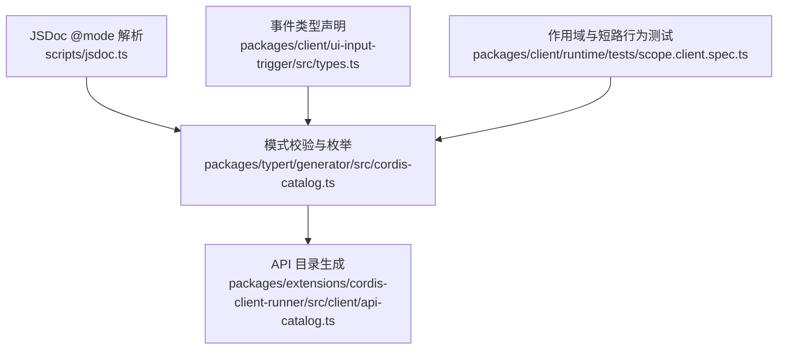
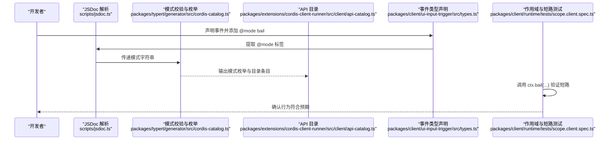
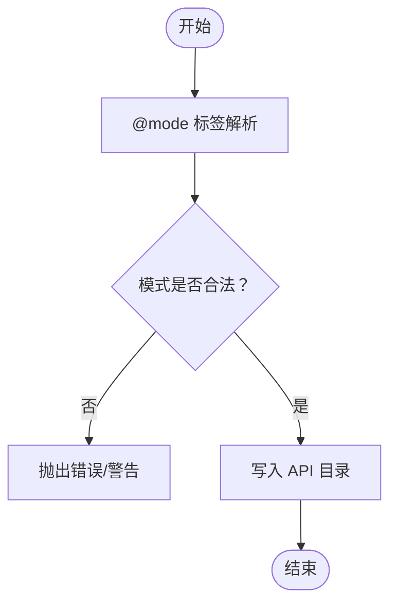
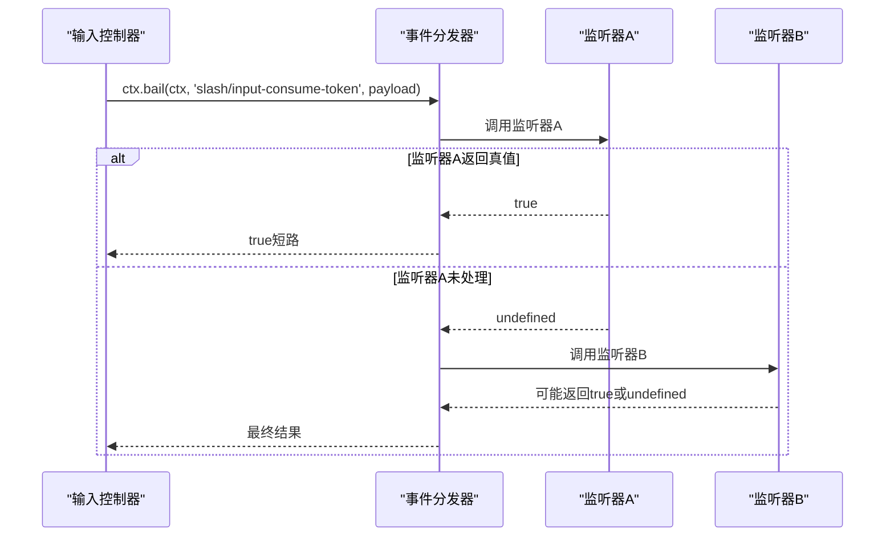
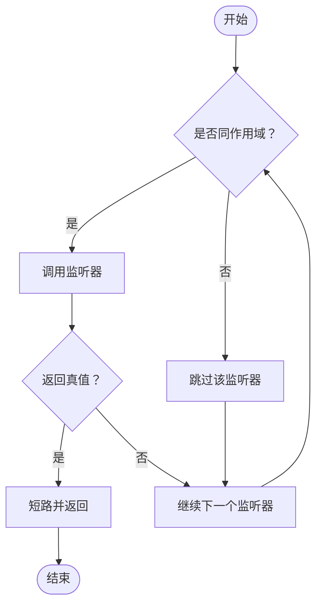
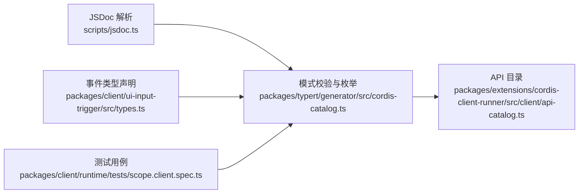

# Bail 模式（同步短路）

<cite>
**本文引用的文件**
- [packages/client/runtime/tests/scope.client.spec.ts](file://packages/client/runtime/tests/scope.client.spec.ts)
- [packages/client/ui-input-trigger/src/types.ts](file://packages/client/ui-input-trigger/src/types.ts)
- [packages/extensions/cordis-client-runner/src/client/api-catalog.ts](file://packages/extensions/cordis-client-runner/src/client/api-catalog.ts)
- [packages/typert/generator/src/cordis-catalog.ts](file://packages/typert/generator/src/cordis-catalog.ts)
- [scripts/jsdoc.ts](file://scripts/jsdoc.ts)
</cite>

## 目录
1. [简介](#简介)
2. [项目结构](#项目结构)
3. [核心组件](#核心组件)
4. [架构总览](#架构总览)
5. [详细组件分析](#详细组件分析)
6. [依赖分析](#依赖分析)
7. [性能考量](#性能考量)
8. [故障排查指南](#故障排查指南)
9. [结论](#结论)
10. [附录](#附录)

## 简介
本文件系统性说明 bail 模式的语义、行为与使用方式，重点解释其作为“串行模式的同步版本”的特性：在事件分发中按顺序调用同作用域监听器，一旦某个监听器返回真值即短路并立即返回，不再继续后续监听器。bail 模式适用于需要同步决策、避免异步开销的场景，例如输入触发、命令消费等对时延敏感且需要快速决断的环节。

## 项目结构
围绕 bail 模式的相关代码主要分布在以下位置：
- 事件声明与模式标注：通过 JSDoc 的 @mode 标签声明事件的分发模式，支持 emit、bail、waterfall、parallel、serial。
- API 目录与文档生成：将 ctx.emit / ctx.parallel / ctx.serial / ctx.bail / ctx.waterfall 统一纳入继承上下文 API 目录。
- 测试用例：验证 bail 的作用域过滤、短路返回值以及根作用域无过滤行为。
- 类型定义：多处事件以 @mode bail 标注，体现其在 UI 输入触发链路中的实际用途。

**图表来源**
- [scripts/jsdoc.ts:62-62](file://scripts/jsdoc.ts#L62-L62)
- [packages/typert/generator/src/cordis-catalog.ts:580-584](file://packages/typert/generator/src/cordis-catalog.ts#L580-L584)
- [packages/extensions/cordis-client-runner/src/client/api-catalog.ts:870-882](file://packages/extensions/cordis-client-runner/src/client/api-catalog.ts#L870-L882)
- [packages/client/ui-input-trigger/src/types.ts:230-258](file://packages/client/ui-input-trigger/src/types.ts#L230-L258)
- [packages/client/runtime/tests/scope.client.spec.ts:50-85](file://packages/client/runtime/tests/scope.client.spec.ts#L50-L85)

**章节来源**
- [packages/typert/generator/src/cordis-catalog.ts:580-584](file://packages/typert/generator/src/cordis-catalog.ts#L580-L584)
- [packages/extensions/cordis-client-runner/src/client/api-catalog.ts:870-882](file://packages/extensions/cordis-client-runner/src/client/api-catalog.ts#L870-L882)
- [packages/client/ui-input-trigger/src/types.ts:230-258](file://packages/client/ui-input-trigger/src/types.ts#L230-L258)
- [packages/client/runtime/tests/scope.client.spec.ts:50-85](file://packages/client/runtime/tests/scope.client.spec.ts#L50-L85)
- [scripts/jsdoc.ts:62-62](file://scripts/jsdoc.ts#L62-L62)

## 核心组件
- 事件模式系统：通过 @mode 标签声明事件分发策略，bail 是其中之一，表示“首个同作用域监听器返回真值即短路”。
- 继承上下文 API：ctx.emit / ctx.parallel / ctx.serial / ctx.bail / ctx.waterfall 被统一收录到继承 API 目录，便于模型与工具发现。
- 输入触发事件：多个 slash 输入相关事件以 @mode bail 标注，体现其在用户输入处理中的短路决策需求。
- 作用域与过滤：bail 仅在同作用域内短路；跨作用域的监听器会被过滤，不会干扰短路逻辑。

**章节来源**
- [packages/typert/generator/src/cordis-catalog.ts:580-584](file://packages/typert/generator/src/cordis-catalog.ts#L580-L584)
- [packages/extensions/cordis-client-runner/src/client/api-catalog.ts:870-882](file://packages/extensions/cordis-client-runner/src/client/api-catalog.ts#L870-L882)
- [packages/client/ui-input-trigger/src/types.ts:230-258](file://packages/client/ui-input-trigger/src/types.ts#L230-L258)
- [packages/client/runtime/tests/scope.client.spec.ts:50-85](file://packages/client/runtime/tests/scope.client.spec.ts#L50-L85)

## 架构总览
下图展示了从事件声明到运行时调用的关键路径，包括模式解析、API 目录生成、以及测试覆盖的行为约束。

**图表来源**
- [scripts/jsdoc.ts:62-62](file://scripts/jsdoc.ts#L62-L62)
- [packages/typert/generator/src/cordis-catalog.ts:580-584](file://packages/typert/generator/src/cordis-catalog.ts#L580-L584)
- [packages/extensions/cordis-client-runner/src/client/api-catalog.ts:870-882](file://packages/extensions/cordis-client-runner/src/client/api-catalog.ts#L870-L882)
- [packages/client/ui-input-trigger/src/types.ts:230-258](file://packages/client/ui-input-trigger/src/types.ts#L230-L258)
- [packages/client/runtime/tests/scope.client.spec.ts:50-85](file://packages/client/runtime/tests/scope.client.spec.ts#L50-L85)

## 详细组件分析

### 事件模式与 @mode 标注
- 模式集合：emit、bail、waterfall、parallel、serial。bail 用于同步短路。
- 解析与校验：JSDoc 解析 @mode 标签，并在生成阶段进行模式合法性检查。
- 目录集成：生成的 API 目录包含 ctx.bail 的统一描述，便于上层工具与模型理解。

**图表来源**
- [scripts/jsdoc.ts:62-62](file://scripts/jsdoc.ts#L62-L62)
- [packages/typert/generator/src/cordis-catalog.ts:580-584](file://packages/typert/generator/src/cordis-catalog.ts#L580-L584)
- [packages/extensions/cordis-client-runner/src/client/api-catalog.ts:870-882](file://packages/extensions/cordis-client-runner/src/client/api-catalog.ts#L870-L882)

**章节来源**
- [scripts/jsdoc.ts:62-62](file://scripts/jsdoc.ts#L62-L62)
- [packages/typert/generator/src/cordis-catalog.ts:580-584](file://packages/typert/generator/src/cordis-catalog.ts#L580-L584)
- [packages/extensions/cordis-client-runner/src/client/api-catalog.ts:870-882](file://packages/extensions/cordis-client-runner/src/client/api-catalog.ts#L870-L882)

### 输入触发事件的 bail 使用
- 事件示例：slash/input-begin-command、slash/input-insert-reference、slash/input-consume-token、slash/input-insert-text 均标注为 @mode bail。
- 语义：这些事件需要在输入处理的早期阶段快速做出决策，若某监听器成功处理则短路，避免后续重复处理或额外开销。
- 调用方式：通常由控制器或服务层调用 ctx.bail(ctx, eventName, payload)，根据返回值判断是否已处理。

**图表来源**
- [packages/client/ui-input-trigger/src/types.ts:230-258](file://packages/client/ui-input-trigger/src/types.ts#L230-L258)

**章节来源**
- [packages/client/ui-input-trigger/src/types.ts:230-258](file://packages/client/ui-input-trigger/src/types.ts#L230-L258)

### 作用域与短路行为验证
- 同作用域短路：bail 仅在相同作用域内短路；跨作用域的监听器会被过滤，不影响短路逻辑。
- 根作用域无过滤：当从根作用域发起分发时，所有监听器都会收到事件，不受作用域过滤影响。
- 测试覆盖：通过测试用例验证 bail 的返回值与监听器执行顺序，确保短路行为符合预期。

**图表来源**
- [packages/client/runtime/tests/scope.client.spec.ts:50-85](file://packages/client/runtime/tests/scope.client.spec.ts#L50-L85)

**章节来源**
- [packages/client/runtime/tests/scope.client.spec.ts:50-85](file://packages/client/runtime/tests/scope.client.spec.ts#L50-L85)

## 依赖分析
- 模式解析依赖：JSDoc 解析模块负责提取 @mode 标签，并将模式字符串传递给生成器。
- 生成器依赖：模式校验与枚举生成依赖于解析结果，同时产出 API 目录条目。
- 类型声明依赖：事件类型文件通过 @mode 标注声明分发策略，供生成器与文档系统使用。
- 测试依赖：测试用例直接调用 ctx.bail，验证作用域与短路行为，确保实现正确性。

**图表来源**
- [scripts/jsdoc.ts:62-62](file://scripts/jsdoc.ts#L62-L62)
- [packages/typert/generator/src/cordis-catalog.ts:580-584](file://packages/typert/generator/src/cordis-catalog.ts#L580-L584)
- [packages/client/ui-input-trigger/src/types.ts:230-258](file://packages/client/ui-input-trigger/src/types.ts#L230-L258)
- [packages/extensions/cordis-client-runner/src/client/api-catalog.ts:870-882](file://packages/extensions/cordis-client-runner/src/client/api-catalog.ts#L870-L882)
- [packages/client/runtime/tests/scope.client.spec.ts:50-85](file://packages/client/runtime/tests/scope.client.spec.ts#L50-L85)

**章节来源**
- [scripts/jsdoc.ts:62-62](file://scripts/jsdoc.ts#L62-L62)
- [packages/typert/generator/src/cordis-catalog.ts:580-584](file://packages/typert/generator/src/cordis-catalog.ts#L580-L584)
- [packages/client/ui-input-trigger/src/types.ts:230-258](file://packages/client/ui-input-trigger/src/types.ts#L230-L258)
- [packages/extensions/cordis-client-runner/src/client/api-catalog.ts:870-882](file://packages/extensions/cordis-client-runner/src/client/api-catalog.ts#L870-L882)
- [packages/client/runtime/tests/scope.client.spec.ts:50-85](file://packages/client/runtime/tests/scope.client.spec.ts#L50-L85)

## 性能考量
- 同步短路优势：bail 模式在同步上下文中按序调用监听器，一旦命中即返回，避免不必要的后续调用与异步调度开销。
- 适用场景：输入处理、命令消费、权限判定等需要快速决策且对时延敏感的环节。
- 与 serial 对比：serial 模式强调串行等待与聚合结果，适合需要完整执行链的场景；bail 更侧重“首个成功即止”的短路逻辑。
- 选择建议：若业务逻辑允许任一监听器成功即可终止流程，优先选择 bail；若需收集全部结果或严格顺序执行，考虑 serial。

[本节提供通用指导，不直接分析具体文件]

## 故障排查指南
- 模式标注缺失：若事件未标注 @mode，生成阶段会提示缺失，需补充 emit、bail、waterfall、parallel 或 serial。
- 作用域误用：bail 仅在同作用域内短路，跨作用域监听器不会被短路；如需全局短路，应从根作用域分发。
- 返回值约定：bail 期望监听器返回真值以触发短路；若返回 undefined 或 false，将继续调用后续监听器。
- 调试技巧：通过测试用例观察监听器执行顺序与返回值，定位短路点是否符合预期。

**章节来源**
- [packages/typert/generator/src/cordis-catalog.ts:580-584](file://packages/typert/generator/src/cordis-catalog.ts#L580-L584)
- [packages/client/runtime/tests/scope.client.spec.ts:50-85](file://packages/client/runtime/tests/scope.client.spec.ts#L50-L85)

## 结论
bail 模式提供了同步短路的分发机制，适用于需要快速决策且避免异步开销的场景。通过 @mode 标注、API 目录集成与作用域过滤，bail 能够在复杂的事件系统中实现高效、可预测的控制流。在实际开发中，应根据业务需求选择 bail 或 serial：前者强调“首个成功即止”，后者强调“完整串行执行”。

[本节总结整体内容，不直接分析具体文件]

## 附录
- 使用建议：
  - 在输入触发、命令消费等高频低延迟场景中优先考虑 bail。
  - 明确监听器的返回值约定，确保短路逻辑清晰可控。
  - 结合作用域设计，避免跨作用域短路带来的意外行为。
- 参考路径：
  - 事件模式解析与校验：[scripts/jsdoc.ts:62-62](file://scripts/jsdoc.ts#L62-L62)、[packages/typert/generator/src/cordis-catalog.ts:580-584](file://packages/typert/generator/src/cordis-catalog.ts#L580-L584)
  - API 目录与文档：[packages/extensions/cordis-client-runner/src/client/api-catalog.ts:870-882](file://packages/extensions/cordis-client-runner/src/client/api-catalog.ts#L870-L882)
  - 输入触发事件示例：[packages/client/ui-input-trigger/src/types.ts:230-258](file://packages/client/ui-input-trigger/src/types.ts#L230-L258)
  - 作用域与短路测试：[packages/client/runtime/tests/scope.client.spec.ts:50-85](file://packages/client/runtime/tests/scope.client.spec.ts#L50-L85)