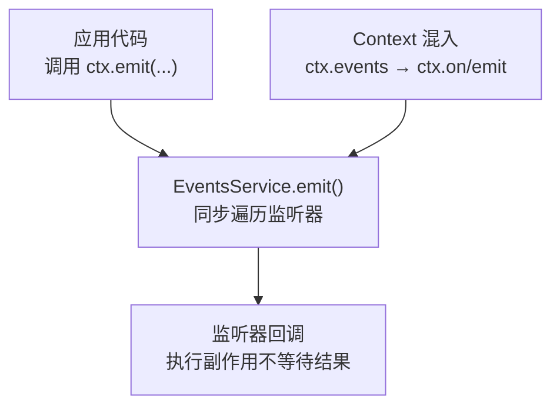
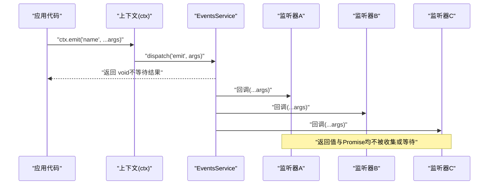
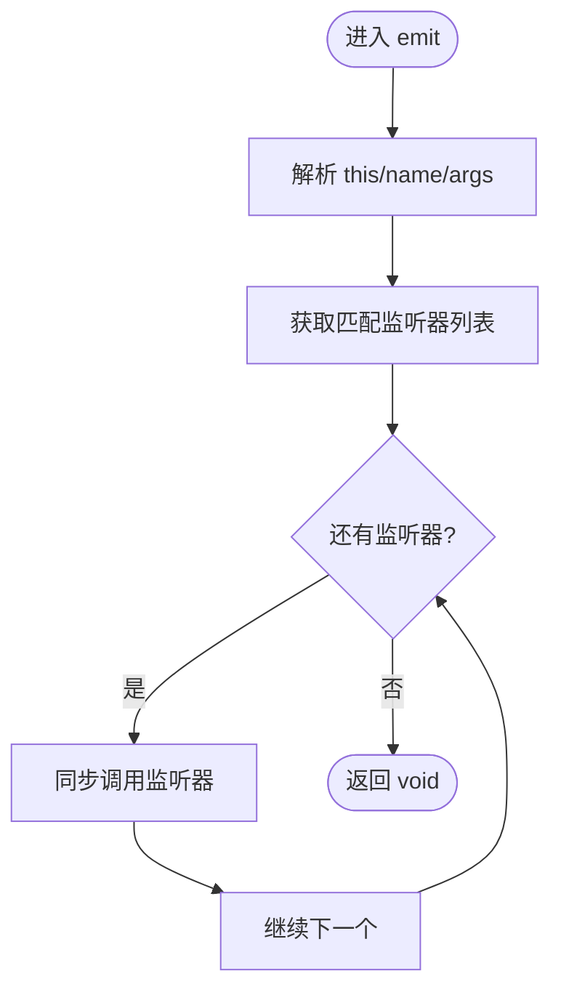
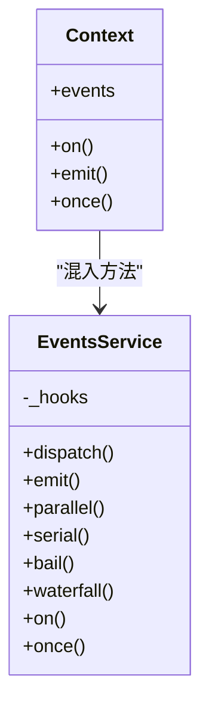

# Emit 模式（同步广播）

<cite>
**本文引用的文件**
- [events.ts](file://vendor/cordis/src/events.ts)
- [context.zh.md](file://docs/cordis-api/context.zh.md)
- [events.zh.md](file://docs/cordis-api/events.zh.md)
- [index.ts](file://packages/client/runtime/src/client/index.ts)
- [slots.ts](file://packages/client/runtime/src/client/slots.ts)
- [index.ts](file://packages/client/locale/src/client/index.ts)
- [index.ts](file://packages/client/ui-theme/src/client/index.ts)
</cite>

## 目录
1. [简介](#简介)
2. [项目结构](#项目结构)
3. [核心组件](#核心组件)
4. [架构总览](#架构总览)
5. [详细组件分析](#详细组件分析)
6. [依赖关系分析](#依赖关系分析)
7. [性能考量](#性能考量)
8. [故障排查指南](#故障排查指南)
9. [结论](#结论)
10. [附录：使用示例与最佳实践](#附录使用示例与最佳实践)

## 简介
Emit 模式是 Cordis 事件系统中的“同步广播”分发方式。调用 ctx.emit(name, ...args) 会同步地、按注册顺序依次调用所有监听器，且不会等待监听器的返回值或 Promise。该模式适用于不需要响应的事件通知、日志记录、监控统计等副作用型操作，强调低开销与最小侵入性。

## 项目结构
- 事件系统核心实现位于 vendor/cordis/src/events.ts，提供 EventsService 及 emit/parallel/serial/bail/waterfall 等多种分发模式。
- 上下文通过混入将事件方法暴露为 ctx.on/ctx.emit/...，详见 docs/cordis-api/context.zh.md。
- 官方文档对 emit 的语义进行了明确说明，详见 docs/cordis-api/events.zh.md。
- 实际业务中多处使用 ctx.emit 进行无响应的广播，例如客户端运行时、国际化主题变更等。

图表来源
- [events.ts:131-196](file://vendor/cordis/src/events.ts#L131-L196)
- [context.zh.md:122-131](file://docs/cordis-api/context.zh.md#L122-L131)

章节来源
- [events.ts:131-196](file://vendor/cordis/src/events.ts#L131-L196)
- [context.zh.md:122-131](file://docs/cordis-api/context.zh.md#L122-L131)
- [events.zh.md:33-51](file://docs/cordis-api/events.zh.md#L33-L51)

## 核心组件
- EventsService：事件总线，负责监听器注册、过滤、分发与生命周期管理。
- Context 混入：将 events 服务的方法以 ctx.on/ctx.emit 等形式直接暴露给插件与子系统。
- 事件类型定义：Events 接口声明了框架内部事件，便于类型推导与 IDE 提示。

关键职责
- emit：同步广播，忽略返回值，不等待 Promise。
- parallel：并发运行并等待所有监听器完成。
- serial/bail：有序执行，遇到提前终止值即停止。
- waterfall：基于 next 回调的组合式链式处理。

章节来源
- [events.ts:131-353](file://vendor/cordis/src/events.ts#L131-L353)
- [context.zh.md:122-131](file://docs/cordis-api/context.zh.md#L122-L131)

## 架构总览
下图展示了 emit 模式的调用路径：应用代码通过 ctx.emit 触发事件，事件总线解析监听器并同步调用，监听器执行副作用，返回值被丢弃。

图表来源
- [events.ts:165-196](file://vendor/cordis/src/events.ts#L165-L196)
- [events.zh.md:33-51](file://docs/cordis-api/events.zh.md#L33-L51)

## 详细组件分析

### EventsService.emit 的实现要点
- 同步遍历：通过 Array.map 同步调用每个监听器，不 await 任何返回值。
- 错误传播：若监听器抛出同步异常，会中断后续监听器；异步拒绝不会被捕获，需由监听器自行处理。
- 过滤器：在 dispatch 阶段根据上下文过滤器与 global 选项筛选监听器。

图表来源
- [events.ts:165-196](file://vendor/cordis/src/events.ts#L165-L196)

章节来源
- [events.ts:165-196](file://vendor/cordis/src/events.ts#L165-L196)

### 与其他分发模式的对比
- emit：同步广播，不等待结果，适合纯副作用场景。
- parallel：并发执行并等待全部完成，适合需要聚合结果的场景。
- serial：顺序等待，遇到提前终止值即停。
- bail：顺序同步执行，遇到提前终止值即停。
- waterfall：基于 next 的组合式链式处理。

选择建议
- 仅做日志、埋点、统计、UI 状态广播等无需回应的场景优先用 emit。
- 需要等待多个监听器完成再推进流程时，考虑 parallel。
- 需要顺序控制或短路逻辑时，考虑 serial/bail。
- 需要可插拔的中间件式处理时，考虑 waterfall。

章节来源
- [events.zh.md:10-125](file://docs/cordis-api/events.zh.md#L10-L125)
- [events.ts:183-243](file://vendor/cordis/src/events.ts#L183-L243)

### 监听器执行行为与结果处理
- 返回值：emit 模式下，监听器的返回值（包括 Promise）会被忽略，调用方不感知。
- 异常：同步异常会中断后续监听器；异步拒绝不会冒泡到调用方，应在监听器内部 try/catch 或 .catch。
- 顺序：按注册顺序执行，prepend 注册的监听器先执行。

章节来源
- [events.ts:194-196](file://vendor/cordis/src/events.ts#L194-L196)
- [events.zh.md:33-51](file://docs/cordis-api/events.zh.md#L33-L51)

### 典型使用场景
- 不需要响应的事件通知：如连接重置、主题切换、语言包变化等。
- 日志记录与审计：记录关键状态变更。
- 监控统计：上报指标、埋点数据。
- UI 刷新：通知视图层更新，但不阻塞主流程。

章节来源
- [index.ts:221](file://packages/client/runtime/src/client/index.ts#L221)
- [index.ts:302](file://packages/client/locale/src/client/index.ts#L302)
- [index.ts:329](file://packages/client/ui-theme/src/client/index.ts#L329)
- [slots.ts:106](file://packages/client/runtime/src/client/slots.ts#L106)

## 依赖关系分析
- EventsService 依赖 Context 用于作用域与过滤器。
- Context 通过 mixin 将 events 服务的方法注入到 ctx 上，形成 ctx.on/ctx.emit 等便捷 API。
- 各子系统通过 ctx.emit 发布事件，监听器可在任意 fiber 内注册，随 fiber 生命周期自动清理。

图表来源
- [context.zh.md:122-131](file://docs/cordis-api/context.zh.md#L122-L131)
- [events.ts:131-319](file://vendor/cordis/src/events.ts#L131-L319)

章节来源
- [context.zh.md:122-131](file://docs/cordis-api/context.zh.md#L122-L131)
- [events.ts:131-319](file://vendor/cordis/src/events.ts#L131-L319)

## 性能考量
- 零等待：emit 不等待任何监听器，避免阻塞调用栈，适合高频事件。
- 线性扫描：每次分发都会遍历匹配的监听器列表，监听器数量较大时应注意注册/注销策略。
- 异常隔离：异步拒绝不会中断调用方，但过多未处理的异步错误会增加调试成本。
- 与 parallel 对比：parallel 会等待所有监听器完成，适合需要聚合结果的场景，但会带来额外等待开销。

[本节为通用指导，不直接分析具体文件]

## 故障排查指南
- 监听器未执行：检查是否在当前 fiber 内注册；确认事件名一致；查看上下文过滤器是否排除了当前上下文。
- 异步错误丢失：确保监听器内部对异步操作进行 try/catch 或 .catch，避免静默失败。
- 性能退化：减少高频事件的监听器数量，或将无关逻辑移出事件链路。
- 顺序问题：如需特定顺序，使用 prepend 注册或使用 waterfall/serial 等可控模式。

章节来源
- [events.ts:165-196](file://vendor/cordis/src/events.ts#L165-L196)
- [events.ts:288-319](file://vendor/cordis/src/events.ts#L288-L319)

## 结论
Emit 模式提供了轻量、同步、无等待的事件广播能力，非常适合不需要响应的副作用场景。其简单直接的语义降低了调用方的心智负担，同时避免了不必要的等待开销。在需要聚合结果或顺序控制的场景中，应选用 parallel/serial/bail/waterfall 等更合适的分发模式。

[本节为总结性内容，不直接分析具体文件]

## 附录：使用示例与最佳实践

- 连接重置通知（客户端运行时）
  - 调用位置：packages/client/runtime/src/client/index.ts
  - 用途：当连接重置时，通知相关模块刷新状态，不等待响应。

- 插槽变更通知（客户端运行时）
  - 调用位置：packages/client/runtime/src/client/slots.ts
  - 用途：插槽数据变更后广播，驱动 UI 或其他订阅者更新。

- 语言包切换通知（客户端本地化）
  - 调用位置：packages/client/locale/src/client/index.ts
  - 用途：语言包切换后广播，使界面与文案刷新。

- 主题切换通知（客户端主题）
  - 调用位置：packages/client/ui-theme/src/client/index.ts
  - 用途：主题变更后广播，触发 UI 重绘与样式更新。

最佳实践
- 监听器保持幂等与健壮：避免在监听器中执行昂贵或易错的操作。
- 异步操作要自包含错误处理：emit 不捕获异步拒绝，需在监听器内部处理。
- 合理拆分事件：将不同关注点的事件拆分为独立名称，便于选择性订阅。
- 谨慎使用全局监听器：global 选项会绕过上下文过滤器，仅在必要时使用。

章节来源
- [index.ts:221](file://packages/client/runtime/src/client/index.ts#L221)
- [slots.ts:106](file://packages/client/runtime/src/client/slots.ts#L106)
- [index.ts:302](file://packages/client/locale/src/client/index.ts#L302)
- [index.ts:329](file://packages/client/ui-theme/src/client/index.ts#L329)