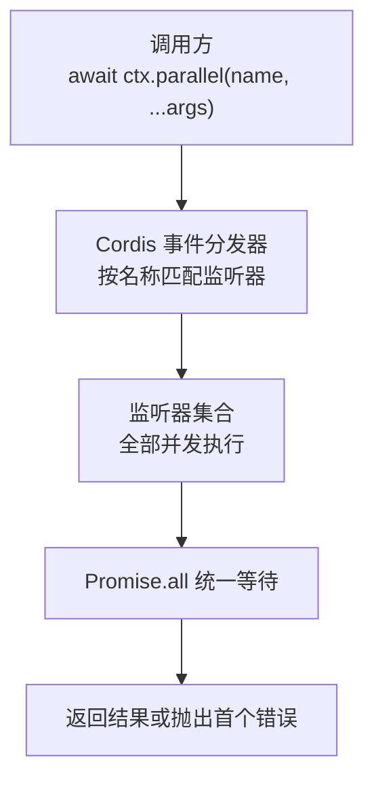
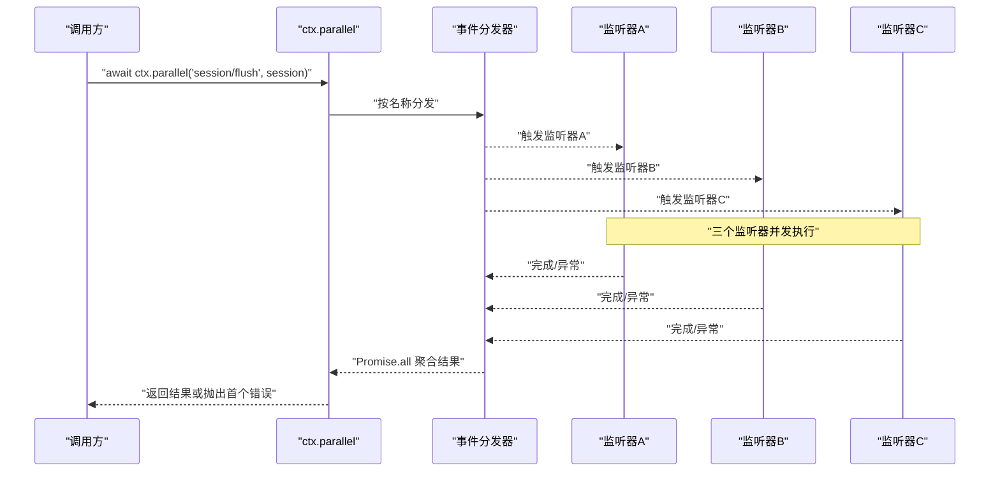
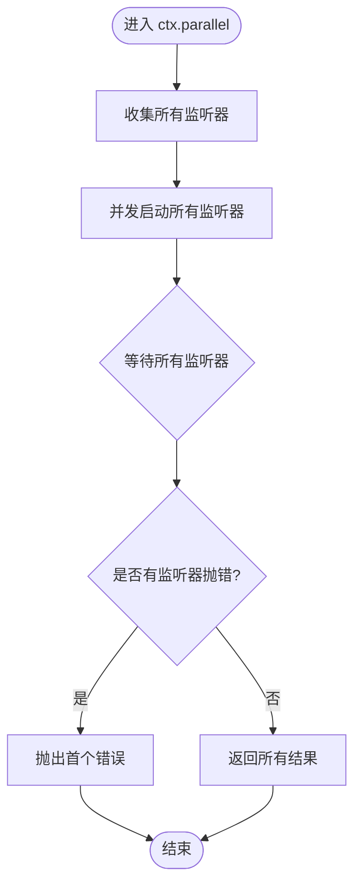
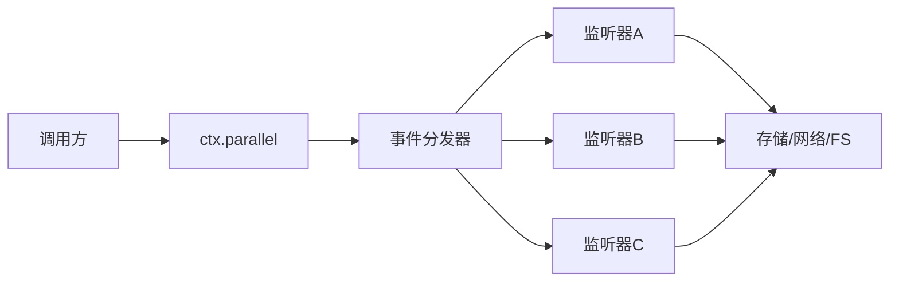

# Parallel 模式（并行执行）

<cite>
**本文引用的文件**
- [packages/extensions/tool-cordis/src/api-catalog.ts](file://packages/extensions/tool-cordis/src/api-catalog.ts)
- [packages/core/session/src/index.ts](file://packages/core/session/src/index.ts)
- [packages/session/session-persistence/tests/coordinator-contract.ts](file://packages/session/session-persistence/tests/coordinator-contract.ts)
- [packages/session/session-telemetry/tests/telemetry.spec.ts](file://packages/session/session-telemetry/tests/telemetry.spec.ts)
- [scripts/gen-cordis-catalog.ts](file://scripts/gen-cordis-catalog.ts)
- [apps/web/tests/snapshots/message-actions/ui.expected.md](file://apps/web/tests/snapshots/message-actions/ui.expected.md)
</cite>

## 目录
1. [简介](#简介)
2. [项目结构](#项目结构)
3. [核心组件](#核心组件)
4. [架构总览](#架构总览)
5. [详细组件分析](#详细组件分析)
6. [依赖关系分析](#依赖关系分析)
7. [性能考量](#性能考量)
8. [故障排查指南](#故障排查指南)
9. [结论](#结论)
10. [附录](#附录)

## 简介
本文件聚焦于 Cordis 上下文中的 parallel 模式，即通过 await ctx.parallel(name, ...args) 触发的“并行分发”机制。其语义是：将一次事件名与参数分发给所有已注册的监听器，并以 Promise 统一等待所有监听器的完成；任一监听器抛错会令整体调用失败。该模式适用于需要高性能的批量处理、独立任务并发执行等场景。

## 项目结构
parallel 模式在仓库中多处被引用与使用，主要涉及以下位置：
- API 目录说明：在工具 API 目录中明确列出 ctx.emit / ctx.parallel / ctx.serial / ctx.bail / ctx.waterfall 的能力摘要，表明 parallel 是事件分发的一种模式。
- 会话持久化测试：以 ctx.parallel('session/flush', session) 作为示例，展示在会话刷新这一关键路径上使用并行模式的调用方式。
- 遥测测试：同样通过 ctx.parallel('session/flush', session) 验证并发刷新的行为。
- 生成脚本：构建 cordis API 目录时，将 parallel 与其他分发模式并列记录，体现其在公共契约中的地位。
- Web UI 快照：展示了“在同一轮次内并行读取多个文件”的用户侧行为，体现了模型驱动下的并行工具调用结果。

图表来源
- [packages/extensions/tool-cordis/src/api-catalog.ts:1301](file://packages/extensions/tool-cordis/src/api-catalog.ts#L1301)
- [packages/extensions/tool-cordis/src/api-catalog.ts:4653](file://packages/extensions/tool-cordis/src/api-catalog.ts#L4653)
- [scripts/gen-cordis-catalog.ts:641](file://scripts/gen-cordis-catalog.ts#L641)

章节来源
- [packages/extensions/tool-cordis/src/api-catalog.ts:1301](file://packages/extensions/tool-cordis/src/api-catalog.ts#L1301)
- [packages/extensions/tool-cordis/src/api-catalog.ts:4653](file://packages/extensions/tool-cordis/src/api-catalog.ts#L4653)
- [scripts/gen-cordis-catalog.ts:641](file://scripts/gen-cordis-catalog.ts#L641)

## 核心组件
- 调用入口：await ctx.parallel(name, ...args)
  - name：事件名，用于路由到对应监听器集合。
  - ...args：传递给每个监听器的参数。
- 监听器集合：同一事件名下可注册多个监听器，parallel 模式下它们将被同时调度执行。
- 统一等待：调用方通过 await 等待所有监听器完成；若任意监听器抛错，则本次调用失败并向上抛出。
- 典型用法：在会话持久化、遥测上报等场景中，对“session/flush”等事件进行并行刷新，确保多存储/通道尽快落盘或上报。

章节来源
- [packages/session/session-persistence/tests/coordinator-contract.ts:362](file://packages/session/session-persistence/tests/coordinator-contract.ts#L362)
- [packages/session/session-telemetry/tests/telemetry.spec.ts:265](file://packages/session/session-telemetry/tests/telemetry.spec.ts#L265)
- [packages/session/session-telemetry/tests/telemetry.spec.ts:443](file://packages/session/session-telemetry/tests/telemetry.spec.ts#L443)
- [packages/session/session-telemetry/tests/telemetry.spec.ts:451](file://packages/session/session-telemetry/tests/telemetry.spec.ts#L451)
- [packages/core/session/src/index.ts:1015](file://packages/core/session/src/index.ts#L1015)

## 架构总览
下图展示了 parallel 模式从调用到监听器执行的端到端流程，以及 Promise 的统一等待与错误传播机制。

图表来源
- [packages/session/session-persistence/tests/coordinator-contract.ts:362](file://packages/session/session-persistence/tests/coordinator-contract.ts#L362)
- [packages/session/session-telemetry/tests/telemetry.spec.ts:265](file://packages/session/session-telemetry/tests/telemetry.spec.ts#L265)
- [packages/session/session-telemetry/tests/telemetry.spec.ts:443](file://packages/session/session-telemetry/tests/telemetry.spec.ts#L443)
- [packages/session/session-telemetry/tests/telemetry.spec.ts:451](file://packages/session/session-telemetry/tests/telemetry.spec.ts#L451)

## 详细组件分析

### 调用语义与并发特性
- 调用方式：await ctx.parallel(name, ...args)
  - 语义：将 name 对应的所有监听器同时启动执行，并将它们的 Promise 统一收集。
  - 等待：调用方 await 的是“所有监听器都完成”的 Promise。
  - 错误：任一监听器抛错会导致整个调用失败，错误向上传播。
- 并发特性：
  - 所有监听器并发执行，不保证顺序。
  - 适合无副作用或副作用相互独立的监听器。
  - 若监听器存在共享状态竞争，需自行加锁或避免竞态。

章节来源
- [packages/extensions/tool-cordis/src/api-catalog.ts:1301](file://packages/extensions/tool-cordis/src/api-catalog.ts#L1301)
- [packages/extensions/tool-cordis/src/api-catalog.ts:4653](file://packages/extensions/tool-cordis/src/api-catalog.ts#L4653)
- [scripts/gen-cordis-catalog.ts:641](file://scripts/gen-cordis-catalog.ts#L641)

### 典型使用场景
- 批量写入/刷新：例如对多个存储后端或日志通道并行 flush，缩短整体耗时。
- 独立任务执行：如同时触发多种遥测上报、指标采集、缓存失效通知等。
- 模型驱动的并行工具调用：Web UI 快照显示“在同一轮次内并行读取多个文件”，体现模型决策后对多个工具调用的并发执行。

章节来源
- [packages/session/session-persistence/tests/coordinator-contract.ts:362](file://packages/session/session-persistence/tests/coordinator-contract.ts#L362)
- [packages/session/session-telemetry/tests/telemetry.spec.ts:265](file://packages/session/session-telemetry/tests/telemetry.spec.ts#L265)
- [packages/session/session-telemetry/tests/telemetry.spec.ts:443](file://packages/session/session-telemetry/tests/telemetry.spec.ts#L443)
- [packages/session/session-telemetry/tests/telemetry.spec.ts:451](file://packages/session/session-telemetry/tests/telemetry.spec.ts#L451)
- [apps/web/tests/snapshots/message-actions/ui.expected.md:14](file://apps/web/tests/snapshots/message-actions/ui.expected.md#L14)

### 错误处理策略
- 任一监听器抛错：整个 ctx.parallel 调用失败，错误向上传播给调用方。
- 建议：
  - 监听器内部捕获并记录错误，必要时返回降级结果，避免影响整体。
  - 对关键路径（如 flush）采用幂等设计，便于重试。
  - 对非关键路径（如遥测上报）允许失败但不阻塞主流程。

章节来源
- [packages/extensions/tool-cordis/src/api-catalog.ts:1301](file://packages/extensions/tool-cordis/src/api-catalog.ts#L1301)
- [packages/extensions/tool-cordis/src/api-catalog.ts:4653](file://packages/extensions/tool-cordis/src/api-catalog.ts#L4653)

### 代码级流程图（Promise 统一等待与错误传播）

图表来源
- [packages/session/session-persistence/tests/coordinator-contract.ts:362](file://packages/session/session-persistence/tests/coordinator-contract.ts#L362)
- [packages/session/session-telemetry/tests/telemetry.spec.ts:265](file://packages/session/session-telemetry/tests/telemetry.spec.ts#L265)
- [packages/session/session-telemetry/tests/telemetry.spec.ts:443](file://packages/session/session-telemetry/tests/telemetry.spec.ts#L443)
- [packages/session/session-telemetry/tests/telemetry.spec.ts:451](file://packages/session/session-telemetry/tests/telemetry.spec.ts#L451)

## 依赖关系分析
- 调用方依赖：调用方通过 ctx.parallel 发起并行分发，依赖事件名与监听器注册的一致性。
- 分发器依赖：事件分发器负责按名称匹配监听器并并发调度。
- 监听器实现：各业务模块注册具体监听器，承担实际工作（如 flush、上报等）。
- 外部系统：监听器可能访问存储、网络、文件系统，需注意资源竞争与超时。

图表来源
- [packages/extensions/tool-cordis/src/api-catalog.ts:1301](file://packages/extensions/tool-cordis/src/api-catalog.ts#L1301)
- [packages/extensions/tool-cordis/src/api-catalog.ts:4653](file://packages/extensions/tool-cordis/src/api-catalog.ts#L4653)
- [packages/session/session-persistence/tests/coordinator-contract.ts:362](file://packages/session/session-persistence/tests/coordinator-contract.ts#L362)

章节来源
- [packages/extensions/tool-cordis/src/api-catalog.ts:1301](file://packages/extensions/tool-cordis/src/api-catalog.ts#L1301)
- [packages/extensions/tool-cordis/src/api-catalog.ts:4653](file://packages/extensions/tool-cordis/src/api-catalog.ts#L4653)
- [packages/session/session-persistence/tests/coordinator-contract.ts:362](file://packages/session/session-persistence/tests/coordinator-contract.ts#L362)

## 性能考量
- 并发度控制：监听器数量越多，并发越高，但需评估下游资源（CPU、IO、连接池）上限。
- 错误隔离：单个监听器失败不应拖垮其他监听器；可在监听器内部捕获错误并降级。
- 幂等性：flush 等操作应幂等，便于失败重试。
- 超时与限流：为外部 IO 设置合理超时；对高频上报做节流或合并。
- 观测性：记录每个监听器的耗时与错误，便于定位瓶颈。

[本节为通用指导，无需特定文件来源]

## 故障排查指南
- 现象：await ctx.parallel(...) 抛出异常
  - 检查是否某个监听器未捕获异常；建议在监听器内部 try/catch 并记录。
  - 核对事件名是否正确，是否存在同名不同义的监听器冲突。
- 现象：部分监听器未执行或执行缓慢
  - 检查下游资源（存储、网络）是否拥塞；增加超时与重试。
  - 确认监听器是否被错误地串行化（例如误用 serial/bail/waterfall）。
- 现象：数据不一致
  - 确认监听器是否具备幂等性；对共享状态加锁或避免竞态。

章节来源
- [packages/extensions/tool-cordis/src/api-catalog.ts:1301](file://packages/extensions/tool-cordis/src/api-catalog.ts#L1301)
- [packages/extensions/tool-cordis/src/api-catalog.ts:4653](file://packages/extensions/tool-cordis/src/api-catalog.ts#L4653)
- [packages/session/session-persistence/tests/coordinator-contract.ts:362](file://packages/session/session-persistence/tests/coordinator-contract.ts#L362)

## 结论
parallel 模式通过 ctx.parallel(name, ...args) 提供简洁而强大的并行分发能力：所有监听器并发执行，调用方通过 Promise.all 统一等待，任一错误即失败。它非常适合批量刷新、独立任务并发执行等场景。使用时应关注并发度、错误隔离、幂等性与可观测性，以获得稳定且高吞吐的系统表现。

[本节为总结性内容，无需特定文件来源]

## 附录
- 相关 API 目录条目：
  - “ctx.emit / ctx.parallel / ctx.serial / ctx.bail / ctx.waterfall” 的摘要说明，体现 parallel 与其他分发模式的并列关系。
- 典型用例参考：
  - 会话持久化测试中使用 ctx.parallel('session/flush', session) 进行并行刷新。
  - 遥测测试中对多个会话进行并行 flush。
  - Web UI 快照展示模型在同一轮次内并行读取多个文件的用户侧行为。

章节来源
- [packages/extensions/tool-cordis/src/api-catalog.ts:1301](file://packages/extensions/tool-cordis/src/api-catalog.ts#L1301)
- [packages/extensions/tool-cordis/src/api-catalog.ts:4653](file://packages/extensions/tool-cordis/src/api-catalog.ts#L4653)
- [scripts/gen-cordis-catalog.ts:641](file://scripts/gen-cordis-catalog.ts#L641)
- [packages/session/session-persistence/tests/coordinator-contract.ts:362](file://packages/session/session-persistence/tests/coordinator-contract.ts#L362)
- [packages/session/session-telemetry/tests/telemetry.spec.ts:265](file://packages/session/session-telemetry/tests/telemetry.spec.ts#L265)
- [packages/session/session-telemetry/tests/telemetry.spec.ts:443](file://packages/session/session-telemetry/tests/telemetry.spec.ts#L443)
- [packages/session/session-telemetry/tests/telemetry.spec.ts:451](file://packages/session/session-telemetry/tests/telemetry.spec.ts#L451)
- [apps/web/tests/snapshots/message-actions/ui.expected.md:14](file://apps/web/tests/snapshots/message-actions/ui.expected.md#L14)