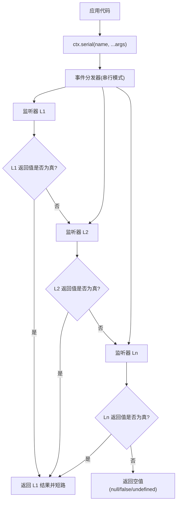
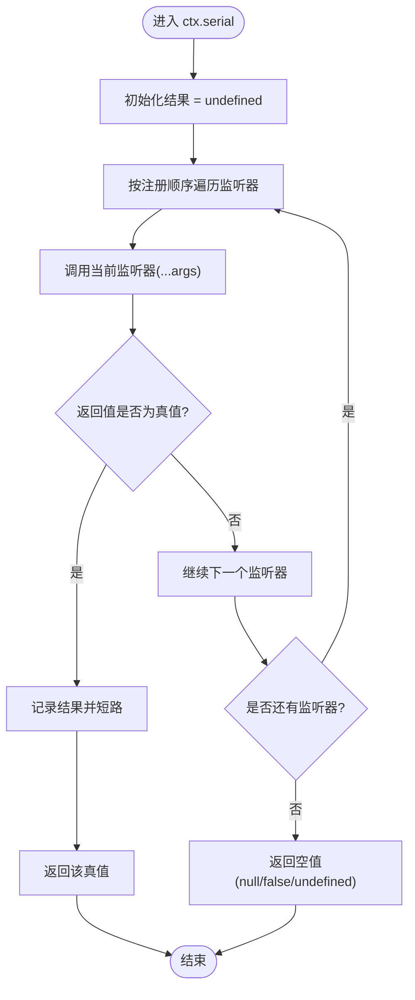

# Serial 模式（串行执行）

<cite>
**本文引用的文件**
- [packages/extensions/cordis-client-runner/src/client/api-catalog.ts](file://packages/extensions/cordis-client-runner/src/client/api-catalog.ts)
- [scripts/gen-cordis-catalog.ts](file://scripts/gen-cordis-catalog.ts)
- [packages/core/agent/src/dispatch.ts](file://packages/core/agent/src/dispatch.ts)
- [packages/core/agent/tests/agent.spec.ts](file://packages/core/agent/tests/agent.spec.ts)
- [packages/extensions/tool-cordis/src/api-catalog.ts](file://packages/extensions/tool-cordis/src/api-catalog.ts)
</cite>

## 目录
1. [简介](#简介)
2. [项目结构](#项目结构)
3. [核心组件](#核心组件)
4. [架构总览](#架构总览)
5. [详细组件分析](#详细组件分析)
6. [依赖关系分析](#依赖关系分析)
7. [性能考量](#性能考量)
8. [故障排查指南](#故障排查指南)
9. [结论](#结论)
10. [附录](#附录)

## 简介
本文件聚焦于 Cordis 上下文中的 serial 模式，即“串行执行”的事件分发机制。其调用方式为：
- await ctx.serial(name, ...args)

语义特征与行为约定如下：
- 顺序执行：按监听器注册顺序依次调用，前一个监听器的结果决定后续是否继续。
- 短路规则：当某个监听器返回非 null/false/undefined 的值时，立即停止后续监听器的执行，并将该返回值作为本次调用的最终结果。
- 收集与传播：若所有监听器均返回空值（null、false、undefined），则本次调用返回空值；否则返回第一个“真值”。

典型使用场景包括：
- 优先级决策链：多个策略按优先级尝试，命中即止。
- 条件匹配：按顺序匹配条件，首个满足者生效。
- 配置合并或覆盖：按优先级合并配置项，先出现的优先或后出现的覆盖，取决于业务约定。
- 插件式扩展点：多个贡献者实现同一扩展点，按序选择首个有效结果。

## 项目结构
serial 模式在项目中通过事件系统暴露给上层模块使用，并在多处被引用和验证。关键位置包括：
- API 目录中声明了 ctx.serial 的能力归属与用途说明。
- 生成脚本将 ctx.serial 纳入继承 API 清单，确保文档与运行时一致。
- Agent 调度层对 ctx.serial 进行类型化封装与调用。
- 测试用例验证了串行监听器的执行顺序与短路行为。

[此图为概念流程示意，不直接映射具体源码文件]

## 核心组件
- 上下文 API 声明：在客户端 API 目录中，将 ctx.serial 与其他事件分发方法并列声明，表明其属于继承的 ctx 能力集。
- 文档生成脚本：将 ctx.serial 纳入继承 API 列表，保证生成的 API 文档与运行时一致。
- Agent 调度层：对 ctx.serial 进行类型化包装，确保在 Agent 上下文中以正确签名调用。
- 测试用例：验证串行监听器的执行顺序以及短路行为。

章节来源
- [packages/extensions/cordis-client-runner/src/client/api-catalog.ts:870-882](file://packages/extensions/cordis-client-runner/src/client/api-catalog.ts#L870-L882)
- [scripts/gen-cordis-catalog.ts:640-650](file://scripts/gen-cordis-catalog.ts#L640-L650)
- [packages/core/agent/src/dispatch.ts:140-140](file://packages/core/agent/src/dispatch.ts#L140-L140)
- [packages/core/agent/tests/agent.spec.ts:321-321](file://packages/core/agent/tests/agent.spec.ts#L321-L321)

## 架构总览
从调用方到监听器的执行路径如下：
- 调用方通过 ctx.serial 发起一次串行事件分发。
- 事件分发器按注册顺序遍历监听器集合。
- 每个监听器执行后检查返回值：
  - 若为真值（非 null/false/undefined），立即短路并返回该值。
  - 若为空值，继续下一个监听器。
- 若全部为空值，返回空值。

[此图为概念序列图，展示串行短路的通用流程]

## 详细组件分析

### 组件：ctx.serial 的 API 声明与文档
- 作用：在继承的 ctx API 中声明 ctx.serial，并将其与 ctx.emit、ctx.parallel、ctx.bail、ctx.waterfall 并列，体现其在事件分发家族中的地位。
- 影响：确保工具链、IDE 提示与文档生成能识别该 API。

章节来源
- [packages/extensions/cordis-client-runner/src/client/api-catalog.ts:870-882](file://packages/extensions/cordis-client-runner/src/client/api-catalog.ts#L870-L882)
- [packages/extensions/tool-cordis/src/api-catalog.ts:4653-4653](file://packages/extensions/tool-cordis/src/api-catalog.ts#L4653-L4653)

### 组件：文档生成脚本对 ctx.serial 的收录
- 作用：将 ctx.serial 纳入继承 API 清单，使生成的 API 页面包含该方法的描述与来源定位。
- 影响：保障文档与实现的一致性，便于开发者查阅。

章节来源
- [scripts/gen-cordis-catalog.ts:640-650](file://scripts/gen-cordis-catalog.ts#L640-L650)

### 组件：Agent 调度层对 ctx.serial 的类型化封装
- 作用：在 Agent 调度层对 ctx.serial 进行类型化包装，确保在 Agent 上下文中以正确的 thisArg、name、...args 形式调用。
- 影响：提升类型安全与可维护性，避免误用。

章节来源
- [packages/core/agent/src/dispatch.ts:140-140](file://packages/core/agent/src/dispatch.ts#L140-L140)

### 组件：测试用例验证串行执行与短路
- 作用：验证串行监听器的执行顺序与短路行为，确保实现符合预期。
- 影响：提供回归保障，防止后续改动破坏串行语义。

章节来源
- [packages/core/agent/tests/agent.spec.ts:321-321](file://packages/core/agent/tests/agent.spec.ts#L321-L321)

### 执行流程图（算法级）
以下流程图展示了串行分发的核心逻辑，包括短路判断与返回值处理：

[此图为概念流程图，用于解释串行短路的内部逻辑]

## 依赖关系分析
- 调用方依赖 ctx.serial 的语义契约：顺序执行、短路规则、返回值约定。
- 事件分发器依赖监听器注册顺序：顺序不可变，短路由返回值驱动。
- 测试用例依赖实现细节：确保顺序与短路行为稳定。

[此图为概念依赖图，展示调用链与数据流向]

## 性能考量
- 时间复杂度：最坏情况下 O(n)，n 为监听器数量；平均情况取决于短路位置。
- 空间复杂度：O(1)，仅维护当前结果与迭代状态。
- 优化建议：
  - 将高概率命中的监听器置于靠前位置，减少平均执行成本。
  - 避免在监听器中进行昂贵计算，除非确有必要。
  - 合理拆分监听器职责，保持单一职责，便于短路命中。

[本节为通用指导，不直接分析具体文件]

## 故障排查指南
常见问题与排查要点：
- 未命中任何监听器：确认至少有一个监听器返回真值，否则返回空值。
- 短路不符合预期：检查监听器返回值是否为 null/false/undefined；确保业务逻辑正确返回期望的真值。
- 顺序问题：确认监听器注册顺序是否符合业务优先级；必要时调整注册顺序。
- 调试技巧：
  - 在监听器入口打印参数与返回值，观察执行路径。
  - 逐步缩小监听器范围，定位短路发生点。
  - 使用最小复现用例验证串行语义。

[本节为通用指导，不直接分析具体文件]

## 结论
serial 模式提供了简单而强大的串行执行机制，适用于需要按顺序尝试多个策略或条件的场景。通过明确的短路规则与返回值约定，开发者可以构建清晰、可预测的决策链。结合合理的监听器设计与注册顺序，能够在保证性能的同时实现灵活的扩展点。

[本节为总结性内容，不直接分析具体文件]

## 附录
- 使用示例（概念性）：
  - 优先级决策链：多个策略按优先级尝试，首个返回真值的策略生效。
  - 条件匹配：按顺序匹配条件，首个满足的条件对应的处理器执行。
  - 配置合并：按优先级合并配置项，先出现的优先或后出现的覆盖，依据业务约定。
- 最佳实践：
  - 明确监听器职责，避免副作用。
  - 合理设置监听器顺序，提高命中率。
  - 在监听器中尽早返回真值，减少不必要执行。

[本节为概念性内容，不直接分析具体文件]