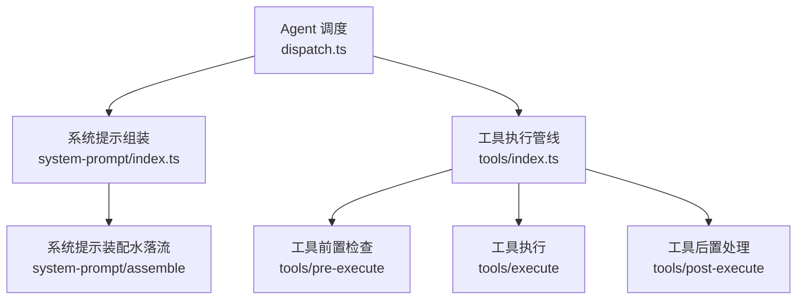
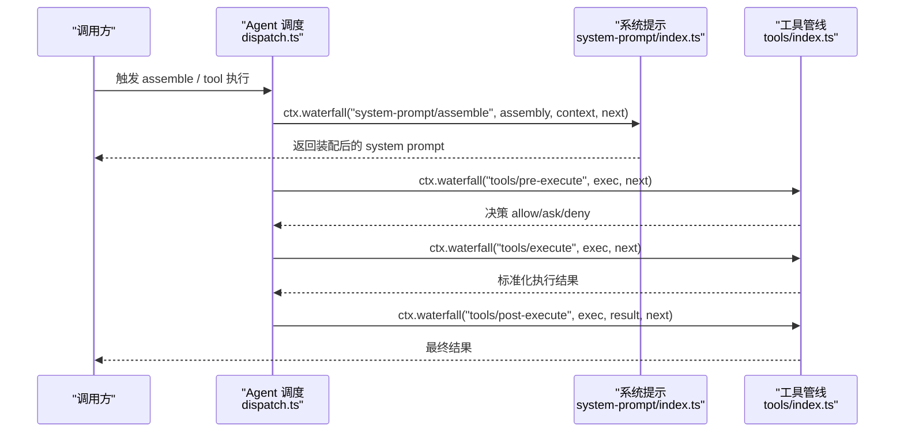
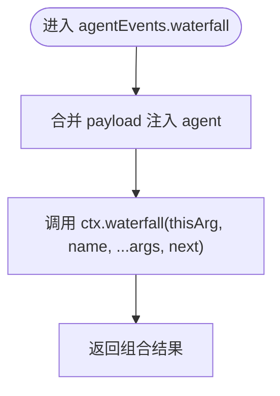
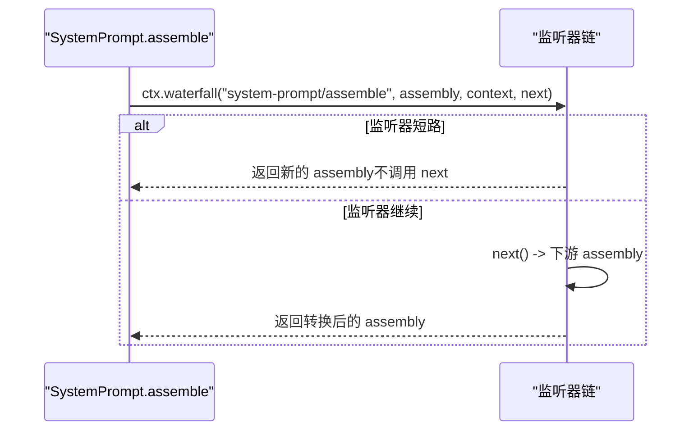
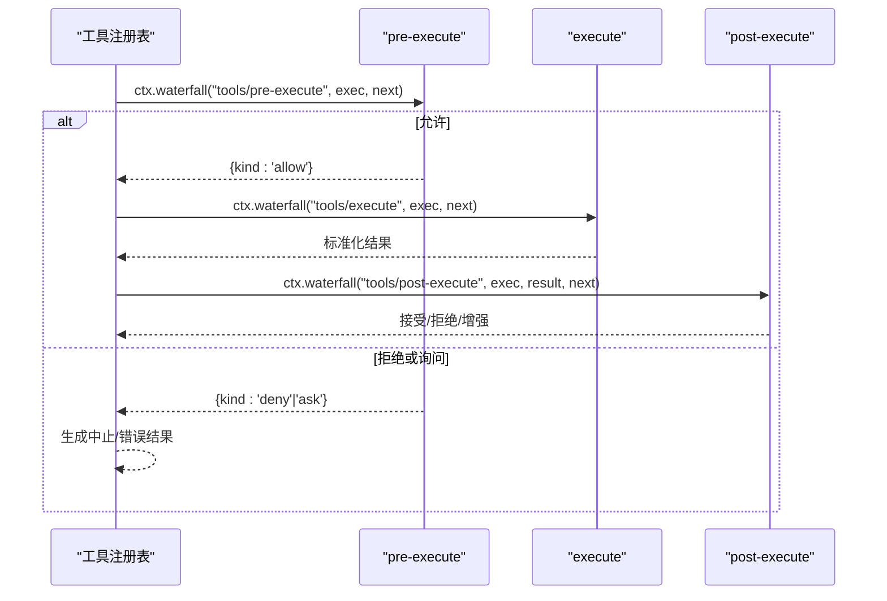
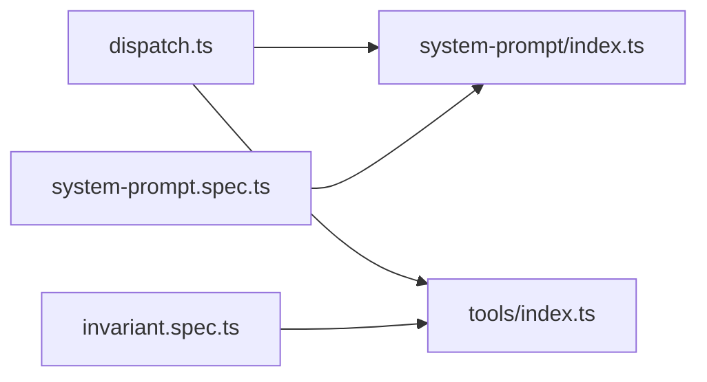

# Waterfall 模式（瀑布流）

<cite>
**本文引用的文件**
- [packages/core/agent/src/dispatch.ts](file://packages/core/agent/src/dispatch.ts)
- [packages/core/system-prompt/src/index.ts](file://packages/core/system-prompt/src/index.ts)
- [packages/core/tools/src/index.ts](file://packages/core/tools/src/index.ts)
- [packages/core/system-prompt/tests/system-prompt.spec.ts](file://packages/core/system-prompt/tests/system-prompt.spec.ts)
- [packages/core/tools/tests/invariant.spec.ts](file://packages/core/tools/tests/invariant.spec.ts)
- [packages/host/apiproxy/tests/api-proxy-approval.spec.ts](file://packages/host/apiproxy/tests/api-proxy-approval.spec.ts)
</cite>

## 目录
1. [简介](#简介)
2. [项目结构](#项目结构)
3. [核心组件](#核心组件)
4. [架构总览](#架构总览)
5. [详细组件分析](#详细组件分析)
6. [依赖关系分析](#依赖关系分析)
7. [性能考量](#性能考量)
8. [故障排查指南](#故障排查指南)
9. [结论](#结论)
10. [附录：典型用法与最佳实践](#附录：典型用法与最佳实践)

## 简介
Waterfall 模式在本仓库中作为“中间件拦截链”的核心机制，用于在关键路径上对数据进行转换、策略校验或流程短路。调用方式为 ctx.waterfall(name, ...args, next)，其中最后一个参数是 next() 延续函数；监听器通过调用 next() 将控制权交给下游，或通过返回不调用 next() 来短路剩余链路并覆盖后续结果。该模式广泛用于系统提示组装、工具执行前后处理、审批策略等场景。

## 项目结构
围绕 waterfall 的关键代码分布在以下位置：
- 事件调度与 Agent 作用域融合：packages/core/agent/src/dispatch.ts
- 系统提示组装的 waterfall 钩子：packages/core/system-prompt/src/index.ts
- 工具执行管线的前置/执行/后置 waterfall：packages/core/tools/src/index.ts
- 测试用例展示短路、顺序、冻结结果等契约：packages/core/system-prompt/tests/system-prompt.spec.ts、packages/core/tools/tests/invariant.spec.ts
- 审批请求的水下流示例：packages/host/apiproxy/tests/api-proxy-approval.spec.ts

图表来源
- [packages/core/agent/src/dispatch.ts:107-147](file://packages/core/agent/src/dispatch.ts#L107-L147)
- [packages/core/system-prompt/src/index.ts:532-535](file://packages/core/system-prompt/src/index.ts#L532-L535)
- [packages/core/tools/src/index.ts:1475-1506](file://packages/core/tools/src/index.ts#L1475-L1506)
- [packages/core/tools/src/index.ts:1573-1599](file://packages/core/tools/src/index.ts#L1573-L1599)

章节来源
- [packages/core/agent/src/dispatch.ts:107-147](file://packages/core/agent/src/dispatch.ts#L107-L147)
- [packages/core/system-prompt/src/index.ts:532-535](file://packages/core/system-prompt/src/index.ts#L532-L535)
- [packages/core/tools/src/index.ts:1475-1506](file://packages/core/tools/src/index.ts#L1475-L1506)
- [packages/core/tools/src/index.ts:1573-1599](file://packages/core/tools/src/index.ts#L1573-L1599)

## 核心组件
- 上下文 waterfal 入口：ctx.waterfall(thisArg, name, ...args, next)。Agent 作用域下的便捷封装 agentEvents(ctx, agent).waterfall(...) 会自动注入 thisArg 和 payload.agent，保证作用域与主体一致。
- 监听器签名：(payload, ...rest, next) => result。next() 返回下游结果；若监听器不调用 next() 而直接返回，则短路并替换下游结果。
- 语义特征：
  - 有序链式调用：监听器按注册顺序依次执行。
  - 可转换下游返回值：通过 return next(...) 修改下游结果。
  - 可短路：不调用 next() 即终止后续监听器，并返回当前值。
  - 错误隔离：单个监听器抛错不影响其他监听器（emit 场景），但 waterfall 通常由调用方捕获异常。
  - 作用域过滤：通过 thisArg 限定监听器范围（如 agent 作用域）。

章节来源
- [packages/core/agent/src/dispatch.ts:54-82](file://packages/core/agent/src/dispatch.ts#L54-L82)
- [packages/core/agent/src/dispatch.ts:107-147](file://packages/core/agent/src/dispatch.ts#L107-L147)

## 架构总览
下图展示了 waterfall 在系统提示组装与工具执行中的整体协作关系。

图表来源
- [packages/core/system-prompt/src/index.ts:532-535](file://packages/core/system-prompt/src/index.ts#L532-L535)
- [packages/core/tools/src/index.ts:1475-1506](file://packages/core/tools/src/index.ts#L1475-L1506)
- [packages/core/tools/src/index.ts:1573-1599](file://packages/core/tools/src/index.ts#L1573-L1599)
- [packages/core/agent/src/dispatch.ts:107-147](file://packages/core/agent/src/dispatch.ts#L107-L147)

## 详细组件分析

### 组件A：Agent 作用域的 Waterfall 封装
- 职责：为 Agent 主题事件提供 emit、serial、waterfall 三种分发方式，自动注入 thisArg 与 payload.agent，确保作用域与主体一致。
- 关键点：
  - waterfall 方法将 (carrier, name, fused(payload), ...rest) 透传到 ctx.waterfall。
  - 类型层面保留事件参数元组，使 next 的类型与事件声明一致。

图表来源
- [packages/core/agent/src/dispatch.ts:107-147](file://packages/core/agent/src/dispatch.ts#L107-L147)

章节来源
- [packages/core/agent/src/dispatch.ts:54-82](file://packages/core/agent/src/dispatch.ts#L54-L82)
- [packages/core/agent/src/dispatch.ts:107-147](file://packages/core/agent/src/dispatch.ts#L107-L147)

### 组件B：系统提示装配 Waterfall
- 钩子名：system-prompt/assemble
- 数据流：构建 sections、contexts、tools、variables 后，通过 ctx.waterfall 交由监听器转换；默认 next() 返回 assembly。
- 短路行为：监听器若不调用 next() 直接返回新 assembly，即可完全替换下游装配结果。

图表来源
- [packages/core/system-prompt/src/index.ts:532-535](file://packages/core/system-prompt/src/index.ts#L532-L535)
- [packages/core/system-prompt/tests/system-prompt.spec.ts:273-284](file://packages/core/system-prompt/tests/system-prompt.spec.ts#L273-L284)

章节来源
- [packages/core/system-prompt/src/index.ts:532-535](file://packages/core/system-prompt/src/index.ts#L532-L535)
- [packages/core/system-prompt/tests/system-prompt.spec.ts:273-284](file://packages/core/system-prompt/tests/system-prompt.spec.ts#L273-L284)

### 组件C：工具执行管线 Waterfall
- 钩子名与阶段：
  - tools/pre-execute：决定 allow/ask/deny，支持审批交互。
  - tools/execute：实际执行工具体，返回标准化结果。
  - tools/post-execute：对结果进行接受/拒绝/增强。
- 短路/否决：
  - pre-execute 返回 deny 会阻止执行，并生成错误结果。
  - post-execute 可接受或拒绝上游结果，甚至将错误包装为最终结果。
- 信号与取消：执行过程中会处理 caller 取消信号，并在 finally 中恢复信号。

图表来源
- [packages/core/tools/src/index.ts:1475-1506](file://packages/core/tools/src/index.ts#L1475-L1506)
- [packages/core/tools/src/index.ts:1573-1599](file://packages/core/tools/src/index.ts#L1573-L1599)

章节来源
- [packages/core/tools/src/index.ts:1475-1506](file://packages/core/tools/src/index.ts#L1475-L1506)
- [packages/core/tools/src/index.ts:1573-1599](file://packages/core/tools/src/index.ts#L1573-L1599)

### 组件D：审批策略拦截（示例）
- 使用 ctx.waterfall('approval/request', payload, next) 实现审批策略拦截。
- 监听器可基于 agent、toolName 等上下文决定是否可用或需要用户确认。

章节来源
- [packages/host/apiproxy/tests/api-proxy-approval.spec.ts:315-327](file://packages/host/apiproxy/tests/api-proxy-approval.spec.ts#L315-L327)

## 依赖关系分析
- dispatch.ts 依赖 Cordis 上下文的事件分发能力，并通过 scopeTarget 绑定 Agent 作用域。
- system-prompt/index.ts 依赖 ctx.waterfall 完成装配阶段的扩展点。
- tools/index.ts 在多个阶段使用 ctx.waterfall 串联策略与执行逻辑，并对结果进行规范化与最终化。
- 测试文件验证了短路、顺序、冻结结果等契约，确保行为稳定。

图表来源
- [packages/core/agent/src/dispatch.ts:107-147](file://packages/core/agent/src/dispatch.ts#L107-L147)
- [packages/core/system-prompt/src/index.ts:532-535](file://packages/core/system-prompt/src/index.ts#L532-L535)
- [packages/core/tools/src/index.ts:1475-1506](file://packages/core/tools/src/index.ts#L1475-L1506)
- [packages/core/system-prompt/tests/system-prompt.spec.ts:273-284](file://packages/core/system-prompt/tests/system-prompt.spec.ts#L273-L284)
- [packages/core/tools/tests/invariant.spec.ts:40-78](file://packages/core/tools/tests/invariant.spec.ts#L40-L78)

章节来源
- [packages/core/agent/src/dispatch.ts:107-147](file://packages/core/agent/src/dispatch.ts#L107-L147)
- [packages/core/system-prompt/src/index.ts:532-535](file://packages/core/system-prompt/src/index.ts#L532-L535)
- [packages/core/tools/src/index.ts:1475-1506](file://packages/core/tools/src/index.ts#L1475-L1506)
- [packages/core/system-prompt/tests/system-prompt.spec.ts:273-284](file://packages/core/system-prompt/tests/system-prompt.spec.ts#L273-L284)
- [packages/core/tools/tests/invariant.spec.ts:40-78](file://packages/core/tools/tests/invariant.spec.ts#L40-L78)

## 性能考量
- 避免在 hot path 中进行昂贵计算：waterfall 监听器应轻量，必要时缓存或延迟计算。
- 短路优先：能短路的监听器尽早返回，减少后续监听器的开销。
- 作用域过滤：通过 thisArg 限制监听器集合，降低无关监听器的遍历成本。
- 结果不可变：工具管线中对结果进行冻结，避免深拷贝与意外变更带来的性能损耗。

[本节为通用指导，不直接分析具体文件]

## 故障排查指南
- 未调用 next() 导致流程卡住：确认观察型监听器是否调用了 next()；仅有意短路时才不调用 next()。
- 重复或乱序阶段：工具管线要求严格的阶段顺序（pre-execute -> execute -> post-execute），违反将抛出错误。
- 结果未冻结：工具执行结果需冻结，否则可能触发不变量检查失败。
- 作用域不匹配：确保 thisArg 与 payload.agent 一致，避免监听器被错误过滤。

章节来源
- [packages/core/tools/tests/invariant.spec.ts:66-78](file://packages/core/tools/tests/invariant.spec.ts#L66-L78)
- [packages/core/system-prompt/tests/system-prompt.spec.ts:273-284](file://packages/core/system-prompt/tests/system-prompt.spec.ts#L273-L284)

## 结论
Waterfall 模式在本仓库中提供了统一且强大的中间件拦截机制，贯穿系统提示装配与工具执行等关键路径。通过 next() 延续与短路返回，开发者可以灵活地转换数据、实施策略与拦截请求。遵循最佳实践（观察型监听器必须调用 next()，仅在有意短路时返回）可确保流程健壮性与可维护性。

[本节为总结，不直接分析具体文件]

## 附录：典型用法与最佳实践

### 调用语义
- 调用方式：ctx.waterfall(name, ...args, next)
- 监听器签名：(payload, ...rest, next) => result
- 语义要点：
  - 有序链式调用，next() 传递到下游。
  - 返回不调用 next() 即短路并覆盖下游结果。
  - 可通过 return next(transformed) 转换下游返回值。

章节来源
- [packages/core/agent/src/dispatch.ts:54-82](file://packages/core/agent/src/dispatch.ts#L54-L82)
- [packages/core/agent/src/dispatch.ts:107-147](file://packages/core/agent/src/dispatch.ts#L107-L147)

### 数据转换示例（系统提示装配）
- 场景：在 system-prompt/assemble 中替换或增强 sections、contexts、tools、variables。
- 行为：监听器可返回新的 assembly 以短路；也可调用 next() 并转换其返回值。

章节来源
- [packages/core/system-prompt/src/index.ts:532-535](file://packages/core/system-prompt/src/index.ts#L532-L535)
- [packages/core/system-prompt/tests/system-prompt.spec.ts:273-284](file://packages/core/system-prompt/tests/system-prompt.spec.ts#L273-L284)

### 权限检查示例（工具前置）
- 场景：在 tools/pre-execute 中根据 agent、toolName 等上下文进行权限校验。
- 行为：返回 deny 阻止执行；返回 ask 触发审批；返回 allow 继续执行。

章节来源
- [packages/core/tools/src/index.ts:1475-1506](file://packages/core/tools/src/index.ts#L1475-L1506)

### 请求拦截示例（审批策略）
- 场景：在 approval/request 中实现审批策略拦截。
- 行为：监听器可基于上下文决定是否可用或需要用户确认。

章节来源
- [packages/host/apiproxy/tests/api-proxy-approval.spec.ts:315-327](file://packages/host/apiproxy/tests/api-proxy-approval.spec.ts#L315-L327)

### 否决（Veto）机制
- 原理：监听器不调用 next() 直接返回，即为否决/短路，覆盖下游结果。
- 使用方式：在 tools/pre-execute 返回 deny；或在 system-prompt/assemble 返回新的 assembly。

章节来源
- [packages/core/system-prompt/tests/system-prompt.spec.ts:273-284](file://packages/core/system-prompt/tests/system-prompt.spec.ts#L273-L284)
- [packages/core/tools/src/index.ts:1475-1506](file://packages/core/tools/src/index.ts#L1475-L1506)

### 最佳实践
- 观察型监听器必须调用 next()，除非有意短路。
- 短路监听器应明确意图，并返回合理的替代结果。
- 保持监听器轻量，避免阻塞 hot path。
- 严格遵守工具管线的阶段顺序与结果冻结约束。

章节来源
- [packages/core/tools/tests/invariant.spec.ts:66-78](file://packages/core/tools/tests/invariant.spec.ts#L66-L78)
- [packages/core/system-prompt/tests/system-prompt.spec.ts:273-284](file://packages/core/system-prompt/tests/system-prompt.spec.ts#L273-L284)