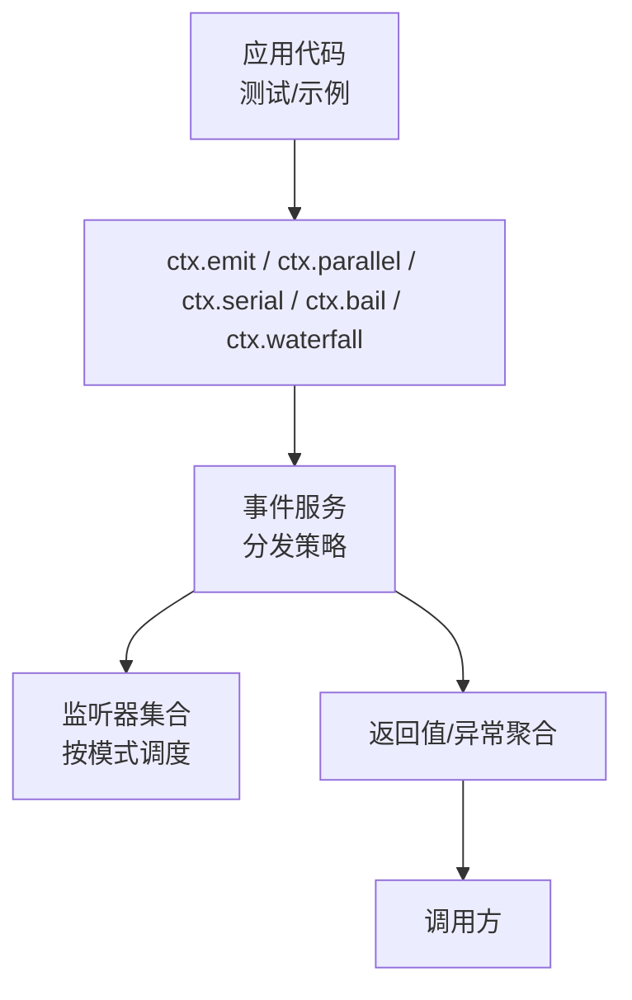
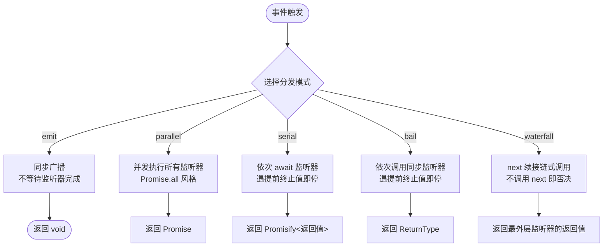
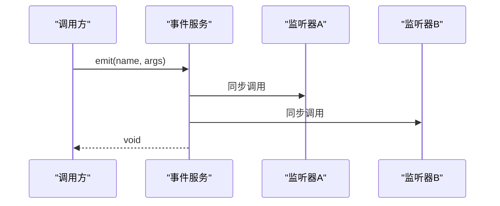
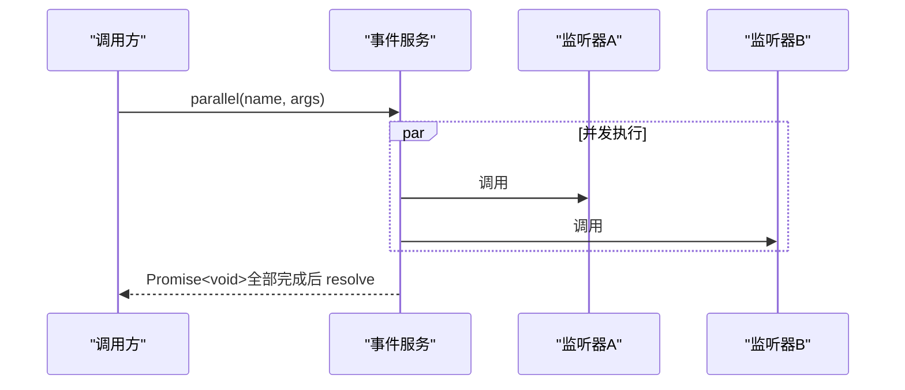
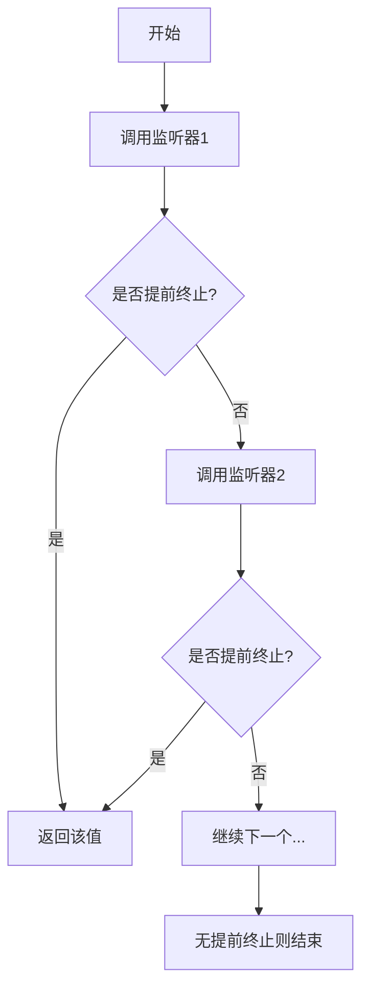
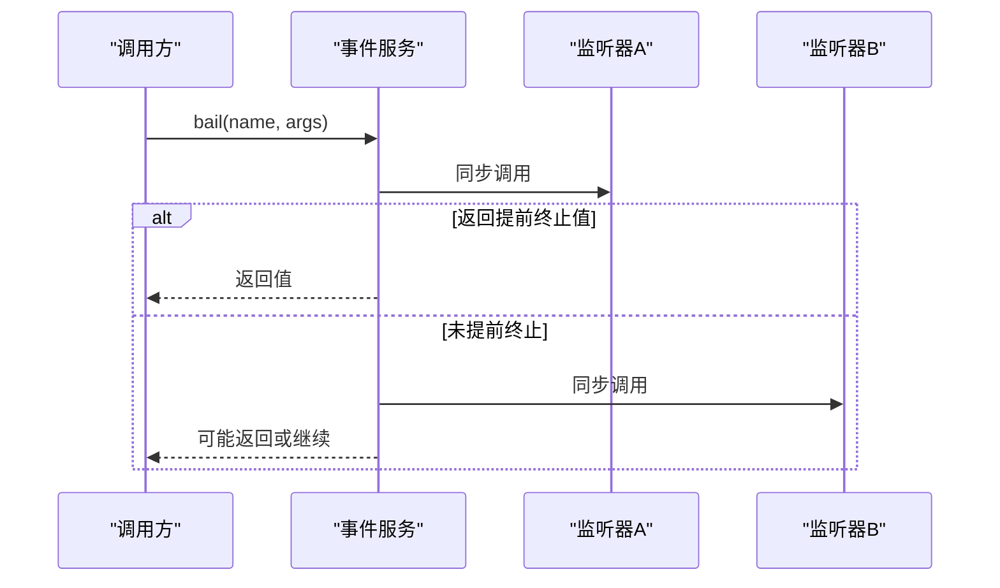
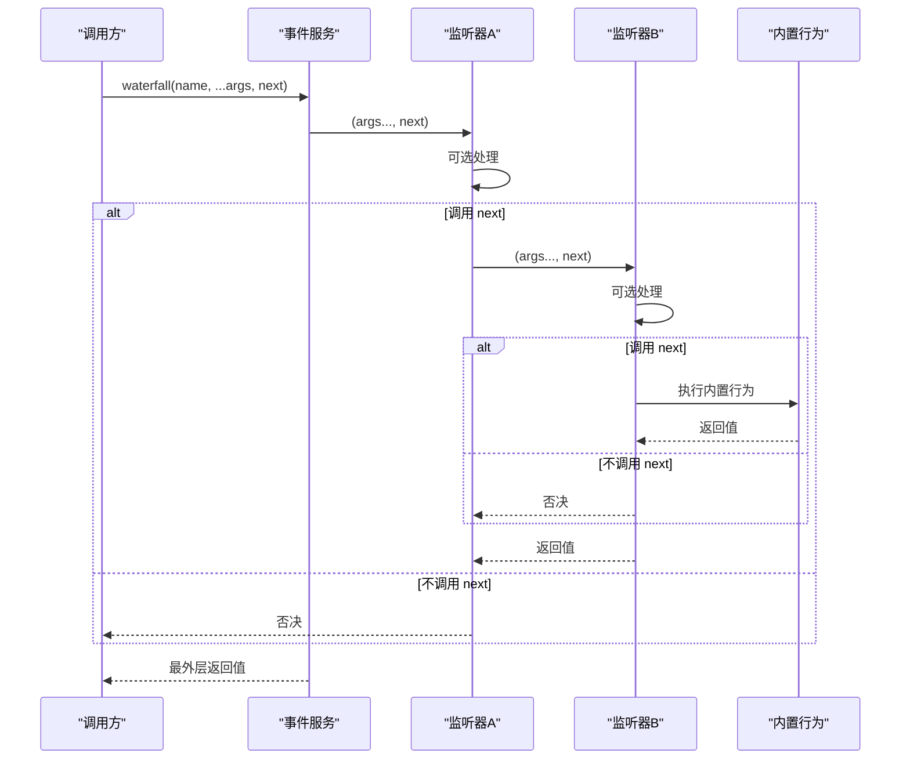
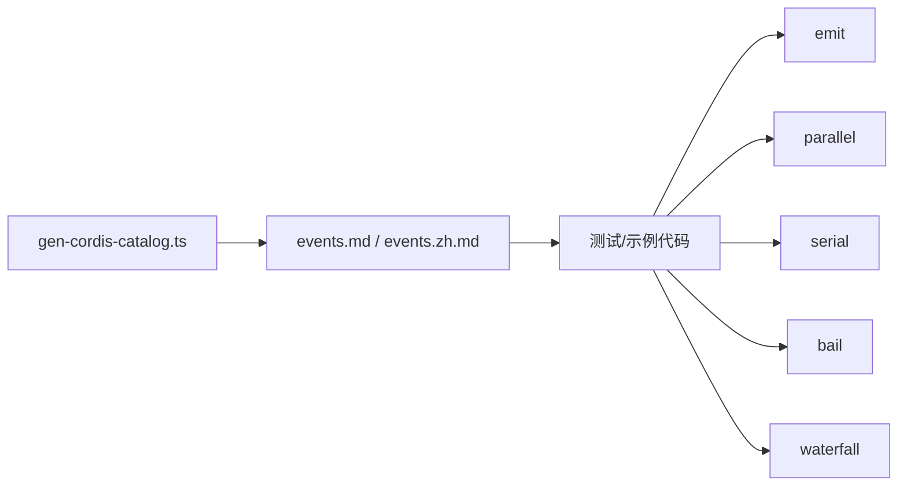

# 事件分发模式

<cite>
**本文引用的文件**
- [docs/cordis-api/events.md](file://docs/cordis-api/events.md)
- [docs/cordis-api/events.zh.md](file://docs/cordis-api/events.zh.md)
- [scripts/gen-cordis-catalog.ts](file://scripts/gen-cordis-catalog.ts)
- [apps/cli/tests/fixtures/dsh-badge/snapshot.ts](file://apps/cli/tests/fixtures/dsh-badge/snapshot.ts)
- [packages/context/agent-instructions/tests/agent-instructions.spec.ts](file://packages/context/agent-instructions/tests/agent-instructions.spec.ts)
- [packages/compaction/compaction-basic/tests/compaction-basic.spec.ts](file://packages/compaction/compaction-basic/tests/compaction-basic.spec.ts)
</cite>

## 目录
1. [简介](#简介)
2. [项目结构](#项目结构)
3. [核心组件](#核心组件)
4. [架构总览](#架构总览)
5. [详细组件分析](#详细组件分析)
6. [依赖关系分析](#依赖关系分析)
7. [性能考量](#性能考量)
8. [故障排查指南](#故障排查指南)
9. [结论](#结论)
10. [附录](#附录)

## 简介
本文件围绕 Harness 的事件系统，系统化阐述五种分发模式的语义差异与适用场景：emit（同步广播）、parallel（并行执行）、serial（串行等待并短路）、bail（同步短路）和 waterfall（瀑布流）。内容涵盖调用方式、返回值处理、错误传播机制、执行顺序、结果收集策略，以及在不同业务场景下的选择建议。文档同时给出流程图与时序图，帮助读者快速理解各模式的运行机理。

## 项目结构
事件分发 API 通过上下文混入到每个子系统，并在各子系统的页面中声明事件及其分发模式。API 的签名与行为由生成脚本从 vendor 层抽取并输出为文档；实际使用在多个测试与示例中以不同模式进行验证。

图表来源
- [docs/cordis-api/events.md:8-123](file://docs/cordis-api/events.md#L8-L123)
- [docs/cordis-api/events.zh.md:10-125](file://docs/cordis-api/events.zh.md#L10-L125)

章节来源
- [docs/cordis-api/events.md:1-208](file://docs/cordis-api/events.md#L1-L208)
- [docs/cordis-api/events.zh.md:1-210](file://docs/cordis-api/events.zh.md#L1-L210)

## 核心组件
- 分发模式类型：DispatchMode = 'emit' | 'parallel' | 'serial' | 'bail' | 'waterfall'
- 上下文方法：
  - ctx.emit(name, ...args)：同步广播，忽略返回值
  - ctx.parallel(name, ...args)：并发执行所有监听器，Promise 在所有监听器完成后兑现
  - ctx.serial(name, ...args)：按序等待监听器，遇到第一个“提前终止值”即停止
  - ctx.bail(name, ...args)：按序调用同步监听器，遇到第一个“提前终止值”即停止
  - ctx.waterfall(name, ...args)：最后一个参数为 next 续接回调，监听器可包装链式执行，不调用 next 表示否决
- 监听器注册：
  - ctx.on(name, listener, options?)：注册归当前 fiber 所有的事件监听器，返回释放函数
  - ctx.once(name, listener, options?)：仅触发一次的 on

章节来源
- [docs/cordis-api/events.md:8-123](file://docs/cordis-api/events.md#L8-L123)
- [docs/cordis-api/events.zh.md:10-125](file://docs/cordis-api/events.zh.md#L10-L125)

## 架构总览
下图展示了五种分发模式在事件服务中的调度路径与结果聚合方式。

图表来源
- [docs/cordis-api/events.md:8-123](file://docs/cordis-api/events.md#L8-L123)
- [docs/cordis-api/events.zh.md:10-125](file://docs/cordis-api/events.zh.md#L10-L125)

## 详细组件分析

### emit（同步广播）
- 语义：同步调用所有监听器，不等待其完成，也不收集返回值。
- 调用方式：ctx.emit(name, ...args)
- 返回值：void
- 错误传播：由于不等待，监听器抛出的异步异常不会被捕获；同步异常会沿调用栈向上抛出。
- 执行顺序：按注册顺序同步调用。
- 典型场景：日志记录、指标上报等无需回传结果的副作用操作。

图表来源
- [docs/cordis-api/events.md:31-49](file://docs/cordis-api/events.md#L31-L49)
- [docs/cordis-api/events.zh.md:33-51](file://docs/cordis-api/events.zh.md#L33-L51)

章节来源
- [docs/cordis-api/events.md:31-49](file://docs/cordis-api/events.md#L31-L49)
- [docs/cordis-api/events.zh.md:33-51](file://docs/cordis-api/events.zh.md#L33-L51)

### parallel（并行执行）
- 语义：并发执行所有监听器，等待全部完成后返回。
- 调用方式：ctx.parallel(name, ...args)
- 返回值：Promise<void>，在所有监听器 settle 后兑现。
- 错误传播：任一监听器拒绝或抛出异常会导致整体失败（Promise.all 语义）。
- 执行顺序：无序并发。
- 典型场景：多路 I/O、统计汇总、互不依赖的副作用任务。

图表来源
- [docs/cordis-api/events.md:8-29](file://docs/cordis-api/events.md#L8-L29)
- [docs/cordis-api/events.zh.md:10-31](file://docs/cordis-api/events.zh.md#L10-L31)

章节来源
- [docs/cordis-api/events.md:8-29](file://docs/cordis-api/events.md#L8-L29)
- [docs/cordis-api/events.zh.md:10-31](file://docs/cordis-api/events.zh.md#L10-L31)

### serial（串行等待并短路）
- 语义：按序等待监听器，直到其中一个返回“提前终止值”（非 null、非 false、非 undefined）。
- 调用方式：ctx.serial(name, ...args)
- 返回值：Promisify<ReturnType>，首个“提前终止值”会被返回。
- 错误传播：若监听器抛出异常，将中断后续监听器并上抛。
- 执行顺序：严格有序，遇到提前终止值立即停止。
- 典型场景：权限校验链、配置解析链、条件路由。

图表来源
- [docs/cordis-api/events.md:51-72](file://docs/cordis-api/events.md#L51-L72)
- [docs/cordis-api/events.zh.md:53-74](file://docs/cordis-api/events.zh.md#L53-L74)

章节来源
- [docs/cordis-api/events.md:51-72](file://docs/cordis-api/events.md#L51-L72)
- [docs/cordis-api/events.zh.md:53-74](file://docs/cordis-api/events.zh.md#L53-L74)

### bail（同步短路）
- 语义：按序调用同步监听器，遇到第一个“提前终止值”立即停止。
- 调用方式：ctx.bail(name, ...args)
- 返回值：ReturnType，首个“提前终止值”。
- 错误传播：同步异常会中断后续监听器并上抛。
- 执行顺序：严格有序，遇到提前终止值立即停止。
- 典型场景：同步决策链、快速失败的路由判断。

图表来源
- [docs/cordis-api/events.md:74-95](file://docs/cordis-api/events.md#L74-L95)
- [docs/cordis-api/events.zh.md:76-97](file://docs/cordis-api/events.zh.md#L76-L97)

章节来源
- [docs/cordis-api/events.md:74-95](file://docs/cordis-api/events.md#L74-L95)
- [docs/cordis-api/events.zh.md:76-97](file://docs/cordis-api/events.zh.md#L76-L97)

### waterfall（瀑布流）
- 语义：最后一个参数为 next 续接回调；监听器可选择调用 next 进入下一环，不调用则表示否决。
- 调用方式：ctx.waterfall(name, ...args)
- 返回值：最外层监听器的返回值。
- 错误传播：任一监听器抛出异常将中断后续链并上抛。
- 执行顺序：嵌套链式，显式通过 next 推进。
- 典型场景：中间件管道、请求预处理/后处理、审计与脱敏链路。

图表来源
- [docs/cordis-api/events.md:97-123](file://docs/cordis-api/events.md#L97-L123)
- [docs/cordis-api/events.zh.md:99-125](file://docs/cordis-api/events.zh.md#L99-L125)

章节来源
- [docs/cordis-api/events.md:97-123](file://docs/cordis-api/events.md#L97-L123)
- [docs/cordis-api/events.zh.md:99-125](file://docs/cordis-api/events.zh.md#L99-L125)

## 依赖关系分析
- 文档生成：脚本从 vendor 层抽取事件 API 并生成文档，确保 API 描述与实际实现一致。
- 使用位置：多处测试与示例以不同模式调用事件，验证行为与边界。

图表来源
- [scripts/gen-cordis-catalog.ts:33-58](file://scripts/gen-cordis-catalog.ts#L33-L58)
- [scripts/gen-cordis-catalog.ts:623-632](file://scripts/gen-cordis-catalog.ts#L623-L632)

章节来源
- [scripts/gen-cordis-catalog.ts:33-58](file://scripts/gen-cordis-catalog.ts#L33-L58)
- [scripts/gen-cordis-catalog.ts:623-632](file://scripts/gen-cordis-catalog.ts#L623-L632)

## 性能考量
- emit：开销最小，适合纯副作用且无需回传结果的场景；注意避免阻塞主线程。
- parallel：吞吐高，但需控制并发度以避免资源竞争；适用于独立 I/O 或计算密集型任务。
- serial：保证顺序与短路，适合有依赖或需要快速失败的链路；注意长链路时的延迟累积。
- bail：同步短路，最快反馈；适合轻量级同步决策。
- waterfall：灵活可控，适合复杂中间件链；注意避免过深的嵌套导致可读性与维护性下降。

[本节为通用指导，不直接分析具体文件]

## 故障排查指南
- 确认分发模式是否符合预期：
  - 需要并发且容忍部分失败？考虑 parallel。
  - 需要顺序且快速失败？考虑 serial 或 bail。
  - 需要中间件式拦截/改写？考虑 waterfall。
  - 仅需通知且无需结果？考虑 emit。
- 检查监听器是否意外否决了 waterfall 链（未调用 next）。
- 检查 serial/bail 的“提前终止值”约定（非 null、非 false、非 undefined）。
- 对 parallel 的错误进行聚合处理，定位失败监听器。
- 在 waterfall 中打印关键节点日志，便于追踪 next 调用路径。

章节来源
- [docs/cordis-api/events.md:8-123](file://docs/cordis-api/events.md#L8-L123)
- [docs/cordis-api/events.zh.md:10-125](file://docs/cordis-api/events.zh.md#L10-L125)

## 结论
- emit 用于“发后即忘”的通知型事件。
- parallel 用于“全量并发”的高吞吐场景。
- serial 用于“顺序执行+短路”的可控流程。
- bail 用于“同步快速失败”的决策链。
- waterfall 用于“中间件式组合”的可插拔管线。
根据业务对顺序、并发、失败策略与结果收集的需求选择合适的模式，可获得更清晰、更可维护的事件驱动架构。

[本节为总结，不直接分析具体文件]

## 附录
- 实际使用参考（测试/示例）：
  - waterfall 的使用示例：[apps/cli/tests/fixtures/dsh-badge/snapshot.ts:37](file://apps/cli/tests/fixtures/dsh-badge/snapshot.ts#L37)
  - waterfall 的多次断言与行为验证：[packages/context/agent-instructions/tests/agent-instructions.spec.ts:229-269](file://packages/context/agent-instructions/tests/agent-instructions.spec.ts#L229-L269)
  - waterfall 在压缩流程中的使用：[packages/compaction/compaction-basic/tests/compaction-basic.spec.ts:1439-1454](file://packages/compaction/compaction-basic/tests/compaction-basic.spec.ts#L1439-L1454)

章节来源
- [apps/cli/tests/fixtures/dsh-badge/snapshot.ts:37](file://apps/cli/tests/fixtures/dsh-badge/snapshot.ts#L37)
- [packages/context/agent-instructions/tests/agent-instructions.spec.ts:229-269](file://packages/context/agent-instructions/tests/agent-instructions.spec.ts#L229-L269)
- [packages/compaction/compaction-basic/tests/compaction-basic.spec.ts:1439-1454](file://packages/compaction/compaction-basic/tests/compaction-basic.spec.ts#L1439-L1454)